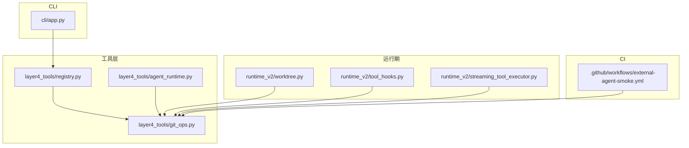
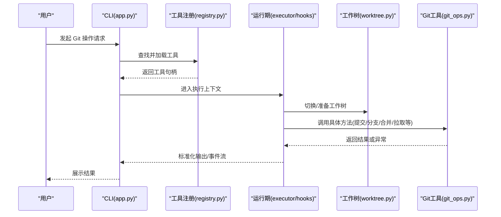
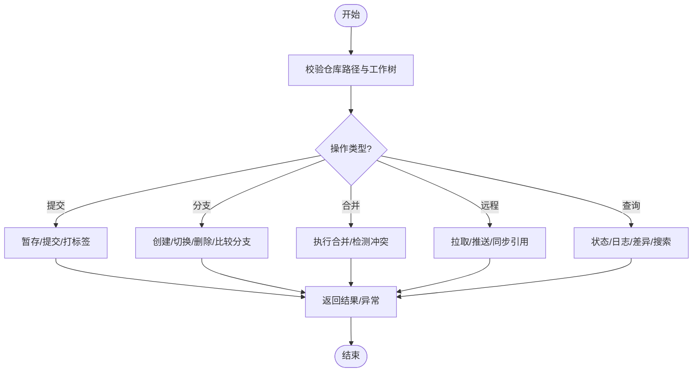
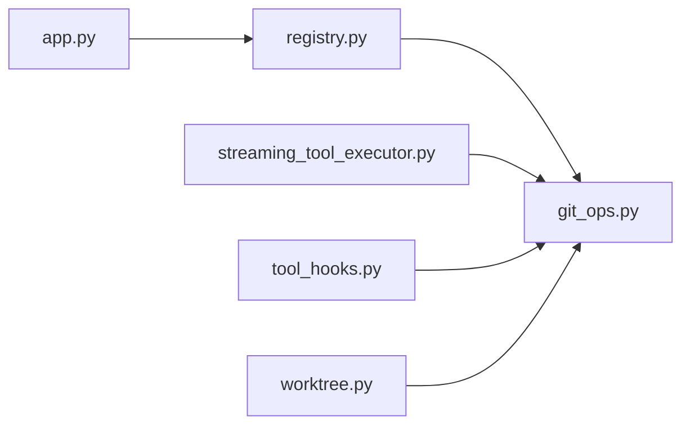

# Git操作工具

<cite>
**本文引用的文件**   
- [git_ops.py](file://opc/layer4_tools/git_ops.py)
- [app.py](file://opc/cli/app.py)
- [agent_runtime.py](file://opc/layer4_tools/agent_runtime.py)
- [registry.py](file://opc/layer4_tools/registry.py)
- [worktree.py](file://opc/layer3_agent/runtime_v2/worktree.py)
- [tool_hooks.py](file://opc/layer3_agent/runtime_v2/tool_hooks.py)
- [streaming_tool_executor.py](file://opc/layer3_agent/runtime_v2/streaming_tool_executor.py)
- [external-agent-smoke.yml](file://.github/workflows/external-agent-smoke.yml)
</cite>

## 目录
1. [简介](#简介)
2. [项目结构](#项目结构)
3. [核心组件](#核心组件)
4. [架构总览](#架构总览)
5. [详细组件分析](#详细组件分析)
6. [依赖关系分析](#依赖关系分析)
7. [性能与优化](#性能与优化)
8. [故障排查指南](#故障排查指南)
9. [结论](#结论)
10. [附录](#附录)

## 简介
本文件面向使用 OpenOPC 的开发者与团队，系统化说明仓库中的 Git 操作能力与集成方式。内容覆盖：
- 提交、分支管理、合并冲突解决、远程同步等常见仓库操作
- Git 钩子机制与自动化工作流（CI）
- 代码审查集成与 Pull Request 管理思路
- 大型仓库的性能优化策略与增量更新机制
- 团队协作最佳实践
- 历史查询与代码搜索能力
- 错误处理与冲突解决指南

OpenOPC 通过工具层暴露 Git 能力，并在运行时以“工作树”和“工具钩子”的方式组织执行上下文与可观测性，结合 GitHub Actions 实现外部代理冒烟测试等自动化流程。

## 项目结构
与 Git 操作相关的核心位置如下：
- 工具实现：opc/layer4_tools/git_ops.py
- CLI 入口：opc/cli/app.py
- 工具注册与发现：opc/layer4_tools/registry.py
- 运行期工作树与沙箱隔离：opc/layer3_agent/runtime_v2/worktree.py
- 工具钩子与执行编排：opc/layer3_agent/runtime_v2/tool_hooks.py、opc/layer3_agent/runtime_v2/streaming_tool_executor.py
- CI 流水线示例：.github/workflows/external-agent-smoke.yml

图表来源
- [app.py](file://opc/cli/app.py)
- [git_ops.py](file://opc/layer4_tools/git_ops.py)
- [registry.py](file://opc/layer4_tools/registry.py)
- [agent_runtime.py](file://opc/layer4_tools/agent_runtime.py)
- [worktree.py](file://opc/layer3_agent/runtime_v2/worktree.py)
- [tool_hooks.py](file://opc/layer3_agent/runtime_v2/tool_hooks.py)
- [streaming_tool_executor.py](file://opc/layer3_agent/runtime_v2/streaming_tool_executor.py)
- [external-agent-smoke.yml](file://.github/workflows/external-agent-smoke.yml)

章节来源
- [git_ops.py](file://opc/layer4_tools/git_ops.py)
- [app.py](file://opc/cli/app.py)
- [registry.py](file://opc/layer4_tools/registry.py)
- [agent_runtime.py](file://opc/layer4_tools/agent_runtime.py)
- [worktree.py](file://opc/layer3_agent/runtime_v2/worktree.py)
- [tool_hooks.py](file://opc/layer3_agent/runtime_v2/tool_hooks.py)
- [streaming_tool_executor.py](file://opc/layer3_agent/runtime_v2/streaming_tool_executor.py)
- [external-agent-smoke.yml](file://.github/workflows/external-agent-smoke.yml)

## 核心组件
- Git 工具实现：封装常用仓库操作（提交、分支、合并、远程同步、日志/差异、状态等），提供统一调用接口与错误包装。
- 工具注册中心：集中注册与发现工具，供上层调度器按名称或类别调用。
- 运行期工作树：为每次任务创建独立的工作树，避免污染主分支，支持并行安全执行。
- 工具钩子与执行器：在工具执行前后注入审计、日志、权限校验与资源清理等横切逻辑。
- CLI 入口：将用户意图转化为工具调用参数，驱动执行并输出结果。
- CI 流水线：在云端触发外部代理冒烟测试，验证关键路径。

章节来源
- [git_ops.py](file://opc/layer4_tools/git_ops.py)
- [registry.py](file://opc/layer4_tools/registry.py)
- [worktree.py](file://opc/layer3_agent/runtime_v2/worktree.py)
- [tool_hooks.py](file://opc/layer3_agent/runtime_v2/tool_hooks.py)
- [streaming_tool_executor.py](file://opc/layer3_agent/runtime_v2/streaming_tool_executor.py)
- [app.py](file://opc/cli/app.py)

## 架构总览
下图展示了从 CLI 到 Git 工具再到运行期环境的整体交互。

图表来源
- [app.py](file://opc/cli/app.py)
- [registry.py](file://opc/layer4_tools/registry.py)
- [streaming_tool_executor.py](file://opc/layer3_agent/runtime_v2/streaming_tool_executor.py)
- [tool_hooks.py](file://opc/layer3_agent/runtime_v2/tool_hooks.py)
- [worktree.py](file://opc/layer3_agent/runtime_v2/worktree.py)
- [git_ops.py](file://opc/layer4_tools/git_ops.py)

## 详细组件分析

### Git 工具实现（git_ops.py）
职责与能力
- 提交相关：暂存变更、创建提交、回滚/重置、打标签、查看提交历史与差异。
- 分支相关：列出分支、创建/删除/切换分支、比较分支差异。
- 合并与冲突：执行合并、检测冲突、生成冲突摘要、辅助定位冲突文件。
- 远程同步：配置远端、拉取/推送、获取远端引用、检查跟踪关系。
- 状态与查询：工作区状态、未跟踪文件、忽略规则生效情况。
- 错误处理：对底层命令失败进行统一包装，返回结构化错误信息。

典型调用路径
- CLI 或上层服务通过注册中心找到 git_ops 工具后，传入目标仓库路径与操作参数，工具在工作树下执行命令并返回结果。

图表来源
- [git_ops.py](file://opc/layer4_tools/git_ops.py)

章节来源
- [git_ops.py](file://opc/layer4_tools/git_ops.py)

### 工具注册与发现（registry.py）
- 负责工具的声明式注册、按名称或类别检索、版本兼容性与元数据管理。
- 为 CLI 与运行期提供统一的工具发现入口，便于扩展与维护。

章节来源
- [registry.py](file://opc/layer4_tools/registry.py)

### 运行期工作树（worktree.py）
- 为每次任务创建独立工作树，确保并发安全与隔离。
- 自动完成克隆/浅克隆、分支检出、权限与只读模式控制。
- 在执行结束后清理临时工作树，释放磁盘空间。

章节来源
- [worktree.py](file://opc/layer3_agent/runtime_v2/worktree.py)

### 工具钩子与执行器（tool_hooks.py, streaming_tool_executor.py）
- 工具钩子在工具执行前后注入审计、指标采集、权限校验、资源回收等横切逻辑。
- 流式执行器支持长耗时操作的进度上报与中断处理，提升用户体验与可观测性。

章节来源
- [tool_hooks.py](file://opc/layer3_agent/runtime_v2/tool_hooks.py)
- [streaming_tool_executor.py](file://opc/layer3_agent/runtime_v2/streaming_tool_executor.py)

### CLI 入口（app.py）
- 解析用户命令与参数，映射到对应工具方法。
- 负责输入校验、上下文初始化、结果格式化与错误提示。

章节来源
- [app.py](file://opc/cli/app.py)

### 外部代理冒烟测试（external-agent-smoke.yml）
- 定义云端流水线，触发外部代理冒烟测试，用于快速验证关键路径与集成点。
- 可作为 Git 相关变更的回归保障入口之一。

章节来源
- [external-agent-smoke.yml](file://.github/workflows/external-agent-smoke.yml)

## 依赖关系分析
- 低耦合：git_ops 仅关注 Git 操作语义；工作树与钩子由运行期注入，降低直接依赖。
- 高内聚：git_ops 内部按功能域组织方法，便于单元测试与复用。
- 外部依赖：Git 客户端、文件系统、网络（远程仓库）、CI 平台。

图表来源
- [registry.py](file://opc/layer4_tools/registry.py)
- [git_ops.py](file://opc/layer4_tools/git_ops.py)
- [app.py](file://opc/cli/app.py)
- [streaming_tool_executor.py](file://opc/layer3_agent/runtime_v2/streaming_tool_executor.py)
- [tool_hooks.py](file://opc/layer3_agent/runtime_v2/tool_hooks.py)
- [worktree.py](file://opc/layer3_agent/runtime_v2/worktree.py)

章节来源
- [registry.py](file://opc/layer4_tools/registry.py)
- [git_ops.py](file://opc/layer4_tools/git_ops.py)
- [app.py](file://opc/cli/app.py)
- [streaming_tool_executor.py](file://opc/layer3_agent/runtime_v2/streaming_tool_executor.py)
- [tool_hooks.py](file://opc/layer3_agent/runtime_v2/tool_hooks.py)
- [worktree.py](file://opc/layer3_agent/runtime_v2/worktree.py)

## 性能与优化
针对大型仓库与高频协作场景的建议：
- 浅克隆与按需深度：减少首次下载体积，缩短冷启动时间。
- 增量更新：优先使用 fetch + rebase 而非全量合并，降低网络与 CPU 开销。
- 并行化：多任务在不同工作树中并行执行，避免锁竞争。
- 缓存与索引：合理设置 Git 索引与对象缓存，减少重复 IO。
- 过滤与稀疏检出：仅拉取必要路径，降低磁盘占用。
- 批量化操作：合并多次小提交为大提交，减少历史膨胀。
- 监控与度量：记录关键步骤耗时，定位瓶颈。

[本节为通用指导，不直接分析具体文件]

## 故障排查指南
常见问题与处理建议：
- 认证失败：检查远端凭据、SSH 密钥或令牌有效期；确认网络可达。
- 分支冲突：先拉取最新基线，尝试 rebase；若仍冲突，定位冲突文件，手动解决后继续。
- 权限不足：确认当前用户对仓库有读写权限；必要时申请或切换到具备权限的账号。
- 工作树异常：清理残留锁定文件或临时目录，重新创建工作树。
- 超时与中断：启用流式执行器的中断与重试机制，适当调整超时阈值。
- 历史过大：采用浅克隆、分片拉取或归档旧历史，减轻本地压力。

章节来源
- [git_ops.py](file://opc/layer4_tools/git_ops.py)
- [worktree.py](file://opc/layer3_agent/runtime_v2/worktree.py)
- [streaming_tool_executor.py](file://opc/layer3_agent/runtime_v2/streaming_tool_executor.py)

## 结论
OpenOPC 的 Git 操作工具以清晰的层次与职责划分，提供了稳定可靠的仓库管理能力。配合工作树隔离、工具钩子与流式执行器，既保证了安全性与可观测性，也兼顾了大规模协作下的性能与体验。建议在团队中推广最佳实践，并结合 CI 与代码审查流程，形成闭环的质量保障体系。

[本节为总结性内容，不直接分析具体文件]

## 附录

### 团队协作最佳实践
- 分支模型：主干保护、特性分支、发布分支与热修复分支明确分工。
- 提交规范：原子化提交、清晰消息、关联问题单号。
- 合并策略：优先 rebase 保持线性历史，必要时 squash 精简历史。
- 代码审查：强制 PR 审查与自动化检查通过后合并。
- 冲突预防：频繁同步上游、小步快跑、尽早集成。

[本节为通用指导，不直接分析具体文件]

### Git 钩子机制与自动化工作流
- 本地钩子：pre-commit、commit-msg、pre-push 等用于质量门禁。
- 服务端钩子：接收推送时触发检查、通知与审计。
- CI 集成：GitHub Actions 作为云端流水线，执行冒烟测试与回归用例。

章节来源
- [external-agent-smoke.yml](file://.github/workflows/external-agent-smoke.yml)

### 代码审查集成与 Pull Request 管理
- 在流水线中加入静态检查、单元测试与覆盖率门槛。
- 将审查意见与流水线状态绑定，未通过禁止合并。
- 使用标签与模板规范 PR 描述与影响范围。

[本节为通用指导，不直接分析具体文件]

### 历史查询与代码搜索
- 基于提交历史与差异信息进行检索，结合正则与路径过滤。
- 对大仓库建议建立离线索引以提升搜索性能。

[本节为通用指导，不直接分析具体文件]