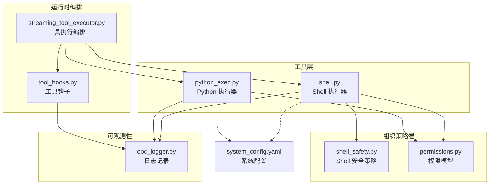
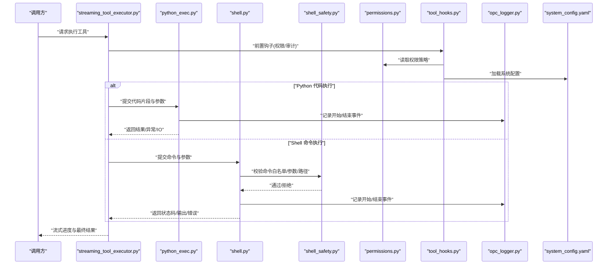
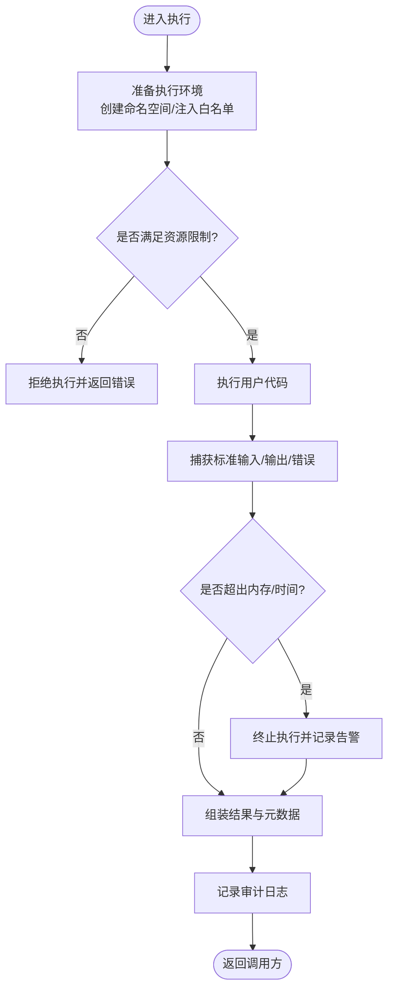
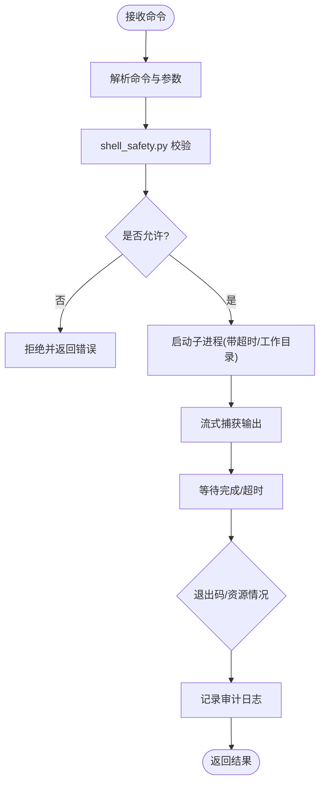
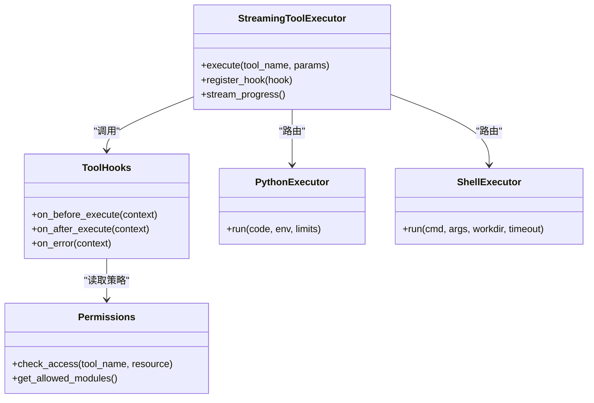
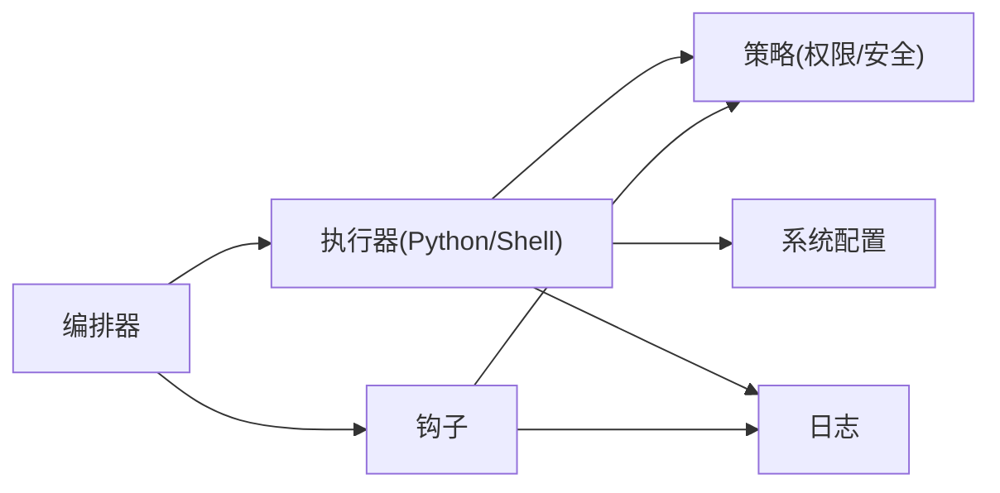

# 代码执行工具

<cite>
**本文引用的文件**   
- [opc/layer4_tools/python_exec.py](file://opc/layer4_tools/python_exec.py)
- [opc/layer4_tools/shell.py](file://opc/layer4_tools/shell.py)
- [opc/layer2_organization/shell_safety.py](file://opc/layer2_organization/shell_safety.py)
- [opc/layer3_agent/runtime_v2/streaming_tool_executor.py](file://opc/layer3_agent/runtime_v2/streaming_tool_executor.py)
- [opc/layer3_agent/runtime_v2/tool_hooks.py](file://opc/layer3_agent/runtime_v2/tool_hooks.py)
- [opc/layer3_agent/runtime_v2/permissions.py](file://opc/layer3_agent/runtime_v2/permissions.py)
- [opc/layer6_observability/opc_logger.py](file://opc/layer6_observability/opc_logger.py)
- [config/system_config.yaml](file://config/system_config.yaml)
</cite>

## 目录
1. [简介](#简介)
2. [项目结构](#项目结构)
3. [核心组件](#核心组件)
4. [架构总览](#架构总览)
5. [详细组件分析](#详细组件分析)
6. [依赖关系分析](#依赖关系分析)
7. [性能与监控](#性能与监控)
8. [故障排查指南](#故障排查指南)
9. [结论](#结论)
10. [附录：最佳实践与安全建议](#附录最佳实践与安全建议)

## 简介
本文件面向开发者与维护者，系统性阐述 OpenOPC 中“代码执行工具”的安全沙箱机制、Shell 命令执行控制、上下文隔离与资源限制、标准输入输出捕获与错误处理、第三方库导入限制与白名单、以及性能监控与调试能力。目标是帮助读者在保障安全的前提下，可靠地执行用户提供的 Python 代码片段与 Shell 命令。

## 项目结构
围绕“代码执行工具”，相关实现主要分布在以下模块：
- Python 代码执行：位于 layer4_tools/python_exec.py
- Shell 命令执行：位于 layer4_tools/shell.py
- Shell 安全策略：位于 layer2_organization/shell_safety.py
- 工具执行编排与流式回调：位于 layer3_agent/runtime_v2/streaming_tool_executor.py
- 工具钩子（用于注入权限、审计等）：位于 layer3_agent/runtime_v2/tool_hooks.py
- 权限模型与策略：位于 layer3_agent/runtime_v2/permissions.py
- 日志与可观测性：位于 layer6_observability/opc_logger.py
- 系统配置项：位于 config/system_config.yaml

图表来源
- [opc/layer4_tools/python_exec.py](file://opc/layer4_tools/python_exec.py)
- [opc/layer4_tools/shell.py](file://opc/layer4_tools/shell.py)
- [opc/layer2_organization/shell_safety.py](file://opc/layer2_organization/shell_safety.py)
- [opc/layer3_agent/runtime_v2/streaming_tool_executor.py](file://opc/layer3_agent/runtime_v2/streaming_tool_executor.py)
- [opc/layer3_agent/runtime_v2/tool_hooks.py](file://opc/layer3_agent/runtime_v2/tool_hooks.py)
- [opc/layer3_agent/runtime_v2/permissions.py](file://opc/layer3_agent/runtime_v2/permissions.py)
- [opc/layer6_observability/opc_logger.py](file://opc/layer6_observability/opc_logger.py)
- [config/system_config.yaml](file://config/system_config.yaml)

章节来源
- [opc/layer4_tools/python_exec.py](file://opc/layer4_tools/python_exec.py)
- [opc/layer4_tools/shell.py](file://opc/layer4_tools/shell.py)
- [opc/layer2_organization/shell_safety.py](file://opc/layer2_organization/shell_safety.py)
- [opc/layer3_agent/runtime_v2/streaming_tool_executor.py](file://opc/layer3_agent/runtime_v2/streaming_tool_executor.py)
- [opc/layer3_agent/runtime_v2/tool_hooks.py](file://opc/layer3_agent/runtime_v2/tool_hooks.py)
- [opc/layer3_agent/runtime_v2/permissions.py](file://opc/layer3_agent/runtime_v2/permissions.py)
- [opc/layer6_observability/opc_logger.py](file://opc/layer6_observability/opc_logger.py)
- [config/system_config.yaml](file://config/system_config.yaml)

## 核心组件
- Python 执行器：负责在受限环境中编译并运行用户提供的 Python 代码，提供内存/时间/网络/文件系统访问等约束，并捕获标准输入输出与异常。
- Shell 执行器：负责在受控环境下执行外部命令，结合安全策略进行命令白名单、参数校验、工作目录限制与超时控制。
- 工具执行编排：统一调度工具调用，注入钩子（如权限检查、审计日志），并以流式方式回传进度与结果。
- 权限模型：定义工具与资源的访问控制策略，作为执行前校验的依据。
- 日志与可观测性：对关键事件进行结构化记录，便于追踪与排障。

章节来源
- [opc/layer4_tools/python_exec.py](file://opc/layer4_tools/python_exec.py)
- [opc/layer4_tools/shell.py](file://opc/layer4_tools/shell.py)
- [opc/layer3_agent/runtime_v2/streaming_tool_executor.py](file://opc/layer3_agent/runtime_v2/streaming_tool_executor.py)
- [opc/layer3_agent/runtime_v2/tool_hooks.py](file://opc/layer3_agent/runtime_v2/tool_hooks.py)
- [opc/layer3_agent/runtime_v2/permissions.py](file://opc/layer3_agent/runtime_v2/permissions.py)
- [opc/layer6_observability/opc_logger.py](file://opc/layer6_observability/opc_logger.py)

## 架构总览
下图展示了从上层编排到具体执行器的调用链路与数据流向，包括钩子注入、权限校验、日志记录与配置加载。

图表来源
- [opc/layer3_agent/runtime_v2/streaming_tool_executor.py](file://opc/layer3_agent/runtime_v2/streaming_tool_executor.py)
- [opc/layer4_tools/python_exec.py](file://opc/layer4_tools/python_exec.py)
- [opc/layer4_tools/shell.py](file://opc/layer4_tools/shell.py)
- [opc/layer2_organization/shell_safety.py](file://opc/layer2_organization/shell_safety.py)
- [opc/layer3_agent/runtime_v2/tool_hooks.py](file://opc/layer3_agent/runtime_v2/tool_hooks.py)
- [opc/layer3_agent/runtime_v2/permissions.py](file://opc/layer3_agent/runtime_v2/permissions.py)
- [opc/layer6_observability/opc_logger.py](file://opc/layer6_observability/opc_logger.py)
- [config/system_config.yaml](file://config/system_config.yaml)

## 详细组件分析

### Python 代码执行器（python_exec.py）
- 功能要点
  - 在受限环境中编译与执行用户代码，支持标准输入输出捕获与异常收集。
  - 通过配置或策略对象施加资源限制（例如内存上限、执行时长）。
  - 对危险内置函数与模块访问进行拦截或替换，降低逃逸风险。
  - 将执行结果以结构化形式返回，包含返回值、输出、错误信息与资源使用统计。
- 安全设计
  - 内存与时间限制：在执行前后采集资源指标，并在超过阈值时中断执行。
  - 系统调用拦截：屏蔽或替换高风险 API，避免直接访问敏感系统接口。
  - 第三方库导入限制：基于白名单或黑名单机制控制可导入的包集合。
  - 上下文隔离：为每次执行创建独立命名空间，避免跨执行污染。
- 错误处理
  - 捕获语法错误、运行时异常、超时与资源超限，统一封装为错误响应。
  - 保留最小化堆栈信息，避免泄露内部实现细节。
- 集成点
  - 由工具执行编排器调用，并通过工具钩子注入权限校验与审计日志。
  - 读取系统配置中的默认限制值，允许按会话或角色覆盖。

图表来源
- [opc/layer4_tools/python_exec.py](file://opc/layer4_tools/python_exec.py)
- [opc/layer3_agent/runtime_v2/tool_hooks.py](file://opc/layer3_agent/runtime_v2/tool_hooks.py)
- [opc/layer6_observability/opc_logger.py](file://opc/layer6_observability/opc_logger.py)
- [config/system_config.yaml](file://config/system_config.yaml)

章节来源
- [opc/layer4_tools/python_exec.py](file://opc/layer4_tools/python_exec.py)
- [opc/layer3_agent/runtime_v2/tool_hooks.py](file://opc/layer3_agent/runtime_v2/tool_hooks.py)
- [opc/layer6_observability/opc_logger.py](file://opc/layer6_observability/opc_logger.py)
- [config/system_config.yaml](file://config/system_config.yaml)

### Shell 命令执行器（shell.py）
- 功能要点
  - 在受限工作目录下执行外部命令，支持超时控制与输出流式回传。
  - 与 shell_safety.py 协作，对命令名、参数与工作目录进行严格校验。
  - 返回退出码、标准输出、标准错误与资源使用统计。
- 安全设计
  - 命令白名单：仅允许预定义的命令集合，防止任意命令执行。
  - 参数过滤：对参数进行模式匹配与长度限制，禁止注入危险字符。
  - 路径限制：强制限定工作目录，禁止相对路径逃逸。
  - 超时与资源限制：防止长时间占用与资源耗尽。
- 错误处理
  - 区分权限拒绝、命令不存在、参数非法、超时与系统错误等场景。
  - 将错误信息标准化，便于上层统一处理与展示。

图表来源
- [opc/layer4_tools/shell.py](file://opc/layer4_tools/shell.py)
- [opc/layer2_organization/shell_safety.py](file://opc/layer2_organization/shell_safety.py)
- [opc/layer6_observability/opc_logger.py](file://opc/layer6_observability/opc_logger.py)

章节来源
- [opc/layer4_tools/shell.py](file://opc/layer4_tools/shell.py)
- [opc/layer2_organization/shell_safety.py](file://opc/layer2_organization/shell_safety.py)
- [opc/layer6_observability/opc_logger.py](file://opc/layer6_observability/opc_logger.py)

### 工具执行编排与钩子（streaming_tool_executor.py, tool_hooks.py）
- 编排职责
  - 统一入口，根据工具类型路由到 Python 或 Shell 执行器。
  - 注入前置钩子（权限校验、审计）、后置钩子（清理、统计）。
  - 以流式方式推送中间进度与最终结果，提升交互体验。
- 钩子机制
  - 支持扩展点注册，便于接入新的安全检查或监控逻辑。
  - 钩子失败时可快速失败，避免不安全执行。
- 权限集成
  - 通过 permissions.py 获取当前上下文下的可用工具与资源范围。
  - 未授权的工具调用将被拒绝并记录审计事件。

图表来源
- [opc/layer3_agent/runtime_v2/streaming_tool_executor.py](file://opc/layer3_agent/runtime_v2/streaming_tool_executor.py)
- [opc/layer3_agent/runtime_v2/tool_hooks.py](file://opc/layer3_agent/runtime_v2/tool_hooks.py)
- [opc/layer3_agent/runtime_v2/permissions.py](file://opc/layer3_agent/runtime_v2/permissions.py)
- [opc/layer4_tools/python_exec.py](file://opc/layer4_tools/python_exec.py)
- [opc/layer4_tools/shell.py](file://opc/layer4_tools/shell.py)

章节来源
- [opc/layer3_agent/runtime_v2/streaming_tool_executor.py](file://opc/layer3_agent/runtime_v2/streaming_tool_executor.py)
- [opc/layer3_agent/runtime_v2/tool_hooks.py](file://opc/layer3_agent/runtime_v2/tool_hooks.py)
- [opc/layer3_agent/runtime_v2/permissions.py](file://opc/layer3_agent/runtime_v2/permissions.py)

### 权限模型（permissions.py）
- 作用
  - 定义工具与资源的访问控制策略，作为执行前的准入条件。
  - 提供模块导入白名单、Shell 命令白名单与工作目录白名单等策略查询。
- 策略来源
  - 可从配置文件或运行时上下文动态加载，支持按角色与会话粒度控制。
- 决策流程
  - 若策略拒绝，则立即中止执行并记录审计事件；否则放行至对应执行器。

章节来源
- [opc/layer3_agent/runtime_v2/permissions.py](file://opc/layer3_agent/runtime_v2/permissions.py)

### 日志与可观测性（opc_logger.py）
- 作用
  - 对工具调用的开始、结束、错误与资源使用情况进行结构化记录。
  - 支持关联上下文标识（如会话 ID、任务 ID），便于追踪。
- 使用建议
  - 在关键路径埋点，确保可回溯性与问题定位效率。
  - 避免记录敏感信息（如密钥、完整代码内容），必要时脱敏。

章节来源
- [opc/layer6_observability/opc_logger.py](file://opc/layer6_observability/opc_logger.py)

## 依赖关系分析
- 耦合与内聚
  - 执行器（Python/Shell）与策略（权限/安全）解耦，通过钩子与配置注入，提高可测试性与可扩展性。
  - 编排器集中管理生命周期与流式输出，保持单一职责。
- 外部依赖
  - 系统配置来自 system_config.yaml，决定默认限制与白名单。
  - 日志子系统提供统一的审计与监控能力。
- 潜在循环依赖
  - 当前分层清晰，未见明显循环依赖；新增钩子时应避免反向调用执行器。

图表来源
- [opc/layer4_tools/python_exec.py](file://opc/layer4_tools/python_exec.py)
- [opc/layer4_tools/shell.py](file://opc/layer4_tools/shell.py)
- [opc/layer3_agent/runtime_v2/streaming_tool_executor.py](file://opc/layer3_agent/runtime_v2/streaming_tool_executor.py)
- [opc/layer3_agent/runtime_v2/tool_hooks.py](file://opc/layer3_agent/runtime_v2/tool_hooks.py)
- [opc/layer3_agent/runtime_v2/permissions.py](file://opc/layer3_agent/runtime_v2/permissions.py)
- [opc/layer6_observability/opc_logger.py](file://opc/layer6_observability/opc_logger.py)
- [config/system_config.yaml](file://config/system_config.yaml)

章节来源
- [opc/layer4_tools/python_exec.py](file://opc/layer4_tools/python_exec.py)
- [opc/layer4_tools/shell.py](file://opc/layer4_tools/shell.py)
- [opc/layer3_agent/runtime_v2/streaming_tool_executor.py](file://opc/layer3_agent/runtime_v2/streaming_tool_executor.py)
- [opc/layer3_agent/runtime_v2/tool_hooks.py](file://opc/layer3_agent/runtime_v2/tool_hooks.py)
- [opc/layer3_agent/runtime_v2/permissions.py](file://opc/layer3_agent/runtime_v2/permissions.py)
- [opc/layer6_observability/opc_logger.py](file://opc/layer6_observability/opc_logger.py)
- [config/system_config.yaml](file://config/system_config.yaml)

## 性能与监控
- 资源限制
  - 设置合理的内存上限与执行时长，避免单条代码阻塞整体服务。
  - 对长耗时任务采用异步队列与超时重试策略。
- 流式输出
  - 利用编排器的流式能力，逐步反馈进度，改善用户体验。
- 监控指标
  - 记录执行耗时、内存峰值、I/O 量、错误率与拒绝次数。
  - 结合日志关联上下文，形成端到端追踪链路。
- 调试工具
  - 启用更详细的审计日志（注意脱敏），配合唯一请求 ID 定位问题。
  - 对高频失败路径增加断点与采样日志，辅助根因分析。

[本节为通用指导，不直接分析具体文件]

## 故障排查指南
- 常见问题
  - 权限拒绝：检查权限策略与白名单配置是否正确加载。
  - 命令被拒：确认命令是否在 Shell 白名单内，参数是否符合模式。
  - 执行超时：评估代码复杂度与资源限制，调整超时阈值或优化算法。
  - 内存溢出：减少数据结构规模，避免大对象常驻内存。
- 定位步骤
  - 通过日志关联上下文 ID，查看执行开始/结束事件与错误详情。
  - 核对系统配置中的默认限制与覆盖策略。
  - 复现问题时开启更细粒度的审计日志，关注钩子执行路径。

章节来源
- [opc/layer3_agent/runtime_v2/tool_hooks.py](file://opc/layer3_agent/runtime_v2/tool_hooks.py)
- [opc/layer6_observability/opc_logger.py](file://opc/layer6_observability/opc_logger.py)
- [config/system_config.yaml](file://config/system_config.yaml)

## 结论
OpenOPC 的代码执行工具通过分层设计与策略驱动，实现了较为完善的安全沙箱与 Shell 执行控制。借助权限模型、安全策略、钩子机制与可观测性体系，能够在保障安全的同时提供灵活的执行能力。建议在生产环境中持续完善白名单与策略配置，强化监控与审计，确保用户代码执行的可靠性与安全性。

[本节为总结性内容，不直接分析具体文件]

## 附录：最佳实践与安全建议
- 最小权限原则
  - 仅授予必要的工具与模块访问权限，定期审查与收紧策略。
- 输入校验与白名单
  - 对用户输入进行严格校验，优先使用白名单而非黑名单。
- 资源限制与超时
  - 为每条执行设定合理的内存与时间上限，避免资源耗尽。
- 上下文隔离
  - 每次执行使用独立命名空间与工作目录，避免状态泄漏。
- 审计与脱敏
  - 记录必要审计信息，避免记录敏感数据；使用唯一 ID 关联上下文。
- 渐进式增强
  - 先以保守策略上线，再根据业务需求逐步放宽限制，并持续监控效果。

[本节为通用指导，不直接分析具体文件]