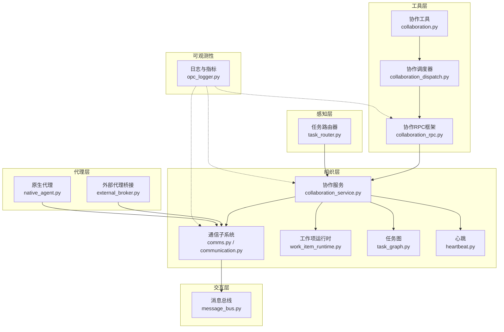
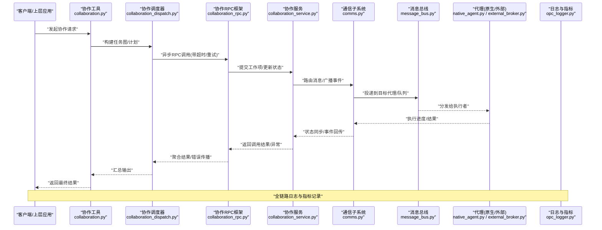
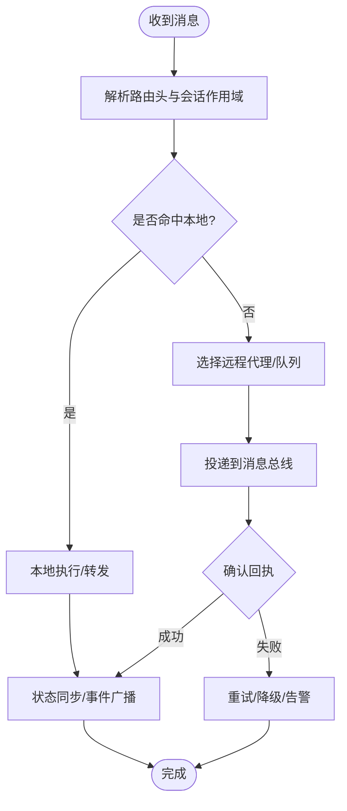
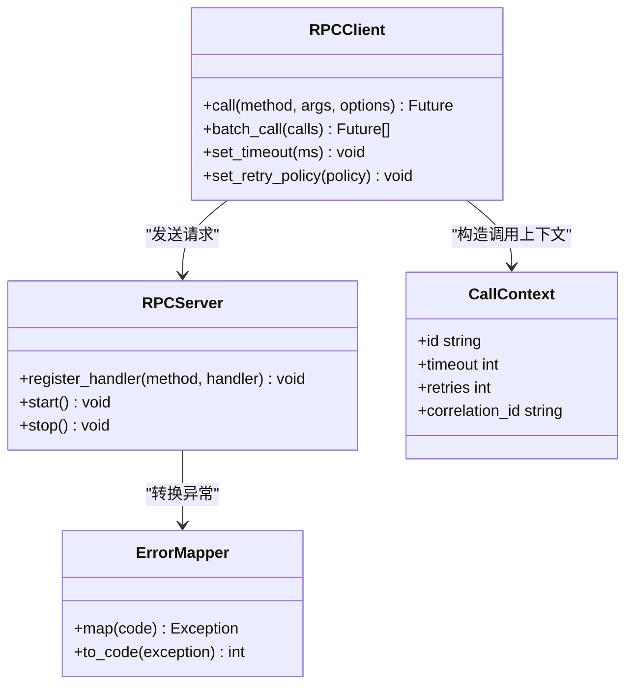
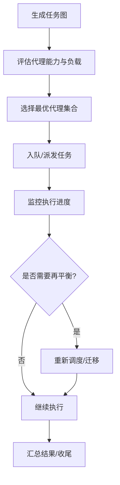
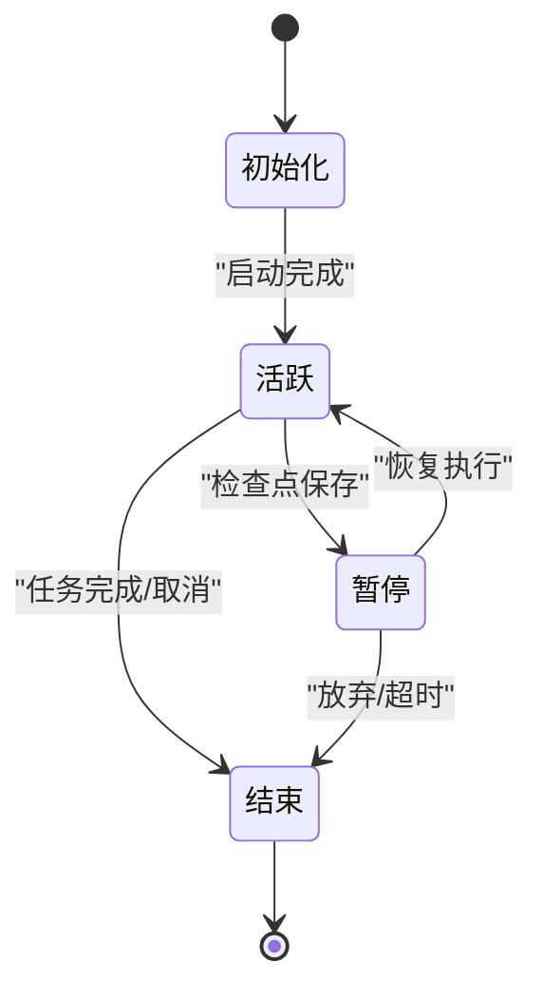
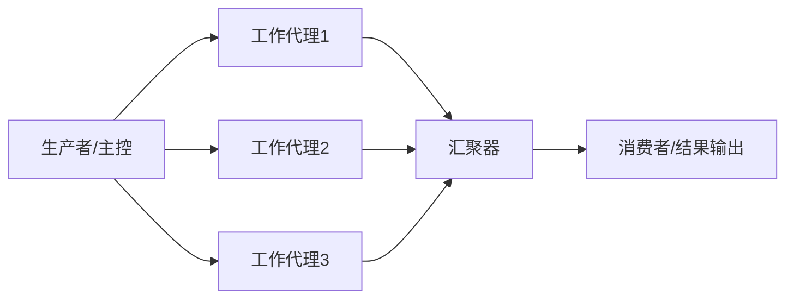
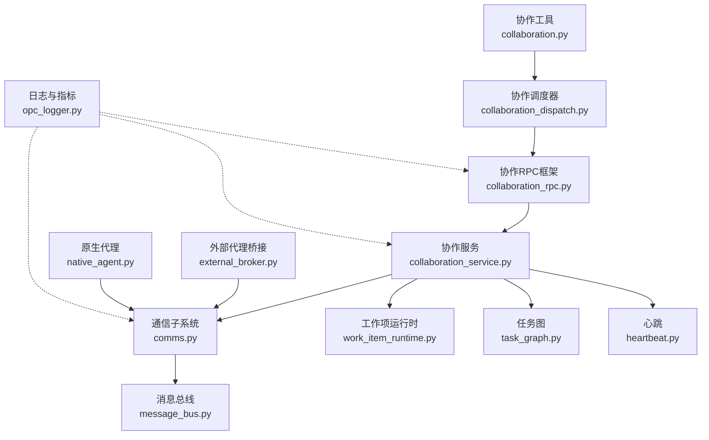

# 协作工具

<cite>
**本文引用的文件**   
- [opc/layer4_tools/collaboration.py](file://opc/layer4_tools/collaboration.py)
- [opc/layer4_tools/collaboration_dispatch.py](file://opc/layer4_tools/collaboration_dispatch.py)
- [opc/layer4_tools/collaboration_rpc.py](file://opc/layer4_tools/collaboration_rpc.py)
- [opc/layer2_organization/collaboration_service.py](file://opc/layer2_organization/collaboration_service.py)
- [opc/layer2_organization/comms.py](file://opc/layer2_organization/comms.py)
- [opc/layer2_organization/communication.py](file://opc/layer2_organization/communication.py)
- [opc/layer2_organization/task_graph.py](file://opc/layer2_organization/task_graph.py)
- [opc/layer2_organization/work_item_runtime.py](file://opc/layer2_organization/work_item_runtime.py)
- [opc/layer2_organization/session_scoping.py](file://opc/layer2_organization/session_scoping.py)
- [opc/layer2_organization/heartbeat.py](file://opc/layer2_organization/heartbeat.py)
- [opc/layer1_perception/task_router.py](file://opc/layer1_perception/task_router.py)
- [opc/layer0_interaction/message_bus.py](file://opc/layer0_interaction/message_bus.py)
- [opc/layer3_agent/external_broker.py](file://opc/layer3_agent/external_broker.py)
- [opc/layer3_agent/native_agent.py](file://opc/layer3_agent/native_agent.py)
- [opc/layer6_observability/opc_logger.py](file://opc/layer6_observability/opc_logger.py)
- [config/channel_config.yaml](file://config/channel_config.yaml)
- [config/system_config.yaml](file://config/system_config.yaml)
- [tests/test_collaboration_rpc.py](file://tests/test_collaboration_rpc.py)
- [tests/test_company_collaboration.py](file://tests/test_company_collaboration.py)
</cite>

## 目录
1. [简介](#简介)
2. [项目结构](#项目结构)
3. [核心组件](#核心组件)
4. [架构总览](#架构总览)
5. [详细组件分析](#详细组件分析)
6. [依赖关系分析](#依赖关系分析)
7. [性能考虑](#性能考虑)
8. [故障排查指南](#故障排查指南)
9. [结论](#结论)
10. [附录](#附录)

## 简介
本文件为 OpenOPC 协作工具的权威技术文档，聚焦多代理协作通信机制、RPC 调用框架、任务分发与负载均衡、协作会话生命周期管理、分布式计算协作模式、安全性与访问控制、以及性能监控与调试。目标是帮助读者理解并高效使用多个代理协同完成复杂任务的系统设计与实现细节。

## 项目结构
OpenOPC 的协作能力由多层模块共同构成：
- 交互层（Layer0）：消息总线负责跨进程/跨节点的消息投递与路由。
- 感知层（Layer1）：任务路由器根据上下文与策略进行初步路由。
- 组织层（Layer2）：协作服务、通信子系统、工作项运行时、任务图、心跳等提供协作编排与状态同步。
- 代理层（Layer3）：外部代理桥接与原生代理运行环境，承载具体执行逻辑。
- 工具层（Layer4）：协作工具、协作调度器与 RPC 框架，暴露给上层业务与 UI。
- 可观测性（Layer6）：日志与指标采集，支撑监控与排障。

图表来源
- [opc/layer0_interaction/message_bus.py](file://opc/layer0_interaction/message_bus.py)
- [opc/layer1_perception/task_router.py](file://opc/layer1_perception/task_router.py)
- [opc/layer2_organization/collaboration_service.py](file://opc/layer2_organization/collaboration_service.py)
- [opc/layer2_organization/comms.py](file://opc/layer2_organization/comms.py)
- [opc/layer2_organization/communication.py](file://opc/layer2_organization/communication.py)
- [opc/layer2_organization/work_item_runtime.py](file://opc/layer2_organization/work_item_runtime.py)
- [opc/layer2_organization/task_graph.py](file://opc/layer2_organization/task_graph.py)
- [opc/layer2_organization/heartbeat.py](file://opc/layer2_organization/heartbeat.py)
- [opc/layer3_agent/external_broker.py](file://opc/layer3_agent/external_broker.py)
- [opc/layer3_agent/native_agent.py](file://opc/layer3_agent/native_agent.py)
- [opc/layer4_tools/collaboration.py](file://opc/layer4_tools/collaboration.py)
- [opc/layer4_tools/collaboration_dispatch.py](file://opc/layer4_tools/collaboration_dispatch.py)
- [opc/layer4_tools/collaboration_rpc.py](file://opc/layer4_tools/collaboration_rpc.py)
- [opc/layer6_observability/opc_logger.py](file://opc/layer6_observability/opc_logger.py)

章节来源
- [opc/layer4_tools/collaboration.py](file://opc/layer4_tools/collaboration.py)
- [opc/layer4_tools/collaboration_dispatch.py](file://opc/layer4_tools/collaboration_dispatch.py)
- [opc/layer4_tools/collaboration_rpc.py](file://opc/layer4_tools/collaboration_rpc.py)
- [opc/layer2_organization/collaboration_service.py](file://opc/layer2_organization/collaboration_service.py)
- [opc/layer2_organization/comms.py](file://opc/layer2_organization/comms.py)
- [opc/layer2_organization/communication.py](file://opc/layer2_organization/communication.py)
- [opc/layer2_organization/task_graph.py](file://opc/layer2_organization/task_graph.py)
- [opc/layer2_organization/work_item_runtime.py](file://opc/layer2_organization/work_item_runtime.py)
- [opc/layer2_organization/session_scoping.py](file://opc/layer2_organization/session_scoping.py)
- [opc/layer2_organization/heartbeat.py](file://opc/layer2_organization/heartbeat.py)
- [opc/layer1_perception/task_router.py](file://opc/layer1_perception/task_router.py)
- [opc/layer0_interaction/message_bus.py](file://opc/layer0_interaction/message_bus.py)
- [opc/layer3_agent/external_broker.py](file://opc/layer3_agent/external_broker.py)
- [opc/layer3_agent/native_agent.py](file://opc/layer3_agent/native_agent.py)
- [opc/layer6_observability/opc_logger.py](file://opc/layer6_observability/opc_logger.py)

## 核心组件
- 协作工具（Layer4）：面向上层的协作 API，封装任务创建、委派、查询与结果聚合。
- 协作调度器（Layer4）：将高层协作请求分解为可执行的子任务，协调执行顺序与资源分配。
- 协作 RPC 框架（Layer4）：提供异步 RPC 调用、错误传播、超时控制与重试策略。
- 协作服务（Layer2）：维护协作会话、状态机、权限与策略，驱动工作项生命周期。
- 通信子系统（Layer2）：统一消息通道，屏蔽底层传输差异，支持广播、点对点与订阅发布。
- 工作项运行时（Layer2）：承载单个任务实例的执行上下文、检查点与恢复。
- 任务图（Layer2）：描述任务间的依赖关系、拓扑与并行度约束。
- 心跳（Layer2）：健康探测、存活检测与故障转移触发。
- 消息总线（Layer0）：跨进程/跨节点的消息路由与持久化。
- 外部代理桥接（Layer3）：对接第三方或异构代理，统一接口契约。
- 原生代理（Layer3）：内置代理运行环境与工具集。
- 日志与指标（Layer6）：结构化日志、追踪与关键指标上报。

章节来源
- [opc/layer4_tools/collaboration.py](file://opc/layer4_tools/collaboration.py)
- [opc/layer4_tools/collaboration_dispatch.py](file://opc/layer4_tools/collaboration_dispatch.py)
- [opc/layer4_tools/collaboration_rpc.py](file://opc/layer4_tools/collaboration_rpc.py)
- [opc/layer2_organization/collaboration_service.py](file://opc/layer2_organization/collaboration_service.py)
- [opc/layer2_organization/comms.py](file://opc/layer2_organization/comms.py)
- [opc/layer2_organization/communication.py](file://opc/layer2_organization/communication.py)
- [opc/layer2_organization/work_item_runtime.py](file://opc/layer2_organization/work_item_runtime.py)
- [opc/layer2_organization/task_graph.py](file://opc/layer2_organization/task_graph.py)
- [opc/layer2_organization/heartbeat.py](file://opc/layer2_organization/heartbeat.py)
- [opc/layer0_interaction/message_bus.py](file://opc/layer0_interaction/message_bus.py)
- [opc/layer3_agent/external_broker.py](file://opc/layer3_agent/external_broker.py)
- [opc/layer3_agent/native_agent.py](file://opc/layer3_agent/native_agent.py)
- [opc/layer6_observability/opc_logger.py](file://opc/layer6_observability/opc_logger.py)

## 架构总览
下图展示了从用户发起协作到多代理协同完成的端到端流程，包括 RPC 调用、任务路由、状态同步与结果汇聚。

图表来源
- [opc/layer4_tools/collaboration.py](file://opc/layer4_tools/collaboration.py)
- [opc/layer4_tools/collaboration_dispatch.py](file://opc/layer4_tools/collaboration_dispatch.py)
- [opc/layer4_tools/collaboration_rpc.py](file://opc/layer4_tools/collaboration_rpc.py)
- [opc/layer2_organization/collaboration_service.py](file://opc/layer2_organization/collaboration_service.py)
- [opc/layer2_organization/comms.py](file://opc/layer2_organization/comms.py)
- [opc/layer0_interaction/message_bus.py](file://opc/layer0_interaction/message_bus.py)
- [opc/layer3_agent/native_agent.py](file://opc/layer3_agent/native_agent.py)
- [opc/layer3_agent/external_broker.py](file://opc/layer3_agent/external_broker.py)
- [opc/layer6_observability/opc_logger.py](file://opc/layer6_observability/opc_logger.py)

## 详细组件分析

### 多代理协作通信机制
- 消息路由
  - 基于主题/工作项标识的路由表，结合会话作用域与组织策略决定投递目标。
  - 支持点对点、广播与订阅发布三种模式，适配不同协作场景。
- 状态同步
  - 通过事件流与工作项状态机保证多代理间的一致性视图。
  - 心跳与存活探测用于快速发现失效节点并触发重路由。
- 冲突解决
  - 采用版本戳与幂等键避免重复处理；对并发写操作引入乐观锁与冲突合并策略。
  - 当出现数据竞争时，优先以“最近写入”或“强一致副本”为准，必要时回滚并重试。

图表来源
- [opc/layer2_organization/comms.py](file://opc/layer2_organization/comms.py)
- [opc/layer2_organization/communication.py](file://opc/layer2_organization/communication.py)
- [opc/layer0_interaction/message_bus.py](file://opc/layer0_interaction/message_bus.py)
- [opc/layer2_organization/heartbeat.py](file://opc/layer2_organization/heartbeat.py)

章节来源
- [opc/layer2_organization/comms.py](file://opc/layer2_organization/comms.py)
- [opc/layer2_organization/communication.py](file://opc/layer2_organization/communication.py)
- [opc/layer0_interaction/message_bus.py](file://opc/layer0_interaction/message_bus.py)
- [opc/layer2_organization/heartbeat.py](file://opc/layer2_organization/heartbeat.py)

### RPC 调用框架设计与实现
- 异步调用
  - 基于回调/Future 模型，支持非阻塞调用与批量聚合。
  - 调用方无需关心网络细节，自动序列化与反序列化。
- 错误传播
  - 统一错误码与异常映射，跨边界保持语义一致性。
  - 支持部分失败时的降级与补偿。
- 超时与重试
  - 可配置全局与单调用级超时；指数退避重试与熔断保护。
  - 幂等键确保重试安全，避免重复副作用。

图表来源
- [opc/layer4_tools/collaboration_rpc.py](file://opc/layer4_tools/collaboration_rpc.py)

章节来源
- [opc/layer4_tools/collaboration_rpc.py](file://opc/layer4_tools/collaboration_rpc.py)
- [tests/test_collaboration_rpc.py](file://tests/test_collaboration_rpc.py)

### 任务分发与负载均衡策略
- 任务图与拓扑
  - 将复杂任务拆分为有向无环图，明确依赖与并行度上限。
  - 支持阶段式推进与检查点保存，便于中断恢复。
- 负载评估与调度
  - 基于代理能力标签、当前负载与健康状态进行打分选择。
  - 动态调整并行度，避免热点与过载。
- 公平性与优先级
  - 支持按租户/会话优先级队列，保障关键任务及时交付。

图表来源
- [opc/layer2_organization/task_graph.py](file://opc/layer2_organization/task_graph.py)
- [opc/layer2_organization/collaboration_dispatch.py](file://opc/layer2_organization/collaboration_dispatch.py)

章节来源
- [opc/layer2_organization/task_graph.py](file://opc/layer2_organization/task_graph.py)
- [opc/layer2_organization/collaboration_dispatch.py](file://opc/layer2_organization/collaboration_dispatch.py)

### 协作会话生命周期管理与资源清理
- 生命周期阶段
  - 初始化：建立会话作用域、加载策略与上下文。
  - 活跃期：接收消息、执行业务、更新状态。
  - 暂停/恢复：检查点持久化，支持冷/热恢复。
  - 结束：资源释放、审计归档与清理临时对象。
- 资源清理
  - 显式关闭连接、释放句柄、清理缓存与中间文件。
  - 监听退出信号，确保优雅停机与事务回滚。

图表来源
- [opc/layer2_organization/work_item_runtime.py](file://opc/layer2_organization/work_item_runtime.py)
- [opc/layer2_organization/session_scoping.py](file://opc/layer2_organization/session_scoping.py)

章节来源
- [opc/layer2_organization/work_item_runtime.py](file://opc/layer2_organization/work_item_runtime.py)
- [opc/layer2_organization/session_scoping.py](file://opc/layer2_organization/session_scoping.py)

### 分布式计算协作模式示例
- 流水线模式
  - 上游产出作为下游输入，逐阶段推进，适合数据处理与分析。
- 扇出-汇聚模式
  - 将大任务拆分到多个代理并行执行，最后聚合结果。
- 主从协调模式
  - 主控代理负责任务编排与仲裁，工作代理专注执行。
- 事件驱动模式
  - 基于事件流驱动各代理响应，适合实时协作与反馈闭环。

[此图为概念示意，不直接映射具体源码文件]

### 安全性考虑与访问控制机制
- 身份认证与授权
  - 基于会话与作用域的访问控制，限制跨会话的数据可见性。
  - 角色/能力标签校验，防止越权调用。
- 传输安全
  - 建议启用加密通道与签名校验，防止中间人攻击与篡改。
- 审计与合规
  - 关键操作留痕，支持回溯与取证。

章节来源
- [opc/layer2_organization/collaboration_service.py](file://opc/layer2_organization/collaboration_service.py)
- [config/channel_config.yaml](file://config/channel_config.yaml)
- [config/system_config.yaml](file://config/system_config.yaml)

### 性能监控与调试工具
- 指标与日志
  - 记录调用延迟、吞吐、错误率、重试次数与超时分布。
  - 结构化日志包含关联 ID，便于跨组件追踪。
- 诊断与排障
  - 提供会话快照、任务图导出与执行轨迹回放。
  - 心跳异常与死锁检测，辅助定位瓶颈。

章节来源
- [opc/layer6_observability/opc_logger.py](file://opc/layer6_observability/opc_logger.py)
- [tests/test_company_collaboration.py](file://tests/test_company_collaboration.py)

## 依赖关系分析
协作工具与下层模块的依赖关系如下：

图表来源
- [opc/layer4_tools/collaboration.py](file://opc/layer4_tools/collaboration.py)
- [opc/layer4_tools/collaboration_dispatch.py](file://opc/layer4_tools/collaboration_dispatch.py)
- [opc/layer4_tools/collaboration_rpc.py](file://opc/layer4_tools/collaboration_rpc.py)
- [opc/layer2_organization/collaboration_service.py](file://opc/layer2_organization/collaboration_service.py)
- [opc/layer2_organization/comms.py](file://opc/layer2_organization/comms.py)
- [opc/layer2_organization/work_item_runtime.py](file://opc/layer2_organization/work_item_runtime.py)
- [opc/layer2_organization/task_graph.py](file://opc/layer2_organization/task_graph.py)
- [opc/layer2_organization/heartbeat.py](file://opc/layer2_organization/heartbeat.py)
- [opc/layer0_interaction/message_bus.py](file://opc/layer0_interaction/message_bus.py)
- [opc/layer3_agent/external_broker.py](file://opc/layer3_agent/external_broker.py)
- [opc/layer3_agent/native_agent.py](file://opc/layer3_agent/native_agent.py)
- [opc/layer6_observability/opc_logger.py](file://opc/layer6_observability/opc_logger.py)

章节来源
- [opc/layer4_tools/collaboration.py](file://opc/layer4_tools/collaboration.py)
- [opc/layer4_tools/collaboration_dispatch.py](file://opc/layer4_tools/collaboration_dispatch.py)
- [opc/layer4_tools/collaboration_rpc.py](file://opc/layer4_tools/collaboration_rpc.py)
- [opc/layer2_organization/collaboration_service.py](file://opc/layer2_organization/collaboration_service.py)
- [opc/layer2_organization/comms.py](file://opc/layer2_organization/comms.py)
- [opc/layer2_organization/work_item_runtime.py](file://opc/layer2_organization/work_item_runtime.py)
- [opc/layer2_organization/task_graph.py](file://opc/layer2_organization/task_graph.py)
- [opc/layer2_organization/heartbeat.py](file://opc/layer2_organization/heartbeat.py)
- [opc/layer0_interaction/message_bus.py](file://opc/layer0_interaction/message_bus.py)
- [opc/layer3_agent/external_broker.py](file://opc/layer3_agent/external_broker.py)
- [opc/layer3_agent/native_agent.py](file://opc/layer3_agent/native_agent.py)
- [opc/layer6_observability/opc_logger.py](file://opc/layer6_observability/opc_logger.py)

## 性能考虑
- 批处理与合并
  - 将小任务合并为批次，减少网络往返与序列化开销。
- 背压与限流
  - 在热点路径实施令牌桶或滑动窗口限流，避免雪崩。
- 缓存与去重
  - 对只读数据与中间结果进行缓存，利用幂等键避免重复计算。
- 并行度调优
  - 依据 CPU/IO 特性与代理能力动态调整并行度，避免过度切换。
- 超时与熔断
  - 合理设置超时阈值与熔断阈值，快速失败并保护系统稳定性。

[本节为通用指导，不直接分析具体文件]

## 故障排查指南
- 常见问题
  - 调用超时：检查 RPC 超时配置、代理负载与网络延迟。
  - 状态不一致：核对事件顺序与幂等键，确认冲突解决策略生效。
  - 心跳丢失：查看代理存活状态与消息总线连通性。
- 诊断步骤
  - 收集关联 ID 的完整日志链，定位失败分支与重试次数。
  - 导出任务图与执行轨迹，对比预期拓扑与实际执行。
  - 使用会话快照与检查点，验证恢复路径是否正确。
- 恢复策略
  - 对幂等操作进行重试；对非幂等操作引入补偿事务。
  - 隔离故障代理，重新路由至健康节点。

章节来源
- [opc/layer6_observability/opc_logger.py](file://opc/layer6_observability/opc_logger.py)
- [tests/test_collaboration_rpc.py](file://tests/test_collaboration_rpc.py)
- [tests/test_company_collaboration.py](file://tests/test_company_collaboration.py)

## 结论
OpenOPC 协作工具通过分层架构与清晰的职责划分，实现了多代理的高效协同。其 RPC 框架提供了可靠的异步调用与错误传播机制，任务图与调度器保障了复杂任务的有序执行，会话生命周期与资源清理确保了系统的健壮性。配合完善的监控与调试手段，可在分布式环境下稳定地完成高复杂度协作任务。

## 附录
- 配置要点
  - 通道与安全参数：参考通道与系统配置文件，按需启用加密与鉴权。
  - 超时与重试：根据业务 SLA 调整 RPC 超时与重试策略。
- 最佳实践
  - 设计幂等接口，避免重复执行导致的状态漂移。
  - 使用关联 ID 贯穿全链路，提升可观测性与排障效率。
  - 定期演练故障注入与恢复流程，验证系统韧性。

章节来源
- [config/channel_config.yaml](file://config/channel_config.yaml)
- [config/system_config.yaml](file://config/system_config.yaml)