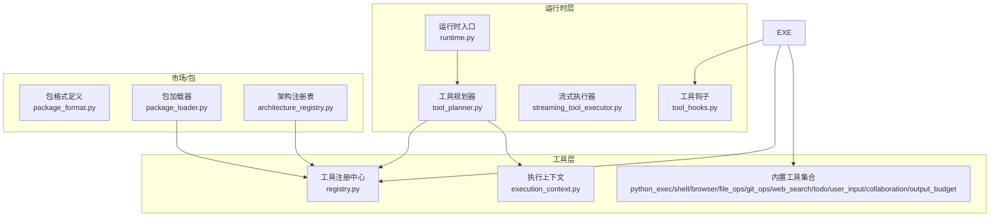
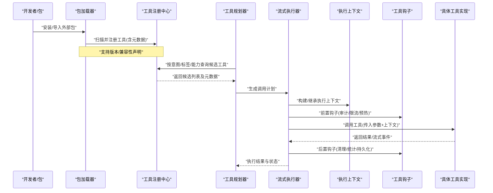
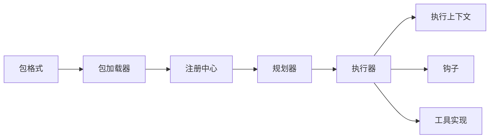
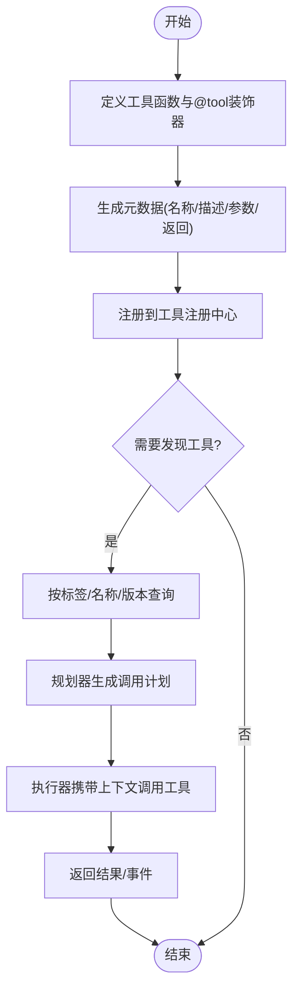

# 工具注册机制

<cite>
**本文引用的文件**   
- [opc/layer4_tools/registry.py](file://opc/layer4_tools/registry.py)
- [opc/layer4_tools/execution_context.py](file://opc/layer4_tools/execution_context.py)
- [opc/layer3_agent/runtime_v2/streaming_tool_executor.py](file://opc/layer3_agent/runtime_v2/streaming_tool_executor.py)
- [opc/layer3_agent/runtime_v2/tool_hooks.py](file://opc/layer3_agent/runtime_v2/tool_hooks.py)
- [opc/layer3_agent/runtime_v2/tool_planner.py](file://opc/layer3_agent/runtime_v2/tool_planner.py)
- [opc/layer3_agent/runtime_v2/runtime.py](file://opc/layer3_agent/runtime_v2/runtime.py)
- [opc/layer4_tools/python_exec.py](file://opc/layer4_tools/python_exec.py)
- [opc/layer4_tools/shell.py](file://opc/layer4_tools/shell.py)
- [opc/layer4_tools/browser.py](file://opc/layer4_tools/browser.py)
- [opc/layer4_tools/file_ops.py](file://opc/layer4_tools/file_ops.py)
- [opc/layer4_tools/git_ops.py](file://opc/layer4_tools/git_ops.py)
- [opc/layer4_tools/web_search.py](file://opc/layer4_tools/web_search.py)
- [opc/layer4_tools/todo.py](file://opc/layer4_tools/todo.py)
- [opc/layer4_tools/user_input.py](file://opc/layer4_tools/user_input.py)
- [opc/layer4_tools/collaboration.py](file://opc/layer4_tools/collaboration.py)
- [opc/layer4_tools/output_budget.py](file://opc/layer4_tools/output_budget.py)
- [opc/layer3_agent/prompt_harness/tool_strategy.py](file://opc/layer3_agent/prompt_harness/tool_strategy.py)
- [opc/market/package_loader.py](file://opc/market/package_loader.py)
- [opc/market/package_format.py](file://opc/market/package_format.py)
- [opc/market/architecture_registry.py](file://opc/market/architecture_registry.py)
</cite>

## 目录
1. [简介](#简介)
2. [项目结构](#项目结构)
3. [核心组件](#核心组件)
4. [架构总览](#架构总览)
5. [详细组件分析](#详细组件分析)
6. [依赖关系分析](#依赖关系分析)
7. [性能考量](#性能考量)
8. [故障排查指南](#故障排查指南)
9. [结论](#结论)
10. [附录](#附录)

## 简介
本文件面向开发者，系统性阐述 OpenOPC 的工具注册与发现机制。内容覆盖：
- 工具注册中心的设计与职责
- 工具发现算法与动态加载流程
- 工具元数据定义（名称、描述、参数校验、返回类型）
- @tool 装饰器的工作原理与配置项
- 执行上下文管理（环境变量、工作目录、资源隔离）
- 生命周期钩子与版本/兼容性检查
- 最佳实践与常见陷阱
- 如何正确注册和发现自定义工具

## 项目结构
OpenOPC 将“工具”抽象为可被运行时调用的能力单元，并通过统一的注册表进行集中管理。关键目录与职责如下：
- opc/layer4_tools：内置工具实现与工具注册中心
- opc/layer3_agent/runtime_v2：运行时对工具的编排、流式执行与钩子
- opc/market：包格式与加载器，支持外部包的发现与导入
- opc/layer3_agent/prompt_harness：提示词侧的工具策略与选择逻辑

图表来源
- [opc/layer4_tools/registry.py](file://opc/layer4_tools/registry.py)
- [opc/layer4_tools/execution_context.py](file://opc/layer4_tools/execution_context.py)
- [opc/layer3_agent/runtime_v2/runtime.py](file://opc/layer3_agent/runtime_v2/runtime.py)
- [opc/layer3_agent/runtime_v2/tool_planner.py](file://opc/layer3_agent/runtime_v2/tool_planner.py)
- [opc/layer3_agent/runtime_v2/streaming_tool_executor.py](file://opc/layer3_agent/runtime_v2/streaming_tool_executor.py)
- [opc/layer3_agent/runtime_v2/tool_hooks.py](file://opc/layer3_agent/runtime_v2/tool_hooks.py)
- [opc/market/package_loader.py](file://opc/market/package_loader.py)
- [opc/market/package_format.py](file://opc/market/package_format.py)
- [opc/market/architecture_registry.py](file://opc/market/architecture_registry.py)

章节来源
- [opc/layer4_tools/registry.py](file://opc/layer4_tools/registry.py)
- [opc/layer4_tools/execution_context.py](file://opc/layer4_tools/execution_context.py)
- [opc/layer3_agent/runtime_v2/runtime.py](file://opc/layer3_agent/runtime_v2/runtime.py)
- [opc/layer3_agent/runtime_v2/tool_planner.py](file://opc/layer3_agent/runtime_v2/tool_planner.py)
- [opc/layer3_agent/runtime_v2/streaming_tool_executor.py](file://opc/layer3_agent/runtime_v2/streaming_tool_executor.py)
- [opc/layer3_agent/runtime_v2/tool_hooks.py](file://opc/layer3_agent/runtime_v2/tool_hooks.py)
- [opc/market/package_loader.py](file://opc/market/package_loader.py)
- [opc/market/package_format.py](file://opc/market/package_format.py)
- [opc/market/architecture_registry.py](file://opc/market/architecture_registry.py)

## 核心组件
- 工具注册中心：维护工具名到可调对象的映射，提供按条件查询、去重与冲突处理、元数据检索等能力。
- 执行上下文：封装工具运行时的环境变量、工作目录、资源配额与隔离边界。
- 工具规划器：根据任务意图选择候选工具，生成调用计划。
- 流式执行器：负责实际调用工具、传递上下文、收集结果与事件、触发钩子。
- 工具钩子：在工具执行前后注入日志、审计、限流、重试等横切逻辑。
- 包加载器与格式：从外部包中扫描并注册工具，支持版本与兼容性声明。

章节来源
- [opc/layer4_tools/registry.py](file://opc/layer4_tools/registry.py)
- [opc/layer4_tools/execution_context.py](file://opc/layer4_tools/execution_context.py)
- [opc/layer3_agent/runtime_v2/tool_planner.py](file://opc/layer3_agent/runtime_v2/tool_planner.py)
- [opc/layer3_agent/runtime_v2/streaming_tool_executor.py](file://opc/layer3_agent/runtime_v2/streaming_tool_executor.py)
- [opc/layer3_agent/runtime_v2/tool_hooks.py](file://opc/layer3_agent/runtime_v2/tool_hooks.py)
- [opc/market/package_loader.py](file://opc/market/package_loader.py)
- [opc/market/package_format.py](file://opc/market/package_format.py)

## 架构总览
下图展示了从“包加载/手动注册”到“运行时发现与执行”的端到端流程。

图表来源
- [opc/market/package_loader.py](file://opc/market/package_loader.py)
- [opc/layer4_tools/registry.py](file://opc/layer4_tools/registry.py)
- [opc/layer3_agent/runtime_v2/tool_planner.py](file://opc/layer3_agent/runtime_v2/tool_planner.py)
- [opc/layer3_agent/runtime_v2/streaming_tool_executor.py](file://opc/layer3_agent/runtime_v2/streaming_tool_executor.py)
- [opc/layer4_tools/execution_context.py](file://opc/layer4_tools/execution_context.py)
- [opc/layer3_agent/runtime_v2/tool_hooks.py](file://opc/layer3_agent/runtime_v2/tool_hooks.py)

## 详细组件分析

### 工具注册中心（Registry）
- 职责
  - 维护工具名到可调对象的映射
  - 存储并暴露工具元数据（名称、描述、参数签名、返回类型、标签、版本等）
  - 提供按条件查询、去重与冲突处理
- 设计要点
  - 注册接口：支持显式注册与装饰器自动注册
  - 发现接口：按标签/能力/名称前缀/版本范围筛选
  - 冲突策略：同名工具时以优先级或版本策略决定最终可见实例
- 典型用法
  - 通过装饰器标注函数为工具
  - 在包初始化阶段批量注册
  - 在测试中临时注册/注销工具

章节来源
- [opc/layer4_tools/registry.py](file://opc/layer4_tools/registry.py)

### 执行上下文（ExecutionContext）
- 职责
  - 封装工具运行期的环境：环境变量、工作目录、资源配额、隔离边界
  - 提供上下文传播与继承（父子任务、并发安全）
- 关键能力
  - 环境变量注入与白名单过滤
  - 工作目录切换与权限控制
  - 资源限制（CPU/内存/IO）与超时
  - 可观测性标识（traceId、sessionId 等）
- 使用建议
  - 避免泄露敏感信息到上下文
  - 合理设置工作目录，确保幂等与可恢复
  - 在并发场景下保持上下文不可变或线程安全拷贝

章节来源
- [opc/layer4_tools/execution_context.py](file://opc/layer4_tools/execution_context.py)

### 工具规划器（Tool Planner）
- 职责
  - 基于用户意图与上下文，选择合适工具
  - 生成调用序列与参数填充策略
- 决策依据
  - 工具元数据（描述、标签、参数约束）
  - 当前上下文（可用能力、权限、资源）
  - 历史执行反馈与成功率
- 输出
  - 工具调用计划（顺序/并行、回退策略）

章节来源
- [opc/layer3_agent/runtime_v2/tool_planner.py](file://opc/layer3_agent/runtime_v2/tool_planner.py)

### 流式执行器（Streaming Tool Executor）
- 职责
  - 协调工具调用、上下文传递、事件流与钩子
- 执行流程
  - 解析计划 -> 准备上下文 -> 触发前置钩子 -> 调用工具 -> 收集结果/事件 -> 触发后置钩子 -> 上报状态
- 特性
  - 支持流式输出（增量结果）
  - 错误分类与重试策略
  - 超时与取消传播

章节来源
- [opc/layer3_agent/runtime_v2/streaming_tool_executor.py](file://opc/layer3_agent/runtime_v2/streaming_tool_executor.py)

### 工具钩子（Tool Hooks）
- 职责
  - 在执行前后注入横切逻辑：审计、指标、限流、缓存、清理
- 扩展点
  - 前置钩子：参数校验、资源预热、访问控制
  - 后置钩子：结果清洗、持久化、通知
- 注意事项
  - 钩子需幂等且快速，避免阻塞主流程
  - 异常需捕获并上报，不影响工具主逻辑

章节来源
- [opc/layer3_agent/runtime_v2/tool_hooks.py](file://opc/layer3_agent/runtime_v2/tool_hooks.py)

### 包加载器与包格式（Package Loader & Format）
- 职责
  - 从外部包中扫描工具模块，解析包清单，完成注册
  - 校验版本与兼容性声明
- 关键点
  - 包清单字段：名称、版本、兼容范围、依赖、工具入口
  - 扫描策略：约定优于配置（如特定命名空间/标记）
  - 冲突解决：版本优先、显式覆盖、禁用策略

章节来源
- [opc/market/package_loader.py](file://opc/market/package_loader.py)
- [opc/market/package_format.py](file://opc/market/package_format.py)

### 架构注册表（Architecture Registry）
- 职责
  - 维护系统级能力/架构注册，辅助工具发现与路由
- 作用
  - 将工具能力映射到高层架构概念，便于跨模块复用与治理

章节来源
- [opc/market/architecture_registry.py](file://opc/market/architecture_registry.py)

### 内置工具示例（参考路径）
以下为部分内置工具的实现位置，用于理解工具形态与上下文使用方式：
- Python 执行：[opc/layer4_tools/python_exec.py](file://opc/layer4_tools/python_exec.py)
- Shell 命令：[opc/layer4_tools/shell.py](file://opc/layer4_tools/shell.py)
- 浏览器操作：[opc/layer4_tools/browser.py](file://opc/layer4_tools/browser.py)
- 文件操作：[opc/layer4_tools/file_ops.py](file://opc/layer4_tools/file_ops.py)
- Git 操作：[opc/layer4_tools/git_ops.py](file://opc/layer4_tools/git_ops.py)
- Web 搜索：[opc/layer4_tools/web_search.py](file://opc/layer4_tools/web_search.py)
- 待办事项：[opc/layer4_tools/todo.py](file://opc/layer4_tools/todo.py)
- 用户输入：[opc/layer4_tools/user_input.py](file://opc/layer4_tools/user_input.py)
- 协作相关：[opc/layer4_tools/collaboration.py](file://opc/layer4_tools/collaboration.py)
- 输出预算：[opc/layer4_tools/output_budget.py](file://opc/layer4_tools/output_budget.py)

章节来源
- [opc/layer4_tools/python_exec.py](file://opc/layer4_tools/python_exec.py)
- [opc/layer4_tools/shell.py](file://opc/layer4_tools/shell.py)
- [opc/layer4_tools/browser.py](file://opc/layer4_tools/browser.py)
- [opc/layer4_tools/file_ops.py](file://opc/layer4_tools/file_ops.py)
- [opc/layer4_tools/git_ops.py](file://opc/layer4_tools/git_ops.py)
- [opc/layer4_tools/web_search.py](file://opc/layer4_tools/web_search.py)
- [opc/layer4_tools/todo.py](file://opc/layer4_tools/todo.py)
- [opc/layer4_tools/user_input.py](file://opc/layer4_tools/user_input.py)
- [opc/layer4_tools/collaboration.py](file://opc/layer4_tools/collaboration.py)
- [opc/layer4_tools/output_budget.py](file://opc/layer4_tools/output_budget.py)

## 依赖关系分析
- 低耦合高内聚
  - 注册中心仅关注“注册/发现/元数据”，不关心执行细节
  - 执行器与钩子解耦，便于替换与扩展
- 直接依赖
  - 规划器依赖注册中心获取候选工具
  - 执行器依赖上下文、钩子与具体工具实现
  - 包加载器依赖包格式定义与注册中心
- 潜在循环依赖
  - 应避免工具实现反向依赖注册中心；如需引用，请使用延迟导入或接口抽象

图表来源
- [opc/layer4_tools/registry.py](file://opc/layer4_tools/registry.py)
- [opc/layer3_agent/runtime_v2/tool_planner.py](file://opc/layer3_agent/runtime_v2/tool_planner.py)
- [opc/layer3_agent/runtime_v2/streaming_tool_executor.py](file://opc/layer3_agent/runtime_v2/streaming_tool_executor.py)
- [opc/layer4_tools/execution_context.py](file://opc/layer4_tools/execution_context.py)
- [opc/layer3_agent/runtime_v2/tool_hooks.py](file://opc/layer3_agent/runtime_v2/tool_hooks.py)
- [opc/market/package_loader.py](file://opc/market/package_loader.py)
- [opc/market/package_format.py](file://opc/market/package_format.py)

章节来源
- [opc/layer4_tools/registry.py](file://opc/layer4_tools/registry.py)
- [opc/layer3_agent/runtime_v2/tool_planner.py](file://opc/layer3_agent/runtime_v2/tool_planner.py)
- [opc/layer3_agent/runtime_v2/streaming_tool_executor.py](file://opc/layer3_agent/runtime_v2/streaming_tool_executor.py)
- [opc/layer4_tools/execution_context.py](file://opc/layer4_tools/execution_context.py)
- [opc/layer3_agent/runtime_v2/tool_hooks.py](file://opc/layer3_agent/runtime_v2/tool_hooks.py)
- [opc/market/package_loader.py](file://opc/market/package_loader.py)
- [opc/market/package_format.py](file://opc/market/package_format.py)

## 性能考量
- 注册阶段
  - 批量注册优于逐个注册，减少锁竞争
  - 元数据索引（标签/名称前缀）提升查询效率
- 执行阶段
  - 流式输出降低首字节延迟
  - 钩子尽量轻量，避免阻塞
  - 上下文复制开销可控，必要时使用只读视图
- 资源隔离
  - 合理的超时与配额防止长尾任务拖垮系统
  - 并发执行时注意共享资源的互斥与缓存一致性

## 故障排查指南
- 常见问题
  - 工具未注册：确认包已加载且注册入口被执行
  - 同名冲突：检查版本策略与优先级，必要时显式覆盖
  - 参数校验失败：核对工具元数据的参数签名与类型约束
  - 上下文缺失：检查环境变量白名单与工作目录权限
  - 钩子异常：定位钩子堆栈，确保异常被捕获并上报
- 诊断步骤
  - 列出所有已注册工具及其元数据
  - 打印执行上下文快照（不含敏感信息）
  - 启用调试日志，观察规划与执行链路
  - 隔离问题工具，最小复现用例

章节来源
- [opc/layer4_tools/registry.py](file://opc/layer4_tools/registry.py)
- [opc/layer4_tools/execution_context.py](file://opc/layer4_tools/execution_context.py)
- [opc/layer3_agent/runtime_v2/tool_hooks.py](file://opc/layer3_agent/runtime_v2/tool_hooks.py)
- [opc/layer3_agent/runtime_v2/streaming_tool_executor.py](file://opc/layer3_agent/runtime_v2/streaming_tool_executor.py)

## 结论
OpenOPC 的工具注册机制以“注册中心 + 执行上下文 + 钩子 + 包加载”为核心，形成可扩展、可治理、可观测的工具生态。通过清晰的元数据定义与严格的上下文管理，开发者可以安全地注册与发现自定义工具，并在生产环境中获得良好的性能与稳定性。

## 附录

### @tool 装饰器工作原理与参数配置
- 工作原理
  - 装饰器在导入时自动将目标函数注册到注册中心
  - 提取函数签名、类型注解与注释，生成工具元数据
  - 支持可选参数：名称、描述、标签、版本、参数校验规则、返回类型等
- 参数说明（示例字段）
  - name：工具显示名
  - description：工具用途说明
  - tags：能力标签，用于筛选
  - version：工具版本
  - parameters：参数定义与校验规则
  - returns：返回类型与约束
- 使用建议
  - 明确描述与标签，提高规划器命中率
  - 严格定义参数类型与必填项，减少运行时错误
  - 为工具指定稳定版本，配合兼容性检查

章节来源
- [opc/layer4_tools/registry.py](file://opc/layer4_tools/registry.py)
- [opc/layer3_agent/prompt_harness/tool_strategy.py](file://opc/layer3_agent/prompt_harness/tool_strategy.py)

### 工具元数据定义规范
- 必备字段
  - 名称、描述、参数签名、返回类型
- 推荐字段
  - 标签、版本、作者、依赖、许可证
- 校验规则
  - 必填项校验、类型约束、取值范围、正则匹配
- 返回类型
  - 结构化返回（对象/字典）或流式事件（增量输出）

章节来源
- [opc/layer4_tools/registry.py](file://opc/layer4_tools/registry.py)
- [opc/market/package_format.py](file://opc/market/package_format.py)

### 执行上下文管理
- 环境变量
  - 白名单注入，避免泄露敏感信息
- 工作目录
  - 每个工具可在受控目录下执行，保证幂等与可恢复
- 资源隔离
  - 进程/线程级隔离、配额限制、超时与取消
- 可观测性
  - traceId、sessionId、工具名、耗时、状态码

章节来源
- [opc/layer4_tools/execution_context.py](file://opc/layer4_tools/execution_context.py)

### 工具版本管理与兼容性检查
- 版本声明
  - 工具与包均需提供语义化版本
- 兼容性矩阵
  - 声明与运行时/依赖的最小/最大兼容版本
- 冲突解决
  - 版本优先、显式覆盖、降级回退
- 升级策略
  - 灰度发布、回滚机制、变更日志

章节来源
- [opc/market/package_loader.py](file://opc/market/package_loader.py)
- [opc/market/package_format.py](file://opc/market/package_format.py)

### 最佳实践与常见陷阱
- 最佳实践
  - 小而专：单一职责的工具更易组合
  - 强契约：严格的参数与返回类型约束
  - 幂等设计：允许重试与回滚
  - 可观测：记录关键指标与事件
- 常见陷阱
  - 全局状态污染：避免在工具间共享可变状态
  - 上下文泄漏：谨慎传递敏感信息
  - 钩子阻塞：钩子逻辑过重影响吞吐
  - 版本漂移：未声明依赖导致运行时不一致

### 自定义工具注册与发现流程（流程图）
