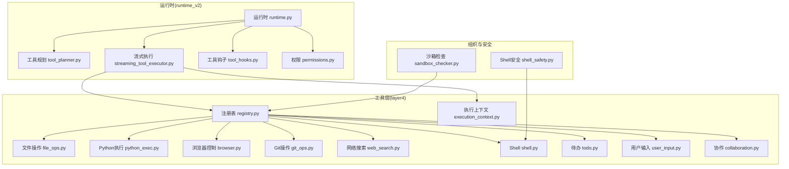
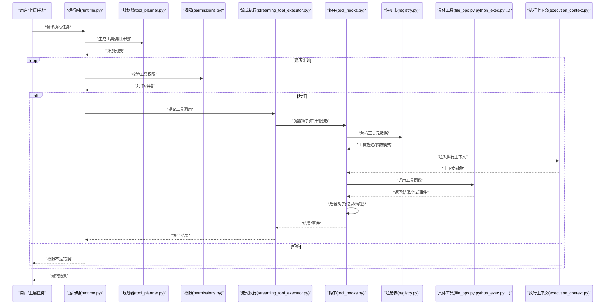
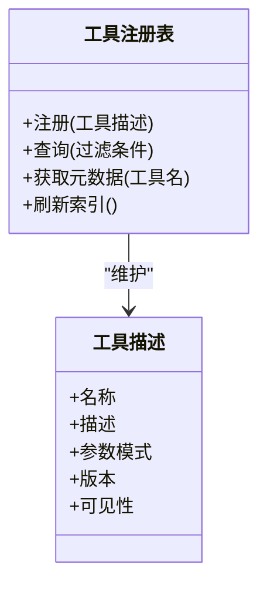
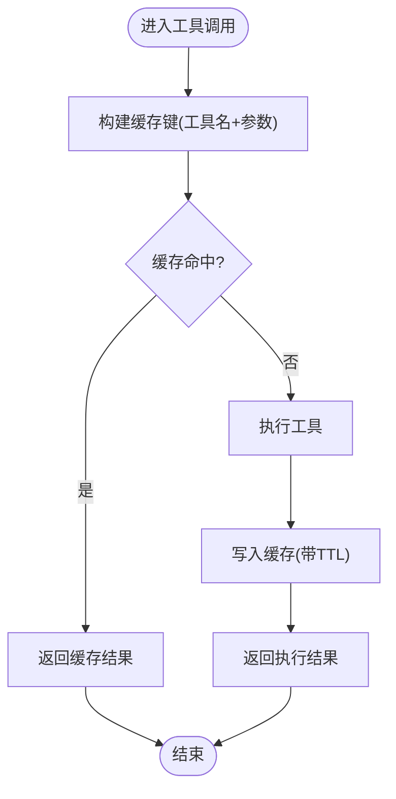
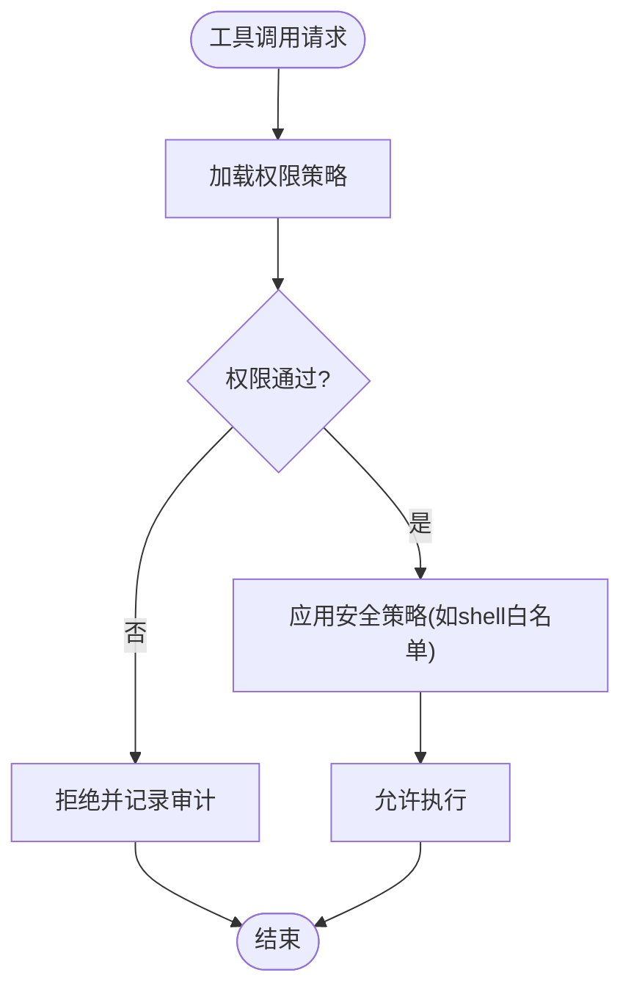
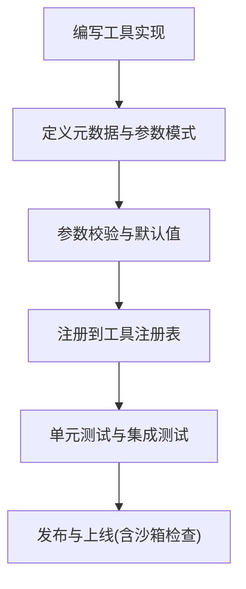
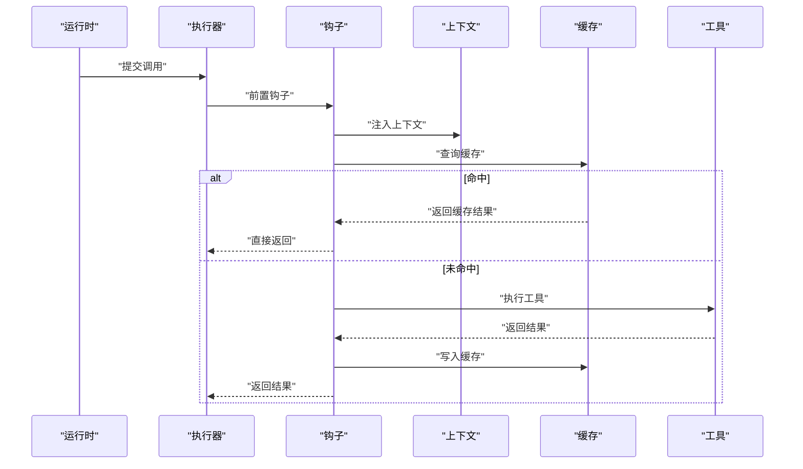
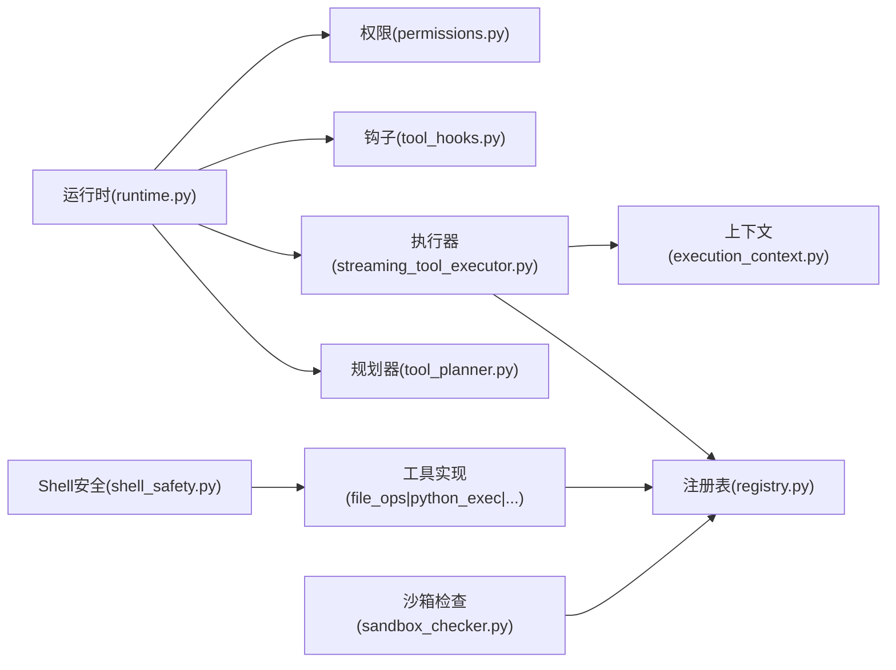

# 工具系统

<cite>
**本文引用的文件**
- [opc/layer4_tools/registry.py](file://opc/layer4_tools/registry.py)
- [opc/layer4_tools/file_ops.py](file://opc/layer4_tools/file_ops.py)
- [opc/layer4_tools/python_exec.py](file://opc/layer4_tools/python_exec.py)
- [opc/layer4_tools/browser.py](file://opc/layer4_tools/browser.py)
- [opc/layer4_tools/git_ops.py](file://opc/layer4_tools/git_ops.py)
- [opc/layer4_tools/web_search.py](file://opc/layer4_tools/web_search.py)
- [opc/layer4_tools/shell.py](file://opc/layer4_tools/shell.py)
- [opc/layer4_tools/todo.py](file://opc/layer4_tools/todo.py)
- [opc/layer4_tools/user_input.py](file://opc/layer4_tools/user_input.py)
- [opc/layer4_tools/collaboration.py](file://opc/layer4_tools/collaboration.py)
- [opc/layer4_tools/execution_context.py](file://opc/layer4_tools/execution_context.py)
- [opc/layer3_agent/runtime_v2/tool_hooks.py](file://opc/layer3_agent/runtime_v2/tool_hooks.py)
- [opc/layer3_agent/runtime_v2/streaming_tool_executor.py](file://opc/layer3_agent/runtime_v2/streaming_tool_executor.py)
- [opc/layer3_agent/runtime_v2/tool_planner.py](file://opc/layer3_agent/runtime_v2/tool_planner.py)
- [opc/layer3_agent/runtime_v2/permissions.py](file://opc/layer3_agent/runtime_v2/permissions.py)
- [opc/layer3_agent/runtime_v2/runtime.py](file://opc/layer3_agent/runtime_v2/runtime.py)
- [opc/layer2_organization/shell_safety.py](file://opc/layer2_organization/shell_safety.py)
- [opc/market/sandbox_checker.py](file://opc/market/sandbox_checker.py)
</cite>

## 目录
1. [简介](#简介)
2. [项目结构](#项目结构)
3. [核心组件](#核心组件)
4. [架构总览](#架构总览)
5. [详细组件分析](#详细组件分析)
6. [依赖分析](#依赖分析)
7. [性能考虑](#性能考虑)
8. [故障排查指南](#故障排查指南)
9. [结论](#结论)
10. [附录](#附录)

## 简介
本文件面向开发者与集成者，系统性阐述 OpenOPC 工具系统的注册机制、发现算法、内置工具用法与配置、自定义工具开发规范、执行环境安全限制与资源隔离、上下文传递与结果缓存、权限管理与访问控制，以及性能优化与调试技巧。目标是帮助读者快速理解并扩展系统能力，构建稳定、可观测、可审计的工具生态。

## 项目结构
OpenOPC 将“工具”作为独立的一层（layer4），通过统一的注册表进行集中管理，并由运行时（runtime_v2）在编排阶段选择与调度工具。关键目录与职责：
- layer4_tools：工具实现与注册中心
- layer3_agent/runtime_v2：工具编排、流式执行、钩子与权限
- layer2_organization：通用安全策略（如 shell 沙箱）
- market：包市场与沙箱检查器（用于外部工具包的准入校验）

图表来源
- [opc/layer4_tools/registry.py](file://opc/layer4_tools/registry.py)
- [opc/layer4_tools/file_ops.py](file://opc/layer4_tools/file_ops.py)
- [opc/layer4_tools/python_exec.py](file://opc/layer4_tools/python_exec.py)
- [opc/layer4_tools/browser.py](file://opc/layer4_tools/browser.py)
- [opc/layer4_tools/git_ops.py](file://opc/layer4_tools/git_ops.py)
- [opc/layer4_tools/web_search.py](file://opc/layer4_tools/web_search.py)
- [opc/layer4_tools/shell.py](file://opc/layer4_tools/shell.py)
- [opc/layer4_tools/todo.py](file://opc/layer4_tools/todo.py)
- [opc/layer4_tools/user_input.py](file://opc/layer4_tools/user_input.py)
- [opc/layer4_tools/collaboration.py](file://opc/layer4_tools/collaboration.py)
- [opc/layer4_tools/execution_context.py](file://opc/layer4_tools/execution_context.py)
- [opc/layer3_agent/runtime_v2/runtime.py](file://opc/layer3_agent/runtime_v2/runtime.py)
- [opc/layer3_agent/runtime_v2/tool_planner.py](file://opc/layer3_agent/runtime_v2/tool_planner.py)
- [opc/layer3_agent/runtime_v2/streaming_tool_executor.py](file://opc/layer3_agent/runtime_v2/streaming_tool_executor.py)
- [opc/layer3_agent/runtime_v2/tool_hooks.py](file://opc/layer3_agent/runtime_v2/tool_hooks.py)
- [opc/layer3_agent/runtime_v2/permissions.py](file://opc/layer3_agent/runtime_v2/permissions.py)
- [opc/layer2_organization/shell_safety.py](file://opc/layer2_organization/shell_safety.py)
- [opc/market/sandbox_checker.py](file://opc/market/sandbox_checker.py)

章节来源
- [opc/layer4_tools/registry.py](file://opc/layer4_tools/registry.py)
- [opc/layer3_agent/runtime_v2/runtime.py](file://opc/layer3_agent/runtime_v2/runtime.py)

## 核心组件
本节聚焦工具注册与发现、执行上下文、运行时编排与钩子、权限控制等核心能力。

- 工具注册与发现
  - 注册表提供统一入口，负责工具的声明、元数据收集、参数模式定义、可见性与可用性过滤。
  - 发现算法基于注册表索引，结合当前会话上下文、权限策略与运行约束，筛选可用工具集。
  - 支持动态加载与热更新，便于插件化扩展。

- 执行上下文
  - 为每次工具调用携带工作区路径、身份标识、会话ID、时间戳、日志通道等。
  - 上下文由运行时注入，并在工具钩子中透传，确保可观测与可审计。

- 运行时编排与流式执行
  - 规划器根据任务目标生成工具调用序列或并行计划。
  - 流式执行器按序或并发执行工具，支持增量输出与中断恢复。
  - 钩子系统在调用前后注入监控、限流、计费、审计等横切逻辑。

- 权限与访问控制
  - 权限模块对工具级能力进行白名单/黑名单控制，结合角色与策略决定是否允许调用。
  - Shell 安全策略对命令执行进行白名单与参数校验，防止越权与危险操作。
  - 沙箱检查器对外部工具包进行静态与动态安全检查。

章节来源
- [opc/layer4_tools/registry.py](file://opc/layer4_tools/registry.py)
- [opc/layer4_tools/execution_context.py](file://opc/layer4_tools/execution_context.py)
- [opc/layer3_agent/runtime_v2/tool_planner.py](file://opc/layer3_agent/runtime_v2/tool_planner.py)
- [opc/layer3_agent/runtime_v2/streaming_tool_executor.py](file://opc/layer3_agent/runtime_v2/streaming_tool_executor.py)
- [opc/layer3_agent/runtime_v2/tool_hooks.py](file://opc/layer3_agent/runtime_v2/tool_hooks.py)
- [opc/layer3_agent/runtime_v2/permissions.py](file://opc/layer3_agent/runtime_v2/permissions.py)
- [opc/layer2_organization/shell_safety.py](file://opc/layer2_organization/shell_safety.py)
- [opc/market/sandbox_checker.py](file://opc/market/sandbox_checker.py)

## 架构总览
下图展示从运行时到工具层的端到端调用链路，包括规划、权限校验、执行、钩子与上下文传递。

图表来源
- [opc/layer3_agent/runtime_v2/runtime.py](file://opc/layer3_agent/runtime_v2/runtime.py)
- [opc/layer3_agent/runtime_v2/tool_planner.py](file://opc/layer3_agent/runtime_v2/tool_planner.py)
- [opc/layer3_agent/runtime_v2/permissions.py](file://opc/layer3_agent/runtime_v2/permissions.py)
- [opc/layer3_agent/runtime_v2/streaming_tool_executor.py](file://opc/layer3_agent/runtime_v2/streaming_tool_executor.py)
- [opc/layer3_agent/runtime_v2/tool_hooks.py](file://opc/layer3_agent/runtime_v2/tool_hooks.py)
- [opc/layer4_tools/registry.py](file://opc/layer4_tools/registry.py)
- [opc/layer4_tools/execution_context.py](file://opc/layer4_tools/execution_context.py)
- [opc/layer4_tools/file_ops.py](file://opc/layer4_tools/file_ops.py)
- [opc/layer4_tools/python_exec.py](file://opc/layer4_tools/python_exec.py)

## 详细组件分析

### 工具注册与发现
- 注册表职责
  - 维护工具清单与元数据（名称、描述、参数模式、版本、可见性）。
  - 提供查询接口，支持按标签、能力、平台过滤。
  - 处理冲突与覆盖规则，保证唯一性与稳定性。
- 发现算法要点
  - 初始化时扫描已注册工具，构建索引。
  - 运行时根据上下文（角色、权限、工作区）计算可用集合。
  - 支持增量更新与失效缓存。

图表来源
- [opc/layer4_tools/registry.py](file://opc/layer4_tools/registry.py)

章节来源
- [opc/layer4_tools/registry.py](file://opc/layer4_tools/registry.py)

### 执行上下文与结果缓存
- 执行上下文
  - 包含工作区路径、会话ID、身份标识、时间戳、日志通道、追踪ID等。
  - 由运行时在调用前注入，供工具与钩子读取。
- 结果缓存
  - 针对幂等工具，可按输入签名缓存结果，减少重复开销。
  - 缓存键由工具名+规范化参数组成，支持TTL与失效策略。
  - 缓存命中时直接返回，未命中则执行并回填。

图表来源
- [opc/layer4_tools/execution_context.py](file://opc/layer4_tools/execution_context.py)
- [opc/layer3_agent/runtime_v2/streaming_tool_executor.py](file://opc/layer3_agent/runtime_v2/streaming_tool_executor.py)

章节来源
- [opc/layer4_tools/execution_context.py](file://opc/layer4_tools/execution_context.py)
- [opc/layer3_agent/runtime_v2/streaming_tool_executor.py](file://opc/layer3_agent/runtime_v2/streaming_tool_executor.py)

### 权限管理与访问控制
- 权限模型
  - 工具级能力白名单/黑名单，结合角色与策略判定。
  - 支持细粒度参数校验（如路径范围、命令白名单）。
- 安全策略
  - Shell 安全策略限制命令与参数，防止越权与破坏性操作。
  - 沙箱检查器对外部工具包进行静态与动态检查，阻断高风险行为。

图表来源
- [opc/layer3_agent/runtime_v2/permissions.py](file://opc/layer3_agent/runtime_v2/permissions.py)
- [opc/layer2_organization/shell_safety.py](file://opc/layer2_organization/shell_safety.py)
- [opc/market/sandbox_checker.py](file://opc/market/sandbox_checker.py)

章节来源
- [opc/layer3_agent/runtime_v2/permissions.py](file://opc/layer3_agent/runtime_v2/permissions.py)
- [opc/layer2_organization/shell_safety.py](file://opc/layer2_organization/shell_safety.py)
- [opc/market/sandbox_checker.py](file://opc/market/sandbox_checker.py)

### 内置工具：文件操作
- 功能概述
  - 提供读写文件、列出目录、移动/复制、删除、创建目录等常用能力。
  - 支持路径规范化与工作区边界检查，避免越界访问。
- 参数与配置
  - 典型参数包括路径、内容、目标路径、递归选项等。
  - 可通过策略限制最大文件大小、允许的文件类型与路径前缀。
- 使用建议
  - 优先使用相对路径与工作区根目录。
  - 批量操作建议使用事务式接口，失败回滚。

章节来源
- [opc/layer4_tools/file_ops.py](file://opc/layer4_tools/file_ops.py)

### 内置工具：Python代码执行
- 功能概述
  - 在受限环境中执行 Python 代码片段，返回标准输出或结构化结果。
  - 支持导入白名单、内存与CPU限制、超时控制。
- 参数与配置
  - 代码文本、环境变量、导入白名单、超时秒数、内存上限等。
  - 可通过钩子注入日志与度量。
- 安全注意
  - 严格限制系统调用与网络访问。
  - 禁止动态加载不受信任的模块。

章节来源
- [opc/layer4_tools/python_exec.py](file://opc/layer4_tools/python_exec.py)

### 内置工具：浏览器控制
- 功能概述
  - 启动/控制浏览器实例，支持页面导航、截图、元素交互、表单填写。
  - 适合自动化测试与信息抓取场景。
- 参数与配置
  - 目标URL、操作指令、等待策略、代理设置等。
  - 可配置无头模式与窗口大小。
- 使用建议
  - 合理设置超时与重试，避免阻塞。
  - 敏感信息不要以明文形式出现在URL或表单中。

章节来源
- [opc/layer4_tools/browser.py](file://opc/layer4_tools/browser.py)

### 内置工具：Git操作
- 功能概述
  - 封装常见 Git 命令：克隆、拉取、提交、推送、分支切换、差异查看等。
  - 支持仓库路径、认证凭据、SSH密钥配置。
- 参数与配置
  - 仓库地址、本地路径、分支名、提交消息、远程配置等。
  - 可启用只读模式与变更审计。
- 使用建议
  - 在受控工作区内操作，避免跨仓库误改。
  - 大仓库操作建议分步执行与进度上报。

章节来源
- [opc/layer4_tools/git_ops.py](file://opc/layer4_tools/git_ops.py)

### 内置工具：网络搜索
- 功能概述
  - 调用搜索引擎或知识源，返回摘要、链接与相关度评分。
  - 支持关键词、时间范围、语言与站点过滤。
- 参数与配置
  - 查询词、引擎选择、分页、结果数量、过滤条件等。
  - 可配置代理与速率限制。
- 使用建议
  - 对高频查询启用缓存，降低外部依赖压力。
  - 遵循服务条款与反爬策略。

章节来源
- [opc/layer4_tools/web_search.py](file://opc/layer4_tools/web_search.py)

### 内置工具：Shell命令执行
- 功能概述
  - 在沙箱内执行系统命令，返回退出码与输出。
  - 适用于运维脚本与轻量任务。
- 参数与配置
  - 命令字符串、工作目录、超时、环境变量。
  - 必须配合 Shell 安全策略使用。
- 安全注意
  - 仅允许白名单命令与参数模板。
  - 禁止交互式命令与持久化进程。

章节来源
- [opc/layer4_tools/shell.py](file://opc/layer4_tools/shell.py)
- [opc/layer2_organization/shell_safety.py](file://opc/layer2_organization/shell_safety.py)

### 内置工具：待办与用户输入
- 待办工具
  - 提供增删改查与状态流转，便于任务跟踪与协作。
  - 支持标签、优先级、截止日期与关联工作项。
- 用户输入工具
  - 在流程中暂停并请求人类确认或补充信息。
  - 支持富文本与附件上传。

章节来源
- [opc/layer4_tools/todo.py](file://opc/layer4_tools/todo.py)
- [opc/layer4_tools/user_input.py](file://opc/layer4_tools/user_input.py)

### 内置工具：协作
- 功能概述
  - 提供团队协同相关的工具能力，如共享文档、评论、审批流等。
  - 与组织运行时集成，支持权限与可见性控制。
- 参数与配置
  - 资源ID、操作类型、参与者、策略开关等。

章节来源
- [opc/layer4_tools/collaboration.py](file://opc/layer4_tools/collaboration.py)

### 自定义工具开发指南
- 接口规范
  - 定义工具元数据：名称、描述、参数模式、返回值结构。
  - 实现调用函数：接收上下文与参数，返回结果或流式事件。
  - 可选：实现幂等键生成器以启用缓存。
- 参数验证
  - 使用注册表的参数模式进行强校验，拒绝非法输入。
  - 对路径、命令、URL等进行白名单与格式校验。
- 错误处理
  - 明确区分业务错误与系统错误，返回结构化错误码与消息。
  - 在钩子中记录异常堆栈与上下文快照，便于定位。
- 注册与发布
  - 在注册表中登记新工具，设置可见性与权限标签。
  - 如需打包分发，遵循市场包格式并通过沙箱检查。

图表来源
- [opc/layer4_tools/registry.py](file://opc/layer4_tools/registry.py)
- [opc/market/sandbox_checker.py](file://opc/market/sandbox_checker.py)

章节来源
- [opc/layer4_tools/registry.py](file://opc/layer4_tools/registry.py)
- [opc/market/sandbox_checker.py](file://opc/market/sandbox_checker.py)

### 工具执行环境的安全限制与资源隔离
- 资源限制
  - CPU/内存/磁盘配额，超时与重试上限。
  - 网络访问白名单与代理强制。
- 隔离策略
  - 进程级或容器级隔离，禁止跨会话共享状态。
  - 文件系统映射至工作区，禁止逃逸。
- 审计与可观测
  - 全链路日志、指标采集与告警。
  - 关键操作的审批与回放。

章节来源
- [opc/layer3_agent/runtime_v2/streaming_tool_executor.py](file://opc/layer3_agent/runtime_v2/streaming_tool_executor.py)
- [opc/layer2_organization/shell_safety.py](file://opc/layer2_organization/shell_safety.py)
- [opc/market/sandbox_checker.py](file://opc/market/sandbox_checker.py)

### 工具调用的上下文传递与结果缓存机制
- 上下文传递
  - 运行时在调用前注入执行上下文，贯穿钩子与工具实现。
  - 支持追踪ID、会话ID、工作区、身份与策略快照。
- 结果缓存
  - 幂等工具自动缓存，非幂等工具需显式禁用。
  - 缓存键规范化与TTL策略，避免脏读与雪崩。

图表来源
- [opc/layer3_agent/runtime_v2/streaming_tool_executor.py](file://opc/layer3_agent/runtime_v2/streaming_tool_executor.py)
- [opc/layer3_agent/runtime_v2/tool_hooks.py](file://opc/layer3_agent/runtime_v2/tool_hooks.py)
- [opc/layer4_tools/execution_context.py](file://opc/layer4_tools/execution_context.py)

章节来源
- [opc/layer3_agent/runtime_v2/streaming_tool_executor.py](file://opc/layer3_agent/runtime_v2/streaming_tool_executor.py)
- [opc/layer3_agent/runtime_v2/tool_hooks.py](file://opc/layer3_agent/runtime_v2/tool_hooks.py)
- [opc/layer4_tools/execution_context.py](file://opc/layer4_tools/execution_context.py)

## 依赖分析
- 组件耦合
  - 运行时依赖规划器、执行器、钩子与权限模块。
  - 工具层依赖注册表与执行上下文。
  - 安全策略与沙箱检查器为横切关注点。
- 外部依赖
  - 浏览器驱动、Git客户端、搜索引擎API、Shell解释器等。
- 潜在循环依赖
  - 工具不应反向依赖运行时；通过注册表与上下文解耦。

图表来源
- [opc/layer3_agent/runtime_v2/runtime.py](file://opc/layer3_agent/runtime_v2/runtime.py)
- [opc/layer3_agent/runtime_v2/tool_planner.py](file://opc/layer3_agent/runtime_v2/tool_planner.py)
- [opc/layer3_agent/runtime_v2/streaming_tool_executor.py](file://opc/layer3_agent/runtime_v2/streaming_tool_executor.py)
- [opc/layer3_agent/runtime_v2/tool_hooks.py](file://opc/layer3_agent/runtime_v2/tool_hooks.py)
- [opc/layer3_agent/runtime_v2/permissions.py](file://opc/layer3_agent/runtime_v2/permissions.py)
- [opc/layer4_tools/registry.py](file://opc/layer4_tools/registry.py)
- [opc/layer4_tools/execution_context.py](file://opc/layer4_tools/execution_context.py)
- [opc/layer4_tools/file_ops.py](file://opc/layer4_tools/file_ops.py)
- [opc/layer4_tools/python_exec.py](file://opc/layer4_tools/python_exec.py)
- [opc/layer2_organization/shell_safety.py](file://opc/layer2_organization/shell_safety.py)
- [opc/market/sandbox_checker.py](file://opc/market/sandbox_checker.py)

章节来源
- [opc/layer3_agent/runtime_v2/runtime.py](file://opc/layer3_agent/runtime_v2/runtime.py)
- [opc/layer4_tools/registry.py](file://opc/layer4_tools/registry.py)

## 性能考虑
- 批处理与并行
  - 对独立工具调用采用并行执行，提升吞吐。
  - 对I/O密集型工具使用异步与连接池。
- 缓存与去重
  - 对幂等工具启用结果缓存，减少外部依赖延迟。
  - 对相似查询进行合并与去重。
- 资源配额与背压
  - 设置CPU/内存/超时上限，避免单工具拖垮整体。
  - 对上游流量进行限流与退避。
- 可观测性
  - 采集耗时、错误率、缓存命中率等指标，建立告警阈值。

[本节为通用指导，不直接分析具体文件]

## 故障排查指南
- 常见问题
  - 权限不足：检查权限策略与工具白名单。
  - 超时与资源耗尽：调整配额与重试策略。
  - 缓存不一致：检查缓存键规范化与TTL。
  - 外部依赖不可用：配置代理与降级策略。
- 诊断步骤
  - 查看钩子日志与审计记录，定位调用链。
  - 检查执行上下文快照，确认工作区与身份。
  - 复现实验：最小化参数与隔离环境。

章节来源
- [opc/layer3_agent/runtime_v2/tool_hooks.py](file://opc/layer3_agent/runtime_v2/tool_hooks.py)
- [opc/layer4_tools/execution_context.py](file://opc/layer4_tools/execution_context.py)

## 结论
OpenOPC 工具系统通过统一的注册与发现机制、严格的权限与安全策略、完善的上下文与缓存体系，提供了可扩展、可观测、可治理的工具执行环境。开发者可基于现有规范快速实现与发布新工具，同时借助运行时编排与钩子获得一致的执行体验与治理能力。

## 附录
- 术语
  - 工具：具备明确输入输出与副作用能力的可调用单元。
  - 钩子：在工具调用前后执行的横切逻辑。
  - 上下文：一次调用所需的运行时环境与元数据。
- 最佳实践
  - 幂等设计、参数校验、错误分类、可观测性、安全优先。

[本节为概念性内容，不直接分析具体文件]