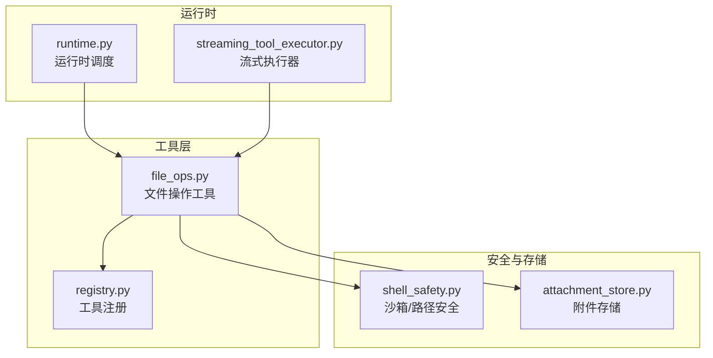
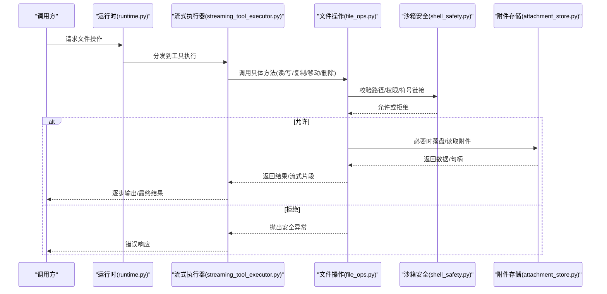
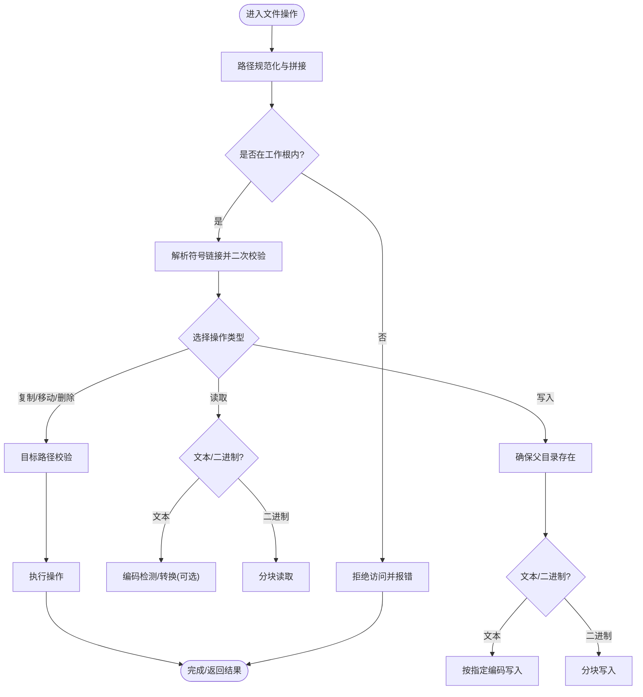
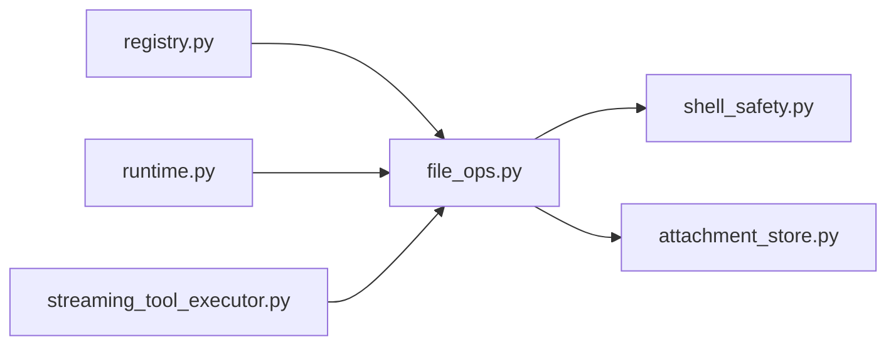

# 文件操作工具

<cite>
**本文引用的文件**   
- [file_ops.py](file://opc/layer4_tools/file_ops.py)
- [shell_safety.py](file://opc/layer2_organization/shell_safety.py)
- [runtime.py](file://opc/layer3_agent/runtime_v2/runtime.py)
- [streaming_tool_executor.py](file://opc/layer3_agent/runtime_v2/streaming_tool_executor.py)
- [registry.py](file://opc/layer4_tools/registry.py)
- [attachment_store.py](file://opc/core/attachment_store.py)
</cite>

## 目录
1. [简介](#简介)
2. [项目结构](#项目结构)
3. [核心组件](#核心组件)
4. [架构总览](#架构总览)
5. [详细组件分析](#详细组件分析)
6. [依赖关系分析](#依赖关系分析)
7. [性能考量](#性能考量)
8. [故障排查指南](#故障排查指南)
9. [结论](#结论)
10. [附录](#附录)

## 简介
本文件面向OpenOPC中的“文件操作工具”，聚焦于在受控沙箱环境中对文件系统的安全、高效访问。文档覆盖以下主题：
- 文件读取、写入、复制、移动、删除等操作的用法与约束
- 路径处理机制与安全限制（相对路径解析、符号链接处理、访问权限控制）
- 大文件处理策略与流式读写支持
- 文件编码检测与自动转换能力
- 批量文件操作与递归处理的示例思路
- 文件监控与变更通知机制
- 错误处理与异常恢复策略
- 最佳实践，确保用户安全高效地操作文件系统

## 项目结构
OpenOPC将“文件操作”作为工具层的一部分，位于 layer4_tools 下，并通过运行时与沙箱安全策略进行集成。关键位置如下：
- 工具实现：opc/layer4_tools/file_ops.py
- 沙箱与路径安全：opc/layer2_organization/shell_safety.py
- 运行时与工具执行：opc/layer3_agent/runtime_v2/runtime.py、opc/layer3_agent/runtime_v2/streaming_tool_executor.py
- 工具注册表：opc/layer4_tools/registry.py
- 附件存储（与文件操作相关）：opc/core/attachment_store.py

图表来源
- [file_ops.py](file://opc/layer4_tools/file_ops.py)
- [registry.py](file://opc/layer4_tools/registry.py)
- [runtime.py](file://opc/layer3_agent/runtime_v2/runtime.py)
- [streaming_tool_executor.py](file://opc/layer3_agent/runtime_v2/streaming_tool_executor.py)
- [shell_safety.py](file://opc/layer2_organization/shell_safety.py)
- [attachment_store.py](file://opc/core/attachment_store.py)

章节来源
- [file_ops.py](file://opc/layer4_tools/file_ops.py)
- [shell_safety.py](file://opc/layer2_organization/shell_safety.py)
- [runtime.py](file://opc/layer3_agent/runtime_v2/runtime.py)
- [streaming_tool_executor.py](file://opc/layer3_agent/runtime_v2/streaming_tool_executor.py)
- [registry.py](file://opc/layer4_tools/registry.py)
- [attachment_store.py](file://opc/core/attachment_store.py)

## 核心组件
- 文件操作工具（file_ops.py）
  - 提供统一的文件I/O接口：读取、写入、追加、复制、移动、删除、列出目录、获取元信息等
  - 内置路径规范化与白名单校验，防止越权访问
  - 支持流式读写与大文件分块处理
  - 可选的编码检测与自动转换
  - 批量与递归遍历封装
- 沙箱与路径安全（shell_safety.py）
  - 定义允许的工作根目录与可访问子树
  - 拒绝危险路径（如绝对路径逃逸、符号链接指向外部）
  - 统一权限检查与审计日志
- 运行时与流式执行（runtime.py、streaming_tool_executor.py）
  - 将工具暴露为可调用的API，并在沙箱中执行
  - 流式执行器支持长耗时任务的分片输出与进度反馈
- 工具注册（registry.py）
  - 集中注册文件操作工具，供运行时发现与调用
- 附件存储（attachment_store.py）
  - 管理临时或持久化附件文件的存放与生命周期

章节来源
- [file_ops.py](file://opc/layer4_tools/file_ops.py)
- [shell_safety.py](file://opc/layer2_organization/shell_safety.py)
- [runtime.py](file://opc/layer3_agent/runtime_v2/runtime.py)
- [streaming_tool_executor.py](file://opc/layer3_agent/runtime_v2/streaming_tool_executor.py)
- [registry.py](file://opc/layer4_tools/registry.py)
- [attachment_store.py](file://opc/core/attachment_store.py)

## 架构总览
文件操作工具通过运行时被上层编排调用，所有路径访问均经过沙箱安全检查；大文件采用流式IO；编码检测与转换在必要时触发；批量与递归操作以迭代器/生成器方式避免一次性加载。

图表来源
- [runtime.py](file://opc/layer3_agent/runtime_v2/runtime.py)
- [streaming_tool_executor.py](file://opc/layer3_agent/runtime_v2/streaming_tool_executor.py)
- [file_ops.py](file://opc/layer4_tools/file_ops.py)
- [shell_safety.py](file://opc/layer2_organization/shell_safety.py)
- [attachment_store.py](file://opc/core/attachment_store.py)

## 详细组件分析

### 文件操作工具（file_ops.py）
- 功能概览
  - 读取：文本/二进制读取，支持按行或分块
  - 写入/追加：文本/二进制写入，支持创建父目录
  - 复制/移动/删除：跨目录操作，含目标存在性检查
  - 列表与元信息：列出目录内容、获取文件大小/时间戳等
  - 批量与递归：遍历目录树、过滤匹配规则
  - 编码检测与转换：基于BOM与启发式策略识别编码并转换
  - 流式读写：对大文件使用分块IO，降低内存占用
- 路径与安全
  - 所有路径在进入系统前进行规范化与白名单校验
  - 禁止访问工作根目录之外的路径
  - 符号链接解析后进行二次校验，防止绕过
- 错误处理
  - 区分权限不足、路径不存在、磁盘空间不足、编码错误等
  - 提供可重试策略与回滚建议（如移动失败时提示先复制再删除）

图表来源
- [file_ops.py](file://opc/layer4_tools/file_ops.py)
- [shell_safety.py](file://opc/layer2_organization/shell_safety.py)

章节来源
- [file_ops.py](file://opc/layer4_tools/file_ops.py)
- [shell_safety.py](file://opc/layer2_organization/shell_safety.py)

### 沙箱与路径安全（shell_safety.py）
- 设计要点
  - 工作根目录白名单：仅允许在配置的工作区内访问
  - 路径规范化：消除冗余分隔符、相对路径解析、禁止“..”逃逸
  - 符号链接处理：强制解析后再次校验，拒绝指向外部区域的链接
  - 权限控制：结合操作系统权限与内部策略，记录审计日志
- 典型行为
  - 当检测到越界路径或非法符号链接时，立即拒绝并返回明确错误码
  - 提供辅助函数用于判断路径合法性与计算相对路径

章节来源
- [shell_safety.py](file://opc/layer2_organization/shell_safety.py)

### 运行时与流式执行（runtime.py、streaming_tool_executor.py）
- 运行时（runtime.py）
  - 负责工具发现、参数校验、上下文注入（如工作根目录）
  - 将文件操作工具暴露为可远程调用的接口
- 流式执行器（streaming_tool_executor.py）
  - 针对耗时操作（如大文件拷贝/扫描）提供分片输出
  - 支持进度回调与中断信号，便于前端展示与取消

章节来源
- [runtime.py](file://opc/layer3_agent/runtime_v2/runtime.py)
- [streaming_tool_executor.py](file://opc/layer3_agent/runtime_v2/streaming_tool_executor.py)

### 工具注册（registry.py）
- 作用
  - 集中注册文件操作工具及其元信息（名称、描述、参数契约）
  - 供运行时动态加载与调用
- 扩展点
  - 新增文件操作能力时，需在注册表中声明，以便被发现

章节来源
- [registry.py](file://opc/layer4_tools/registry.py)

### 附件存储（attachment_store.py）
- 职责
  - 管理临时或持久化的附件文件，提供唯一命名与清理策略
  - 与文件操作工具协作，避免直接暴露底层路径
- 与文件操作的关系
  - 大文件上传/下载场景下，作为中间存储层，配合流式读写

章节来源
- [attachment_store.py](file://opc/core/attachment_store.py)

## 依赖关系分析
- 耦合关系
  - file_ops.py 强依赖 shell_safety.py 的路径与权限校验
  - runtime.py 与 streaming_tool_executor.py 共同驱动工具执行
  - registry.py 为工具提供发现入口
  - attachment_store.py 作为文件落盘的抽象层
- 潜在风险
  - 若安全策略更新，需同步验证文件操作工具的调用路径
  - 流式执行器需保证异常传播与资源释放

图表来源
- [registry.py](file://opc/layer4_tools/registry.py)
- [file_ops.py](file://opc/layer4_tools/file_ops.py)
- [runtime.py](file://opc/layer3_agent/runtime_v2/runtime.py)
- [streaming_tool_executor.py](file://opc/layer3_agent/runtime_v2/streaming_tool_executor.py)
- [shell_safety.py](file://opc/layer2_organization/shell_safety.py)
- [attachment_store.py](file://opc/core/attachment_store.py)

章节来源
- [registry.py](file://opc/layer4_tools/registry.py)
- [file_ops.py](file://opc/layer4_tools/file_ops.py)
- [runtime.py](file://opc/layer3_agent/runtime_v2/runtime.py)
- [streaming_tool_executor.py](file://opc/layer3_agent/runtime_v2/streaming_tool_executor.py)
- [shell_safety.py](file://opc/layer2_organization/shell_safety.py)
- [attachment_store.py](file://opc/core/attachment_store.py)

## 性能考量
- 大文件处理
  - 优先使用分块IO，避免一次性加载到内存
  - 对复制/移动操作，尽量使用系统级原子操作以减少拷贝开销
- 流式读写
  - 使用生成器/迭代器模式逐块处理，降低峰值内存
  - 合理设置块大小，平衡I/O次数与CPU开销
- 编码检测
  - 仅在必要时启用，避免对每个小文件都进行昂贵检测
  - 缓存检测结果，减少重复计算
- 并发与锁
  - 对同一文件的并发写入需加锁，避免竞态条件
  - 批量操作可采用有限并行度，避免耗尽系统资源

[本节为通用指导，不直接分析具体文件]

## 故障排查指南
- 常见错误与定位
  - 路径越界：检查工作根目录配置与路径规范化逻辑
  - 符号链接拒绝：确认目标是否指向工作区外
  - 权限不足：核对操作系统权限与内部策略
  - 编码错误：查看编码检测结果与转换选项
  - 磁盘空间不足：检查目标分区容量与配额
- 恢复策略
  - 对于移动失败，建议先复制再删除，并提供回滚步骤
  - 对于部分写入失败，保留已写入片段并提示断点续写
  - 对网络或外部存储异常，增加重试与退避策略

章节来源
- [file_ops.py](file://opc/layer4_tools/file_ops.py)
- [shell_safety.py](file://opc/layer2_organization/shell_safety.py)

## 结论
OpenOPC的文件操作工具在严格的安全沙箱内提供完整的文件I/O能力，兼顾易用性与安全性。通过路径白名单、符号链接校验、流式IO与编码检测，既能满足日常开发需求，也能支撑大规模数据处理。建议在业务侧遵循最小权限原则，合理使用批量与递归操作，并结合运行时提供的流式能力提升用户体验。

[本节为总结性内容，不直接分析具体文件]

## 附录

### 常用操作速查
- 读取文件
  - 文本读取：指定编码或使用自动检测
  - 二进制读取：分块读取，适合大文件
- 写入文件
  - 文本写入：指定编码，必要时创建父目录
  - 二进制写入：分块写入，支持追加模式
- 复制/移动/删除
  - 目标存在性检查与权限校验
  - 失败时的回滚建议
- 批量与递归
  - 遍历目录树，按规则过滤
  - 生成器模式避免一次性加载
- 编码检测与转换
  - 基于BOM与启发式策略
  - 可选自动转换至UTF-8

[本节为概念性说明，不直接分析具体文件]