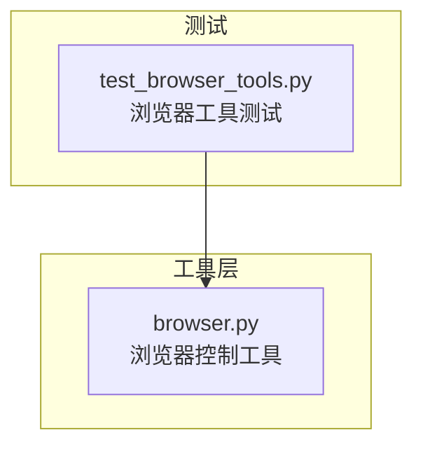
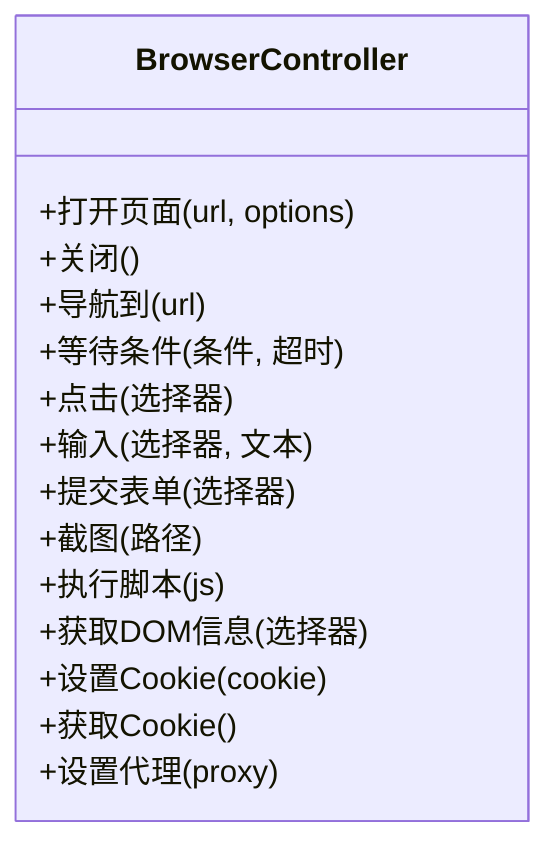
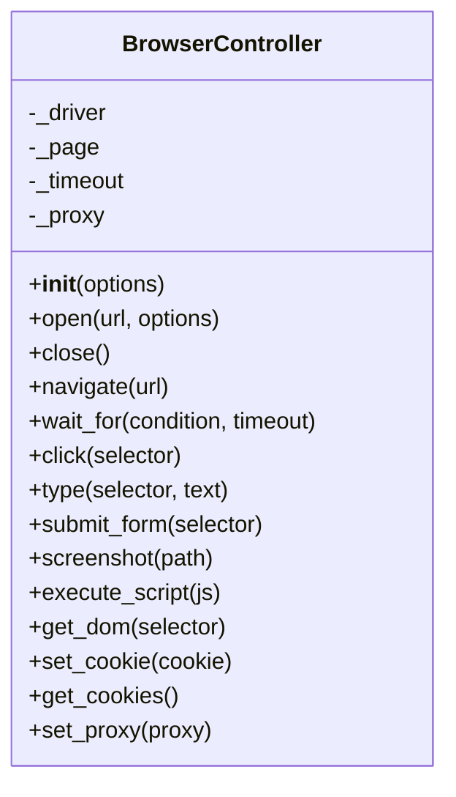
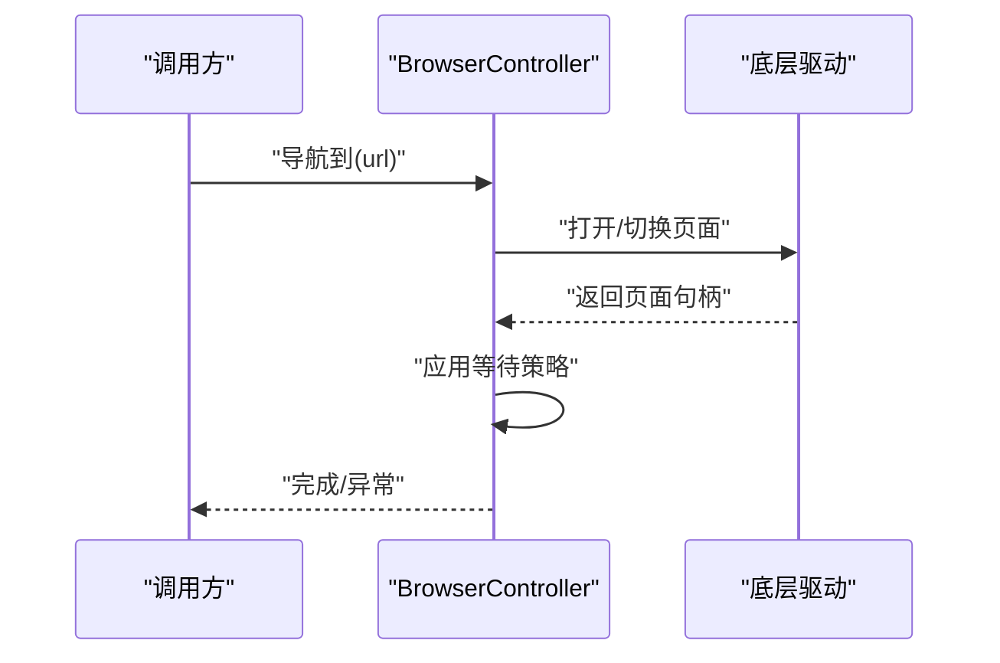
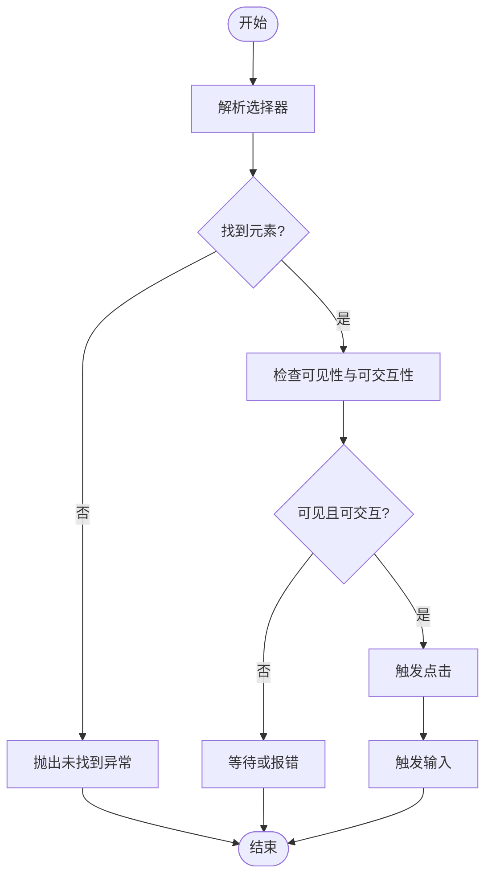
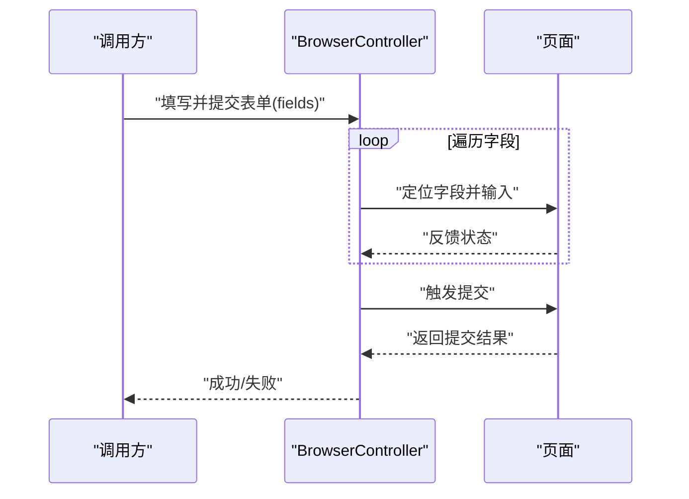
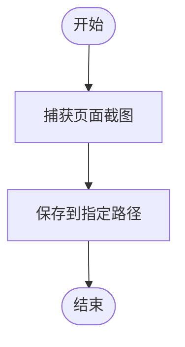
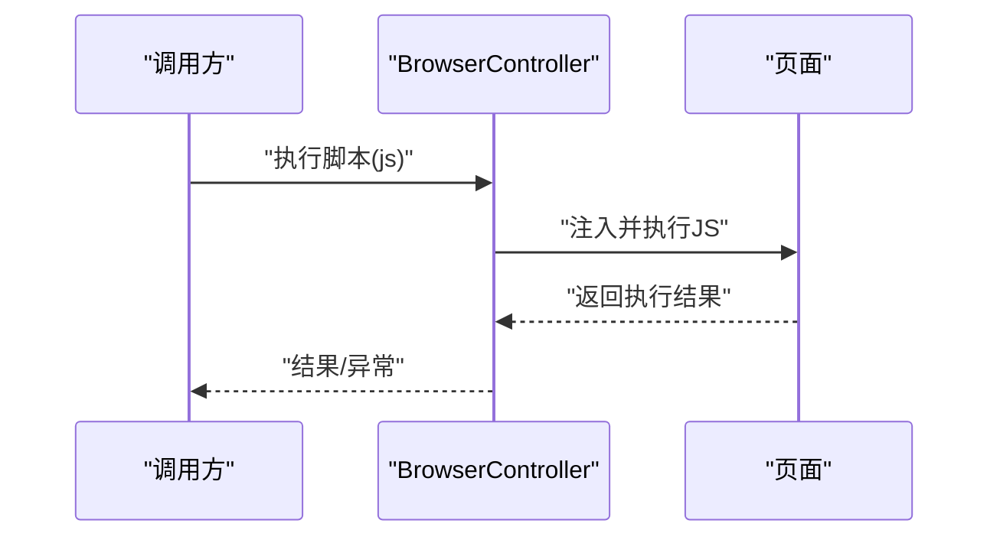
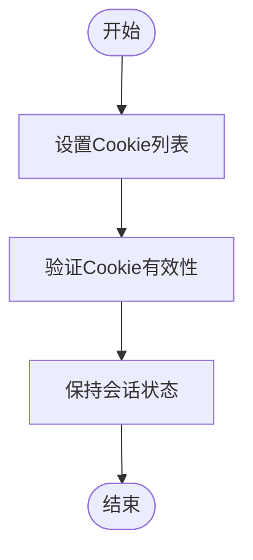
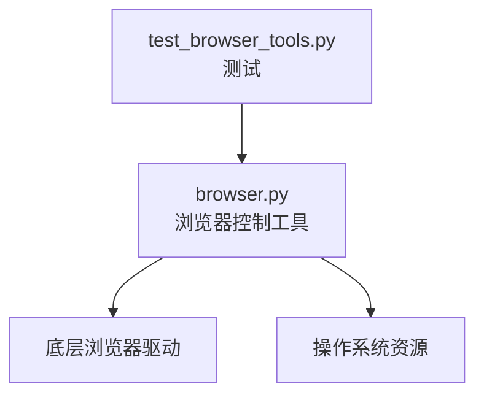

# 浏览器控制工具

<cite>
**本文引用的文件**   
- [browser.py](file://opc/layer4_tools/browser.py)
- [test_browser_tools.py](file://tests/test_browser_tools.py)
</cite>

## 目录
1. [简介](#简介)
2. [项目结构](#项目结构)
3. [核心组件](#核心组件)
4. [架构总览](#架构总览)
5. [详细组件分析](#详细组件分析)
6. [依赖关系分析](#依赖关系分析)
7. [性能考虑](#性能考虑)
8. [故障排查指南](#故障排查指南)
9. [结论](#结论)
10. [附录](#附录)

## 简介
本文件为 OpenOPC 中的“浏览器控制工具”提供全面文档，聚焦于网页自动化操作的实现原理与最佳实践。内容涵盖：
- 页面导航、元素定位、表单填写与截图能力
- 无头浏览器的配置选项与性能优化
- JavaScript 执行环境与 DOM 操作能力
- Cookie 管理与会话保持机制
- 网页数据抓取与交互测试的实用示例
- 反爬虫检测应对策略与代理配置
- 页面等待策略与超时处理

目标是帮助用户高效、稳定地进行网页自动化操作。

## 项目结构
OpenOPC 将浏览器控制能力作为“工具层”的一部分对外暴露，便于上层 Agent 或任务编排调用。关键位置如下：
- 工具实现：opc/layer4_tools/browser.py
- 相关测试：tests/test_browser_tools.py

图表来源
- [browser.py](file://opc/layer4_tools/browser.py)
- [test_browser_tools.py](file://tests/test_browser_tools.py)

章节来源
- [browser.py](file://opc/layer4_tools/browser.py)
- [test_browser_tools.py](file://tests/test_browser_tools.py)

## 核心组件
本节对浏览器控制工具的核心能力进行概览说明，包括：
- 启动与生命周期管理（创建、关闭、复用）
- 页面导航与跳转
- 元素定位与交互（点击、输入、选择等）
- 表单自动填写与提交
- 截图与页面快照
- JavaScript 执行与 DOM 查询
- Cookie 与本地存储访问
- 等待策略与超时控制
- 代理与反爬规避

上述能力由 browser.py 中定义的类与方法提供，并通过测试用例验证其可用性。

章节来源
- [browser.py](file://opc/layer4_tools/browser.py)
- [test_browser_tools.py](file://tests/test_browser_tools.py)

## 架构总览
浏览器控制工具在 OpenOPC 的工具层中扮演“浏览器驱动封装”的角色，向上层提供统一接口，屏蔽底层浏览器差异。

图表来源
- [browser.py](file://opc/layer4_tools/browser.py)

章节来源
- [browser.py](file://opc/layer4_tools/browser.py)

## 详细组件分析

### 浏览器控制器类
该组件负责浏览器实例的生命周期管理、页面操作与状态维护。典型职责包括：
- 初始化与配置（无头模式、窗口大小、用户代理等）
- 页面导航与加载等待
- 元素定位与交互（基于选择器）
- 表单填写与提交
- 截图与导出
- JS 执行与 DOM 读取
- Cookie 与存储读写
- 代理与网络层配置
- 等待策略与超时控制

图表来源
- [browser.py](file://opc/layer4_tools/browser.py)

章节来源
- [browser.py](file://opc/layer4_tools/browser.py)

### 页面导航流程
以下序列图展示从发起导航到页面就绪的关键步骤，体现等待策略与错误处理。

图表来源
- [browser.py](file://opc/layer4_tools/browser.py)

章节来源
- [browser.py](file://opc/layer4_tools/browser.py)

### 元素定位与交互流程
以“点击并输入”为例，展示选择器解析、可见性检查、事件触发与结果返回。

图表来源
- [browser.py](file://opc/layer4_tools/browser.py)

章节来源
- [browser.py](file://opc/layer4_tools/browser.py)

### 表单填写与提交
表单自动化通常包含字段填充、校验提示处理与提交动作。

图表来源
- [browser.py](file://opc/layer4_tools/browser.py)

章节来源
- [browser.py](file://opc/layer4_tools/browser.py)

### 截图与快照
截图常用于调试与结果留存。

图表来源
- [browser.py](file://opc/layer4_tools/browser.py)

章节来源
- [browser.py](file://opc/layer4_tools/browser.py)

### JavaScript 执行与 DOM 操作
通过执行脚本扩展页面能力，如动态注入、批量采集与复杂交互。

图表来源
- [browser.py](file://opc/layer4_tools/browser.py)

章节来源
- [browser.py](file://opc/layer4_tools/browser.py)

### Cookie 管理与会话保持
用于登录态维持、跨请求一致性以及多标签页共享上下文。

图表来源
- [browser.py](file://opc/layer4_tools/browser.py)

章节来源
- [browser.py](file://opc/layer4_tools/browser.py)

### 代理与反爬策略
- 代理配置：支持 HTTP/SOCKS 代理，避免 IP 被封禁
- 反爬规避：随机 User-Agent、指纹伪装、请求间隔抖动、验证码处理辅助
- 行为模拟：真实鼠标轨迹、滚动、延迟输入，降低被识别风险

章节来源
- [browser.py](file://opc/layer4_tools/browser.py)

### 等待策略与超时处理
- 显式等待：按条件等待（元素可见、可点击、文本出现等）
- 隐式等待：全局超时兜底
- 重试与退避：针对不稳定页面的自适应重试

章节来源
- [browser.py](file://opc/layer4_tools/browser.py)

### 实用示例（数据抓取与交互测试）
以下为常见场景的使用思路（不直接展示代码，仅给出参考路径）：
- 登录并抓取列表数据：先设置 Cookie 或执行登录流程，再定位列表项并提取文本
- 搜索与筛选：在搜索框输入关键词，触发搜索，等待结果渲染后抓取
- 分页抓取：循环翻页，累计抓取条目
- 表单自动化：定位表单字段，逐项输入，提交并断言结果
- 截图取证：在关键步骤截取页面，保存至本地

参考路径
- [browser.py](file://opc/layer4_tools/browser.py)
- [test_browser_tools.py](file://tests/test_browser_tools.py)

章节来源
- [browser.py](file://opc/layer4_tools/browser.py)
- [test_browser_tools.py](file://tests/test_browser_tools.py)

## 依赖关系分析
浏览器控制工具位于工具层，主要依赖底层浏览器驱动与系统资源。

图表来源
- [browser.py](file://opc/layer4_tools/browser.py)
- [test_browser_tools.py](file://tests/test_browser_tools.py)

章节来源
- [browser.py](file://opc/layer4_tools/browser.py)
- [test_browser_tools.py](file://tests/test_browser_tools.py)

## 性能考虑
- 无头模式：减少 UI 开销，提升吞吐
- 并发控制：限制并行浏览器实例数量，避免资源争用
- 资源回收：及时关闭页面与浏览器实例，释放内存
- 缓存与复用：合理复用 Cookie 与本地存储，减少重复登录
- 图片与媒体禁用：按需禁用非必需资源，加速加载
- 选择器优化：使用更精确的选择器，减少查找耗时
- 等待策略调优：最小化不必要的等待，结合显式等待提高稳定性

[本节为通用指导，无需特定文件引用]

## 故障排查指南
常见问题与定位建议：
- 元素未找到：检查选择器是否匹配、页面是否已完全加载、是否存在 iframe 或 shadow DOM
- 超时异常：调整等待策略与超时阈值，确认目标站点响应时间
- 登录态失效：刷新 Cookie，必要时重新执行登录流程
- 代理不可用：校验代理地址、端口与认证信息，尝试更换代理
- 截图失败：检查输出路径权限与磁盘空间
- 脚本执行异常：确认页面上下文与沙箱限制，简化脚本逻辑

章节来源
- [browser.py](file://opc/layer4_tools/browser.py)
- [test_browser_tools.py](file://tests/test_browser_tools.py)

## 结论
浏览器控制工具为 OpenOPC 提供了统一的网页自动化能力，覆盖导航、交互、截图、脚本执行、Cookie 管理、代理与反爬、等待与超时等关键环节。通过合理的配置与等待策略，可在保证稳定性的同时获得良好性能。建议在生产环境中结合监控与日志，持续优化选择器与等待逻辑，确保在高并发与不稳定网络条件下的鲁棒性。

[本节为总结性内容，无需特定文件引用]

## 附录
- 术语
  - 无头浏览器：不显示图形界面的浏览器运行模式
  - 显式等待：基于条件的等待策略
  - 隐式等待：全局超时兜底
  - 选择器：用于定位页面元素的规则表达式
- 参考路径
  - [browser.py](file://opc/layer4_tools/browser.py)
  - [test_browser_tools.py](file://tests/test_browser_tools.py)