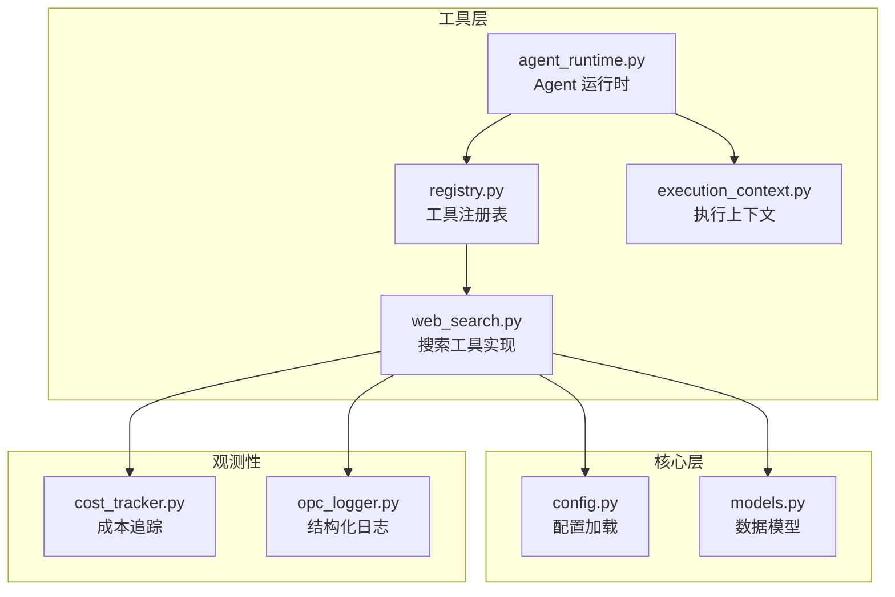
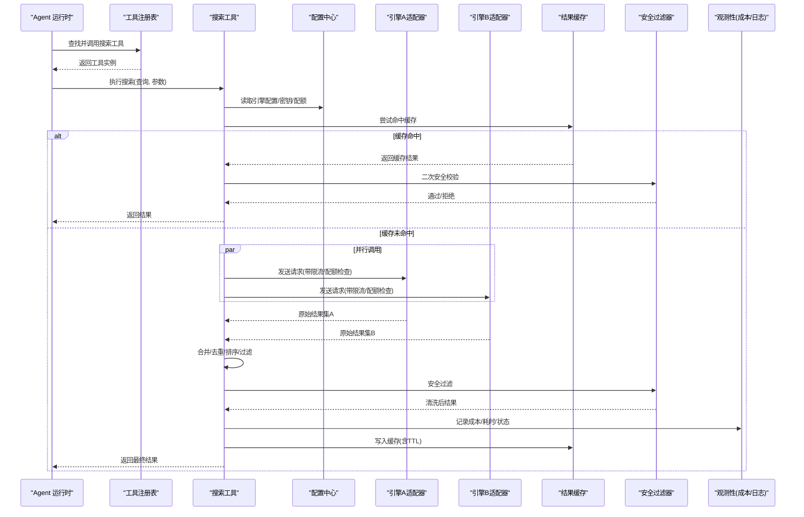
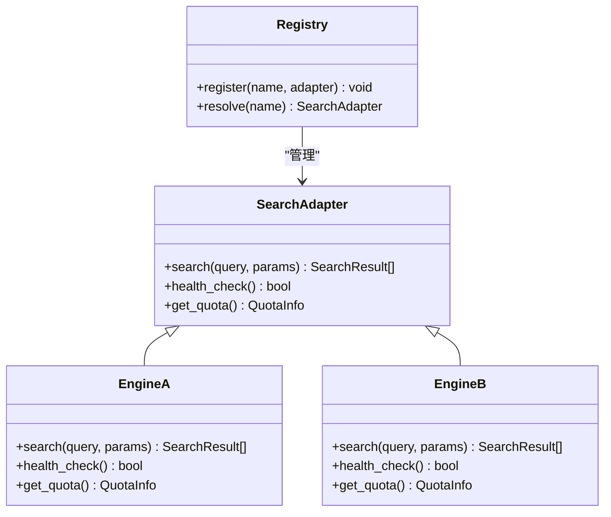
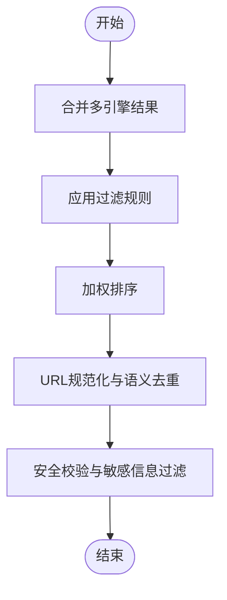
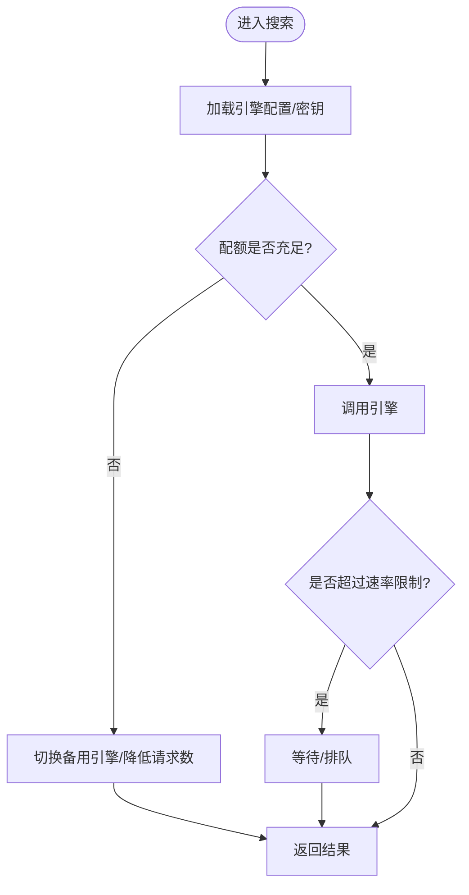
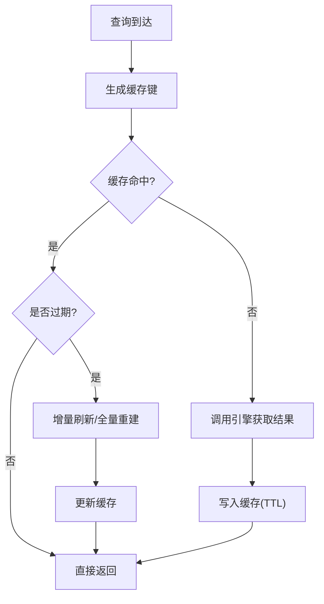
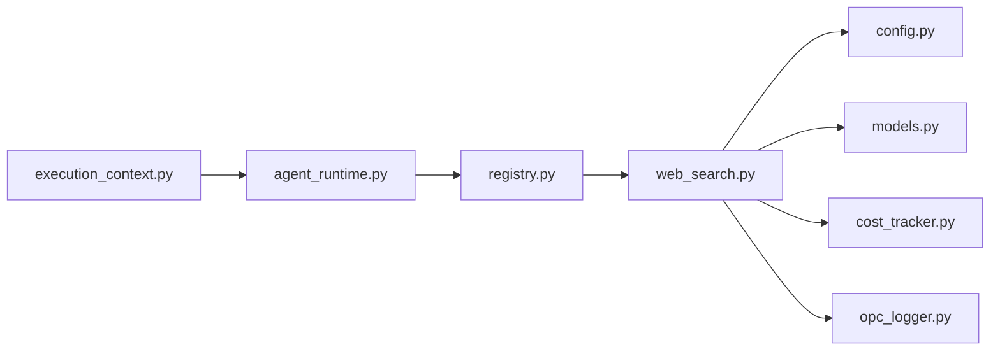

# 网络搜索工具

<cite>
**本文引用的文件**   
- [web_search.py](file://opc/layer4_tools/web_search.py)
- [web_search.md](file://skills/core/web_search.md)
- [registry.py](file://opc/layer4_tools/registry.py)
- [agent_runtime.py](file://opc/layer4_tools/agent_runtime.py)
- [execution_context.py](file://opc/layer4_tools/execution_context.py)
- [config.py](file://opc/core/config.py)
- [models.py](file://opc/core/models.py)
- [cost_tracker.py](file://opc/layer6_observability/cost_tracker.py)
- [opc_logger.py](file://opc/layer6_observability/opc_logger.py)
</cite>

## 目录
1. [简介](#简介)
2. [项目结构](#项目结构)
3. [核心组件](#核心组件)
4. [架构总览](#架构总览)
5. [详细组件分析](#详细组件分析)
6. [依赖关系分析](#依赖关系分析)
7. [性能考量](#性能考量)
8. [故障排查指南](#故障排查指南)
9. [结论](#结论)
10. [附录](#附录)

## 简介
本文件为 OpenOPC 中的“网络搜索工具”提供全面文档，聚焦搜索引擎集成、多引擎支持与结果聚合、过滤排序与去重、API 密钥管理与配额控制、高级搜索语法与查询优化、缓存与增量更新、敏感信息过滤与内容安全、以及搜索历史与分析能力。目标是帮助开发者与使用者获得高质量的网络搜索结果，并在生产环境中稳定运行。

## 项目结构
OpenOPC 将“网络搜索”作为可插拔工具暴露给上层 Agent 运行时。关键位置如下：
- 工具实现：opc/layer4_tools/web_search.py
- 工具注册与发现：opc/layer4_tools/registry.py
- 执行上下文与运行时桥接：opc/layer4_tools/execution_context.py、opc/layer4_tools/agent_runtime.py
- 配置加载：opc/core/config.py
- 数据模型：opc/core/models.py
- 观测性（成本与日志）：opc/layer6_observability/cost_tracker.py、opc/layer6_observability/opc_logger.py
- 技能说明（面向使用者的能力描述）：skills/core/web_search.md

图表来源
- [web_search.py](file://opc/layer4_tools/web_search.py)
- [registry.py](file://opc/layer4_tools/registry.py)
- [execution_context.py](file://opc/layer4_tools/execution_context.py)
- [agent_runtime.py](file://opc/layer4_tools/agent_runtime.py)
- [config.py](file://opc/core/config.py)
- [models.py](file://opc/core/models.py)
- [cost_tracker.py](file://opc/layer6_observability/cost_tracker.py)
- [opc_logger.py](file://opc/layer6_observability/opc_logger.py)

章节来源
- [web_search.py](file://opc/layer4_tools/web_search.py)
- [registry.py](file://opc/layer4_tools/registry.py)
- [execution_context.py](file://opc/layer4_tools/execution_context.py)
- [agent_runtime.py](file://opc/layer4_tools/agent_runtime.py)
- [config.py](file://opc/core/config.py)
- [models.py](file://opc/core/models.py)
- [cost_tracker.py](file://opc/layer6_observability/cost_tracker.py)
- [opc_logger.py](file://opc/layer6_observability/opc_logger.py)

## 核心组件
- 搜索引擎适配器抽象
  - 定义统一的搜索接口与返回结构，屏蔽不同后端差异。
  - 支持按引擎名选择具体实现，便于扩展新引擎。
- 多引擎调度器
  - 并行或串行调用多个引擎，合并结果并去重。
  - 根据权重、质量分、时间等策略进行排序。
- 结果处理管道
  - 过滤：基于域名白名单/黑名单、语言、时间范围、类型等。
  - 排序：相关性、时效性、权威度、点击率等指标。
  - 去重：URL 规范化 + 语义相似度阈值。
- 密钥与配额管理
  - 从配置中心读取各引擎的 API Key、速率限制、每日配额。
  - 在请求前检查配额，超限则降级或回退到备用引擎。
- 缓存与增量更新
  - 对相同查询进行短期缓存；对热点条目做增量刷新。
  - 缓存键包含查询指纹、参数哈希与版本标识。
- 安全与合规
  - 敏感信息过滤（PII、令牌、密钥片段）。
  - 内容安全校验（恶意链接、钓鱼域名、违规内容）。
- 历史与分析
  - 记录查询、耗时、成本、命中率、失败原因等指标。
  - 提供统计视图用于调优与审计。

章节来源
- [web_search.py](file://opc/layer4_tools/web_search.py)
- [models.py](file://opc/core/models.py)
- [config.py](file://opc/core/config.py)
- [cost_tracker.py](file://opc/layer6_observability/cost_tracker.py)
- [opc_logger.py](file://opc/layer6_observability/opc_logger.py)

## 架构总览
下图展示了从 Agent 发起搜索到最终返回结果的端到端流程，包括多引擎并发、聚合、过滤、排序、去重与安全校验。

图表来源
- [web_search.py](file://opc/layer4_tools/web_search.py)
- [registry.py](file://opc/layer4_tools/registry.py)
- [config.py](file://opc/core/config.py)
- [cost_tracker.py](file://opc/layer6_observability/cost_tracker.py)
- [opc_logger.py](file://opc/layer6_observability/opc_logger.py)

## 详细组件分析

### 搜索引擎适配器与多引擎支持
- 统一接口
  - 定义标准输入输出契约，确保不同引擎可被同等对待。
  - 返回结构包含标题、摘要、URL、发布时间、来源域、评分等字段。
- 引擎注册
  - 通过注册表动态发现可用引擎，支持热插拔。
- 并发与回退
  - 默认并行调用多个引擎，任一成功即可快速返回；全部失败时触发回退策略（如降低数量、放宽条件）。
- 权重与优先级
  - 每个引擎可配置权重与优先级，影响排序与选择顺序。

图表来源
- [web_search.py](file://opc/layer4_tools/web_search.py)
- [registry.py](file://opc/layer4_tools/registry.py)

章节来源
- [web_search.py](file://opc/layer4_tools/web_search.py)
- [registry.py](file://opc/layer4_tools/registry.py)

### 结果聚合、过滤、排序与去重
- 聚合
  - 合并多引擎结果，保留元数据与来源标记。
- 过滤
  - 域名白名单/黑名单、语言、时间窗口、结果类型、最低质量分等。
- 排序
  - 综合相关性、时效性、权威度、点击率、来源信誉等因子加权排序。
- 去重
  - URL 规范化（协议、主机、路径归一化），结合语义相似度阈值避免近似重复。

图表来源
- [web_search.py](file://opc/layer4_tools/web_search.py)

章节来源
- [web_search.py](file://opc/layer4_tools/web_search.py)

### API 密钥管理与配额控制
- 密钥来源
  - 从配置中心读取各引擎的 API Key、Base URL、超时、重试次数等。
- 配额与限流
  - 维护每引擎的配额计数器与速率限制器，防止超额使用。
- 熔断与回退
  - 当某引擎频繁失败或配额耗尽时，自动降级至其他引擎或减少请求量。
- 审计与告警
  - 记录配额使用、失败原因、延迟分布，便于监控与告警。

图表来源
- [web_search.py](file://opc/layer4_tools/web_search.py)
- [config.py](file://opc/core/config.py)

章节来源
- [web_search.py](file://opc/layer4_tools/web_search.py)
- [config.py](file://opc/core/config.py)

### 高级搜索语法与查询优化
- 语法建议
  - 精确匹配、布尔逻辑、字段限定（站点、时间、类型）、排除词、短语搜索等。
- 查询改写
  - 自动扩展同义词、纠正拼写、拆分复杂查询为子查询以提升召回。
- 参数调优
  - 调整 topN、时间窗口、语言、地域、结果类型以平衡精度与覆盖率。
- 提示工程
  - 结合业务场景构造提示，引导引擎返回更相关结果。

章节来源
- [web_search.py](file://opc/layer4_tools/web_search.py)
- [web_search.md](file://skills/core/web_search.md)

### 搜索结果缓存与增量更新
- 缓存键设计
  - 包含查询指纹、参数哈希、引擎版本、时间窗口等，保证一致性。
- TTL 与失效
  - 短 TTL 保障新鲜度，长 TTL 提升命中率；支持主动失效与被动过期。
- 增量更新
  - 对热点条目定期刷新，仅拉取变更部分，降低成本与延迟。
- 缓存存储
  - 内存缓存为主，必要时持久化到本地或共享存储。

图表来源
- [web_search.py](file://opc/layer4_tools/web_search.py)

章节来源
- [web_search.py](file://opc/layer4_tools/web_search.py)

### 敏感信息过滤与内容安全控制
- PII 与机密检测
  - 识别并脱敏个人身份信息、令牌、密钥片段等。
- 链接与域名安全
  - 黑名单域名拦截、钓鱼特征检测、证书有效性校验。
- 内容合规
  - 过滤违规内容、广告与低质页面，提升结果可信度。
- 审计留痕
  - 记录拦截原因与样本，便于后续分析与改进。

章节来源
- [web_search.py](file://opc/layer4_tools/web_search.py)

### 搜索历史记录与分析
- 记录维度
  - 查询文本、参数、耗时、成本、命中率、失败原因、引擎选择等。
- 指标与报表
  - 成功率、P95/P99 延迟、配额使用率、缓存命中率、Top 查询词。
- 决策支持
  - 依据分析结果调整权重、配额、缓存策略与过滤规则。

章节来源
- [web_search.py](file://opc/layer4_tools/web_search.py)
- [cost_tracker.py](file://opc/layer6_observability/cost_tracker.py)
- [opc_logger.py](file://opc/layer6_observability/opc_logger.py)

## 依赖关系分析
- 内部依赖
  - 工具层依赖核心配置与模型，观测性模块提供成本与日志能力。
- 外部依赖
  - 各搜索引擎 API、缓存存储、配额与限流服务、安全扫描服务。
- 耦合与内聚
  - 通过适配器与注册表解耦引擎实现，提高内聚性与可测试性。
- 循环依赖
  - 当前分层清晰，未发现循环依赖风险。

图表来源
- [web_search.py](file://opc/layer4_tools/web_search.py)
- [registry.py](file://opc/layer4_tools/registry.py)
- [agent_runtime.py](file://opc/layer4_tools/agent_runtime.py)
- [execution_context.py](file://opc/layer4_tools/execution_context.py)
- [config.py](file://opc/core/config.py)
- [models.py](file://opc/core/models.py)
- [cost_tracker.py](file://opc/layer6_observability/cost_tracker.py)
- [opc_logger.py](file://opc/layer6_observability/opc_logger.py)

章节来源
- [web_search.py](file://opc/layer4_tools/web_search.py)
- [registry.py](file://opc/layer4_tools/registry.py)
- [agent_runtime.py](file://opc/layer4_tools/agent_runtime.py)
- [execution_context.py](file://opc/layer4_tools/execution_context.py)
- [config.py](file://opc/core/config.py)
- [models.py](file://opc/core/models.py)
- [cost_tracker.py](file://opc/layer6_observability/cost_tracker.py)
- [opc_logger.py](file://opc/layer6_observability/opc_logger.py)

## 性能考量
- 并发与批处理
  - 合理设置并发度，避免下游限流；批量请求减少握手开销。
- 缓存命中率
  - 优化缓存键粒度与 TTL，提升命中率以降低延迟与成本。
- 排序与去重复杂度
  - 采用高效数据结构与近似去重算法，控制 O(n log n) 级别排序与线性扫描去重。
- 资源隔离
  - 为不同引擎分配独立连接池与线程池，避免相互影响。
- 降级策略
  - 在高峰期或配额紧张时自动降级，保障系统稳定性。

[本节为通用指导，不直接分析具体文件]

## 故障排查指南
- 常见问题
  - 引擎不可用：检查健康检查与熔断状态，确认网络连通与认证。
  - 配额耗尽：查看配额计数器与日志，调整配额或启用备用引擎。
  - 结果质量差：调整过滤与排序权重，优化查询语法与参数。
  - 缓存异常：核对缓存键一致性与 TTL，清理脏数据。
  - 安全拦截：审查拦截日志，更新黑名单与规则。
- 定位方法
  - 开启结构化日志，关注错误码、堆栈与上下文。
  - 使用观测性面板查看成本、延迟与成功率趋势。
  - 复现最小查询用例，逐步缩小问题范围。

章节来源
- [web_search.py](file://opc/layer4_tools/web_search.py)
- [opc_logger.py](file://opc/layer6_observability/opc_logger.py)
- [cost_tracker.py](file://opc/layer6_observability/cost_tracker.py)

## 结论
本工具通过适配器与注册表实现多引擎无缝集成，配合聚合、过滤、排序与去重管道，显著提升结果质量与可用性。密钥与配额管理、缓存与增量更新、安全过滤以及历史分析共同构成生产级能力。建议持续优化查询改写、权重策略与缓存策略，以获得更高性价比与更佳用户体验。

[本节为总结性内容，不直接分析具体文件]

## 附录
- 使用参考
  - 技能说明文档提供了面向使用者的能力概述与最佳实践。
- 扩展指南
  - 新增引擎需实现统一接口并注册到注册表，同时配置密钥与配额。
- 配置项清单
  - 引擎列表、权重、超时、重试、配额、缓存 TTL、过滤规则等。

章节来源
- [web_search.md](file://skills/core/web_search.md)
- [web_search.py](file://opc/layer4_tools/web_search.py)
- [config.py](file://opc/core/config.py)