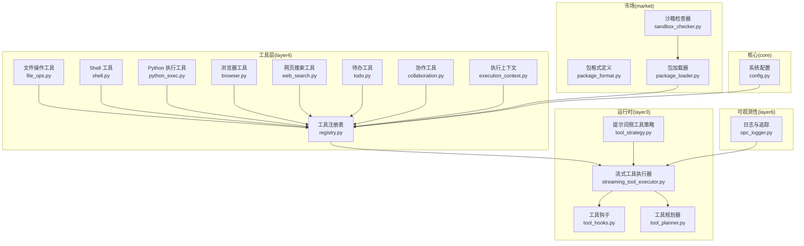
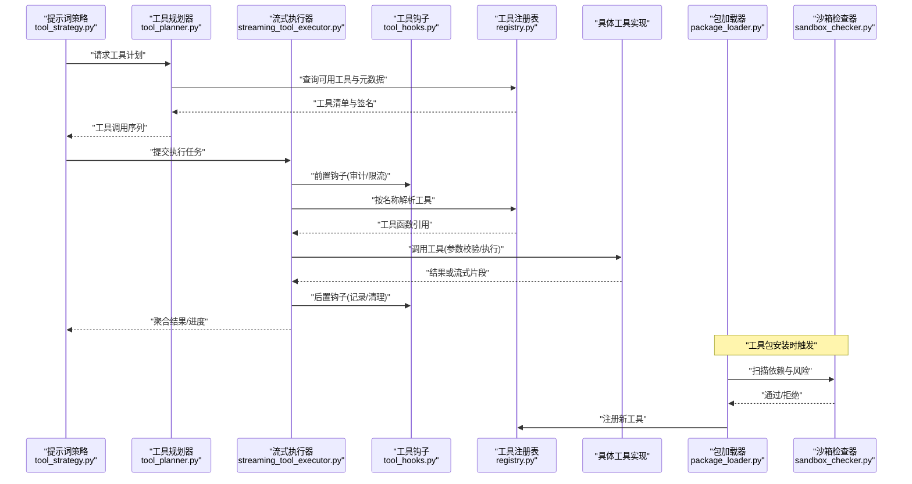
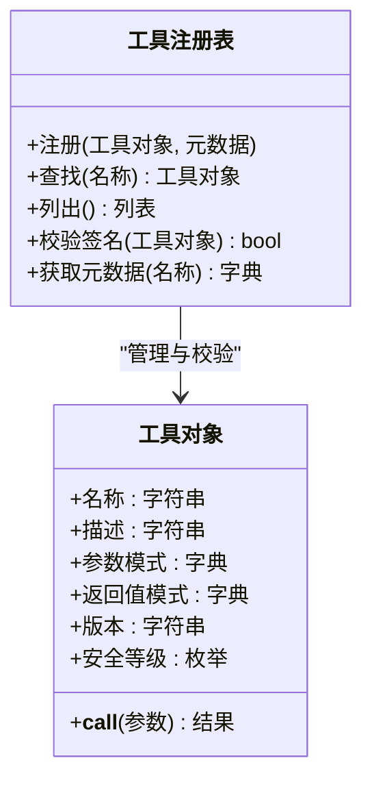
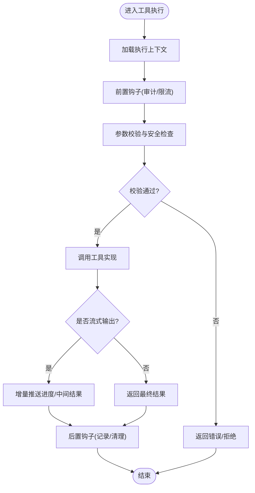
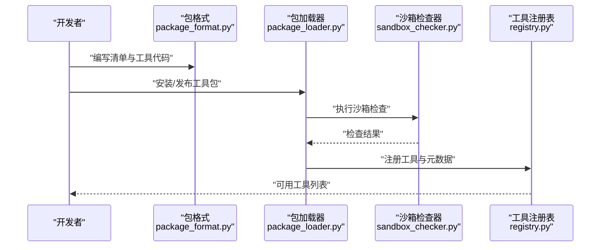
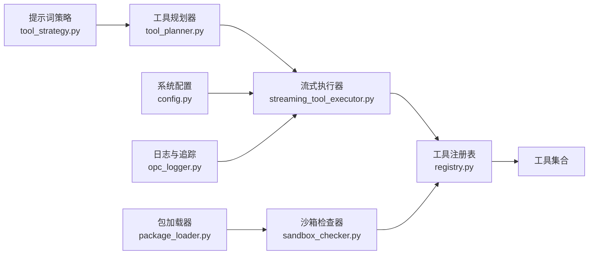

# 自定义工具开发

<cite>
**本文引用的文件**   
- [opc/layer4_tools/registry.py](file://opc/layer4_tools/registry.py)
- [opc/layer4_tools/file_ops.py](file://opc/layer4_tools/file_ops.py)
- [opc/layer4_tools/shell.py](file://opc/layer4_tools/shell.py)
- [opc/layer4_tools/python_exec.py](file://opc/layer4_tools/python_exec.py)
- [opc/layer4_tools/browser.py](file://opc/layer4_tools/browser.py)
- [opc/layer4_tools/web_search.py](file://opc/layer4_tools/web_search.py)
- [opc/layer4_tools/todo.py](file://opc/layer4_tools/todo.py)
- [opc/layer4_tools/collaboration.py](file://opc/layer4_tools/collaboration.py)
- [opc/layer4_tools/execution_context.py](file://opc/layer4_tools/execution_context.py)
- [opc/layer3_agent/runtime_v2/streaming_tool_executor.py](file://opc/layer3_agent/runtime_v2/streaming_tool_executor.py)
- [opc/layer3_agent/runtime_v2/tool_hooks.py](file://opc/layer3_agent/runtime_v2/tool_hooks.py)
- [opc/layer3_agent/runtime_v2/tool_planner.py](file://opc/layer3_agent/runtime_v2/tool_planner.py)
- [opc/layer3_agent/prompt_harness/tool_strategy.py](file://opc/layer3_agent/prompt_harness/tool_strategy.py)
- [opc/market/package_format.py](file://opc/market/package_format.py)
- [opc/market/package_loader.py](file://opc/market/package_loader.py)
- [opc/market/sandbox_checker.py](file://opc/market/sandbox_checker.py)
- [opc/core/config.py](file://opc/core/config.py)
- [opc/layer6_observability/opc_logger.py](file://opc/layer6_observability/opc_logger.py)
- [tests/test_native_tool_stack.py](file://tests/test_native_tool_stack.py)
- [tests/test_shell_safety.py](file://tests/test_shell_safety.py)
</cite>

## 目录
1. [简介](#简介)
2. [项目结构](#项目结构)
3. [核心组件](#核心组件)
4. [架构总览](#架构总览)
5. [详细组件分析](#详细组件分析)
6. [依赖关系分析](#依赖关系分析)
7. [性能与资源管理](#性能与资源管理)
8. [故障排查指南](#故障排查指南)
9. [结论](#结论)
10. [附录：接口规范与示例](#附录接口规范与示例)

## 简介
本指南面向需要在 OpenOPC 中开发“自定义工具”的工程师，覆盖从需求分析、接口设计、元数据定义、执行环境约束与安全限制，到测试、打包分发与上线的全流程。文档以代码仓库中的实际实现为依据，提供可操作的步骤、图示与最佳实践，帮助开发者快速构建高质量、可维护、可观测的自定义工具。

## 项目结构
OpenOPC 的工具体系位于 layer4_tools 层，由统一的注册中心进行发现与编排；运行时在 layer3_agent.runtime_v2 中负责调度、流式执行与钩子扩展；市场模块 market 提供工具包的格式、加载与沙箱检查能力；core.config 提供配置入口；layer6_observability 提供日志与可观测性。

图表来源
- [opc/layer4_tools/registry.py](file://opc/layer4_tools/registry.py)
- [opc/layer4_tools/file_ops.py](file://opc/layer4_tools/file_ops.py)
- [opc/layer4_tools/shell.py](file://opc/layer4_tools/shell.py)
- [opc/layer4_tools/python_exec.py](file://opc/layer4_tools/python_exec.py)
- [opc/layer4_tools/browser.py](file://opc/layer4_tools/browser.py)
- [opc/layer4_tools/web_search.py](file://opc/layer4_tools/web_search.py)
- [opc/layer4_tools/todo.py](file://opc/layer4_tools/todo.py)
- [opc/layer4_tools/collaboration.py](file://opc/layer4_tools/collaboration.py)
- [opc/layer4_tools/execution_context.py](file://opc/layer4_tools/execution_context.py)
- [opc/layer3_agent/runtime_v2/streaming_tool_executor.py](file://opc/layer3_agent/runtime_v2/streaming_tool_executor.py)
- [opc/layer3_agent/runtime_v2/tool_hooks.py](file://opc/layer3_agent/runtime_v2/tool_hooks.py)
- [opc/layer3_agent/runtime_v2/tool_planner.py](file://opc/layer3_agent/runtime_v2/tool_planner.py)
- [opc/layer3_agent/prompt_harness/tool_strategy.py](file://opc/layer3_agent/prompt_harness/tool_strategy.py)
- [opc/market/package_format.py](file://opc/market/package_format.py)
- [opc/market/package_loader.py](file://opc/market/package_loader.py)
- [opc/market/sandbox_checker.py](file://opc/market/sandbox_checker.py)
- [opc/core/config.py](file://opc/core/config.py)
- [opc/layer6_observability/opc_logger.py](file://opc/layer6_observability/opc_logger.py)

章节来源
- [opc/layer4_tools/registry.py](file://opc/layer4_tools/registry.py)
- [opc/layer3_agent/runtime_v2/streaming_tool_executor.py](file://opc/layer3_agent/runtime_v2/streaming_tool_executor.py)
- [opc/market/package_loader.py](file://opc/market/package_loader.py)
- [opc/core/config.py](file://opc/core/config.py)

## 核心组件
- 工具注册表：集中管理工具的发现、校验、版本与元数据，供运行时按名称解析并调用。
- 内置工具集：文件操作、Shell、Python 执行、浏览器、网页搜索、待办、协作等，作为自定义工具的参考实现。
- 执行上下文：为工具提供运行期信息（如会话、工作区、权限、资源配额等）。
- 流式执行器：支持长耗时任务的增量输出与中断控制，提升交互体验。
- 工具钩子：在执行前后注入审计、限流、监控等横切逻辑。
- 工具规划器：根据任务目标选择合适工具组合与顺序。
- 市场包：将一组工具打包为可分发的制品，包含格式定义、加载与沙箱检查。

章节来源
- [opc/layer4_tools/registry.py](file://opc/layer4_tools/registry.py)
- [opc/layer4_tools/execution_context.py](file://opc/layer4_tools/execution_context.py)
- [opc/layer3_agent/runtime_v2/streaming_tool_executor.py](file://opc/layer3_agent/runtime_v2/streaming_tool_executor.py)
- [opc/layer3_agent/runtime_v2/tool_hooks.py](file://opc/layer3_agent/runtime_v2/tool_hooks.py)
- [opc/layer3_agent/runtime_v2/tool_planner.py](file://opc/layer3_agent/runtime_v2/tool_planner.py)
- [opc/market/package_format.py](file://opc/market/package_format.py)
- [opc/market/package_loader.py](file://opc/market/package_loader.py)
- [opc/market/sandbox_checker.py](file://opc/market/sandbox_checker.py)

## 架构总览
下图展示了从“提示词侧工具策略”到“流式执行器”，再到“具体工具实现”的完整调用链，以及“市场包加载”和“沙箱检查”的集成点。

图表来源
- [opc/layer3_agent/prompt_harness/tool_strategy.py](file://opc/layer3_agent/prompt_harness/tool_strategy.py)
- [opc/layer3_agent/runtime_v2/tool_planner.py](file://opc/layer3_agent/runtime_v2/tool_planner.py)
- [opc/layer3_agent/runtime_v2/streaming_tool_executor.py](file://opc/layer3_agent/runtime_v2/streaming_tool_executor.py)
- [opc/layer3_agent/runtime_v2/tool_hooks.py](file://opc/layer3_agent/runtime_v2/tool_hooks.py)
- [opc/layer4_tools/registry.py](file://opc/layer4_tools/registry.py)
- [opc/market/package_loader.py](file://opc/market/package_loader.py)
- [opc/market/sandbox_checker.py](file://opc/market/sandbox_checker.py)

## 详细组件分析

### 工具注册表与元数据
- 职责：统一注册工具、校验签名、暴露元数据（名称、描述、参数模式、返回值类型、版本、作者、许可证等），并提供查找与过滤能力。
- 关键点：
  - 工具函数需遵循一致的签名约定（见附录接口规范）。
  - 元数据应包含安全等级、资源预算、是否允许网络访问等标签，便于运行时决策。
  - 支持动态加载与热更新，结合市场包机制实现分发。

图表来源
- [opc/layer4_tools/registry.py](file://opc/layer4_tools/registry.py)

章节来源
- [opc/layer4_tools/registry.py](file://opc/layer4_tools/registry.py)

### 内置工具参考实现
以下内置工具可作为自定义工具的模板，展示不同场景下的参数验证、错误处理与资源管理方式。

- 文件操作工具：路径白名单、权限检查、大文件分块读取、异常映射。
- Shell 工具：命令白名单、超时控制、输出大小限制、危险命令拦截。
- Python 执行工具：受限解释器、内存/CPU 配额、隔离导入、异常捕获。
- 浏览器工具：无头模式、页面截图、导航与元素交互、反爬策略。
- 网页搜索工具：代理与速率限制、结果去重、缓存策略。
- 待办工具：持久化存储、并发安全、状态机转换。
- 协作工具：事件总线、消息路由、幂等性与重试。

章节来源
- [opc/layer4_tools/file_ops.py](file://opc/layer4_tools/file_ops.py)
- [opc/layer4_tools/shell.py](file://opc/layer4_tools/shell.py)
- [opc/layer4_tools/python_exec.py](file://opc/layer4_tools/python_exec.py)
- [opc/layer4_tools/browser.py](file://opc/layer4_tools/browser.py)
- [opc/layer4_tools/web_search.py](file://opc/layer4_tools/web_search.py)
- [opc/layer4_tools/todo.py](file://opc/layer4_tools/todo.py)
- [opc/layer4_tools/collaboration.py](file://opc/layer4_tools/collaboration.py)

### 执行上下文与钩子
- 执行上下文：为工具提供当前会话、工作区、用户身份、配额与策略等信息，避免硬编码。
- 工具钩子：在工具执行前后插入审计、限流、指标上报、失败重试等横切逻辑，保证一致性与可观测性。

图表来源
- [opc/layer4_tools/execution_context.py](file://opc/layer4_tools/execution_context.py)
- [opc/layer3_agent/runtime_v2/tool_hooks.py](file://opc/layer3_agent/runtime_v2/tool_hooks.py)
- [opc/layer3_agent/runtime_v2/streaming_tool_executor.py](file://opc/layer3_agent/runtime_v2/streaming_tool_executor.py)

章节来源
- [opc/layer4_tools/execution_context.py](file://opc/layer4_tools/execution_context.py)
- [opc/layer3_agent/runtime_v2/tool_hooks.py](file://opc/layer3_agent/runtime_v2/tool_hooks.py)
- [opc/layer3_agent/runtime_v2/streaming_tool_executor.py](file://opc/layer3_agent/runtime_v2/streaming_tool_executor.py)

### 市场包与沙箱
- 包格式：定义工具包的目录结构、清单文件、依赖声明、元数据与签名。
- 包加载：解析清单、校验签名、安装依赖、注册工具。
- 沙箱检查：静态扫描危险 API、外部网络访问、文件系统越界等风险项。

图表来源
- [opc/market/package_format.py](file://opc/market/package_format.py)
- [opc/market/package_loader.py](file://opc/market/package_loader.py)
- [opc/market/sandbox_checker.py](file://opc/market/sandbox_checker.py)
- [opc/layer4_tools/registry.py](file://opc/layer4_tools/registry.py)

章节来源
- [opc/market/package_format.py](file://opc/market/package_format.py)
- [opc/market/package_loader.py](file://opc/market/package_loader.py)
- [opc/market/sandbox_checker.py](file://opc/market/sandbox_checker.py)

## 依赖关系分析
- 低耦合高内聚：每个工具独立实现，仅通过注册表暴露；执行器与钩子解耦，便于替换与扩展。
- 关键依赖链：
  - 提示词策略 → 工具规划器 → 流式执行器 → 工具注册表 → 具体工具
  - 包加载器 → 沙箱检查器 → 注册表
  - 配置中心 → 执行器/工具（影响行为）
  - 日志与可观测性 → 执行器/钩子（贯穿全链路）

图表来源
- [opc/layer3_agent/prompt_harness/tool_strategy.py](file://opc/layer3_agent/prompt_harness/tool_strategy.py)
- [opc/layer3_agent/runtime_v2/tool_planner.py](file://opc/layer3_agent/runtime_v2/tool_planner.py)
- [opc/layer3_agent/runtime_v2/streaming_tool_executor.py](file://opc/layer3_agent/runtime_v2/streaming_tool_executor.py)
- [opc/layer4_tools/registry.py](file://opc/layer4_tools/registry.py)
- [opc/market/package_loader.py](file://opc/market/package_loader.py)
- [opc/market/sandbox_checker.py](file://opc/market/sandbox_checker.py)
- [opc/core/config.py](file://opc/core/config.py)
- [opc/layer6_observability/opc_logger.py](file://opc/layer6_observability/opc_logger.py)

章节来源
- [opc/layer3_agent/prompt_harness/tool_strategy.py](file://opc/layer3_agent/prompt_harness/tool_strategy.py)
- [opc/layer3_agent/runtime_v2/tool_planner.py](file://opc/layer3_agent/runtime_v2/tool_planner.py)
- [opc/layer3_agent/runtime_v2/streaming_tool_executor.py](file://opc/layer3_agent/runtime_v2/streaming_tool_executor.py)
- [opc/layer4_tools/registry.py](file://opc/layer4_tools/registry.py)
- [opc/market/package_loader.py](file://opc/market/package_loader.py)
- [opc/market/sandbox_checker.py](file://opc/market/sandbox_checker.py)
- [opc/core/config.py](file://opc/core/config.py)
- [opc/layer6_observability/opc_logger.py](file://opc/layer6_observability/opc_logger.py)

## 性能与资源管理
- 流式输出：对长耗时任务采用增量推送，降低首响应延迟与内存占用。
- 资源配额：CPU/内存/IO 限额、连接池复用、超时与熔断。
- 缓存策略：热点结果缓存、去重键设计、失效策略。
- 批处理与并行：合理拆分任务，避免过度并发导致资源争用。
- 可观测性：指标采集、分布式追踪、结构化日志。

[本节为通用指导，不直接分析具体文件]

## 故障排查指南
- 常见问题定位：
  - 工具未注册或名称冲突：检查注册表与清单。
  - 参数校验失败：核对参数模式与默认值。
  - 执行超时/内存溢出：调整配额与分批策略。
  - 沙箱拒绝：审查依赖与外部访问。
- 调试技巧：
  - 启用详细日志与追踪 ID。
  - 使用单元测试与集成测试复现问题。
  - 在钩子中注入断点与快照。

章节来源
- [tests/test_native_tool_stack.py](file://tests/test_native_tool_stack.py)
- [tests/test_shell_safety.py](file://tests/test_shell_safety.py)

## 结论
通过统一的注册与执行框架、严格的沙箱与钩子机制、完善的包分发与可观测性，OpenOPC 为自定义工具提供了稳定、安全、可扩展的开发基座。遵循本文档的流程与规范，开发者可以高效交付高质量的自定义工具。

[本节为总结，不直接分析具体文件]

## 附录：接口规范与示例

### 工具接口规范
- 函数签名约定：
  - 输入参数：命名参数为主，支持可选参数与默认值。
  - 参数校验：在工具内部或注册阶段进行类型与范围校验。
  - 返回值：统一为结构化对象（含状态码、数据体、错误信息、进度等字段）。
- 元数据定义：
  - 名称、描述、版本、作者、许可证。
  - 参数模式（JSON Schema 风格）、返回值模式。
  - 安全等级、资源预算、是否允许网络访问、是否流式输出。
- 文档生成：
  - 基于元数据自动生成 API 文档与示例。
  - 支持在线预览与交互式测试。

章节来源
- [opc/layer4_tools/registry.py](file://opc/layer4_tools/registry.py)
- [opc/market/package_format.py](file://opc/market/package_format.py)

### 简单工具示例（思路）
- 目标：实现一个“问候”工具，接收用户名并返回问候语。
- 步骤：
  - 定义函数签名与参数校验。
  - 编写元数据（名称、描述、参数模式、返回值模式）。
  - 在注册表中注册工具。
  - 编写单测验证正常与异常分支。
  - 使用钩子记录调用日志。

章节来源
- [opc/layer4_tools/registry.py](file://opc/layer4_tools/registry.py)
- [opc/layer3_agent/runtime_v2/tool_hooks.py](file://opc/layer3_agent/runtime_v2/tool_hooks.py)

### 复杂工具示例（思路）
- 目标：实现一个“批量数据处理”工具，支持分页读取、转换与写入。
- 步骤：
  - 设计流式输出接口，逐步推送中间结果。
  - 引入执行上下文，读取配额与策略。
  - 增加重试与容错逻辑，记录失败详情。
  - 在沙箱检查中声明必要的外部依赖与访问范围。
  - 编写集成测试，模拟大数据量与异常场景。

章节来源
- [opc/layer3_agent/runtime_v2/streaming_tool_executor.py](file://opc/layer3_agent/runtime_v2/streaming_tool_executor.py)
- [opc/layer4_tools/execution_context.py](file://opc/layer4_tools/execution_context.py)
- [opc/market/sandbox_checker.py](file://opc/market/sandbox_checker.py)

### 测试策略与调试技巧
- 单元测试：覆盖参数校验、边界条件、异常路径。
- 集成测试：端到端验证工具注册、执行、流式输出与钩子。
- 性能测试：压测吞吐、延迟与资源消耗。
- 调试技巧：结构化日志、追踪 ID、快照与回放。

章节来源
- [tests/test_native_tool_stack.py](file://tests/test_native_tool_stack.py)
- [tests/test_shell_safety.py](file://tests/test_shell_safety.py)

### 打包与分发最佳实践
- 清单文件：明确依赖、元数据与权限。
- 签名与校验：确保来源可信与完整性。
- 沙箱检查：提前识别风险，减少上线后问题。
- 版本管理：语义化版本与变更日志。

章节来源
- [opc/market/package_format.py](file://opc/market/package_format.py)
- [opc/market/package_loader.py](file://opc/market/package_loader.py)
- [opc/market/sandbox_checker.py](file://opc/market/sandbox_checker.py)

### 执行环境约束与安全限制
- 文件系统：白名单路径、只读挂载、大小限制。
- 网络访问：域名白名单、超时与重试上限。
- 进程与线程：隔离执行、资源配额、崩溃恢复。
- 敏感信息：密钥管理、环境变量隔离。

章节来源
- [opc/layer4_tools/shell.py](file://opc/layer4_tools/shell.py)
- [opc/layer4_tools/python_exec.py](file://opc/layer4_tools/python_exec.py)
- [opc/layer4_tools/browser.py](file://opc/layer4_tools/browser.py)
- [opc/core/config.py](file://opc/core/config.py)