# 市场系统

<cite>
**本文引用的文件**   
- [opc/market/architecture_registry.py](file://opc/market/architecture_registry.py)
- [opc/market/package_format.py](file://opc/market/package_format.py)
- [opc/market/package_loader.py](file://opc/market/package_loader.py)
- [opc/market/sandbox_checker.py](file://opc/market/sandbox_checker.py)
- [opc/market/talent_presets.py](file://opc/market/talent_presets.py)
- [opc/market/builtin_presets/vc_investment_firm.yaml](file://opc/market/builtin_presets/vc_investment_firm.yaml)
- [opc/layer2_organization/talent_market.py](file://opc/layer2_organization/talent_market.py)
- [opc/layer5_memory/skill_library.py](file://opc/layer5_memory/skill_library.py)
- [opc/layer5_memory/skill_importer.py](file://opc/layer5_memory/skill_importer.py)
- [opc/layer3_agent/skill_installer.py](file://opc/layer3_agent/skill_installer.py)
- [opc/plugins/office_ui/services/market.py](file://opc/plugins/office_ui/services/market.py)
- [opc/plugins/office_ui/frontend_src/org/ArchitectureMarketplace.tsx](file://opc/plugins/office_ui/frontend_src/org/ArchitectureMarketplace.tsx)
- [opc/plugins/office_ui/frontend_src/org/TalentCard.tsx](file://opc/plugins/office_ui/frontend_src/org/TalentCard.tsx)
- [opc/plugins/office_ui/frontend_src/org/PackageCard.tsx](file://opc/plugins/office_ui/frontend_src/org/PackageCard.tsx)
- [tests/test_market.py](file://tests/test_market.py)
</cite>

## 目录
1. [简介](#简介)
2. [项目结构](#项目结构)
3. [核心组件](#核心组件)
4. [架构总览](#架构总览)
5. [详细组件分析](#详细组件分析)
6. [依赖分析](#依赖分析)
7. [性能考虑](#性能考虑)
8. [故障排查指南](#故障排查指南)
9. [结论](#结论)
10. [附录](#附录)

## 简介
本文件为 OpenOPC 市场系统的权威文档，聚焦技能市场的架构与包管理机制。内容涵盖：
- 架构注册表的工作原理与版本管理
- 人才预设的创建与使用方式
- 包格式规范与元数据定义
- 技能包的创建、测试与发布流程
- 包的依赖解析与冲突解决机制
- 包的安全检查与沙箱验证
- 包的安装、更新与卸载操作
- 包的搜索与筛选功能
- 第三方扩展的发现与安装路径

目标是帮助开发者与使用者高效发现、评估、安装与管理技能与架构包，确保生态安全、稳定与可演进。

## 项目结构
市场系统由“后端服务 + 前端界面 + 运行时集成”三部分构成：
- 后端服务层：负责包格式校验、加载、注册、依赖解析、安全检查、安装生命周期等
- 前端界面层：提供可视化市场浏览、详情查看、安装/更新/卸载等操作入口
- 运行时集成层：将已安装的包能力注入到组织运行期（如角色、工具、工作项等）

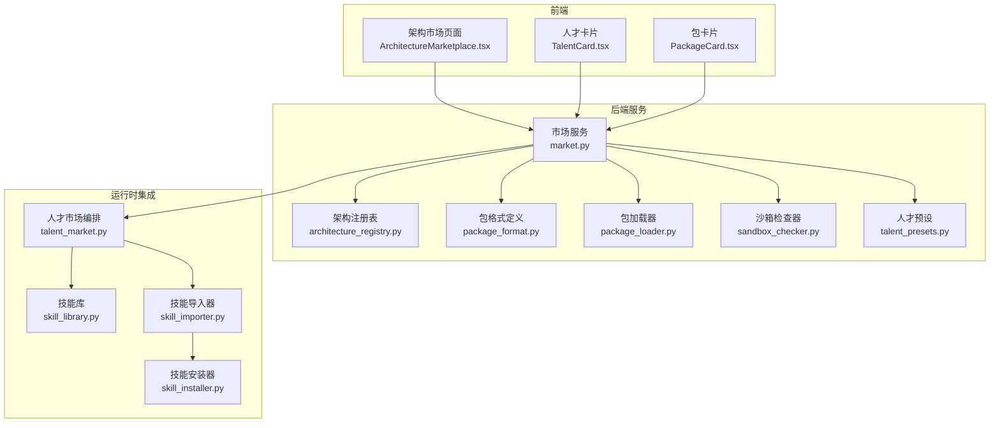

图表来源
- [opc/plugins/office_ui/services/market.py](file://opc/plugins/office_ui/services/market.py)
- [opc/market/architecture_registry.py](file://opc/market/architecture_registry.py)
- [opc/market/package_format.py](file://opc/market/package_format.py)
- [opc/market/package_loader.py](file://opc/market/package_loader.py)
- [opc/market/sandbox_checker.py](file://opc/market/sandbox_checker.py)
- [opc/market/talent_presets.py](file://opc/market/talent_presets.py)
- [opc/layer2_organization/talent_market.py](file://opc/layer2_organization/talent_market.py)
- [opc/layer5_memory/skill_library.py](file://opc/layer5_memory/skill_library.py)
- [opc/layer5_memory/skill_importer.py](file://opc/layer5_memory/skill_importer.py)
- [opc/layer3_agent/skill_installer.py](file://opc/layer3_agent/skill_installer.py)
- [opc/plugins/office_ui/frontend_src/org/ArchitectureMarketplace.tsx](file://opc/plugins/office_ui/frontend_src/org/ArchitectureMarketplace.tsx)
- [opc/plugins/office_ui/frontend_src/org/TalentCard.tsx](file://opc/plugins/office_ui/frontend_src/org/TalentCard.tsx)
- [opc/plugins/office_ui/frontend_src/org/PackageCard.tsx](file://opc/plugins/office_ui/frontend_src/org/PackageCard.tsx)

章节来源
- [opc/plugins/office_ui/services/market.py](file://opc/plugins/office_ui/services/market.py)
- [opc/market/architecture_registry.py](file://opc/market/architecture_registry.py)
- [opc/market/package_format.py](file://opc/market/package_format.py)
- [opc/market/package_loader.py](file://opc/market/package_loader.py)
- [opc/market/sandbox_checker.py](file://opc/market/sandbox_checker.py)
- [opc/market/talent_presets.py](file://opc/market/talent_presets.py)
- [opc/layer2_organization/talent_market.py](file://opc/layer2_organization/talent_market.py)
- [opc/layer5_memory/skill_library.py](file://opc/layer5_memory/skill_library.py)
- [opc/layer5_memory/skill_importer.py](file://opc/layer5_memory/skill_importer.py)
- [opc/layer3_agent/skill_installer.py](file://opc/layer3_agent/skill_installer.py)
- [opc/plugins/office_ui/frontend_src/org/ArchitectureMarketplace.tsx](file://opc/plugins/office_ui/frontend_src/org/ArchitectureMarketplace.tsx)
- [opc/plugins/office_ui/frontend_src/org/TalentCard.tsx](file://opc/plugins/office_ui/frontend_src/org/TalentCard.tsx)
- [opc/plugins/office_ui/frontend_src/org/PackageCard.tsx](file://opc/plugins/office_ui/frontend_src/org/PackageCard.tsx)

## 核心组件
- 架构注册表：集中维护架构实体（如角色、岗位、模板等）的声明、版本与兼容性信息，提供查询、注册、升级与回滚能力
- 包格式与加载器：定义包的目录结构、清单与元数据，负责校验、解析、装载与资源定位
- 沙箱检查器：对包进行静态安全扫描与权限白名单校验，阻止高风险行为进入运行环境
- 人才预设：以声明式配置描述人才画像、技能组合与约束条件，支持内置与自定义
- 技能库与导入器：持久化技能资产，提供导入、导出、索引与检索能力
- 技能安装器：封装安装、更新、卸载的生命周期钩子，协调依赖解析与冲突解决
- 市场服务：对外暴露统一 API，串联上述组件，支撑前端的浏览、搜索、安装、更新、卸载等操作

章节来源
- [opc/market/architecture_registry.py](file://opc/market/architecture_registry.py)
- [opc/market/package_format.py](file://opc/market/package_format.py)
- [opc/market/package_loader.py](file://opc/market/package_loader.py)
- [opc/market/sandbox_checker.py](file://opc/market/sandbox_checker.py)
- [opc/market/talent_presets.py](file://opc/market/talent_presets.py)
- [opc/layer5_memory/skill_library.py](file://opc/layer5_memory/skill_library.py)
- [opc/layer5_memory/skill_importer.py](file://opc/layer5_memory/skill_importer.py)
- [opc/layer3_agent/skill_installer.py](file://opc/layer3_agent/skill_installer.py)
- [opc/plugins/office_ui/services/market.py](file://opc/plugins/office_ui/services/market.py)

## 架构总览
下图展示了从前端交互到后端处理再到运行时集成的完整链路，包括安装、更新、卸载的关键步骤与安全校验点。

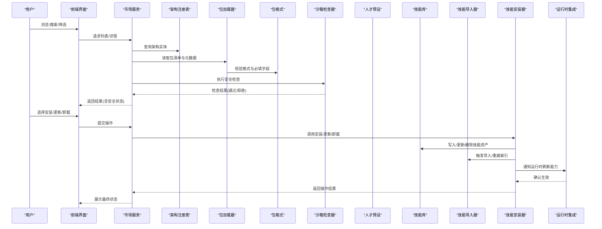

图表来源
- [opc/plugins/office_ui/services/market.py](file://opc/plugins/office_ui/services/market.py)
- [opc/market/architecture_registry.py](file://opc/market/architecture_registry.py)
- [opc/market/package_loader.py](file://opc/market/package_loader.py)
- [opc/market/package_format.py](file://opc/market/package_format.py)
- [opc/market/sandbox_checker.py](file://opc/market/sandbox_checker.py)
- [opc/market/talent_presets.py](file://opc/market/talent_presets.py)
- [opc/layer5_memory/skill_library.py](file://opc/layer5_memory/skill_library.py)
- [opc/layer5_memory/skill_importer.py](file://opc/layer5_memory/skill_importer.py)
- [opc/layer3_agent/skill_installer.py](file://opc/layer3_agent/skill_installer.py)
- [opc/layer2_organization/talent_market.py](file://opc/layer2_organization/talent_market.py)

## 详细组件分析

### 架构注册表与版本管理
职责
- 维护架构实体的唯一标识、版本、兼容范围与变更日志
- 提供按名称、标签、版本的查询接口
- 支持增量升级与回滚策略，保证运行时一致性

关键流程
- 注册：校验版本合法性与向后兼容性，记录变更摘要
- 查询：支持多条件过滤（名称、标签、版本区间）
- 升级：计算最小变更集，应用迁移脚本或配置补丁
- 回滚：基于快照恢复至指定版本

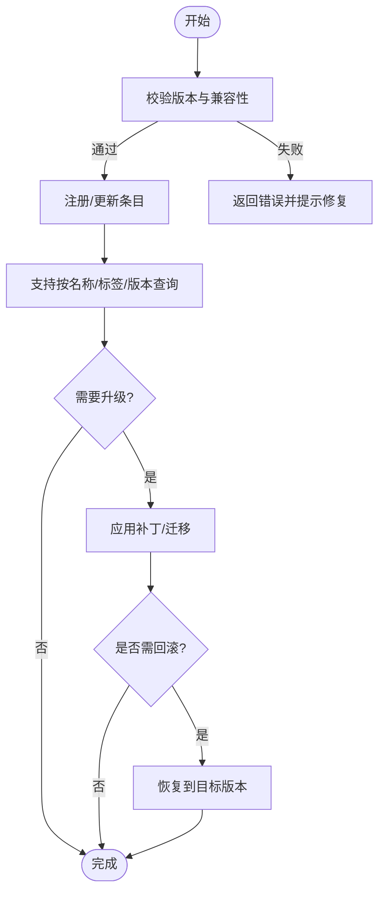

图表来源
- [opc/market/architecture_registry.py](file://opc/market/architecture_registry.py)

章节来源
- [opc/market/architecture_registry.py](file://opc/market/architecture_registry.py)

### 包格式规范与元数据定义
包结构要点
- 根清单：包含包名、版本、作者、许可证、描述、图标、入口点、依赖声明、能力标签等
- 资源目录：存放脚本、配置文件、模板、静态资源等
- 元数据校验：必填字段、类型约束、枚举值、依赖版本范围

加载流程
- 解析清单与目录树
- 校验必填字段与类型
- 构建资源映射与入口点
- 输出标准化包描述对象供上层消费

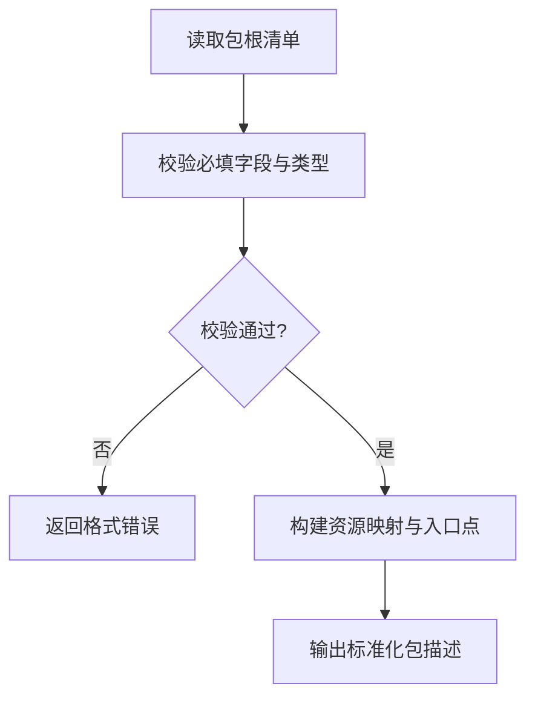

图表来源
- [opc/market/package_format.py](file://opc/market/package_format.py)
- [opc/market/package_loader.py](file://opc/market/package_loader.py)

章节来源
- [opc/market/package_format.py](file://opc/market/package_format.py)
- [opc/market/package_loader.py](file://opc/market/package_loader.py)

### 安全与沙箱检查
检查维度
- 静态扫描：检测危险函数调用、外部网络访问、文件系统越权等
- 权限白名单：限制可访问的资源域与系统调用
- 风险评分：根据规则命中情况给出风险等级与建议

处理策略
- 低风险：允许安装并标注建议
- 中风险：要求人工审批或附加约束
- 高风险：直接拒绝并提示修复方案

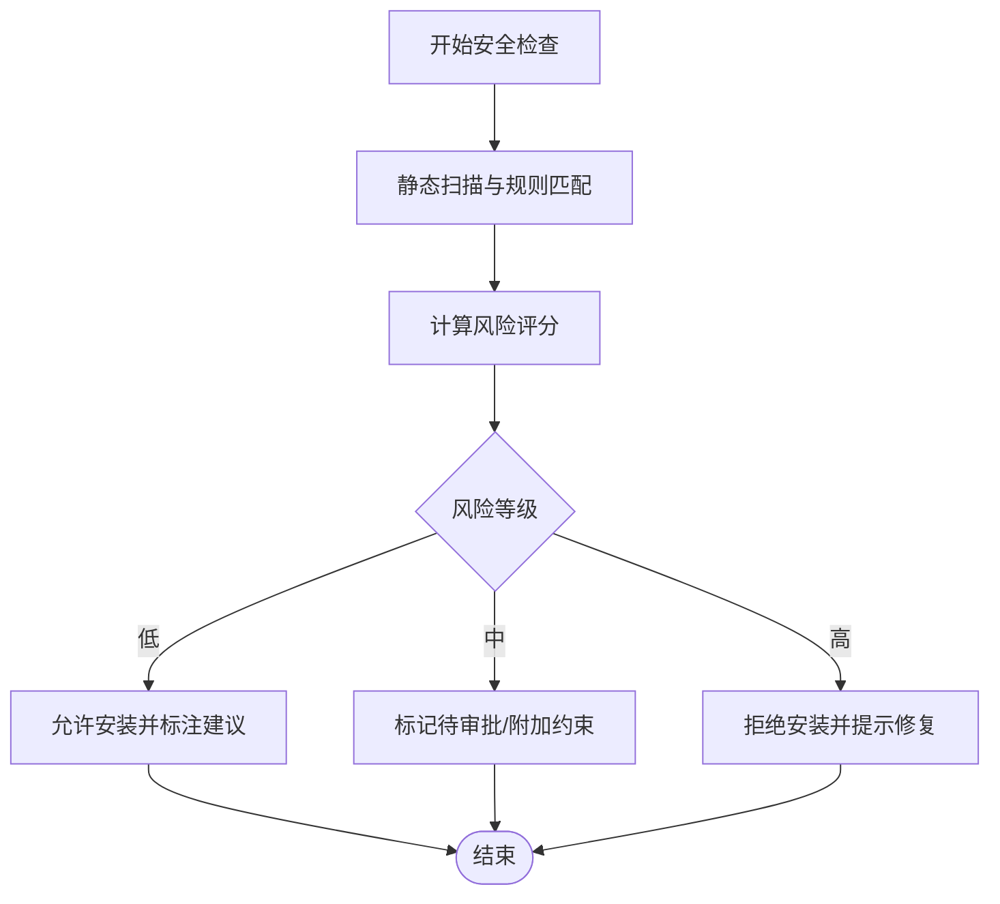

图表来源
- [opc/market/sandbox_checker.py](file://opc/market/sandbox_checker.py)

章节来源
- [opc/market/sandbox_checker.py](file://opc/market/sandbox_checker.py)

### 人才预设的创建与使用
概念
- 人才预设为结构化配置，描述角色的技能组合、经验门槛、协作偏好与约束条件
- 支持内置预设与自定义预设，便于快速装配团队

创建步骤
- 选择基础模板或从零编写
- 填写技能清单、版本范围、协作策略
- 保存为 YAML 清单并纳入预设仓库

使用方法
- 在招聘/组建团队时选择预设
- 系统自动匹配可用人才并生成建议
- 支持一键替换或微调

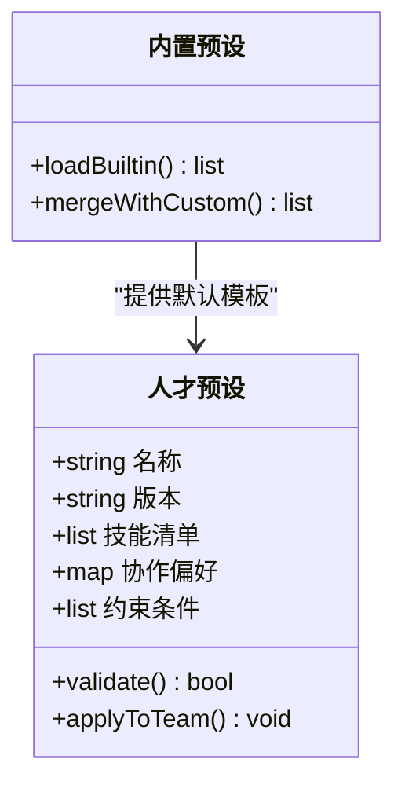

图表来源
- [opc/market/talent_presets.py](file://opc/market/talent_presets.py)
- [opc/market/builtin_presets/vc_investment_firm.yaml](file://opc/market/builtin_presets/vc_investment_firm.yaml)

章节来源
- [opc/market/talent_presets.py](file://opc/market/talent_presets.py)
- [opc/market/builtin_presets/vc_investment_firm.yaml](file://opc/market/builtin_presets/vc_investment_firm.yaml)

### 技能库与导入器
职责
- 技能库：持久化存储技能资产，维护索引与元数据
- 导入器：将新技能导入库，重建索引，触发依赖刷新

典型流程
- 接收导入请求（本地包或远程源）
- 解析清单与资源
- 写入库并建立反向索引
- 通知相关模块刷新缓存

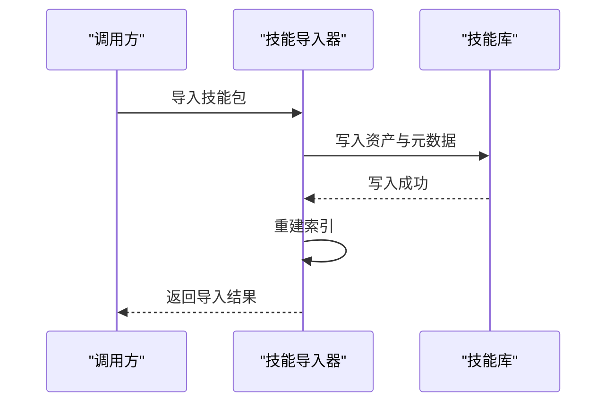

图表来源
- [opc/layer5_memory/skill_library.py](file://opc/layer5_memory/skill_library.py)
- [opc/layer5_memory/skill_importer.py](file://opc/layer5_memory/skill_importer.py)

章节来源
- [opc/layer5_memory/skill_library.py](file://opc/layer5_memory/skill_library.py)
- [opc/layer5_memory/skill_importer.py](file://opc/layer5_memory/skill_importer.py)

### 技能安装器与生命周期
生命周期
- 安装：校验依赖、执行安全检查、写入库、初始化运行时能力
- 更新：计算差异、应用补丁、重启必要组件
- 卸载：清理资源、移除索引、释放运行时绑定

依赖解析与冲突解决
- 解析依赖图，识别环与缺失
- 采用版本范围与优先级策略解决冲突
- 提供回退与补偿操作

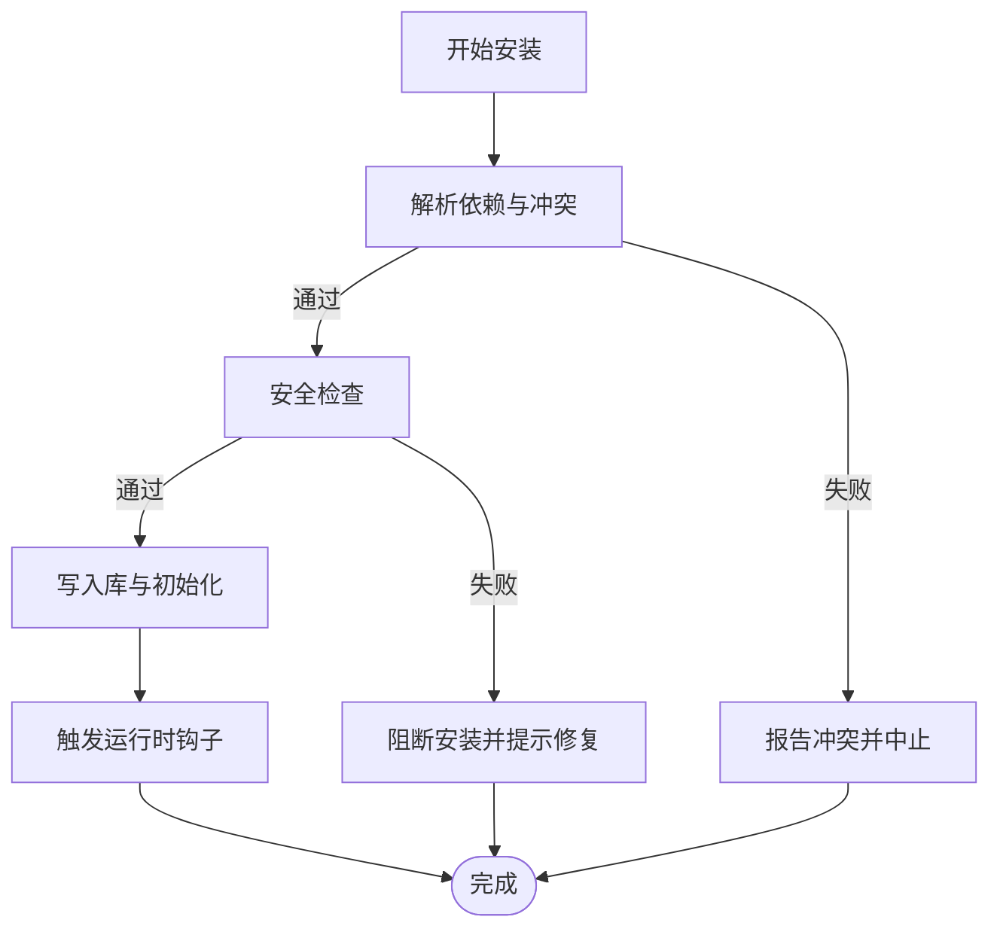

图表来源
- [opc/layer3_agent/skill_installer.py](file://opc/layer3_agent/skill_installer.py)

章节来源
- [opc/layer3_agent/skill_installer.py](file://opc/layer3_agent/skill_installer.py)

### 市场服务与前端集成
市场服务
- 聚合查询：结合注册表、包加载器与索引，提供统一的列表与详情接口
- 操作编排：封装安装、更新、卸载流程，协调各子系统
- 安全网关：在操作前强制安全检查，拦截不合规包

前端界面
- 架构市场页面：展示架构实体、版本信息与安装状态
- 人才卡片：展示人才预设详情与一键装配
- 包卡片：展示包元数据、安全评分与操作按钮

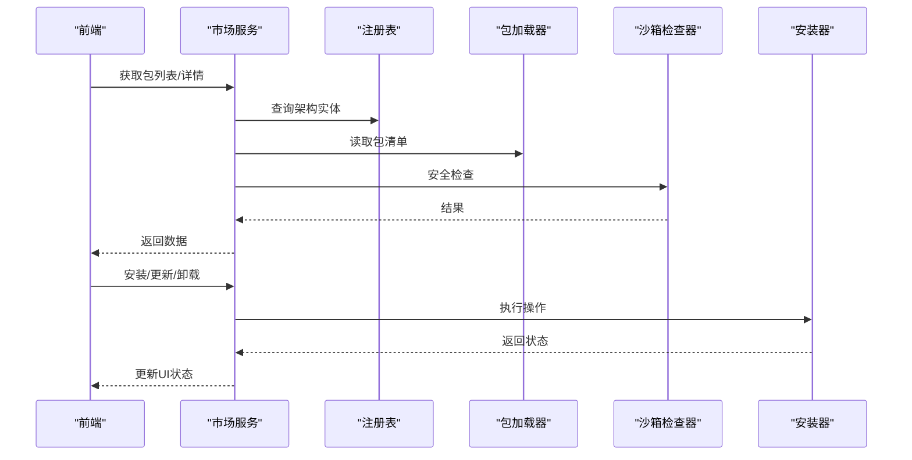

图表来源
- [opc/plugins/office_ui/services/market.py](file://opc/plugins/office_ui/services/market.py)
- [opc/plugins/office_ui/frontend_src/org/ArchitectureMarketplace.tsx](file://opc/plugins/office_ui/frontend_src/org/ArchitectureMarketplace.tsx)
- [opc/plugins/office_ui/frontend_src/org/TalentCard.tsx](file://opc/plugins/office_ui/frontend_src/org/TalentCard.tsx)
- [opc/plugins/office_ui/frontend_src/org/PackageCard.tsx](file://opc/plugins/office_ui/frontend_src/org/PackageCard.tsx)

章节来源
- [opc/plugins/office_ui/services/market.py](file://opc/plugins/office_ui/services/market.py)
- [opc/plugins/office_ui/frontend_src/org/ArchitectureMarketplace.tsx](file://opc/plugins/office_ui/frontend_src/org/ArchitectureMarketplace.tsx)
- [opc/plugins/office_ui/frontend_src/org/TalentCard.tsx](file://opc/plugins/office_ui/frontend_src/org/TalentCard.tsx)
- [opc/plugins/office_ui/frontend_src/org/PackageCard.tsx](file://opc/plugins/office_ui/frontend_src/org/PackageCard.tsx)

### 运行时集成与能力注入
- 人才市场编排：根据预设与需求，动态装配角色与工作项
- 运行时刷新：在安装完成后，通知运行期重新加载能力与上下文

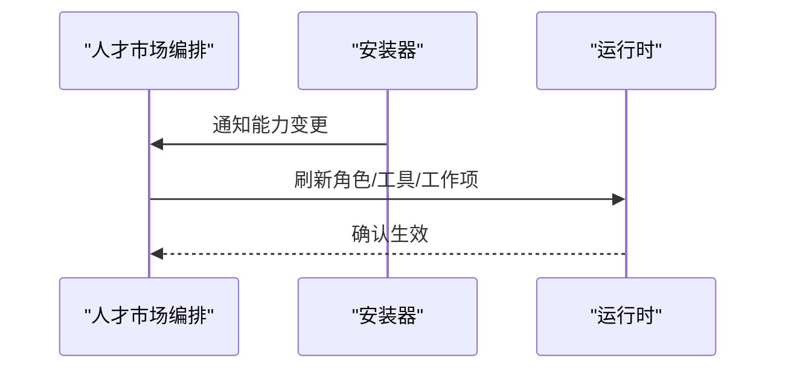

图表来源
- [opc/layer2_organization/talent_market.py](file://opc/layer2_organization/talent_market.py)
- [opc/layer3_agent/skill_installer.py](file://opc/layer3_agent/skill_installer.py)

章节来源
- [opc/layer2_organization/talent_market.py](file://opc/layer2_organization/talent_market.py)
- [opc/layer3_agent/skill_installer.py](file://opc/layer3_agent/skill_installer.py)

## 依赖分析
- 组件耦合
  - 市场服务强依赖注册表、包加载器、沙箱检查器与安装器
  - 安装器依赖技能库与导入器，间接影响运行时
- 外部依赖
  - 前端通过市场服务与后端交互
  - 运行时通过编排器感知能力变化

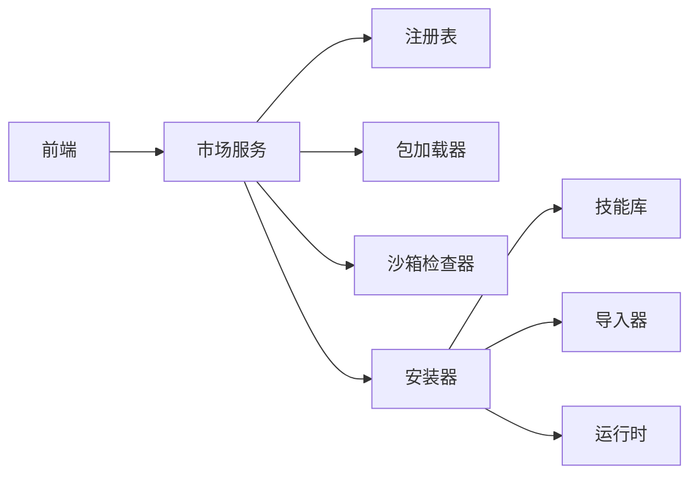

图表来源
- [opc/plugins/office_ui/services/market.py](file://opc/plugins/office_ui/services/market.py)
- [opc/market/architecture_registry.py](file://opc/market/architecture_registry.py)
- [opc/market/package_loader.py](file://opc/market/package_loader.py)
- [opc/market/sandbox_checker.py](file://opc/market/sandbox_checker.py)
- [opc/layer3_agent/skill_installer.py](file://opc/layer3_agent/skill_installer.py)
- [opc/layer5_memory/skill_library.py](file://opc/layer5_memory/skill_library.py)
- [opc/layer5_memory/skill_importer.py](file://opc/layer5_memory/skill_importer.py)
- [opc/layer2_organization/talent_market.py](file://opc/layer2_organization/talent_market.py)

章节来源
- [opc/plugins/office_ui/services/market.py](file://opc/plugins/office_ui/services/market.py)
- [opc/market/architecture_registry.py](file://opc/market/architecture_registry.py)
- [opc/market/package_loader.py](file://opc/market/package_loader.py)
- [opc/market/sandbox_checker.py](file://opc/market/sandbox_checker.py)
- [opc/layer3_agent/skill_installer.py](file://opc/layer3_agent/skill_installer.py)
- [opc/layer5_memory/skill_library.py](file://opc/layer5_memory/skill_library.py)
- [opc/layer5_memory/skill_importer.py](file://opc/layer5_memory/skill_importer.py)
- [opc/layer2_organization/talent_market.py](file://opc/layer2_organization/talent_market.py)

## 性能考虑
- 索引优化：对技能库建立多维索引（名称、标签、版本），提升搜索效率
- 懒加载：按需加载包资源，避免一次性载入全部资产
- 缓存策略：缓存常用查询结果与安全检查结果，减少重复计算
- 并发控制：对安装/更新/卸载操作加锁，避免并发写冲突
- 增量更新：仅应用差异部分，降低磁盘与内存占用

[本节为通用指导，无需具体文件引用]

## 故障排查指南
常见问题与定位方法
- 包格式错误：检查清单必填字段与类型；参考包格式定义
- 安全检查失败：查看风险评分与命中规则，按提示修复
- 依赖冲突：列出冲突依赖与版本范围，调整依赖声明或选择兼容版本
- 安装中断：检查日志与事务回滚状态，必要时手动清理残留资产
- 运行时未刷新：确认安装器是否正确触发运行时钩子

章节来源
- [tests/test_market.py](file://tests/test_market.py)
- [opc/market/package_format.py](file://opc/market/package_format.py)
- [opc/market/sandbox_checker.py](file://opc/market/sandbox_checker.py)
- [opc/layer3_agent/skill_installer.py](file://opc/layer3_agent/skill_installer.py)

## 结论
OpenOPC 市场系统通过清晰的包格式、严格的沙箱检查、完善的依赖解析与安全的生命周期管理，为技能与架构资产的流通提供了可靠基础设施。配合直观的前端界面与运行时集成，用户能够便捷地发现、评估、安装与管理第三方扩展，持续提升组织能力与交付效率。

[本节为总结性内容，无需具体文件引用]

## 附录
- 包清单关键字段建议
  - 名称、版本、作者、许可证、描述、图标、入口点
  - 依赖声明（名称、版本范围）、能力标签、平台约束
  - 安全声明（权限白名单、资源访问范围）
- 最佳实践
  - 遵循语义化版本，明确兼容范围
  - 最小权限原则，避免不必要的系统调用
  - 提供详尽的 README 与示例，降低集成成本
  - 持续回归测试，覆盖边界与异常场景

[本节为补充说明，无需具体文件引用]