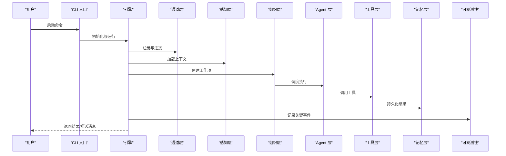
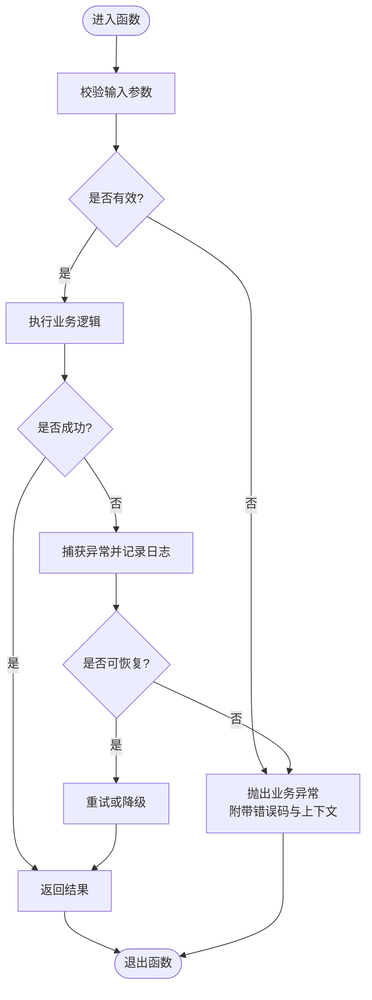
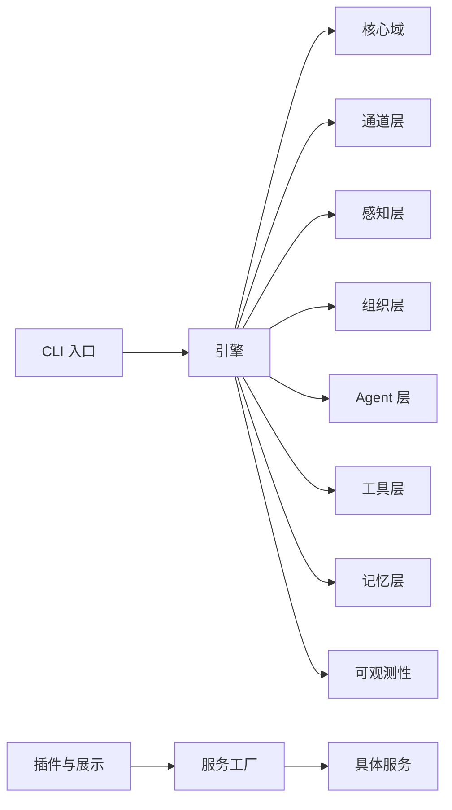

# 代码规范

<cite>
**本文引用的文件**   
- [pyproject.toml](file://pyproject.toml)
- [opc/__init__.py](file://opc/__init__.py)
- [opc/engine.py](file://opc/engine.py)
- [opc/cli/app.py](file://opc/cli/app.py)
- [opc/core/models.py](file://opc/core/models.py)
- [opc/core/config.py](file://opc/core/config.py)
- [opc/channels/base.py](file://opc/channels/base.py)
- [opc/channels/manager.py](file://opc/channels/manager.py)
- [opc/channels/provider_registry.py](file://opc/channels/provider_registry.py)
- [opc/channels/dingtalk.py](file://opc/channels/dingtalk.py)
- [opc/channels/discord.py](file://opc/channels/discord.py)
- [opc/channels/email.py](file://opc/channels/email.py)
- [opc/channels/feishu.py](file://opc/channels/feishu.py)
- [opc/channels/matrix.py](file://opc/channels/matrix.py)
- [opc/channels/mochat.py](file://opc/channels/mochat.py)
- [opc/channels/qq.py](file://opc/channels/qq.py)
- [opc/channels/slack.py](file://opc/channels/slack.py)
- [opc/channels/telegram.py](file://opc/channels/telegram.py)
- [opc/channels/whatsapp.py](file://opc/channels/whatsapp.py)
- [opc/channels/session.py](file://opc/channels/session.py)
- [opc/channels/provider_base.py](file://opc/channels/provider_base.py)
- [opc/core/events.py](file://opc/core/events.py)
- [opc/core/attachment_store.py](file://opc/core/attachment_store.py)
- [opc/core/windows_ssl.py](file://opc/core/windows_ssl.py)
- [opc/database/store.py](file://opc/database/store.py)
- [opc/layer0_interaction/message_bus.py](file://opc/layer0_interaction/message_bus.py)
- [opc/layer1_perception/context_assembler.py](file://opc/layer1_perception/context_assembler.py)
- [opc/layer1_perception/context_loader.py](file://opc/layer1_perception/context_loader.py)
- [opc/layer1_perception/task_router.py](file://opc/layer1_perception/task_router.py)
- [opc/layer2_organization/org_engine.py](file://opc/layer2_organization/org_engine.py)
- [opc/layer2_organization/work_item_runtime.py](file://opc/layer2_organization/work_item_runtime.py)
- [opc/layer3_agent/native_agent.py](file://opc/layer3_agent/native_agent.py)
- [opc/layer3_agent/runtime_v2/runtime.py](file://opc/layer3_agent/runtime_v2/runtime.py)
- [opc/layer4_tools/agent_runtime.py](file://opc/layer4_tools/agent_runtime.py)
- [opc/layer4_tools/file_ops.py](file://opc/layer4_tools/file_ops.py)
- [opc/layer4_tools/git_ops.py](file://opc/layer4_tools/git_ops.py)
- [opc/layer4_tools/python_exec.py](file://opc/layer4_tools/python_exec.py)
- [opc/layer4_tools/shell.py](file://opc/layer4_tools/shell.py)
- [opc/layer5_memory/markdown_memory.py](file://opc/layer5_memory/markdown_memory.py)
- [opc/layer6_observability/opc_logger.py](file://opc/layer6_observability/opc_logger.py)
- [opc/presentation/kanban.py](file://opc/presentation/kanban.py)
- [opc/plugins/office_ui/server.py](file://opc/plugins/office_ui/server.py)
- [opc/plugins/office_ui/ws_handler.py](file://opc/plugins/office_ui/ws_handler.py)
- [opc/plugins/office_ui/services/factory.py](file://opc/plugins/office_ui/services/factory.py)
- [opc/plugins/office_ui/services/models.py](file://opc/plugins/office_ui/services/models.py)
- [opc/plugins/office_ui/snapshot_builder.py](file://opc/plugins/office_ui/snapshot_builder.py)
- [opc/plugins/office_ui/event_adapter.py](file://opc/plugins/office_ui/event_adapter.py)
- [opc/plugins/office_ui/execution_identity.py](file://opc/plugins/office_ui/execution_identity.py)
- [opc/plugins/office_ui/chat_store.py](file://opc/plugins/office_ui/chat_store.py)
- [opc/plugins/office_ui/agent_store.py](file://opc/plugins/office_ui/agent_store.py)
- [opc/plugins/office_ui/dispatcher.py](file://opc/plugins/office_ui/dispatcher.py)
- [opc/plugins/office_ui/terminal.py](file://opc/plugins/office_ui/terminal.py)
- [opc/plugins/office_ui/org_architecture_snapshot.py](file://opc/plugins/office_ui/org_architecture_snapshot.py)
- [opc/plugins/office_ui/services/comms.py](file://opc/plugins/office_ui/services/comms.py)
- [opc/plugins/office_ui/services/context.py](file://opc/plugins/office_ui/services/context.py)
- [opc/plugins/office_ui/services/kanban.py](file://opc/plugins/office_ui/services/kanban.py)
- [opc/plugins/office_ui/services/market.py](file://opc/plugins/office_ui/services/market.py)
- [opc/plugins/office_ui/services/org.py](file://opc/plugins/office_ui/services/org.py)
- [opc/plugins/office_ui/services/project.py](file://opc/plugins/office_ui/services/project.py)
- [opc/plugins/office_ui/services/runtime.py](file://opc/plugins/office_ui/services/runtime.py)
- [opc/plugins/office_ui/services/session.py](file://opc/plugins/office_ui/services/session.py)
- [opc/plugins/office_ui/services/talent.py](file://opc/plugins/office_ui/services/talent.py)
- [opc/plugins/office_ui/services/work_item.py](file://opc/plugins/office_ui/services/work_item.py)
</cite>

## 目录
1. [简介](#简介)
2. [项目结构](#项目结构)
3. [核心组件](#核心组件)
4. [架构总览](#架构总览)
5. [详细组件分析](#详细组件分析)
6. [依赖分析](#依赖分析)
7. [性能考虑](#性能考虑)
8. [故障排查指南](#故障排查指南)
9. [结论](#结论)
10. [附录](#附录)

## 简介
本规范面向 OpenOPC 的 Python 代码，目标是统一命名、注释、文件组织、类型注解、错误处理与日志记录等实践，并给出工具链配置建议与示例路径，帮助团队在大型多模块工程中保持一致性与可维护性。

## 项目结构
OpenOPC 采用分层与领域混合的组织方式：
- opc: 主包，按“层”划分（layer0~layer6），同时包含 channels、core、database、plugins、presentation 等横向能力
- config: 运行时配置（YAML）
- tests: 测试用例
- scripts: 运维脚本
- docs: 文档

```mermaid
graph TB
subgraph "应用入口"
CLI["CLI 入口<br/>opc/cli/app.py"]
Engine["引擎初始化<br/>opc/engine.py"]
end
subgraph "核心域"
CoreModels["核心模型<br/>opc/core/models.py"]
CoreConfig["配置加载<br/>opc/core/config.py"]
Events["事件总线<br/>opc/core/events.py"]
Attachments["附件存储<br/>opc/core/attachment_store.py"]
WinSSL["Windows SSL 适配<br/>opc/core/windows_ssl.py"]
end
subgraph "通道层"
ChannelsBase["通道基类<br/>opc/channels/base.py"]
ChannelMgr["通道管理器<br/>opc/channels/manager.py"]
ProviderReg["提供者注册表<br/>opc/channels/provider_registry.py"]
DingTalk["钉钉通道<br/>opc/channels/dingtalk.py"]
Discord["Discord 通道<br/>opc/channels/discord.py"]
Email["邮件通道<br/>opc/channels/email.py"]
Feishu["飞书通道<br/>opc/channels/feishu.py"]
Matrix["Matrix 通道<br/>opc/channels/matrix.py"]
Mochat["Mochat 通道<br/>opc/channels/mochat.py"]
QQ["QQ 通道<br/>opc/channels/qq.py"]
Slack["Slack 通道<br/>opc/channels/slack.py"]
Telegram["Telegram 通道<br/>opc/channels/telegram.py"]
WhatsApp["WhatsApp 通道<br/>opc/channels/whatsapp.py"]
Session["会话抽象<br/>opc/channels/session.py"]
ProvBase["提供者基类<br/>opc/channels/provider_base.py"]
end
subgraph "感知层"
CtxAsm["上下文组装器<br/>opc/layer1_perception/context_assembler.py"]
CtxLoad["上下文加载器<br/>opc/layer1_perception/context_loader.py"]
TaskRouter["任务路由<br/>opc/layer1_perception/task_router.py"]
end
subgraph "组织层"
OrgEngine["组织引擎<br/>opc/layer2_organization/org_engine.py"]
WorkItemRT["工作项运行时<br/>opc/layer2_organization/work_item_runtime.py"]
end
subgraph "Agent 层"
NativeAgent["原生 Agent<br/>opc/layer3_agent/native_agent.py"]
RTv2["运行时 v2<br/>opc/layer3_agent/runtime_v2/runtime.py"]
end
subgraph "工具层"
AgentRT["Agent 运行时工具<br/>opc/layer4_tools/agent_runtime.py"]
FileOps["文件操作<br/>opc/layer4_tools/file_ops.py"]
GitOps["Git 操作<br/>opc/layer4_tools/git_ops.py"]
PyExec["Python 执行<br/>opc/layer4_tools/python_exec.py"]
Shell["Shell 执行<br/>opc/layer4_tools/shell.py"]
end
subgraph "记忆层"
MarkdownMem["Markdown 记忆<br/>opc/layer5_memory/markdown_memory.py"]
end
subgraph "可观测性"
Logger["日志适配器<br/>opc/layer6_observability/opc_logger.py"]
end
subgraph "插件与展示"
OfficeUI["Office UI 服务<br/>opc/plugins/office_ui/server.py"]
WSHandler["WS 处理器<br/>opc/plugins/office_ui/ws_handler.py"]
ServicesFactory["服务工厂<br/>opc/plugins/office_ui/services/factory.py"]
SnapshotBuilder["快照构建器<br/>opc/plugins/office_ui/snapshot_builder.py"]
EventAdapter["事件适配器<br/>opc/plugins/office_ui/event_adapter.py"]
ExecIdentity["执行身份<br/>opc/plugins/office_ui/execution_identity.py"]
ChatStore["聊天存储<br/>opc/plugins/office_ui/chat_store.py"]
AgentStore["Agent 存储<br/>opc/plugins/office_ui/agent_store.py"]
Dispatcher["分发器<br/>opc/plugins/office_ui/dispatcher.py"]
Terminal["终端输出<br/>opc/plugins/office_ui/terminal.py"]
OrgArchSnap["组织架构快照<br/>opc/plugins/office_ui/org_architecture_snapshot.py"]
CommsSvc["通信服务<br/>opc/plugins/office_ui/services/comms.py"]
ContextSvc["上下文服务<br/>opc/plugins/office_ui/services/context.py"]
KanbanSvc["看板服务<br/>opc/plugins/office_ui/services/kanban.py"]
MarketSvc["市场服务<br/>opc/plugins/office_ui/services/market.py"]
OrgSvc["组织服务<br/>opc/plugins/office_ui/services/org.py"]
ProjectSvc["项目服务<br/>opc/plugins/office_ui/services/project.py"]
RuntimeSvc["运行时服务<br/>opc/plugins/office_ui/services/runtime.py"]
SessionSvc["会话服务<br/>opc/plugins/office_ui/services/session.py"]
TalentSvc["人才服务<br/>opc/plugins/office_ui/services/talent.py"]
WorkItemSvc["工作项服务<br/>opc/plugins/office_ui/services/work_item.py"]
end
CLI --> Engine
Engine --> CoreModels
Engine --> CoreConfig
Engine --> Events
Engine --> Attachments
Engine --> WinSSL
Engine --> ChannelsBase
Engine --> ChannelMgr
Engine --> ProviderReg
Engine --> CtxAsm
Engine --> CtxLoad
Engine --> TaskRouter
Engine --> OrgEngine
Engine --> WorkItemRT
Engine --> NativeAgent
Engine --> RTv2
Engine --> AgentRT
Engine --> FileOps
Engine --> GitOps
Engine --> PyExec
Engine --> Shell
Engine --> MarkdownMem
Engine --> Logger
Engine --> OfficeUI
OfficeUI --> WSHandler
OfficeUI --> ServicesFactory
OfficeUI --> SnapshotBuilder
OfficeUI --> EventAdapter
OfficeUI --> ExecIdentity
OfficeUI --> ChatStore
OfficeUI --> AgentStore
OfficeUI --> Dispatcher
OfficeUI --> Terminal
OfficeUI --> OrgArchSnap
ServicesFactory --> CommsSvc
ServicesFactory --> ContextSvc
ServicesFactory --> KanbanSvc
ServicesFactory --> MarketSvc
ServicesFactory --> OrgSvc
ServicesFactory --> ProjectSvc
ServicesFactory --> RuntimeSvc
ServicesFactory --> SessionSvc
ServicesFactory --> TalentSvc
ServicesFactory --> WorkItemSvc
```

图表来源
- [opc/engine.py](file://opc/engine.py)
- [opc/cli/app.py](file://opc/cli/app.py)
- [opc/core/models.py](file://opc/core/models.py)
- [opc/core/config.py](file://opc/core/config.py)
- [opc/core/events.py](file://opc/core/events.py)
- [opc/core/attachment_store.py](file://opc/core/attachment_store.py)
- [opc/core/windows_ssl.py](file://opc/core/windows_ssl.py)
- [opc/channels/base.py](file://opc/channels/base.py)
- [opc/channels/manager.py](file://opc/channels/manager.py)
- [opc/channels/provider_registry.py](file://opc/channels/provider_registry.py)
- [opc/channels/dingtalk.py](file://opc/channels/dingtalk.py)
- [opc/channels/discord.py](file://opc/channels/discord.py)
- [opc/channels/email.py](file://opc/channels/email.py)
- [opc/channels/feishu.py](file://opc/channels/feishu.py)
- [opc/channels/matrix.py](file://opc/channels/matrix.py)
- [opc/channels/mochat.py](file://opc/channels/mochat.py)
- [opc/channels/qq.py](file://opc/channels/qq.py)
- [opc/channels/slack.py](file://opc/channels/slack.py)
- [opc/channels/telegram.py](file://opc/channels/telegram.py)
- [opc/channels/whatsapp.py](file://opc/channels/whatsapp.py)
- [opc/channels/session.py](file://opc/channels/session.py)
- [opc/channels/provider_base.py](file://opc/channels/provider_base.py)
- [opc/layer1_perception/context_assembler.py](file://opc/layer1_perception/context_assembler.py)
- [opc/layer1_perception/context_loader.py](file://opc/layer1_perception/context_loader.py)
- [opc/layer1_perception/task_router.py](file://opc/layer1_perception/task_router.py)
- [opc/layer2_organization/org_engine.py](file://opc/layer2_organization/org_engine.py)
- [opc/layer2_organization/work_item_runtime.py](file://opc/layer2_organization/work_item_runtime.py)
- [opc/layer3_agent/native_agent.py](file://opc/layer3_agent/native_agent.py)
- [opc/layer3_agent/runtime_v2/runtime.py](file://opc/layer3_agent/runtime_v2/runtime.py)
- [opc/layer4_tools/agent_runtime.py](file://opc/layer4_tools/agent_runtime.py)
- [opc/layer4_tools/file_ops.py](file://opc/layer4_tools/file_ops.py)
- [opc/layer4_tools/git_ops.py](file://opc/layer4_tools/git_ops.py)
- [opc/layer4_tools/python_exec.py](file://opc/layer4_tools/python_exec.py)
- [opc/layer4_tools/shell.py](file://opc/layer4_tools/shell.py)
- [opc/layer5_memory/markdown_memory.py](file://opc/layer5_memory/markdown_memory.py)
- [opc/layer6_observability/opc_logger.py](file://opc/layer6_observability/opc_logger.py)
- [opc/plugins/office_ui/server.py](file://opc/plugins/office_ui/server.py)
- [opc/plugins/office_ui/ws_handler.py](file://opc/plugins/office_ui/ws_handler.py)
- [opc/plugins/office_ui/services/factory.py](file://opc/plugins/office_ui/services/factory.py)
- [opc/plugins/office_ui/snapshot_builder.py](file://opc/plugins/office_ui/snapshot_builder.py)
- [opc/plugins/office_ui/event_adapter.py](file://opc/plugins/office_ui/event_adapter.py)
- [opc/plugins/office_ui/execution_identity.py](file://opc/plugins/office_ui/execution_identity.py)
- [opc/plugins/office_ui/chat_store.py](file://opc/plugins/office_ui/chat_store.py)
- [opc/plugins/office_ui/agent_store.py](file://opc/plugins/office_ui/agent_store.py)
- [opc/plugins/office_ui/dispatcher.py](file://opc/plugins/office_ui/dispatcher.py)
- [opc/plugins/office_ui/terminal.py](file://opc/plugins/office_ui/terminal.py)
- [opc/plugins/office_ui/org_architecture_snapshot.py](file://opc/plugins/office_ui/org_architecture_snapshot.py)
- [opc/plugins/office_ui/services/comms.py](file://opc/plugins/office_ui/services/comms.py)
- [opc/plugins/office_ui/services/context.py](file://opc/plugins/office_ui/services/context.py)
- [opc/plugins/office_ui/services/kanban.py](file://opc/plugins/office_ui/services/kanban.py)
- [opc/plugins/office_ui/services/market.py](file://opc/plugins/office_ui/services/market.py)
- [opc/plugins/office_ui/services/org.py](file://opc/plugins/office_ui/services/org.py)
- [opc/plugins/office_ui/services/project.py](file://opc/plugins/office_ui/services/project.py)
- [opc/plugins/office_ui/services/runtime.py](file://opc/plugins/office_ui/services/runtime.py)
- [opc/plugins/office_ui/services/session.py](file://opc/plugins/office_ui/services/session.py)
- [opc/plugins/office_ui/services/talent.py](file://opc/plugins/office_ui/services/talent.py)
- [opc/plugins/office_ui/services/work_item.py](file://opc/plugins/office_ui/services/work_item.py)

章节来源
- [opc/engine.py](file://opc/engine.py)
- [opc/cli/app.py](file://opc/cli/app.py)
- [opc/core/models.py](file://opc/core/models.py)
- [opc/core/config.py](file://opc/core/config.py)
- [opc/channels/base.py](file://opc/channels/base.py)
- [opc/channels/manager.py](file://opc/channels/manager.py)
- [opc/channels/provider_registry.py](file://opc/channels/provider_registry.py)
- [opc/layer1_perception/context_assembler.py](file://opc/layer1_perception/context_assembler.py)
- [opc/layer2_organization/org_engine.py](file://opc/layer2_organization/org_engine.py)
- [opc/layer3_agent/native_agent.py](file://opc/layer3_agent/native_agent.py)
- [opc/layer3_agent/runtime_v2/runtime.py](file://opc/layer3_agent/runtime_v2/runtime.py)
- [opc/layer4_tools/agent_runtime.py](file://opc/layer4_tools/agent_runtime.py)
- [opc/layer5_memory/markdown_memory.py](file://opc/layer5_memory/markdown_memory.py)
- [opc/layer6_observability/opc_logger.py](file://opc/layer6_observability/opc_logger.py)
- [opc/plugins/office_ui/server.py](file://opc/plugins/office_ui/server.py)

## 核心组件
本节聚焦工程内关键模块的职责边界与交互点，为后续规范落地提供上下文。

- 入口与引擎
  - CLI 入口负责解析参数与启动流程编排
  - 引擎负责初始化核心子系统、通道、感知、组织、Agent、工具、记忆与可观测性

- 核心域
  - 模型定义集中管理数据结构与校验契约
  - 配置加载负责读取 YAML 并转换为结构化对象
  - 事件系统用于跨层解耦通信
  - 附件存储提供统一的持久化接口
  - Windows SSL 适配解决平台差异

- 通道层
  - 基于提供者模式实现多 IM 渠道接入
  - 通过注册表动态发现与实例化具体通道
  - 会话抽象屏蔽不同渠道的会话语义差异

- 感知层
  - 上下文组装器聚合多源上下文
  - 上下文加载器负责外部数据载入
  - 任务路由器根据意图进行分发

- 组织层
  - 组织引擎协调角色、阶段与工作项生命周期
  - 工作项运行时承载状态机与转换钩子

- Agent 层
  - 原生 Agent 封装外部智能体调用
  - 运行时 v2 提供流式工具执行、权限控制与沙箱隔离

- 工具层
  - 文件、Git、Python 执行、Shell 等通用能力
  - Agent 运行时工具提供安全执行环境

- 记忆层
  - Markdown 记忆以文本形式持久化对话与上下文

- 可观测性
  - 日志适配器统一输出格式与级别

- 插件与展示
  - Office UI 提供 Web 界面与服务端桥接
  - 服务工厂按需创建业务服务
  - 快照构建器生成一致性视图
  - 事件适配器将内部事件映射到前端协议

章节来源
- [opc/engine.py](file://opc/engine.py)
- [opc/core/models.py](file://opc/core/models.py)
- [opc/core/config.py](file://opc/core/config.py)
- [opc/core/events.py](file://opc/core/events.py)
- [opc/core/attachment_store.py](file://opc/core/attachment_store.py)
- [opc/core/windows_ssl.py](file://opc/core/windows_ssl.py)
- [opc/channels/base.py](file://opc/channels/base.py)
- [opc/channels/manager.py](file://opc/channels/manager.py)
- [opc/channels/provider_registry.py](file://opc/channels/provider_registry.py)
- [opc/layer1_perception/context_assembler.py](file://opc/layer1_perception/context_assembler.py)
- [opc/layer1_perception/context_loader.py](file://opc/layer1_perception/context_loader.py)
- [opc/layer1_perception/task_router.py](file://opc/layer1_perception/task_router.py)
- [opc/layer2_organization/org_engine.py](file://opc/layer2_organization/org_engine.py)
- [opc/layer2_organization/work_item_runtime.py](file://opc/layer2_organization/work_item_runtime.py)
- [opc/layer3_agent/native_agent.py](file://opc/layer3_agent/native_agent.py)
- [opc/layer3_agent/runtime_v2/runtime.py](file://opc/layer3_agent/runtime_v2/runtime.py)
- [opc/layer4_tools/agent_runtime.py](file://opc/layer4_tools/agent_runtime.py)
- [opc/layer4_tools/file_ops.py](file://opc/layer4_tools/file_ops.py)
- [opc/layer4_tools/git_ops.py](file://opc/layer4_tools/git_ops.py)
- [opc/layer4_tools/python_exec.py](file://opc/layer4_tools/python_exec.py)
- [opc/layer4_tools/shell.py](file://opc/layer4_tools/shell.py)
- [opc/layer5_memory/markdown_memory.py](file://opc/layer5_memory/markdown_memory.py)
- [opc/layer6_observability/opc_logger.py](file://opc/layer6_observability/opc_logger.py)
- [opc/plugins/office_ui/server.py](file://opc/plugins/office_ui/server.py)
- [opc/plugins/office_ui/services/factory.py](file://opc/plugins/office_ui/services/factory.py)
- [opc/plugins/office_ui/snapshot_builder.py](file://opc/plugins/office_ui/snapshot_builder.py)
- [opc/plugins/office_ui/event_adapter.py](file://opc/plugins/office_ui/event_adapter.py)

## 架构总览
下图展示了从 CLI 到各层的调用关系与数据流向，强调“低耦合、高内聚”的分层设计。

图表来源
- [opc/cli/app.py](file://opc/cli/app.py)
- [opc/engine.py](file://opc/engine.py)
- [opc/channels/base.py](file://opc/channels/base.py)
- [opc/layer1_perception/context_assembler.py](file://opc/layer1_perception/context_assembler.py)
- [opc/layer2_organization/org_engine.py](file://opc/layer2_organization/org_engine.py)
- [opc/layer3_agent/native_agent.py](file://opc/layer3_agent/native_agent.py)
- [opc/layer4_tools/agent_runtime.py](file://opc/layer4_tools/agent_runtime.py)
- [opc/layer5_memory/markdown_memory.py](file://opc/layer5_memory/markdown_memory.py)
- [opc/layer6_observability/opc_logger.py](file://opc/layer6_observability/opc_logger.py)

## 详细组件分析

### 命名约定
- 模块与包
  - 使用小写加下划线命名，避免与内置或第三方库冲突
  - 包名遵循领域/层次语义，如 layerX_*、channels、core、plugins
- 类与异常
  - 使用大驼峰命名；异常类以 Error 结尾
- 函数与方法
  - 使用小写加下划线；动词开头表达行为，如 load_context、create_work_item
- 变量与常量
  - 局部变量小写加下划线；常量全大写加下划线
- 私有成员
  - 单下划线前缀表示内部使用；双下划线仅用于名称改写场景

章节来源
- [opc/core/models.py](file://opc/core/models.py)
- [opc/channels/base.py](file://opc/channels/base.py)
- [opc/channels/provider_registry.py](file://opc/channels/provider_registry.py)
- [opc/layer2_organization/org_engine.py](file://opc/layer2_organization/org_engine.py)
- [opc/layer3_agent/runtime_v2/runtime.py](file://opc/layer3_agent/runtime_v2/runtime.py)
- [opc/plugins/office_ui/services/factory.py](file://opc/plugins/office_ui/services/factory.py)

### 注释标准
- 文档字符串
  - 模块级：说明职责、依赖、使用注意
  - 类级：描述用途、字段含义、生命周期
  - 方法级：参数、返回值、副作用、异常
- 行内注释
  - 解释“为什么”，而非“是什么”
  - 复杂逻辑必须补充前置条件、不变量与边界情况
- 示例与反模式
  - 在变更频繁处添加“已知限制”和“待优化”提示

章节来源
- [opc/core/config.py](file://opc/core/config.py)
- [opc/channels/session.py](file://opc/channels/session.py)
- [opc/layer1_perception/context_loader.py](file://opc/layer1_perception/context_loader.py)
- [opc/layer2_organization/work_item_runtime.py](file://opc/layer2_organization/work_item_runtime.py)
- [opc/layer4_tools/python_exec.py](file://opc/layer4_tools/python_exec.py)
- [opc/plugins/office_ui/snapshot_builder.py](file://opc/plugins/office_ui/snapshot_builder.py)

### 文件组织结构
- 模块划分原则
  - 单一职责：每个模块只承担一个清晰职责
  - 分层清晰：layer0~layer6 明确输入输出与依赖方向
  - 横向能力独立：channels、core、database、plugins 作为横切关注点
- 包结构规范
  - 公共 API 集中在 __init__.py 中暴露最小稳定集
  - 内部实现放入 _private 文件或私有模块
- 依赖管理策略
  - 禁止循环依赖；上层可依赖下层，反之不行
  - 对外部系统的访问通过适配器或提供者模式封装

章节来源
- [opc/__init__.py](file://opc/__init__.py)
- [opc/channels/provider_base.py](file://opc/channels/provider_base.py)
- [opc/channels/provider_registry.py](file://opc/channels/provider_registry.py)
- [opc/layer0_interaction/message_bus.py](file://opc/layer0_interaction/message_bus.py)
- [opc/database/store.py](file://opc/database/store.py)

### 类型注解与 Pydantic 模型
- 类型注解
  - 所有公开函数与方法需标注参数与返回值类型
  - 使用 typing 扩展类型（Optional、Union、List、Dict、Tuple）
- Pydantic 模型
  - 使用 BaseSettings 或 BaseModel 定义配置与请求/响应模型
  - 字段需提供默认值、验证规则与序列化别名
- 数据验证与序列化
  - 在边界处进行严格校验（入参、出参、配置文件）
  - 对敏感字段进行脱敏与掩码处理

章节来源
- [opc/core/models.py](file://opc/core/models.py)
- [opc/core/config.py](file://opc/core/config.py)
- [opc/plugins/office_ui/services/models.py](file://opc/plugins/office_ui/services/models.py)
- [opc/channels/session.py](file://opc/channels/session.py)

### 错误处理模式
- 异常定义
  - 自定义异常继承自标准异常，携带错误码与上下文
- 错误码规范
  - 使用枚举或常量集中管理错误码，便于国际化与追踪
- 日志记录标准
  - 使用结构化日志，包含请求 ID、用户 ID、时间戳与上下文
  - 区分 INFO/WARN/ERROR/FATAL 级别，避免泄露敏感信息

图表来源
- [opc/layer4_tools/python_exec.py](file://opc/layer4_tools/python_exec.py)
- [opc/layer4_tools/shell.py](file://opc/layer4_tools/shell.py)
- [opc/layer6_observability/opc_logger.py](file://opc/layer6_observability/opc_logger.py)

章节来源
- [opc/layer4_tools/python_exec.py](file://opc/layer4_tools/python_exec.py)
- [opc/layer4_tools/shell.py](file://opc/layer4_tools/shell.py)
- [opc/layer6_observability/opc_logger.py](file://opc/layer6_observability/opc_logger.py)

### 代码风格检查工具配置
- flake8
  - 启用 PEP8 基础规则与常用扩展
  - 忽略不相关目录与第三方代码
- black
  - 统一格式化，设置最大行长与目标版本
- mypy
  - 开启严格模式，逐步完善类型注解
  - 针对第三方库配置 py.typed 或 stubs
- ruff（可选）
  - 替代 flake8/black/isort，提升速度

章节来源
- [pyproject.toml](file://pyproject.toml)

## 依赖分析
- 直接依赖
  - 入口依赖引擎；引擎依赖 core、channels、perception、org、agent、tools、memory、logger
- 间接依赖
  - 插件层依赖服务工厂，服务工厂再按需注入具体服务
- 潜在循环依赖
  - 通过事件总线与适配器解耦，避免紧耦合
- 外部依赖
  - 通道层对接第三方 IM SDK
  - 数据库与文件系统通过抽象接口隔离

图表来源
- [opc/cli/app.py](file://opc/cli/app.py)
- [opc/engine.py](file://opc/engine.py)
- [opc/plugins/office_ui/services/factory.py](file://opc/plugins/office_ui/services/factory.py)

章节来源
- [opc/engine.py](file://opc/engine.py)
- [opc/plugins/office_ui/services/factory.py](file://opc/plugins/office_ui/services/factory.py)

## 性能考虑
- I/O 与并发
  - 网络与磁盘 I/O 使用异步或线程池，避免阻塞主循环
  - 合理设置超时与重试退避策略
- 内存与序列化
  - 大对象分块处理，避免一次性加载
  - 使用高效序列化格式（JSON/MessagePack）
- 缓存与去重
  - 对热点上下文与结果进行缓存，设置 TTL 与失效策略
- 日志开销
  - 生产环境降低日志级别，避免高频写入

[本节为通用指导，无需源码引用]

## 故障排查指南
- 常见问题定位
  - 通道连接失败：检查凭据、网络与证书
  - 上下文加载异常：确认数据源可用性与格式
  - 工具执行错误：查看沙箱日志与权限
- 诊断手段
  - 启用调试日志与请求追踪
  - 导出快照与回放问题场景
  - 使用单元测试与集成测试复现

章节来源
- [opc/channels/manager.py](file://opc/channels/manager.py)
- [opc/layer1_perception/context_loader.py](file://opc/layer1_perception/context_loader.py)
- [opc/layer4_tools/python_exec.py](file://opc/layer4_tools/python_exec.py)
- [opc/plugins/office_ui/snapshot_builder.py](file://opc/plugins/office_ui/snapshot_builder.py)
- [opc/layer6_observability/opc_logger.py](file://opc/layer6_observability/opc_logger.py)

## 结论
通过统一的命名、注释、结构与类型规范，配合严格的错误处理与日志标准，以及完善的工具链配置，OpenOPC 能够在保持灵活性的同时显著提升可维护性与协作效率。建议在 CI 中强制运行风格检查与类型检查，确保提交质量。

[本节为总结，无需源码引用]

## 附录

### 最佳实践示例（路径指引）
- 命名与类型注解
  - 参考：[opc/core/models.py](file://opc/core/models.py)、[opc/channels/base.py](file://opc/channels/base.py)
- 文档字符串与行内注释
  - 参考：[opc/core/config.py](file://opc/core/config.py)、[opc/layer1_perception/context_loader.py](file://opc/layer1_perception/context_loader.py)
- 文件组织与依赖隔离
  - 参考：[opc/channels/provider_registry.py](file://opc/channels/provider_registry.py)、[opc/layer0_interaction/message_bus.py](file://opc/layer0_interaction/message_bus.py)
- Pydantic 模型与校验
  - 参考：[opc/core/config.py](file://opc/core/config.py)、[opc/plugins/office_ui/services/models.py](file://opc/plugins/office_ui/services/models.py)
- 错误处理与日志
  - 参考：[opc/layer4_tools/python_exec.py](file://opc/layer4_tools/python_exec.py)、[opc/layer6_observability/opc_logger.py](file://opc/layer6_observability/opc_logger.py)
- 工具链配置
  - 参考：[pyproject.toml](file://pyproject.toml)

### 常见反模式与规避
- 反模式：跨层直接调用
  - 规避：通过事件总线或服务接口解耦
- 反模式：硬编码配置
  - 规避：使用配置模型集中管理
- 反模式：无类型注解
  - 规避：逐步补全类型，优先在公共 API 上标注
- 反模式：滥用全局状态
  - 规避：使用依赖注入与上下文传递

[本节为概念性内容，无需源码引用]