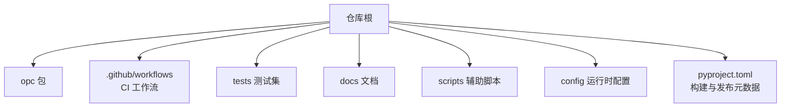
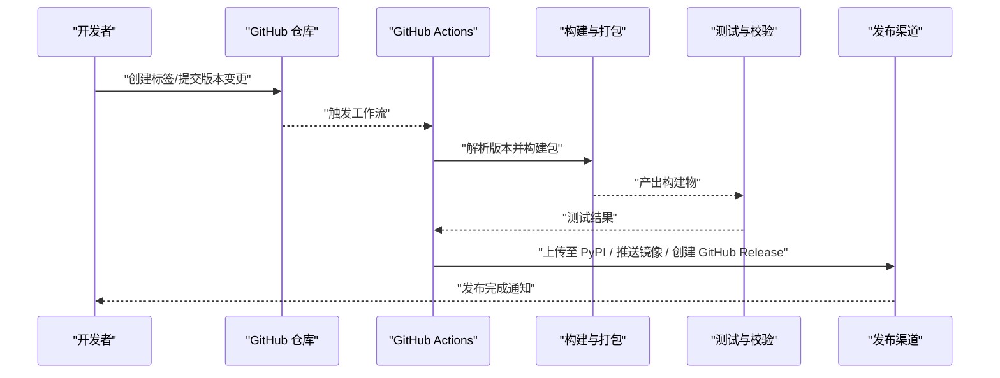
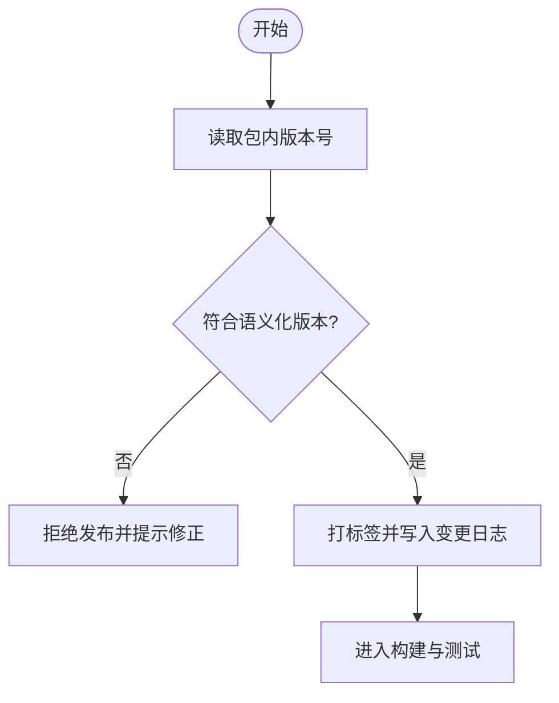
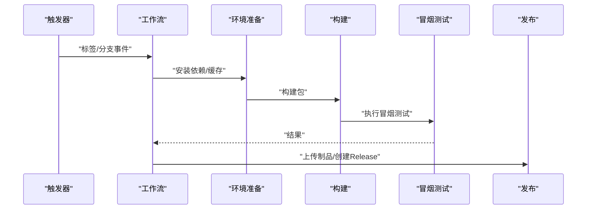
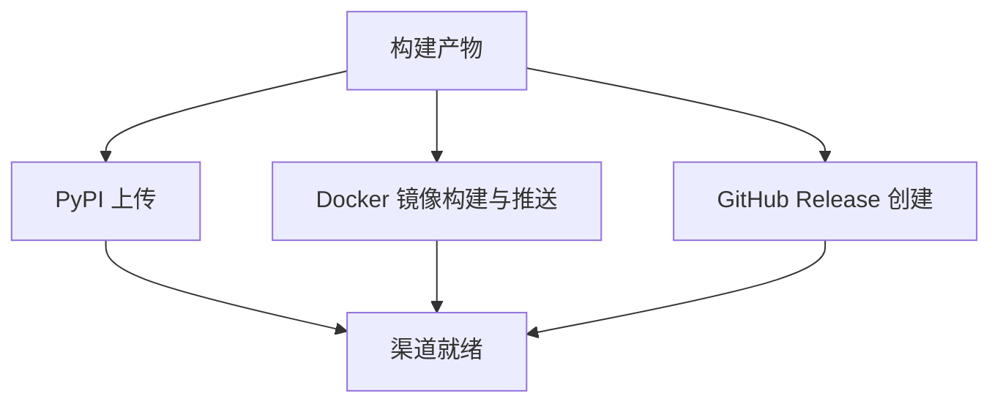
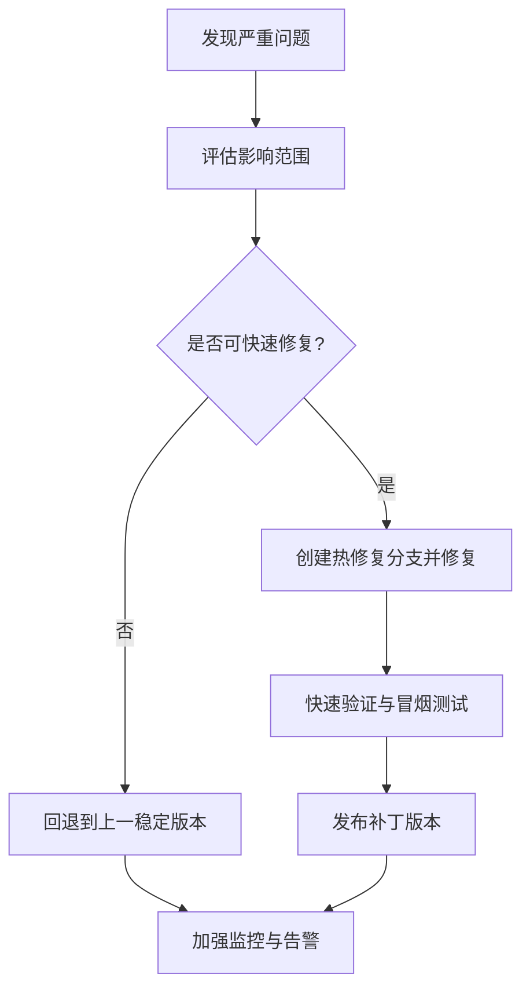
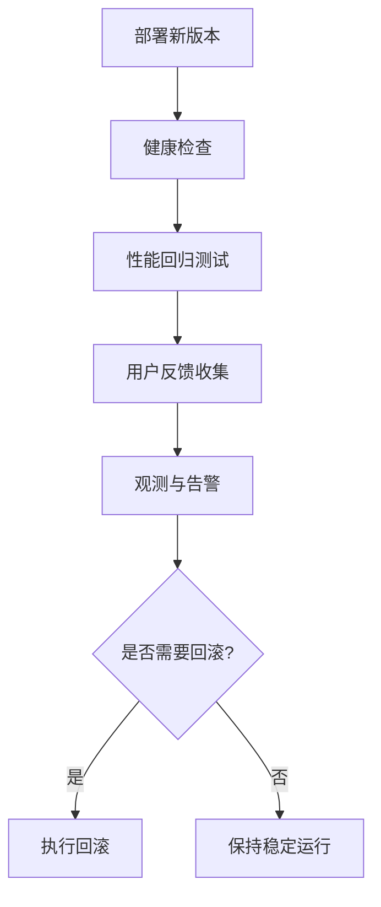
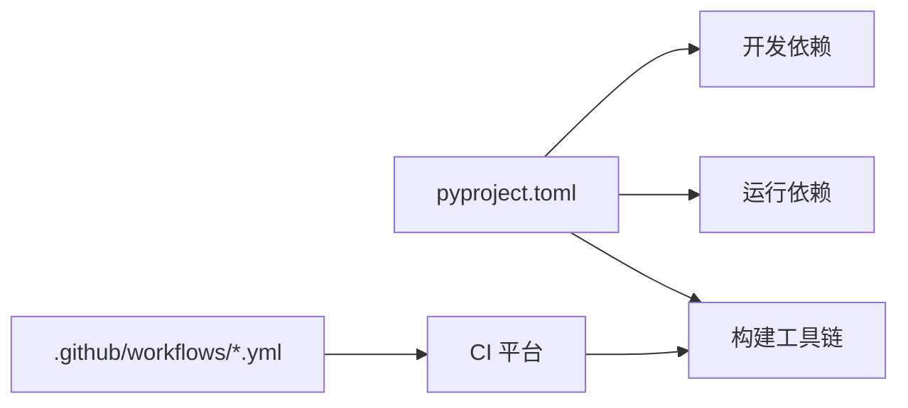

# 发布流程

<cite>
**本文引用的文件**   
- [pyproject.toml](file://pyproject.toml)
- [.github/workflows/external-agent-smoke.yml](file://.github/workflows/external-agent-smoke.yml)
- [README.md](file://README.md)
- [opc/__init__.py](file://opc/__init__.py)
</cite>

## 目录
1. [简介](#简介)
2. [项目结构](#项目结构)
3. [核心组件](#核心组件)
4. [架构总览](#架构总览)
5. [详细组件分析](#详细组件分析)
6. [依赖分析](#依赖分析)
7. [性能考虑](#性能考虑)
8. [故障排查指南](#故障排查指南)
9. [结论](#结论)
10. [附录](#附录)

## 简介
本文件面向OpenOPC的维护者与贡献者，提供一套可重复、可审计、可回滚的发布流程规范。内容覆盖版本管理策略（语义化版本控制与变更日志）、发布准备（代码冻结、测试验证、文档更新与安全审计）、自动化发布（CI/CD流水线、构建脚本、部署自动化）、发布渠道（PyPI、Docker镜像、GitHub Release）、回滚与紧急修复（热修复与降级）、发布后监控与验证（健康检查、性能回归、用户反馈），以及发布检查清单与常见问题处理方案。

## 项目结构
仓库采用Python包组织方式，核心入口位于opc目录；构建与发布元数据集中在pyproject.toml；持续集成工作流位于.github/workflows；测试集中于tests目录；文档位于docs目录。

**图表来源** 
- [pyproject.toml](file://pyproject.toml)
- [.github/workflows/external-agent-smoke.yml](file://.github/workflows/external-agent-smoke.yml)

**章节来源**
- [pyproject.toml](file://pyproject.toml)
- [README.md](file://README.md)

## 核心组件
- 版本标识：通过包的初始化模块暴露版本号，供安装器与运行期读取。
- 构建与打包：由pyproject.toml声明包名、版本、依赖与打包产物格式，驱动标准构建工具生成wheel/sdist。
- CI/CD：GitHub Actions工作流负责触发冒烟测试等质量门禁，为后续发布流水线提供前置保障。
- 测试套件：单元测试、集成测试与端到端测试覆盖关键路径，确保发布前质量基线。

**章节来源**
- [opc/__init__.py](file://opc/__init__.py)
- [pyproject.toml](file://pyproject.toml)
- [.github/workflows/external-agent-smoke.yml](file://.github/workflows/external-agent-smoke.yml)

## 架构总览
下图展示从“版本标记”到“多通道发布”的整体流程，包括版本解析、构建、测试、制品归档与分发。

**图表来源** 
- [.github/workflows/external-agent-smoke.yml](file://.github/workflows/external-agent-smoke.yml)
- [pyproject.toml](file://pyproject.toml)

## 详细组件分析

### 版本管理与语义化版本控制
- 版本来源：包的版本号在包的初始化模块中定义，作为单一事实源。
- 语义化版本规则：遵循MAJOR.MINOR.PATCH约定，重大不兼容升级递增主版本，新增功能且兼容递增次版本，缺陷修复递增修订号。
- 版本一致性：构建阶段从包初始化模块读取版本号，避免手工同步错误。
- 变更日志：建议以独立文件记录每个版本的变更摘要，按类型分组（新增、修复、破坏性变更、安全、弃用）。

**图表来源** 
- [opc/__init__.py](file://opc/__init__.py)

**章节来源**
- [opc/__init__.py](file://opc/__init__.py)

### 发布准备工作
- 代码冻结：在发布候选分支上冻结非紧急变更，仅允许修复类提交。
- 测试验证：本地与CI全量执行测试套件，确保无回归。
- 文档更新：更新README与相关文档，确保安装、使用与变更说明一致。
- 安全审计：扫描依赖漏洞与许可证合规，必要时升级或替换风险依赖。
- 预检清单：核对版本号、变更日志、依赖锁定、密钥与权限、制品签名（可选）。

**章节来源**
- [README.md](file://README.md)

### 自动化发布流程（CI/CD）
- 触发条件：基于标签或特定分支事件触发工作流。
- 构建阶段：依据pyproject.toml进行标准化构建，生成wheel与sdist。
- 测试阶段：执行冒烟测试与核心用例，失败则中止发布。
- 制品归档：将构建产物与测试报告归档，便于追溯。
- 发布阶段：根据环境选择目标渠道（PyPI、镜像仓库、GitHub Release）。

**图表来源** 
- [.github/workflows/external-agent-smoke.yml](file://.github/workflows/external-agent-smoke.yml)

**章节来源**
- [.github/workflows/external-agent-smoke.yml](file://.github/workflows/external-agent-smoke.yml)
- [pyproject.toml](file://pyproject.toml)

### 发布渠道管理
- PyPI发布：使用标准打包产物上传至PyPI，需配置凭据与双因素认证。
- Docker镜像：若存在容器化需求，应在构建阶段生成镜像并推送到镜像仓库。
- GitHub Release：为每个版本创建Release，附带构建产物与变更日志。

**图表来源** 
- [pyproject.toml](file://pyproject.toml)

**章节来源**
- [pyproject.toml](file://pyproject.toml)

### 回滚策略与紧急修复流程
- 热修复：针对生产问题快速创建hotfix分支，修复后打补丁版本标签，走最小化CI流程并发布。
- 版本降级：在无法立即修复时，优先回退到上一个稳定版本，同时跟踪问题并排障。
- 不可变发布：已发布的制品不应被覆盖，如需修复应发布新版本而非修改旧版本。
- 回滚操作：通过切换部署目标版本或回退镜像标签实现快速恢复。

[本节为概念性流程，无需源码引用]

### 发布后监控与验证
- 健康检查：对服务接口或CLI命令进行基础可用性验证。
- 性能回归：对比基准指标，检测显著退化。
- 用户反馈：收集社区与内部用户反馈，建立问题追踪闭环。
- 观测性：启用日志、指标与链路追踪，定位潜在异常。

[本节为概念性流程，无需源码引用]

## 依赖分析
- 构建依赖：由pyproject.toml声明，驱动构建工具链。
- 运行依赖：随包分发，安装时自动解析与安装。
- 开发依赖：用于测试、文档与本地调试，不参与生产构建。
- 外部集成：CI工作流依赖GitHub Actions生态与可能的第三方工具。

**图表来源** 
- [pyproject.toml](file://pyproject.toml)
- [.github/workflows/external-agent-smoke.yml](file://.github/workflows/external-agent-smoke.yml)

**章节来源**
- [pyproject.toml](file://pyproject.toml)
- [.github/workflows/external-agent-smoke.yml](file://.github/workflows/external-agent-smoke.yml)

## 性能考虑
- 构建缓存：利用CI缓存依赖与中间产物，缩短构建时间。
- 并行测试：拆分测试任务并行执行，提升吞吐。
- 增量发布：仅在变更路径执行必要测试，减少等待。
- 制品瘦身：剔除不必要资源，减小包体积与镜像大小。

[本节为通用指导，无需源码引用]

## 故障排查指南
- 构建失败：检查pyproject.toml配置、依赖解析与Python环境版本。
- 测试失败：复现本地失败用例，确认是否为环境问题或回归。
- 发布失败：核验凭据、网络连通性与目标仓库状态。
- 回滚失败：确认目标版本可用性与依赖兼容性。

**章节来源**
- [pyproject.toml](file://pyproject.toml)
- [.github/workflows/external-agent-smoke.yml](file://.github/workflows/external-agent-smoke.yml)

## 结论
通过统一的版本来源、严格的语义化版本规则、完善的CI/CD流水线与多渠道发布能力，OpenOPC可实现高可靠、可重复的发布过程。配合回滚策略与发布后监控，能够在保证质量的同时快速响应问题，持续提升交付效率与稳定性。

[本节为总结性内容，无需源码引用]

## 附录

### 发布检查清单
- 版本与标签
  - 版本号符合语义化版本规则
  - 变更日志已更新并包含重要变更摘要
  - 标签与版本一致
- 构建与制品
  - 构建成功并生成wheel与sdist
  - 制品完整性校验通过
- 测试与质量
  - 全部测试通过，无已知阻塞缺陷
  - 冒烟测试与核心场景验证通过
- 文档与合规
  - README与相关文档已更新
  - 依赖安全扫描通过
- 发布与回滚
  - 凭据与权限正确
  - 发布渠道就绪
  - 回滚预案与操作步骤明确

[本节为通用清单，无需源码引用]

### 常见问题处理方案
- 版本号不一致：统一从包初始化模块读取版本，禁止手动多处维护。
- 依赖冲突：锁定依赖版本，定期升级并回归验证。
- CI超时：优化缓存与并行度，拆分耗时任务。
- 发布失败重试：幂等设计，支持断点续传与重试机制。

[本节为通用指导，无需源码引用]