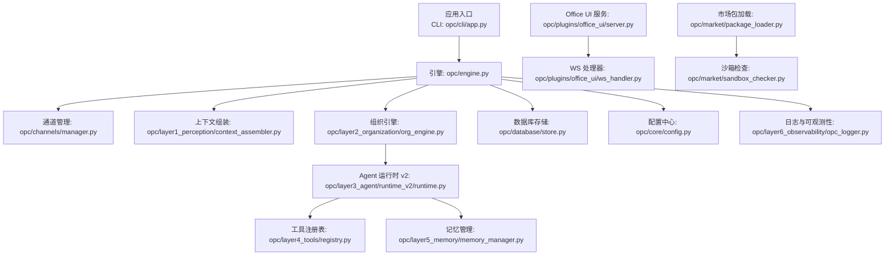
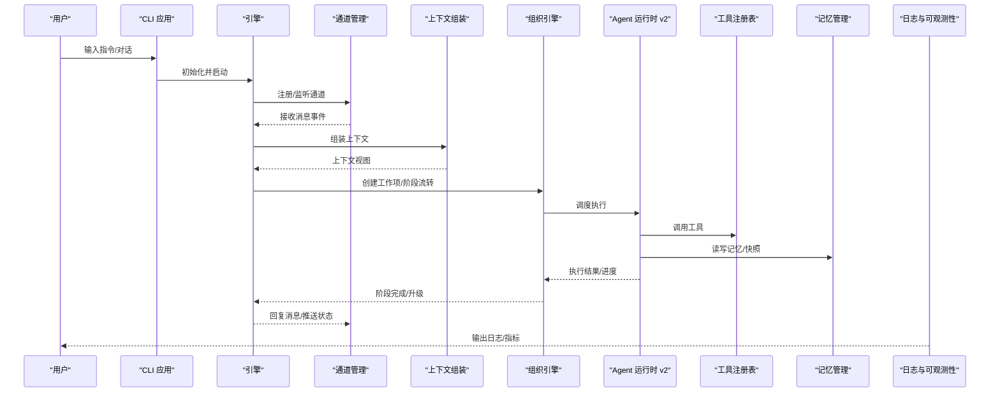
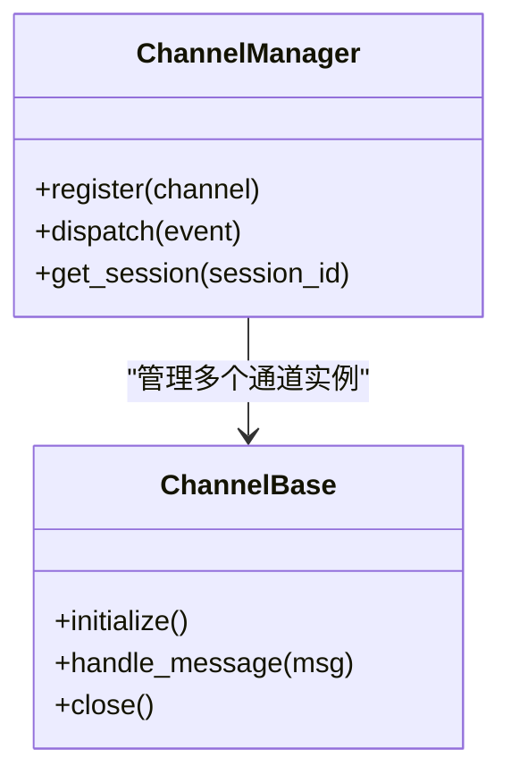
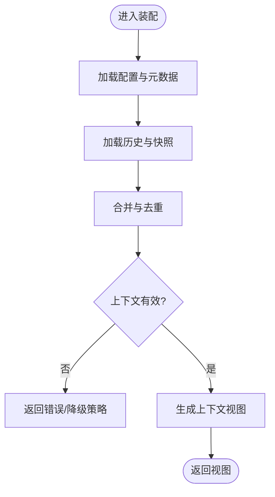
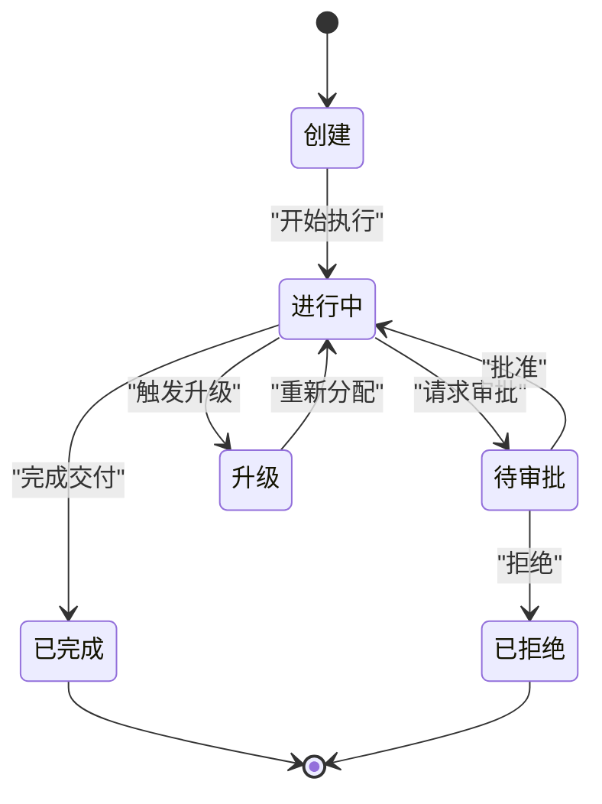
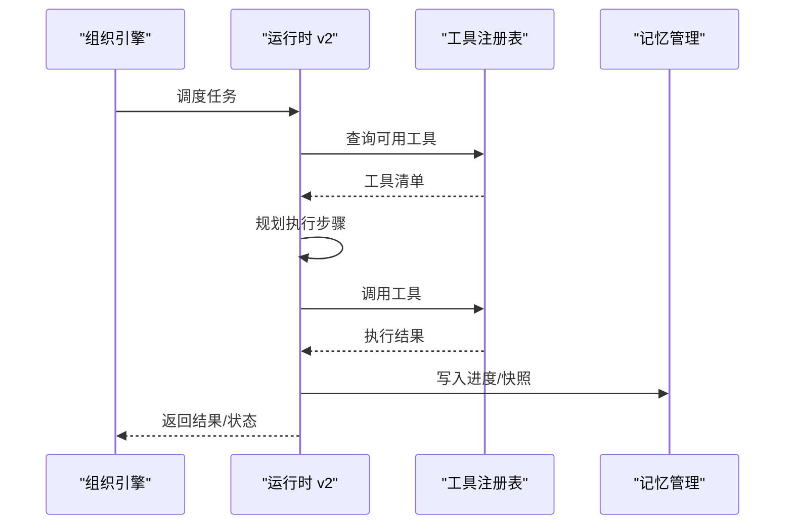
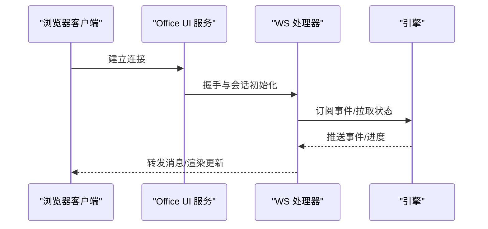
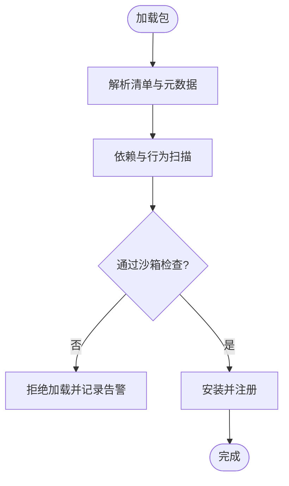
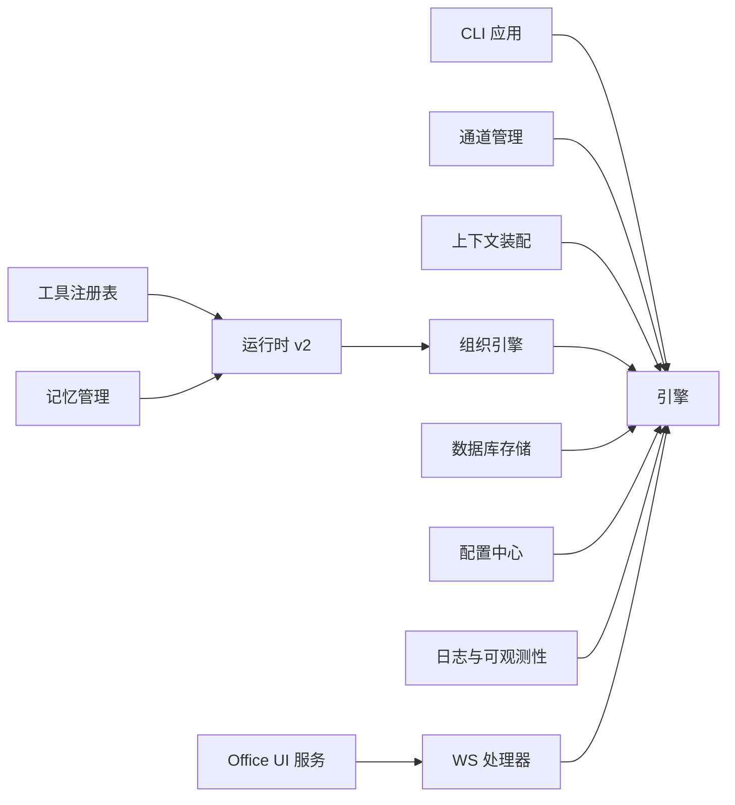

# 开发者指南

<cite>
**本文引用的文件**   
- [README.md](file://README.md)
- [pyproject.toml](file://pyproject.toml)
- [opc/engine.py](file://opc/engine.py)
- [opc/cli/app.py](file://opc/cli/app.py)
- [opc/channels/manager.py](file://opc/channels/manager.py)
- [opc/channels/base.py](file://opc/channels/base.py)
- [opc/core/config.py](file://opc/core/config.py)
- [opc/core/models.py](file://opc/core/models.py)
- [opc/database/store.py](file://opc/database/store.py)
- [opc/layer1_perception/context_assembler.py](file://opc/layer1_perception/context_assembler.py)
- [opc/layer2_organization/org_engine.py](file://opc/layer2_organization/org_engine.py)
- [opc/layer3_agent/runtime_v2/runtime.py](file://opc/layer3_agent/runtime_v2/runtime.py)
- [opc/layer4_tools/registry.py](file://opc/layer4_tools/registry.py)
- [opc/layer5_memory/memory_manager.py](file://opc/layer5_memory/memory_manager.py)
- [opc/layer6_observability/opc_logger.py](file://opc/layer6_observability/opc_logger.py)
- [opc/plugins/office_ui/server.py](file://opc/plugins/office_ui/server.py)
- [opc/plugins/office_ui/ws_handler.py](file://opc/plugins/office_ui/ws_handler.py)
- [opc/market/package_loader.py](file://opc/market/package_loader.py)
- [opc/market/sandbox_checker.py](file://opc/market/sandbox_checker.py)
- [.github/workflows/external-agent-smoke.yml](file://.github/workflows/external-agent-smoke.yml)
- [tests/test_cli_app.py](file://tests/test_cli_app.py)
- [tests/test_channels.py](file://tests/test_channels.py)
- [tests/test_company_collaboration.py](file://tests/test_company_collaboration.py)
- [tests/e2e/canvas_smoke.mjs](file://tests/e2e/canvas_smoke.mjs)
</cite>

## 目录
1. [简介](#简介)
2. [项目结构](#项目结构)
3. [核心组件](#核心组件)
4. [架构总览](#架构总览)
5. [详细组件分析](#详细组件分析)
6. [依赖分析](#依赖分析)
7. [性能考虑](#性能考虑)
8. [故障排除指南](#故障排除指南)
9. [结论](#结论)
10. [附录](#附录)

## 简介
本指南面向希望参与 OpenOPC 开发的贡献者，目标是帮助新成员快速上手并高效协作。内容涵盖：
- 代码规范与开发约定（命名、注释、文件组织）
- 测试策略与用例编写方法（单元、集成、端到端）
- 贡献流程（提交规范、PR 流程、审查标准）
- 发布与版本管理策略
- 调试技巧与性能分析方法
- 常见问题与排障
- 开发工具链配置建议
- 持续集成与自动化部署说明

OpenOPC 是一个以“公司模式”为核心的多通道智能体编排系统，提供从感知、组织、执行到记忆与可观测性的分层能力，并通过插件化 UI 和 CLI 对外暴露交互入口。

## 项目结构
仓库采用按功能域与层次划分的模块化结构，核心位于 opc 包内，测试集中于 tests，前端插件位于 opc/plugins/office_ui，CLI 入口在 opc/cli，工作流定义在 .github/workflows。

图示来源
- [opc/cli/app.py](file://opc/cli/app.py)
- [opc/engine.py](file://opc/engine.py)
- [opc/channels/manager.py](file://opc/channels/manager.py)
- [opc/layer1_perception/context_assembler.py](file://opc/layer1_perception/context_assembler.py)
- [opc/layer2_organization/org_engine.py](file://opc/layer2_organization/org_engine.py)
- [opc/layer3_agent/runtime_v2/runtime.py](file://opc/layer3_agent/runtime_v2/runtime.py)
- [opc/layer4_tools/registry.py](file://opc/layer4_tools/registry.py)
- [opc/layer5_memory/memory_manager.py](file://opc/layer5_memory/memory_manager.py)
- [opc/database/store.py](file://opc/database/store.py)
- [opc/core/config.py](file://opc/core/config.py)
- [opc/layer6_observability/opc_logger.py](file://opc/layer6_observability/opc_logger.py)
- [opc/plugins/office_ui/server.py](file://opc/plugins/office_ui/server.py)
- [opc/plugins/office_ui/ws_handler.py](file://opc/plugins/office_ui/ws_handler.py)
- [opc/market/package_loader.py](file://opc/market/package_loader.py)
- [opc/market/sandbox_checker.py](file://opc/market/sandbox_checker.py)

章节来源
- [README.md](file://README.md)
- [pyproject.toml](file://pyproject.toml)

## 核心组件
- 应用入口与 CLI
  - CLI 应用负责解析命令、初始化运行环境并启动主循环或交互式会话。
  - 参考路径：[opc/cli/app.py](file://opc/cli/app.py)
- 引擎与生命周期
  - 引擎协调通道、上下文、组织与 Agent 运行时，驱动任务从感知到交付的完整流程。
  - 参考路径：[opc/engine.py](file://opc/engine.py)
- 通道子系统
  - 统一抽象与多通道实现，通过管理器进行注册、路由与会话隔离。
  - 参考路径：[opc/channels/manager.py](file://opc/channels/manager.py)、[opc/channels/base.py](file://opc/channels/base.py)
- 上下文与感知层
  - 负责消息预处理、上下文拼装与路由决策。
  - 参考路径：[opc/layer1_perception/context_assembler.py](file://opc/layer1_perception/context_assembler.py)
- 组织与编排层
  - 维护角色、阶段、工作项与审批等组织级状态机与策略。
  - 参考路径：[opc/layer2_organization/org_engine.py](file://opc/layer2_organization/org_engine.py)
- Agent 运行时 v2
  - 提供权限、子代理、工具规划与执行、工作树等运行时能力。
  - 参考路径：[opc/layer3_agent/runtime_v2/runtime.py](file://opc/layer3_agent/runtime_v2/runtime.py)
- 工具生态
  - 工具注册表统一管理可用工具，支持动态发现与调用。
  - 参考路径：[opc/layer4_tools/registry.py](file://opc/layer4_tools/registry.py)
- 记忆与持久化
  - 记忆管理与历史压缩、偏好与技能库等。
  - 参考路径：[opc/layer5_memory/memory_manager.py](file://opc/layer5_memory/memory_manager.py)
- 配置与模型
  - 配置加载与校验、领域模型定义。
  - 参考路径：[opc/core/config.py](file://opc/core/config.py)、[opc/core/models.py](file://opc/core/models.py)
- 数据库与存储
  - 统一的持久化接口与迁移策略。
  - 参考路径：[opc/database/store.py](file://opc/database/store.py)
- 可观测性与日志
  - 结构化日志、成本追踪与指标上报。
  - 参考路径：[opc/layer6_observability/opc_logger.py](file://opc/layer6_observability/opc_logger.py)
- Office UI 插件
  - Web 服务与 WebSocket 处理器，提供可视化看板与实时交互。
  - 参考路径：[opc/plugins/office_ui/server.py](file://opc/plugins/office_ui/server.py)、[opc/plugins/office_ui/ws_handler.py](file://opc/plugins/office_ui/ws_handler.py)
- 市场与包管理
  - 包加载、元数据解析与安全沙箱检查。
  - 参考路径：[opc/market/package_loader.py](file://opc/market/package_loader.py)、[opc/market/sandbox_checker.py](file://opc/market/sandbox_checker.py)

章节来源
- [opc/cli/app.py](file://opc/cli/app.py)
- [opc/engine.py](file://opc/engine.py)
- [opc/channels/manager.py](file://opc/channels/manager.py)
- [opc/channels/base.py](file://opc/channels/base.py)
- [opc/layer1_perception/context_assembler.py](file://opc/layer1_perception/context_assembler.py)
- [opc/layer2_organization/org_engine.py](file://opc/layer2_organization/org_engine.py)
- [opc/layer3_agent/runtime_v2/runtime.py](file://opc/layer3_agent/runtime_v2/runtime.py)
- [opc/layer4_tools/registry.py](file://opc/layer4_tools/registry.py)
- [opc/layer5_memory/memory_manager.py](file://opc/layer5_memory/memory_manager.py)
- [opc/core/config.py](file://opc/core/config.py)
- [opc/core/models.py](file://opc/core/models.py)
- [opc/database/store.py](file://opc/database/store.py)
- [opc/layer6_observability/opc_logger.py](file://opc/layer6_observability/opc_logger.py)
- [opc/plugins/office_ui/server.py](file://opc/plugins/office_ui/server.py)
- [opc/plugins/office_ui/ws_handler.py](file://opc/plugins/office_ui/ws_handler.py)
- [opc/market/package_loader.py](file://opc/market/package_loader.py)
- [opc/market/sandbox_checker.py](file://opc/market/sandbox_checker.py)

## 架构总览
OpenOPC 采用分层架构：
- 接入层：CLI 与 Office UI 插件作为用户入口
- 通道层：统一消息协议与多通道适配
- 感知层：上下文装配与路由
- 组织层：角色、阶段与工作项的状态机与策略
- 执行层：Agent 运行时 v2 与工具生态
- 记忆层：持久化与历史压缩
- 可观测层：日志、指标与成本追踪

图示来源
- [opc/cli/app.py](file://opc/cli/app.py)
- [opc/engine.py](file://opc/engine.py)
- [opc/channels/manager.py](file://opc/channels/manager.py)
- [opc/layer1_perception/context_assembler.py](file://opc/layer1_perception/context_assembler.py)
- [opc/layer2_organization/org_engine.py](file://opc/layer2_organization/org_engine.py)
- [opc/layer3_agent/runtime_v2/runtime.py](file://opc/layer3_agent/runtime_v2/runtime.py)
- [opc/layer4_tools/registry.py](file://opc/layer4_tools/registry.py)
- [opc/layer5_memory/memory_manager.py](file://opc/layer5_memory/memory_manager.py)
- [opc/layer6_observability/opc_logger.py](file://opc/layer6_observability/opc_logger.py)

## 详细组件分析

### 通道子系统（Channels）
- 设计要点
  - 基于基类抽象统一接口，管理器负责实例化、路由与会话隔离
  - 各通道实现遵循一致的回调与错误处理契约
- 关键文件
  - 基类与抽象接口：[opc/channels/base.py](file://opc/channels/base.py)
  - 通道管理器：[opc/channels/manager.py](file://opc/channels/manager.py)
- 扩展建议
  - 新增通道需继承基类，实现必要方法并在管理器中注册
  - 保持事件语义一致，确保异常向上抛出并由上层统一处理

图示来源
- [opc/channels/base.py](file://opc/channels/base.py)
- [opc/channels/manager.py](file://opc/channels/manager.py)

章节来源
- [opc/channels/base.py](file://opc/channels/base.py)
- [opc/channels/manager.py](file://opc/channels/manager.py)

### 上下文装配器（Context Assembler）
- 职责
  - 聚合多源信息（会话、配置、历史、外部上下文）生成统一上下文视图
- 关键文件
  - 上下文装配：[opc/layer1_perception/context_assembler.py](file://opc/layer1_perception/context_assembler.py)
- 优化点
  - 对大上下文进行裁剪与去重，避免冗余信息影响后续推理效率

图示来源
- [opc/layer1_perception/context_assembler.py](file://opc/layer1_perception/context_assembler.py)

章节来源
- [opc/layer1_perception/context_assembler.py](file://opc/layer1_perception/context_assembler.py)

### 组织引擎（Org Engine）
- 职责
  - 管理工作项生命周期、阶段转换、审批与升级策略
- 关键文件
  - 组织引擎：[opc/layer2_organization/org_engine.py](file://opc/layer2_organization/org_engine.py)
- 状态机
  - 阶段转换需满足不变式约束，失败时触发回滚或升级流程

图示来源
- [opc/layer2_organization/org_engine.py](file://opc/layer2_organization/org_engine.py)

章节来源
- [opc/layer2_organization/org_engine.py](file://opc/layer2_organization/org_engine.py)

### Agent 运行时 v2（Runtime v2）
- 职责
  - 权限控制、子代理管理、工具规划与执行、工作树操作
- 关键文件
  - 运行时：[opc/layer3_agent/runtime_v2/runtime.py](file://opc/layer3_agent/runtime_v2/runtime.py)
- 工具调用序列
  - 规划→选择→执行→结果回传→记忆更新

图示来源
- [opc/layer3_agent/runtime_v2/runtime.py](file://opc/layer3_agent/runtime_v2/runtime.py)
- [opc/layer4_tools/registry.py](file://opc/layer4_tools/registry.py)
- [opc/layer5_memory/memory_manager.py](file://opc/layer5_memory/memory_manager.py)

章节来源
- [opc/layer3_agent/runtime_v2/runtime.py](file://opc/layer3_agent/runtime_v2/runtime.py)
- [opc/layer4_tools/registry.py](file://opc/layer4_tools/registry.py)
- [opc/layer5_memory/memory_manager.py](file://opc/layer5_memory/memory_manager.py)

### Office UI 插件（Server & WS Handler）
- 职责
  - 提供 Web 服务与 WebSocket 通信，渲染看板与实时状态
- 关键文件
  - 服务：[opc/plugins/office_ui/server.py](file://opc/plugins/office_ui/server.py)
  - WS 处理器：[opc/plugins/office_ui/ws_handler.py](file://opc/plugins/office_ui/ws_handler.py)
- 交互流程
  - 客户端连接→鉴权与会绑定→订阅事件→双向消息传输

图示来源
- [opc/plugins/office_ui/server.py](file://opc/plugins/office_ui/server.py)
- [opc/plugins/office_ui/ws_handler.py](file://opc/plugins/office_ui/ws_handler.py)
- [opc/engine.py](file://opc/engine.py)

章节来源
- [opc/plugins/office_ui/server.py](file://opc/plugins/office_ui/server.py)
- [opc/plugins/office_ui/ws_handler.py](file://opc/plugins/office_ui/ws_handler.py)

### 市场与包管理（Market & Sandbox）
- 职责
  - 加载市场包、解析元数据、执行安全沙箱检查
- 关键文件
  - 包加载：[opc/market/package_loader.py](file://opc/market/package_loader.py)
  - 沙箱检查：[opc/market/sandbox_checker.py](file://opc/market/sandbox_checker.py)
- 安全检查流程
  - 清单校验→依赖扫描→行为白名单→加载执行

图示来源
- [opc/market/package_loader.py](file://opc/market/package_loader.py)
- [opc/market/sandbox_checker.py](file://opc/market/sandbox_checker.py)

章节来源
- [opc/market/package_loader.py](file://opc/market/package_loader.py)
- [opc/market/sandbox_checker.py](file://opc/market/sandbox_checker.py)

## 依赖分析
- 模块耦合
  - 引擎为中枢，依赖通道、上下文、组织、运行时、记忆与可观测性
  - Office UI 插件通过服务与 WS 处理器与引擎解耦
- 外部依赖
  - 通过 pyproject.toml 声明 Python 依赖与构建配置
- 潜在风险
  - 避免在运行时层直接访问底层存储，应通过记忆与数据库抽象
  - 通道与 UI 的事件契约需保持稳定，防止破坏性变更

图示来源
- [opc/cli/app.py](file://opc/cli/app.py)
- [opc/engine.py](file://opc/engine.py)
- [opc/channels/manager.py](file://opc/channels/manager.py)
- [opc/layer1_perception/context_assembler.py](file://opc/layer1_perception/context_assembler.py)
- [opc/layer2_organization/org_engine.py](file://opc/layer2_organization/org_engine.py)
- [opc/layer3_agent/runtime_v2/runtime.py](file://opc/layer3_agent/runtime_v2/runtime.py)
- [opc/layer4_tools/registry.py](file://opc/layer4_tools/registry.py)
- [opc/layer5_memory/memory_manager.py](file://opc/layer5_memory/memory_manager.py)
- [opc/database/store.py](file://opc/database/store.py)
- [opc/core/config.py](file://opc/core/config.py)
- [opc/layer6_observability/opc_logger.py](file://opc/layer6_observability/opc_logger.py)
- [opc/plugins/office_ui/server.py](file://opc/plugins/office_ui/server.py)
- [opc/plugins/office_ui/ws_handler.py](file://opc/plugins/office_ui/ws_handler.py)

章节来源
- [pyproject.toml](file://pyproject.toml)

## 性能考虑
- 上下文裁剪与去重
  - 在上下文装配阶段减少冗余，提升后续推理与工具调用的效率
- 记忆压缩与快照
  - 使用记忆管理器的压缩策略，降低长期会话的内存占用
- 工具调用批处理
  - 在运行时层对独立工具调用进行批处理与并发控制
- 日志采样与分级
  - 在高吞吐场景下启用日志采样与分级输出，避免 IO 瓶颈
- 数据库读写分离
  - 将只读查询与写操作分离，必要时引入缓存层

## 故障排除指南
- 常见问题
  - 通道无法连接：检查通道配置与网络可达性，查看日志中的错误码
  - 上下文过大导致超时：启用上下文裁剪策略，限制历史长度
  - 工具调用失败：确认工具注册表是否包含目标工具，检查权限与参数
  - 记忆写入失败：检查数据库连接与迁移状态，必要时回滚至稳定版本
  - Office UI 无响应：验证 WS 连接与事件订阅，检查服务端日志
- 定位技巧
  - 使用可观测性模块输出结构化日志与指标
  - 在关键路径添加断点与中间状态打印，结合测试用例复现问题
- 恢复策略
  - 利用快照与持久化状态进行恢复
  - 对不稳定依赖增加重试与熔断机制

章节来源
- [opc/layer6_observability/opc_logger.py](file://opc/layer6_observability/opc_logger.py)
- [opc/database/store.py](file://opc/database/store.py)
- [opc/plugins/office_ui/ws_handler.py](file://opc/plugins/office_ui/ws_handler.py)

## 结论
OpenOPC 的分层架构与插件化设计为扩展与维护提供了良好基础。遵循本文的规范与流程，有助于提升代码质量与协作效率。建议在新增功能时同步完善测试与文档，确保可观测性与可恢复性。

## 附录

### 代码规范与开发约定
- 命名规则
  - 模块与包名使用小写下划线；类名使用帕斯卡命名；函数与方法使用小写下划线
  - 常量使用大写加下划线；私有成员以下划线前缀标识
- 注释标准
  - 模块级 docstring 描述职责与依赖
  - 类与方法需提供参数、返回值与异常说明
  - 复杂逻辑处补充行内注释，解释“为什么”而非“是什么”
- 文件组织结构
  - 按功能域划分目录，单一职责原则
  - 公共接口集中定义，具体实现按需拆分
  - 配置文件与资源文件与代码分离

### 测试策略与用例编写
- 单元测试
  - 针对纯函数与无副作用方法进行覆盖
  - 使用夹具与模拟对象隔离外部依赖
  - 参考路径：[tests/test_cli_app.py](file://tests/test_cli_app.py)、[tests/test_channels.py](file://tests/test_channels.py)
- 集成测试
  - 验证组件间交互与数据一致性
  - 参考路径：[tests/test_company_collaboration.py](file://tests/test_company_collaboration.py)
- 端到端测试
  - 模拟真实用户流程，覆盖关键业务路径
  - 参考路径：[tests/e2e/canvas_smoke.mjs](file://tests/e2e/canvas_smoke.mjs)
- 最佳实践
  - 用例命名清晰表达意图
  - 断言明确且可重复
  - 使用异步测试框架处理并发与网络调用

### 贡献指南
- 提交规范
  - 使用语义化提交信息（feat、fix、docs、test、refactor、chore 等）
  - 提交范围限定到具体模块或功能
- Pull Request 流程
  - 分支命名：feature/xxx、fix/xxx、chore/xxx
  - PR 描述包含变更动机、影响范围与测试覆盖
  - 关联相关 Issue 与文档更新
- 代码审查标准
  - 可读性与可维护性优先
  - 复杂度与圈复杂度控制
  - 安全性与性能考量
  - 测试覆盖率与回归用例

### 发布流程与版本管理
- 版本策略
  - 采用语义化版本（主.次.修订）
  - 重大变更提升主版本，新功能提升次版本，修复提升修订版本
- 发布步骤
  - 更新版本号与变更日志
  - 运行全量测试与静态检查
  - 打包与签名，发布到制品库
- 回滚策略
  - 保留稳定版本标签与镜像
  - 提供一键回滚脚本与验证用例

### 调试技巧与性能分析
- 调试技巧
  - 启用详细日志与追踪 ID
  - 使用断点与条件断点定位问题
  - 借助 REPL 与交互式调试器
- 性能分析
  - 使用性能剖析工具识别热点
  - 监控 CPU、内存与 IO 指标
  - 对长耗时操作进行异步化与批处理

### 开发工具链配置
- Python 环境
  - 使用虚拟环境或容器化方案
  - 依赖管理通过 pyproject.toml 与包管理器
- IDE 配置
  - 启用类型检查与自动格式化
  - 配置测试运行器与调试器
- 前端插件
  - 使用 Node.js 工具链构建与测试
  - 配置 Vite 与 TypeScript 编译选项

### 持续集成与自动化部署
- CI 流程
  - 代码检查、单元测试、集成测试与端到端测试
  - 构建产物与报告归档
- 示例工作流
  - 外部代理冒烟测试：[.github/workflows/external-agent-smoke.yml](file://.github/workflows/external-agent-smoke.yml)
- 部署策略
  - 蓝绿部署或金丝雀发布
  - 健康检查与自动回滚