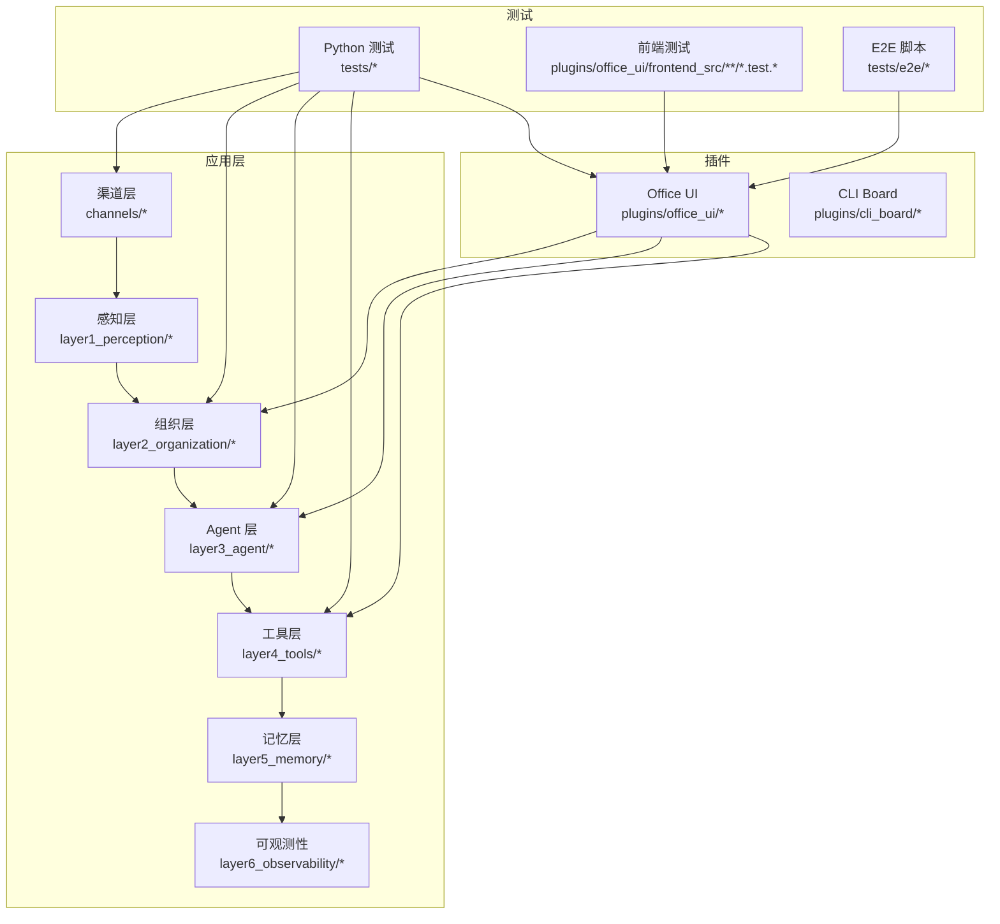
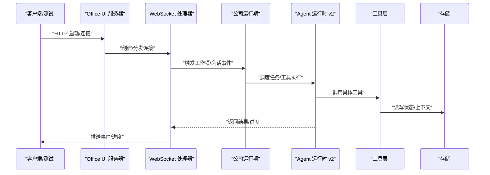
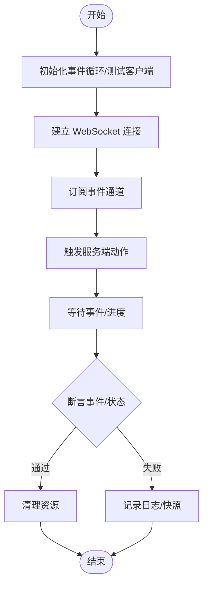
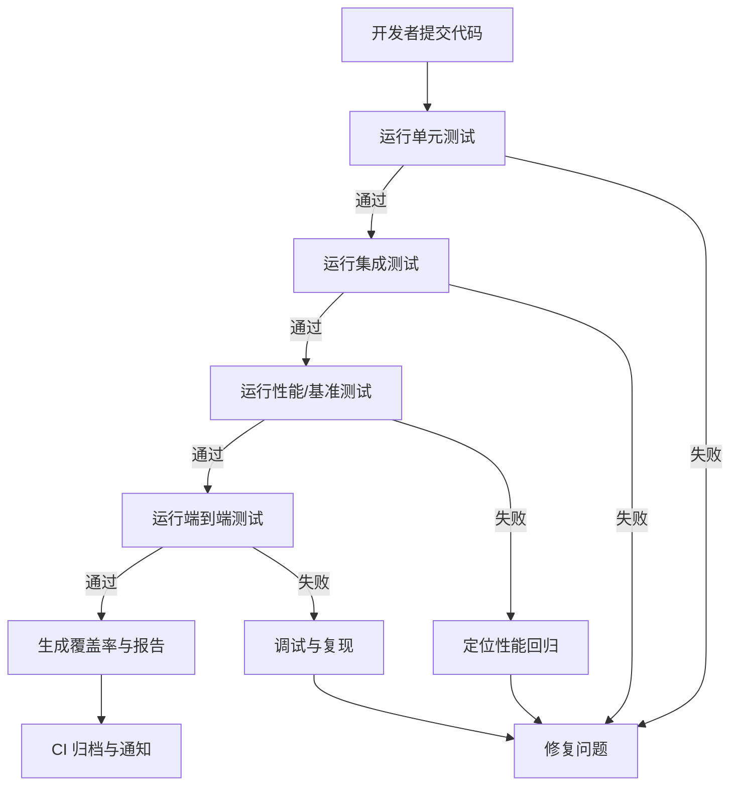
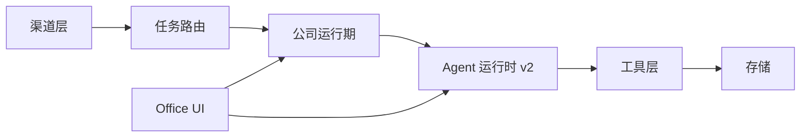

# 测试策略

<cite>
**本文引用的文件**   
- [pyproject.toml](file://pyproject.toml)
- [README.md](file://README.md)
- [test_native_runtime_v2.py](file://tests/test_native_runtime_v2.py)
- [test_native_runtime_v2_benchmarks.py](file://tests/test_native_runtime_v2_benchmarks.py)
- [test_channels.py](file://tests/test_channels.py)
- [test_channel_contracts.py](file://tests/test_channel_contracts.py)
- [test_channel_runtime_integration.py](file://tests/test_channel_runtime_integration.py)
- [test_ws_handler_escalations.py](file://tests/test_ws_handler_escalations.py)
- [test_ws_handler_progress_parsing.py](file://tests/test_ws_handler_progress_parsing.py)
- [ws_handler.py](file://opc/plugins/office_ui/ws_handler.py)
- [server.py](file://opc/plugins/office_ui/server.py)
- [channels/base.py](file://opc/channels/base.py)
- [channels/provider_registry.py](file://opc/channels/provider_registry.py)
- [layer1_perception/task_router.py](file://opc/layer1_perception/task_router.py)
- [layer2_organization/company_runtime.py](file://opc/layer2_organization/company_runtime.py)
- [layer3_agent/runtime_v2/runtime.py](file://opc/layer3_agent/runtime_v2/runtime.py)
- [layer4_tools/agent_runtime.py](file://opc/layer4_tools/agent_runtime.py)
- [core/config.py](file://opc/core/config.py)
- [database/store.py](file://opc/database/store.py)
- [e2e/canvas_smoke.mjs](file://tests/e2e/canvas_smoke.mjs)
</cite>

## 目录
1. [引言](#引言)
2. [项目结构](#项目结构)
3. [核心组件](#核心组件)
4. [架构总览](#架构总览)
5. [详细组件分析](#详细组件分析)
6. [依赖分析](#依赖分析)
7. [性能考虑](#性能考虑)
8. [故障排查指南](#故障排查指南)
9. [结论](#结论)
10. [附录](#附录)

## 引言
本测试策略面向 OpenOPC 工程，目标是建立覆盖单元测试、集成测试与端到端测试的完整质量保障体系。文档将明确测试金字塔的职责划分、执行策略、用例编写规范、异步与并发测试方法、性能与基准测试方案、覆盖率要求与报告生成、测试环境配置（数据库与外部服务模拟、配置隔离），并提供通道、代理运行时与 UI 组件等关键场景的具体示例路径。

## 项目结构
OpenOPC 采用分层与插件化组织：
- 业务层：渠道接入、公司运行期、任务路由、工具集、记忆与可观测性
- 插件层：Office UI（含 WebSocket 处理）、CLI Board
- 测试层：Python 单测与集成测试、前端单测、E2E 脚本

图表来源
- [channels/base.py:1-200](file://opc/channels/base.py#L1-200)
- [layer1_perception/task_router.py:1-200](file://opc/layer1_perception/task_router.py#L1-200)
- [layer2_organization/company_runtime.py:1-200](file://opc/layer2_organization/company_runtime.py#L1-200)
- [layer3_agent/runtime_v2/runtime.py:1-200](file://opc/layer3_agent/runtime_v2/runtime.py#L1-200)
- [layer4_tools/agent_runtime.py:1-200](file://opc/layer4_tools/agent_runtime.py#L1-200)
- [ws_handler.py:1-200](file://opc/plugins/office_ui/ws_handler.py#L1-200)
- [server.py:1-200](file://opc/plugins/office_ui/server.py#L1-200)

章节来源
- [pyproject.toml:1-200](file://pyproject.toml#L1-L200)
- [README.md:1-200](file://README.md#L1-L200)

## 核心组件
- 渠道抽象与注册：定义统一渠道接口与提供者注册表，便于对多平台进行统一测试与替换
- 公司运行期：编排会话、工作项生命周期、阶段转换与协作策略，是集成测试的核心对象
- Agent 运行时 v2：提供工具执行、流式输出、权限与子代理能力，适合单元与基准测试
- Office UI 后端：WebSocket 处理器与服务启动，承载实时事件与进度推送，适合异步与端到端验证
- 配置与存储：集中配置加载与持久化存储，用于测试环境隔离与数据准备

章节来源
- [channels/base.py:1-200](file://opc/channels/base.py#L1-L200)
- [channels/provider_registry.py:1-200](file://opc/channels/provider_registry.py#L1-L200)
- [layer2_organization/company_runtime.py:1-200](file://opc/layer2_organization/company_runtime.py#L1-L200)
- [layer3_agent/runtime_v2/runtime.py:1-200](file://opc/layer3_agent/runtime_v2/runtime.py#L1-L200)
- [layer4_tools/agent_runtime.py:1-200](file://opc/layer4_tools/agent_runtime.py#L1-L200)
- [ws_handler.py:1-200](file://opc/plugins/office_ui/ws_handler.py#L1-L200)
- [server.py:1-200](file://opc/plugins/office_ui/server.py#L1-L200)
- [core/config.py:1-200](file://opc/core/config.py#L1-L200)
- [database/store.py:1-200](file://opc/database/store.py#L1-L200)

## 架构总览
下图展示从客户端到后端各层的调用链，以及测试在何处切入。

图表来源
- [server.py:1-200](file://opc/plugins/office_ui/server.py#L1-L200)
- [ws_handler.py:1-200](file://opc/plugins/office_ui/ws_handler.py#L1-L200)
- [layer2_organization/company_runtime.py:1-200](file://opc/layer2_organization/company_runtime.py#L1-L200)
- [layer3_agent/runtime_v2/runtime.py:1-200](file://opc/layer3_agent/runtime_v2/runtime.py#L1-L200)
- [layer4_tools/agent_runtime.py:1-200](file://opc/layer4_tools/agent_runtime.py#L1-L200)
- [database/store.py:1-200](file://opc/database/store.py#L1-L200)

## 详细组件分析

### 测试金字塔与职责划分
- 单元测试（约 70%）
  - 目标：验证纯函数、类方法与内部逻辑的正确性
  - 范围：工具层、配置解析、数据结构校验、算法片段
  - 策略：无网络、无磁盘或仅内存；使用 Mock 与夹具
- 集成测试（约 20%）
  - 目标：验证模块间协作与边界条件
  - 范围：渠道契约、公司运行期编排、Agent 运行时 v2 与工具栈、存储迁移
  - 策略：轻量真实依赖（如内存存储或临时 SQLite），必要时注入替代实现
- 端到端测试（约 10%）
  - 目标：验证用户旅程与跨层交互
  - 范围：Office UI 启动、WebSocket 事件流、UI 渲染与交互
  - 策略：最小化真实环境，固定端口与临时数据目录，断言可见行为

章节来源
- [test_native_runtime_v2.py:1-200](file://tests/test_native_runtime_v2.py#L1-L200)
- [test_channel_runtime_integration.py:1-200](file://tests/test_channel_runtime_integration.py#L1-L200)
- [e2e/canvas_smoke.mjs:1-200](file://tests/e2e/canvas_smoke.mjs#L1-L200)

### 测试用例编写规范
- 命名约定
  - Python：以 test_ 开头，描述“被测功能_场景_期望”
  - TypeScript：文件名 *.test.ts / *.test.tsx，describe/it 块表达场景
- 测试数据准备
  - 使用夹具与工厂函数构造最小可用数据
  - 对外部资源使用临时目录/内存存储
- 断言标准
  - 优先断言可观察状态变化与副作用
  - 对时间相关逻辑使用可控时钟或等待策略
- Mock 对象使用
  - 对网络、文件系统、外部服务使用桩/替身
  - 记录调用次数与参数，避免过度耦合

章节来源
- [test_native_runtime_v2.py:1-200](file://tests/test_native_runtime_v2.py#L1-L200)
- [test_ws_handler_progress_parsing.py:1-200](file://tests/test_ws_handler_progress_parsing.py#L1-L200)
- [test_office_ui_message_sanitization.py:1-200](file://tests/test_office_ui_message_sanitization.py#L1-L200)

### 异步测试实现方法
- 事件循环处理
  - 使用异步测试框架驱动事件循环，确保 await 与回调正确完成
- 并发测试
  - 针对并发写入、锁与队列顺序进行压力与回归检测
- WebSocket 测试
  - 通过测试客户端连接服务端，订阅事件并断言消息序列与超时行为

图表来源
- [test_ws_handler_escalations.py:1-200](file://tests/test_ws_handler_escalations.py#L1-L200)
- [test_ws_handler_progress_parsing.py:1-200](file://tests/test_ws_handler_progress_parsing.py#L1-L200)
- [ws_handler.py:1-200](file://opc/plugins/office_ui/ws_handler.py#L1-L200)
- [server.py:1-200](file://opc/plugins/office_ui/server.py#L1-L200)

章节来源
- [test_ws_handler_escalations.py:1-200](file://tests/test_ws_handler_escalations.py#L1-L200)
- [test_ws_handler_progress_parsing.py:1-200](file://tests/test_ws_handler_progress_parsing.py#L1-L200)
- [ws_handler.py:1-200](file://opc/plugins/office_ui/ws_handler.py#L1-L200)
- [server.py:1-200](file://opc/plugins/office_ui/server.py#L1-L200)

### 性能测试与基准测试
- 负载与压力测试
  - 模拟高并发连接与大量消息吞吐，关注延迟分布与错误率
- 性能回归检测
  - 对关键路径（如运行时编排、工具执行）设置基线阈值
- 基准测试
  - 聚焦 CPU/IO 热点，隔离外部依赖，重复采样取稳定值

章节来源
- [test_native_runtime_v2_benchmarks.py:1-200](file://tests/test_native_runtime_v2_benchmarks.py#L1-L200)

### 测试覆盖率与报告
- 覆盖率要求
  - 建议行覆盖率≥80%，分支覆盖率≥70%；核心模块更高
- 报告生成
  - 使用覆盖率工具生成 HTML/XML 报告，CI 中上传与归档
  - 对未覆盖的关键路径添加补充用例

章节来源
- [pyproject.toml:1-200](file://pyproject.toml#L1-L200)

### 测试环境配置
- 数据库测试
  - 使用内存或临时文件数据库，测试前后自动清理
- 外部服务模拟
  - 对 LLM、浏览器、Shell、Git 等使用桩或本地回环服务
- 配置隔离
  - 通过环境变量与配置文件注入，避免污染宿主环境

章节来源
- [core/config.py:1-200](file://opc/core/config.py#L1-L200)
- [database/store.py:1-200](file://opc/database/store.py#L1-L200)

### 示例一：渠道测试（通道契约与运行时集成）
- 目标
  - 验证渠道抽象一致性、注册机制与运行时对接
- 关键点
  - 使用注册表获取渠道实例，断言接口契约
  - 模拟上游消息，验证下游事件派发与序列化
- 参考路径
  - [test_channels.py:1-200](file://tests/test_channels.py#L1-L200)
  - [test_channel_contracts.py:1-200](file://tests/test_channel_contracts.py#L1-L200)
  - [test_channel_runtime_integration.py:1-200](file://tests/test_channel_runtime_integration.py#L1-L200)
  - [channels/base.py:1-200](file://opc/channels/base.py#L1-L200)
  - [channels/provider_registry.py:1-200](file://opc/channels/provider_registry.py#L1-L200)

章节来源
- [test_channels.py:1-200](file://tests/test_channels.py#L1-L200)
- [test_channel_contracts.py:1-200](file://tests/test_channel_contracts.py#L1-L200)
- [test_channel_runtime_integration.py:1-200](file://tests/test_channel_runtime_integration.py#L1-L200)
- [channels/base.py:1-200](file://opc/channels/base.py#L1-L200)
- [channels/provider_registry.py:1-200](file://opc/channels/provider_registry.py#L1-L200)

### 示例二：代理运行时测试（v2 与工具栈）
- 目标
  - 验证 Agent 运行时 v2 的任务编排、工具执行与流式输出
- 关键点
  - 注入工具桩，断言调用顺序与返回值
  - 验证权限控制与子代理边界
- 参考路径
  - [test_native_runtime_v2.py:1-200](file://tests/test_native_runtime_v2.py#L1-L200)
  - [layer3_agent/runtime_v2/runtime.py:1-200](file://opc/layer3_agent/runtime_v2/runtime.py#L1-L200)
  - [layer4_tools/agent_runtime.py:1-200](file://opc/layer4_tools/agent_runtime.py#L1-L200)

章节来源
- [test_native_runtime_v2.py:1-200](file://tests/test_native_runtime_v2.py#L1-L200)
- [layer3_agent/runtime_v2/runtime.py:1-200](file://opc/layer3_agent/runtime_v2/runtime.py#L1-L200)
- [layer4_tools/agent_runtime.py:1-200](file://opc/layer4_tools/agent_runtime.py#L1-L200)

### 示例三：UI 组件与 WebSocket 测试
- 目标
  - 验证 Office UI 的消息渲染、反馈卡片与 WebSocket 事件流
- 关键点
  - 前端单测断言组件状态与交互
  - 后端 WS 处理器断言事件解析与升级流程
- 参考路径
  - [test_office_ui_delivery_feedback_cards.py:1-200](file://tests/test_office_ui_delivery_feedback_cards.py#L1-L200)
  - [test_office_ui_message_sanitization.py:1-200](file://tests/test_office_ui_message_sanitization.py#L1-L200)
  - [test_ws_handler_escalations.py:1-200](file://tests/test_ws_handler_escalations.py#L1-L200)
  - [test_ws_handler_progress_parsing.py:1-200](file://tests/test_ws_handler_progress_parsing.py#L1-L200)
  - [ws_handler.py:1-200](file://opc/plugins/office_ui/ws_handler.py#L1-L200)
  - [server.py:1-200](file://opc/plugins/office_ui/server.py#L1-L200)

章节来源
- [test_office_ui_delivery_feedback_cards.py:1-200](file://tests/test_office_ui_delivery_feedback_cards.py#L1-L200)
- [test_office_ui_message_sanitization.py:1-200](file://tests/test_office_ui_message_sanitization.py#L1-L200)
- [test_ws_handler_escalations.py:1-200](file://tests/test_ws_handler_escalations.py#L1-L200)
- [test_ws_handler_progress_parsing.py:1-200](file://tests/test_ws_handler_progress_parsing.py#L1-L200)
- [ws_handler.py:1-200](file://opc/plugins/office_ui/ws_handler.py#L1-L200)
- [server.py:1-200](file://opc/plugins/office_ui/server.py#L1-L200)

### 概念总览：测试流水线与执行策略

[此图为概念性流程图，不直接映射具体源码文件]

## 依赖分析
- 组件耦合
  - 渠道层与公司运行期松耦合，通过契约与注册表解耦
  - Office UI 依赖公司运行期与 Agent 运行时，但可通过 WS 事件与命令模式隔离
- 外部依赖
  - LLM、浏览器、Shell、Git 等通过工具层抽象，测试中可替换为桩
- 潜在循环依赖
  - 保持单向依赖：UI → 运行期 → 工具层 → 存储

图表来源
- [channels/base.py:1-200](file://opc/channels/base.py#L1-L200)
- [layer1_perception/task_router.py:1-200](file://opc/layer1_perception/task_router.py#L1-L200)
- [layer2_organization/company_runtime.py:1-200](file://opc/layer2_organization/company_runtime.py#L1-L200)
- [layer3_agent/runtime_v2/runtime.py:1-200](file://opc/layer3_agent/runtime_v2/runtime.py#L1-L200)
- [layer4_tools/agent_runtime.py:1-200](file://opc/layer4_tools/agent_runtime.py#L1-L200)
- [database/store.py:1-200](file://opc/database/store.py#L1-L200)
- [ws_handler.py:1-200](file://opc/plugins/office_ui/ws_handler.py#L1-L200)

章节来源
- [channels/base.py:1-200](file://opc/channels/base.py#L1-L200)
- [layer1_perception/task_router.py:1-200](file://opc/layer1_perception/task_router.py#L1-L200)
- [layer2_organization/company_runtime.py:1-200](file://opc/layer2_organization/company_runtime.py#L1-L200)
- [layer3_agent/runtime_v2/runtime.py:1-200](file://opc/layer3_agent/runtime_v2/runtime.py#L1-L200)
- [layer4_tools/agent_runtime.py:1-200](file://opc/layer4_tools/agent_runtime.py#L1-L200)
- [database/store.py:1-200](file://opc/database/store.py#L1-L200)
- [ws_handler.py:1-200](file://opc/plugins/office_ui/ws_handler.py#L1-L200)

## 性能考虑
- 基准测试应隔离外部 IO，聚焦 CPU 密集路径
- 负载测试需监控内存泄漏与连接池耗尽
- 引入渐进式回归阈值，避免误报与漏报

[本节为通用指导，不直接分析具体文件]

## 故障排查指南
- 常见问题
  - 异步测试挂起：检查事件循环是否关闭、回调是否注册
  - WebSocket 超时：确认心跳与重连策略
  - 并发竞争：增加同步原语或串行化关键路径
- 诊断手段
  - 启用详细日志与快照
  - 使用最小复现场景与固定种子数据

章节来源
- [test_ws_handler_escalations.py:1-200](file://tests/test_ws_handler_escalations.py#L1-L200)
- [test_ws_handler_progress_parsing.py:1-200](file://tests/test_ws_handler_progress_parsing.py#L1-L200)

## 结论
通过明确的测试金字塔、严格的用例规范、完善的异步与并发测试、系统的性能与覆盖率策略，以及可靠的测试环境配置，OpenOPC 可在快速迭代的同时保证稳定性与可维护性。建议在 CI 中固化上述流程，持续改进覆盖与性能基线。

## 附录
- 术语
  - 渠道：消息收发适配器
  - 公司运行期：组织与工作项编排引擎
  - Agent 运行时 v2：工具执行与流式输出核心
  - Office UI：基于 WebSocket 的前后端交互界面
- 参考入口
  - [README.md:1-200](file://README.md#L1-L200)
  - [pyproject.toml:1-200](file://pyproject.toml#L1-L200)