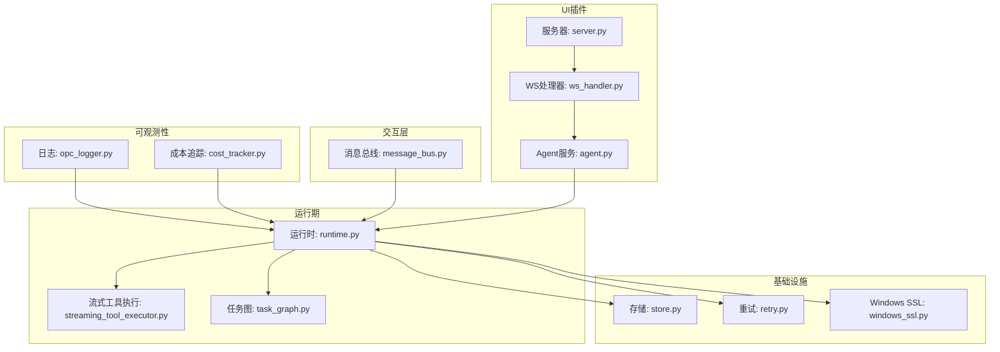
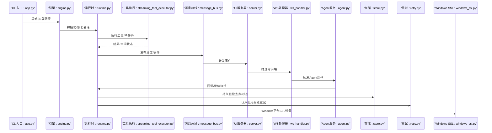
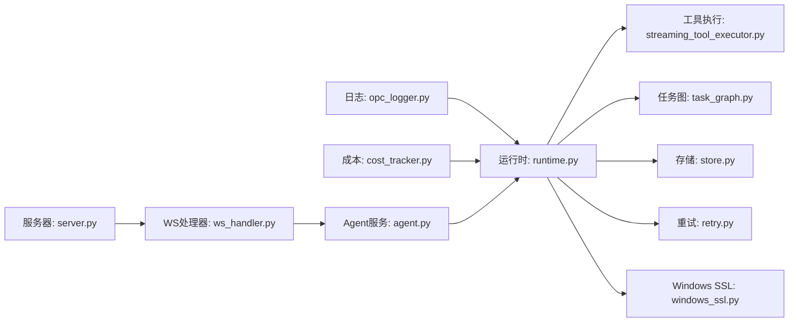
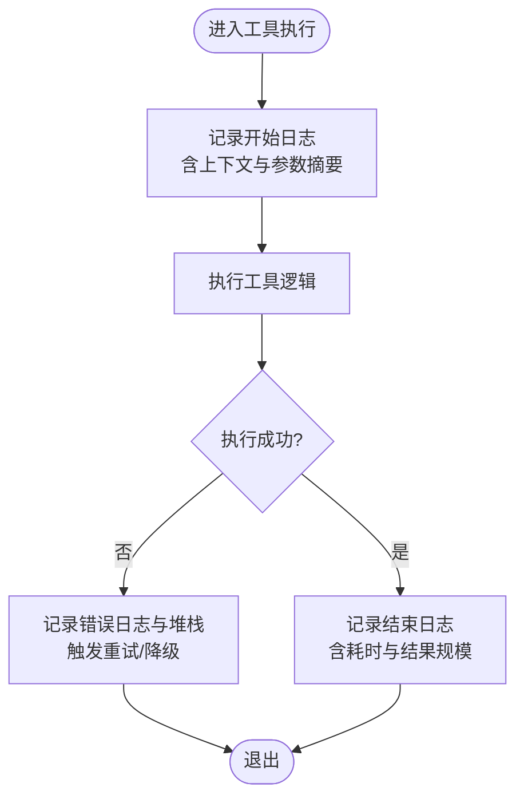

# 调试与诊断

<cite>
**本文引用的文件**   
- [opc_logger.py](file://opc/layer6_observability/opc_logger.py)
- [cost_tracker.py](file://opc/layer6_observability/cost_tracker.py)
- [engine.py](file://opc/engine.py)
- [app.py](file://opc/cli/app.py)
- [server.py](file://opc/plugins/office_ui/server.py)
- [ws_handler.py](file://opc/plugins/office_ui/ws_handler.py)
- [agent.py](file://opc/plugins/office_ui/services/agent.py)
- [runtime.py](file://opc/layer3_agent/runtime_v2/runtime.py)
- [streaming_tool_executor.py](file://opc/layer3_agent/runtime_v2/streaming_tool_executor.py)
- [task_graph.py](file://opc/layer2_organization/task_graph.py)
- [message_bus.py](file://opc/layer0_interaction/message_bus.py)
- [store.py](file://opc/database/store.py)
- [retry.py](file://opc/llm/retry.py)
- [windows_ssl.py](file://opc/core/windows_ssl.py)
</cite>

## 目录
1. [简介](#简介)
2. [项目结构](#项目结构)
3. [核心组件](#核心组件)
4. [架构总览](#架构总览)
5. [详细组件分析](#详细组件分析)
6. [依赖关系分析](#依赖关系分析)
7. [性能考虑](#性能考虑)
8. [故障排查指南](#故障排查指南)
9. [结论](#结论)
10. [附录](#附录)

## 简介
本指南面向OpenOPC的开发者与运维人员，聚焦于“调试与诊断”主题。内容覆盖日志系统使用、结构化日志记录与分析技巧；性能监控（成本追踪、执行时间分析、资源使用）；调试工具链配置（IDE、远程调试、内存分析）；问题诊断方法（错误堆栈、性能瓶颈、内存泄漏）；常见问题定位步骤（连接、权限、性能）；分布式调试技术（多进程、异步、跨服务跟踪）；以及生产环境最佳实践与监控告警建议。

## 项目结构
OpenOPC采用分层架构：可观测性层位于 layer6_observability，包含日志与成本追踪；运行时与任务编排位于 layer2_organization 与 layer3_agent；交互层在 layer0_interaction；UI插件在 plugins/office_ui；数据库访问在 database；LLM重试逻辑在 llm；Windows平台SSL适配在 core。

图表来源
- [opc_logger.py](file://opc/layer6_observability/opc_logger.py)
- [cost_tracker.py](file://opc/layer6_observability/cost_tracker.py)
- [runtime.py](file://opc/layer3_agent/runtime_v2/runtime.py)
- [streaming_tool_executor.py](file://opc/layer3_agent/runtime_v2/streaming_tool_executor.py)
- [task_graph.py](file://opc/layer2_organization/task_graph.py)
- [message_bus.py](file://opc/layer0_interaction/message_bus.py)
- [server.py](file://opc/plugins/office_ui/server.py)
- [ws_handler.py](file://opc/plugins/office_ui/ws_handler.py)
- [agent.py](file://opc/plugins/office_ui/services/agent.py)
- [store.py](file://opc/database/store.py)
- [retry.py](file://opc/llm/retry.py)
- [windows_ssl.py](file://opc/core/windows_ssl.py)

章节来源
- [engine.py](file://opc/engine.py)
- [app.py](file://opc/cli/app.py)
- [server.py](file://opc/plugins/office_ui/server.py)

## 核心组件
- 日志子系统：提供统一日志接口、级别控制、结构化字段输出与上下文传播能力，贯穿运行时、工具执行、UI与服务端。
- 成本追踪：围绕LLM调用与工具执行进行费用与用量统计，支持按会话/工作项维度聚合。
- 运行时与任务编排：负责工作项生命周期、阶段转换、任务图调度与工具执行，是性能与可观测性的关键落点。
- UI与通信：通过HTTP/WebSocket将状态、进度与日志事件推送至前端，便于交互式调试。
- 外部依赖与容错：包括数据库持久化、LLM重试策略与Windows SSL适配。

章节来源
- [opc_logger.py](file://opc/layer6_observability/opc_logger.py)
- [cost_tracker.py](file://opc/layer6_observability/cost_tracker.py)
- [runtime.py](file://opc/layer3_agent/runtime_v2/runtime.py)
- [streaming_tool_executor.py](file://opc/layer3_agent/runtime_v2/streaming_tool_executor.py)
- [task_graph.py](file://opc/layer2_organization/task_graph.py)
- [ws_handler.py](file://opc/plugins/office_ui/ws_handler.py)
- [agent.py](file://opc/plugins/office_ui/services/agent.py)
- [store.py](file://opc/database/store.py)
- [retry.py](file://opc/llm/retry.py)
- [windows_ssl.py](file://opc/core/windows_ssl.py)

## 架构总览
下图展示从CLI入口到UI展示的关键路径，并标注可观测性注入点（日志、成本、进度）。

图表来源
- [app.py](file://opc/cli/app.py)
- [engine.py](file://opc/engine.py)
- [runtime.py](file://opc/layer3_agent/runtime_v2/runtime.py)
- [streaming_tool_executor.py](file://opc/layer3_agent/runtime_v2/streaming_tool_executor.py)
- [message_bus.py](file://opc/layer0_interaction/message_bus.py)
- [server.py](file://opc/plugins/office_ui/server.py)
- [ws_handler.py](file://opc/plugins/office_ui/ws_handler.py)
- [agent.py](file://opc/plugins/office_ui/services/agent.py)
- [store.py](file://opc/database/store.py)
- [retry.py](file://opc/llm/retry.py)
- [windows_ssl.py](file://opc/core/windows_ssl.py)

## 详细组件分析

### 日志系统（结构化日志与级别控制）
- 设计要点
  - 统一日志接口：集中定义日志级别、格式化器与上下文字段（如会话ID、工作项ID、阶段名等），确保跨模块一致。
  - 结构化输出：以键值对形式记录关键信息，便于后续检索与聚合分析。
  - 上下文传播：在异步与多任务场景下，自动携带请求/任务上下文，避免丢失关联关系。
- 使用建议
  - 在关键路径（工具执行、阶段切换、外部调用）插入结构化日志，包含必要标识与度量。
  - 合理设置日志级别：开发/测试使用更细粒度，生产默认INFO/WARN，仅在必要时开启DEBUG。
  - 避免记录敏感数据，对大对象进行采样或摘要。
- 分析技巧
  - 基于会话/工作项ID过滤日志，还原完整执行轨迹。
  - 结合时间戳与耗时字段，识别慢操作与异常抖动。
  - 对关键字段做索引与聚合，构建仪表盘。

章节来源
- [opc_logger.py](file://opc/layer6_observability/opc_logger.py)
- [runtime.py](file://opc/layer3_agent/runtime_v2/runtime.py)
- [streaming_tool_executor.py](file://opc/layer3_agent/runtime_v2/streaming_tool_executor.py)
- [ws_handler.py](file://opc/plugins/office_ui/ws_handler.py)

### 成本追踪（费用与用量统计）
- 设计要点
  - 围绕LLM调用与工具执行埋点，记录输入/输出规模、模型版本、调用次数与费用估算。
  - 按会话/工作项维度聚合，支持上限控制与超阈告警。
- 使用建议
  - 在LLM调用前后记录开始/结束与用量，确保一致性。
  - 对高频短调用进行批量化或采样，降低开销。
  - 暴露成本指标供外部监控系统采集。
- 分析技巧
  - 对比不同模型/工具的性价比，优化提示词与工具选择。
  - 识别异常高消耗路径，进行针对性优化。

章节来源
- [cost_tracker.py](file://opc/layer6_observability/cost_tracker.py)
- [runtime.py](file://opc/layer3_agent/runtime_v2/runtime.py)

### 运行时与任务编排（执行时间与阶段转换）
- 设计要点
  - 工作项生命周期管理、阶段状态机与任务图调度。
  - 工具执行封装，支持流式返回与中间状态上报。
- 使用建议
  - 在阶段进入/退出、任务入队/出队、工具开始/完成处记录耗时与状态。
  - 为长耗时任务增加心跳与进度更新，便于前端可视化与中断恢复。
- 分析技巧
  - 绘制甘特图或时序图，定位阻塞点与并发热点。
  - 结合重试与超时策略，评估稳定性与SLA达成情况。

章节来源
- [runtime.py](file://opc/layer3_agent/runtime_v2/runtime.py)
- [streaming_tool_executor.py](file://opc/layer3_agent/runtime_v2/streaming_tool_executor.py)
- [task_graph.py](file://opc/layer2_organization/task_graph.py)

### UI与WebSocket（实时调试与进度可视化）
- 设计要点
  - HTTP服务器承载Web界面，WebSocket通道推送事件（进度、日志、错误）。
  - Agent服务桥接用户交互与后端运行时。
- 使用建议
  - 在前端控制台查看原始事件，辅助定位渲染与业务差异。
  - 利用断点与网络面板观察事件频率与大小，避免过载。
- 分析技巧
  - 对事件序列进行回放，复现问题。
  - 结合服务端日志与客户端时间戳，校准时钟与延迟。

章节来源
- [server.py](file://opc/plugins/office_ui/server.py)
- [ws_handler.py](file://opc/plugins/office_ui/ws_handler.py)
- [agent.py](file://opc/plugins/office_ui/services/agent.py)

### 外部依赖与容错（重试、持久化、平台适配）
- 设计要点
  - LLM调用具备重试与退避策略，提升鲁棒性。
  - 状态与检查点持久化，支持崩溃恢复。
  - Windows平台SSL证书与协议适配，减少连接问题。
- 使用建议
  - 合理设置重试次数、间隔与最大耗时，避免雪崩。
  - 定期清理过期检查点，控制存储增长。
  - 在Windows环境下优先启用平台SSL适配。
- 分析技巧
  - 关注重试风暴与级联失败，结合熔断与限流策略。
  - 校验持久化数据的完整性与一致性。

章节来源
- [retry.py](file://opc/llm/retry.py)
- [store.py](file://opc/database/store.py)
- [windows_ssl.py](file://opc/core/windows_ssl.py)

## 依赖关系分析
- 耦合与内聚
  - 可观测性层与运行时代码低耦合，通过接口与事件解耦。
  - UI与服务端通过消息总线与WebSocket松耦合，便于扩展与替换。
- 直接/间接依赖
  - 运行时依赖工具执行、任务图、存储与重试策略。
  - UI依赖服务器与WS处理器，间接依赖Agent与运行时。
- 潜在循环依赖
  - 通过事件与回调避免直接循环引用，保持单向依赖。
- 外部集成点
  - LLM提供商、数据库、操作系统SSL库。

图表来源
- [opc_logger.py](file://opc/layer6_observability/opc_logger.py)
- [cost_tracker.py](file://opc/layer6_observability/cost_tracker.py)
- [runtime.py](file://opc/layer3_agent/runtime_v2/runtime.py)
- [streaming_tool_executor.py](file://opc/layer3_agent/runtime_v2/streaming_tool_executor.py)
- [task_graph.py](file://opc/layer2_organization/task_graph.py)
- [store.py](file://opc/database/store.py)
- [retry.py](file://opc/llm/retry.py)
- [windows_ssl.py](file://opc/core/windows_ssl.py)
- [server.py](file://opc/plugins/office_ui/server.py)
- [ws_handler.py](file://opc/plugins/office_ui/ws_handler.py)
- [agent.py](file://opc/plugins/office_ui/services/agent.py)

章节来源
- [message_bus.py](file://opc/layer0_interaction/message_bus.py)

## 性能考虑
- 执行时间分析
  - 在工具执行、阶段切换与外部调用处记录起止时间，计算耗时分布。
  - 对长尾任务进行抽样与分桶，识别P95/P99瓶颈。
- 资源使用监控
  - 监控CPU、内存、I/O与网络带宽，结合GC与线程池指标。
  - 对大对象与频繁分配路径进行采样，避免内存抖动。
- 成本优化
  - 合并小请求、缓存中间结果、缩短上下文窗口。
  - 根据任务类型选择合适模型与工具，平衡质量与成本。
- 并发与背压
  - 限制并发度，避免下游过载；引入队列与令牌桶进行流量整形。
- 可观测性开销
  - 对高频日志与指标进行采样与降采样，避免自身成为瓶颈。

[本节为通用指导，不直接分析具体文件]

## 故障排查指南

### 日志级别与结构化记录
- 快速定位
  - 使用会话/工作项ID过滤日志，还原端到端流程。
  - 关注ERROR/WARN级别与异常堆栈，结合时间戳定位首次出现位置。
- 结构化字段
  - 确保关键字段（源、目标、耗时、状态码、错误码）齐全，便于聚合分析。
- 示例步骤
  - 在工具执行入口与出口插入结构化日志，记录输入摘要与输出规模。
  - 在阶段转换处记录进入/退出与原因，辅助理解状态机行为。

章节来源
- [opc_logger.py](file://opc/layer6_observability/opc_logger.py)
- [runtime.py](file://opc/layer3_agent/runtime_v2/runtime.py)
- [streaming_tool_executor.py](file://opc/layer3_agent/runtime_v2/streaming_tool_executor.py)

### 成本追踪与异常高消耗
- 定位高成本路径
  - 按会话/工作项聚合费用，识别异常峰值。
  - 对比不同模型/工具的成本曲线，调整策略。
- 示例步骤
  - 在LLM调用前后记录用量与费用，核对计费口径。
  - 对高频短调用进行批处理或缓存，降低总成本。

章节来源
- [cost_tracker.py](file://opc/layer6_observability/cost_tracker.py)
- [runtime.py](file://opc/layer3_agent/runtime_v2/runtime.py)

### 执行时间与性能瓶颈
- 分析方法
  - 绘制关键路径时序图，识别阻塞点与等待时间。
  - 结合线程/协程栈，定位锁竞争与上下文切换开销。
- 示例步骤
  - 在任务图调度与工具执行处记录耗时，生成热力图。
  - 对慢查询与外部调用进行采样，优化超时与重试策略。

章节来源
- [task_graph.py](file://opc/layer2_organization/task_graph.py)
- [streaming_tool_executor.py](file://opc/layer3_agent/runtime_v2/streaming_tool_executor.py)

### 内存泄漏检测
- 常见症状
  - 内存持续增长、GC频繁、OOM崩溃。
- 检测方法
  - 使用内存快照对比，定位未释放对象与强引用环。
  - 对大对象与缓存进行审计，设置容量上限与淘汰策略。
- 示例步骤
  - 在长时间运行的任务中周期性取快照，比较差异。
  - 针对UI事件与WebSocket消息，避免闭包持有大对象。

[本节为通用指导，不直接分析具体文件]

### 错误堆栈分析与重试策略
- 堆栈分析
  - 关注异常类型、调用链与最近变更，区分偶发与系统性问题。
- 重试与退避
  - 对瞬态错误（网络抖动、限流）实施指数退避与幂等保护。
  - 设置最大重试次数与超时，防止雪崩。
- 示例步骤
  - 在LLM调用失败时记录错误码与响应体摘要，配合重试策略调优。

章节来源
- [retry.py](file://opc/llm/retry.py)
- [runtime.py](file://opc/layer3_agent/runtime_v2/runtime.py)

### 连接问题与SSL适配（Windows）
- 常见问题
  - 证书不可信、协议不匹配、代理配置错误。
- 解决方法
  - 启用Windows平台SSL适配，确保系统信任链正确。
  - 校验代理与防火墙规则，验证连通性与延迟。
- 示例步骤
  - 在连接建立前后记录握手信息与错误码，逐步缩小范围。

章节来源
- [windows_ssl.py](file://opc/core/windows_ssl.py)

### 权限错误与存储访问
- 常见问题
  - 读写权限不足、路径不存在、配额超限。
- 解决方法
  - 校验进程用户与文件系统权限，确认存储路径与容量。
  - 对写入失败进行回滚与补偿，保证一致性。
- 示例步骤
  - 在持久化前后记录状态与异常，结合文件系统审计日志。

章节来源
- [store.py](file://opc/database/store.py)

### 常见问题排查清单
- 连接问题
  - 检查网络连通性、代理与SSL配置，记录握手与错误码。
- 权限错误
  - 校验用户权限、路径存在性与配额，记录权限检查结果。
- 性能问题
  - 收集CPU/内存/IO指标，绘制耗时分布，定位热点与锁竞争。
- 异步与并发
  - 检查队列长度与消费者速率，避免积压与背压失效。
- 跨服务调用
  - 使用唯一请求ID串联日志，确认上下游一致性与超时。

[本节为通用指导，不直接分析具体文件]

### 分布式调试技术
- 多进程调试
  - 为每个进程启用独立日志与指标，使用统一ID关联。
  - 使用进程间通信日志与心跳，判断存活与健康状态。
- 异步代码调试
  - 记录协程创建/销毁与切换点，避免挂起与死锁。
  - 对长协程增加超时与取消信号，便于快速失败。
- 跨服务调用跟踪
  - 在服务边界注入TraceID，串联请求链路。
  - 对关键节点记录入参/出参与耗时，形成调用拓扑。

[本节为通用指导，不直接分析具体文件]

### 调试工具链配置
- IDE调试器
  - 配置断点、条件断点与表达式求值，结合日志增强可读性。
  - 使用热重载与增量编译，提高迭代效率。
- 远程调试
  - 在远端启用调试端口，限制访问白名单，避免泄露。
  - 结合容器与卷挂载，复用本地调试体验。
- 内存分析工具
  - 使用快照对比与对象引用树，定位泄漏路径。
  - 结合GC日志与堆转储，分析分配热点与回收效果。

[本节为通用指导，不直接分析具体文件]

### 生产环境诊断最佳实践
- 分级日志与采样
  - 默认INFO/WARN，按需开启DEBUG；对高频日志采样降频。
- 指标与告警
  - 暴露关键指标（错误率、延迟、成本、资源使用），设置阈值告警。
- 可观测性面板
  - 构建统一看板，聚合日志、指标与链路，提升排障效率。
- 演练与复盘
  - 定期进行故障演练，完善预案与SOP，沉淀经验。

[本节为通用指导，不直接分析具体文件]

## 结论
通过统一的日志与成本追踪、完善的运行时与任务编排、实时的UI与WebSocket反馈，以及健壮的重试与平台适配，OpenOPC具备良好的可观测性与可调试性。在生产环境中，建议结合分级日志、指标告警与统一看板，持续优化性能与成本，提升稳定性与用户体验。

## 附录

### 典型调试流程图（以工具执行为例）

图表来源
- [streaming_tool_executor.py](file://opc/layer3_agent/runtime_v2/streaming_tool_executor.py)
- [opc_logger.py](file://opc/layer6_observability/opc_logger.py)