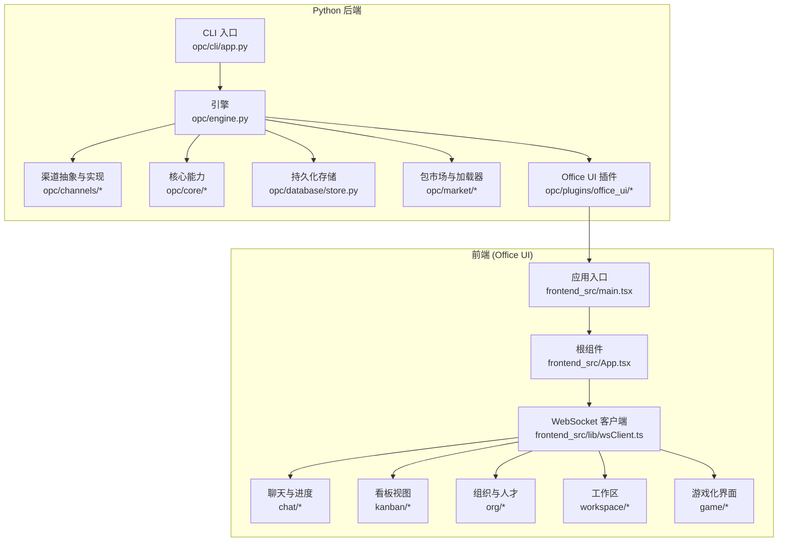
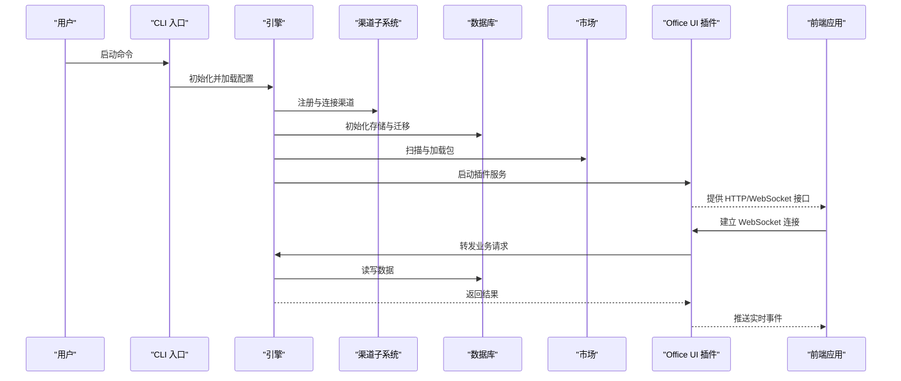
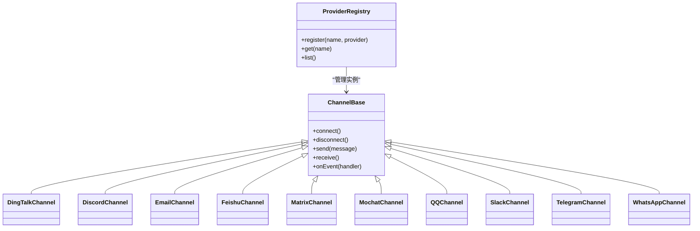
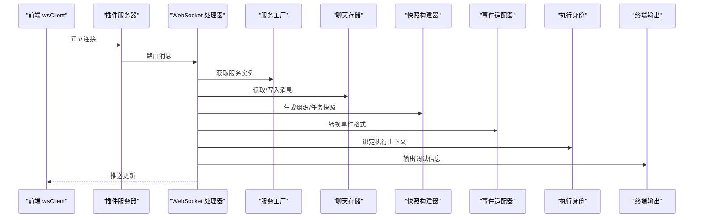
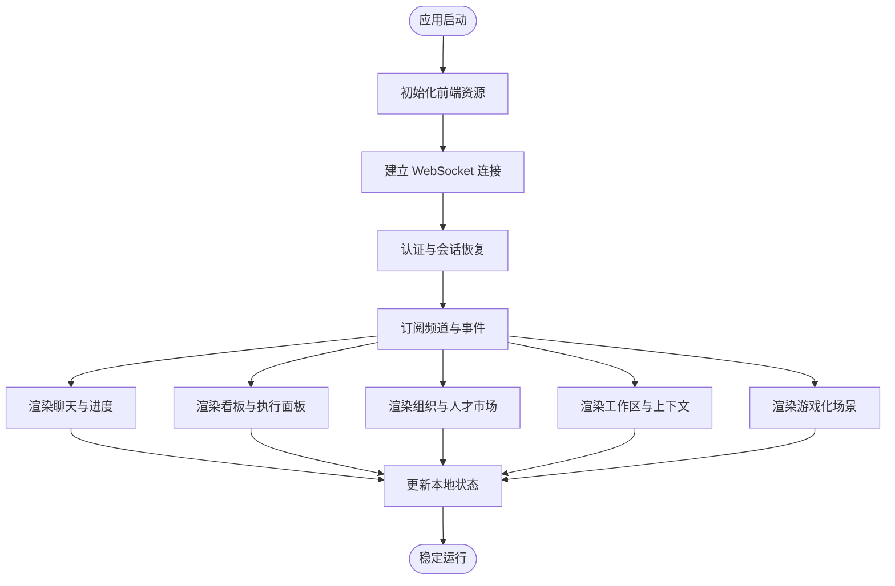
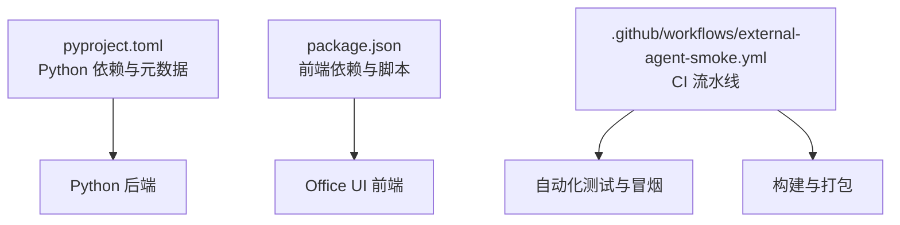

# 贡献指南

<cite>
**本文引用的文件**   
- [README.md](file://README.md)
- [README.zh-CN.md](file://README.zh-CN.md)
- [pyproject.toml](file://pyproject.toml)
- [.github/workflows/external-agent-smoke.yml](file://.github/workflows/external-agent-smoke.yml)
- [opc/cli/app.py](file://opc/cli/app.py)
- [opc/engine.py](file://opc/engine.py)
- [opc/channels/__init__.py](file://opc/channels/__init__.py)
- [opc/channels/base.py](file://opc/channels/base.py)
- [opc/channels/provider_registry.py](file://opc/channels/provider_registry.py)
- [opc/core/config.py](file://opc/core/config.py)
- [opc/database/store.py](file://opc/database/store.py)
- [opc/market/package_loader.py](file://opc/market/package_loader.py)
- [opc/plugins/office_ui/server.py](file://opc/plugins/office_ui/server.py)
- [opc/plugins/office_ui/services/factory.py](file://opc/plugins/office_ui/services/factory.py)
- [opc/plugins/office_ui/ws_handler.py](file://opc/plugins/office_ui/ws_handler.py)
- [opc/plugins/office_ui/chat_store.py](file://opc/plugins/office_ui/chat_store.py)
- [opc/plugins/office_ui/org_architecture_snapshot.py](file://opc/plugins/office_ui/org_architecture_snapshot.py)
- [opc/plugins/office_ui/snapshot_builder.py](file://opc/plugins/office_ui/snapshot_builder.py)
- [opc/plugins/office_ui/event_adapter.py](file://opc/plugins/office_ui/event_adapter.py)
- [opc/plugins/office_ui/execution_identity.py](file://opc/plugins/office_ui/execution_identity.py)
- [opc/plugins/office_ui/terminal.py](file://opc/plugins/office_ui/terminal.py)
- [opc/plugins/office_ui/frontend_src/main.tsx](file://opc/plugins/office_ui/frontend_src/main.tsx)
- [opc/plugins/office_ui/frontend_src/App.tsx](file://opc/plugins/office_ui/frontend_src/App.tsx)
- [opc/plugins/office_ui/frontend_src/lib/wsClient.ts](file://opc/plugins/office_ui/frontend_src/lib/wsClient.ts)
- [opc/plugins/office_ui/frontend_src/lib/collabSync.ts](file://opc/plugins/office_ui/frontend_src/lib/collabSync.ts)
- [opc/plugins/office_ui/frontend_src/lib/messageTimelineIdentity.ts](file://opc/plugins/office_ui/frontend_src/lib/messageTimelineIdentity.ts)
- [opc/plugins/office_ui/frontend_src/lib/progressLog.ts](file://opc/plugins/office_ui/frontend_src/lib/progressLog.ts)
- [opc/plugins/office_ui/frontend_src/lib/runtimeOrg.ts](file://opc/plugins/office_ui/frontend_src/lib/runtimeOrg.ts)
- [opc/plugins/office_ui/frontend_src/lib/sessionRuntime.ts](file://opc/plugins/office_ui/frontend_src/lib/sessionRuntime.ts)
- [opc/plugins/office_ui/frontend_src/lib/taskChatBridge.ts](file://opc/plugins/office_ui/frontend_src/lib/taskChatBridge.ts)
- [opc/plugins/office_ui/frontend_src/lib/workItemRuntimeIds.ts](file://opc/plugins/office_ui/frontend_src/lib/workItemRuntimeIds.ts)
- [opc/plugins/office_ui/frontend_src/lib/roleWorkItems.test.ts](file://opc/plugins/office_ui/frontend_src/lib/roleWorkItems.test.ts)
- [opc/plugins/office_ui/frontend_src/lib/checkpointUtils.test.ts](file://opc/plugins/office_ui/frontend_src/lib/checkpointUtils.test.ts)
- [opc/plugins/office_ui/frontend_src/lib/wsClient.test.ts](file://opc/plugins/office_ui/frontend_src/lib/wsClient.test.ts)
- [opc/plugins/office_ui/frontend_src/lib/phaseHelpers.ts](file://opc/plugins/office_ui/frontend_src/lib/phaseHelpers.ts)
- [opc/plugins/office_ui/frontend_src/lib/progressEntryKey.ts](file://opc/plugins/office_ui/frontend_src/lib/progressEntryKey.ts)
- [opc/plugins/office_ui/frontend_src/lib/sessionTitle.ts](file://opc/plugins/office_ui/frontend_src/lib/sessionTitle.ts)
- [opc/plugins/office_ui/frontend_src/lib/sessionRecruitment.ts](file://opc/plugins/office_ui/frontend_src/lib/sessionRecruitment.ts)
- [opc/plugins/office_ui/frontend_src/lib/workItemSessions.ts](file://opc/plugins/office_ui/frontend_src/lib/workItemSessions.ts)
- [opc/plugins/office_ui/frontend_src/lib/workItemIdentity.ts](file://opc/plugins/office_ui/frontend_src/lib/workItemIdentity.ts)
- [opc/plugins/office_ui/frontend_src/lib/turnIdentity.ts](file://opc/plugins/office_ui/frontend_src/lib/turnIdentity.ts)
- [opc/plugins/office_ui/frontend_src/lib/collisionEditor.ts](file://opc/plugins/office_ui/frontend_src/components/CollisionEditor.tsx)
- [opc/plugins/office_ui/frontend_src/components/ProjectSelector.tsx](file://opc/plugins/office_ui/frontend_src/components/ProjectSelector.tsx)
- [opc/plugins/office_ui/frontend_src/game/GameBridge.ts](file://opc/plugins/office_ui/frontend_src/game/GameBridge.ts)
- [opc/plugins/office_ui/frontend_src/game/PhaserGame.tsx](file://opc/plugins/office_ui/frontend_src/game/PhaserGame.tsx)
- [opc/plugins/office_ui/frontend_src/game/config.ts](file://opc/plugins/office_ui/frontend_src/game/config.ts)
- [opc/plugins/office_ui/frontend_src/game/types.ts](file://opc/plugins/office_ui/frontend_src/game/types.ts)
- [opc/plugins/office_ui/frontend_src/game/scenes/BootScene.ts](file://opc/plugins/office_ui/frontend_src/game/scenes/BootScene.ts)
- [opc/plugins/office_ui/frontend_src/game/scenes/OfficeScene.ts](file://opc/plugins/office_ui/frontend_src/game/scenes/OfficeScene.ts)
- [opc/plugins/office_ui/frontend_src/game/systems/BehaviorController.ts](file://opc/plugins/office_ui/frontend_src/game/systems/BehaviorController.ts)
- [opc/plugins/office_ui/frontend_src/game/systems/PathfindingManager.ts](file://opc/plugins/office_ui/frontend_src/game/systems/PathfindingManager.ts)
- [opc/plugins/office_ui/frontend_src/game/entities/Agent.ts](file://opc/plugins/office_ui/frontend_src/game/entities/Agent.ts)
- [opc/plugins/office_ui/frontend_src/game/map/InteractionZones.ts](file://opc/plugins/office_ui/frontend_src/game/map/InteractionZones.ts)
- [opc/plugins/office_ui/frontend_src/game/map/OfficeMapBuilder.ts](file://opc/plugins/office_ui/frontend_src/game/map/OfficeMapBuilder.ts)
- [opc/plugins/office_ui/frontend_src/game/map/OfficeStore.ts](file://opc/plugins/office_ui/frontend_src/game/map/OfficeStore.ts)
- [opc/plugins/office_ui/frontend_src/kanban/KanbanBoardView.tsx](file://opc/plugins/office_ui/frontend_src/kanban/KanbanBoardView.tsx)
- [opc/plugins/office_ui/frontend_src/kanban/KanbanCard.tsx](file://opc/plugins/office_ui/frontend_src/kanban/KanbanCard.tsx)
- [opc/plugins/office_ui/frontend_src/kanban/KanbanColumn.tsx](file://opc/plugins/office_ui/frontend_src/kanban/KanbanColumn.tsx)
- [opc/plugins/office_ui/frontend_src/kanban/ExecutionPanel.tsx](file://opc/plugins/office_ui/frontend_src/kanban/ExecutionPanel.tsx)
- [opc/plugins/office_ui/frontend_src/kanban/BoardSelector.tsx](file://opc/plugins/office_ui/frontend_src/kanban/BoardSelector.tsx)
- [opc/plugins/office_ui/frontend_src/kanban/AgentStatusBar.tsx](file://opc/plugins/office_ui/frontend_src/kanban/AgentStatusBar.tsx)
- [opc/plugins/office_ui/frontend_src/kanban/BoardStore.ts](file://opc/plugins/office_ui/frontend_src/kanban/BoardStore.ts)
- [opc/plugins/office_ui/frontend_src/kanban/BoardStore.test.ts](file://opc/plugins/office_ui/frontend_src/kanban/BoardStore.test.ts)
- [opc/plugins/office_ui/frontend_src/workspace/WorkspacePage.tsx](file://opc/plugins/office_ui/frontend_src/workspace/WorkspacePage.tsx)
- [opc/plugins/office_ui/frontend_src/workspace/TaskDetailView.tsx](file://opc/plugins/office_ui/frontend_src/workspace/TaskDetailView.tsx)
- [opc/plugins/office_ui/frontend_src/workspace/CommsPanel.tsx](file://opc/plugins/office_ui/frontend_src/workspace/CommsPanel.tsx)
- [opc/plugins/office_ui/frontend_src/workspace/ContextPanel.tsx](file://opc/plugins/office_ui/frontend_src/workspace/ContextPanel.tsx)
- [opc/plugins/office_ui/frontend_src/workspace/ProjectCockpit.tsx](file://opc/plugins/office_ui/frontend_src/workspace/ProjectCockpit.tsx)
- [opc/plugins/office_ui/frontend_src/workspace/useResizePanel.ts](file://opc/plugins/office_ui/frontend_src/workspace/useResizePanel.ts)
- [opc/plugins/office_ui/frontend_src/org/OrgTab.tsx](file://opc/plugins/office_ui/frontend_src/org/OrgTab.tsx)
- [opc/plugins/office_ui/frontend_src/org/StructureCanvas.tsx](file://opc/plugins/office_ui/frontend_src/org/StructureCanvas.tsx)
- [opc/plugins/office_ui/frontend_src/org/RoleTable.tsx](file://opc/plugins/office_ui/frontend_src/org/RoleTable.tsx)
- [opc/plugins/office_ui/frontend_src/org/TalentCard.tsx](file://opc/plugins/office_ui/frontend_src/org/TalentCard.tsx)
- [opc/plugins/office_ui/frontend_src/org/ArchitectureMarketplace.tsx](file://opc/plugins/office_ui/frontend_src/org/ArchitectureMarketplace.tsx)
- [opc/plugins/office_ui/frontend_src/org/DelegationStrategyPanel.tsx](file://opc/plugins/office_ui/frontend_src/org/DelegationStrategyPanel.tsx)
- [opc/plugins/office_ui/frontend_src/org/HireToRoleModal.tsx](file://opc/plugins/office_ui/frontend_src/org/HireToRoleModal.tsx)
- [opc/plugins/office_ui/frontend_src/org/OrgCreateModal.tsx](file://opc/plugins/office_ui/frontend_src/org/OrgCreateModal.tsx)
- [opc/plugins/office_ui/frontend_src/org/RoleInspector.tsx](file://opc/plugins/office_ui/frontend_src/org/RoleInspector.tsx)
- [opc/plugins/office_ui/frontend_src/org/TeamView.tsx](file://opc/plugins/office_ui/frontend_src/org/TeamView.tsx)
- [opc/plugins/office_ui/frontend_src/org/StructureCanvasNode.tsx](file://opc/plugins/office_ui/frontend_src/org/StructureCanvasNode.tsx)
- [opc/plugins/office_ui/frontend_src/org/dagreLayout.ts](file://opc/plugins/office_ui/frontend_src/org/dagreLayout.ts)
- [opc/plugins/office_ui/frontend_src/org/ConfigImportExportPanel.tsx](file://opc/plugins/office_ui/frontend_src/org/ConfigImportExportPanel.tsx)
- [opc/plugins/office_ui/frontend_src/org/OrgVersionSwitcher.tsx](file://opc/plugins/office_ui/frontend_src/org/OrgVersionSwitcher.tsx)
- [opc/plugins/office_ui/frontend_src/chat/MessageList.tsx](file://opc/plugins/office_ui/frontend_src/chat/MessageList.tsx)
- [opc/plugins/office_ui/frontend_src/chat/MessageComposer.tsx](file://opc/plugins/office_ui/frontend_src/chat/MessageComposer.tsx)
- [opc/plugins/office_ui/frontend_src/chat/MarkdownBody.tsx](file://opc/plugins/office_ui/frontend_src/chat/MarkdownBody.tsx)
- [opc/plugins/office_ui/frontend_src/chat/AgentProgressBlock.tsx](file://opc/plugins/office_ui/frontend_src/chat/AgentProgressBlock.tsx)
- [opc/plugins/office_ui/frontend_src/chat/AgentWorkPanel.tsx](file://opc/plugins/office_ui/frontend_src/chat/AgentWorkPanel.tsx)
- [opc/plugins/office_ui/frontend_src/chat/DeliveryFeedbackPanel.tsx](file://opc/plugins/office_ui/frontend_src/chat/DeliveryFeedbackPanel.tsx)
- [opc/plugins/office_ui/frontend_src/chat/EscalationPanel.tsx](file://opc/plugins/office_ui/frontend_src/chat/EscalationPanel.tsx)
- [opc/plugins/office_ui/frontend_src/chat/RecruitmentPanel.tsx](file://opc/plugins/office_ui/frontend_src/chat/RecruitmentPanel.tsx)
- [opc/plugins/office_ui/frontend_src/chat/StaffingSelectionPanel.tsx](file://opc/plugins/office_ui/frontend_src/chat/StaffingSelectionPanel.tsx)
- [opc/plugins/office_ui/frontend_src/chat/TaskHeaderBar.tsx](file://opc/plugins/office_ui/frontend_src/chat/TaskHeaderBar.tsx)
- [opc/plugins/office_ui/frontend_src/chat/WorkItemProgressCard.tsx](file://opc/plugins/office_ui/frontend_src/chat/WorkItemProgressCard.tsx)
- [opc/plugins/office_ui/frontend_src/chat/SvgIcons.tsx](file://opc/plugins/office_ui/frontend_src/chat/SvgIcons.tsx)
- [opc/plugins/office_ui/frontend_src/chat/SessionSidebar.tsx](file://opc/plugins/office_ui/frontend_src/chat/SessionSidebar.tsx)
- [opc/plugins/office_ui/frontend_src/stores/ProjectStore.ts](file://opc/plugins/office_ui/frontend_src/stores/ProjectStore.ts)
- [opc/plugins/office_ui/frontend_src/stores/SessionStore.ts](file://opc/plugins/office_ui/frontend_src/stores/SessionStore.ts)
- [opc/plugins/office_ui/frontend_src/types/chat.ts](file://opc/plugins/office_ui/frontend_src/types/chat.ts)
- [opc/plugins/office_ui/frontend_src/types/kanban.ts](file://opc/plugins/office_ui/frontend_src/types/kanban.ts)
- [opc/plugins/office_ui/frontend_src/types/visual.ts](file://opc/plugins/office_ui/frontend_src/types/visual.ts)
- [opc/plugins/office_ui/frontend_src/types/vitest.d.ts](file://opc/plugins/office_ui/frontend_src/types/vitest.d.ts)
- [opc/plugins/office_ui/frontend_src/tests/exec-panel-scroll.spec.ts](file://opc/plugins/office_ui/frontend_src/tests/exec-panel-scroll.spec.ts)
- [opc/plugins/office_ui/frontend_src/tests/message-list-scroll.spec.ts](file://opc/plugins/office_ui/frontend_src/tests/message-list-scroll.spec.ts)
- [opc/plugins/office_ui/frontend_src/tests/message-list-scroll.tsx](file://opc/plugins/office_ui/frontend_src/tests/message-list-scroll.tsx)
- [opc/plugins/office_ui/frontend_dist/index.html](file://opc/plugins/office_ui/frontend_dist/index.html)
- [opc/plugins/office_ui/frontend_dist/assets/characters/...](file://opc/plugins/office_ui/frontend_dist/assets/characters/)
- [opc/plugins/office_ui/frontend_src/package.json](file://opc/plugins/office_ui/frontend_src/package.json)
- [opc/plugins/office_ui/frontend_src/tsconfig.app.json](file://opc/plugins/office_ui/frontend_src/tsconfig.app.json)
- [opc/plugins/office_ui/frontend_src/tsconfig.node.json](file://opc/plugins/office_ui/frontend_src/tsconfig.node.json)
- [opc/plugins/office_ui/frontend_src/vite.config.ts](file://opc/plugins/office_ui/frontend_src/vite.config.ts)
- [opc/plugins/office_ui/scripts/build_metro_city_characters.py](file://opc/plugins/office_ui/scripts/build_metro_city_characters.py)
- [opc/plugins/office_ui/__init__.py](file://opc/plugins/office_ui/__init__.py)
- [opc/plugins/office_ui/agent_store.py](file://opc/plugins/office_ui/agent_store.py)
- [opc/plugins/office_ui/dispatcher.py](file://opc/plugins/office_ui/dispatcher.py)
- [opc/plugins/office_ui/services/agent.py](file://opc/plugins/office_ui/services/agent.py)
- [opc/plugins/office_ui/services/comms.py](file://opc/plugins/office_ui/services/comms.py)
- [opc/plugins/office_ui/services/context.py](file://opc/plugins/office_ui/services/context.py)
- [opc/plugins/office_ui/services/factory.py](file://opc/plugins/office_ui/services/factory.py)
- [opc/plugins/office_ui/services/kanban.py](file://opc/plugins/office_ui/services/kanban.py)
- [opc/plugins/office_ui/services/market.py](file://opc/plugins/office_ui/services/market.py)
- [opc/plugins/office_ui/services/models.py](file://opc/plugins/office_ui/services/models.py)
- [opc/plugins/office_ui/services/org.py](file://opc/plugins/office_ui/services/org.py)
- [opc/plugins/office_ui/services/project.py](file://opc/plugins/office_ui/services/project.py)
- [opc/plugins/office_ui/services/runtime.py](file://opc/plugins/office_ui/services/runtime.py)
- [opc/plugins/office_ui/services/session.py](file://opc/plugins/office_ui/services/session.py)
- [opc/plugins/office_ui/services/talent.py](file://opc/plugins/office_ui/services/talent.py)
- [opc/plugins/office_ui/services/work_item.py](file://opc/plugins/office_ui/services/work_item.py)
- [opc/plugins/office_ui/tests/test_agent_store.py](file://opc/plugins/office_ui/tests/test_agent_store.py)
- [opc/plugins/office_ui/tests/test_event_adapter.py](file://opc/plugins/office_ui/tests/test_event_adapter.py)
- [opc/plugins/office_ui/tests/test_integration_real_agents.py](file://opc/plugins/office_ui/tests/test_integration_real_agents.py)
- [opc/plugins/office_ui/tests/test_org_info_payload.py](file://opc/plugins/office_ui/tests/test_org_info_payload.py)
- [opc/plugins/office_ui/tests/test_server_paths.py](file://opc/plugins/office_ui/tests/test_server_paths.py)
- [opc/plugins/office_ui/tests/test_snapshot_builder_company_kanban.py](file://opc/plugins/office_ui/tests/test_snapshot_builder_company_kanban.py)
- [opc/plugins/office_ui/tests/test_snapshot_builder_work_item_log.py](file://opc/plugins/office_ui/tests/test_snapshot_builder_work_item_log.py)
- [opc/plugins/office_ui/frontend_src/game/test/eventTestRunner.ts](file://opc/plugins/office_ui/frontend_src/game/test/eventTestRunner.ts)
</cite>

## 目录
1. [简介](#简介)
2. [项目结构](#项目结构)
3. [核心组件](#核心组件)
4. [架构总览](#架构总览)
5. [详细组件分析](#详细组件分析)
6. [依赖分析](#依赖分析)
7. [性能考虑](#性能考虑)
8. [故障排除指南](#故障排除指南)
9. [结论](#结论)
10. [附录](#附录)

## 简介
本贡献指南面向希望为 OpenOPC 做出贡献的开发者，涵盖开发环境搭建、Git 工作流、Pull Request 流程、Issue 报告规范、文档贡献方式、持续集成与发布、常见问题解答等。OpenOPC 是一个以 Python 为核心的多通道协作系统，包含 CLI、引擎、渠道桥接、组织运行期、工具集、记忆层、可观测性、市场包管理以及 Office UI 插件（前端 React + TypeScript）等模块。

## 项目结构
仓库采用分层与功能域混合的组织方式：
- opc：核心代码，按层次划分（channels、core、database、layer*、llm、market、plugins、presentation、skills_assets 等）
- tests：单元测试与端到端测试
- docs：文档
- config：运行时配置
- scripts：辅助脚本
- .github/workflows：CI 流水线
- README.md / README.zh-CN.md：项目说明

图示来源
- [opc/cli/app.py](file://opc/cli/app.py)
- [opc/engine.py](file://opc/engine.py)
- [opc/channels/__init__.py](file://opc/channels/__init__.py)
- [opc/channels/base.py](file://opc/channels/base.py)
- [opc/channels/provider_registry.py](file://opc/channels/provider_registry.py)
- [opc/core/config.py](file://opc/core/config.py)
- [opc/database/store.py](file://opc/database/store.py)
- [opc/market/package_loader.py](file://opc/market/package_loader.py)
- [opc/plugins/office_ui/server.py](file://opc/plugins/office_ui/server.py)
- [opc/plugins/office_ui/services/factory.py](file://opc/plugins/office_ui/services/factory.py)
- [opc/plugins/office_ui/ws_handler.py](file://opc/plugins/office_ui/ws_handler.py)
- [opc/plugins/office_ui/chat_store.py](file://opc/plugins/office_ui/chat_store.py)
- [opc/plugins/office_ui/org_architecture_snapshot.py](file://opc/plugins/office_ui/org_architecture_snapshot.py)
- [opc/plugins/office_ui/snapshot_builder.py](file://opc/plugins/office_ui/snapshot_builder.py)
- [opc/plugins/office_ui/event_adapter.py](file://opc/plugins/office_ui/event_adapter.py)
- [opc/plugins/office_ui/execution_identity.py](file://opc/plugins/office_ui/execution_identity.py)
- [opc/plugins/office_ui/terminal.py](file://opc/plugins/office_ui/terminal.py)
- [opc/plugins/office_ui/frontend_src/main.tsx](file://opc/plugins/office_ui/frontend_src/main.tsx)
- [opc/plugins/office_ui/frontend_src/App.tsx](file://opc/plugins/office_ui/frontend_src/App.tsx)
- [opc/plugins/office_ui/frontend_src/lib/wsClient.ts](file://opc/plugins/office_ui/frontend_src/lib/wsClient.ts)

章节来源
- [README.md](file://README.md)
- [README.zh-CN.md](file://README.zh-CN.md)
- [pyproject.toml](file://pyproject.toml)

## 核心组件
- CLI 入口：提供命令行启动与参数解析，驱动引擎初始化与插件加载。
- 引擎：协调渠道、核心能力、数据库、市场与插件，负责生命周期管理与事件分发。
- 渠道子系统：基于抽象基类与提供者注册表，统一接入多种通信渠道。
- 核心能力：配置、员工注册、事件模型、会话可见性、Windows SSL 适配等。
- 数据库：统一的存储接口与迁移支持。
- 市场：包格式、加载器、沙箱检查、预设模板等。
- Office UI 插件：后端服务、WebSocket 处理、快照构建、事件适配、执行身份、终端输出；前端使用 React+TypeScript，通过 WebSocket 与后端交互，提供聊天、看板、组织、工作区与游戏化界面。

章节来源
- [opc/cli/app.py](file://opc/cli/app.py)
- [opc/engine.py](file://opc/engine.py)
- [opc/channels/base.py](file://opc/channels/base.py)
- [opc/channels/provider_registry.py](file://opc/channels/provider_registry.py)
- [opc/core/config.py](file://opc/core/config.py)
- [opc/database/store.py](file://opc/database/store.py)
- [opc/market/package_loader.py](file://opc/market/package_loader.py)
- [opc/plugins/office_ui/server.py](file://opc/plugins/office_ui/server.py)
- [opc/plugins/office_ui/services/factory.py](file://opc/plugins/office_ui/services/factory.py)
- [opc/plugins/office_ui/ws_handler.py](file://opc/plugins/office_ui/ws_handler.py)
- [opc/plugins/office_ui/chat_store.py](file://opc/plugins/office_ui/chat_store.py)
- [opc/plugins/office_ui/org_architecture_snapshot.py](file://opc/plugins/office_ui/org_architecture_snapshot.py)
- [opc/plugins/office_ui/snapshot_builder.py](file://opc/plugins/office_ui/snapshot_builder.py)
- [opc/plugins/office_ui/event_adapter.py](file://opc/plugins/office_ui/event_adapter.py)
- [opc/plugins/office_ui/execution_identity.py](file://opc/plugins/office_ui/execution_identity.py)
- [opc/plugins/office_ui/terminal.py](file://opc/plugins/office_ui/terminal.py)

## 架构总览
OpenOPC 的后端以“引擎”为中心，向上暴露 CLI 与插件 API，向下管理渠道、核心能力、数据库与市场。Office UI 插件通过 HTTP/WebSocket 与后端交互，前端状态与消息通过 wsClient 同步到各业务面板（聊天、看板、组织、工作区、游戏）。

图示来源
- [opc/cli/app.py](file://opc/cli/app.py)
- [opc/engine.py](file://opc/engine.py)
- [opc/channels/__init__.py](file://opc/channels/__init__.py)
- [opc/database/store.py](file://opc/database/store.py)
- [opc/market/package_loader.py](file://opc/market/package_loader.py)
- [opc/plugins/office_ui/server.py](file://opc/plugins/office_ui/server.py)
- [opc/plugins/office_ui/ws_handler.py](file://opc/plugins/office_ui/ws_handler.py)
- [opc/plugins/office_ui/frontend_src/lib/wsClient.ts](file://opc/plugins/office_ui/frontend_src/lib/wsClient.ts)

## 详细组件分析

### 渠道子系统（Channels）
渠道子系统通过抽象基类定义统一接口，并由提供者注册表动态发现与实例化具体渠道实现。新增渠道需继承基类并遵循契约，确保事件模型与生命周期一致。

图示来源
- [opc/channels/base.py](file://opc/channels/base.py)
- [opc/channels/provider_registry.py](file://opc/channels/provider_registry.py)
- [opc/channels/__init__.py](file://opc/channels/__init__.py)

章节来源
- [opc/channels/base.py](file://opc/channels/base.py)
- [opc/channels/provider_registry.py](file://opc/channels/provider_registry.py)
- [opc/channels/__init__.py](file://opc/channels/__init__.py)

### Office UI 插件（后端）
Office UI 插件提供 HTTP 与 WebSocket 服务，负责将引擎能力暴露给前端，并通过快照构建与事件适配器将内部状态转换为前端可用的数据结构。

图示来源
- [opc/plugins/office_ui/server.py](file://opc/plugins/office_ui/server.py)
- [opc/plugins/office_ui/ws_handler.py](file://opc/plugins/office_ui/ws_handler.py)
- [opc/plugins/office_ui/services/factory.py](file://opc/plugins/office_ui/services/factory.py)
- [opc/plugins/office_ui/chat_store.py](file://opc/plugins/office_ui/chat_store.py)
- [opc/plugins/office_ui/org_architecture_snapshot.py](file://opc/plugins/office_ui/org_architecture_snapshot.py)
- [opc/plugins/office_ui/snapshot_builder.py](file://opc/plugins/office_ui/snapshot_builder.py)
- [opc/plugins/office_ui/event_adapter.py](file://opc/plugins/office_ui/event_adapter.py)
- [opc/plugins/office_ui/execution_identity.py](file://opc/plugins/office_ui/execution_identity.py)
- [opc/plugins/office_ui/terminal.py](file://opc/plugins/office_ui/terminal.py)

章节来源
- [opc/plugins/office_ui/server.py](file://opc/plugins/office_ui/server.py)
- [opc/plugins/office_ui/ws_handler.py](file://opc/plugins/office_ui/ws_handler.py)
- [opc/plugins/office_ui/services/factory.py](file://opc/plugins/office_ui/services/factory.py)
- [opc/plugins/office_ui/chat_store.py](file://opc/plugins/office_ui/chat_store.py)
- [opc/plugins/office_ui/org_architecture_snapshot.py](file://opc/plugins/office_ui/org_architecture_snapshot.py)
- [opc/plugins/office_ui/snapshot_builder.py](file://opc/plugins/office_ui/snapshot_builder.py)
- [opc/plugins/office_ui/event_adapter.py](file://opc/plugins/office_ui/event_adapter.py)
- [opc/plugins/office_ui/execution_identity.py](file://opc/plugins/office_ui/execution_identity.py)
- [opc/plugins/office_ui/terminal.py](file://opc/plugins/office_ui/terminal.py)

### Office UI 插件（前端）
前端通过 wsClient 与后端保持双向通信，各业务模块（聊天、看板、组织、工作区、游戏）订阅相应事件并更新本地状态。

图示来源
- [opc/plugins/office_ui/frontend_src/main.tsx](file://opc/plugins/office_ui/frontend_src/main.tsx)
- [opc/plugins/office_ui/frontend_src/App.tsx](file://opc/plugins/office_ui/frontend_src/App.tsx)
- [opc/plugins/office_ui/frontend_src/lib/wsClient.ts](file://opc/plugins/office_ui/frontend_src/lib/wsClient.ts)
- [opc/plugins/office_ui/frontend_src/chat/MessageList.tsx](file://opc/plugins/office_ui/frontend_src/chat/MessageList.tsx)
- [opc/plugins/office_ui/frontend_src/kanban/KanbanBoardView.tsx](file://opc/plugins/office_ui/frontend_src/kanban/KanbanBoardView.tsx)
- [opc/plugins/office_ui/frontend_src/org/OrgTab.tsx](file://opc/plugins/office_ui/frontend_src/org/OrgTab.tsx)
- [opc/plugins/office_ui/frontend_src/workspace/WorkspacePage.tsx](file://opc/plugins/office_ui/frontend_src/workspace/WorkspacePage.tsx)
- [opc/plugins/office_ui/frontend_src/game/PhaserGame.tsx](file://opc/plugins/office_ui/frontend_src/game/PhaserGame.tsx)

章节来源
- [opc/plugins/office_ui/frontend_src/main.tsx](file://opc/plugins/office_ui/frontend_src/main.tsx)
- [opc/plugins/office_ui/frontend_src/App.tsx](file://opc/plugins/office_ui/frontend_src/App.tsx)
- [opc/plugins/office_ui/frontend_src/lib/wsClient.ts](file://opc/plugins/office_ui/frontend_src/lib/wsClient.ts)

## 依赖分析
- Python 依赖与版本约束由 pyproject.toml 管理，建议在同一目录下安装依赖并使用虚拟环境隔离。
- 前端依赖由 office_ui 子项目的 package.json 管理，使用 Vite 进行构建与开发。
- CI 流水线在 GitHub Actions 中定义，用于自动化测试与冒烟验证。

图示来源
- [pyproject.toml](file://pyproject.toml)
- [opc/plugins/office_ui/frontend_src/package.json](file://opc/plugins/office_ui/frontend_src/package.json)
- [.github/workflows/external-agent-smoke.yml](file://.github/workflows/external-agent-smoke.yml)

章节来源
- [pyproject.toml](file://pyproject.toml)
- [opc/plugins/office_ui/frontend_src/package.json](file://opc/plugins/office_ui/frontend_src/package.json)
- [.github/workflows/external-agent-smoke.yml](file://.github/workflows/external-agent-smoke.yml)

## 性能考虑
- 渠道连接池与重连策略：在高并发场景下，避免频繁创建/销毁连接，合理设置超时与重试。
- 快照构建优化：对大型组织或长会话，按需增量构建快照，减少全量序列化开销。
- WebSocket 消息批处理：合并高频小消息，降低网络与前端渲染压力。
- 前端状态去重与懒加载：仅渲染可见区域，延迟加载非关键资源。
- 数据库查询优化：为常用字段添加索引，避免 N+1 查询。

[本节为通用指导，不直接分析具体文件]

## 故障排除指南
- 启动失败
  - 检查 Python 版本与依赖是否满足要求，确认虚拟环境激活。
  - 查看 CLI 日志与引擎初始化错误，定位渠道连接或数据库迁移问题。
- 前端无法连接后端
  - 确认插件服务已启动且端口可用，浏览器控制台检查 WebSocket 握手状态。
  - 检查跨域与安全证书配置（尤其是 Windows SSL 适配）。
- 消息不同步
  - 核查事件适配器与快照构建逻辑，确认消息 ID 与时间线标识一致性。
  - 使用终端输出与调试日志追踪事件流转。
- 权限与执行上下文
  - 校验执行身份绑定是否正确，避免越权操作。
  - 检查会话范围与工作项关联关系。

章节来源
- [opc/core/windows_ssl.py](file://opc/core/windows_ssl.py)
- [opc/plugins/office_ui/terminal.py](file://opc/plugins/office_ui/terminal.py)
- [opc/plugins/office_ui/event_adapter.py](file://opc/plugins/office_ui/event_adapter.py)
- [opc/plugins/office_ui/execution_identity.py](file://opc/plugins/office_ui/execution_identity.py)

## 结论
OpenOPC 提供了完善的分层架构与插件机制，便于扩展渠道、工具与界面。贡献者应遵循统一的 Git 工作流与 PR 审查标准，完善测试与文档，确保变更质量与可维护性。

[本节为总结，不直接分析具体文件]

## 附录

### 开发环境搭建
- Python 版本与依赖
  - 参考 pyproject.toml 中的版本约束与依赖声明，建议使用与项目一致的 Python 版本。
  - 在项目根目录创建并激活虚拟环境，安装依赖。
- IDE 配置
  - 推荐 VS Code 或 PyCharm，启用 LSP、类型检查与格式化。
  - 配置断点调试，优先从 CLI 入口启动以便观察完整生命周期。
- 调试环境
  - 启用终端输出与日志级别，结合事件适配器与快照构建过程进行排障。
  - 前端使用浏览器开发者工具与 wsClient 日志跟踪消息流。

章节来源
- [pyproject.toml](file://pyproject.toml)
- [opc/cli/app.py](file://opc/cli/app.py)
- [opc/plugins/office_ui/terminal.py](file://opc/plugins/office_ui/terminal.py)
- [opc/plugins/office_ui/frontend_src/lib/wsClient.ts](file://opc/plugins/office_ui/frontend_src/lib/wsClient.ts)

### Git 工作流程
- 分支策略
  - main：受保护的主分支，仅接受经过审查的合并。
  - develop：集成分支，日常开发合并目标。
  - feature/*：新功能分支，命名体现功能语义。
  - fix/*：缺陷修复分支。
  - hotfix/*：紧急修复分支，快速回滚与发布。
- 提交信息规范
  - 使用约定式提交（Conventional Commits），如 feat、fix、docs、refactor、test、chore 等前缀。
  - 描述清晰、简洁，必要时附上相关 Issue 编号。
- 标签管理
  - 使用语义化版本标签（vX.Y.Z），对应发布里程碑。
  - 在合并至 main 后打标签，并在发布说明中记录变更摘要。

[本节为通用指导，不直接分析具体文件]

### Pull Request 流程
- PR 模板
  - 包含变更概述、影响范围、测试覆盖、兼容性说明与风险点。
- 代码审查标准
  - 可读性与可维护性：命名清晰、函数职责单一、注释充分。
  - 正确性与健壮性：边界条件、异常处理、错误码与日志。
  - 性能与资源：避免阻塞 I/O、合理使用缓存与批处理。
  - 安全与合规：输入校验、权限控制、敏感信息脱敏。
- 合并条件
  - 至少一名维护者批准。
  - 所有自动化检查通过（测试、静态分析、构建）。
  - 无冲突或已解决冲突。

[本节为通用指导，不直接分析具体文件]

### Issue 报告规范
- Bug 报告模板
  - 标题：简明扼要描述问题现象。
  - 复现步骤：详细列出操作步骤与环境信息。
  - 期望行为与实际行为：对比说明。
  - 日志与截图：提供必要证据。
- 功能请求格式
  - 背景与动机：为什么需要该功能。
  - 需求描述：具体功能点与验收标准。
  - 替代方案与权衡：与其他方案的比较。
- 问题分类
  - bug、enhancement、documentation、question、help wanted 等。

[本节为通用指导，不直接分析具体文件]

### 文档贡献方式
- 文档更新流程
  - 修改 docs 目录下的 Markdown 文件，确保结构与链接有效。
  - 提交变更并创建 PR，等待审查与合并。
- 翻译贡献
  - 在 README.zh-CN.md 或其他文档中补充中文内容，保持术语一致。
  - 若涉及多语言支持，建议在仓库根目录增加 i18n 目录与配置文件。
- 多语言支持
  - 前端可通过 i18n 库与资源文件管理多语言文案。
  - 后端可在配置中加载语言包，根据用户偏好切换。

[本节为通用指导，不直接分析具体文件]

### 新贡献者入门
- 理解项目结构
  - 阅读 README.md 与 README.zh-CN.md，了解整体架构与核心概念。
  - 浏览 opc 目录的分层结构，熟悉 channels、core、layer*、plugins 的职责。
- 第一个贡献任务推荐
  - 修复一个简单 Bug 或改进一处文档。
  - 为某个渠道或工具编写单元测试。
  - 在前端新增一个小的展示组件或样式优化。
- 学习资源
  - 参考现有测试用例与示例代码，理解调用链路与数据模型。
  - 关注 CI 流水线与错误日志，提升排障能力。

章节来源
- [README.md](file://README.md)
- [README.zh-CN.md](file://README.zh-CN.md)
- [tests](file://tests)

### 持续集成流程
- 自动化测试
  - 运行 Python 单元测试与前端测试套件，确保变更未引入回归。
- 代码质量检查
  - 静态分析与格式化检查，保证代码风格一致。
- 构建与发布
  - 构建前端资源与后端包，生成发布产物。
  - 在成功合并后打标签并发布说明。

章节来源
- [.github/workflows/external-agent-smoke.yml](file://.github/workflows/external-agent-smoke.yml)
- [opc/plugins/office_ui/frontend_src/package.json](file://opc/plugins/office_ui/frontend_src/package.json)

### 常见问题解答
- 如何快速定位渠道连接失败？
  - 检查渠道配置与凭据，查看引擎日志与渠道实现的重连逻辑。
- 前端页面空白或无响应？
  - 打开浏览器控制台，检查 WebSocket 连接与事件订阅情况。
- 如何调试快照构建问题？
  - 使用快照构建器与事件适配器的调试输出，核对数据模型与字段映射。
- 如何验证权限与执行上下文？
  - 检查执行身份绑定与会话范围，确保最小权限原则。

章节来源
- [opc/channels/base.py](file://opc/channels/base.py)
- [opc/plugins/office_ui/ws_handler.py](file://opc/plugins/office_ui/ws_handler.py)
- [opc/plugins/office_ui/snapshot_builder.py](file://opc/plugins/office_ui/snapshot_builder.py)
- [opc/plugins/office_ui/event_adapter.py](file://opc/plugins/office_ui/event_adapter.py)
- [opc/plugins/office_ui/execution_identity.py](file://opc/plugins/office_ui/execution_identity.py)