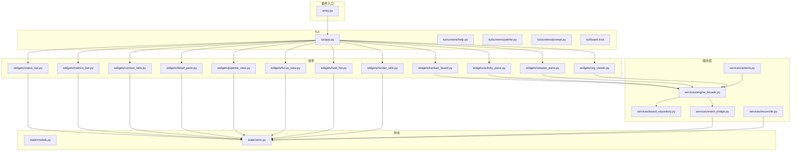
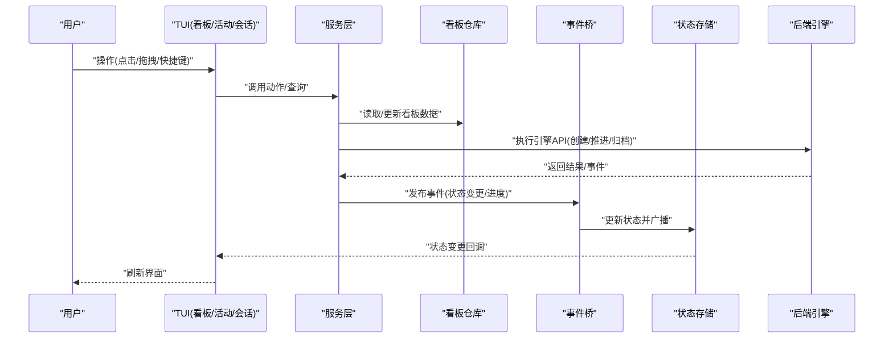
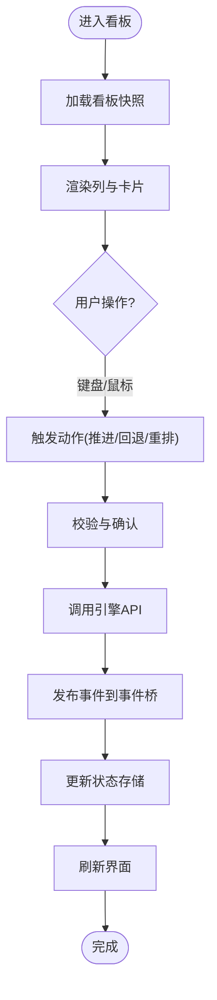
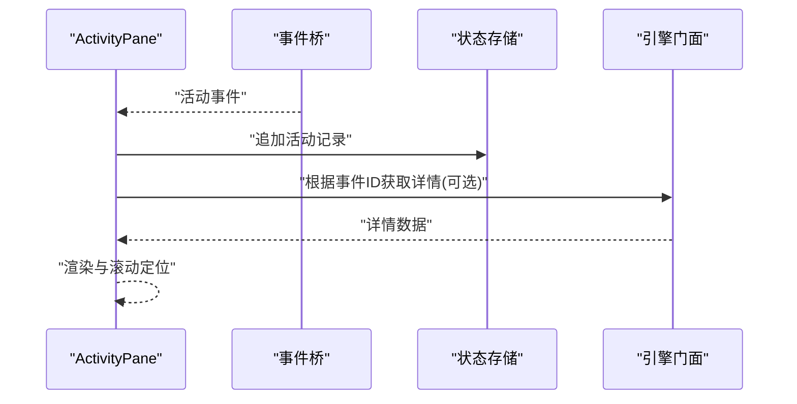
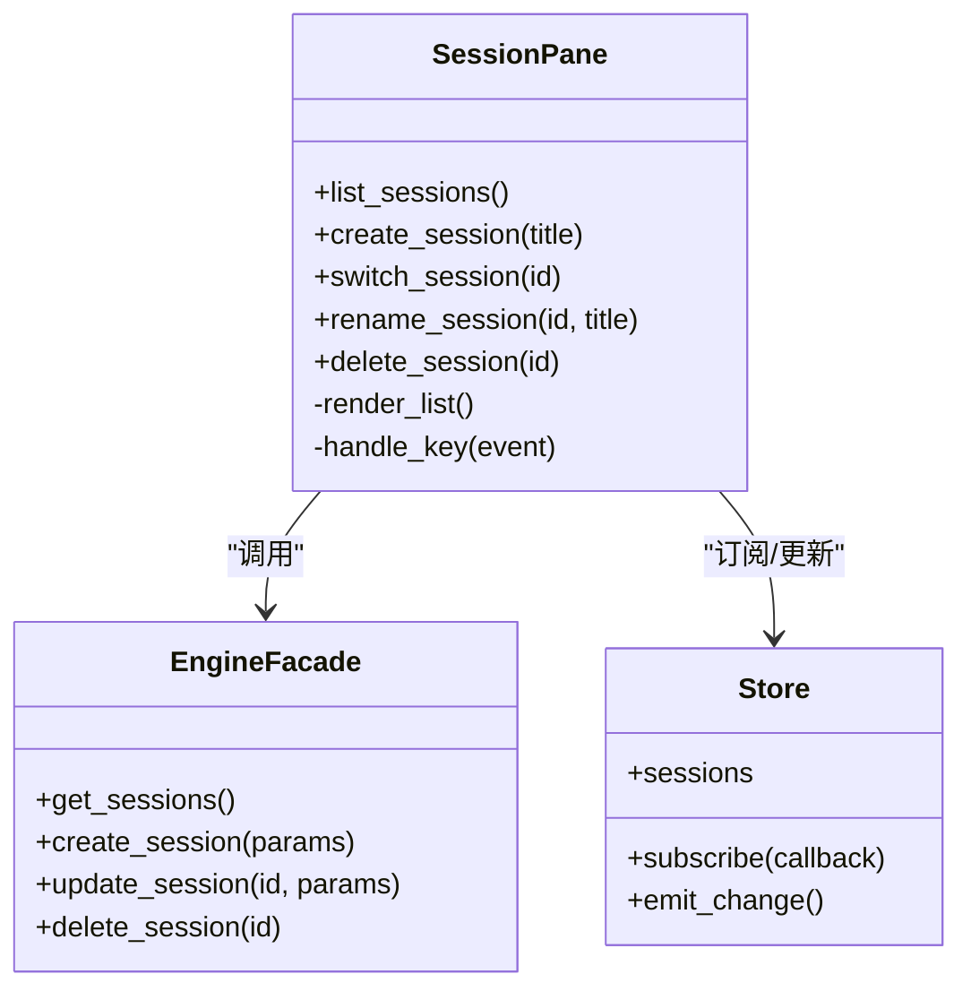
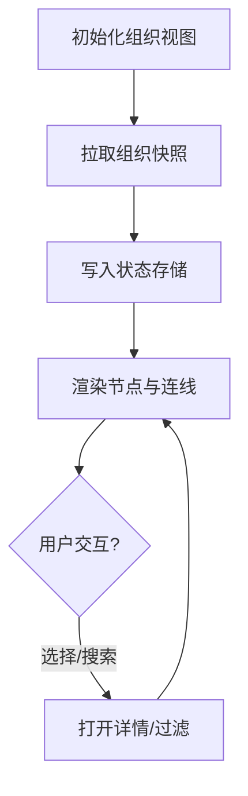
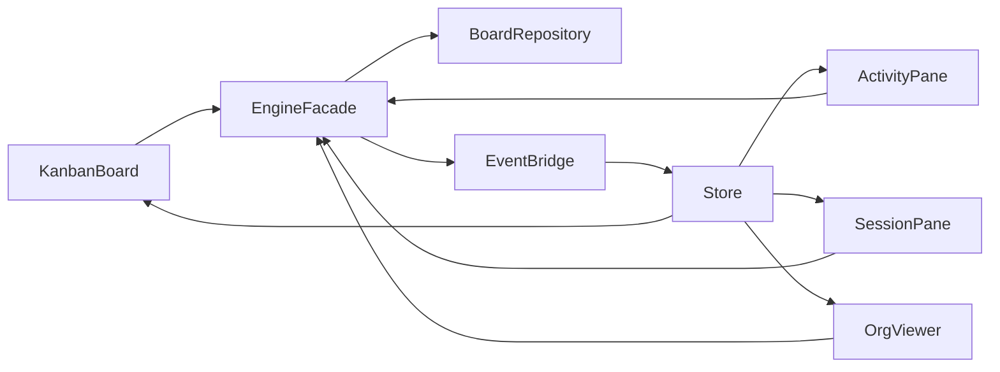

# CLI看板插件

<cite>
**本文引用的文件**   
- [entry.py](file://opc/plugins/cli_board/entry.py)
- [app.py](file://opc/plugins/cli_board/tui/app.py)
- [board.tcss](file://opc/plugins/cli_board/tui/board.tcss)
- [kanban_board.py](file://opc/plugins/cli_board/widgets/kanban_board.py)
- [activity_pane.py](file://opc/plugins/cli_board/widgets/activity_pane.py)
- [session_pane.py](file://opc/plugins/cli_board/widgets/session_pane.py)
- [org_viewer.py](file://opc/plugins/cli_board/widgets/org_viewer.py)
- [status_bar.py](file://opc/plugins/cli_board/widgets/status_bar.py)
- [metrics_bar.py](file://opc/plugins/cli_board/widgets/metrics_bar.py)
- [context_tabs.py](file://opc/plugins/cli_board/widgets/context_tabs.py)
- [detail_pane.py](file://opc/plugins/cli_board/widgets/detail_pane.py)
- [pipeline_view.py](file://opc/plugins/cli_board/widgets/pipeline_view.py)
- [focus_view.py](file://opc/plugins/cli_board/widgets/focus_view.py)
- [task_list.py](file://opc/plugins/cli_board/widgets/task_list.py)
- [render_utils.py](file://opc/plugins/cli_board/widgets/render_utils.py)
- [engine_facade.py](file://opc/plugins/cli_board/services/engine_facade.py)
- [board_repository.py](file://opc/plugins/cli_board/services/board_repository.py)
- [event_bridge.py](file://opc/plugins/cli_board/services/event_bridge.py)
- [actions.py](file://opc/plugins/cli_board/services/actions.py)
- [reconcile.py](file://opc/plugins/cli_board/services/reconcile.py)
- [models.py](file://opc/plugins/cli_board/state/models.py)
- [store.py](file://opc/plugins/cli_board/state/store.py)
- [help.py](file://opc/plugins/cli_board/tui/screens/help.py)
- [palette.py](file://opc/plugins/cli_board/tui/screens/palette.py)
- [prompt.py](file://opc/plugins/cli_board/tui/screens/prompt.py)
</cite>

## 目录
1. [简介](#简介)
2. [项目结构](#项目结构)
3. [核心组件](#核心组件)
4. [架构总览](#架构总览)
5. [详细组件分析](#详细组件分析)
6. [依赖关系分析](#依赖关系分析)
7. [性能考虑](#性能考虑)
8. [故障排除指南](#故障排除指南)
9. [结论](#结论)
10. [附录](#附录)

## 简介
本插件为基于 Textual 的终端看板应用，提供任务看板、活动面板、会话管理与组织视图等能力。通过服务层与后端引擎集成，实现状态管理与实时数据同步；同时提供键盘快捷键与主题定制，便于在终端环境中高效协作与监控。

## 项目结构
CLI看板插件位于 opc/plugins/cli_board 下，采用分层组织：
- tui：Textual 应用与屏幕、样式
- widgets：UI 组件（看板、活动、会话、组织等）
- services：服务层（引擎门面、看板仓库、事件桥、动作编排、一致性协调）
- state：状态模型与持久化存储
- entry：插件入口与启动逻辑

图表来源
- [entry.py:1-200](file://opc/plugins/cli_board/entry.py#L1-L200)
- [app.py:1-200](file://opc/plugins/cli_board/tui/app.py#L1-L200)
- [board.tcss:1-200](file://opc/plugins/cli_board/tui/board.tcss#L1-L200)
- [kanban_board.py:1-200](file://opc/plugins/cli_board/widgets/kanban_board.py#L1-L200)
- [activity_pane.py:1-200](file://opc/plugins/cli_board/widgets/activity_pane.py#L1-L200)
- [session_pane.py:1-200](file://opc/plugins/cli_board/widgets/session_pane.py#L1-L200)
- [org_viewer.py:1-200](file://opc/plugins/cli_board/widgets/org_viewer.py#L1-L200)
- [status_bar.py:1-200](file://opc/plugins/cli_board/widgets/status_bar.py#L1-L200)
- [metrics_bar.py:1-200](file://opc/plugins/cli_board/widgets/metrics_bar.py#L1-L200)
- [context_tabs.py:1-200](file://opc/plugins/cli_board/widgets/context_tabs.py#L1-L200)
- [detail_pane.py:1-200](file://opc/plugins/cli_board/widgets/detail_pane.py#L1-L200)
- [pipeline_view.py:1-200](file://opc/plugins/cli_board/widgets/pipeline_view.py#L1-L200)
- [focus_view.py:1-200](file://opc/plugins/cli_board/widgets/focus_view.py#L1-L200)
- [task_list.py:1-200](file://opc/plugins/cli_board/widgets/task_list.py#L1-L200)
- [render_utils.py:1-200](file://opc/plugins/cli_board/widgets/render_utils.py#L1-L200)
- [engine_facade.py:1-200](file://opc/plugins/cli_board/services/engine_facade.py#L1-L200)
- [board_repository.py:1-200](file://opc/plugins/cli_board/services/board_repository.py#L1-L200)
- [event_bridge.py:1-200](file://opc/plugins/cli_board/services/event_bridge.py#L1-L200)
- [actions.py:1-200](file://opc/plugins/cli_board/services/actions.py#L1-L200)
- [reconcile.py:1-200](file://opc/plugins/cli_board/services/reconcile.py#L1-L200)
- [models.py:1-200](file://opc/plugins/cli_board/state/models.py#L1-L200)
- [store.py:1-200](file://opc/plugins/cli_board/state/store.py#L1-L200)

章节来源
- [entry.py:1-200](file://opc/plugins/cli_board/entry.py#L1-L200)
- [app.py:1-200](file://opc/plugins/cli_board/tui/app.py#L1-L200)
- [board.tcss:1-200](file://opc/plugins/cli_board/tui/board.tcss#L1-L200)

## 核心组件
- KanbanBoard：展示列与卡片，支持拖拽或键盘操作进行状态流转，渲染进度与标签。
- ActivityPane：聚合并滚动显示系统活动日志与通知，支持过滤与跳转。
- SessionPane：会话列表与上下文切换，支持创建、重命名、删除与会话详情联动。
- OrgViewer：组织视图，展示角色、人员与职责关系，支持筛选与导航。
- StatusBar/MetricsBar：底部状态与指标展示，反映当前会话、任务计数、资源使用等。
- ContextTabs/DetailPane/PipelineView/FocusView/TaskList：辅助视图，用于上下文切换、详情查看、流水线可视化、聚焦模式与任务清单。

章节来源
- [kanban_board.py:1-200](file://opc/plugins/cli_board/widgets/kanban_board.py#L1-L200)
- [activity_pane.py:1-200](file://opc/plugins/cli_board/widgets/activity_pane.py#L1-L200)
- [session_pane.py:1-200](file://opc/plugins/cli_board/widgets/session_pane.py#L1-L200)
- [org_viewer.py:1-200](file://opc/plugins/cli_board/widgets/org_viewer.py#L1-L200)
- [status_bar.py:1-200](file://opc/plugins/cli_board/widgets/status_bar.py#L1-L200)
- [metrics_bar.py:1-200](file://opc/plugins/cli_board/widgets/metrics_bar.py#L1-L200)
- [context_tabs.py:1-200](file://opc/plugins/cli_board/widgets/context_tabs.py#L1-L200)
- [detail_pane.py:1-200](file://opc/plugins/cli_board/widgets/detail_pane.py#L1-L200)
- [pipeline_view.py:1-200](file://opc/plugins/cli_board/widgets/pipeline_view.py#L1-L200)
- [focus_view.py:1-200](file://opc/plugins/cli_board/widgets/focus_view.py#L1-L200)
- [task_list.py:1-200](file://opc/plugins/cli_board/widgets/task_list.py#L1-L200)

## 架构总览
整体采用“TUI + 服务层 + 状态”的分层设计：
- TUI 层：Textual 应用与各 UI 组件负责交互与渲染。
- 服务层：EngineFacade 统一封装对后端引擎的调用；BoardRepository 负责看板数据的读写；EventBridge 订阅/发布事件以驱动实时同步；Actions 编排复杂业务动作；Reconcile 保证本地状态与远端一致。
- 状态层：Models 定义数据结构；Store 维护运行时状态并提供变更通知。

图表来源
- [app.py:1-200](file://opc/plugins/cli_board/tui/app.py#L1-L200)
- [kanban_board.py:1-200](file://opc/plugins/cli_board/widgets/kanban_board.py#L1-L200)
- [activity_pane.py:1-200](file://opc/plugins/cli_board/widgets/activity_pane.py#L1-L200)
- [session_pane.py:1-200](file://opc/plugins/cli_board/widgets/session_pane.py#L1-L200)
- [engine_facade.py:1-200](file://opc/plugins/cli_board/services/engine_facade.py#L1-L200)
- [board_repository.py:1-200](file://opc/plugins/cli_board/services/board_repository.py#L1-L200)
- [event_bridge.py:1-200](file://opc/plugins/cli_board/services/event_bridge.py#L1-L200)
- [store.py:1-200](file://opc/plugins/cli_board/state/store.py#L1-L200)

## 详细组件分析

### KanbanBoard 组件
- 功能：按列展示任务卡片，支持键盘导航、选择、推进/回退状态、批量操作。
- 交互：方向键移动焦点，回车确认，空格快速切换，Ctrl+数字快速定位列。
- 渲染：结合 render_utils 与 metrics_bar 展示进度与统计。
- 数据流：从 Store 订阅看板快照，经 EngineFacade 调用后端推进任务。

图表来源
- [kanban_board.py:1-200](file://opc/plugins/cli_board/widgets/kanban_board.py#L1-L200)
- [render_utils.py:1-200](file://opc/plugins/cli_board/widgets/render_utils.py#L1-L200)
- [metrics_bar.py:1-200](file://opc/plugins/cli_board/widgets/metrics_bar.py#L1-L200)
- [engine_facade.py:1-200](file://opc/plugins/cli_board/services/engine_facade.py#L1-L200)
- [event_bridge.py:1-200](file://opc/plugins/cli_board/services/event_bridge.py#L1-L200)
- [store.py:1-200](file://opc/plugins/cli_board/state/store.py#L1-L200)

章节来源
- [kanban_board.py:1-200](file://opc/plugins/cli_board/widgets/kanban_board.py#L1-L200)
- [render_utils.py:1-200](file://opc/plugins/cli_board/widgets/render_utils.py#L1-L200)
- [metrics_bar.py:1-200](file://opc/plugins/cli_board/widgets/metrics_bar.py#L1-L200)

### ActivityPane 组件
- 功能：聚合活动日志，支持时间线滚动、关键字过滤、跳转到相关任务。
- 交互：上下滚动浏览，Enter 打开详情，F 过滤，R 刷新。
- 数据源：事件桥推送的活动事件，写入状态存储后由组件订阅渲染。

图表来源
- [activity_pane.py:1-200](file://opc/plugins/cli_board/widgets/activity_pane.py#L1-L200)
- [event_bridge.py:1-200](file://opc/plugins/cli_board/services/event_bridge.py#L1-L200)
- [store.py:1-200](file://opc/plugins/cli_board/state/store.py#L1-L200)
- [engine_facade.py:1-200](file://opc/plugins/cli_board/services/engine_facade.py#L1-L200)

章节来源
- [activity_pane.py:1-200](file://opc/plugins/cli_board/widgets/activity_pane.py#L1-L200)

### SessionPane 组件
- 功能：会话列表管理，支持新建、切换、重命名、删除；与看板/活动联动。
- 交互：Tab 切换会话，N 新建，D 删除，R 重命名，Esc 退出编辑。
- 数据流：通过 EngineFacade 与后端同步会话元数据，状态变更后刷新列表。

图表来源
- [session_pane.py:1-200](file://opc/plugins/cli_board/widgets/session_pane.py#L1-L200)
- [engine_facade.py:1-200](file://opc/plugins/cli_board/services/engine_facade.py#L1-L200)
- [store.py:1-200](file://opc/plugins/cli_board/state/store.py#L1-L200)

章节来源
- [session_pane.py:1-200](file://opc/plugins/cli_board/widgets/session_pane.py#L1-L200)

### OrgViewer 组件
- 功能：组织视图，展示角色、人员、职责与关系图，支持筛选与节点展开。
- 交互：方向键移动焦点，Enter 查看详情，/ 搜索，? 帮助。
- 数据源：从引擎拉取组织快照，缓存于状态存储，组件按需渲染。

图表来源
- [org_viewer.py:1-200](file://opc/plugins/cli_board/widgets/org_viewer.py#L1-L200)
- [engine_facade.py:1-200](file://opc/plugins/cli_board/services/engine_facade.py#L1-L200)
- [store.py:1-200](file://opc/plugins/cli_board/state/store.py#L1-L200)

章节来源
- [org_viewer.py:1-200](file://opc/plugins/cli_board/widgets/org_viewer.py#L1-L200)

### 辅助组件
- StatusBar/MetricsBar：显示当前会话、任务计数、运行中任务数、错误计数等指标。
- ContextTabs/DetailPane：上下文标签页与任务详情面板，支持富文本与附件预览。
- PipelineView/FocusView/TaskList：流水线视图、聚焦模式与任务清单，提升多任务处理效率。

章节来源
- [status_bar.py:1-200](file://opc/plugins/cli_board/widgets/status_bar.py#L1-L200)
- [metrics_bar.py:1-200](file://opc/plugins/cli_board/widgets/metrics_bar.py#L1-L200)
- [context_tabs.py:1-200](file://opc/plugins/cli_board/widgets/context_tabs.py#L1-L200)
- [detail_pane.py:1-200](file://opc/plugins/cli_board/widgets/detail_pane.py#L1-L200)
- [pipeline_view.py:1-200](file://opc/plugins/cli_board/widgets/pipeline_view.py#L1-L200)
- [focus_view.py:1-200](file://opc/plugins/cli_board/widgets/focus_view.py#L1-L200)
- [task_list.py:1-200](file://opc/plugins/cli_board/widgets/task_list.py#L1-L200)

## 依赖关系分析
- 组件耦合：各 UI 组件通过服务层访问数据与执行动作，避免直接耦合后端。
- 事件驱动：EventBridge 将后端事件转换为内部事件，驱动 Store 更新与 UI 刷新。
- 状态集中：Store 作为单一事实源，所有组件订阅其变更，确保一致性。

图表来源
- [kanban_board.py:1-200](file://opc/plugins/cli_board/widgets/kanban_board.py#L1-L200)
- [activity_pane.py:1-200](file://opc/plugins/cli_board/widgets/activity_pane.py#L1-L200)
- [session_pane.py:1-200](file://opc/plugins/cli_board/widgets/session_pane.py#L1-L200)
- [org_viewer.py:1-200](file://opc/plugins/cli_board/widgets/org_viewer.py#L1-L200)
- [engine_facade.py:1-200](file://opc/plugins/cli_board/services/engine_facade.py#L1-L200)
- [board_repository.py:1-200](file://opc/plugins/cli_board/services/board_repository.py#L1-L200)
- [event_bridge.py:1-200](file://opc/plugins/cli_board/services/event_bridge.py#L1-L200)
- [store.py:1-200](file://opc/plugins/cli_board/state/store.py#L1-L200)

章节来源
- [engine_facade.py:1-200](file://opc/plugins/cli_board/services/engine_facade.py#L1-L200)
- [board_repository.py:1-200](file://opc/plugins/cli_board/services/board_repository.py#L1-L200)
- [event_bridge.py:1-200](file://opc/plugins/cli_board/services/event_bridge.py#L1-L200)
- [store.py:1-200](file://opc/plugins/cli_board/state/store.py#L1-L200)

## 性能考虑
- 增量渲染：仅在状态变更时局部刷新，避免全量重绘。
- 事件批处理：合并高频事件，减少 UI 抖动。
- 懒加载：大列表与详情按需加载，降低内存占用。
- 缓存策略：组织快照与会话列表设置合理过期时间，减少重复请求。

[本节为通用指导，不直接分析具体文件]

## 故障排除指南
- 连接问题：检查后端引擎可达性与认证配置；查看活动面板中的错误日志。
- 状态不一致：启用 Reconcile 自动修复；手动触发一次全量同步。
- 渲染卡顿：关闭不必要的细节视图；减少活动日志级别；调整主题复杂度。
- 快捷键冲突：自定义按键绑定或在帮助屏查看当前映射。

章节来源
- [activity_pane.py:1-200](file://opc/plugins/cli_board/widgets/activity_pane.py#L1-L200)
- [reconcile.py:1-200](file://opc/plugins/cli_board/services/reconcile.py#L1-L200)
- [help.py:1-200](file://opc/plugins/cli_board/tui/screens/help.py#L1-L200)

## 结论
CLI看板插件通过清晰的层次结构与事件驱动机制，实现了终端环境下高效的看板管理与协作体验。借助服务层抽象与状态集中管理，既保证了可扩展性，也提升了稳定性与可维护性。

[本节为总结，不直接分析具体文件]

## 附录

### 键盘快捷键参考
- 全局
  - ?：打开帮助屏
  - Esc：退出当前编辑/弹窗
- 看板
  - 方向键：移动焦点
  - Enter：确认/打开详情
  - 空格：快速切换状态
  - Ctrl+数字：快速定位列
- 活动
  - 上下：滚动日志
  - F：过滤关键字
  - R：刷新
- 会话
  - Tab：切换会话
  - N：新建
  - D：删除
  - R：重命名
- 组织
  - /：搜索
  - Enter：打开详情

章节来源
- [help.py:1-200](file://opc/plugins/cli_board/tui/screens/help.py#L1-L200)
- [kanban_board.py:1-200](file://opc/plugins/cli_board/widgets/kanban_board.py#L1-L200)
- [activity_pane.py:1-200](file://opc/plugins/cli_board/widgets/activity_pane.py#L1-L200)
- [session_pane.py:1-200](file://opc/plugins/cli_board/widgets/session_pane.py#L1-L200)
- [org_viewer.py:1-200](file://opc/plugins/cli_board/widgets/org_viewer.py#L1-L200)

### 主题与配色
- 样式文件：board.tcss 提供默认主题，可按需覆盖颜色、字体与布局。
- 调色板：palette 屏幕提供交互式主题预览与切换。
- 建议：保持高对比度以提升可读性；避免过多动画与渐变。

章节来源
- [board.tcss:1-200](file://opc/plugins/cli_board/tui/board.tcss#L1-L200)
- [palette.py:1-200](file://opc/plugins/cli_board/tui/screens/palette.py#L1-L200)

### 与后端引擎集成
- 引擎门面：EngineFacade 统一封装 API 调用，包括会话、任务、组织等。
- 看板仓库：BoardRepository 负责看板数据的增删改查与事务边界。
- 事件桥：EventBridge 订阅后端事件，转换为内部事件驱动 UI 更新。
- 动作编排：Actions 组合多个服务调用，提供原子性业务操作。
- 一致性协调：Reconcile 定期比对本地与远端状态，修复漂移。

章节来源
- [engine_facade.py:1-200](file://opc/plugins/cli_board/services/engine_facade.py#L1-L200)
- [board_repository.py:1-200](file://opc/plugins/cli_board/services/board_repository.py#L1-L200)
- [event_bridge.py:1-200](file://opc/plugins/cli_board/services/event_bridge.py#L1-L200)
- [actions.py:1-200](file://opc/plugins/cli_board/services/actions.py#L1-L200)
- [reconcile.py:1-200](file://opc/plugins/cli_board/services/reconcile.py#L1-L200)

### 状态管理与实时同步
- 模型：Models 定义会话、任务、组织等数据结构。
- 存储：Store 维护运行时状态，提供订阅与变更广播。
- 同步流程：后端事件 -> 事件桥 -> 状态存储 -> UI 刷新。

章节来源
- [models.py:1-200](file://opc/plugins/cli_board/state/models.py#L1-L200)
- [store.py:1-200](file://opc/plugins/cli_board/state/store.py#L1-L200)
- [event_bridge.py:1-200](file://opc/plugins/cli_board/services/event_bridge.py#L1-L200)

### 调试技巧
- 开启详细日志：在活动面板查看关键路径与异常堆栈。
- 断点与打印：在服务层关键方法处添加诊断输出。
- 最小复现：隔离问题组件，逐步缩小范围。
- 回放事件：导出事件序列，本地重放定位时序问题。

章节来源
- [activity_pane.py:1-200](file://opc/plugins/cli_board/widgets/activity_pane.py#L1-L200)
- [engine_facade.py:1-200](file://opc/plugins/cli_board/services/engine_facade.py#L1-L200)
- [event_bridge.py:1-200](file://opc/plugins/cli_board/services/event_bridge.py#L1-L200)