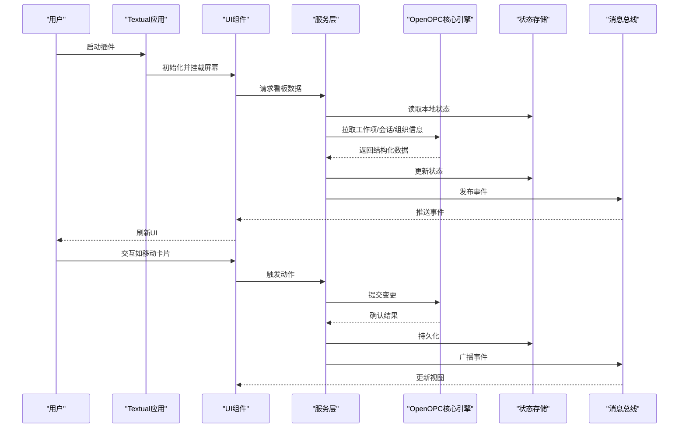
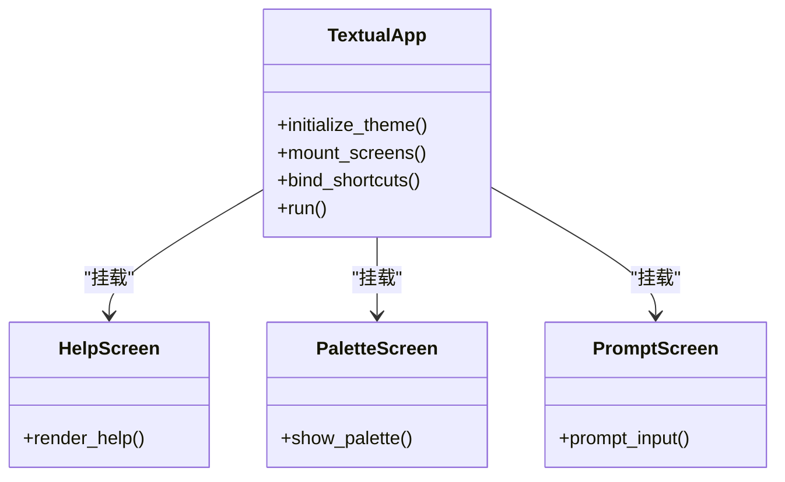
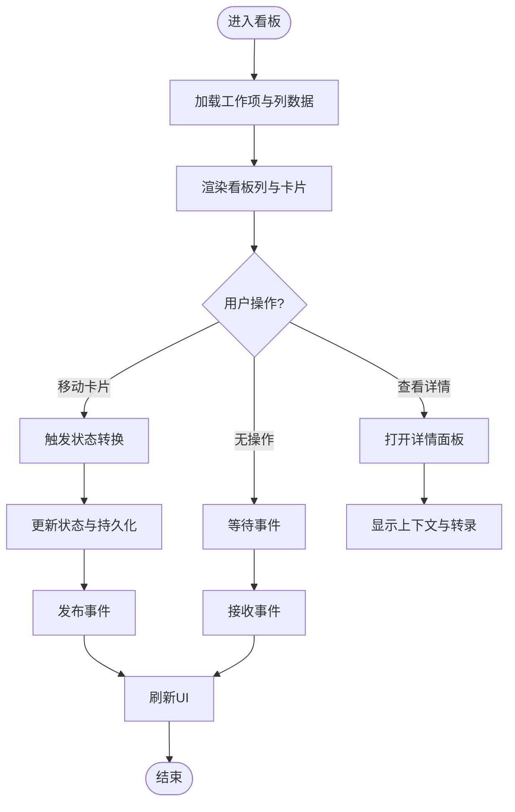
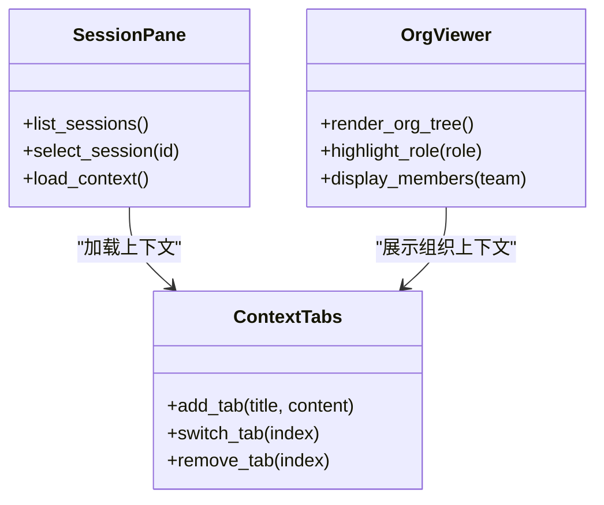
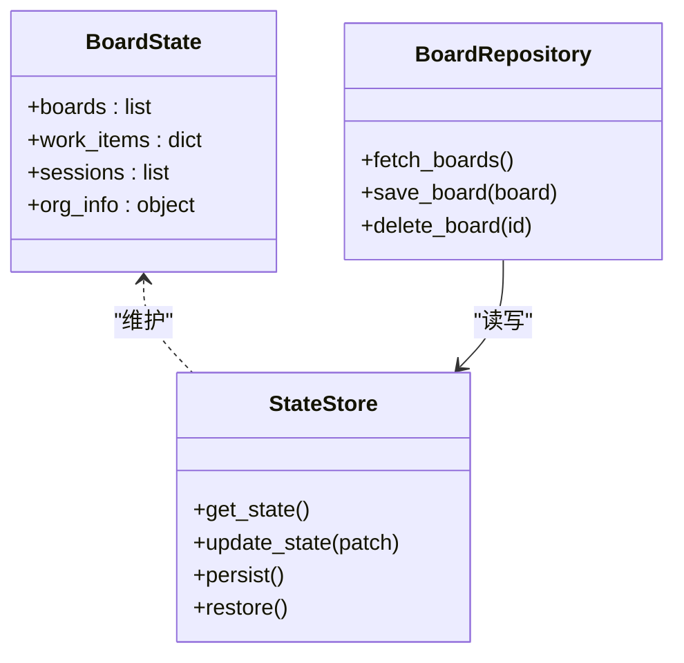
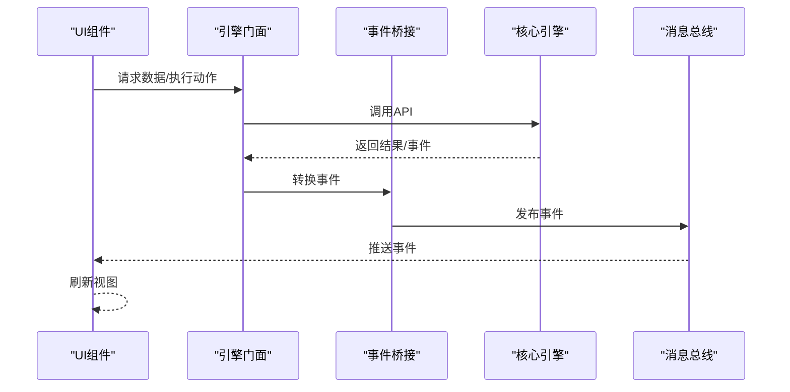
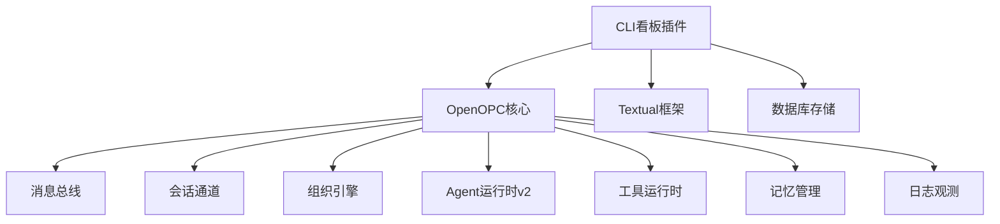

# CLI看板概述

<cite>
**本文引用的文件**   
- [opc/plugins/cli_board/entry.py](file://opc/plugins/cli_board/entry.py)
- [opc/plugins/cli_board/tui/app.py](file://opc/plugins/cli_board/tui/app.py)
- [opc/plugins/cli_board/services/engine_facade.py](file://opc/plugins/cli_board/services/engine_facade.py)
- [opc/plugins/cli_board/services/event_bridge.py](file://opc/plugins/cli_board/services/event_bridge.py)
- [opc/plugins/cli_board/services/board_repository.py](file://opc/plugins/cli_board/services/board_repository.py)
- [opc/plugins/cli_board/services/actions.py](file://opc/plugins/cli_board/services/actions.py)
- [opc/plugins/cli_board/state/store.py](file://opc/plugins/cli_board/state/store.py)
- [opc/plugins/cli_board/state/models.py](file://opc/plugins/cli_board/state/models.py)
- [opc/plugins/cli_board/widgets/kanban_board.py](file://opc/plugins/cli_board/widgets/kanban_board.py)
- [opc/plugins/cli_board/widgets/activity_pane.py](file://opc/plugins/cli_board/widgets/activity_pane.py)
- [opc/plugins/cli_board/widgets/session_pane.py](file://opc/plugins/cli_board/widgets/session_pane.py)
- [opc/plugins/cli_board/widgets/org_viewer.py](file://opc/plugins/cli_board/widgets/org_viewer.py)
- [opc/plugins/cli_board/widgets/status_bar.py](file://opc/plugins/cli_board/widgets/status_bar.py)
- [opc/plugins/cli_board/widgets/metrics_bar.py](file://opc/plugins/cli_board/widgets/metrics_bar.py)
- [opc/plugins/cli_board/widgets/context_tabs.py](file://opc/plugins/cli_board/widgets/context_tabs.py)
- [opc/plugins/cli_board/widgets/detail_pane.py](file://opc/plugins/cli_board/widgets/detail_pane.py)
- [opc/plugins/cli_board/widgets/pipeline_view.py](file://opc/plugins/cli_board/widgets/pipeline_view.py)
- [opc/plugins/cli_board/widgets/focus_view.py](file://opc/plugins/cli_board/widgets/focus_view.py)
- [opc/plugins/cli_board/widgets/render_utils.py](file://opc/plugins/cli_board/widgets/render_utils.py)
- [opc/plugins/cli_board/tui/screens/help.py](file://opc/plugins/cli_board/tui/screens/help.py)
- [opc/plugins/cli_board/tui/screens/palette.py](file://opc/plugins/cli_board/tui/screens/palette.py)
- [opc/plugins/cli_board/tui/screens/prompt.py](file://opc/plugins/cli_board/tui/screens/prompt.py)
- [opc/plugins/cli_board/tui/board.tcss](file://opc/plugins/cli_board/tui/board.tcss)
- [opc/plugins/cli_board/README.md](file://opc/plugins/cli_board/README.md)
- [opc/core/config.py](file://opc/core/config.py)
- [opc/core/events.py](file://opc/core/events.py)
- [opc/core/models.py](file://opc/core/models.py)
- [opc/core/active_task_runs.py](file://opc/core/active_task_runs.py)
- [opc/core/company_runtime.py](file://opc/core/company_runtime.py)
- [opc/core/work_item_runtime.py](file://opc/core/work_item_runtime.py)
- [opc/core/work_item_transition.py](file://opc/core/work_item_transition.py)
- [opc/core/work_item_context_view.py](file://opc/core/work_item_context_view.py)
- [opc/core/transcript_visibility.py](file://opc/core/transcript_visibility.py)
- [opc/core/worker_envelope.py](file://opc/core/worker_envelope.py)
- [opc/channels/session.py](file://opc/channels/session.py)
- [opc/database/store.py](file://opc/database/store.py)
- [opc/layer0_interaction/message_bus.py](file://opc/layer0_interaction/message_bus.py)
- [opc/layer1_perception/task_router.py](file://opc/layer1_perception/task_router.py)
- [opc/layer2_organization/org_engine.py](file://opc/layer2_organization/org_engine.py)
- [opc/layer3_agent/runtime_v2/runtime.py](file://opc/layer3_agent/runtime_v2/runtime.py)
- [opc/layer4_tools/agent_runtime.py](file://opc/layer4_tools/agent_runtime.py)
- [opc/layer5_memory/memory_manager.py](file://opc/layer5_memory/memory_manager.py)
- [opc/layer6_observability/opc_logger.py](file://opc/layer6_observability/opc_logger.py)
- [pyproject.toml](file://pyproject.toml)
</cite>

## 目录
1. [简介](#简介)
2. [项目结构](#项目结构)
3. [核心组件](#核心组件)
4. [架构总览](#架构总览)
5. [详细组件分析](#详细组件分析)
6. [依赖关系分析](#依赖关系分析)
7. [性能考量](#性能考量)
8. [故障排查指南](#故障排查指南)
9. [结论](#结论)
10. [附录](#附录)

## 简介
本文件为CLI看板插件的全面概述文档，聚焦于基于Textual框架的终端用户界面设计与整体架构。该插件提供任务看板管理、实时活动监控、会话管理与组织视图展示等核心能力，并通过服务层与OpenOPC核心引擎进行集成与通信。文档同时涵盖插件生命周期与启动流程、快速开始指南、基础配置选项以及系统要求与依赖项说明，帮助读者快速上手并深入理解其工作原理。

## 项目结构
CLI看板插件位于 opc/plugins/cli_board 目录下，采用分层组织：
- tui：Textual应用入口、主题样式与屏幕（帮助、调色板、提示）
- widgets：UI组件（看板、活动面板、会话面板、组织视图、状态栏、指标栏、上下文标签页、详情面板、流水线视图、焦点视图、渲染工具）
- services：业务服务（引擎门面、事件桥接、看板仓库、动作编排、数据对齐）
- state：状态模型与持久化存储
- entry：插件入口与注册点

```mermaid
graph TB
subgraph "CLI看板插件"
A["entry.py<br/>插件入口"] --> B["tui/app.py<br/>Textual应用"]
B --> C["widgets/*<br/>UI组件"]
B --> D["services/*<br/>服务层"]
D --> E["state/store.py<br/>状态存储"]
D --> F["state/models.py<br/>状态模型"]
D --> G["services/engine_facade.py<br/>引擎门面"]
D --> H["services/event_bridge.py<br/>事件桥接"]
D --> I["services/board_repository.py<br/>看板仓库"]
D --> J["services/actions.py<br/>动作编排"]
end
subgraph "OpenOPC核心"
K["core/config.py<br/>配置"]
L["core/events.py<br/>事件模型"]
M["core/models.py<br/>领域模型"]
N["core/active_task_runs.py<br/>活跃任务运行"]
O["core/company_runtime.py<br/>公司运行时"]
P["core/work_item_runtime.py<br/>工作项运行时"]
Q["core/work_item_transition.py<br/>工作项转换"]
R["core/work_item_context_view.py<br/>上下文视图"]
S["core/transcript_visibility.py<br/>转录可见性"]
T["core/worker_envelope.py<br/>工作者信封"]
U["channels/session.py<br/>会话通道"]
V["database/store.py<br/>数据库存储"]
W["layer0_interaction/message_bus.py<br/>消息总线"]
X["layer1_perception/task_router.py<br/>任务路由"]
Y["layer2_organization/org_engine.py<br/>组织引擎"]
Z["layer3_agent/runtime_v2/runtime.py<br/>Agent运行时v2"]
AA["layer4_tools/agent_runtime.py<br/>工具运行时"]
BB["layer5_memory/memory_manager.py<br/>记忆管理"]
CC["layer6_observability/opc_logger.py<br/>日志观测"]
end
G --> O
G --> P
G --> Q
G --> R
H --> L
H --> W
I --> V
J --> P
J --> Q
J --> R
J --> S
J --> T
J --> U
J --> Y
J --> Z
J --> AA
J --> BB
J --> CC
```

图表来源
- [opc/plugins/cli_board/entry.py](file://opc/plugins/cli_board/entry.py)
- [opc/plugins/cli_board/tui/app.py](file://opc/plugins/cli_board/tui/app.py)
- [opc/plugins/cli_board/services/engine_facade.py](file://opc/plugins/cli_board/services/engine_facade.py)
- [opc/plugins/cli_board/services/event_bridge.py](file://opc/plugins/cli_board/services/event_bridge.py)
- [opc/plugins/cli_board/services/board_repository.py](file://opc/plugins/cli_board/services/board_repository.py)
- [opc/plugins/cli_board/services/actions.py](file://opc/plugins/cli_board/services/actions.py)
- [opc/plugins/cli_board/state/store.py](file://opc/plugins/cli_board/state/store.py)
- [opc/plugins/cli_board/state/models.py](file://opc/plugins/cli_board/state/models.py)
- [opc/core/config.py](file://opc/core/config.py)
- [opc/core/events.py](file://opc/core/events.py)
- [opc/core/models.py](file://opc/core/models.py)
- [opc/core/active_task_runs.py](file://opc/core/active_task_runs.py)
- [opc/core/company_runtime.py](file://opc/core/company_runtime.py)
- [opc/core/work_item_runtime.py](file://opc/core/work_item_runtime.py)
- [opc/core/work_item_transition.py](file://opc/core/work_item_transition.py)
- [opc/core/work_item_context_view.py](file://opc/core/work_item_context_view.py)
- [opc/core/transcript_visibility.py](file://opc/core/transcript_visibility.py)
- [opc/core/worker_envelope.py](file://opc/core/worker_envelope.py)
- [opc/channels/session.py](file://opc/channels/session.py)
- [opc/database/store.py](file://opc/database/store.py)
- [opc/layer0_interaction/message_bus.py](file://opc/layer0_interaction/message_bus.py)
- [opc/layer1_perception/task_router.py](file://opc/layer1_perception/task_router.py)
- [opc/layer2_organization/org_engine.py](file://opc/layer2_organization/org_engine.py)
- [opc/layer3_agent/runtime_v2/runtime.py](file://opc/layer3_agent/runtime_v2/runtime.py)
- [opc/layer4_tools/agent_runtime.py](file://opc/layer4_tools/agent_runtime.py)
- [opc/layer5_memory/memory_manager.py](file://opc/layer5_memory/memory_manager.py)
- [opc/layer6_observability/opc_logger.py](file://opc/layer6_observability/opc_logger.py)

章节来源
- [opc/plugins/cli_board/entry.py](file://opc/plugins/cli_board/entry.py)
- [opc/plugins/cli_board/tui/app.py](file://opc/plugins/cli_board/tui/app.py)
- [opc/plugins/cli_board/services/engine_facade.py](file://opc/plugins/cli_board/services/engine_facade.py)
- [opc/plugins/cli_board/services/event_bridge.py](file://opc/plugins/cli_board/services/event_bridge.py)
- [opc/plugins/cli_board/services/board_repository.py](file://opc/plugins/cli_board/services/board_repository.py)
- [opc/plugins/cli_board/services/actions.py](file://opc/plugins/cli_board/services/actions.py)
- [opc/plugins/cli_board/state/store.py](file://opc/plugins/cli_board/state/store.py)
- [opc/plugins/cli_board/state/models.py](file://opc/plugins/cli_board/state/models.py)

## 核心组件
- Textual应用与屏幕
  - 应用主类负责初始化主题、布局与全局状态，挂载各屏幕（帮助、调色板、提示），并提供键盘导航与快捷键绑定。
  - 屏幕用于承载不同功能区域，支持切换与模态交互。
- UI组件
  - 看板组件：以列/卡片形式呈现工作项，支持拖拽或按键操作更新状态。
  - 活动面板：订阅事件流，滚动显示最新活动与进度。
  - 会话面板：列出当前会话，支持选择与上下文切换。
  - 组织视图：展示组织结构、角色与人员信息。
  - 状态栏与指标栏：显示连接状态、统计指标与关键KPI。
  - 上下文标签页与详情面板：提供工作项上下文与详细信息浏览。
  - 流水线视图与焦点视图：可视化执行阶段与聚焦特定工作项。
  - 渲染工具：统一文本渲染、颜色与格式化逻辑。
- 服务层
  - 引擎门面：封装对OpenOPC核心引擎的调用，屏蔽底层复杂性。
  - 事件桥接：将核心事件转换为UI可消费的事件格式，实现实时刷新。
  - 看板仓库：读写看板数据，对接持久化存储。
  - 动作编排：组合多个服务完成复杂操作（创建、移动、关闭工作项等）。
- 状态层
  - 状态模型：定义看板、工作项、会话、组织等数据结构。
  - 状态存储：维护内存状态，必要时持久化到数据库。

章节来源
- [opc/plugins/cli_board/tui/app.py](file://opc/plugins/cli_board/tui/app.py)
- [opc/plugins/cli_board/widgets/kanban_board.py](file://opc/plugins/cli_board/widgets/kanban_board.py)
- [opc/plugins/cli_board/widgets/activity_pane.py](file://opc/plugins/cli_board/widgets/activity_pane.py)
- [opc/plugins/cli_board/widgets/session_pane.py](file://opc/plugins/cli_board/widgets/session_pane.py)
- [opc/plugins/cli_board/widgets/org_viewer.py](file://opc/plugins/cli_board/widgets/org_viewer.py)
- [opc/plugins/cli_board/widgets/status_bar.py](file://opc/plugins/cli_board/widgets/status_bar.py)
- [opc/plugins/cli_board/widgets/metrics_bar.py](file://opc/plugins/cli_board/widgets/metrics_bar.py)
- [opc/plugins/cli_board/widgets/context_tabs.py](file://opc/plugins/cli_board/widgets/context_tabs.py)
- [opc/plugins/cli_board/widgets/detail_pane.py](file://opc/plugins/cli_board/widgets/detail_pane.py)
- [opc/plugins/cli_board/widgets/pipeline_view.py](file://opc/plugins/cli_board/widgets/pipeline_view.py)
- [opc/plugins/cli_board/widgets/focus_view.py](file://opc/plugins/cli_board/widgets/focus_view.py)
- [opc/plugins/cli_board/widgets/render_utils.py](file://opc/plugins/cli_board/widgets/render_utils.py)
- [opc/plugins/cli_board/services/engine_facade.py](file://opc/plugins/cli_board/services/engine_facade.py)
- [opc/plugins/cli_board/services/event_bridge.py](file://opc/plugins/cli_board/services/event_bridge.py)
- [opc/plugins/cli_board/services/board_repository.py](file://opc/plugins/cli_board/services/board_repository.py)
- [opc/plugins/cli_board/services/actions.py](file://opc/plugins/cli_board/services/actions.py)
- [opc/plugins/cli_board/state/models.py](file://opc/plugins/cli_board/state/models.py)
- [opc/plugins/cli_board/state/store.py](file://opc/plugins/cli_board/state/store.py)

## 架构总览
CLI看板插件通过“应用-组件-服务-核心”的分层架构与OpenOPC核心引擎集成。Textual应用驱动UI渲染，组件响应交互；服务层协调业务逻辑并与核心引擎通信；事件桥接确保UI实时同步；状态层保证数据一致性与持久化。

图表来源
- [opc/plugins/cli_board/tui/app.py](file://opc/plugins/cli_board/tui/app.py)
- [opc/plugins/cli_board/services/engine_facade.py](file://opc/plugins/cli_board/services/engine_facade.py)
- [opc/plugins/cli_board/services/event_bridge.py](file://opc/plugins/cli_board/services/event_bridge.py)
- [opc/plugins/cli_board/services/board_repository.py](file://opc/plugins/cli_board/services/board_repository.py)
- [opc/plugins/cli_board/state/store.py](file://opc/plugins/cli_board/state/store.py)
- [opc/layer0_interaction/message_bus.py](file://opc/layer0_interaction/message_bus.py)

## 详细组件分析

### 应用与屏幕（Textual）
- 应用主类负责主题加载、布局构建、全局状态注入与屏幕注册。
- 屏幕包括帮助、调色板与提示，分别用于展示使用说明、主题预览与交互式输入。
- 键盘导航与快捷键绑定提升终端使用效率。

图表来源
- [opc/plugins/cli_board/tui/app.py](file://opc/plugins/cli_board/tui/app.py)
- [opc/plugins/cli_board/tui/screens/help.py](file://opc/plugins/cli_board/tui/screens/help.py)
- [opc/plugins/cli_board/tui/screens/palette.py](file://opc/plugins/cli_board/tui/screens/palette.py)
- [opc/plugins/cli_board/tui/screens/prompt.py](file://opc/plugins/cli_board/tui/screens/prompt.py)

章节来源
- [opc/plugins/cli_board/tui/app.py](file://opc/plugins/cli_board/tui/app.py)
- [opc/plugins/cli_board/tui/screens/help.py](file://opc/plugins/cli_board/tui/screens/help.py)
- [opc/plugins/cli_board/tui/screens/palette.py](file://opc/plugins/cli_board/tui/screens/palette.py)
- [opc/plugins/cli_board/tui/screens/prompt.py](file://opc/plugins/cli_board/tui/screens/prompt.py)

### 看板与活动监控
- 看板组件以列/卡片展示工作项，支持状态流转与批量操作。
- 活动面板订阅事件流，按时间顺序显示活动条目，支持过滤与搜索。
- 渲染工具统一文本与颜色输出，确保跨平台一致性。

图表来源
- [opc/plugins/cli_board/widgets/kanban_board.py](file://opc/plugins/cli_board/widgets/kanban_board.py)
- [opc/plugins/cli_board/widgets/activity_pane.py](file://opc/plugins/cli_board/widgets/activity_pane.py)
- [opc/plugins/cli_board/widgets/render_utils.py](file://opc/plugins/cli_board/widgets/render_utils.py)
- [opc/plugins/cli_board/services/actions.py](file://opc/plugins/cli_board/services/actions.py)
- [opc/plugins/cli_board/services/event_bridge.py](file://opc/plugins/cli_board/services/event_bridge.py)

章节来源
- [opc/plugins/cli_board/widgets/kanban_board.py](file://opc/plugins/cli_board/widgets/kanban_board.py)
- [opc/plugins/cli_board/widgets/activity_pane.py](file://opc/plugins/cli_board/widgets/activity_pane.py)
- [opc/plugins/cli_board/widgets/render_utils.py](file://opc/plugins/cli_board/widgets/render_utils.py)
- [opc/plugins/cli_board/services/actions.py](file://opc/plugins/cli_board/services/actions.py)
- [opc/plugins/cli_board/services/event_bridge.py](file://opc/plugins/cli_board/services/event_bridge.py)

### 会话管理与组织视图
- 会话面板列出当前会话，支持选择、切换与上下文加载。
- 组织视图展示组织结构、角色与人员信息，便于协作与资源分配。
- 上下文标签页与工作项上下文视图联动，提供丰富的上下文信息。

图表来源
- [opc/plugins/cli_board/widgets/session_pane.py](file://opc/plugins/cli_board/widgets/session_pane.py)
- [opc/plugins/cli_board/widgets/org_viewer.py](file://opc/plugins/cli_board/widgets/org_viewer.py)
- [opc/plugins/cli_board/widgets/context_tabs.py](file://opc/plugins/cli_board/widgets/context_tabs.py)
- [opc/core/work_item_context_view.py](file://opc/core/work_item_context_view.py)

章节来源
- [opc/plugins/cli_board/widgets/session_pane.py](file://opc/plugins/cli_board/widgets/session_pane.py)
- [opc/plugins/cli_board/widgets/org_viewer.py](file://opc/plugins/cli_board/widgets/org_viewer.py)
- [opc/plugins/cli_board/widgets/context_tabs.py](file://opc/plugins/cli_board/widgets/context_tabs.py)
- [opc/core/work_item_context_view.py](file://opc/core/work_item_context_view.py)

### 状态与持久化
- 状态模型定义看板、工作项、会话、组织等数据结构。
- 状态存储维护内存状态，并在必要时持久化到数据库。
- 看板仓库提供CRUD接口，封装数据访问细节。

图表来源
- [opc/plugins/cli_board/state/models.py](file://opc/plugins/cli_board/state/models.py)
- [opc/plugins/cli_board/state/store.py](file://opc/plugins/cli_board/state/store.py)
- [opc/plugins/cli_board/services/board_repository.py](file://opc/plugins/cli_board/services/board_repository.py)
- [opc/database/store.py](file://opc/database/store.py)

章节来源
- [opc/plugins/cli_board/state/models.py](file://opc/plugins/cli_board/state/models.py)
- [opc/plugins/cli_board/state/store.py](file://opc/plugins/cli_board/state/store.py)
- [opc/plugins/cli_board/services/board_repository.py](file://opc/plugins/cli_board/services/board_repository.py)
- [opc/database/store.py](file://opc/database/store.py)

### 与OpenOPC核心引擎的集成
- 引擎门面封装对核心引擎的调用，屏蔽复杂性并提供统一接口。
- 事件桥接将核心事件转换为UI可消费格式，实现实时刷新。
- 动作编排组合多个服务完成复杂操作，确保事务性与一致性。

图表来源
- [opc/plugins/cli_board/services/engine_facade.py](file://opc/plugins/cli_board/services/engine_facade.py)
- [opc/plugins/cli_board/services/event_bridge.py](file://opc/plugins/cli_board/services/event_bridge.py)
- [opc/layer0_interaction/message_bus.py](file://opc/layer0_interaction/message_bus.py)
- [opc/core/events.py](file://opc/core/events.py)

章节来源
- [opc/plugins/cli_board/services/engine_facade.py](file://opc/plugins/cli_board/services/engine_facade.py)
- [opc/plugins/cli_board/services/event_bridge.py](file://opc/plugins/cli_board/services/event_bridge.py)
- [opc/layer0_interaction/message_bus.py](file://opc/layer0_interaction/message_bus.py)
- [opc/core/events.py](file://opc/core/events.py)

## 依赖关系分析
- 外部依赖
  - Textual：终端UI框架，提供组件、屏幕与主题能力。
  - 可选：数据库驱动（根据持久化需求）。
- 内部依赖
  - 核心模块：配置、事件、模型、活跃任务、公司运行时、工作项运行时与转换、上下文视图、转录可见性、工作者信封。
  - 通道与会话：会话通道用于会话管理。
  - 消息总线：层间通信与事件分发。
  - 组织引擎与Agent运行时：组织与智能体运行时支撑。
  - 工具运行时与记忆管理：扩展能力与持久化记忆。
  - 日志观测：统一日志与观测。

图表来源
- [opc/plugins/cli_board/entry.py](file://opc/plugins/cli_board/entry.py)
- [opc/core/config.py](file://opc/core/config.py)
- [opc/core/events.py](file://opc/core/events.py)
- [opc/core/models.py](file://opc/core/models.py)
- [opc/core/active_task_runs.py](file://opc/core/active_task_runs.py)
- [opc/core/company_runtime.py](file://opc/core/company_runtime.py)
- [opc/core/work_item_runtime.py](file://opc/core/work_item_runtime.py)
- [opc/core/work_item_transition.py](file://opc/core/work_item_transition.py)
- [opc/core/work_item_context_view.py](file://opc/core/work_item_context_view.py)
- [opc/core/transcript_visibility.py](file://opc/core/transcript_visibility.py)
- [opc/core/worker_envelope.py](file://opc/core/worker_envelope.py)
- [opc/channels/session.py](file://opc/channels/session.py)
- [opc/database/store.py](file://opc/database/store.py)
- [opc/layer0_interaction/message_bus.py](file://opc/layer0_interaction/message_bus.py)
- [opc/layer2_organization/org_engine.py](file://opc/layer2_organization/org_engine.py)
- [opc/layer3_agent/runtime_v2/runtime.py](file://opc/layer3_agent/runtime_v2/runtime.py)
- [opc/layer4_tools/agent_runtime.py](file://opc/layer4_tools/agent_runtime.py)
- [opc/layer5_memory/memory_manager.py](file://opc/layer5_memory/memory_manager.py)
- [opc/layer6_observability/opc_logger.py](file://opc/layer6_observability/opc_logger.py)

章节来源
- [opc/plugins/cli_board/entry.py](file://opc/plugins/cli_board/entry.py)
- [opc/core/config.py](file://opc/core/config.py)
- [opc/core/events.py](file://opc/core/events.py)
- [opc/core/models.py](file://opc/core/models.py)
- [opc/core/active_task_runs.py](file://opc/core/active_task_runs.py)
- [opc/core/company_runtime.py](file://opc/core/company_runtime.py)
- [opc/core/work_item_runtime.py](file://opc/core/work_item_runtime.py)
- [opc/core/work_item_transition.py](file://opc/core/work_item_transition.py)
- [opc/core/work_item_context_view.py](file://opc/core/work_item_context_view.py)
- [opc/core/transcript_visibility.py](file://opc/core/transcript_visibility.py)
- [opc/core/worker_envelope.py](file://opc/core/worker_envelope.py)
- [opc/channels/session.py](file://opc/channels/session.py)
- [opc/database/store.py](file://opc/database/store.py)
- [opc/layer0_interaction/message_bus.py](file://opc/layer0_interaction/message_bus.py)
- [opc/layer2_organization/org_engine.py](file://opc/layer2_organization/org_engine.py)
- [opc/layer3_agent/runtime_v2/runtime.py](file://opc/layer3_agent/runtime_v2/runtime.py)
- [opc/layer4_tools/agent_runtime.py](file://opc/layer4_tools/agent_runtime.py)
- [opc/layer5_memory/memory_manager.py](file://opc/layer5_memory/memory_manager.py)
- [opc/layer6_observability/opc_logger.py](file://opc/layer6_observability/opc_logger.py)

## 性能考量
- 事件批处理：合并高频事件以减少UI重绘次数。
- 增量更新：仅更新变化部分，避免全量刷新。
- 懒加载：按需加载上下文与详情，降低初始开销。
- 缓存策略：对静态或低频变化数据建立缓存。
- 异步IO：非阻塞读取与写入，避免UI卡顿。
- 渲染优化：限制每屏显示条目数量，支持分页与虚拟列表。

[本节为通用指导，不直接分析具体文件]

## 故障排查指南
- 事件未刷新
  - 检查事件桥接是否正确订阅与发布事件。
  - 确认消息总线是否可用且事件格式正确。
- 数据不一致
  - 验证状态存储是否成功持久化与恢复。
  - 核对看板仓库的CRUD操作是否原子性。
- UI卡顿
  - 评估渲染路径与事件频率，考虑批处理与懒加载。
  - 检查是否有同步阻塞调用。
- 连接问题
  - 确认核心引擎可达性与权限。
  - 查看日志观测输出定位错误。

章节来源
- [opc/plugins/cli_board/services/event_bridge.py](file://opc/plugins/cli_board/services/event_bridge.py)
- [opc/plugins/cli_board/state/store.py](file://opc/plugins/cli_board/state/store.py)
- [opc/plugins/cli_board/services/board_repository.py](file://opc/plugins/cli_board/services/board_repository.py)
- [opc/layer0_interaction/message_bus.py](file://opc/layer0_interaction/message_bus.py)
- [opc/layer6_observability/opc_logger.py](file://opc/layer6_observability/opc_logger.py)

## 结论
CLI看板插件通过清晰的层次结构与稳健的服务层设计，实现了与OpenOPC核心引擎的高效集成。基于Textual的终端UI提供了直观的任务看板、实时活动监控、会话管理与组织视图展示。配合状态持久化与事件驱动机制，插件具备良好的可扩展性与可维护性。遵循本文档的快速开始与配置建议，用户可以迅速上手并充分利用插件能力。

[本节为总结，不直接分析具体文件]

## 附录

### 快速开始
- 安装依赖
  - 确保Python环境与依赖项满足要求（详见依赖项说明）。
- 启动插件
  - 通过命令行入口启动插件，进入看板界面。
- 基本操作
  - 使用键盘导航在屏幕与组件间切换。
  - 在工作项卡片上执行移动、查看详情等操作。
  - 在会话面板中选择会话并加载上下文。
  - 在组织视图中查看团队与角色信息。

章节来源
- [opc/plugins/cli_board/entry.py](file://opc/plugins/cli_board/entry.py)
- [opc/plugins/cli_board/README.md](file://opc/plugins/cli_board/README.md)

### 基础配置选项
- 主题与样式
  - 使用board.tcss自定义主题与样式。
- 行为开关
  - 启用/禁用自动刷新、事件批处理与懒加载。
- 数据源
  - 配置数据库路径与连接参数。
- 日志级别
  - 设置日志观测输出级别以便调试。

章节来源
- [opc/plugins/cli_board/tui/board.tcss](file://opc/plugins/cli_board/tui/board.tcss)
- [opc/core/config.py](file://opc/core/config.py)
- [opc/database/store.py](file://opc/database/store.py)
- [opc/layer6_observability/opc_logger.py](file://opc/layer6_observability/opc_logger.py)

### 系统要求与依赖项
- Python版本
  - 建议使用较新的稳定版本。
- 必需依赖
  - Textual：终端UI框架。
- 可选依赖
  - 数据库驱动：用于持久化存储。
- 其他
  - 操作系统兼容性：主流桌面终端环境。

章节来源
- [pyproject.toml](file://pyproject.toml)
- [opc/plugins/cli_board/README.md](file://opc/plugins/cli_board/README.md)