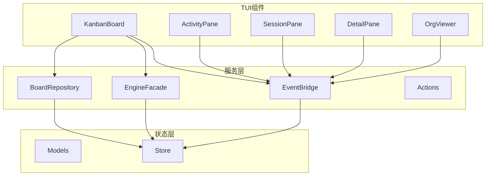
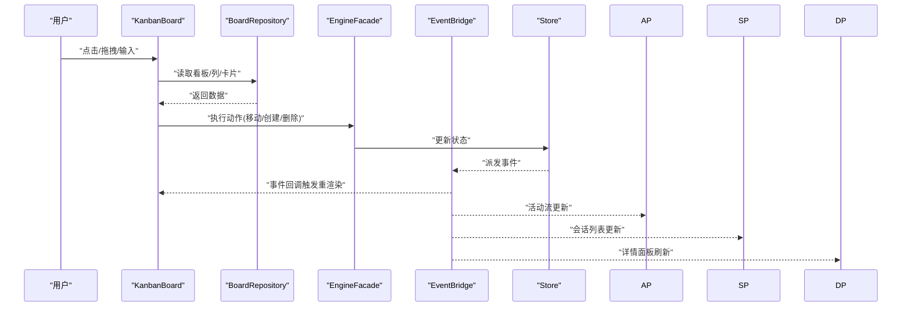
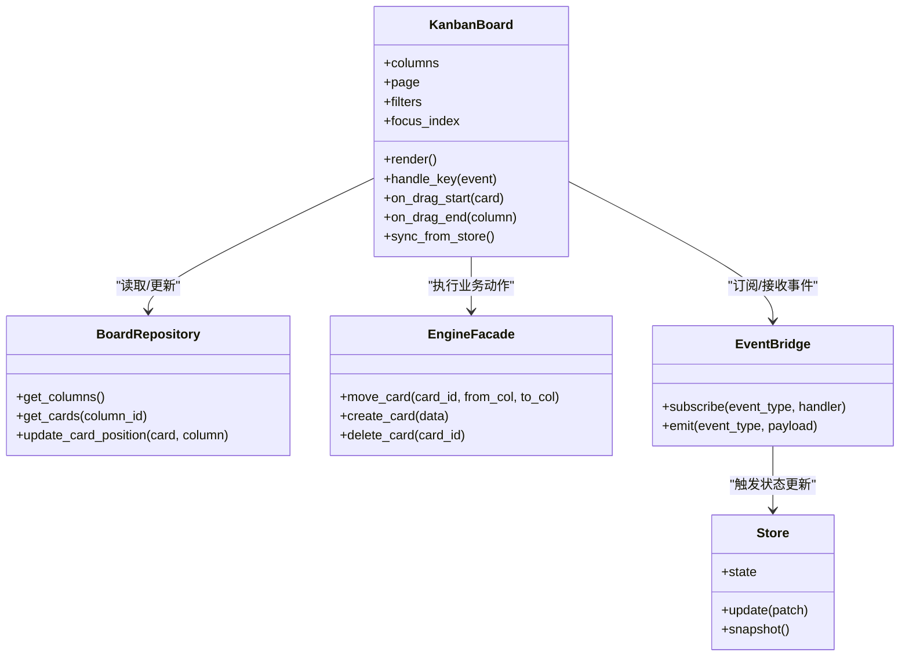
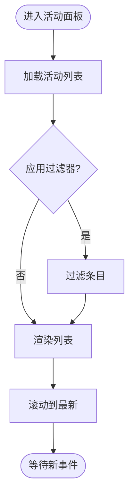
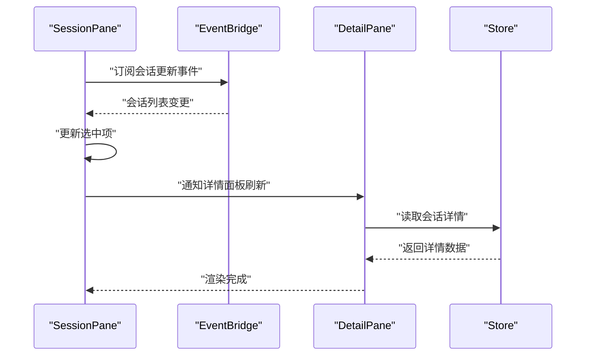
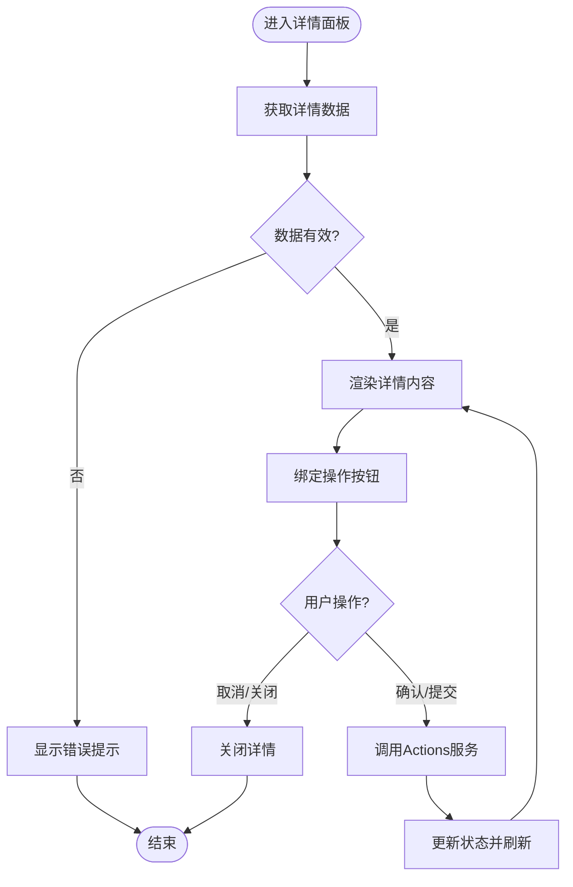
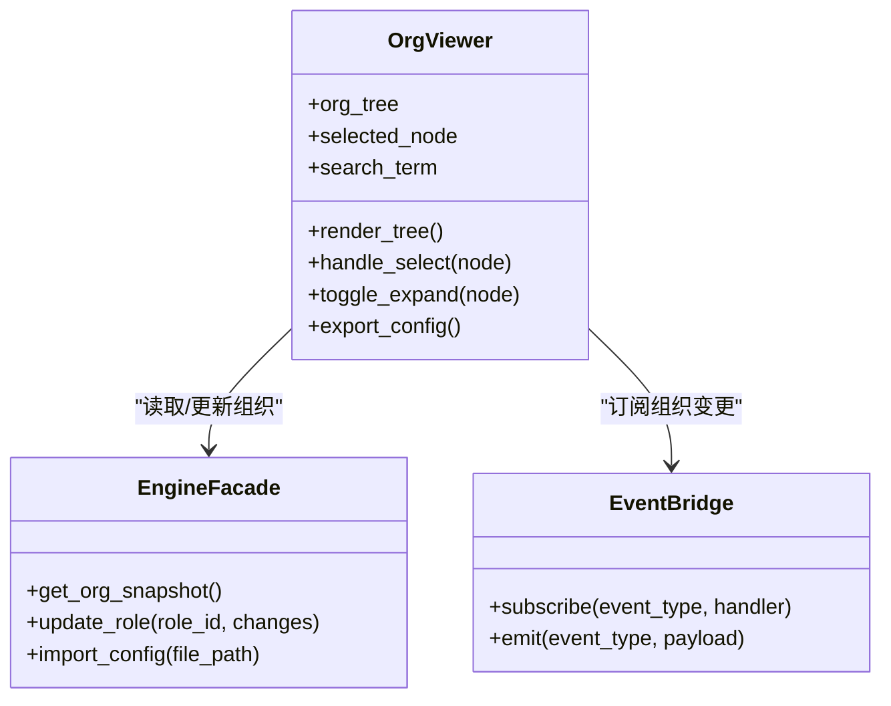
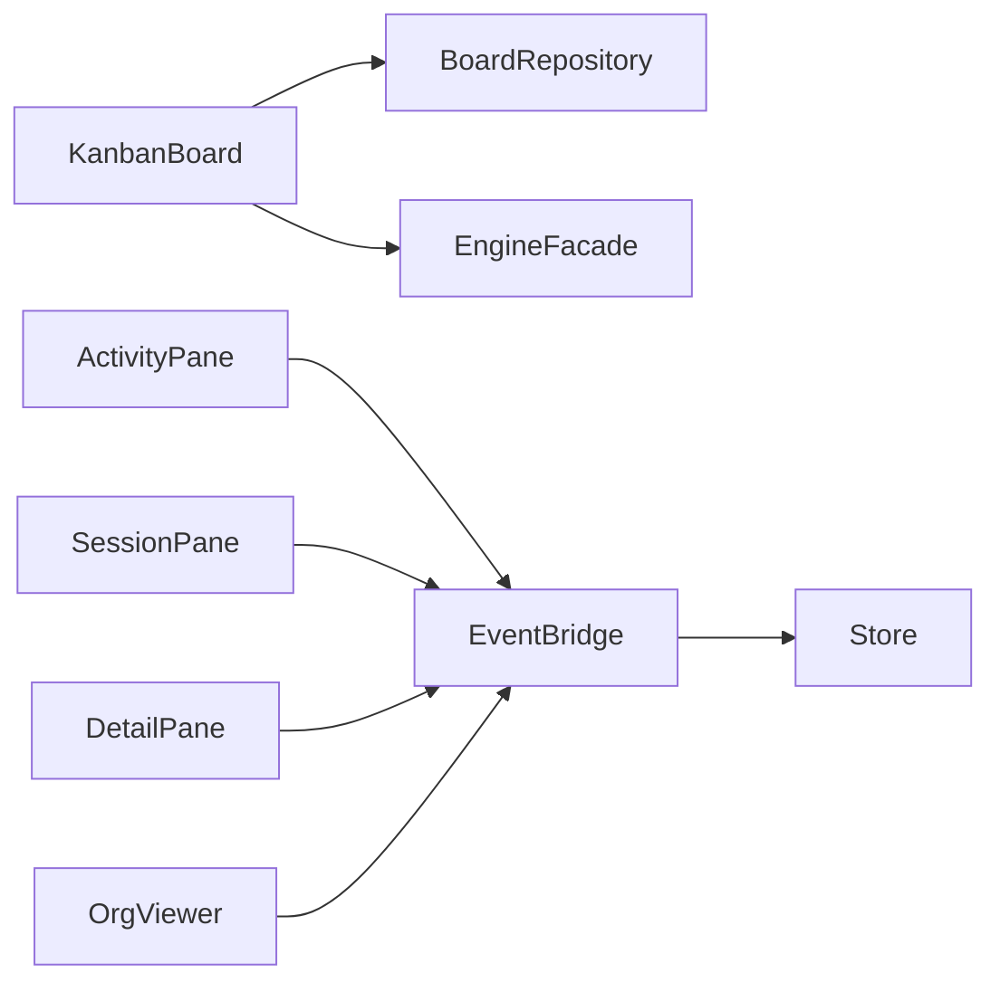

# UI组件系统

<cite>
**本文引用的文件**   
- [kanban_board.py](file://opc/plugins/cli_board/widgets/kanban_board.py)
- [activity_pane.py](file://opc/plugins/cli_board/widgets/activity_pane.py)
- [session_pane.py](file://opc/plugins/cli_board/widgets/session_pane.py)
- [detail_pane.py](file://opc/plugins/cli_board/widgets/detail_pane.py)
- [org_viewer.py](file://opc/plugins/cli_board/widgets/org_viewer.py)
- [app.py](file://opc/plugins/cli_board/tui/app.py)
- [board_repository.py](file://opc/plugins/cli_board/services/board_repository.py)
- [engine_facade.py](file://opc/plugins/cli_board/services/engine_facade.py)
- [event_bridge.py](file://opc/plugins/cli_board/services/event_bridge.py)
- [actions.py](file://opc/plugins/cli_board/services/actions.py)
- [models.py](file://opc/plugins/cli_board/state/models.py)
- [store.py](file://opc/plugins/cli_board/state/store.py)
</cite>

## 目录
1. [简介](#简介)
2. [项目结构](#项目结构)
3. [核心组件](#核心组件)
4. [架构总览](#架构总览)
5. [详细组件分析](#详细组件分析)
6. [依赖关系分析](#依赖关系分析)
7. [性能考虑](#性能考虑)
8. [故障排查指南](#故障排查指南)
9. [结论](#结论)
10. [附录](#附录)

## 简介
本技术文档聚焦于CLI看板的UI组件系统，围绕以下核心组件进行深入解析：KanbanBoard（任务看板）、ActivityPane（活动面板）、SessionPane（会话面板）、DetailPane（详情面板）与OrgViewer（组织查看器）。文档将说明各组件的属性、事件处理、状态管理与渲染逻辑，解释组件间通信机制与数据传递方式，并提供自定义与扩展指南，同时覆盖响应式设计与键盘导航的实现细节。

## 项目结构
CLI看板UI位于插件模块中，采用“服务层 + 状态层 + TUI组件”的分层组织：
- 服务层：封装业务能力与外部交互（看板仓库、引擎门面、事件桥、动作编排等）
- 状态层：定义领域模型与集中式状态存储
- TUI组件：基于文本用户界面框架的可视化组件（看板、面板、视图等）

图表来源
- [kanban_board.py:1-200](file://opc/plugins/cli_board/widgets/kanban_board.py#L1-L200)
- [activity_pane.py:1-200](file://opc/plugins/cli_board/widgets/activity_pane.py#L1-L200)
- [session_pane.py:1-200](file://opc/plugins/cli_board/widgets/session_pane.py#L1-L200)
- [detail_pane.py:1-200](file://opc/plugins/cli_board/widgets/detail_pane.py#L1-L200)
- [org_viewer.py:1-200](file://opc/plugins/cli_board/widgets/org_viewer.py#L1-L200)
- [board_repository.py:1-200](file://opc/plugins/cli_board/services/board_repository.py#L1-L200)
- [engine_facade.py:1-200](file://opc/plugins/cli_board/services/engine_facade.py#L1-L200)
- [event_bridge.py:1-200](file://opc/plugins/cli_board/services/event_bridge.py#L1-L200)
- [models.py:1-200](file://opc/plugins/cli_board/state/models.py#L1-L200)
- [store.py:1-200](file://opc/plugins/cli_board/state/store.py#L1-L200)

章节来源
- [app.py:1-200](file://opc/plugins/cli_board/tui/app.py#L1-L200)
- [kanban_board.py:1-200](file://opc/plugins/cli_board/widgets/kanban_board.py#L1-L200)
- [activity_pane.py:1-200](file://opc/plugins/cli_board/widgets/activity_pane.py#L1-L200)
- [session_pane.py:1-200](file://opc/plugins/cli_board/widgets/session_pane.py#L1-L200)
- [detail_pane.py:1-200](file://opc/plugins/cli_board/widgets/detail_pane.py#L1-L200)
- [org_viewer.py:1-200](file://opc/plugins/cli_board/widgets/org_viewer.py#L1-L200)
- [board_repository.py:1-200](file://opc/plugins/cli_board/services/board_repository.py#L1-L200)
- [engine_facade.py:1-200](file://opc/plugins/cli_board/services/engine_facade.py#L1-L200)
- [event_bridge.py:1-200](file://opc/plugins/cli_board/services/event_bridge.py#L1-L200)
- [models.py:1-200](file://opc/plugins/cli_board/state/models.py#L1-L200)
- [store.py:1-200](file://opc/plugins/cli_board/state/store.py#L1-L200)

## 核心组件
本节概述五大核心组件的职责与交互边界：
- KanbanBoard：展示列与卡片，承载拖拽、筛选、分页与焦点管理；协调服务层完成状态变更
- ActivityPane：呈现活动流（如进度、日志、通知），支持滚动与过滤
- SessionPane：会话列表与上下文切换，提供选择与会话元信息展示
- DetailPane：选中项的详细信息视图，包含富文本、工具调用结果与操作按钮
- OrgViewer：组织结构与角色/人才信息的浏览与编辑入口

章节来源
- [kanban_board.py:1-200](file://opc/plugins/cli_board/widgets/kanban_board.py#L1-L200)
- [activity_pane.py:1-200](file://opc/plugins/cli_board/widgets/activity_pane.py#L1-L200)
- [session_pane.py:1-200](file://opc/plugins/cli_board/widgets/session_pane.py#L1-L200)
- [detail_pane.py:1-200](file://opc/plugins/cli_board/widgets/detail_pane.py#L1-L200)
- [org_viewer.py:1-200](file://opc/plugins/cli_board/widgets/org_viewer.py#L1-L200)

## 架构总览
整体采用“组件 -> 服务 -> 状态”的单向数据流模式：
- 组件通过服务层发起动作或查询
- 服务层更新状态存储并广播事件
- 组件订阅事件以驱动重渲染

图表来源
- [kanban_board.py:1-200](file://opc/plugins/cli_board/widgets/kanban_board.py#L1-L200)
- [board_repository.py:1-200](file://opc/plugins/cli_board/services/board_repository.py#L1-L200)
- [engine_facade.py:1-200](file://opc/plugins/cli_board/services/engine_facade.py#L1-L200)
- [event_bridge.py:1-200](file://opc/plugins/cli_board/services/event_bridge.py#L1-L200)
- [store.py:1-200](file://opc/plugins/cli_board/state/store.py#L1-L200)

## 详细组件分析

### KanbanBoard（任务看板）
职责与特性：
- 渲染列与卡片，支持键盘导航、焦点切换、分页与筛选
- 处理拖拽与排序，调用服务层持久化变更
- 维护本地选择态与全局状态同步

关键属性与方法（概念性描述）：
- 列集合、当前页码、筛选条件、焦点索引
- 渲染方法：绘制列头、卡片行、状态标签
- 事件处理：按键、鼠标点击、拖拽开始/结束
- 状态同步：从Store获取最新数据，向EventBridge订阅更新

图表来源
- [kanban_board.py:1-200](file://opc/plugins/cli_board/widgets/kanban_board.py#L1-L200)
- [board_repository.py:1-200](file://opc/plugins/cli_board/services/board_repository.py#L1-L200)
- [engine_facade.py:1-200](file://opc/plugins/cli_board/services/engine_facade.py#L1-L200)
- [event_bridge.py:1-200](file://opc/plugins/cli_board/services/event_bridge.py#L1-L200)
- [store.py:1-200](file://opc/plugins/cli_board/state/store.py#L1-L200)

章节来源
- [kanban_board.py:1-200](file://opc/plugins/cli_board/widgets/kanban_board.py#L1-L200)

### ActivityPane（活动面板）
职责与特性：
- 显示活动流（进度、日志、通知），支持滚动定位与过滤
- 根据事件类型高亮不同条目，保持最新条目可见
- 与EventBridge联动，增量更新列表

关键属性与方法（概念性描述）：
- 活动列表、滚动位置、过滤器
- 渲染方法：按类型分组、时间戳格式化、摘要截断
- 事件处理：滚动、过滤输入、跳转至相关详情

图表来源
- [activity_pane.py:1-200](file://opc/plugins/cli_board/widgets/activity_pane.py#L1-L200)
- [event_bridge.py:1-200](file://opc/plugins/cli_board/services/event_bridge.py#L1-L200)

章节来源
- [activity_pane.py:1-200](file://opc/plugins/cli_board/widgets/activity_pane.py#L1-L200)

### SessionPane（会话面板）
职责与特性：
- 展示会话列表与元信息（标题、状态、时间）
- 支持选择切换、搜索与快速跳转
- 与DetailPane联动，选中会话后刷新详情

关键属性与方法（概念性描述）：
- 会话集合、选中ID、搜索词
- 渲染方法：列表项、状态徽标、摘要预览
- 事件处理：选择、搜索、键盘上下导航

图表来源
- [session_pane.py:1-200](file://opc/plugins/cli_board/widgets/session_pane.py#L1-L200)
- [detail_pane.py:1-200](file://opc/plugins/cli_board/widgets/detail_pane.py#L1-L200)
- [event_bridge.py:1-200](file://opc/plugins/cli_board/services/event_bridge.py#L1-L200)
- [store.py:1-200](file://opc/plugins/cli_board/state/store.py#L1-L200)

章节来源
- [session_pane.py:1-200](file://opc/plugins/cli_board/widgets/session_pane.py#L1-L200)
- [detail_pane.py:1-200](file://opc/plugins/cli_board/widgets/detail_pane.py#L1-L200)

### DetailPane（详情面板）
职责与特性：
- 展示选中对象的详细信息（富文本、工具输出、附件）
- 提供操作按钮（确认、取消、重试、反馈）
- 与Action服务协作，执行用户意图并更新状态

关键属性与方法（概念性描述）：
- 详情数据、操作历史、错误信息
- 渲染方法：分段渲染、链接处理、代码块高亮
- 事件处理：按钮点击、复制内容、打开外部资源

图表来源
- [detail_pane.py:1-200](file://opc/plugins/cli_board/widgets/detail_pane.py#L1-L200)
- [actions.py:1-200](file://opc/plugins/cli_board/services/actions.py#L1-L200)
- [store.py:1-200](file://opc/plugins/cli_board/state/store.py#L1-L200)

章节来源
- [detail_pane.py:1-200](file://opc/plugins/cli_board/widgets/detail_pane.py#L1-L200)

### OrgViewer（组织查看器）
职责与特性：
- 浏览组织架构、角色与人才信息
- 支持展开/折叠、搜索与导出
- 与EngineFacade交互，触发组织配置变更

关键属性与方法（概念性描述）：
- 组织树、选中节点、搜索词
- 渲染方法：树形结构、节点图标、统计指标
- 事件处理：节点选择、展开/折叠、批量操作

图表来源
- [org_viewer.py:1-200](file://opc/plugins/cli_board/widgets/org_viewer.py#L1-L200)
- [engine_facade.py:1-200](file://opc/plugins/cli_board/services/engine_facade.py#L1-L200)
- [event_bridge.py:1-200](file://opc/plugins/cli_board/services/event_bridge.py#L1-L200)

章节来源
- [org_viewer.py:1-200](file://opc/plugins/cli_board/widgets/org_viewer.py#L1-L200)

## 依赖关系分析
组件与服务层的耦合关系如下：
- KanbanBoard依赖BoardRepository进行数据读写，依赖EngineFacade执行业务动作
- ActivityPane、SessionPane、DetailPane、OrgViewer均通过EventBridge订阅状态变更
- Store作为单一事实源，被服务层更新并通过EventBridge广播

图表来源
- [kanban_board.py:1-200](file://opc/plugins/cli_board/widgets/kanban_board.py#L1-L200)
- [activity_pane.py:1-200](file://opc/plugins/cli_board/widgets/activity_pane.py#L1-L200)
- [session_pane.py:1-200](file://opc/plugins/cli_board/widgets/session_pane.py#L1-L200)
- [detail_pane.py:1-200](file://opc/plugins/cli_board/widgets/detail_pane.py#L1-L200)
- [org_viewer.py:1-200](file://opc/plugins/cli_board/widgets/org_viewer.py#L1-L200)
- [board_repository.py:1-200](file://opc/plugins/cli_board/services/board_repository.py#L1-L200)
- [engine_facade.py:1-200](file://opc/plugins/cli_board/services/engine_facade.py#L1-L200)
- [event_bridge.py:1-200](file://opc/plugins/cli_board/services/event_bridge.py#L1-L200)
- [store.py:1-200](file://opc/plugins/cli_board/state/store.py#L1-L200)

章节来源
- [app.py:1-200](file://opc/plugins/cli_board/tui/app.py#L1-L200)

## 性能考虑
- 增量渲染：仅在事件触发时更新受影响区域，避免全量重绘
- 虚拟列表：对长列表（活动流、会话列表）采用按需渲染策略
- 防抖与节流：对高频输入（搜索、滚动）进行优化
- 缓存热点数据：在Store层缓存常用查询结果，减少重复计算

[本节为通用指导，不直接分析具体文件]

## 故障排查指南
常见问题与定位建议：
- 事件未触发：检查EventBridge订阅是否注册成功，确认事件类型与载荷匹配
- 状态不同步：验证Store更新路径是否正确，确认服务层是否调用更新接口
- 渲染异常：检查数据有效性，确认渲染函数对空值与异常分支的处理
- 键盘导航失效：确认焦点管理逻辑与按键映射是否正确绑定

章节来源
- [event_bridge.py:1-200](file://opc/plugins/cli_board/services/event_bridge.py#L1-L200)
- [store.py:1-200](file://opc/plugins/cli_board/state/store.py#L1-L200)

## 结论
本UI组件系统通过清晰的分层与单向数据流，实现了可维护、可扩展的CLI看板界面。各组件职责明确，依赖关系简洁，便于后续功能增强与主题定制。建议在扩展时遵循现有模式，确保事件与状态的一致性。

[本节为总结性内容，不直接分析具体文件]

## 附录
- 自定义组件指南：
  - 继承基础组件类，实现渲染与事件处理方法
  - 通过EventBridge订阅所需事件，使用Store进行状态读写
  - 遵循命名约定与错误处理规范，确保可测试性与可维护性
- 响应式设计要点：
  - 根据终端宽度动态调整列数与布局
  - 使用自适应字体与间距，保证可读性
- 键盘导航最佳实践：
  - 统一焦点顺序与快捷键映射
  - 提供无障碍提示与状态反馈

[本节为通用指导，不直接分析具体文件]