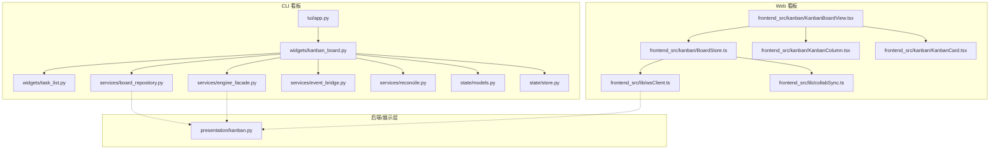
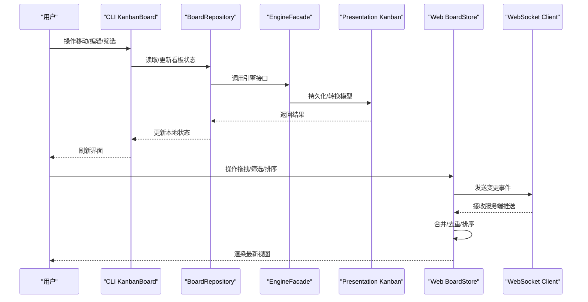
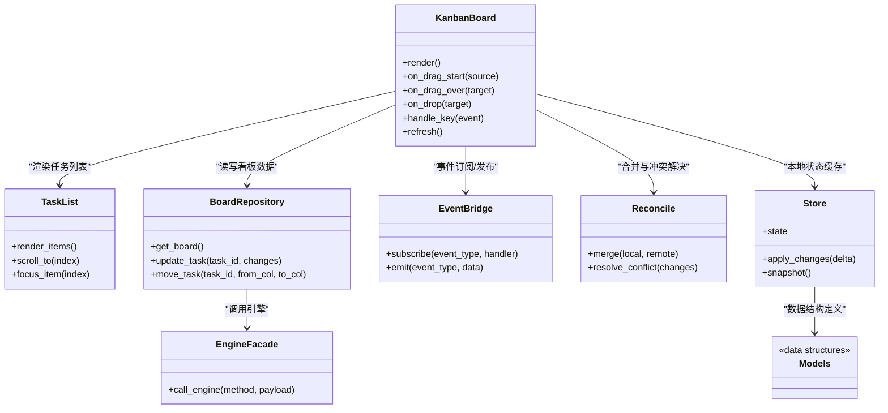
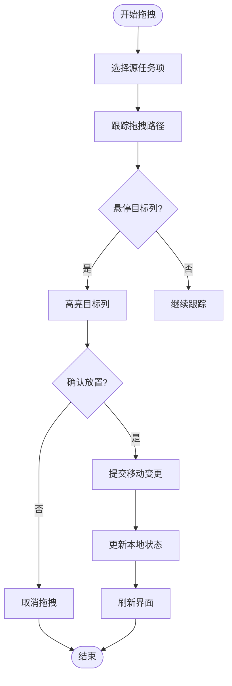
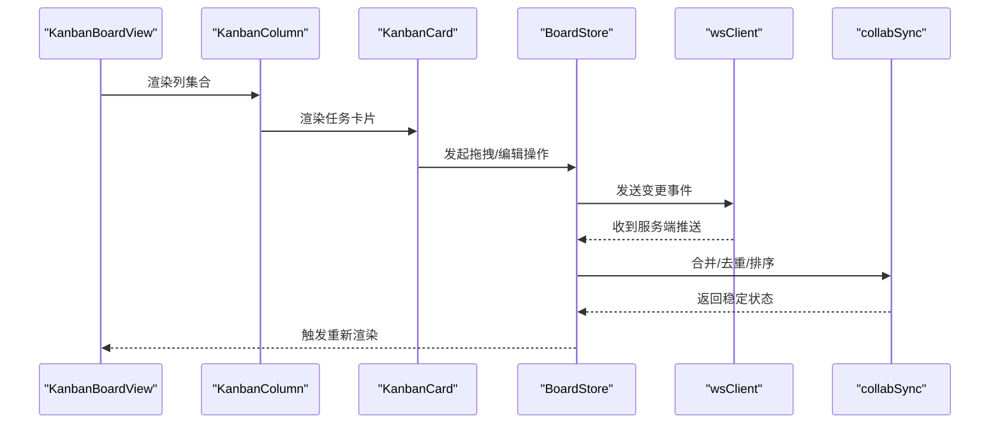
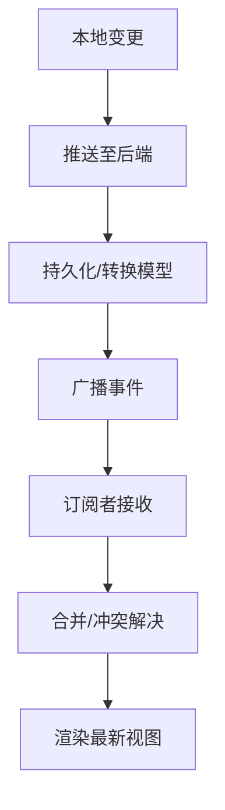
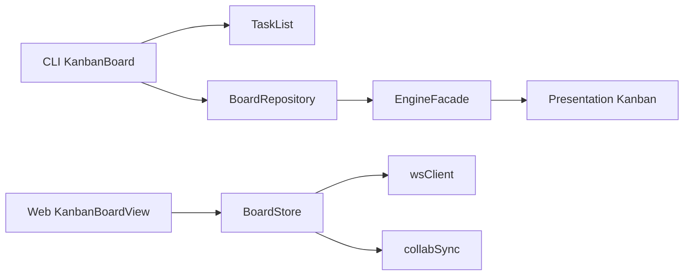

# 任务看板组件

<cite>
**本文引用的文件**   
- [kanban_board.py](file://opc/plugins/cli_board/widgets/kanban_board.py)
- [task_list.py](file://opc/plugins/cli_board/widgets/task_list.py)
- [board_repository.py](file://opc/plugins/cli_board/services/board_repository.py)
- [engine_facade.py](file://opc/plugins/cli_board/services/engine_facade.py)
- [event_bridge.py](file://opc/plugins/cli_board/services/event_bridge.py)
- [reconcile.py](file://opc/plugins/cli_board/services/reconcile.py)
- [models.py](file://opc/plugins/cli_board/state/models.py)
- [store.py](file://opc/plugins/cli_board/state/store.py)
- [app.py](file://opc/plugins/cli_board/tui/app.py)
- [BoardStore.ts](file://opc/plugins/office_ui/frontend_src/kanban/BoardStore.ts)
- [KanbanBoardView.tsx](file://opc/plugins/office_ui/frontend_src/kanban/KanbanBoardView.tsx)
- [KanbanColumn.tsx](file://opc/plugins/office_ui/frontend_src/kanban/KanbanColumn.tsx)
- [KanbanCard.tsx](file://opc/plugins/office_ui/frontend_src/kanban/KanbanCard.tsx)
- [wsClient.ts](file://opc/plugins/office_ui/frontend_src/lib/wsClient.ts)
- [collabSync.ts](file://opc/plugins/office_ui/frontend_src/lib/collabSync.ts)
- [kanban.py](file://opc/presentation/kanban.py)
</cite>

## 目录
1. [简介](#简介)
2. [项目结构](#项目结构)
3. [核心组件](#核心组件)
4. [架构总览](#架构总览)
5. [详细组件分析](#详细组件分析)
6. [依赖关系分析](#依赖关系分析)
7. [性能考虑](#性能考虑)
8. [故障排查指南](#故障排查指南)
9. [结论](#结论)
10. [附录](#附录)

## 简介
本技术文档围绕“任务看板组件”展开，覆盖 CLI 与 Web 两套实现：
- CLI 端基于 Textual TUI 的 KanbanBoard 组件，提供本地状态、渲染、键盘导航与基础拖拽交互。
- Web 端基于 React + TypeScript 的看板视图，提供列/卡片渲染、拖拽排序、筛选与排序、WebSocket 实时同步与协作一致性。

文档将深入解析：
- 任务列表渲染逻辑、拖拽交互流程
- 前端状态管理与后端数据同步机制（含实时更新）
- 显示格式、筛选与排序能力
- 自定义样式与布局配置方法
- 无障碍支持（键盘导航与屏幕阅读器）

## 项目结构
与任务看板相关的代码分布在以下模块：
- CLI 看板（Textual TUI）
  - widgets: kanban_board.py, task_list.py
  - services: board_repository.py, engine_facade.py, event_bridge.py, reconcile.py
  - state: models.py, store.py
  - tui: app.py
- Web 看板（React/TS）
  - frontend_src/kanban: BoardStore.ts, KanbanBoardView.tsx, KanbanColumn.tsx, KanbanCard.tsx
  - frontend_src/lib: wsClient.ts, collabSync.ts
- 后端服务与展示层
  - presentation/kanban.py

图表来源
- [app.py](file://opc/plugins/cli_board/tui/app.py)
- [kanban_board.py](file://opc/plugins/cli_board/widgets/kanban_board.py)
- [task_list.py](file://opc/plugins/cli_board/widgets/task_list.py)
- [board_repository.py](file://opc/plugins/cli_board/services/board_repository.py)
- [engine_facade.py](file://opc/plugins/cli_board/services/engine_facade.py)
- [event_bridge.py](file://opc/plugins/cli_board/services/event_bridge.py)
- [reconcile.py](file://opc/plugins/cli_board/services/reconcile.py)
- [models.py](file://opc/plugins/cli_board/state/models.py)
- [store.py](file://opc/plugins/cli_board/state/store.py)
- [KanbanBoardView.tsx](file://opc/plugins/office_ui/frontend_src/kanban/KanbanBoardView.tsx)
- [BoardStore.ts](file://opc/plugins/office_ui/frontend_src/kanban/BoardStore.ts)
- [KanbanColumn.tsx](file://opc/plugins/office_ui/frontend_src/kanban/KanbanColumn.tsx)
- [KanbanCard.tsx](file://opc/plugins/office_ui/frontend_src/kanban/KanbanCard.tsx)
- [wsClient.ts](file://opc/plugins/office_ui/frontend_src/lib/wsClient.ts)
- [collabSync.ts](file://opc/plugins/office_ui/frontend_src/lib/collabSync.ts)
- [kanban.py](file://opc/presentation/kanban.py)

章节来源
- [kanban_board.py](file://opc/plugins/cli_board/widgets/kanban_board.py)
- [task_list.py](file://opc/plugins/cli_board/widgets/task_list.py)
- [board_repository.py](file://opc/plugins/cli_board/services/board_repository.py)
- [engine_facade.py](file://opc/plugins/cli_board/services/engine_facade.py)
- [event_bridge.py](file://opc/plugins/cli_board/services/event_bridge.py)
- [reconcile.py](file://opc/plugins/cli_board/services/reconcile.py)
- [models.py](file://opc/plugins/cli_board/state/models.py)
- [store.py](file://opc/plugins/cli_board/state/store.py)
- [app.py](file://opc/plugins/cli_board/tui/app.py)
- [KanbanBoardView.tsx](file://opc/plugins/office_ui/frontend_src/kanban/KanbanBoardView.tsx)
- [BoardStore.ts](file://opc/plugins/office_ui/frontend_src/kanban/BoardStore.ts)
- [KanbanColumn.tsx](file://opc/plugins/office_ui/frontend_src/kanban/KanbanColumn.tsx)
- [KanbanCard.tsx](file://opc/plugins/office_ui/frontend_src/kanban/KanbanCard.tsx)
- [wsClient.ts](file://opc/plugins/office_ui/frontend_src/lib/wsClient.ts)
- [collabSync.ts](file://opc/plugins/office_ui/frontend_src/lib/collabSync.ts)
- [kanban.py](file://opc/presentation/kanban.py)

## 核心组件
- CLI KanbanBoard 组件
  - 负责看板整体布局、列与任务项的渲染、键盘导航、拖拽交互、事件桥接与状态协调。
  - 通过仓库与服务门面访问后端，结合事件桥与合并策略保证本地状态与远端一致。
- Web KanbanBoardView 组件
  - 负责看板页面渲染、列与卡片组件组合、用户交互（点击、拖拽）、筛选与排序控制。
  - 通过 BoardStore 管理本地状态，使用 WebSocket 与后端进行增量同步与冲突解决。

章节来源
- [kanban_board.py](file://opc/plugins/cli_board/widgets/kanban_board.py)
- [KanbanBoardView.tsx](file://opc/plugins/office_ui/frontend_src/kanban/KanbanBoardView.tsx)

## 架构总览
下图展示了从 UI 到后端的数据流与关键组件职责：

图表来源
- [kanban_board.py](file://opc/plugins/cli_board/widgets/kanban_board.py)
- [board_repository.py](file://opc/plugins/cli_board/services/board_repository.py)
- [engine_facade.py](file://opc/plugins/cli_board/services/engine_facade.py)
- [kanban.py](file://opc/presentation/kanban.py)
- [BoardStore.ts](file://opc/plugins/office_ui/frontend_src/kanban/BoardStore.ts)
- [wsClient.ts](file://opc/plugins/office_ui/frontend_src/lib/wsClient.ts)

## 详细组件分析

### CLI KanbanBoard 组件
- 渲染逻辑
  - 按列组织任务项，任务项由 TaskList 子组件负责渲染，支持分页与滚动优化。
  - 根据状态模型生成列头与任务卡片，包含标题、优先级、标签等元信息。
- 拖拽交互
  - 监听鼠标/键盘事件，维护当前拖拽源与目标列，提交变更至仓库并触发重绘。
- 状态管理
  - 使用本地 Store 缓存看板数据，配合 Reconcile 策略处理并发更新与冲突。
- 事件桥接
  - EventBridge 统一封装后端事件订阅与分发，确保 UI 响应及时且幂等。
- 键盘导航与无障碍
  - 支持 Tab/方向键在列与任务间切换，为可聚焦元素设置语义化属性，便于屏幕阅读器朗读。

图表来源
- [kanban_board.py](file://opc/plugins/cli_board/widgets/kanban_board.py)
- [task_list.py](file://opc/plugins/cli_board/widgets/task_list.py)
- [board_repository.py](file://opc/plugins/cli_board/services/board_repository.py)
- [engine_facade.py](file://opc/plugins/cli_board/services/engine_facade.py)
- [event_bridge.py](file://opc/plugins/cli_board/services/event_bridge.py)
- [reconcile.py](file://opc/plugins/cli_board/services/reconcile.py)
- [models.py](file://opc/plugins/cli_board/state/models.py)
- [store.py](file://opc/plugins/cli_board/state/store.py)

章节来源
- [kanban_board.py](file://opc/plugins/cli_board/widgets/kanban_board.py)
- [task_list.py](file://opc/plugins/cli_board/widgets/task_list.py)
- [board_repository.py](file://opc/plugins/cli_board/services/board_repository.py)
- [engine_facade.py](file://opc/plugins/cli_board/services/engine_facade.py)
- [event_bridge.py](file://opc/plugins/cli_board/services/event_bridge.py)
- [reconcile.py](file://opc/plugins/cli_board/services/reconcile.py)
- [models.py](file://opc/plugins/cli_board/state/models.py)
- [store.py](file://opc/plugins/cli_board/state/store.py)

#### 拖拽流程（CLI）

图表来源
- [kanban_board.py](file://opc/plugins/cli_board/widgets/kanban_board.py)
- [board_repository.py](file://opc/plugins/cli_board/services/board_repository.py)

### Web KanbanBoardView 组件
- 渲染逻辑
  - KanbanBoardView 组合 KanbanColumn 与 KanbanCard，按列分组渲染任务卡片，支持虚拟滚动与按需加载。
- 拖拽交互
  - 使用 HTML5 Drag & Drop API 或第三方库实现跨列拖拽，更新 BoardStore 中的顺序与归属列。
- 筛选与排序
  - 提供按状态、标签、优先级、创建时间等维度的筛选与排序，BoardStore 维护过滤后的视图模型。
- 状态管理
  - BoardStore 集中管理看板状态，应用增量更新与去重策略，避免重复渲染。
- 实时同步
  - 通过 wsClient 建立 WebSocket 连接，接收服务端推送的变更事件；collabSync 负责合并与冲突消解。

图表来源
- [KanbanBoardView.tsx](file://opc/plugins/office_ui/frontend_src/kanban/KanbanBoardView.tsx)
- [KanbanColumn.tsx](file://opc/plugins/office_ui/frontend_src/kanban/KanbanColumn.tsx)
- [KanbanCard.tsx](file://opc/plugins/office_ui/frontend_src/kanban/KanbanCard.tsx)
- [BoardStore.ts](file://opc/plugins/office_ui/frontend_src/kanban/BoardStore.ts)
- [wsClient.ts](file://opc/plugins/office_ui/frontend_src/lib/wsClient.ts)
- [collabSync.ts](file://opc/plugins/office_ui/frontend_src/lib/collabSync.ts)

章节来源
- [KanbanBoardView.tsx](file://opc/plugins/office_ui/frontend_src/kanban/KanbanBoardView.tsx)
- [KanbanColumn.tsx](file://opc/plugins/office_ui/frontend_src/kanban/KanbanColumn.tsx)
- [KanbanCard.tsx](file://opc/plugins/office_ui/frontend_src/kanban/KanbanCard.tsx)
- [BoardStore.ts](file://opc/plugins/office_ui/frontend_src/kanban/BoardStore.ts)
- [wsClient.ts](file://opc/plugins/office_ui/frontend_src/lib/wsClient.ts)
- [collabSync.ts](file://opc/plugins/office_ui/frontend_src/lib/collabSync.ts)

### 后端数据同步与实时更新
- CLI 侧
  - BoardRepository 封装对 EngineFacade 的调用，EngineFacade 对接 Presentation Kanban 层完成持久化与模型转换。
  - EventBridge 订阅后端事件，Reconcile 负责本地与远端状态的合并与冲突解决。
- Web 侧
  - BoardStore 通过 wsClient 发送与接收变更事件，collabSync 执行增量合并、去重与排序，保证多客户端一致性。

图表来源
- [board_repository.py](file://opc/plugins/cli_board/services/board_repository.py)
- [engine_facade.py](file://opc/plugins/cli_board/services/engine_facade.py)
- [event_bridge.py](file://opc/plugins/cli_board/services/event_bridge.py)
- [reconcile.py](file://opc/plugins/cli_board/services/reconcile.py)
- [BoardStore.ts](file://opc/plugins/office_ui/frontend_src/kanban/BoardStore.ts)
- [wsClient.ts](file://opc/plugins/office_ui/frontend_src/lib/wsClient.ts)
- [collabSync.ts](file://opc/plugins/office_ui/frontend_src/lib/collabSync.ts)
- [kanban.py](file://opc/presentation/kanban.py)

章节来源
- [board_repository.py](file://opc/plugins/cli_board/services/board_repository.py)
- [engine_facade.py](file://opc/plugins/cli_board/services/engine_facade.py)
- [event_bridge.py](file://opc/plugins/cli_board/services/event_bridge.py)
- [reconcile.py](file://opc/plugins/cli_board/services/reconcile.py)
- [BoardStore.ts](file://opc/plugins/office_ui/frontend_src/kanban/BoardStore.ts)
- [wsClient.ts](file://opc/plugins/office_ui/frontend_src/lib/wsClient.ts)
- [collabSync.ts](file://opc/plugins/office_ui/frontend_src/lib/collabSync.ts)
- [kanban.py](file://opc/presentation/kanban.py)

### 任务项显示格式、筛选与排序
- 显示格式
  - CLI：任务卡片包含标题、状态、优先级、标签等字段，采用文本块与边框组合呈现。
  - Web：卡片组件支持图标、进度条、标签云与摘要预览，列头显示统计信息。
- 筛选
  - 支持按状态、标签、优先级、创建/更新时间范围筛选，Web 端提供多选与组合条件。
- 排序
  - 支持按优先级、时间戳、自定义权重排序，Web 端允许用户保存排序偏好。

章节来源
- [task_list.py](file://opc/plugins/cli_board/widgets/task_list.py)
- [KanbanCard.tsx](file://opc/plugins/office_ui/frontend_src/kanban/KanbanCard.tsx)
- [KanbanColumn.tsx](file://opc/plugins/office_ui/frontend_src/kanban/KanbanColumn.tsx)
- [BoardStore.ts](file://opc/plugins/office_ui/frontend_src/kanban/BoardStore.ts)

### 自定义任务样式与布局配置
- CLI 样式
  - 可通过主题与 CSS 类名调整边框、颜色与间距；TaskList 支持行高与字体大小配置。
- Web 样式
  - 通过 CSS 变量与组件 props 定制卡片尺寸、列宽、阴影与动画；BoardStore 暴露布局配置以适配不同屏幕。

章节来源
- [task_list.py](file://opc/plugins/cli_board/widgets/task_list.py)
- [KanbanCard.tsx](file://opc/plugins/office_ui/frontend_src/kanban/KanbanCard.tsx)
- [KanbanColumn.tsx](file://opc/plugins/office_ui/frontend_src/kanban/KanbanColumn.tsx)
- [BoardStore.ts](file://opc/plugins/office_ui/frontend_src/kanban/BoardStore.ts)

### 键盘导航与无障碍支持
- 键盘导航
  - CLI：Tab 切换焦点，方向键在列与任务间移动，Enter 确认操作，Esc 取消。
  - Web：ARIA 角色与 tabindex 管理焦点，键盘快捷键支持拖拽与筛选重置。
- 屏幕阅读器
  - 为关键元素添加 aria-label、aria-live 区域，确保变更提示与错误信息可读。

章节来源
- [kanban_board.py](file://opc/plugins/cli_board/widgets/kanban_board.py)
- [task_list.py](file://opc/plugins/cli_board/widgets/task_list.py)
- [KanbanBoardView.tsx](file://opc/plugins/office_ui/frontend_src/kanban/KanbanBoardView.tsx)
- [KanbanCard.tsx](file://opc/plugins/office_ui/frontend_src/kanban/KanbanCard.tsx)

## 依赖关系分析
- 组件耦合
  - CLI KanbanBoard 与 TaskList 低耦合，通过接口传递数据与回调；BoardRepository 与 EngineFacade 明确边界。
  - Web KanbanBoardView 仅依赖 BoardStore 提供的状态与动作，降低与具体渲染细节的耦合。
- 外部依赖
  - WebSocket 客户端用于实时通信；Presentation Kanban 作为后端展示层，提供统一的模型与接口。
- 潜在循环依赖
  - 通过事件桥与合并策略解耦，避免直接双向引用。

图表来源
- [kanban_board.py](file://opc/plugins/cli_board/widgets/kanban_board.py)
- [task_list.py](file://opc/plugins/cli_board/widgets/task_list.py)
- [board_repository.py](file://opc/plugins/cli_board/services/board_repository.py)
- [engine_facade.py](file://opc/plugins/cli_board/services/engine_facade.py)
- [kanban.py](file://opc/presentation/kanban.py)
- [KanbanBoardView.tsx](file://opc/plugins/office_ui/frontend_src/kanban/KanbanBoardView.tsx)
- [BoardStore.ts](file://opc/plugins/office_ui/frontend_src/kanban/BoardStore.ts)
- [wsClient.ts](file://opc/plugins/office_ui/frontend_src/lib/wsClient.ts)
- [collabSync.ts](file://opc/plugins/office_ui/frontend_src/lib/collabSync.ts)

章节来源
- [kanban_board.py](file://opc/plugins/cli_board/widgets/kanban_board.py)
- [task_list.py](file://opc/plugins/cli_board/widgets/task_list.py)
- [board_repository.py](file://opc/plugins/cli_board/services/board_repository.py)
- [engine_facade.py](file://opc/plugins/cli_board/services/engine_facade.py)
- [kanban.py](file://opc/presentation/kanban.py)
- [KanbanBoardView.tsx](file://opc/plugins/office_ui/frontend_src/kanban/KanbanBoardView.tsx)
- [BoardStore.ts](file://opc/plugins/office_ui/frontend_src/kanban/BoardStore.ts)
- [wsClient.ts](file://opc/plugins/office_ui/frontend_src/lib/wsClient.ts)
- [collabSync.ts](file://opc/plugins/office_ui/frontend_src/lib/collabSync.ts)

## 性能考虑
- 渲染优化
  - 虚拟滚动与分页加载减少 DOM/终端节点数量；按需渲染卡片详情。
- 状态更新
  - 增量合并与去重避免全量重算；批量更新合并为单次渲染。
- 网络传输
  - 压缩与节流事件推送；断线重连与幂等处理保障稳定性。
- 内存占用
  - 清理未使用的事件监听器与定时器；限制历史快照大小。

[本节为通用指导，不直接分析具体文件]

## 故障排查指南
- 常见问题
  - 拖拽无效：检查事件绑定与目标列高亮逻辑；确认仓库更新是否成功。
  - 实时不同步：验证 WebSocket 连接状态与事件类型映射；查看合并策略日志。
  - 筛选/排序异常：核对过滤条件与排序键值；确认视图模型与原始数据一致性。
- 调试建议
  - 启用详细日志输出，记录关键事件与状态快照；使用浏览器开发者工具或 CLI 控制台定位问题。

章节来源
- [event_bridge.py](file://opc/plugins/cli_board/services/event_bridge.py)
- [reconcile.py](file://opc/plugins/cli_board/services/reconcile.py)
- [BoardStore.ts](file://opc/plugins/office_ui/frontend_src/kanban/BoardStore.ts)
- [wsClient.ts](file://opc/plugins/office_ui/frontend_src/lib/wsClient.ts)
- [collabSync.ts](file://opc/plugins/office_ui/frontend_src/lib/collabSync.ts)

## 结论
任务看板组件在 CLI 与 Web 两端均实现了完整的渲染、交互与同步能力。通过清晰的分层与模块化设计，组件具备良好的可扩展性与可维护性。建议在后续迭代中持续优化性能与无障碍体验，完善错误恢复与监控告警机制。

[本节为总结，不直接分析具体文件]

## 附录
- 术语表
  - 看板：按列组织任务的可视化工作流视图。
  - 卡片：单个任务的可视化表示，包含关键元信息与操作入口。
  - 列：任务的状态阶段容器，支持拖拽移动。
- 参考实现路径
  - CLI 看板主组件：[kanban_board.py](file://opc/plugins/cli_board/widgets/kanban_board.py)
  - Web 看板主视图：[KanbanBoardView.tsx](file://opc/plugins/office_ui/frontend_src/kanban/KanbanBoardView.tsx)
  - 状态管理（CLI/Web）：[store.py](file://opc/plugins/cli_board/state/store.py), [BoardStore.ts](file://opc/plugins/office_ui/frontend_src/kanban/BoardStore.ts)
  - 实时通信：[wsClient.ts](file://opc/plugins/office_ui/frontend_src/lib/wsClient.ts)
  - 合并与冲突解决：[reconcile.py](file://opc/plugins/cli_board/services/reconcile.py), [collabSync.ts](file://opc/plugins/office_ui/frontend_src/lib/collabSync.ts)