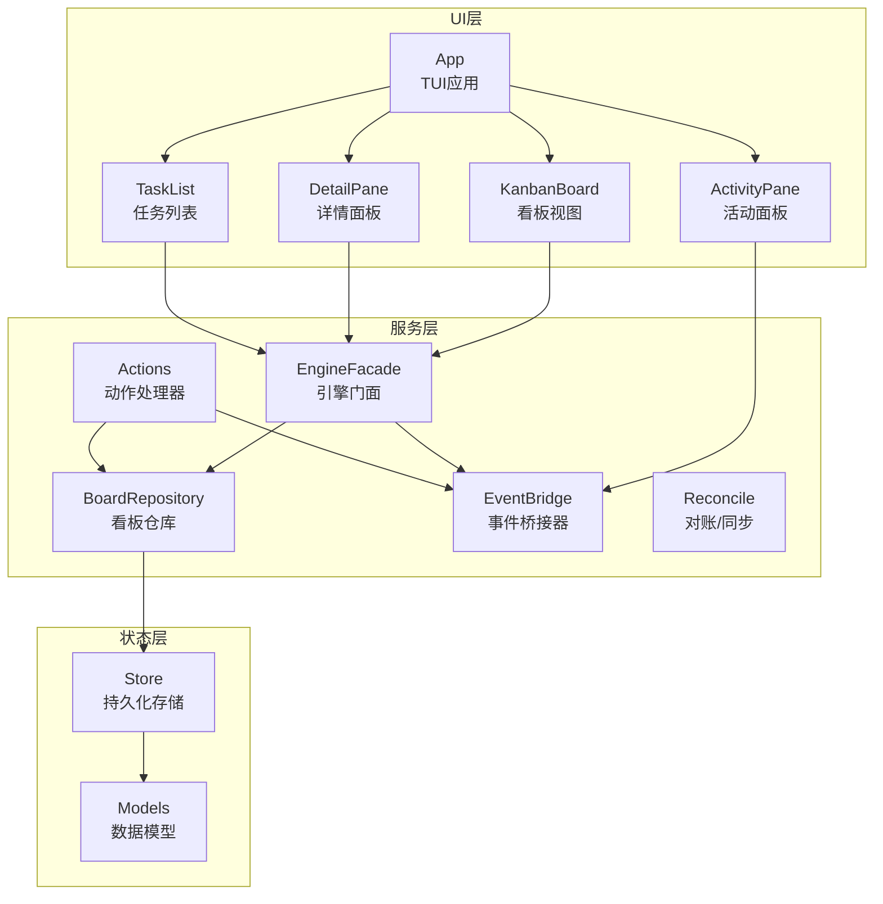
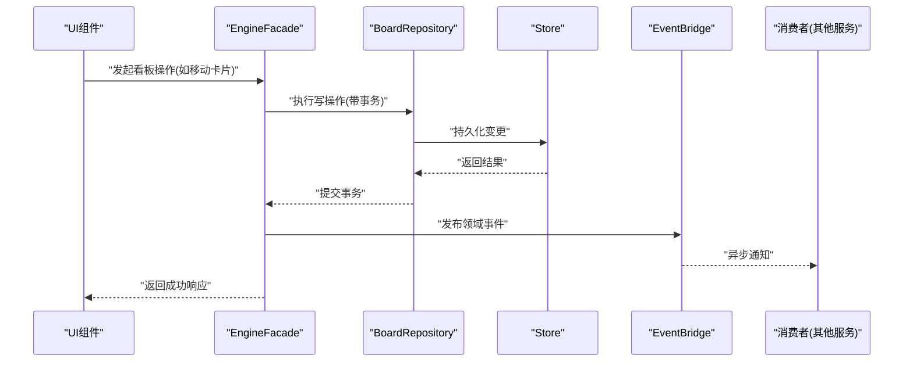
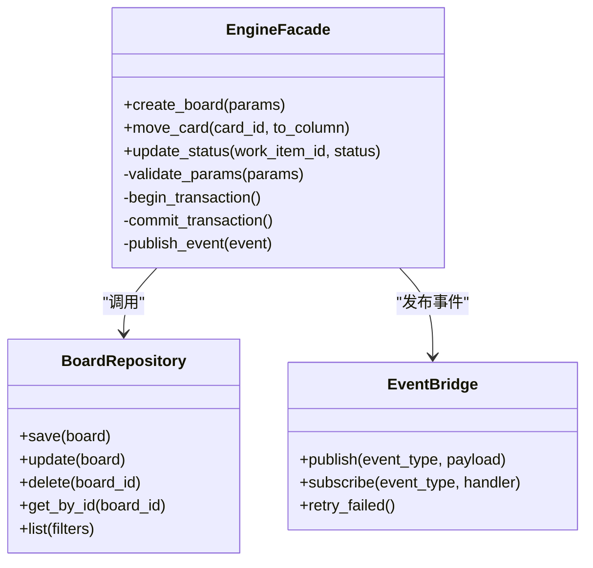
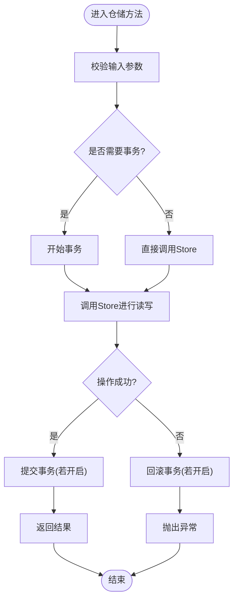
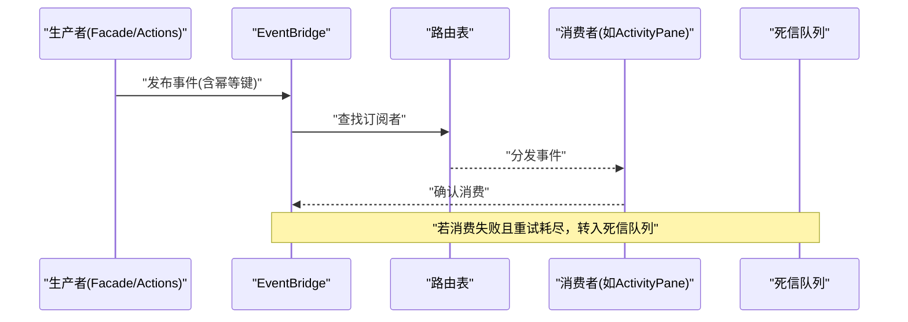
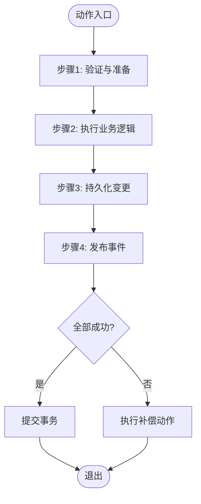
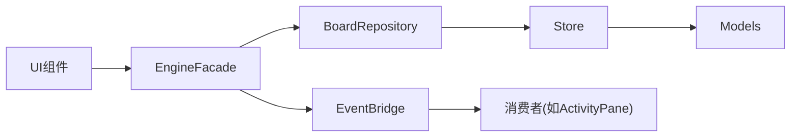

# 服务层架构

<cite>
**本文引用的文件**   
- [engine_facade.py](file://opc/plugins/cli_board/services/engine_facade.py)
- [board_repository.py](file://opc/plugins/cli_board/services/board_repository.py)
- [event_bridge.py](file://opc/plugins/cli_board/services/event_bridge.py)
- [actions.py](file://opc/plugins/cli_board/services/actions.py)
- [reconcile.py](file://opc/plugins/cli_board/services/reconcile.py)
- [models.py](file://opc/plugins/cli_board/state/models.py)
- [store.py](file://opc/plugins/cli_board/state/store.py)
- [kanban_board.py](file://opc/plugins/cli_board/widgets/kanban_board.py)
- [activity_pane.py](file://opc/plugins/cli_board/widgets/activity_pane.py)
- [detail_pane.py](file://opc/plugins/cli_board/widgets/detail_pane.py)
- [task_list.py](file://opc/plugins/cli_board/widgets/task_list.py)
- [app.py](file://opc/plugins/cli_board/tui/app.py)
</cite>

## 目录
1. [简介](#简介)
2. [项目结构](#项目结构)
3. [核心组件](#核心组件)
4. [架构总览](#架构总览)
5. [详细组件分析](#详细组件分析)
6. [依赖关系分析](#依赖关系分析)
7. [性能考虑](#性能考虑)
8. [故障排查指南](#故障排查指南)
9. [结论](#结论)
10. [附录](#附录)

## 简介
本文件面向CLI看板的服务层，聚焦以下目标：
- 解析并说明EngineFacade（引擎门面）的设计模式与API封装策略
- 阐述BoardRepository（看板仓库）的数据持久化与CRUD实现
- 解释EventBridge（事件桥接器）的事件驱动架构与消息传递机制
- 描述Actions（动作处理器）的业务编排与事务管理
- 总结错误处理、日志记录与性能优化策略
- 提供解耦与依赖注入的最佳实践

## 项目结构
CLI看板服务层位于插件目录中，采用“服务层 + 状态存储 + UI组件”的分层组织方式。服务层负责业务编排、数据访问与事件分发；状态层负责模型定义与持久化；UI组件通过服务层完成交互。

图表来源
- [engine_facade.py:1-200](file://opc/plugins/cli_board/services/engine_facade.py#L1-L200)
- [board_repository.py:1-200](file://opc/plugins/cli_board/services/board_repository.py#L1-L200)
- [event_bridge.py:1-200](file://opc/plugins/cli_board/services/event_bridge.py#L1-L200)
- [actions.py:1-200](file://opc/plugins/cli_board/services/actions.py#L1-L200)
- [reconcile.py:1-200](file://opc/plugins/cli_board/services/reconcile.py#L1-L200)
- [models.py:1-200](file://opc/plugins/cli_board/state/models.py#L1-L200)
- [store.py:1-200](file://opc/plugins/cli_board/state/store.py#L1-L200)
- [kanban_board.py:1-200](file://opc/plugins/cli_board/widgets/kanban_board.py#L1-L200)
- [activity_pane.py:1-200](file://opc/plugins/cli_board/widgets/activity_pane.py#L1-L200)
- [detail_pane.py:1-200](file://opc/plugins/cli_board/widgets/detail_pane.py#L1-L200)
- [task_list.py:1-200](file://opc/plugins/cli_board/widgets/task_list.py#L1-L200)
- [app.py:1-200](file://opc/plugins/cli_board/tui/app.py#L1-L200)

章节来源
- [engine_facade.py:1-200](file://opc/plugins/cli_board/services/engine_facade.py#L1-L200)
- [board_repository.py:1-200](file://opc/plugins/cli_board/services/board_repository.py#L1-L200)
- [event_bridge.py:1-200](file://opc/plugins/cli_board/services/event_bridge.py#L1-L200)
- [actions.py:1-200](file://opc/plugins/cli_board/services/actions.py#L1-L200)
- [reconcile.py:1-200](file://opc/plugins/cli_board/services/reconcile.py#L1-L200)
- [models.py:1-200](file://opc/plugins/cli_board/state/models.py#L1-L200)
- [store.py:1-200](file://opc/plugins/cli_board/state/store.py#L1-L200)
- [kanban_board.py:1-200](file://opc/plugins/cli_board/widgets/kanban_board.py#L1-L200)
- [activity_pane.py:1-200](file://opc/plugins/cli_board/widgets/activity_pane.py#L1-L200)
- [detail_pane.py:1-200](file://opc/plugins/cli_board/widgets/detail_pane.py#L1-L200)
- [task_list.py:1-200](file://opc/plugins/cli_board/widgets/task_list.py#L1-L200)
- [app.py:1-200](file://opc/plugins/cli_board/tui/app.py#L1-L200)

## 核心组件
本节概述各服务组件的职责与协作关系，为后续深入分析奠定基础。

- EngineFacade（引擎门面）
  - 职责：对外暴露统一的看板操作API，屏蔽底层仓储与事件细节，协调跨域调用与事务边界
  - 设计模式：门面模式、命令模式（将用户意图封装为可执行命令）、事务边界封装
  - API封装策略：按领域能力聚合接口（如创建看板、移动卡片、更新状态），内部组合仓储与事件

- BoardRepository（看板仓库）
  - 职责：看板的CRUD与查询，保证数据一致性，抽象持久化细节
  - 实现要点：读写分离、乐观锁或版本号控制、批量操作、索引优化

- EventBridge（事件桥接器）
  - 职责：发布/订阅事件总线，解耦生产者和消费者，支持异步处理
  - 机制：事件类型定义、路由表、重试与死信队列、幂等键

- Actions（动作处理器）
  - 职责：编排复杂业务流程，协调多个仓储与事件，确保事务性
  - 事务管理：本地事务或分布式事务边界，补偿与回滚策略

- Reconcile（对账/同步）
  - 职责：周期性或触发式同步外部状态与服务内状态，修复不一致

章节来源
- [engine_facade.py:1-200](file://opc/plugins/cli_board/services/engine_facade.py#L1-L200)
- [board_repository.py:1-200](file://opc/plugins/cli_board/services/board_repository.py#L1-L200)
- [event_bridge.py:1-200](file://opc/plugins/cli_board/services/event_bridge.py#L1-L200)
- [actions.py:1-200](file://opc/plugins/cli_board/services/actions.py#L1-L200)
- [reconcile.py:1-200](file://opc/plugins/cli_board/services/reconcile.py#L1-L200)

## 架构总览
下图展示了从UI到服务层再到状态层的完整请求流，以及事件驱动的异步路径。

图表来源
- [engine_facade.py:1-200](file://opc/plugins/cli_board/services/engine_facade.py#L1-L200)
- [board_repository.py:1-200](file://opc/plugins/cli_board/services/board_repository.py#L1-L200)
- [event_bridge.py:1-200](file://opc/plugins/cli_board/services/event_bridge.py#L1-L200)
- [store.py:1-200](file://opc/plugins/cli_board/state/store.py#L1-L200)

## 详细组件分析

### EngineFacade（引擎门面）
- 设计模式
  - 门面模式：统一入口，简化调用复杂度
  - 命令模式：将用户意图转换为可追踪的命令对象
  - 事务边界：在Facade层开启/提交事务，确保一致性
- API封装策略
  - 按领域聚合接口，避免直接暴露仓储方法
  - 参数校验与默认值填充前置
  - 返回值标准化，包含必要上下文与追踪ID
- 典型流程
  - 接收UI请求 -> 参数校验 -> 打开事务 -> 调用仓储 -> 发布事件 -> 提交事务 -> 返回结果

图表来源
- [engine_facade.py:1-200](file://opc/plugins/cli_board/services/engine_facade.py#L1-L200)
- [board_repository.py:1-200](file://opc/plugins/cli_board/services/board_repository.py#L1-L200)
- [event_bridge.py:1-200](file://opc/plugins/cli_board/services/event_bridge.py#L1-L200)

章节来源
- [engine_facade.py:1-200](file://opc/plugins/cli_board/services/engine_facade.py#L1-L200)

### BoardRepository（看板仓库）
- 职责
  - 提供看板的CRUD与查询能力
  - 封装持久化细节，向上层屏蔽存储差异
- 关键实现
  - 使用Store进行数据存取
  - 支持过滤、分页与排序
  - 并发安全：版本字段或CAS操作
- 数据模型
  - 与state/models.py中的实体对应，保持强类型约束

图表来源
- [board_repository.py:1-200](file://opc/plugins/cli_board/services/board_repository.py#L1-L200)
- [store.py:1-200](file://opc/plugins/cli_board/state/store.py#L1-L200)
- [models.py:1-200](file://opc/plugins/cli_board/state/models.py#L1-L200)

章节来源
- [board_repository.py:1-200](file://opc/plugins/cli_board/services/board_repository.py#L1-L200)
- [store.py:1-200](file://opc/plugins/cli_board/state/store.py#L1-L200)
- [models.py:1-200](file://opc/plugins/cli_board/state/models.py#L1-L200)

### EventBridge（事件桥接器）
- 架构
  - 发布/订阅模型，解耦生产者与消费者
  - 支持同步与异步两种投递方式
- 消息传递机制
  - 事件类型注册与路由
  - 幂等键去重，防止重复消费
  - 失败重试与死信队列
- 与UI的联动
  - ActivityPane监听活动事件，实时更新界面

图表来源
- [event_bridge.py:1-200](file://opc/plugins/cli_board/services/event_bridge.py#L1-L200)
- [activity_pane.py:1-200](file://opc/plugins/cli_board/widgets/activity_pane.py#L1-L200)

章节来源
- [event_bridge.py:1-200](file://opc/plugins/cli_board/services/event_bridge.py#L1-L200)
- [activity_pane.py:1-200](file://opc/plugins/cli_board/widgets/activity_pane.py#L1-L200)

### Actions（动作处理器）
- 业务编排
  - 将复杂流程拆分为步骤，每步可独立测试与重试
  - 协调多个仓储与事件，确保最终一致性
- 事务管理
  - 在动作入口处开启事务，异常时统一回滚
  - 补偿动作用于部分失败的恢复
- 与Facade的关系
  - Facade作为入口，Actions作为具体实现，遵循单一职责

图表来源
- [actions.py:1-200](file://opc/plugins/cli_board/services/actions.py#L1-L200)
- [engine_facade.py:1-200](file://opc/plugins/cli_board/services/engine_facade.py#L1-L200)

章节来源
- [actions.py:1-200](file://opc/plugins/cli_board/services/actions.py#L1-L200)
- [engine_facade.py:1-200](file://opc/plugins/cli_board/services/engine_facade.py#L1-L200)

### Reconcile（对账/同步）
- 职责
  - 定期扫描不一致状态，触发修复流程
  - 与外部系统状态对齐，保证最终一致
- 触发方式
  - 定时任务或事件驱动
  - 手动触发用于运维场景

章节来源
- [reconcile.py:1-200](file://opc/plugins/cli_board/services/reconcile.py#L1-L200)

### UI组件与服务层集成
- KanbanBoard、DetailPane、TaskList通过Facade调用服务层
- ActivityPane订阅事件，实时刷新
- App作为TUI应用入口，组装各组件

章节来源
- [kanban_board.py:1-200](file://opc/plugins/cli_board/widgets/kanban_board.py#L1-L200)
- [detail_pane.py:1-200](file://opc/plugins/cli_board/widgets/detail_pane.py#L1-L200)
- [task_list.py:1-200](file://opc/plugins/cli_board/widgets/task_list.py#L1-L200)
- [activity_pane.py:1-200](file://opc/plugins/cli_board/widgets/activity_pane.py#L1-L200)
- [app.py:1-200](file://opc/plugins/cli_board/tui/app.py#L1-L200)

## 依赖关系分析
服务层内部依赖清晰，UI层仅依赖Facade，仓储依赖Store，事件桥接器独立于业务逻辑。

图表来源
- [engine_facade.py:1-200](file://opc/plugins/cli_board/services/engine_facade.py#L1-L200)
- [board_repository.py:1-200](file://opc/plugins/cli_board/services/board_repository.py#L1-L200)
- [event_bridge.py:1-200](file://opc/plugins/cli_board/services/event_bridge.py#L1-L200)
- [store.py:1-200](file://opc/plugins/cli_board/state/store.py#L1-L200)
- [models.py:1-200](file://opc/plugins/cli_board/state/models.py#L1-L200)
- [activity_pane.py:1-200](file://opc/plugins/cli_board/widgets/activity_pane.py#L1-L200)

章节来源
- [engine_facade.py:1-200](file://opc/plugins/cli_board/services/engine_facade.py#L1-L200)
- [board_repository.py:1-200](file://opc/plugins/cli_board/services/board_repository.py#L1-L200)
- [event_bridge.py:1-200](file://opc/plugins/cli_board/services/event_bridge.py#L1-L200)
- [store.py:1-200](file://opc/plugins/cli_board/state/store.py#L1-L200)
- [models.py:1-200](file://opc/plugins/cli_board/state/models.py#L1-L200)
- [activity_pane.py:1-200](file://opc/plugins/cli_board/widgets/activity_pane.py#L1-L200)

## 性能考虑
- 批量操作：仓储层支持批量写入，减少往返开销
- 缓存策略：热点数据缓存，注意失效策略
- 异步处理：非关键路径使用事件异步化
- 连接池：数据库连接复用，避免频繁创建销毁
- 监控指标：记录关键操作的耗时与错误率

[本节为通用指导，不直接分析具体文件]

## 故障排查指南
- 常见问题
  - 事件未消费：检查路由表与订阅者注册
  - 事务冲突：查看版本字段与重试策略
  - 死信队列堆积：分析失败原因并人工干预
- 定位手段
  - 增加结构化日志，包含追踪ID
  - 使用对账工具快速发现不一致
  - 单元测试覆盖关键路径

章节来源
- [event_bridge.py:1-200](file://opc/plugins/cli_board/services/event_bridge.py#L1-L200)
- [reconcile.py:1-200](file://opc/plugins/cli_board/services/reconcile.py#L1-L200)

## 结论
本服务层通过门面模式、仓储抽象与事件驱动实现了高内聚、低耦合的架构。EngineFacade统一入口，BoardRepository专注数据访问，EventBridge解耦异步通信，Actions保障业务编排与事务性。配合合理的错误处理、日志与性能优化策略，系统具备良好的可维护性与扩展性。

[本节为总结，不直接分析具体文件]

## 附录
- 最佳实践
  - 依赖注入：在服务初始化时注入仓储与事件桥接器
  - 解耦：UI仅依赖Facade，避免直接访问仓储
  - 幂等：事件携带唯一键，防止重复处理
  - 可观测性：关键路径埋点，便于问题定位

[本节为补充内容，不直接分析具体文件]