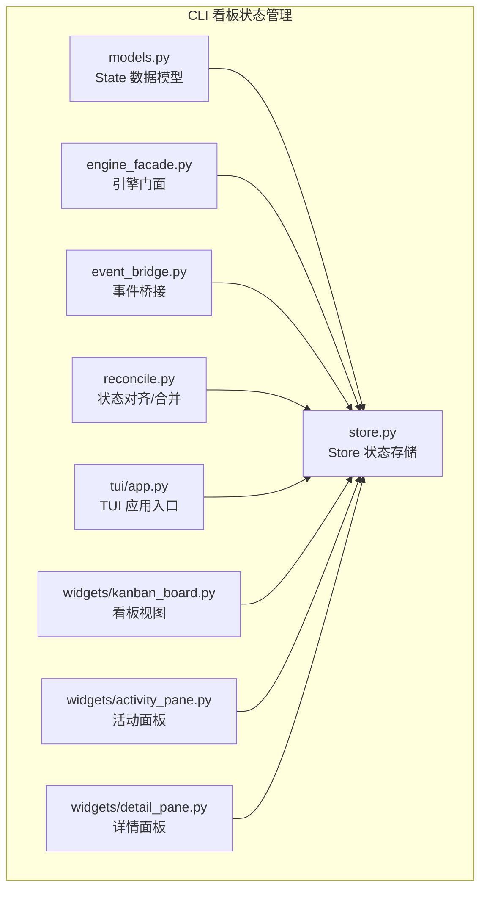
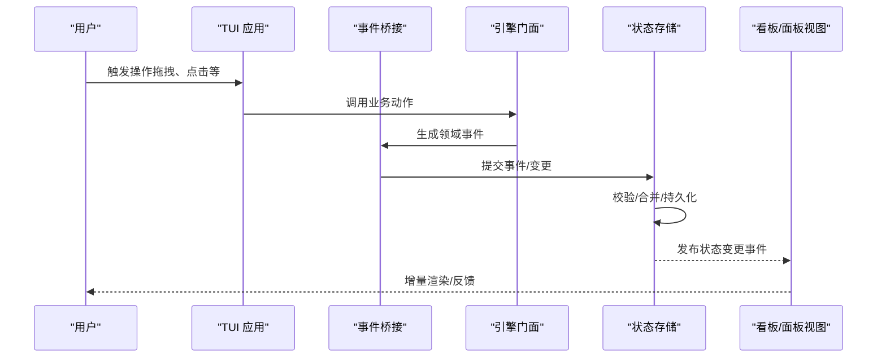
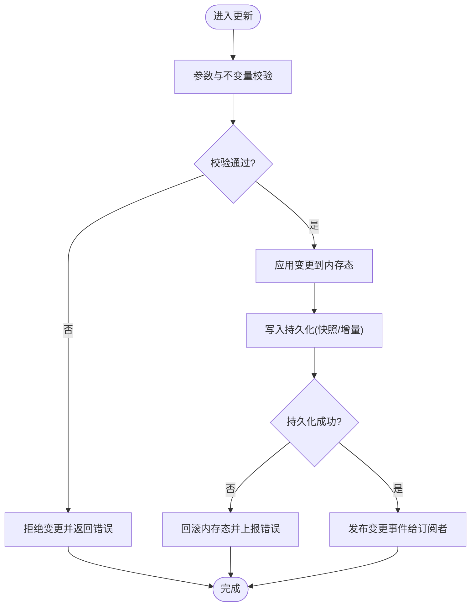
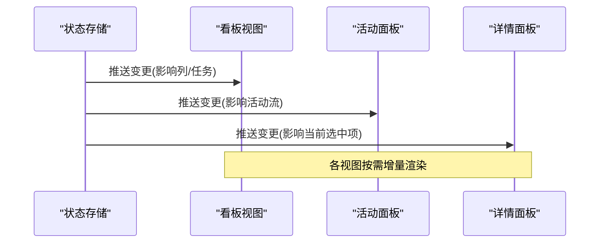
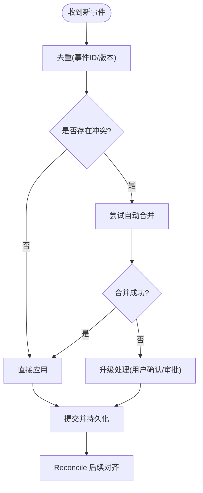
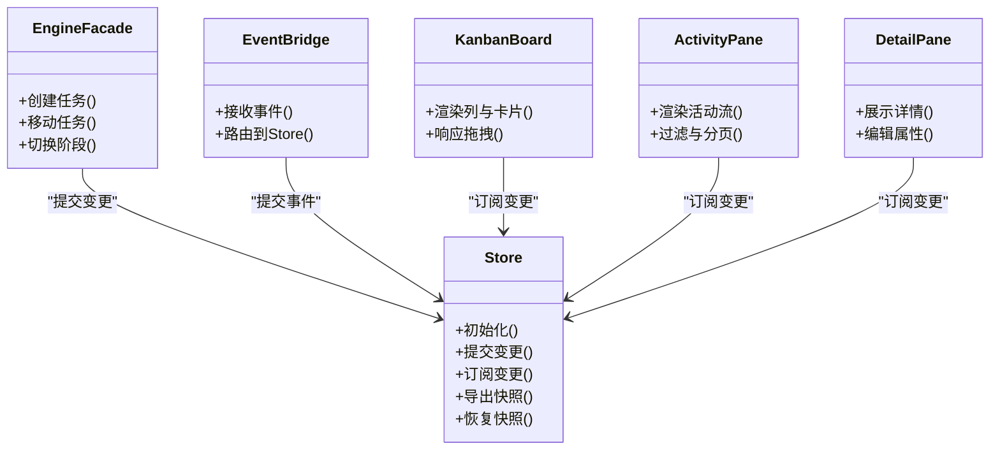
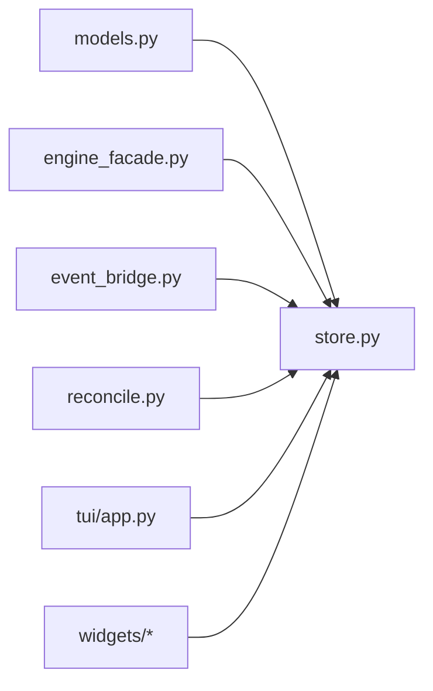

# 状态管理

<cite>
**本文引用的文件**   
- [opc/plugins/cli_board/state/models.py](file://opc/plugins/cli_board/state/models.py)
- [opc/plugins/cli_board/state/store.py](file://opc/plugins/cli_board/state/store.py)
- [opc/plugins/cli_board/services/engine_facade.py](file://opc/plugins/cli_board/services/engine_facade.py)
- [opc/plugins/cli_board/services/event_bridge.py](file://opc/plugins/cli_board/services/event_bridge.py)
- [opc/plugins/cli_board/services/reconcile.py](file://opc/plugins/cli_board/services/reconcile.py)
- [opc/plugins/cli_board/tui/app.py](file://opc/plugins/cli_board/tui/app.py)
- [opc/plugins/cli_board/widgets/kanban_board.py](file://opc/plugins/cli_board/widgets/kanban_board.py)
- [opc/plugins/cli_board/widgets/activity_pane.py](file://opc/plugins/cli_board/widgets/activity_pane.py)
- [opc/plugins/cli_board/widgets/detail_pane.py](file://opc/plugins/cli_board/widgets/detail_pane.py)
- [tests/cli_board/test_board_state.py](file://tests/cli_board/test_board_state.py)
</cite>

## 目录
1. [简介](#简介)
2. [项目结构](#项目结构)
3. [核心组件](#核心组件)
4. [架构总览](#架构总览)
5. [详细组件分析](#详细组件分析)
6. [依赖关系分析](#依赖关系分析)
7. [性能考虑](#性能考虑)
8. [故障排查指南](#故障排查指南)
9. [结论](#结论)
10. [附录](#附录)

## 简介
本技术文档聚焦于 CLI 看板的状态管理系统，围绕 State 模型与 Store（状态存储）的设计与实现展开。内容涵盖：
- State 模型的数据结构与职责边界
- Store 的初始化、更新机制与持久化策略
- 状态变更监听与响应式更新流程
- 多源状态同步与冲突解决策略
- 最佳实践与性能优化技巧
- 调试与测试方法

目标读者包括后端与前端开发者、TUI 界面维护者以及需要扩展或集成 CLI 看板的工程师。

## 项目结构
CLI 看板的状态管理位于插件模块内，关键目录与文件如下：
- 状态模型与存储：state/models.py、state/store.py
- 服务层桥接：services/engine_facade.py、services/event_bridge.py、services/reconcile.py
- TUI 应用与视图：tui/app.py、widgets/kanban_board.py、widgets/activity_pane.py、widgets/detail_pane.py
- 测试用例：tests/cli_board/test_board_state.py

图表来源
- [opc/plugins/cli_board/state/models.py](file://opc/plugins/cli_board/state/models.py)
- [opc/plugins/cli_board/state/store.py](file://opc/plugins/cli_board/state/store.py)
- [opc/plugins/cli_board/services/engine_facade.py](file://opc/plugins/cli_board/services/engine_facade.py)
- [opc/plugins/cli_board/services/event_bridge.py](file://opc/plugins/cli_board/services/event_bridge.py)
- [opc/plugins/cli_board/services/reconcile.py](file://opc/plugins/cli_board/services/reconcile.py)
- [opc/plugins/cli_board/tui/app.py](file://opc/plugins/cli_board/tui/app.py)
- [opc/plugins/cli_board/widgets/kanban_board.py](file://opc/plugins/cli_board/widgets/kanban_board.py)
- [opc/plugins/cli_board/widgets/activity_pane.py](file://opc/plugins/cli_board/widgets/activity_pane.py)
- [opc/plugins/cli_board/widgets/detail_pane.py](file://opc/plugins/cli_board/widgets/detail_pane.py)

章节来源
- [opc/plugins/cli_board/state/models.py](file://opc/plugins/cli_board/state/models.py)
- [opc/plugins/cli_board/state/store.py](file://opc/plugins/cli_board/state/store.py)
- [opc/plugins/cli_board/services/engine_facade.py](file://opc/plugins/cli_board/services/engine_facade.py)
- [opc/plugins/cli_board/services/event_bridge.py](file://opc/plugins/cli_board/services/event_bridge.py)
- [opc/plugins/cli_board/services/reconcile.py](file://opc/plugins/cli_board/services/reconcile.py)
- [opc/plugins/cli_board/tui/app.py](file://opc/plugins/cli_board/tui/app.py)
- [opc/plugins/cli_board/widgets/kanban_board.py](file://opc/plugins/cli_board/widgets/kanban_board.py)
- [opc/plugins/cli_board/widgets/activity_pane.py](file://opc/plugins/cli_board/widgets/activity_pane.py)
- [opc/plugins/cli_board/widgets/detail_pane.py](file://opc/plugins/cli_board/widgets/detail_pane.py)

## 核心组件
- State 模型：定义看板领域对象的结构与约束，如任务、列、工作项等实体的字段、枚举与关联关系。
- Store：集中持有并管理 State，提供原子更新、批量操作、快照与恢复、持久化读写、变更订阅与发布能力。
- 服务层：
  - EngineFacade：封装对底层引擎的调用，将业务动作转换为状态变更事件。
  - EventBridge：统一接收外部事件（如引擎推送、用户交互），路由到 Store 进行状态更新。
  - Reconcile：负责多源状态对齐、去重与冲突解决，保证最终一致性。
- TUI 视图：通过订阅 Store 的变更事件，驱动 UI 增量渲染与局部刷新。

章节来源
- [opc/plugins/cli_board/state/models.py](file://opc/plugins/cli_board/state/models.py)
- [opc/plugins/cli_board/state/store.py](file://opc/plugins/cli_board/state/store.py)
- [opc/plugins/cli_board/services/engine_facade.py](file://opc/plugins/cli_board/services/engine_facade.py)
- [opc/plugins/cli_board/services/event_bridge.py](file://opc/plugins/cli_board/services/event_bridge.py)
- [opc/plugins/cli_board/services/reconcile.py](file://opc/plugins/cli_board/services/reconcile.py)

## 架构总览
下图展示了从外部事件到状态更新再到 UI 渲染的整体流程。

图表来源
- [opc/plugins/cli_board/services/event_bridge.py](file://opc/plugins/cli_board/services/event_bridge.py)
- [opc/plugins/cli_board/services/engine_facade.py](file://opc/plugins/cli_board/services/engine_facade.py)
- [opc/plugins/cli_board/state/store.py](file://opc/plugins/cli_board/state/store.py)
- [opc/plugins/cli_board/tui/app.py](file://opc/plugins/cli_board/tui/app.py)
- [opc/plugins/cli_board/widgets/kanban_board.py](file://opc/plugins/cli_board/widgets/kanban_board.py)

## 详细组件分析

### State 模型设计
- 实体与关系
  - 任务/工作项：包含唯一标识、标题、描述、阶段、优先级、创建/更新时间戳、关联会话等字段。
  - 列/泳道：表示看板列，包含列标识、名称、排序、包含的任务集合。
  - 会话/上下文：用于承载对话历史、上下文摘要、可见性控制等。
- 约束与不变量
  - 唯一性：ID 全局唯一；同一列内任务不重复。
  - 状态机：任务阶段转换需满足预置规则（如仅允许向前推进）。
  - 完整性：外键引用必须存在，删除级联策略明确。
- 复杂度与可扩展性
  - 采用不可变快照或版本化字段，便于审计与回滚。
  - 预留扩展点以支持自定义元数据与标签体系。

章节来源
- [opc/plugins/cli_board/state/models.py](file://opc/plugins/cli_board/state/models.py)

### Store（状态存储）实现原理
- 初始化
  - 加载默认配置与种子数据。
  - 从持久化介质恢复最近快照，重建内存态。
- 更新机制
  - 原子事务：单次提交包含多个变更，要么全部成功，要么全部回滚。
  - 变更日志：记录每次变更的入参与时间戳，支持回放与审计。
  - 幂等处理：基于事件 ID 或版本号避免重复应用。
- 持久化策略
  - 快照+增量：定期全量快照 + 增量日志，启动时快速恢复。
  - 落盘时机：在事务提交成功后异步落盘，降低主路径延迟。
  - 压缩与清理：按策略归档旧日志，保留必要窗口期。
- 并发与一致性
  - 写锁串行化：单写线程顺序执行变更，避免竞态。
  - 读多写少：读取可并发，必要时使用只读副本视图。
- 错误处理
  - 异常分类：校验失败、持久化失败、冲突检测失败等。
  - 恢复策略：重试、降级为只读模式、告警与人工介入。

图表来源
- [opc/plugins/cli_board/state/store.py](file://opc/plugins/cli_board/state/store.py)

章节来源
- [opc/plugins/cli_board/state/store.py](file://opc/plugins/cli_board/state/store.py)

### 状态变更监听与响应式更新
- 订阅模型
  - Store 暴露订阅接口，视图按需订阅感兴趣的路径或实体。
  - 支持细粒度路径匹配与批量订阅，减少无关通知。
- 事件分发
  - 变更事件携带差异信息（新增/修改/删除）与受影响实体列表。
  - 视图侧根据差异进行最小化重绘，避免整屏刷新。
- 背压与节流
  - 高频变更场景下，视图端可对渲染进行节流或批处理。
  - Store 侧可合并相邻同类型变更以降低事件风暴。

图表来源
- [opc/plugins/cli_board/state/store.py](file://opc/plugins/cli_board/state/store.py)
- [opc/plugins/cli_board/widgets/kanban_board.py](file://opc/plugins/cli_board/widgets/kanban_board.py)
- [opc/plugins/cli_board/widgets/activity_pane.py](file://opc/plugins/cli_board/widgets/activity_pane.py)
- [opc/plugins/cli_board/widgets/detail_pane.py](file://opc/plugins/cli_board/widgets/detail_pane.py)

章节来源
- [opc/plugins/cli_board/state/store.py](file://opc/plugins/cli_board/state/store.py)
- [opc/plugins/cli_board/widgets/kanban_board.py](file://opc/plugins/cli_board/widgets/kanban_board.py)
- [opc/plugins/cli_board/widgets/activity_pane.py](file://opc/plugins/cli_board/widgets/activity_pane.py)
- [opc/plugins/cli_board/widgets/detail_pane.py](file://opc/plugins/cli_board/widgets/detail_pane.py)

### 状态同步与冲突解决策略
- 多源输入
  - 引擎侧事件、用户操作、外部系统回调可能同时到达。
- 冲突检测
  - 基于版本号/时间戳/事件 ID 判断是否覆盖。
  - 领域不变量检查（如阶段转换合法性）作为强约束。
- 解决策略
  - 乐观合并：优先接受最新事件，若冲突则尝试自动合并。
  - 协商合并：无法自动合并时，提示用户选择或走审批流程。
  - 回退策略：当合并失败且无安全回退路径时，冻结相关实体并告警。
- 最终一致性
  - 通过 Reconcile 周期性扫描不一致片段，逐步修复。

图表来源
- [opc/plugins/cli_board/services/reconcile.py](file://opc/plugins/cli_board/services/reconcile.py)
- [opc/plugins/cli_board/state/store.py](file://opc/plugins/cli_board/state/store.py)

章节来源
- [opc/plugins/cli_board/services/reconcile.py](file://opc/plugins/cli_board/services/reconcile.py)
- [opc/plugins/cli_board/state/store.py](file://opc/plugins/cli_board/state/store.py)

### 服务层与 TUI 集成
- EngineFacade
  - 将高层业务动作（创建任务、移动卡片、切换阶段）转换为领域事件。
  - 负责调用底层引擎 API，并将结果映射为 Store 可消费的变更。
- EventBridge
  - 统一接入点，负责鉴权、限流、序列化与路由。
  - 将外部事件标准化后提交至 Store。
- TUI 应用
  - 启动时连接 Store，注册视图订阅。
  - 捕获用户交互，委托给 EngineFacade 发起变更。

图表来源
- [opc/plugins/cli_board/state/store.py](file://opc/plugins/cli_board/state/store.py)
- [opc/plugins/cli_board/services/engine_facade.py](file://opc/plugins/cli_board/services/engine_facade.py)
- [opc/plugins/cli_board/services/event_bridge.py](file://opc/plugins/cli_board/services/event_bridge.py)
- [opc/plugins/cli_board/widgets/kanban_board.py](file://opc/plugins/cli_board/widgets/kanban_board.py)
- [opc/plugins/cli_board/widgets/activity_pane.py](file://opc/plugins/cli_board/widgets/activity_pane.py)
- [opc/plugins/cli_board/widgets/detail_pane.py](file://opc/plugins/cli_board/widgets/detail_pane.py)

章节来源
- [opc/plugins/cli_board/services/engine_facade.py](file://opc/plugins/cli_board/services/engine_facade.py)
- [opc/plugins/cli_board/services/event_bridge.py](file://opc/plugins/cli_board/services/event_bridge.py)
- [opc/plugins/cli_board/tui/app.py](file://opc/plugins/cli_board/tui/app.py)
- [opc/plugins/cli_board/widgets/kanban_board.py](file://opc/plugins/cli_board/widgets/kanban_board.py)
- [opc/plugins/cli_board/widgets/activity_pane.py](file://opc/plugins/cli_board/widgets/activity_pane.py)
- [opc/plugins/cli_board/widgets/detail_pane.py](file://opc/plugins/cli_board/widgets/detail_pane.py)

## 依赖关系分析
- 内部依赖
  - Store 依赖 models 提供的数据结构与校验逻辑。
  - 服务层依赖 Store 的提交与查询接口。
  - TUI 视图依赖 Store 的订阅接口进行增量渲染。
- 外部依赖
  - 持久化介质（文件系统/数据库）由 Store 抽象，便于替换实现。
  - 引擎 API 由 EngineFacade 封装，屏蔽底层差异。

图表来源
- [opc/plugins/cli_board/state/models.py](file://opc/plugins/cli_board/state/models.py)
- [opc/plugins/cli_board/state/store.py](file://opc/plugins/cli_board/state/store.py)
- [opc/plugins/cli_board/services/engine_facade.py](file://opc/plugins/cli_board/services/engine_facade.py)
- [opc/plugins/cli_board/services/event_bridge.py](file://opc/plugins/cli_board/services/event_bridge.py)
- [opc/plugins/cli_board/services/reconcile.py](file://opc/plugins/cli_board/services/reconcile.py)
- [opc/plugins/cli_board/tui/app.py](file://opc/plugins/cli_board/tui/app.py)
- [opc/plugins/cli_board/widgets/kanban_board.py](file://opc/plugins/cli_board/widgets/kanban_board.py)
- [opc/plugins/cli_board/widgets/activity_pane.py](file://opc/plugins/cli_board/widgets/activity_pane.py)
- [opc/plugins/cli_board/widgets/detail_pane.py](file://opc/plugins/cli_board/widgets/detail_pane.py)

章节来源
- [opc/plugins/cli_board/state/models.py](file://opc/plugins/cli_board/state/models.py)
- [opc/plugins/cli_board/state/store.py](file://opc/plugins/cli_board/state/store.py)
- [opc/plugins/cli_board/services/engine_facade.py](file://opc/plugins/cli_board/services/engine_facade.py)
- [opc/plugins/cli_board/services/event_bridge.py](file://opc/plugins/cli_board/services/event_bridge.py)
- [opc/plugins/cli_board/services/reconcile.py](file://opc/plugins/cli_board/services/reconcile.py)
- [opc/plugins/cli_board/tui/app.py](file://opc/plugins/cli_board/tui/app.py)
- [opc/plugins/cli_board/widgets/kanban_board.py](file://opc/plugins/cli_board/widgets/kanban_board.py)
- [opc/plugins/cli_board/widgets/activity_pane.py](file://opc/plugins/cli_board/widgets/activity_pane.py)
- [opc/plugins/cli_board/widgets/detail_pane.py](file://opc/plugins/cli_board/widgets/detail_pane.py)

## 性能考虑
- 变更批处理
  - 将短时间内的多次小变更合并为一次提交，减少持久化与事件分发开销。
- 增量渲染
  - 视图仅重绘受影响的区域，避免整屏刷新。
- 懒加载与分页
  - 大列表采用分页与虚拟滚动，按需加载详情。
- 快照与日志
  - 合理设置快照频率与日志保留窗口，平衡启动时间与磁盘占用。
- 并发控制
  - 写串行化，读并行；热点数据可引入只读缓存。
- 背压与节流
  - 在高吞吐场景下，对事件分发与 UI 渲染进行节流，防止卡顿。

[本节为通用指导，无需特定文件来源]

## 故障排查指南
- 常见问题定位
  - 状态不同步：检查事件桥接是否正确路由，Store 是否成功持久化。
  - 冲突频繁：查看冲突检测与合并策略，确认版本号/时间戳是否一致。
  - UI 不更新：确认订阅路径是否匹配，是否存在事件丢失或重复消费。
- 诊断手段
  - 启用变更日志回放，复现问题路径。
  - 导出快照与增量日志，离线分析。
  - 在关键路径增加结构化日志与指标埋点。
- 恢复策略
  - 从最近快照恢复，再回放增量日志。
  - 对损坏实体进行隔离与人工修复。

章节来源
- [opc/plugins/cli_board/state/store.py](file://opc/plugins/cli_board/state/store.py)
- [opc/plugins/cli_board/services/reconcile.py](file://opc/plugins/cli_board/services/reconcile.py)

## 结论
CLI 看板的状态管理以 State 模型为核心，Store 提供原子更新、持久化与订阅能力，配合服务层的事件桥接与冲突解决，形成高内聚、低耦合的状态中枢。通过合理的变更批处理、增量渲染与快照策略，可在保证一致性的同时获得良好的性能表现。完善的调试与测试方法有助于快速定位问题并保障质量。

[本节为总结性内容，无需特定文件来源]

## 附录
- 最佳实践
  - 明确领域不变量，并在 Store 中强制执行。
  - 事件命名与结构遵循约定，便于追踪与回放。
  - 为关键路径编写单元测试与集成测试，覆盖正常与异常分支。
- 测试方法
  - 使用测试夹具构造初始状态，断言变更后的期望结果。
  - 模拟外部事件，验证冲突解决与恢复流程。
  - 对 UI 渲染进行端到端冒烟测试，确保订阅链路畅通。

章节来源
- [tests/cli_board/test_board_state.py](file://tests/cli_board/test_board_state.py)