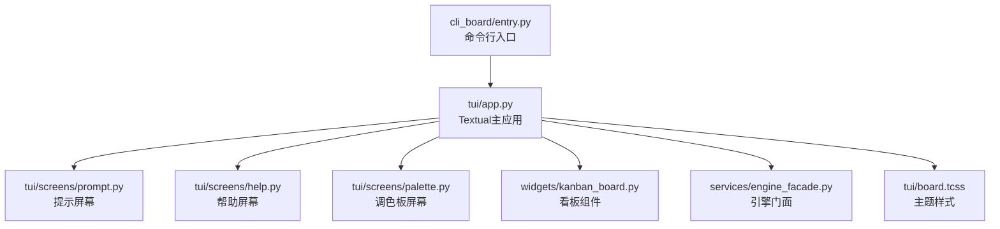
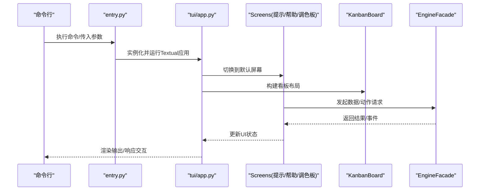
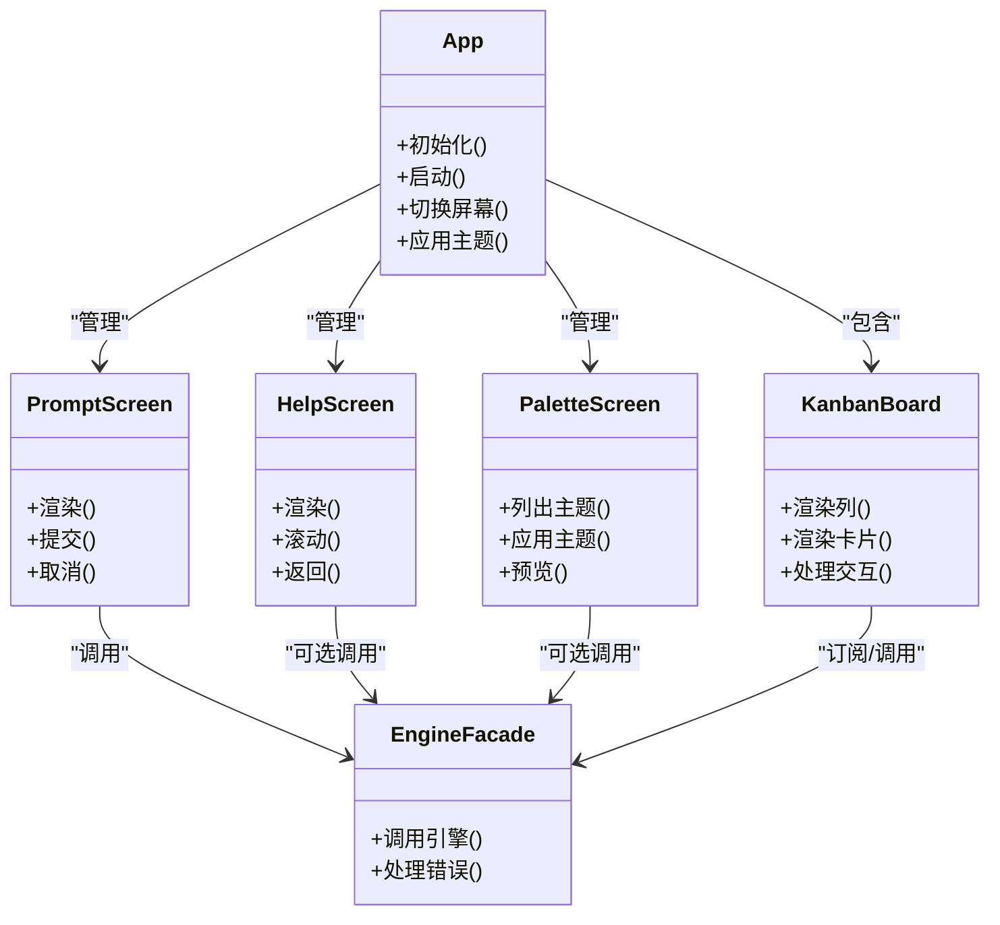
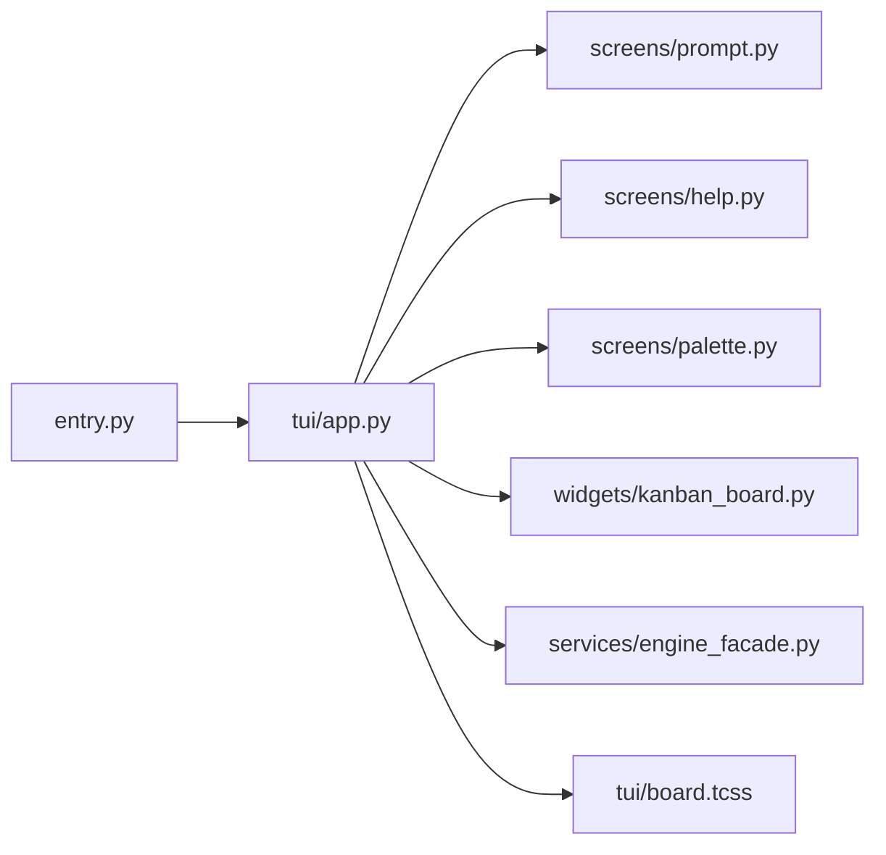

# 终端界面

<cite>
**本文引用的文件**   
- [opc/plugins/cli_board/entry.py](file://opc/plugins/cli_board/entry.py)
- [opc/plugins/cli_board/tui/app.py](file://opc/plugins/cli_board/tui/app.py)
- [opc/plugins/cli_board/tui/screens/prompt.py](file://opc/plugins/cli_board/tui/screens/prompt.py)
- [opc/plugins/cli_board/tui/screens/help.py](file://opc/plugins/cli_board/tui/screens/help.py)
- [opc/plugins/cli_board/tui/screens/palette.py](file://opc/plugins/cli_board/tui/screens/palette.py)
- [opc/plugins/cli_board/tui/board.tcss](file://opc/plugins/cli_board/tui/board.tcss)
- [opc/plugins/cli_board/widgets/kanban_board.py](file://opc/plugins/cli_board/widgets/kanban_board.py)
- [opc/plugins/cli_board/services/engine_facade.py](file://opc/plugins/cli_board/services/engine_facade.py)
</cite>

## 目录
1. [简介](#简介)
2. [项目结构](#项目结构)
3. [核心组件](#核心组件)
4. [架构总览](#架构总览)
5. [详细组件分析](#详细组件分析)
6. [依赖关系分析](#依赖关系分析)
7. [性能考虑](#性能考虑)
8. [故障排查指南](#故障排查指南)
9. [结论](#结论)
10. [附录](#附录)

## 简介
本文件面向CLI看板的终端界面，提供基于Textual框架构建的终端应用的使用与开发文档。内容涵盖：
- 主应用App的初始化与生命周期管理
- 屏幕（Screen）设计：PromptScreen、HelpScreen、PaletteScreen
- 用户交互模式：键盘快捷键与鼠标支持
- 主题定制与样式配置
- 终端兼容性注意事项
- 性能优化建议

## 项目结构
CLI看板终端界面位于插件模块中，采用“入口 + TUI + 服务 + 组件”的分层组织方式：
- 入口层：负责命令行参数解析与应用启动
- TUI层：基于Textual的主应用与多个Screen
- 服务层：封装业务逻辑与外部引擎交互
- 组件层：可复用的UI控件（看板、面板、状态栏等）
- 样式层：Textual CSS主题文件

图表来源
- [opc/plugins/cli_board/entry.py](file://opc/plugins/cli_board/entry.py)
- [opc/plugins/cli_board/tui/app.py](file://opc/plugins/cli_board/tui/app.py)
- [opc/plugins/cli_board/tui/screens/prompt.py](file://opc/plugins/cli_board/tui/screens/prompt.py)
- [opc/plugins/cli_board/tui/screens/help.py](file://opc/plugins/cli_board/tui/screens/help.py)
- [opc/plugins/cli_board/tui/screens/palette.py](file://opc/plugins/cli_board/tui/screens/palette.py)
- [opc/plugins/cli_board/widgets/kanban_board.py](file://opc/plugins/cli_board/widgets/kanban_board.py)
- [opc/plugins/cli_board/services/engine_facade.py](file://opc/plugins/cli_board/services/engine_facade.py)
- [opc/plugins/cli_board/tui/board.tcss](file://opc/plugins/cli_board/tui/board.tcss)

章节来源
- [opc/plugins/cli_board/entry.py](file://opc/plugins/cli_board/entry.py)
- [opc/plugins/cli_board/tui/app.py](file://opc/plugins/cli_board/tui/app.py)

## 核心组件
- 主应用App
  - 负责创建并挂载各Screen、加载主题、注册全局快捷键、协调服务层调用
  - 生命周期包括：构造、启动、渲染循环、退出清理
- 屏幕（Screen）
  - PromptScreen：用于输入提示与确认流程
  - HelpScreen：展示操作说明与快捷键列表
  - PaletteScreen：切换主题或配色方案
- 组件（Widget）
  - KanbanBoard：看板视图的核心组件，承载列与卡片渲染
- 服务（Service）
  - EngineFacade：对外暴露引擎能力，屏蔽底层实现细节

章节来源
- [opc/plugins/cli_board/tui/app.py](file://opc/plugins/cli_board/tui/app.py)
- [opc/plugins/cli_board/tui/screens/prompt.py](file://opc/plugins/cli_board/tui/screens/prompt.py)
- [opc/plugins/cli_board/tui/screens/help.py](file://opc/plugins/cli_board/tui/screens/help.py)
- [opc/plugins/cli_board/tui/screens/palette.py](file://opc/plugins/cli_board/tui/screens/palette.py)
- [opc/plugins/cli_board/widgets/kanban_board.py](file://opc/plugins/cli_board/widgets/kanban_board.py)
- [opc/plugins/cli_board/services/engine_facade.py](file://opc/plugins/cli_board/services/engine_facade.py)

## 架构总览
下图展示了从命令行到TUI渲染与服务调用的整体流程。

图表来源
- [opc/plugins/cli_board/entry.py](file://opc/plugins/cli_board/entry.py)
- [opc/plugins/cli_board/tui/app.py](file://opc/plugins/cli_board/tui/app.py)
- [opc/plugins/cli_board/tui/screens/prompt.py](file://opc/plugins/cli_board/tui/screens/prompt.py)
- [opc/plugins/cli_board/tui/screens/help.py](file://opc/plugins/cli_board/tui/screens/help.py)
- [opc/plugins/cli_board/tui/screens/palette.py](file://opc/plugins/cli_board/tui/screens/palette.py)
- [opc/plugins/cli_board/widgets/kanban_board.py](file://opc/plugins/cli_board/widgets/kanban_board.py)
- [opc/plugins/cli_board/services/engine_facade.py](file://opc/plugins/cli_board/services/engine_facade.py)

## 详细组件分析

### 主应用App（Textual）
- 职责
  - 初始化主题与样式（board.tcss）
  - 注册全局快捷键与导航（如切换到帮助、提示、调色板）
  - 维护当前焦点与屏幕栈
  - 协调服务层调用，驱动UI更新
- 生命周期要点
  - 构造阶段：准备配置、绑定事件
  - on_mount：加载初始数据、设置默认屏幕
  - 渲染循环：处理输入事件、刷新视图
  - 退出阶段：释放资源、保存状态
- 扩展点
  - 新增Screen需在应用内注册路由与快捷键
  - 新增主题需定义CSS变量并在应用加载时启用

章节来源
- [opc/plugins/cli_board/tui/app.py](file://opc/plugins/cli_board/tui/app.py)
- [opc/plugins/cli_board/tui/board.tcss](file://opc/plugins/cli_board/tui/board.tcss)

### 屏幕：PromptScreen（提示屏幕）
- 用途
  - 收集用户输入、显示确认对话框、引导式任务流
- 交互
  - 键盘：回车确认、Esc取消、方向键选择
  - 鼠标：点击按钮/选项
- 数据流
  - 接收上层指令 -> 渲染表单/提示 -> 提交结果 -> 回调上层处理

章节来源
- [opc/plugins/cli_board/tui/screens/prompt.py](file://opc/plugins/cli_board/tui/screens/prompt.py)

### 屏幕：HelpScreen（帮助屏幕）
- 用途
  - 展示快捷键、功能说明、使用指引
- 交互
  - 键盘：上下滚动、搜索过滤（若实现）、Esc返回
  - 鼠标：滚动条拖拽、点击跳转
- 数据流
  - 静态/动态帮助内容 -> 渲染列表 -> 用户浏览

章节来源
- [opc/plugins/cli_board/tui/screens/help.py](file://opc/plugins/cli_board/tui/screens/help.py)

### 屏幕：PaletteScreen（调色板屏幕）
- 用途
  - 切换主题或配色方案，预览效果
- 交互
  - 键盘：选择主题、应用更改
  - 鼠标：点击主题项
- 数据流
  - 读取可用主题 -> 渲染列表 -> 应用新主题 -> 刷新UI

章节来源
- [opc/plugins/cli_board/tui/screens/palette.py](file://opc/plugins/cli_board/tui/screens/palette.py)
- [opc/plugins/cli_board/tui/board.tcss](file://opc/plugins/cli_board/tui/board.tcss)

### 组件：KanbanBoard（看板）
- 职责
  - 渲染列与卡片、处理拖拽/排序（若实现）、高亮选中项
- 交互
  - 键盘：Tab切换列、方向键移动焦点、Enter操作卡片
  - 鼠标：点击/拖拽卡片、滚轮滚动
- 数据流
  - 订阅服务层事件 -> 增量更新视图 -> 反馈用户操作

章节来源
- [opc/plugins/cli_board/widgets/kanban_board.py](file://opc/plugins/cli_board/widgets/kanban_board.py)

### 服务：EngineFacade（引擎门面）
- 职责
  - 统一封装引擎API，提供同步/异步调用
  - 错误重试、超时控制、日志记录
- 交互
  - 被Screen/Widget调用，返回结构化结果或事件
- 错误处理
  - 将异常转换为UI友好的消息，避免崩溃

章节来源
- [opc/plugins/cli_board/services/engine_facade.py](file://opc/plugins/cli_board/services/engine_facade.py)

#### 类图（代码级关系）

图表来源
- [opc/plugins/cli_board/tui/app.py](file://opc/plugins/cli_board/tui/app.py)
- [opc/plugins/cli_board/tui/screens/prompt.py](file://opc/plugins/cli_board/tui/screens/prompt.py)
- [opc/plugins/cli_board/tui/screens/help.py](file://opc/plugins/cli_board/tui/screens/help.py)
- [opc/plugins/cli_board/tui/screens/palette.py](file://opc/plugins/cli_board/tui/screens/palette.py)
- [opc/plugins/cli_board/widgets/kanban_board.py](file://opc/plugins/cli_board/widgets/kanban_board.py)
- [opc/plugins/cli_board/services/engine_facade.py](file://opc/plugins/cli_board/services/engine_facade.py)

## 依赖关系分析
- 入口依赖应用模块，应用模块依赖各Screen与Widget
- Screen与Widget通过服务层访问引擎能力
- 样式由board.tcss集中管理，便于主题切换

图表来源
- [opc/plugins/cli_board/entry.py](file://opc/plugins/cli_board/entry.py)
- [opc/plugins/cli_board/tui/app.py](file://opc/plugins/cli_board/tui/app.py)
- [opc/plugins/cli_board/tui/screens/prompt.py](file://opc/plugins/cli_board/tui/screens/prompt.py)
- [opc/plugins/cli_board/tui/screens/help.py](file://opc/plugins/cli_board/tui/screens/help.py)
- [opc/plugins/cli_board/tui/screens/palette.py](file://opc/plugins/cli_board/tui/screens/palette.py)
- [opc/plugins/cli_board/widgets/kanban_board.py](file://opc/plugins/cli_board/widgets/kanban_board.py)
- [opc/plugins/cli_board/services/engine_facade.py](file://opc/plugins/cli_board/services/engine_facade.py)
- [opc/plugins/cli_board/tui/board.tcss](file://opc/plugins/cli_board/tui/board.tcss)

## 性能考虑
- 渲染优化
  - 按需更新：仅变更受影响的区域，避免全量重绘
  - 虚拟列表：对大量卡片/条目进行分页或懒加载
- 事件处理
  - 合并高频事件（如滚动、输入），减少UI抖动
- 网络/IO
  - 使用异步调用与超时控制，避免阻塞渲染线程
  - 失败快速回退与缓存策略
- 主题切换
  - 预编译样式，切换时最小化重排
- 内存占用
  - 及时释放不再使用的对象，避免引用泄漏

[本节为通用指导，不直接分析具体文件]

## 故障排查指南
- 常见问题
  - 主题未生效：检查board.tcss是否正确加载与变量是否覆盖
  - 快捷键冲突：在应用层审查全局快捷键注册
  - 屏幕无法切换：确认路由与焦点管理逻辑
  - 引擎调用失败：查看服务层的错误转换与日志
- 定位步骤
  - 启用调试日志，观察事件流与数据变化
  - 逐步隔离问题：先验证服务层返回，再检查UI渲染
  - 最小复现：剥离无关组件，聚焦目标Screen/Widget

章节来源
- [opc/plugins/cli_board/tui/app.py](file://opc/plugins/cli_board/tui/app.py)
- [opc/plugins/cli_board/services/engine_facade.py](file://opc/plugins/cli_board/services/engine_facade.py)

## 结论
本终端界面以Textual为核心，采用清晰的层次化结构与模块化设计，具备良好的可扩展性与可维护性。通过统一的样式管理与服务门面，实现了主题定制与稳定交互。遵循上述性能与兼容性建议，可在多种终端环境中获得流畅体验。

[本节为总结，不直接分析具体文件]

## 附录

### 用户交互与快捷键
- 键盘
  - 导航：Tab/Shift+Tab在控件间切换；方向键在列表/看板中移动
  - 操作：Enter确认；Esc返回或取消
  - 快捷：特定组合键切换屏幕（如帮助、提示、调色板）
- 鼠标
  - 点击：按钮、卡片、主题项
  - 拖拽：看板卡片排序（若实现）
  - 滚动：长列表滚动

章节来源
- [opc/plugins/cli_board/tui/app.py](file://opc/plugins/cli_board/tui/app.py)
- [opc/plugins/cli_board/widgets/kanban_board.py](file://opc/plugins/cli_board/widgets/kanban_board.py)

### 主题定制与样式配置
- 主题文件：board.tcss集中定义颜色、字体、间距等
- 切换机制：PaletteScreen提供主题列表与应用
- 最佳实践
  - 使用语义化变量名，便于复用与维护
  - 提供多套预设主题，适配不同终端环境
  - 避免过度复杂的选择器，提升渲染性能

章节来源
- [opc/plugins/cli_board/tui/board.tcss](file://opc/plugins/cli_board/tui/board.tcss)
- [opc/plugins/cli_board/tui/screens/palette.py](file://opc/plugins/cli_board/tui/screens/palette.py)

### 终端兼容性
- 推荐终端
  - 现代终端模拟器（支持ANSI/UTF-8/真彩色）
- 兼容要点
  - 字符集：确保UTF-8编码
  - 色彩：检测并降级不支持的特性
  - 光标与全屏：根据终端能力启用

[本节为通用指导，不直接分析具体文件]