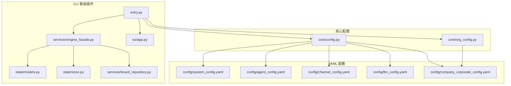
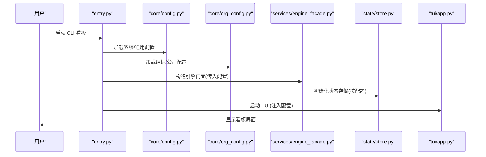
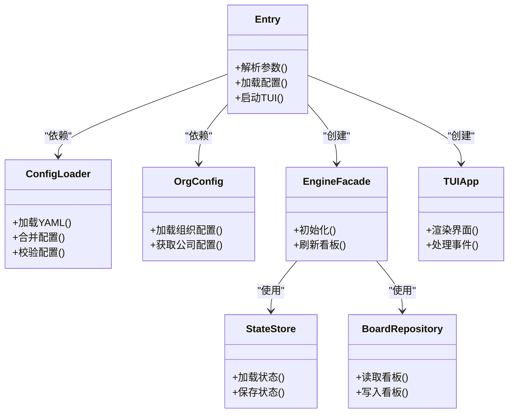

# 配置管理

<cite>
**本文引用的文件**   
- [opc/plugins/cli_board/entry.py](file://opc/plugins/cli_board/entry.py)
- [opc/plugins/cli_board/services/engine_facade.py](file://opc/plugins/cli_board/services/engine_facade.py)
- [opc/plugins/cli_board/state/models.py](file://opc/plugins/cli_board/state/models.py)
- [opc/plugins/cli_board/state/store.py](file://opc/plugins/cli_board/state/store.py)
- [opc/plugins/cli_board/services/board_repository.py](file://opc/plugins/cli_board/services/board_repository.py)
- [opc/plugins/cli_board/tui/app.py](file://opc/plugins/cli_board/tui/app.py)
- [config/system_config.yaml](file://config/system_config.yaml)
- [config/agent_config.yaml](file://config/agent_config.yaml)
- [config/channel_config.yaml](file://config/channel_config.yaml)
- [config/llm_config.yaml](file://config/llm_config.yaml)
- [config/company_corporate_config.yaml](file://config/company_corporate_config.yaml)
- [opc/core/config.py](file://opc/core/config.py)
- [opc/core/org_config.py](file://opc/core/org_config.py)
</cite>

## 目录
1. [简介](#简介)
2. [项目结构](#项目结构)
3. [核心组件](#核心组件)
4. [架构总览](#架构总览)
5. [详细组件分析](#详细组件分析)
6. [依赖关系分析](#依赖关系分析)
7. [性能与可扩展性](#性能与可扩展性)
8. [故障排查指南](#故障排查指南)
9. [结论](#结论)
10. [附录](#附录)

## 简介
本文件面向 CLI 看板插件的配置管理与使用，聚焦以下目标：
- 说明插件的所有配置项与环境变量设置
- 介绍配置文件格式与参数校验规则
- 解释不同运行环境下的配置差异与最佳实践
- 提供常见配置场景的示例与模板（以路径引用形式）
- 说明是否支持配置热重载与动态调整
- 说明配置文件的版本兼容性与迁移策略

## 项目结构
CLI 看板插件位于 opc/plugins/cli_board 下，其配置相关的关键位置包括：
- 入口与启动参数解析：entry.py
- 引擎门面与运行时交互：services/engine_facade.py
- 状态模型与持久化：state/models.py、state/store.py
- TUI 应用初始化：tui/app.py
- 全局系统配置加载：opc/core/config.py、opc/core/org_config.py
- 顶层 YAML 配置：config/*.yaml

图示来源
- [opc/plugins/cli_board/entry.py](file://opc/plugins/cli_board/entry.py)
- [opc/plugins/cli_board/services/engine_facade.py](file://opc/plugins/cli_board/services/engine_facade.py)
- [opc/plugins/cli_board/state/models.py](file://opc/plugins/cli_board/state/models.py)
- [opc/plugins/cli_board/state/store.py](file://opc/plugins/cli_board/state/store.py)
- [opc/plugins/cli_board/services/board_repository.py](file://opc/plugins/cli_board/services/board_repository.py)
- [opc/plugins/cli_board/tui/app.py](file://opc/plugins/cli_board/tui/app.py)
- [opc/core/config.py](file://opc/core/config.py)
- [opc/core/org_config.py](file://opc/core/org_config.py)
- [config/system_config.yaml](file://config/system_config.yaml)
- [config/agent_config.yaml](file://config/agent_config.yaml)
- [config/channel_config.yaml](file://config/channel_config.yaml)
- [config/llm_config.yaml](file://config/llm_config.yaml)
- [config/company_corporate_config.yaml](file://config/company_corporate_config.yaml)

章节来源
- [opc/plugins/cli_board/entry.py](file://opc/plugins/cli_board/entry.py)
- [opc/core/config.py](file://opc/core/config.py)
- [opc/core/org_config.py](file://opc/core/org_config.py)

## 核心组件
- 入口与参数解析：负责解析命令行参数、环境变量与配置文件，构建并注入到后续服务。
- 引擎门面：封装对上层引擎的调用，读取组织与公司级配置，驱动看板数据源。
- 状态模型与存储：定义看板状态的数据结构与持久化接口。
- 仓库服务：提供看板数据的读写能力。
- TUI 应用：基于配置渲染界面与交互行为。

章节来源
- [opc/plugins/cli_board/entry.py](file://opc/plugins/cli_board/entry.py)
- [opc/plugins/cli_board/services/engine_facade.py](file://opc/plugins/cli_board/services/engine_facade.py)
- [opc/plugins/cli_board/state/models.py](file://opc/plugins/cli_board/state/models.py)
- [opc/plugins/cli_board/state/store.py](file://opc/plugins/cli_board/state/store.py)
- [opc/plugins/cli_board/services/board_repository.py](file://opc/plugins/cli_board/services/board_repository.py)
- [opc/plugins/cli_board/tui/app.py](file://opc/plugins/cli_board/tui/app.py)

## 架构总览
CLI 看板插件的配置流从入口开始，依次加载系统配置、组织配置与插件本地配置，随后将配置注入到引擎门面与 UI 层。

图示来源
- [opc/plugins/cli_board/entry.py](file://opc/plugins/cli_board/entry.py)
- [opc/core/config.py](file://opc/core/config.py)
- [opc/core/org_config.py](file://opc/core/org_config.py)
- [opc/plugins/cli_board/services/engine_facade.py](file://opc/plugins/cli_board/services/engine_facade.py)
- [opc/plugins/cli_board/state/store.py](file://opc/plugins/cli_board/state/store.py)
- [opc/plugins/cli_board/tui/app.py](file://opc/plugins/cli_board/tui/app.py)

## 详细组件分析

### 入口与参数解析（entry.py）
- 职责
  - 解析命令行参数与环境变量
  - 合并多源配置（默认值、配置文件、环境变量、命令行覆盖）
  - 初始化引擎门面与 TUI 应用
- 关键流程
  - 读取系统配置与组织配置
  - 根据配置选择后端存储与看板数据源
  - 将配置传递给 TUI 进行渲染与交互控制
- 典型配置项（概念性说明）
  - 日志级别、输出格式
  - 看板数据源类型与连接信息
  - 主题与 UI 行为开关
  - 调试与诊断开关
- 验证与错误处理
  - 缺失必填项时给出明确提示
  - 类型不匹配或范围越界时拒绝启动并返回错误码
  - 配置文件语法错误时定位行号与上下文

章节来源
- [opc/plugins/cli_board/entry.py](file://opc/plugins/cli_board/entry.py)

### 引擎门面（services/engine_facade.py）
- 职责
  - 封装对上层引擎的访问
  - 读取组织与公司级配置，驱动看板数据
- 关键流程
  - 初始化阶段拉取组织元数据与工作项视图
  - 按需刷新看板数据
- 配置影响点
  - 工作项过滤条件
  - 刷新频率与批大小
  - 权限与可见性策略

章节来源
- [opc/plugins/cli_board/services/engine_facade.py](file://opc/plugins/cli_board/services/engine_facade.py)

### 状态模型与存储（state/models.py, state/store.py）
- 职责
  - 定义看板状态的数据结构
  - 提供状态的持久化与查询接口
- 关键流程
  - 启动时加载已有状态
  - 增量更新与快照保存
- 配置影响点
  - 存储路径与格式
  - 自动备份与保留策略
  - 并发写入锁策略

章节来源
- [opc/plugins/cli_board/state/models.py](file://opc/plugins/cli_board/state/models.py)
- [opc/plugins/cli_board/state/store.py](file://opc/plugins/cli_board/state/store.py)

### 看板仓库（services/board_repository.py）
- 职责
  - 提供看板数据的统一读写接口
- 关键流程
  - 根据配置选择具体实现（内存/文件/远程）
  - 缓存热点数据以提升响应速度
- 配置影响点
  - 缓存大小与过期时间
  - 重试与退避策略

章节来源
- [opc/plugins/cli_board/services/board_repository.py](file://opc/plugins/cli_board/services/board_repository.py)

### TUI 应用（tui/app.py）
- 职责
  - 基于配置渲染看板界面与交互面板
- 关键流程
  - 读取主题、布局与快捷键配置
  - 监听事件并触发刷新
- 配置影响点
  - 刷新间隔
  - 颜色主题与字体大小
  - 面板可见性与默认选中项

章节来源
- [opc/plugins/cli_board/tui/app.py](file://opc/plugins/cli_board/tui/app.py)

### 全局配置加载（core/config.py, core/org_config.py）
- 职责
  - 统一加载 YAML 配置与组织配置
  - 提供配置合并、校验与默认值填充
- 关键流程
  - 按优先级合并：默认 -> 配置文件 -> 环境变量 -> 命令行
  - 校验必填字段与取值范围
  - 暴露结构化配置对象供插件使用
- 配置来源
  - system_config.yaml：系统级开关、路径、日志等
  - agent_config.yaml：代理行为与工具链
  - channel_config.yaml：通道接入配置
  - llm_config.yaml：大模型提供商与鉴权
  - company_corporate_config.yaml：公司与组织架构

章节来源
- [opc/core/config.py](file://opc/core/config.py)
- [opc/core/org_config.py](file://opc/core/org_config.py)
- [config/system_config.yaml](file://config/system_config.yaml)
- [config/agent_config.yaml](file://config/agent_config.yaml)
- [config/channel_config.yaml](file://config/channel_config.yaml)
- [config/llm_config.yaml](file://config/llm_config.yaml)
- [config/company_corporate_config.yaml](file://config/company_corporate_config.yaml)

## 依赖关系分析
- 入口模块依赖核心配置加载器与组织配置加载器
- 引擎门面依赖状态模型与仓库服务
- TUI 依赖引擎门面提供的数据与事件
- 所有配置最终来源于 YAML 文件与环境变量

图示来源
- [opc/plugins/cli_board/entry.py](file://opc/plugins/cli_board/entry.py)
- [opc/core/config.py](file://opc/core/config.py)
- [opc/core/org_config.py](file://opc/core/org_config.py)
- [opc/plugins/cli_board/services/engine_facade.py](file://opc/plugins/cli_board/services/engine_facade.py)
- [opc/plugins/cli_board/state/store.py](file://opc/plugins/cli_board/state/store.py)
- [opc/plugins/cli_board/services/board_repository.py](file://opc/plugins/cli_board/services/board_repository.py)
- [opc/plugins/cli_board/tui/app.py](file://opc/plugins/cli_board/tui/app.py)

章节来源
- [opc/plugins/cli_board/entry.py](file://opc/plugins/cli_board/entry.py)
- [opc/core/config.py](file://opc/core/config.py)
- [opc/core/org_config.py](file://opc/core/org_config.py)

## 性能与可扩展性
- 配置对性能的影响
  - 刷新频率与批大小直接影响 I/O 与 CPU 占用
  - 缓存策略可显著降低重复计算与网络请求
- 可扩展点
  - 通过仓库服务抽象替换后端存储
  - 通过引擎门面扩展数据源与过滤逻辑
- 建议
  - 在开发环境开启更详细的日志与调试开关
  - 在生产环境关闭冗余输出，启用异步刷新与缓存

[本节为通用指导，无需源码引用]

## 故障排查指南
- 常见问题
  - 配置文件缺失或路径错误：检查系统配置与组织配置路径
  - 环境变量未生效：确认环境变量命名与优先级
  - 参数校验失败：核对必填字段与取值范围
  - 启动后无数据：检查看板数据源连接与权限
- 定位方法
  - 提高日志级别，观察配置加载顺序与错误堆栈
  - 使用最小化配置复现问题，逐步添加配置项定位
  - 检查状态存储文件是否存在且可读

章节来源
- [opc/core/config.py](file://opc/core/config.py)
- [opc/core/org_config.py](file://opc/core/org_config.py)

## 结论
CLI 看板插件的配置体系以“入口解析 + 核心加载 + 门面驱动 + 状态持久化”为主线，结合 YAML 与环境变量形成灵活而可控的配置方案。遵循本文的最佳实践与排障步骤，可在不同环境下稳定运行并快速定位问题。

[本节为总结，无需源码引用]

## 附录

### 配置项与环境变量清单（概念性）
- 系统级（system_config.yaml）
  - 日志级别、输出路径、超时与重试
- 代理级（agent_config.yaml）
  - 工具链开关、执行策略、沙箱限制
- 通道级（channel_config.yaml）
  - 通道接入地址、鉴权、消息路由
- 大模型级（llm_config.yaml）
  - 提供商、密钥、模型名、温度与最大令牌数
- 公司级（company_corporate_config.yaml）
  - 组织树、角色与权限、协作策略

章节来源
- [config/system_config.yaml](file://config/system_config.yaml)
- [config/agent_config.yaml](file://config/agent_config.yaml)
- [config/channel_config.yaml](file://config/channel_config.yaml)
- [config/llm_config.yaml](file://config/llm_config.yaml)
- [config/company_corporate_config.yaml](file://config/company_corporate_config.yaml)

### 配置文件格式与校验规则（概念性）
- 格式
  - YAML 键值对与嵌套结构
  - 数组与映射用于多实例与列表配置
- 校验
  - 必填字段检查
  - 类型与范围约束
  - 跨字段一致性校验（如端口与协议匹配）

章节来源
- [opc/core/config.py](file://opc/core/config.py)

### 不同运行环境的配置差异与最佳实践（概念性）
- 开发环境
  - 开启详细日志与调试开关
  - 使用内存存储与短刷新周期
- 测试环境
  - 固定随机种子与确定性数据
  - 启用断言与覆盖率收集
- 生产环境
  - 关闭冗余输出，启用异步刷新与缓存
  - 严格权限与最小化配置

[本节为通用指导，无需源码引用]

### 常见配置场景示例与模板（路径引用）
- 仅本地文件存储的看板
  - 参考：[config/system_config.yaml](file://config/system_config.yaml)
- 接入外部通道的看板
  - 参考：[config/channel_config.yaml](file://config/channel_config.yaml)
- 使用特定大模型的看板
  - 参考：[config/llm_config.yaml](file://config/llm_config.yaml)
- 公司级组织与权限
  - 参考：[config/company_corporate_config.yaml](file://config/company_corporate_config.yaml)

章节来源
- [config/system_config.yaml](file://config/system_config.yaml)
- [config/channel_config.yaml](file://config/channel_config.yaml)
- [config/llm_config.yaml](file://config/llm_config.yaml)
- [config/company_corporate_config.yaml](file://config/company_corporate_config.yaml)

### 配置热重载与动态调整（概念性）
- 当前实现
  - 启动时加载配置，运行期变更需重启进程
- 建议方案
  - 引入配置监听器与信号机制
  - 对可热更新的配置项（如日志级别、刷新频率）提供安全切换接口

[本节为通用指导，无需源码引用]

### 版本兼容性与迁移策略（概念性）
- 兼容性
  - 向后兼容新增可选字段
  - 废弃字段保留一段时间并提供告警
- 迁移
  - 提供迁移脚本与对照表
  - 在升级前执行预检与回滚预案

[本节为通用指导，无需源码引用]