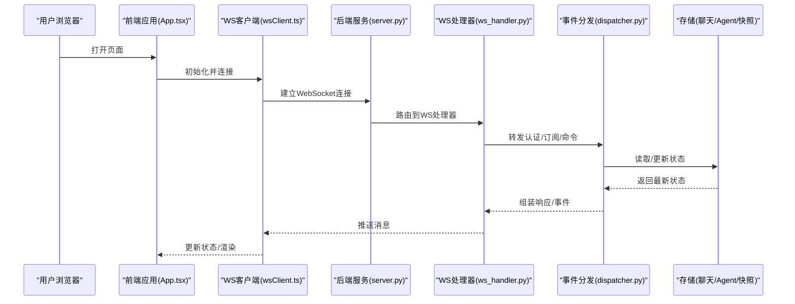
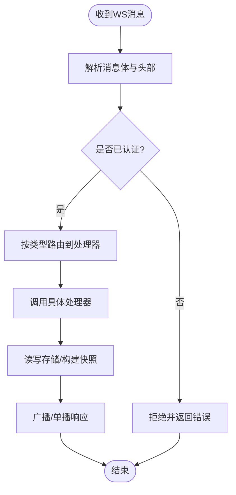
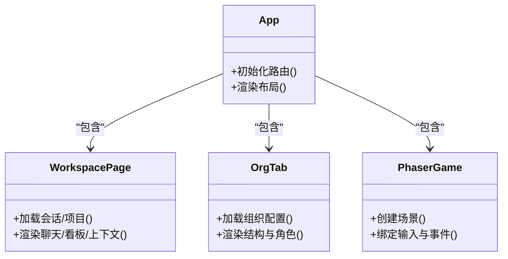
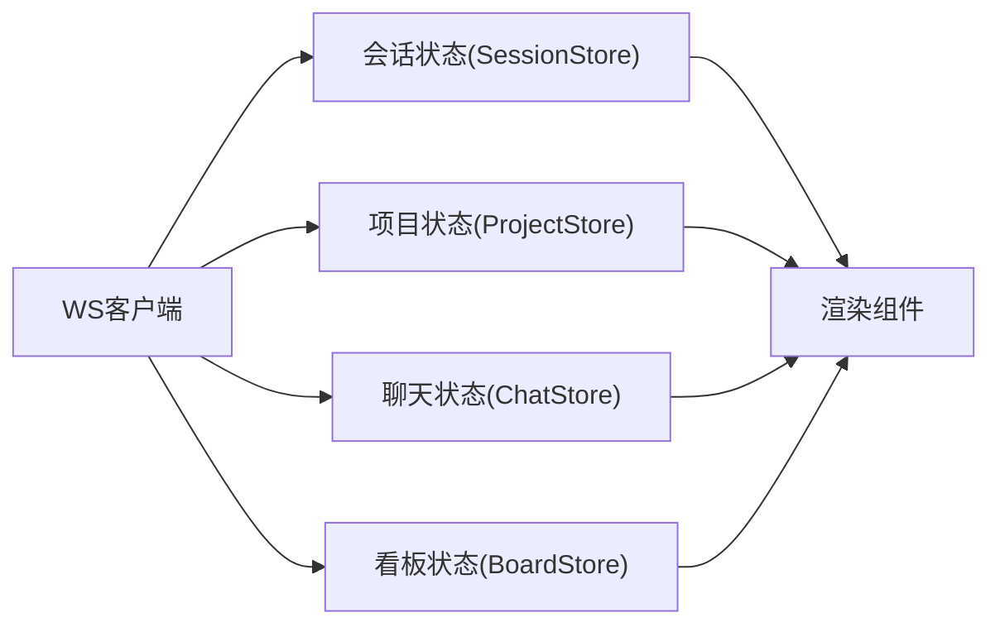
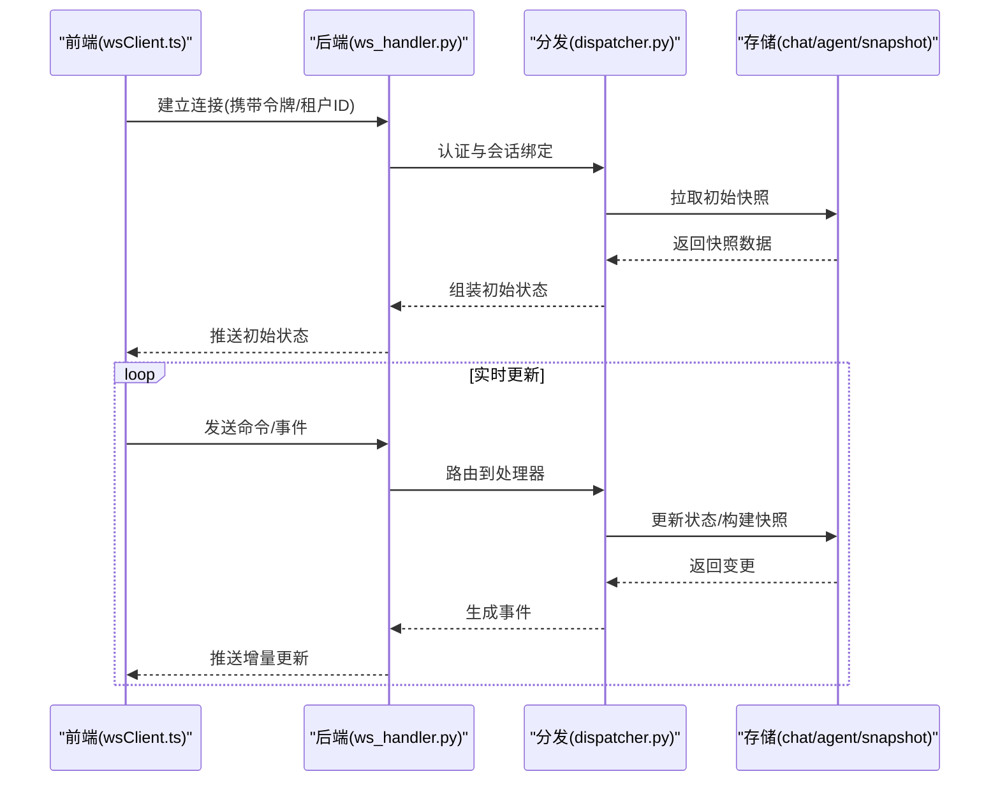
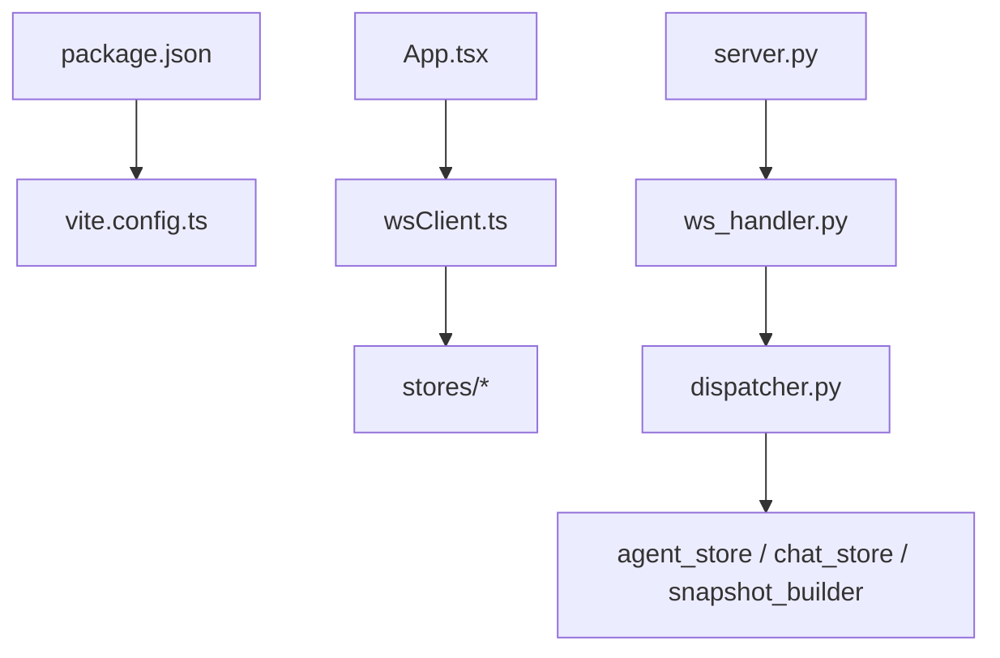

# Office UI插件

<cite>
**本文引用的文件**   
- [server.py](file://opc/plugins/office_ui/server.py)
- [ws_handler.py](file://opc/plugins/office_ui/ws_handler.py)
- [dispatcher.py](file://opc/plugins/office_ui/dispatcher.py)
- [event_adapter.py](file://opc/plugins/office_ui/event_adapter.py)
- [agent_store.py](file://opc/plugins/office_ui/agent_store.py)
- [chat_store.py](file://opc/plugins/office_ui/chat_store.py)
- [snapshot_builder.py](file://opc/plugins/office_ui/snapshot_builder.py)
- [execution_identity.py](file://opc/plugins/office_ui/execution_identity.py)
- [frontend_src/main.tsx](file://opc/plugins/office_ui/frontend_src/main.tsx)
- [frontend_src/App.tsx](file://opc/plugins/office_ui/frontend_src/App.tsx)
- [frontend_src/vite.config.ts](file://opc/plugins/office_ui/frontend_src/vite.config.ts)
- [frontend_src/package.json](file://opc/plugins/office_ui/frontend_src/package.json)
- [frontend_src/lib/wsClient.ts](file://opc/plugins/office_ui/frontend_src/lib/wsClient.ts)
- [frontend_src/lib/collabSync.ts](file://opc/plugins/office_ui/frontend_src/lib/collabSync.ts)
- [frontend_src/stores/SessionStore.ts](file://opc/plugins/office_ui/frontend_src/stores/SessionStore.ts)
- [frontend_src/stores/ProjectStore.ts](file://opc/plugins/office_ui/frontend_src/stores/ProjectStore.ts)
- [frontend_src/chat/ChatStore.ts](file://opc/plugins/office_ui/frontend_src/chat/ChatStore.ts)
- [frontend_src/kanban/BoardStore.ts](file://opc/plugins/office_ui/frontend_src/kanban/BoardStore.ts)
- [frontend_src/game/config.ts](file://opc/plugins/office_ui/frontend_src/game/config.ts)
- [frontend_src/game/PhaserGame.tsx](file://opc/plugins/office_ui/frontend_src/game/PhaserGame.tsx)
- [frontend_src/workspace/WorkspacePage.tsx](file://opc/plugins/office_ui/frontend_src/workspace/WorkspacePage.tsx)
- [frontend_src/org/OrgTab.tsx](file://opc/plugins/office_ui/frontend_src/org/OrgTab.tsx)
</cite>

## 目录
1. [简介](#简介)
2. [项目结构](#项目结构)
3. [核心组件](#核心组件)
4. [架构总览](#架构总览)
5. [详细组件分析](#详细组件分析)
6. [依赖关系分析](#依赖关系分析)
7. [性能考虑](#性能考虑)
8. [故障排查指南](#故障排查指南)
9. [结论](#结论)
10. [附录](#附录)

## 简介
本文件为Office UI插件的Web界面文档，面向前端与后端开发者，覆盖以下主题：
- 基于React与TypeScript的前端架构（组件结构、状态管理、路由设计）
- WebSocket实时通信机制（连接管理、消息格式、错误处理）
- 后端FastAPI服务器的REST API设计与中间件处理
- 前端构建流程与静态资源管理
- 多租户支持与用户权限控制
- 前端组件开发指南与样式定制方法
- 性能优化策略与浏览器兼容性处理
- 部署配置与反向代理设置

## 项目结构
Office UI插件采用前后端分离的插件化架构。后端以Python FastAPI提供服务，负责WebSocket事件分发、会话与执行上下文管理、快照生成等；前端使用React+TypeScript+Vite构建，提供聊天、看板、组织视图、游戏化办公场景等页面，并通过WebSocket与后端保持实时同步。

```mermaid
graph TB
subgraph "前端(React + TypeScript)"
FE_Main["入口 main.tsx"]
FE_App["应用 App.tsx"]
FE_WS["WS客户端 wsClient.ts"]
FE_Store_Session["会话状态 SessionStore.ts"]
FE_Store_Project["项目状态 ProjectStore.ts"]
FE_Store_Chat["聊天状态 ChatStore.ts"]
FE_Store_Board["看板状态 BoardStore.ts"]
FE_Game_Config["游戏配置 config.ts"]
FE_Game_Component["Phaser集成 PhaserGame.tsx"]
FE_Workspace["工作区 WorkspacePage.tsx"]
FE_Org["组织视图 OrgTab.tsx"]
end
subgraph "后端(FastAPI)"
BE_Server["服务 server.py"]
BE_WS["WS处理器 ws_handler.py"]
BE_Dispatcher["事件分发 dispatcher.py"]
BE_Adapter["事件适配 event_adapter.py"]
BE_AgentStore["Agent存储 agent_store.py"]
BE_ChatStore["聊天存储 chat_store.py"]
BE_Snapshot["快照构建 snapshot_builder.py"]
BE_ExecId["执行标识 execution_identity.py"]
end
FE_Main --> FE_App
FE_App --> FE_Workspace
FE_App --> FE_Org
FE_App --> FE_Game_Component
FE_App --> FE_Store_Session
FE_App --> FE_Store_Project
FE_App --> FE_Store_Chat
FE_App --> FE_Store_Board
FE_App --> FE_WS
FE_Game_Component --> FE_Game_Config
FE_WS < --> BE_Server
BE_Server --> BE_WS
BE_WS --> BE_Dispatcher
BE_Dispatcher --> BE_Adapter
BE_Dispatcher --> BE_AgentStore
BE_Dispatcher --> BE_ChatStore
BE_Dispatcher --> BE_Snapshot
BE_Dispatcher --> BE_ExecId
```

图表来源
- [server.py](file://opc/plugins/office_ui/server.py)
- [ws_handler.py](file://opc/plugins/office_ui/ws_handler.py)
- [dispatcher.py](file://opc/plugins/office_ui/dispatcher.py)
- [event_adapter.py](file://opc/plugins/office_ui/event_adapter.py)
- [agent_store.py](file://opc/plugins/office_ui/agent_store.py)
- [chat_store.py](file://opc/plugins/office_ui/chat_store.py)
- [snapshot_builder.py](file://opc/plugins/office_ui/snapshot_builder.py)
- [execution_identity.py](file://opc/plugins/office_ui/execution_identity.py)
- [frontend_src/main.tsx](file://opc/plugins/office_ui/frontend_src/main.tsx)
- [frontend_src/App.tsx](file://opc/plugins/office_ui/frontend_src/App.tsx)
- [frontend_src/lib/wsClient.ts](file://opc/plugins/office_ui/frontend_src/lib/wsClient.ts)
- [frontend_src/stores/SessionStore.ts](file://opc/plugins/office_ui/frontend_src/stores/SessionStore.ts)
- [frontend_src/stores/ProjectStore.ts](file://opc/plugins/office_ui/frontend_src/stores/ProjectStore.ts)
- [frontend_src/chat/ChatStore.ts](file://opc/plugins/office_ui/frontend_src/chat/ChatStore.ts)
- [frontend_src/kanban/BoardStore.ts](file://opc/plugins/office_ui/frontend_src/kanban/BoardStore.ts)
- [frontend_src/game/config.ts](file://opc/plugins/office_ui/frontend_src/game/config.ts)
- [frontend_src/game/PhaserGame.tsx](file://opc/plugins/office_ui/frontend_src/game/PhaserGame.tsx)
- [frontend_src/workspace/WorkspacePage.tsx](file://opc/plugins/office_ui/frontend_src/workspace/WorkspacePage.tsx)
- [frontend_src/org/OrgTab.tsx](file://opc/plugins/office_ui/frontend_src/org/OrgTab.tsx)

章节来源
- [server.py](file://opc/plugins/office_ui/server.py)
- [ws_handler.py](file://opc/plugins/office_ui/ws_handler.py)
- [dispatcher.py](file://opc/plugins/office_ui/dispatcher.py)
- [event_adapter.py](file://opc/plugins/office_ui/event_adapter.py)
- [agent_store.py](file://opc/plugins/office_ui/agent_store.py)
- [chat_store.py](file://opc/plugins/office_ui/chat_store.py)
- [snapshot_builder.py](file://opc/plugins/office_ui/snapshot_builder.py)
- [execution_identity.py](file://opc/plugins/office_ui/execution_identity.py)
- [frontend_src/main.tsx](file://opc/plugins/office_ui/frontend_src/main.tsx)
- [frontend_src/App.tsx](file://opc/plugins/office_ui/frontend_src/App.tsx)
- [frontend_src/vite.config.ts](file://opc/plugins/office_ui/frontend_src/vite.config.ts)
- [frontend_src/package.json](file://opc/plugins/office_ui/frontend_src/package.json)
- [frontend_src/lib/wsClient.ts](file://opc/plugins/office_ui/frontend_src/lib/wsClient.ts)
- [frontend_src/lib/collabSync.ts](file://opc/plugins/office_ui/frontend_src/lib/collabSync.ts)
- [frontend_src/stores/SessionStore.ts](file://opc/plugins/office_ui/frontend_src/stores/SessionStore.ts)
- [frontend_src/stores/ProjectStore.ts](file://opc/plugins/office_ui/frontend_src/stores/ProjectStore.ts)
- [frontend_src/chat/ChatStore.ts](file://opc/plugins/office_ui/frontend_src/chat/ChatStore.ts)
- [frontend_src/kanban/BoardStore.ts](file://opc/plugins/office_ui/frontend_src/kanban/BoardStore.ts)
- [frontend_src/game/config.ts](file://opc/plugins/office_ui/frontend_src/game/config.ts)
- [frontend_src/game/PhaserGame.tsx](file://opc/plugins/office_ui/frontend_src/game/PhaserGame.tsx)
- [frontend_src/workspace/WorkspacePage.tsx](file://opc/plugins/office_ui/frontend_src/workspace/WorkspacePage.tsx)
- [frontend_src/org/OrgTab.tsx](file://opc/plugins/office_ui/frontend_src/org/OrgTab.tsx)

## 核心组件
- 后端服务与路由
  - FastAPI服务启动、静态资源托管、WebSocket路由注册、健康检查与跨域配置。
- WebSocket处理器
  - 连接生命周期管理、鉴权与会话绑定、消息路由与广播、断线重连与错误恢复。
- 事件分发器
  - 将WS消息映射到领域事件，协调Agent存储、聊天存储、快照构建与执行标识。
- 事件适配器
  - 统一内部事件模型与外部协议之间的转换。
- 状态存储（后端）
  - Agent状态、聊天历史、快照数据、执行上下文等持久化或内存态管理。
- 前端应用
  - React入口、路由与页面容器、全局状态（会话、项目）、业务状态（聊天、看板）、游戏化场景集成。
- 实时通信（前端）
  - WS客户端封装、协作同步工具、错误重试与心跳保活。

章节来源
- [server.py](file://opc/plugins/office_ui/server.py)
- [ws_handler.py](file://opc/plugins/office_ui/ws_handler.py)
- [dispatcher.py](file://opc/plugins/office_ui/dispatcher.py)
- [event_adapter.py](file://opc/plugins/office_ui/event_adapter.py)
- [agent_store.py](file://opc/plugins/office_ui/agent_store.py)
- [chat_store.py](file://opc/plugins/office_ui/chat_store.py)
- [snapshot_builder.py](file://opc/plugins/office_ui/snapshot_builder.py)
- [execution_identity.py](file://opc/plugins/office_ui/execution_identity.py)
- [frontend_src/main.tsx](file://opc/plugins/office_ui/frontend_src/main.tsx)
- [frontend_src/App.tsx](file://opc/plugins/office_ui/frontend_src/App.tsx)
- [frontend_src/lib/wsClient.ts](file://opc/plugins/office_ui/frontend_src/lib/wsClient.ts)
- [frontend_src/lib/collabSync.ts](file://opc/plugins/office_ui/frontend_src/lib/collabSync.ts)
- [frontend_src/stores/SessionStore.ts](file://opc/plugins/office_ui/frontend_src/stores/SessionStore.ts)
- [frontend_src/stores/ProjectStore.ts](file://opc/plugins/office_ui/frontend_src/stores/ProjectStore.ts)
- [frontend_src/chat/ChatStore.ts](file://opc/plugins/office_ui/frontend_src/chat/ChatStore.ts)
- [frontend_src/kanban/BoardStore.ts](file://opc/plugins/office_ui/frontend_src/kanban/BoardStore.ts)

## 架构总览
系统由“前端UI层”、“实时通信层”、“后端服务层”和“领域存储层”组成。前端通过WS与后端建立长连接，后端根据消息类型进行事件分发，调用相应存储与快照构建逻辑，并将结果广播给相关客户端。



图表来源
- [server.py](file://opc/plugins/office_ui/server.py)
- [ws_handler.py](file://opc/plugins/office_ui/ws_handler.py)
- [dispatcher.py](file://opc/plugins/office_ui/dispatcher.py)
- [chat_store.py](file://opc/plugins/office_ui/chat_store.py)
- [agent_store.py](file://opc/plugins/office_ui/agent_store.py)
- [snapshot_builder.py](file://opc/plugins/office_ui/snapshot_builder.py)
- [frontend_src/App.tsx](file://opc/plugins/office_ui/frontend_src/App.tsx)
- [frontend_src/lib/wsClient.ts](file://opc/plugins/office_ui/frontend_src/lib/wsClient.ts)

## 详细组件分析

### 后端服务与中间件
- 功能要点
  - 挂载静态资源目录，供前端访问构建产物。
  - 注册REST与WebSocket路由，支持跨域与安全头。
  - 提供健康检查与基础监控接口。
- 关键职责
  - 服务生命周期管理、中间件链（CORS、请求日志、安全头等）。
  - 路由表维护与版本隔离。
- 扩展点
  - 新增API或WS事件时，在服务中注册路由并在处理器中实现逻辑。

章节来源
- [server.py](file://opc/plugins/office_ui/server.py)

### WebSocket处理器与事件分发
- 连接管理
  - 建立连接后完成鉴权与会话绑定，维护连接集合与心跳。
- 消息路由
  - 解析消息类型与目标实体（会话、任务、看板等），分发给对应处理器。
- 错误处理
  - 捕获异常并返回标准化错误码，记录诊断信息，触发重连提示。
- 事件分发器
  - 将WS消息转换为领域事件，协调各存储模块与快照构建。



图表来源
- [ws_handler.py](file://opc/plugins/office_ui/ws_handler.py)
- [dispatcher.py](file://opc/plugins/office_ui/dispatcher.py)
- [event_adapter.py](file://opc/plugins/office_ui/event_adapter.py)
- [agent_store.py](file://opc/plugins/office_ui/agent_store.py)
- [chat_store.py](file://opc/plugins/office_ui/chat_store.py)
- [snapshot_builder.py](file://opc/plugins/office_ui/snapshot_builder.py)

章节来源
- [ws_handler.py](file://opc/plugins/office_ui/ws_handler.py)
- [dispatcher.py](file://opc/plugins/office_ui/dispatcher.py)
- [event_adapter.py](file://opc/plugins/office_ui/event_adapter.py)
- [agent_store.py](file://opc/plugins/office_ui/agent_store.py)
- [chat_store.py](file://opc/plugins/office_ui/chat_store.py)
- [snapshot_builder.py](file://opc/plugins/office_ui/snapshot_builder.py)

### 前端应用与路由
- 入口与根组件
  - 应用入口初始化React与全局配置，根组件承载路由与布局。
- 路由设计
  - 基于页面级组件划分（工作区、组织视图、游戏场景等），支持嵌套与参数传递。
- 页面容器
  - 工作区聚合聊天、看板、上下文面板等子视图。
  - 组织视图提供组织架构管理与市场浏览。
  - 游戏场景通过Phaser集成展示可视化交互。



图表来源
- [frontend_src/App.tsx](file://opc/plugins/office_ui/frontend_src/App.tsx)
- [frontend_src/workspace/WorkspacePage.tsx](file://opc/plugins/office_ui/frontend_src/workspace/WorkspacePage.tsx)
- [frontend_src/org/OrgTab.tsx](file://opc/plugins/office_ui/frontend_src/org/OrgTab.tsx)
- [frontend_src/game/PhaserGame.tsx](file://opc/plugins/office_ui/frontend_src/game/PhaserGame.tsx)

章节来源
- [frontend_src/main.tsx](file://opc/plugins/office_ui/frontend_src/main.tsx)
- [frontend_src/App.tsx](file://opc/plugins/office_ui/frontend_src/App.tsx)
- [frontend_src/workspace/WorkspacePage.tsx](file://opc/plugins/office_ui/frontend_src/workspace/WorkspacePage.tsx)
- [frontend_src/org/OrgTab.tsx](file://opc/plugins/office_ui/frontend_src/org/OrgTab.tsx)
- [frontend_src/game/PhaserGame.tsx](file://opc/plugins/office_ui/frontend_src/game/PhaserGame.tsx)

### 前端状态管理
- 全局状态
  - 会话状态：当前会话ID、用户信息、权限范围。
  - 项目状态：项目列表、选中项目、元数据。
- 业务状态
  - 聊天状态：消息列表、发送进度、反馈卡片。
  - 看板状态：列与卡片、拖拽与排序、执行面板。
- 状态同步
  - 通过WS事件驱动状态更新，结合本地缓存与增量合并。



图表来源
- [frontend_src/lib/wsClient.ts](file://opc/plugins/office_ui/frontend_src/lib/wsClient.ts)
- [frontend_src/stores/SessionStore.ts](file://opc/plugins/office_ui/frontend_src/stores/SessionStore.ts)
- [frontend_src/stores/ProjectStore.ts](file://opc/plugins/office_ui/frontend_src/stores/ProjectStore.ts)
- [frontend_src/chat/ChatStore.ts](file://opc/plugins/office_ui/frontend_src/chat/ChatStore.ts)
- [frontend_src/kanban/BoardStore.ts](file://opc/plugins/office_ui/frontend_src/kanban/BoardStore.ts)

章节来源
- [frontend_src/stores/SessionStore.ts](file://opc/plugins/office_ui/frontend_src/stores/SessionStore.ts)
- [frontend_src/stores/ProjectStore.ts](file://opc/plugins/office_ui/frontend_src/stores/ProjectStore.ts)
- [frontend_src/chat/ChatStore.ts](file://opc/plugins/office_ui/frontend_src/chat/ChatStore.ts)
- [frontend_src/kanban/BoardStore.ts](file://opc/plugins/office_ui/frontend_src/kanban/BoardStore.ts)
- [frontend_src/lib/wsClient.ts](file://opc/plugins/office_ui/frontend_src/lib/wsClient.ts)

### 实时通信机制（WebSocket）
- 连接管理
  - 自动重连、指数退避、心跳保活、断线通知。
- 消息格式
  - 统一消息头（类型、目标、时间戳、签名），消息体按领域对象定义。
- 错误处理
  - 网络错误、鉴权失败、业务异常分别处理，提供用户可见提示与重试策略。
- 协作同步
  - 对共享状态（如看板）进行冲突检测与合并，保证一致性。



图表来源
- [frontend_src/lib/wsClient.ts](file://opc/plugins/office_ui/frontend_src/lib/wsClient.ts)
- [frontend_src/lib/collabSync.ts](file://opc/plugins/office_ui/frontend_src/lib/collabSync.ts)
- [ws_handler.py](file://opc/plugins/office_ui/ws_handler.py)
- [dispatcher.py](file://opc/plugins/office_ui/dispatcher.py)
- [chat_store.py](file://opc/plugins/office_ui/chat_store.py)
- [agent_store.py](file://opc/plugins/office_ui/agent_store.py)
- [snapshot_builder.py](file://opc/plugins/office_ui/snapshot_builder.py)

章节来源
- [frontend_src/lib/wsClient.ts](file://opc/plugins/office_ui/frontend_src/lib/wsClient.ts)
- [frontend_src/lib/collabSync.ts](file://opc/plugins/office_ui/frontend_src/lib/collabSync.ts)
- [ws_handler.py](file://opc/plugins/office_ui/ws_handler.py)
- [dispatcher.py](file://opc/plugins/office_ui/dispatcher.py)
- [chat_store.py](file://opc/plugins/office_ui/chat_store.py)
- [agent_store.py](file://opc/plugins/office_ui/agent_store.py)
- [snapshot_builder.py](file://opc/plugins/office_ui/snapshot_builder.py)

### 构建流程与静态资源管理
- 构建工具
  - Vite作为开发与构建工具，支持热重载与按需打包。
- 静态资源
  - 前端构建产物输出至指定目录，后端托管该目录供浏览器访问。
- 环境变量
  - 通过构建期变量注入API地址、WS地址、特性开关等。

章节来源
- [frontend_src/vite.config.ts](file://opc/plugins/office_ui/frontend_src/vite.config.ts)
- [frontend_src/package.json](file://opc/plugins/office_ui/frontend_src/package.json)
- [server.py](file://opc/plugins/office_ui/server.py)

### 多租户支持与权限控制
- 多租户
  - 在WS连接头或JWT中包含租户标识，后端据此隔离会话与数据。
- 权限控制
  - 基于角色与资源的访问校验，限制敏感操作（如删除、发布）。
- 执行标识
  - 每个执行上下文附带唯一标识，用于审计与追踪。

章节来源
- [execution_identity.py](file://opc/plugins/office_ui/execution_identity.py)
- [ws_handler.py](file://opc/plugins/office_ui/ws_handler.py)
- [dispatcher.py](file://opc/plugins/office_ui/dispatcher.py)

### 前端组件开发指南与样式定制
- 组件规范
  - 按功能域拆分目录（聊天、看板、组织、游戏），单一职责与可复用性优先。
- 状态接入
  - 通过Store订阅状态变化，避免直接操作DOM。
- 样式定制
  - 使用CSS模块化或主题变量，便于多租户皮肤切换。
- 测试建议
  - 单元测试覆盖核心逻辑，端到端测试验证关键路径。

章节来源
- [frontend_src/chat/ChatStore.ts](file://opc/plugins/office_ui/frontend_src/chat/ChatStore.ts)
- [frontend_src/kanban/BoardStore.ts](file://opc/plugins/office_ui/frontend_src/kanban/BoardStore.ts)
- [frontend_src/org/OrgTab.tsx](file://opc/plugins/office_ui/frontend_src/org/OrgTab.tsx)
- [frontend_src/game/config.ts](file://opc/plugins/office_ui/frontend_src/game/config.ts)

### 游戏化办公场景（Phaser集成）
- 场景配置
  - 通过配置文件定义地图、实体与交互区域。
- 运行时
  - PhaserGame组件负责创建场景、绑定输入与事件，并与WS事件联动。
- 性能
  - 合理使用精灵池与批渲染，避免频繁创建销毁对象。

章节来源
- [frontend_src/game/config.ts](file://opc/plugins/office_ui/frontend_src/game/config.ts)
- [frontend_src/game/PhaserGame.tsx](file://opc/plugins/office_ui/frontend_src/game/PhaserGame.tsx)

## 依赖关系分析
- 前端依赖
  - React生态（组件、路由、状态库）、Vite构建、可选Phaser图形引擎。
- 后端依赖
  - FastAPI框架、WebSocket支持、序列化与校验库、存储抽象。
- 耦合与内聚
  - 前后端通过WS与REST解耦；后端内部通过事件分发降低模块耦合。



图表来源
- [frontend_src/package.json](file://opc/plugins/office_ui/frontend_src/package.json)
- [frontend_src/vite.config.ts](file://opc/plugins/office_ui/frontend_src/vite.config.ts)
- [frontend_src/App.tsx](file://opc/plugins/office_ui/frontend_src/App.tsx)
- [frontend_src/lib/wsClient.ts](file://opc/plugins/office_ui/frontend_src/lib/wsClient.ts)
- [server.py](file://opc/plugins/office_ui/server.py)
- [ws_handler.py](file://opc/plugins/office_ui/ws_handler.py)
- [dispatcher.py](file://opc/plugins/office_ui/dispatcher.py)
- [agent_store.py](file://opc/plugins/office_ui/agent_store.py)
- [chat_store.py](file://opc/plugins/office_ui/chat_store.py)
- [snapshot_builder.py](file://opc/plugins/office_ui/snapshot_builder.py)

章节来源
- [frontend_src/package.json](file://opc/plugins/office_ui/frontend_src/package.json)
- [frontend_src/vite.config.ts](file://opc/plugins/office_ui/frontend_src/vite.config.ts)
- [server.py](file://opc/plugins/office_ui/server.py)
- [ws_handler.py](file://opc/plugins/office_ui/ws_handler.py)
- [dispatcher.py](file://opc/plugins/office_ui/dispatcher.py)

## 性能考虑
- 前端
  - 代码分割与懒加载，减少首屏体积；虚拟滚动优化长列表；图片与字体资源压缩与缓存。
  - 状态更新去抖与节流，避免频繁重渲染；增量合并WS事件，减少全量刷新。
- 后端
  - 批量写入与快照压缩；异步I/O与连接池；热点数据缓存。
  - 限流与熔断保护，防止雪崩。
- 传输
  - 启用Gzip/Brotli压缩；合理划分消息粒度，避免过大负载。

[本节为通用指导，不直接分析具体文件]

## 故障排查指南
- 常见问题
  - WS连接失败：检查鉴权令牌、跨域配置、防火墙与代理设置。
  - 消息丢失：确认心跳与重连策略，核对服务端日志与客户端错误码。
  - 状态不一致：对比快照与增量事件，定位冲突合并逻辑。
- 诊断手段
  - 开启调试日志与链路追踪；使用浏览器Network与WS面板观察消息往返。
  - 在后端增加健康检查与指标上报，快速定位瓶颈。

章节来源
- [ws_handler.py](file://opc/plugins/office_ui/ws_handler.py)
- [dispatcher.py](file://opc/plugins/office_ui/dispatcher.py)
- [frontend_src/lib/wsClient.ts](file://opc/plugins/office_ui/frontend_src/lib/wsClient.ts)

## 结论
本插件通过清晰的层次划分与事件驱动架构，实现了高内聚低耦合的前后端协作。前端以React+TS为核心，配合Vite构建与WS实时通信，提供丰富的办公场景体验；后端以FastAPI为基础，结合WS处理器与事件分发器，确保可扩展性与稳定性。在多租户与权限控制方面，通过统一的身份与执行标识体系，保障数据安全与合规。

[本节为总结，不直接分析具体文件]

## 附录
- 部署与反向代理
  - 使用Nginx/Caddy等反向代理，配置HTTPS与静态资源缓存。
  - 将WS路径透传至后端服务，确保Upgrade头正确转发。
  - 配置CORS白名单与CSRF防护，遵循最小权限原则。
- 环境变量与配置
  - 前端构建期注入API与WS地址；后端通过配置文件与环境变量管理密钥与端口。
- 版本兼容
  - 前端关注主流浏览器ES6+与WebSocket支持；后端关注Python与FastAPI版本矩阵。

章节来源
- [server.py](file://opc/plugins/office_ui/server.py)
- [frontend_src/vite.config.ts](file://opc/plugins/office_ui/frontend_src/vite.config.ts)
- [frontend_src/package.json](file://opc/plugins/office_ui/frontend_src/package.json)