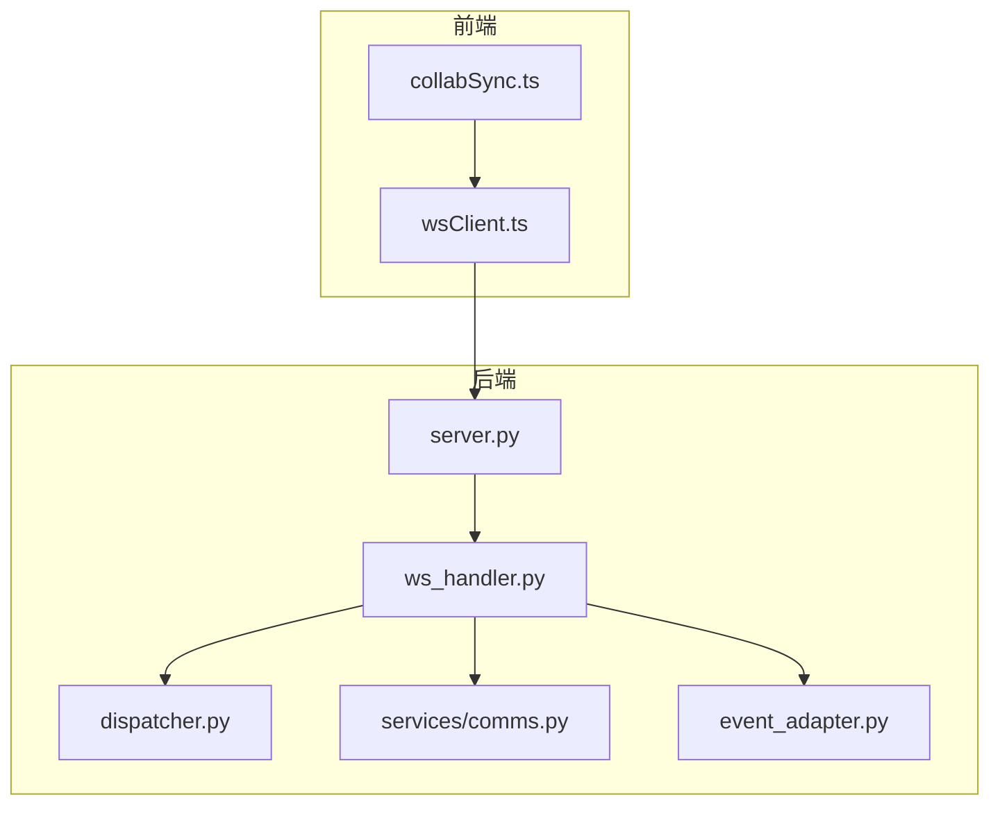
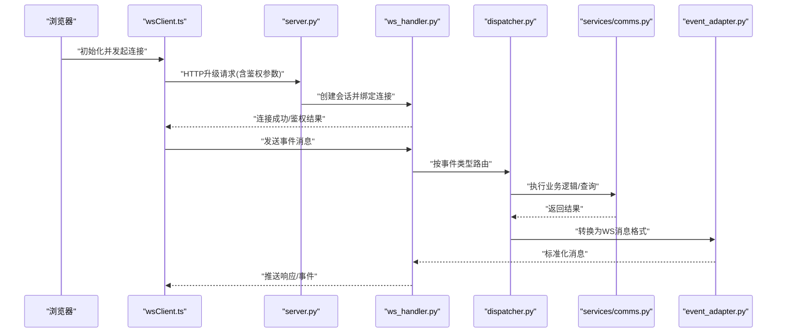
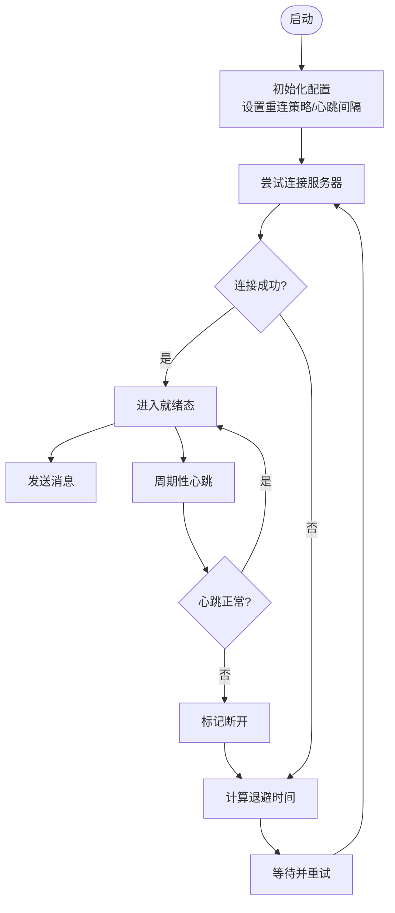
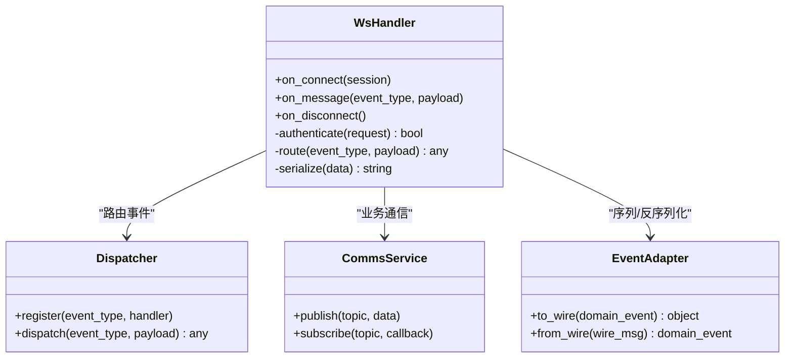
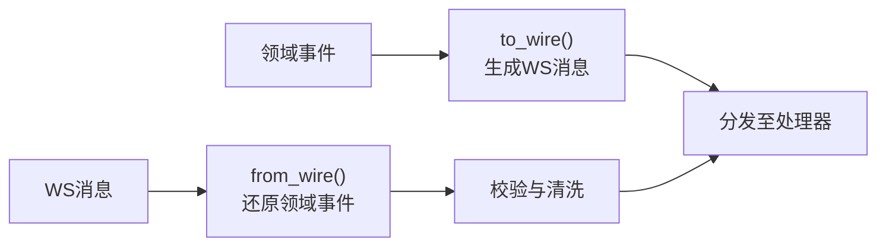
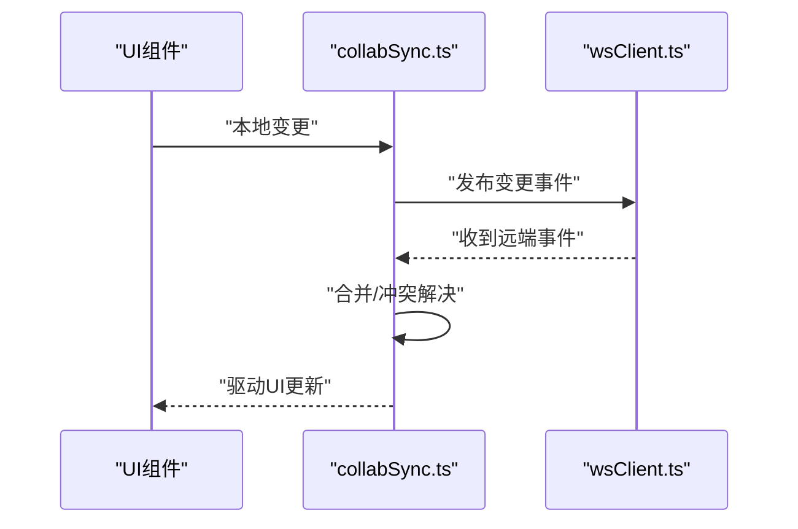
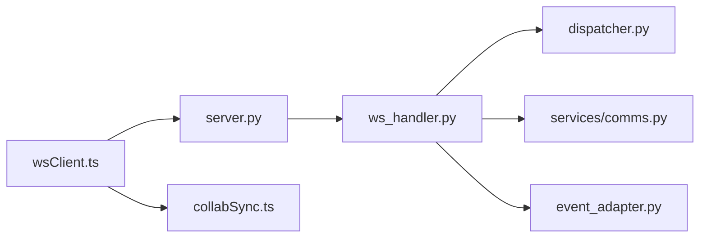

# WebSocket通信

<cite>
**本文引用的文件**   
- [ws_handler.py](file://opc/plugins/office_ui/ws_handler.py)
- [event_adapter.py](file://opc/plugins/office_ui/event_adapter.py)
- [server.py](file://opc/plugins/office_ui/server.py)
- [dispatcher.py](file://opc/plugins/office_ui/dispatcher.py)
- [services/comms.py](file://opc/plugins/office_ui/services/comms.py)
- [frontend_src/lib/wsClient.ts](file://opc/plugins/office_ui/frontend_src/lib/wsClient.ts)
- [frontend_src/lib/collabSync.ts](file://opc/plugins/office_ui/frontend_src/lib/collabSync.ts)
- [tests/test_ws_handler_progress_parsing.py](file://tests/test_ws_handler_progress_parsing.py)
- [tests/test_ws_handler_escalations.py](file://tests/test_ws_handler_escalations.py)
</cite>

## 目录
1. [简介](#简介)
2. [项目结构](#项目结构)
3. [核心组件](#核心组件)
4. [架构总览](#架构总览)
5. [详细组件分析](#详细组件分析)
6. [依赖关系分析](#依赖关系分析)
7. [性能与连接池](#性能与连接池)
8. [安全认证与访问控制](#安全认证与访问控制)
9. [实时状态同步方案](#实时状态同步方案)
10. [调试与故障排除](#调试与故障排除)
11. [结论](#结论)

## 简介
本文件面向Office UI插件的WebSocket通信机制，系统性说明连接建立、维护与断线重连策略；定义消息格式规范（事件类型、数据结构与服务端响应）；解析前端wsClient实现（连接管理、收发与错误处理）；阐述服务端ws_handler的消息路由与处理逻辑；解释事件适配器的事件转换与分发；给出实时状态同步的实现方案；并提供连接池管理与性能优化建议、安全认证与访问控制机制，以及调试工具与排障指南。

## 项目结构
与WebSocket通信相关的代码主要分布在以下位置：
- 后端服务与路由：server.py、ws_handler.py、dispatcher.py、services/comms.py
- 事件适配层：event_adapter.py
- 前端客户端：frontend_src/lib/wsClient.ts、collabSync.ts
- 测试用例：tests/test_ws_handler_progress_parsing.py、tests/test_ws_handler_escalations.py

图表来源
- [server.py](file://opc/plugins/office_ui/server.py)
- [ws_handler.py](file://opc/plugins/office_ui/ws_handler.py)
- [dispatcher.py](file://opc/plugins/office_ui/dispatcher.py)
- [services/comms.py](file://opc/plugins/office_ui/services/comms.py)
- [event_adapter.py](file://opc/plugins/office_ui/event_adapter.py)
- [frontend_src/lib/wsClient.ts](file://opc/plugins/office_ui/frontend_src/lib/wsClient.ts)
- [frontend_src/lib/collabSync.ts](file://opc/plugins/office_ui/frontend_src/lib/collabSync.ts)

章节来源
- [server.py](file://opc/plugins/office_ui/server.py)
- [ws_handler.py](file://opc/plugins/office_ui/ws_handler.py)
- [dispatcher.py](file://opc/plugins/office_ui/dispatcher.py)
- [services/comms.py](file://opc/plugins/office_ui/services/comms.py)
- [event_adapter.py](file://opc/plugins/office_ui/event_adapter.py)
- [frontend_src/lib/wsClient.ts](file://opc/plugins/office_ui/frontend_src/lib/wsClient.ts)
- [frontend_src/lib/collabSync.ts](file://opc/plugins/office_ui/frontend_src/lib/collabSync.ts)

## 核心组件
- 前端wsClient：负责WebSocket生命周期管理（连接、心跳、重连）、消息编解码、错误处理与重试策略，并向上层提供统一API。
- 后端ws_handler：接收WebSocket帧，进行鉴权与会话绑定，按事件类型路由到具体处理器，调用业务服务并回写响应或推送事件。
- 事件适配器event_adapter：将内部领域事件转换为统一的WS消息格式，或将外部事件映射为内部事件，确保前后端契约稳定。
- 服务comms：封装跨进程/模块通信能力，供ws_handler在业务处理中发送/订阅事件。
- 调度器dispatcher：集中注册与分发事件处理器，解耦ws_handler与具体业务逻辑。
- 协作同步collabSync：在前端聚合多源更新，保证UI状态一致性与冲突解决。

章节来源
- [frontend_src/lib/wsClient.ts](file://opc/plugins/office_ui/frontend_src/lib/wsClient.ts)
- [ws_handler.py](file://opc/plugins/office_ui/ws_handler.py)
- [event_adapter.py](file://opc/plugins/office_ui/event_adapter.py)
- [services/comms.py](file://opc/plugins/office_ui/services/comms.py)
- [dispatcher.py](file://opc/plugins/office_ui/dispatcher.py)
- [frontend_src/lib/collabSync.ts](file://opc/plugins/office_ui/frontend_src/lib/collabSync.ts)

## 架构总览
下图展示了从浏览器到后端的端到端交互路径，包括握手、鉴权、事件路由与响应返回。

图表来源
- [server.py](file://opc/plugins/office_ui/server.py)
- [ws_handler.py](file://opc/plugins/office_ui/ws_handler.py)
- [dispatcher.py](file://opc/plugins/office_ui/dispatcher.py)
- [services/comms.py](file://opc/plugins/office_ui/services/comms.py)
- [event_adapter.py](file://opc/plugins/office_ui/event_adapter.py)
- [frontend_src/lib/wsClient.ts](file://opc/plugins/office_ui/frontend_src/lib/wsClient.ts)

## 详细组件分析

### 前端wsClient：连接管理、消息收发与错误处理
- 连接管理
  - 支持自动重连与指数退避，避免雪崩效应。
  - 心跳保活与超时检测，异常时触发重连流程。
  - 连接状态机：空闲、连接中、已连接、断开、重连中。
- 消息收发
  - 统一发送接口，自动附加会话标识与时间戳。
  - 接收侧按事件类型分派到对应回调，支持批量合并与去抖。
- 错误处理
  - 网络错误、鉴权失败、协议不匹配等分类处理。
  - 可配置最大重试次数与退避上限，失败时上报监控。

图表来源
- [frontend_src/lib/wsClient.ts](file://opc/plugins/office_ui/frontend_src/lib/wsClient.ts)

章节来源
- [frontend_src/lib/wsClient.ts](file://opc/plugins/office_ui/frontend_src/lib/wsClient.ts)

### 后端ws_handler：消息路由与处理逻辑
- 连接建立与鉴权
  - 在HTTP升级阶段校验令牌/会话信息，拒绝非法请求。
  - 成功后建立会话上下文，绑定连接ID与用户身份。
- 消息路由
  - 根据事件类型字段选择处理器，未识别事件返回错误码。
  - 支持限流与并发控制，防止单连接占用过多资源。
- 响应与推送
  - 同步请求采用请求-响应模式，异步事件通过连接推送。
  - 使用事件适配器统一序列化，确保前后端契约一致。

图表来源
- [ws_handler.py](file://opc/plugins/office_ui/ws_handler.py)
- [dispatcher.py](file://opc/plugins/office_ui/dispatcher.py)
- [services/comms.py](file://opc/plugins/office_ui/services/comms.py)
- [event_adapter.py](file://opc/plugins/office_ui/event_adapter.py)

章节来源
- [ws_handler.py](file://opc/plugins/office_ui/ws_handler.py)
- [dispatcher.py](file://opc/plugins/office_ui/dispatcher.py)
- [services/comms.py](file://opc/plugins/office_ui/services/comms.py)
- [event_adapter.py](file://opc/plugins/office_ui/event_adapter.py)

### 事件适配器：事件转换与分发机制
- 职责
  - 将领域事件转换为WS消息格式（包含事件类型、版本、载荷、追踪ID）。
  - 将WS消息反序列化为领域事件，交由上层处理。
- 设计要点
  - 版本兼容：通过版本号字段平滑演进。
  - 幂等性：基于追踪ID去重，避免重复处理。
  - 可扩展：新增事件类型无需改动核心路由。

图表来源
- [event_adapter.py](file://opc/plugins/office_ui/event_adapter.py)

章节来源
- [event_adapter.py](file://opc/plugins/office_ui/event_adapter.py)

### 协作同步：前端状态一致性
- 目标
  - 在多标签页或多设备场景下保持视图状态一致。
- 机制
  - 基于事件驱动的增量更新，合并冲突时采用最后写入优先或业务规则合并。
  - 对高频事件进行批处理与节流，降低渲染压力。

图表来源
- [frontend_src/lib/collabSync.ts](file://opc/plugins/office_ui/frontend_src/lib/collabSync.ts)
- [frontend_src/lib/wsClient.ts](file://opc/plugins/office_ui/frontend_src/lib/wsClient.ts)

章节来源
- [frontend_src/lib/collabSync.ts](file://opc/plugins/office_ui/frontend_src/lib/collabSync.ts)
- [frontend_src/lib/wsClient.ts](file://opc/plugins/office_ui/frontend_src/lib/wsClient.ts)

## 依赖关系分析
- ws_handler依赖dispatcher进行事件分发，依赖comms进行跨模块通信，依赖event_adapter进行消息编解码。
- server负责挂载WebSocket端点并委派给ws_handler。
- 前端wsClient独立于业务，仅关注连接与传输，由collabSync消费其事件。

图表来源
- [server.py](file://opc/plugins/office_ui/server.py)
- [ws_handler.py](file://opc/plugins/office_ui/ws_handler.py)
- [dispatcher.py](file://opc/plugins/office_ui/dispatcher.py)
- [services/comms.py](file://opc/plugins/office_ui/services/comms.py)
- [event_adapter.py](file://opc/plugins/office_ui/event_adapter.py)
- [frontend_src/lib/wsClient.ts](file://opc/plugins/office_ui/frontend_src/lib/wsClient.ts)
- [frontend_src/lib/collabSync.ts](file://opc/plugins/office_ui/frontend_src/lib/collabSync.ts)

章节来源
- [server.py](file://opc/plugins/office_ui/server.py)
- [ws_handler.py](file://opc/plugins/office_ui/ws_handler.py)
- [dispatcher.py](file://opc/plugins/office_ui/dispatcher.py)
- [services/comms.py](file://opc/plugins/office_ui/services/comms.py)
- [event_adapter.py](file://opc/plugins/office_ui/event_adapter.py)
- [frontend_src/lib/wsClient.ts](file://opc/plugins/office_ui/frontend_src/lib/wsClient.ts)
- [frontend_src/lib/collabSync.ts](file://opc/plugins/office_ui/frontend_src/lib/collabSync.ts)

## 性能与连接池
- 连接池管理
  - 服务端按会话维度维护连接集合，限制单用户并发连接数。
  - 空闲连接定期清理，释放资源。
- 消息批处理
  - 前端对高频事件进行合并与节流，减少网络开销。
  - 服务端对广播类事件采用批量发送。
- 背压与限流
  - 针对慢消费者实施队列长度限制与丢弃策略。
  - 关键事件优先级队列保障低延迟。
- 监控指标
  - 记录连接数、消息吞吐、平均延迟、重连次数与失败率。

[本节为通用指导，不直接分析具体文件]

## 安全认证与访问控制
- 认证
  - 在HTTP升级阶段校验令牌或会话Cookie，拒绝未认证连接。
  - 支持短期令牌刷新与轮换。
- 授权
  - 基于会话上下文进行资源访问控制，最小权限原则。
  - 敏感操作需二次确认或审计日志。
- 传输安全
  - 生产环境强制使用WSS，启用TLS证书校验。
  - 消息体签名与完整性校验，防篡改。

[本节为通用指导，不直接分析具体文件]

## 实时状态同步方案
- 事件模型
  - 统一事件类型命名空间，区分读/写/元数据事件。
  - 每个事件携带唯一追踪ID与版本号，便于幂等与回放。
- 同步策略
  - 增量同步：仅推送差异，客户端合并更新。
  - 快照+增量：冷启动拉取快照，后续走增量通道。
- 冲突解决
  - 基于时间戳与操作语义的合并策略，必要时引入人工仲裁。

[本节为通用指导，不直接分析具体文件]

## 调试与故障排除
- 常见问题
  - 连接频繁断开：检查心跳配置、网络稳定性与服务器负载。
  - 消息乱序：确认是否启用顺序保证或客户端重排序。
  - 鉴权失败：核对令牌有效期与作用域。
- 诊断手段
  - 开启详细日志，记录事件类型、追踪ID与耗时。
  - 使用抓包工具捕获握手与消息内容，验证协议一致性。
  - 利用单元测试覆盖进度解析与升级事件路径。
- 参考测试
  - 进度解析与升级事件处理路径可通过相关测试用例复现与定位问题。

章节来源
- [tests/test_ws_handler_progress_parsing.py](file://tests/test_ws_handler_progress_parsing.py)
- [tests/test_ws_handler_escalations.py](file://tests/test_ws_handler_escalations.py)

## 结论
本WebSocket通信方案以前端wsClient与后端ws_handler为核心，结合事件适配器与调度器，实现了高内聚、低耦合的实时通信体系。通过完善的连接管理、消息规范、鉴权与限流策略，以及协作同步机制，能够满足Office UI插件在高并发与弱网环境下的稳定运行需求。配合监控与调试手段，可有效提升问题定位效率与系统可观测性。