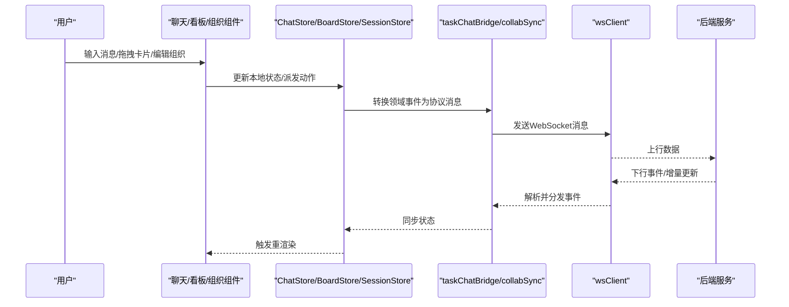
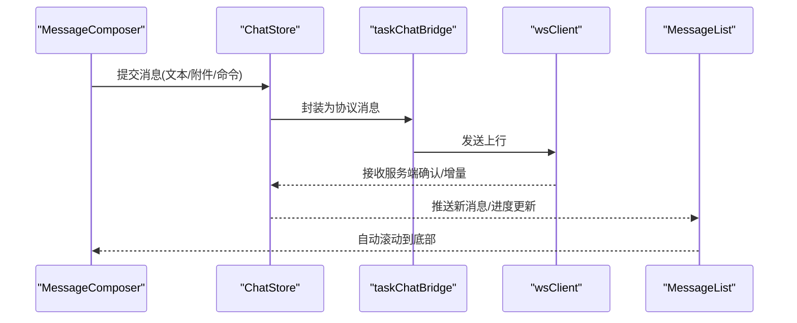
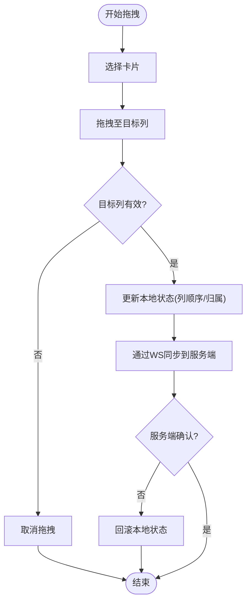
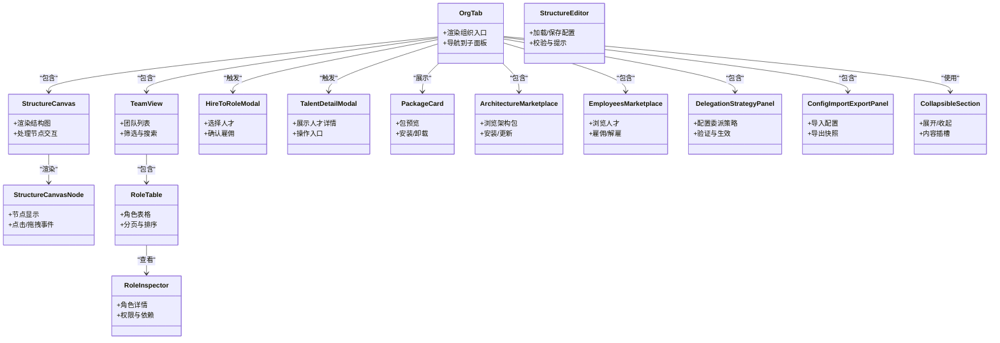
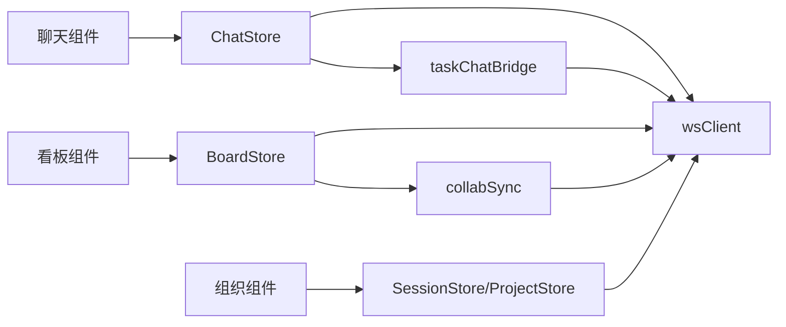

# 前端组件

<cite>
**本文引用的文件**   
- [App.tsx](file://opc/plugins/office_ui/frontend_src/App.tsx)
- [main.tsx](file://opc/plugins/office_ui/frontend_src/main.tsx)
- [MessageList.tsx](file://opc/plugins/office_ui/frontend_src/chat/MessageList.tsx)
- [MessageComposer.tsx](file://opc/plugins/office_ui/frontend_src/chat/MessageComposer.tsx)
- [SessionSidebar.tsx](file://opc/plugins/office_ui/frontend_src/chat/SessionSidebar.tsx)
- [TaskHeaderBar.tsx](file://opc/plugins/office_ui/frontend_src/chat/TaskHeaderBar.tsx)
- [WorkItemProgressCard.tsx](file://opc/plugins/office_ui/frontend_src/chat/WorkItemProgressCard.tsx)
- [DeliveryFeedbackPanel.tsx](file://opc/plugins/office_ui/frontend_src/chat/DeliveryFeedbackPanel.tsx)
- [EscalationPanel.tsx](file://opc/plugins/office_ui/frontend_src/chat/EscalationPanel.tsx)
- [RecruitmentPanel.tsx](file://opc/plugins/office_ui/frontend_src/chat/RecruitmentPanel.tsx)
- [StaffingSelectionPanel.tsx](file://opc/plugins/office_ui/frontend_src/chat/StaffingSelectionPanel.tsx)
- [ReorgPanel.tsx](file://opc/plugins/office_ui/frontend_src/chat/ReorgPanel.tsx)
- [AgentWorkPanel.tsx](file://opc/plugins/office_ui/frontend_src/chat/AgentWorkPanel.tsx)
- [MarkdownBody.tsx](file://opc/plugins/office_ui/frontend_src/chat/MarkdownBody.tsx)
- [SvgIcons.tsx](file://opc/plugins/office_ui/frontend_src/chat/SvgIcons.tsx)
- [ChatStore.ts](file://opc/plugins/office_ui/frontend_src/chat/ChatStore.ts)
- [checkpointUtils.ts](file://opc/plugins/office_ui/frontend_src/chat/checkpointUtils.ts)
- [KanbanBoardView.tsx](file://opc/plugins/office_ui/frontend_src/kanban/KanbanBoardView.tsx)
- [KanbanColumn.tsx](file://opc/plugins/office_ui/frontend_src/kanban/KanbanColumn.tsx)
- [KanbanCard.tsx](file://opc/plugins/office_ui/frontend_src/kanban/KanbanCard.tsx)
- [BoardSelector.tsx](file://opc/plugins/office_ui/frontend_src/kanban/BoardSelector.tsx)
- [ExecutionPanel.tsx](file://opc/plugins/office_ui/frontend_src/kanban/ExecutionPanel.tsx)
- [AgentStatusBar.tsx](file://opc/plugins/office_ui/frontend_src/kanban/AgentStatusBar.tsx)
- [BoardStore.ts](file://opc/plugins/office_ui/frontend_src/kanban/BoardStore.ts)
- [kanban.css](file://opc/plugins/office_ui/frontend_src/kanban/kanban.css)
- [OrgTab.tsx](file://opc/plugins/office_ui/frontend_src/org/OrgTab.tsx)
- [StructureCanvas.tsx](file://opc/plugins/office_ui/frontend_src/org/StructureCanvas.tsx)
- [StructureCanvasNode.tsx](file://opc/plugins/office_ui/frontend_src/org/StructureCanvasNode.tsx)
- [StructureEditor.tsx](file://opc/plugins/office_ui/frontend_src/org/StructureEditor.tsx)
- [TeamView.tsx](file://opc/plugins/office_ui/frontend_src/org/TeamView.tsx)
- [RoleTable.tsx](file://opc/plugins/office_ui/frontend_src/org/RoleTable.tsx)
- [RoleInspector.tsx](file://opc/plugins/office_ui/frontend_src/org/RoleInspector.tsx)
- [HireToRoleModal.tsx](file://opc/plugins/office_ui/frontend_src/org/HireToRoleModal.tsx)
- [TalentDetailModal.tsx](file://opc/plugins/office_ui/frontend_src/org/TalentDetailModal.tsx)
- [PackageCard.tsx](file://opc/plugins/office_ui/frontend_src/org/PackageCard.tsx)
- [ArchitectureMarketplace.tsx](file://opc/plugins/office_ui/frontend_src/org/ArchitectureMarketplace.tsx)
- [EmployeesMarketplace.tsx](file://opc/plugins/office_ui/frontend_src/org/EmployeesMarketplace.tsx)
- [DelegationStrategyPanel.tsx](file://opc/plugins/office_ui/frontend_src/org/DelegationStrategyPanel.tsx)
- [ConfigImportExportPanel.tsx](file://opc/plugins/office_ui/frontend_src/org/ConfigImportExportPanel.tsx)
- [CollapsibleSection.tsx](file://opc/plugins/office_ui/frontend_src/org/CollapsibleSection.tsx)
- [dagreLayout.ts](file://opc/plugins/office_ui/frontend_src/org/dagreLayout.ts)
- [org.css](file://opc/plugins/office_ui/frontend_src/org/org.css)
- [structure.css](file://opc/plugins/office_ui/frontend_src/org/structure.css)
- [team.css](file://opc/plugins/office_ui/frontend_src/org/team.css)
- [marketplace.css](file://opc/plugins/office_ui/frontend_src/org/marketplace.css)
- [config.css](file://opc/plugins/office_ui/frontend_src/org/config.css)
- [ProjectCockpit.tsx](file://opc/plugins/office_ui/frontend_src/workspace/ProjectCockpit.tsx)
- [WorkspacePage.tsx](file://opc/plugins/office_ui/frontend_src/workspace/WorkspacePage.tsx)
- [ContextPanel.tsx](file://opc/plugins/office_ui/frontend_src/workspace/ContextPanel.tsx)
- [CommsPanel.tsx](file://opc/plugins/office_ui/frontend_src/workspace/CommsPanel.tsx)
- [useResizePanel.ts](file://opc/plugins/office_ui/frontend_src/workspace/useResizePanel.ts)
- [workspace.css](file://opc/plugins/office_ui/frontend_src/workspace/workspace.css)
- [ProjectStore.ts](file://opc/plugins/office_ui/frontend_src/stores/ProjectStore.ts)
- [SessionStore.ts](file://opc/plugins/office_ui/frontend_src/stores/SessionStore.ts)
- [index.css](file://opc/plugins/office_ui/frontend_src/index.css)
- [package.json](file://opc/plugins/office_ui/frontend_src/package.json)
- [vite.config.ts](file://opc/plugins/office_ui/frontend_src/vite.config.ts)
- [wsClient.ts](file://opc/plugins/office_ui/frontend_src/lib/wsClient.ts)
- [taskChatBridge.ts](file://opc/plugins/office_ui/frontend_src/lib/taskChatBridge.ts)
- [collabSync.ts](file://opc/plugins/office_ui/frontend_src/lib/collabSync.ts)
- [runtimeOrg.ts](file://opc/plugins/office_ui/frontend_src/lib/runtimeOrg.ts)
- [workItemRuntimeIds.ts](file://opc/plugins/office_ui/frontend_src/lib/workItemRuntimeIds.ts)
- [sessionRuntime.ts](file://opc/plugins/office_ui/frontend_src/lib/sessionRuntime.ts)
- [phaseHelpers.ts](file://opc/plugins/office_ui/frontend_src/lib/phaseHelpers.ts)
- [progressLog.ts](file://opc/plugins/office_ui/frontend_src/lib/progressLog.ts)
- [messageTimelineIdentity.ts](file://opc/plugins/office_ui/frontend_src/lib/messageTimelineIdentity.ts)
- [turnIdentity.ts](file://opc/plugins/office_ui/frontend_src/lib/turnIdentity.ts)
- [sessionTitle.ts](file://opc/plugins/office_ui/frontend_src/lib/sessionTitle.ts)
- [sessionIdentity.ts](file://opc/plugins/office_ui/frontend_src/lib/sessionIdentity.ts)
- [sessionRecruitment.ts](file://opc/plugins/office_ui/frontend_src/lib/sessionRecruitment.ts)
- [roleWorkItems.ts](file://opc/plugins/office_ui/frontend_src/lib/roleWorkItems.ts)
- [contextUsage.ts](file://opc/plugins/office_ui/frontend_src/lib/contextUsage.ts)
- [progressEntryKey.ts](file://opc/plugins/office_ui/frontend_src/lib/progressEntryKey.ts)
</cite>

## 目录
1. [简介](#简介)
2. [项目结构](#项目结构)
3. [核心组件](#核心组件)
4. [架构总览](#架构总览)
5. [详细组件分析](#详细组件分析)
6. [依赖关系分析](#依赖关系分析)
7. [性能考虑](#性能考虑)
8. [故障排查指南](#故障排查指南)
9. [结论](#结论)
10. [附录](#附录)

## 简介
本文件面向Office UI插件的前端组件，聚焦基于React与TypeScript的组件体系。文档将：
- 明确组件分层：核心组件、业务组件、UI组件
- 说明组件间依赖与通信机制（状态管理、事件总线、WebSocket）
- 详解聊天界面、看板界面、组织管理三大模块的关键组件实现
- 梳理属性接口、事件处理与生命周期管理
- 总结复用模式与最佳实践
- 提供样式定制与主题配置方法
- 覆盖响应式设计与跨浏览器兼容性策略

## 项目结构
前端源码位于 office_ui 插件的 frontend_src 目录，采用按功能域分层的组织方式：
- chat：聊天会话相关组件与状态
- kanban：看板视图与任务流转
- org：组织架构、角色与人才市场等
- workspace：工作区容器与面板布局
- stores：全局状态存储
- lib：通用工具与桥接逻辑（WS、身份、进度、阶段等）
- public/assets：静态资源（如角色图片）

```mermaid
graph TB
A["入口 main.tsx"] --> B["应用 App.tsx"]
B --> C["工作区 WorkspacePage.tsx"]
C --> D["聊天 Chat(含 MessageList/Composer)"]
C --> E["看板 KanbanBoardView"]
C --> F["组织 OrgTab"]
D --> G["会话侧边栏 SessionSidebar"]
D --> H["任务头 TaskHeaderBar"]
D --> I["交付反馈 DeliveryFeedbackPanel"]
D --> J["升级 EscalationPanel"]
D --> K["招聘 RecruitmentPanel"]
D --> L["人员选择 StaffingSelectionPanel"]
D --> M["重组 ReorgPanel"]
D --> N["代理工作 AgentWorkPanel"]
D --> O["Markdown渲染 MarkdownBody"]
D --> P["图标 SvgIcons"]
E --> Q["列 KanbanColumn"]
E --> R["卡片 KanbanCard"]
E --> S["选择器 BoardSelector"]
E --> T["执行面板 ExecutionPanel"]
E --> U["代理状态 AgentStatusBar"]
F --> V["结构画布 StructureCanvas"]
F --> W["节点 StructureCanvasNode"]
F --> X["编辑器 StructureEditor"]
F --> Y["团队 TeamView"]
F --> Z["角色表 RoleTable"]
F --> AA["角色详情 RoleInspector"]
F --> BB["雇佣到角色 HireToRoleModal"]
F --> CC["人才详情 TalentDetailModal"]
F --> DD["包 PackageCard"]
F --> EE["架构市场 ArchitectureMarketplace"]
F --> FF["员工市场 EmployeesMarketplace"]
F --> GG["委派策略 DelegationStrategyPanel"]
F --> HH["导入导出 ConfigImportExportPanel"]
F --> II["折叠区块 CollapsibleSection"]
C --> JJ["上下文 ContextPanel"]
C --> KK["通讯 CommsPanel"]
C --> LL["项目仪表盘 ProjectCockpit"]
subgraph "状态与工具"
SS["ChatStore.ts"]
BS["BoardStore.ts"]
PS["ProjectStore.ts"]
SES["SessionStore.ts"]
WS["wsClient.ts"]
BR["taskChatBridge.ts"]
CS["collabSync.ts"]
RO["runtimeOrg.ts"]
WR["workItemRuntimeIds.ts"]
SR["sessionRuntime.ts"]
PH["phaseHelpers.ts"]
PL["progressLog.ts"]
MT["messageTimelineIdentity.ts"]
TI["turnIdentity.ts"]
ST["sessionTitle.ts"]
SI["sessionIdentity.ts"]
SC["sessionRecruitment.ts"]
RW["roleWorkItems.ts"]
CU["contextUsage.ts"]
PEK["progressEntryKey.ts"]
end
D --- SS
E --- BS
C --- PS
C --- SES
SS --- WS
BS --- WS
BR --- WS
CS --- WS
```

图表来源
- [main.tsx:1-50](file://opc/plugins/office_ui/frontend_src/main.tsx#L1-L50)
- [App.tsx:1-120](file://opc/plugins/office_ui/frontend_src/App.tsx#L1-L120)
- [WorkspacePage.tsx:1-120](file://opc/plugins/office_ui/frontend_src/workspace/WorkspacePage.tsx#L1-L120)
- [MessageList.tsx:1-120](file://opc/plugins/office_ui/frontend_src/chat/MessageList.tsx#L1-L120)
- [MessageComposer.tsx:1-120](file://opc/plugins/office_ui/frontend_src/chat/MessageComposer.tsx#L1-L120)
- [KanbanBoardView.tsx:1-120](file://opc/plugins/office_ui/frontend_src/kanban/KanbanBoardView.tsx#L1-L120)
- [OrgTab.tsx:1-120](file://opc/plugins/office_ui/frontend_src/org/OrgTab.tsx#L1-L120)
- [ChatStore.ts:1-120](file://opc/plugins/office_ui/frontend_src/chat/ChatStore.ts#L1-L120)
- [BoardStore.ts:1-120](file://opc/plugins/office_ui/frontend_src/kanban/BoardStore.ts#L1-L120)
- [ProjectStore.ts:1-120](file://opc/plugins/office_ui/frontend_src/stores/ProjectStore.ts#L1-L120)
- [SessionStore.ts:1-120](file://opc/plugins/office_ui/frontend_src/stores/SessionStore.ts#L1-L120)
- [wsClient.ts:1-120](file://opc/plugins/office_ui/frontend_src/lib/wsClient.ts#L1-L120)

章节来源
- [main.tsx:1-50](file://opc/plugins/office_ui/frontend_src/main.tsx#L1-L50)
- [App.tsx:1-120](file://opc/plugins/office_ui/frontend_src/App.tsx#L1-L120)
- [package.json:1-120](file://opc/plugins/office_ui/frontend_src/package.json#L1-L120)
- [vite.config.ts:1-120](file://opc/plugins/office_ui/frontend_src/vite.config.ts#L1-L120)

## 核心组件
本节对三类组件进行分层说明，并给出职责边界与交互要点。

- 核心组件（容器/编排）
  - 应用根与路由：负责挂载、全局状态注入、页面切换与布局
  - 工作区容器：承载聊天、看板、组织三大区域，并提供面板尺寸控制与上下文/通讯面板集成
  - 关键文件参考：
    - [App.tsx](file://opc/plugins/office_ui/frontend_src/App.tsx)
    - [WorkspacePage.tsx](file://opc/plugins/office_ui/frontend_src/workspace/WorkspacePage.tsx)
    - [ProjectCockpit.tsx](file://opc/plugins/office_ui/frontend_src/workspace/ProjectCockpit.tsx)
    - [useResizePanel.ts](file://opc/plugins/office_ui/frontend_src/workspace/useResizePanel.ts)

- 业务组件（领域能力）
  - 聊天域：消息列表、输入框、会话侧边栏、任务头、进度卡片、交付反馈、升级、招聘、人员选择、重组、代理工作面板、Markdown渲染、图标
  - 看板域：看板视图、列、卡片、选择器、执行面板、代理状态
  - 组织域：组织标签页、结构画布与节点、编辑器、团队视图、角色表与详情、雇佣到角色、人才详情、包、架构市场、员工市场、委派策略、导入导出、折叠区块
  - 关键文件参考：
    - 聊天：[MessageList.tsx](file://opc/plugins/office_ui/frontend_src/chat/MessageList.tsx)、[MessageComposer.tsx](file://opc/plugins/office_ui/frontend_src/chat/MessageComposer.tsx)、[SessionSidebar.tsx](file://opc/plugins/office_ui/frontend_src/chat/SessionSidebar.tsx)、[TaskHeaderBar.tsx](file://opc/plugins/office_ui/frontend_src/chat/TaskHeaderBar.tsx)、[WorkItemProgressCard.tsx](file://opc/plugins/office_ui/frontend_src/chat/WorkItemProgressCard.tsx)、[DeliveryFeedbackPanel.tsx](file://opc/plugins/office_ui/frontend_src/chat/DeliveryFeedbackPanel.tsx)、[EscalationPanel.tsx](file://opc/plugins/office_ui/frontend_src/chat/EscalationPanel.tsx)、[RecruitmentPanel.tsx](file://opc/plugins/office_ui/frontend_src/chat/RecruitmentPanel.tsx)、[StaffingSelectionPanel.tsx](file://opc/plugins/office_ui/frontend_src/chat/StaffingSelectionPanel.tsx)、[ReorgPanel.tsx](file://opc/plugins/office_ui/frontend_src/chat/ReorgPanel.tsx)、[AgentWorkPanel.tsx](file://opc/plugins/office_ui/frontend_src/chat/AgentWorkPanel.tsx)、[MarkdownBody.tsx](file://opc/plugins/office_ui/frontend_src/chat/MarkdownBody.tsx)、[SvgIcons.tsx](file://opc/plugins/office_ui/frontend_src/chat/SvgIcons.tsx)
    - 看板：[KanbanBoardView.tsx](file://opc/plugins/office_ui/frontend_src/kanban/KanbanBoardView.tsx)、[KanbanColumn.tsx](file://opc/plugins/office_ui/frontend_src/kanban/KanbanColumn.tsx)、[KanbanCard.tsx](file://opc/plugins/office_ui/frontend_src/kanban/KanbanCard.tsx)、[BoardSelector.tsx](file://opc/plugins/office_ui/frontend_src/kanban/BoardSelector.tsx)、[ExecutionPanel.tsx](file://opc/plugins/office_ui/frontend_src/kanban/ExecutionPanel.tsx)、[AgentStatusBar.tsx](file://opc/plugins/office_ui/frontend_src/kanban/AgentStatusBar.tsx)
    - 组织：[OrgTab.tsx](file://opc/plugins/office_ui/frontend_src/org/OrgTab.tsx)、[StructureCanvas.tsx](file://opc/plugins/office_ui/frontend_src/org/StructureCanvas.tsx)、[StructureCanvasNode.tsx](file://opc/plugins/office_ui/frontend_src/org/StructureCanvasNode.tsx)、[StructureEditor.tsx](file://opc/plugins/office_ui/frontend_src/org/StructureEditor.tsx)、[TeamView.tsx](file://opc/plugins/office_ui/frontend_src/org/TeamView.tsx)、[RoleTable.tsx](file://opc/plugins/office_ui/frontend_src/org/RoleTable.tsx)、[RoleInspector.tsx](file://opc/plugins/office_ui/frontend_src/org/RoleInspector.tsx)、[HireToRoleModal.tsx](file://opc/plugins/office_ui/frontend_src/org/HireToRoleModal.tsx)、[TalentDetailModal.tsx](file://opc/plugins/office_ui/frontend_src/org/TalentDetailModal.tsx)、[PackageCard.tsx](file://opc/plugins/office_ui/frontend_src/org/PackageCard.tsx)、[ArchitectureMarketplace.tsx](file://opc/plugins/office_ui/frontend_src/org/ArchitectureMarketplace.tsx)、[EmployeesMarketplace.tsx](file://opc/plugins/office_ui/frontend_src/org/EmployeesMarketplace.tsx)、[DelegationStrategyPanel.tsx](file://opc/plugins/office_ui/frontend_src/org/DelegationStrategyPanel.tsx)、[ConfigImportExportPanel.tsx](file://opc/plugins/office_ui/frontend_src/org/ConfigImportExportPanel.tsx)、[CollapsibleSection.tsx](file://opc/plugins/office_ui/frontend_src/org/CollapsibleSection.tsx)

- UI组件（展示/交互基础）
  - 通用展示：Markdown渲染、SVG图标、折叠区块、包卡片等
  - 样式与主题：各域CSS文件集中管理主题变量与布局规则
  - 关键文件参考：
    - [MarkdownBody.tsx](file://opc/plugins/office_ui/frontend_src/chat/MarkdownBody.tsx)
    - [SvgIcons.tsx](file://opc/plugins/office_ui/frontend_src/chat/SvgIcons.tsx)
    - [CollapsibleSection.tsx](file://opc/plugins/office_ui/frontend_src/org/CollapsibleSection.tsx)
    - [PackageCard.tsx](file://opc/plugins/office_ui/frontend_src/org/PackageCard.tsx)
    - 样式：[index.css](file://opc/plugins/office_ui/frontend_src/index.css)、[kanban.css](file://opc/plugins/office_ui/frontend_src/kanban/kanban.css)、[org.css](file://opc/plugins/office_ui/frontend_src/org/org.css)、[structure.css](file://opc/plugins/office_ui/frontend_src/org/structure.css)、[team.css](file://opc/plugins/office_ui/frontend_src/org/team.css)、[marketplace.css](file://opc/plugins/office_ui/frontend_src/org/marketplace.css)、[config.css](file://opc/plugins/office_ui/frontend_src/org/config.css)、[workspace.css](file://opc/plugins/office_ui/frontend_src/workspace/workspace.css)

章节来源
- [App.tsx:1-120](file://opc/plugins/office_ui/frontend_src/App.tsx#L1-L120)
- [WorkspacePage.tsx:1-120](file://opc/plugins/office_ui/frontend_src/workspace/WorkspacePage.tsx#L1-L120)
- [MessageList.tsx:1-120](file://opc/plugins/office_ui/frontend_src/chat/MessageList.tsx#L1-L120)
- [MessageComposer.tsx:1-120](file://opc/plugins/office_ui/frontend_src/chat/MessageComposer.tsx#L1-L120)
- [KanbanBoardView.tsx:1-120](file://opc/plugins/office_ui/frontend_src/kanban/KanbanBoardView.tsx#L1-L120)
- [OrgTab.tsx:1-120](file://opc/plugins/office_ui/frontend_src/org/OrgTab.tsx#L1-L120)
- [index.css:1-120](file://opc/plugins/office_ui/frontend_src/index.css#L1-L120)

## 架构总览
整体采用“容器-业务-展示”的分层架构，结合集中式状态管理与WebSocket实时通信。

图表来源
- [MessageComposer.tsx:1-120](file://opc/plugins/office_ui/frontend_src/chat/MessageComposer.tsx#L1-L120)
- [MessageList.tsx:1-120](file://opc/plugins/office_ui/frontend_src/chat/MessageList.tsx#L1-L120)
- [KanbanBoardView.tsx:1-120](file://opc/plugins/office_ui/frontend_src/kanban/KanbanBoardView.tsx#L1-L120)
- [BoardStore.ts:1-120](file://opc/plugins/office_ui/frontend_src/kanban/BoardStore.ts#L1-L120)
- [ChatStore.ts:1-120](file://opc/plugins/office_ui/frontend_src/chat/ChatStore.ts#L1-L120)
- [taskChatBridge.ts:1-120](file://opc/plugins/office_ui/frontend_src/lib/taskChatBridge.ts#L1-L120)
- [collabSync.ts:1-120](file://opc/plugins/office_ui/frontend_src/lib/collabSync.ts#L1-L120)
- [wsClient.ts:1-120](file://opc/plugins/office_ui/frontend_src/lib/wsClient.ts#L1-L120)

## 详细组件分析

### 聊天界面组件族
- 组件职责
  - MessageList：消息流渲染、滚动定位、时间线标识、进度条目键生成
  - MessageComposer：输入校验、提交、附件与快捷命令
  - SessionSidebar：会话列表、标题与身份映射
  - TaskHeaderBar：当前任务元信息、操作入口
  - WorkItemProgressCard：工作项进度可视化
  - DeliveryFeedbackPanel/EscalationPanel/RecruitmentPanel/StaffingSelectionPanel/ReorgPanel：特定流程面板
  - AgentWorkPanel：代理工作视图
  - MarkdownBody/SvgIcons：展示与图标
- 状态与通信
  - 通过 ChatStore 维护消息、会话、进度等；通过 wsClient 与后端保持双向通信；借助 taskChatBridge 与 collabSync 完成协议适配与协作同步
- 关键实现要点
  - 时间线与去重：使用 messageTimelineIdentity 与 progressEntryKey 保证稳定键值
  - 阶段辅助：phaseHelpers 用于阶段判断与渲染分支
  - 会话运行时：sessionRuntime、sessionIdentity、sessionTitle、sessionRecruitment 提供会话维度能力
  - 工作项运行时：workItemRuntimeIds、roleWorkItems 提供ID与角色关联
  - 进度日志：progressLog 记录与回放
- 示例调用序列（消息发送）

图表来源
- [MessageComposer.tsx:1-120](file://opc/plugins/office_ui/frontend_src/chat/MessageComposer.tsx#L1-L120)
- [ChatStore.ts:1-120](file://opc/plugins/office_ui/frontend_src/chat/ChatStore.ts#L1-L120)
- [taskChatBridge.ts:1-120](file://opc/plugins/office_ui/frontend_src/lib/taskChatBridge.ts#L1-L120)
- [wsClient.ts:1-120](file://opc/plugins/office_ui/frontend_src/lib/wsClient.ts#L1-L120)
- [MessageList.tsx:1-120](file://opc/plugins/office_ui/frontend_src/chat/MessageList.tsx#L1-L120)

章节来源
- [MessageList.tsx:1-120](file://opc/plugins/office_ui/frontend_src/chat/MessageList.tsx#L1-L120)
- [MessageComposer.tsx:1-120](file://opc/plugins/office_ui/frontend_src/chat/MessageComposer.tsx#L1-L120)
- [SessionSidebar.tsx:1-120](file://opc/plugins/office_ui/frontend_src/chat/SessionSidebar.tsx#L1-L120)
- [TaskHeaderBar.tsx:1-120](file://opc/plugins/office_ui/frontend_src/chat/TaskHeaderBar.tsx#L1-L120)
- [WorkItemProgressCard.tsx:1-120](file://opc/plugins/office_ui/frontend_src/chat/WorkItemProgressCard.tsx#L1-L120)
- [DeliveryFeedbackPanel.tsx:1-120](file://opc/plugins/office_ui/frontend_src/chat/DeliveryFeedbackPanel.tsx#L1-L120)
- [EscalationPanel.tsx:1-120](file://opc/plugins/office_ui/frontend_src/chat/EscalationPanel.tsx#L1-L120)
- [RecruitmentPanel.tsx:1-120](file://opc/plugins/office_ui/frontend_src/chat/RecruitmentPanel.tsx#L1-L120)
- [StaffingSelectionPanel.tsx:1-120](file://opc/plugins/office_ui/frontend_src/chat/StaffingSelectionPanel.tsx#L1-L120)
- [ReorgPanel.tsx:1-120](file://opc/plugins/office_ui/frontend_src/chat/ReorgPanel.tsx#L1-L120)
- [AgentWorkPanel.tsx:1-120](file://opc/plugins/office_ui/frontend_src/chat/AgentWorkPanel.tsx#L1-L120)
- [MarkdownBody.tsx:1-120](file://opc/plugins/office_ui/frontend_src/chat/MarkdownBody.tsx#L1-L120)
- [SvgIcons.tsx:1-120](file://opc/plugins/office_ui/frontend_src/chat/SvgIcons.tsx#L1-L120)
- [ChatStore.ts:1-120](file://opc/plugins/office_ui/frontend_src/chat/ChatStore.ts#L1-L120)
- [checkpointUtils.ts:1-120](file://opc/plugins/office_ui/frontend_src/chat/checkpointUtils.ts#L1-L120)
- [messageTimelineIdentity.ts:1-120](file://opc/plugins/office_ui/frontend_src/lib/messageTimelineIdentity.ts#L1-L120)
- [progressEntryKey.ts:1-120](file://opc/plugins/office_ui/frontend_src/lib/progressEntryKey.ts#L1-L120)
- [phaseHelpers.ts:1-120](file://opc/plugins/office_ui/frontend_src/lib/phaseHelpers.ts#L1-L120)
- [progressLog.ts:1-120](file://opc/plugins/office_ui/frontend_src/lib/progressLog.ts#L1-L120)
- [sessionRuntime.ts:1-120](file://opc/plugins/office_ui/frontend_src/lib/sessionRuntime.ts#L1-L120)
- [sessionIdentity.ts:1-120](file://opc/plugins/office_ui/frontend_src/lib/sessionIdentity.ts#L1-L120)
- [sessionTitle.ts:1-120](file://opc/plugins/office_ui/frontend_src/lib/sessionTitle.ts#L1-L120)
- [sessionRecruitment.ts:1-120](file://opc/plugins/office_ui/frontend_src/lib/sessionRecruitment.ts#L1-L120)
- [workItemRuntimeIds.ts:1-120](file://opc/plugins/office_ui/frontend_src/lib/workItemRuntimeIds.ts#L1-L120)
- [roleWorkItems.ts:1-120](file://opc/plugins/office_ui/frontend_src/lib/roleWorkItems.ts#L1-L120)
- [contextUsage.ts:1-120](file://opc/plugins/office_ui/frontend_src/lib/contextUsage.ts#L1-L120)

### 看板界面组件族
- 组件职责
  - KanbanBoardView：看板容器、列集合与拖拽协调
  - KanbanColumn：列容器、排序与占位
  - KanbanCard：任务卡片、状态与操作入口
  - BoardSelector：看板选择与切换
  - ExecutionPanel：执行过程与日志
  - AgentStatusBar：代理运行状态
- 状态与通信
  - BoardStore 维护看板数据与变更；wsClient 提供实时同步；collabSync 保障多端一致性
- 典型流程（拖拽移动）

图表来源
- [KanbanBoardView.tsx:1-120](file://opc/plugins/office_ui/frontend_src/kanban/KanbanBoardView.tsx#L1-L120)
- [KanbanColumn.tsx:1-120](file://opc/plugins/office_ui/frontend_src/kanban/KanbanColumn.tsx#L1-L120)
- [KanbanCard.tsx:1-120](file://opc/plugins/office_ui/frontend_src/kanban/KanbanCard.tsx#L1-L120)
- [BoardStore.ts:1-120](file://opc/plugins/office_ui/frontend_src/kanban/BoardStore.ts#L1-L120)
- [collabSync.ts:1-120](file://opc/plugins/office_ui/frontend_src/lib/collabSync.ts#L1-L120)
- [wsClient.ts:1-120](file://opc/plugins/office_ui/frontend_src/lib/wsClient.ts#L1-L120)

章节来源
- [KanbanBoardView.tsx:1-120](file://opc/plugins/office_ui/frontend_src/kanban/KanbanBoardView.tsx#L1-L120)
- [KanbanColumn.tsx:1-120](file://opc/plugins/office_ui/frontend_src/kanban/KanbanColumn.tsx#L1-L120)
- [KanbanCard.tsx:1-120](file://opc/plugins/office_ui/frontend_src/kanban/KanbanCard.tsx#L1-L120)
- [BoardSelector.tsx:1-120](file://opc/plugins/office_ui/frontend_src/kanban/BoardSelector.tsx#L1-L120)
- [ExecutionPanel.tsx:1-120](file://opc/plugins/office_ui/frontend_src/kanban/ExecutionPanel.tsx#L1-L120)
- [AgentStatusBar.tsx:1-120](file://opc/plugins/office_ui/frontend_src/kanban/AgentStatusBar.tsx#L1-L120)
- [BoardStore.ts:1-120](file://opc/plugins/office_ui/frontend_src/kanban/BoardStore.ts#L1-L120)
- [kanban.css:1-120](file://opc/plugins/office_ui/frontend_src/kanban/kanban.css#L1-L120)

### 组织管理组件族
- 组件职责
  - OrgTab：组织模块入口与导航
  - StructureCanvas/StructureCanvasNode：组织结构可视化与节点交互
  - StructureEditor：结构与配置的编辑入口
  - TeamView/RoleTable/RoleInspector：团队与角色管理
  - HireToRoleModal/TalentDetailModal：雇佣与人才详情
  - PackageCard/ArchitectureMarketplace/EmployeesMarketplace：包与人才市场
  - DelegationStrategyPanel/ConfigImportExportPanel：委派策略与导入导出
  - CollapsibleSection：可折叠区块
- 布局与算法
  - dagreLayout 提供有向无环图布局计算
- 样式与主题
  - org.css/structure.css/team.css/marketplace.css/config.css 分别定义不同子域的样式与主题变量

图表来源
- [OrgTab.tsx:1-120](file://opc/plugins/office_ui/frontend_src/org/OrgTab.tsx#L1-L120)
- [StructureCanvas.tsx:1-120](file://opc/plugins/office_ui/frontend_src/org/StructureCanvas.tsx#L1-L120)
- [StructureCanvasNode.tsx:1-120](file://opc/plugins/office_ui/frontend_src/org/StructureCanvasNode.tsx#L1-L120)
- [StructureEditor.tsx:1-120](file://opc/plugins/office_ui/frontend_src/org/StructureEditor.tsx#L1-L120)
- [TeamView.tsx:1-120](file://opc/plugins/office_ui/frontend_src/org/TeamView.tsx#L1-L120)
- [RoleTable.tsx:1-120](file://opc/plugins/office_ui/frontend_src/org/RoleTable.tsx#L1-L120)
- [RoleInspector.tsx:1-120](file://opc/plugins/office_ui/frontend_src/org/RoleInspector.tsx#L1-L120)
- [HireToRoleModal.tsx:1-120](file://opc/plugins/office_ui/frontend_src/org/HireToRoleModal.tsx#L1-L120)
- [TalentDetailModal.tsx:1-120](file://opc/plugins/office_ui/frontend_src/org/TalentDetailModal.tsx#L1-L120)
- [PackageCard.tsx:1-120](file://opc/plugins/office_ui/frontend_src/org/PackageCard.tsx#L1-L120)
- [ArchitectureMarketplace.tsx:1-120](file://opc/plugins/office_ui/frontend_src/org/ArchitectureMarketplace.tsx#L1-L120)
- [EmployeesMarketplace.tsx:1-120](file://opc/plugins/office_ui/frontend_src/org/EmployeesMarketplace.tsx#L1-L120)
- [DelegationStrategyPanel.tsx:1-120](file://opc/plugins/office_ui/frontend_src/org/DelegationStrategyPanel.tsx#L1-L120)
- [ConfigImportExportPanel.tsx:1-120](file://opc/plugins/office_ui/frontend_src/org/ConfigImportExportPanel.tsx#L1-L120)
- [CollapsibleSection.tsx:1-120](file://opc/plugins/office_ui/frontend_src/org/CollapsibleSection.tsx#L1-L120)
- [dagreLayout.ts:1-120](file://opc/plugins/office_ui/frontend_src/org/dagreLayout.ts#L1-L120)

章节来源
- [OrgTab.tsx:1-120](file://opc/plugins/office_ui/frontend_src/org/OrgTab.tsx#L1-L120)
- [StructureCanvas.tsx:1-120](file://opc/plugins/office_ui/frontend_src/org/StructureCanvas.tsx#L1-L120)
- [StructureCanvasNode.tsx:1-120](file://opc/plugins/office_ui/frontend_src/org/StructureCanvasNode.tsx#L1-L120)
- [StructureEditor.tsx:1-120](file://opc/plugins/office_ui/frontend_src/org/StructureEditor.tsx#L1-L120)
- [TeamView.tsx:1-120](file://opc/plugins/office_ui/frontend_src/org/TeamView.tsx#L1-L120)
- [RoleTable.tsx:1-120](file://opc/plugins/office_ui/frontend_src/org/RoleTable.tsx#L1-L120)
- [RoleInspector.tsx:1-120](file://opc/plugins/office_ui/frontend_src/org/RoleInspector.tsx#L1-L120)
- [HireToRoleModal.tsx:1-120](file://opc/plugins/office_ui/frontend_src/org/HireToRoleModal.tsx#L1-L120)
- [TalentDetailModal.tsx:1-120](file://opc/plugins/office_ui/frontend_src/org/TalentDetailModal.tsx#L1-L120)
- [PackageCard.tsx:1-120](file://opc/plugins/office_ui/frontend_src/org/PackageCard.tsx#L1-L120)
- [ArchitectureMarketplace.tsx:1-120](file://opc/plugins/office_ui/frontend_src/org/ArchitectureMarketplace.tsx#L1-L120)
- [EmployeesMarketplace.tsx:1-120](file://opc/plugins/office_ui/frontend_src/org/EmployeesMarketplace.tsx#L1-L120)
- [DelegationStrategyPanel.tsx:1-120](file://opc/plugins/office_ui/frontend_src/org/DelegationStrategyPanel.tsx#L1-L120)
- [ConfigImportExportPanel.tsx:1-120](file://opc/plugins/office_ui/frontend_src/org/ConfigImportExportPanel.tsx#L1-L120)
- [CollapsibleSection.tsx:1-120](file://opc/plugins/office_ui/frontend_src/org/CollapsibleSection.tsx#L1-L120)
- [dagreLayout.ts:1-120](file://opc/plugins/office_ui/frontend_src/org/dagreLayout.ts#L1-L120)
- [org.css:1-120](file://opc/plugins/office_ui/frontend_src/org/org.css#L1-L120)
- [structure.css:1-120](file://opc/plugins/office_ui/frontend_src/org/structure.css#L1-L120)
- [team.css:1-120](file://opc/plugins/office_ui/frontend_src/org/team.css#L1-L120)
- [marketplace.css:1-120](file://opc/plugins/office_ui/frontend_src/org/marketplace.css#L1-L120)
- [config.css:1-120](file://opc/plugins/office_ui/frontend_src/org/config.css#L1-L120)

### 工作区与面板
- 工作区容器
  - WorkspacePage：主布局、标签页切换、面板尺寸控制
  - useResizePanel：面板拖拽调整大小
  - ProjectCockpit：项目概览与快速入口
- 上下文与通讯
  - ContextPanel：上下文信息展示
  - CommsPanel：通讯通道与消息转发
- 样式
  - workspace.css：统一布局与间距

章节来源
- [WorkspacePage.tsx:1-120](file://opc/plugins/office_ui/frontend_src/workspace/WorkspacePage.tsx#L1-L120)
- [useResizePanel.ts:1-120](file://opc/plugins/office_ui/frontend_src/workspace/useResizePanel.ts#L1-L120)
- [ProjectCockpit.tsx:1-120](file://opc/plugins/office_ui/frontend_src/workspace/ProjectCockpit.tsx#L1-L120)
- [ContextPanel.tsx:1-120](file://opc/plugins/office_ui/frontend_src/workspace/ContextPanel.tsx#L1-L120)
- [CommsPanel.tsx:1-120](file://opc/plugins/office_ui/frontend_src/workspace/CommsPanel.tsx#L1-L120)
- [workspace.css:1-120](file://opc/plugins/office_ui/frontend_src/workspace/workspace.css#L1-L120)

## 依赖关系分析
- 组件耦合
  - 容器组件（WorkspacePage、App）低耦合地组合业务组件
  - 业务组件通过 Store 与 lib 工具解耦外部依赖
- 直接依赖
  - 聊天/看板/组织组件依赖各自 Store（ChatStore、BoardStore）
  - 所有需要网络能力的组件通过 wsClient 与后端通信
  - 领域桥接由 taskChatBridge、collabSync 承担
- 间接依赖
  - 身份、标题、阶段、进度等工具函数被多个组件复用
- 潜在循环
  - 通过单向依赖（组件→Store→lib→wsClient）避免循环引用

图表来源
- [ChatStore.ts:1-120](file://opc/plugins/office_ui/frontend_src/chat/ChatStore.ts#L1-L120)
- [BoardStore.ts:1-120](file://opc/plugins/office_ui/frontend_src/kanban/BoardStore.ts#L1-L120)
- [SessionStore.ts:1-120](file://opc/plugins/office_ui/frontend_src/stores/SessionStore.ts#L1-L120)
- [ProjectStore.ts:1-120](file://opc/plugins/office_ui/frontend_src/stores/ProjectStore.ts#L1-L120)
- [wsClient.ts:1-120](file://opc/plugins/office_ui/frontend_src/lib/wsClient.ts#L1-L120)
- [taskChatBridge.ts:1-120](file://opc/plugins/office_ui/frontend_src/lib/taskChatBridge.ts#L1-L120)
- [collabSync.ts:1-120](file://opc/plugins/office_ui/frontend_src/lib/collabSync.ts#L1-L120)

章节来源
- [ChatStore.ts:1-120](file://opc/plugins/office_ui/frontend_src/chat/ChatStore.ts#L1-L120)
- [BoardStore.ts:1-120](file://opc/plugins/office_ui/frontend_src/kanban/BoardStore.ts#L1-L120)
- [SessionStore.ts:1-120](file://opc/plugins/office_ui/frontend_src/stores/SessionStore.ts#L1-L120)
- [ProjectStore.ts:1-120](file://opc/plugins/office_ui/frontend_src/stores/ProjectStore.ts#L1-L120)
- [wsClient.ts:1-120](file://opc/plugins/office_ui/frontend_src/lib/wsClient.ts#L1-L120)
- [taskChatBridge.ts:1-120](file://opc/plugins/office_ui/frontend_src/lib/taskChatBridge.ts#L1-L120)
- [collabSync.ts:1-120](file://opc/plugins/office_ui/frontend_src/lib/collabSync.ts#L1-L120)

## 性能考虑
- 列表渲染优化
  - 使用稳定的 key（messageTimelineIdentity、progressEntryKey）减少不必要的重渲染
  - 虚拟滚动或分页加载在长消息/大看板场景下可显著降低内存占用
- 状态更新批处理
  - 合并多次小更新为批量更新，减少中间渲染
- WebSocket 节流与去抖
  - 高频事件（如进度日志）进行节流，避免频繁重绘
- 计算密集型任务
  - 将布局计算（如 dagreLayout）移至 Web Worker 或按需延迟计算
- 资源加载
  - 静态资源（角色图片）按需懒加载，首屏最小化

## 故障排查指南
- 常见问题
  - 消息不更新：检查 wsClient 连接状态与事件订阅是否正确
  - 看板拖拽无效：确认目标列有效性校验与服务端确认回调
  - 组织配置导入失败：检查导入格式与字段校验
- 调试建议
  - 在 Store 中增加日志输出，追踪状态变更路径
  - 使用浏览器开发者工具的 Network 面板观察 WS 帧
  - 针对复杂流程，添加断点于桥接层（taskChatBridge、collabSync）

章节来源
- [wsClient.ts:1-120](file://opc/plugins/office_ui/frontend_src/lib/wsClient.ts#L1-L120)
- [taskChatBridge.ts:1-120](file://opc/plugins/office_ui/frontend_src/lib/taskChatBridge.ts#L1-L120)
- [collabSync.ts:1-120](file://opc/plugins/office_ui/frontend_src/lib/collabSync.ts#L1-L120)
- [BoardStore.ts:1-120](file://opc/plugins/office_ui/frontend_src/kanban/BoardStore.ts#L1-L120)
- [ChatStore.ts:1-120](file://opc/plugins/office_ui/frontend_src/chat/ChatStore.ts#L1-L120)

## 结论
本组件体系以清晰的层次划分与明确的职责边界为基础，结合集中式状态管理与实时通信，实现了聊天、看板与组织管理等核心业务场景。通过统一的工具库与样式规范，提升了可维护性与可扩展性。建议在后续迭代中持续完善虚拟化、错误恢复与可观测性，进一步提升用户体验与系统稳定性。

## 附录
- 组件属性接口与事件处理
  - 聊天组件：消息提交、附件上传、快捷命令、滚动定位、进度监听
  - 看板组件：卡片创建/删除/移动、列排序、执行面板开关、状态轮询
  - 组织组件：节点点击/拖拽、配置导入/导出、市场安装/卸载、委派策略保存
- 生命周期管理
  - 组件挂载时初始化状态与订阅事件
  - 组件卸载时清理定时器、断开WS、移除事件监听
- 样式定制与主题配置
  - 通过 index.css 与域内 CSS 文件定义主题变量（颜色、字号、间距）
  - 使用 CSS 变量覆盖默认主题，实现深色/浅色切换
- 响应式设计
  - 使用相对单位与媒体查询适配不同屏幕尺寸
  - 面板布局在小屏下自动折叠或堆叠
- 跨浏览器兼容性
  - 使用现代浏览器特性时需提供降级方案
  - 构建配置（vite.config.ts）确保目标浏览器兼容范围

章节来源
- [index.css:1-120](file://opc/plugins/office_ui/frontend_src/index.css#L1-L120)
- [kanban.css:1-120](file://opc/plugins/office_ui/frontend_src/kanban/kanban.css#L1-L120)
- [org.css:1-120](file://opc/plugins/office_ui/frontend_src/org/org.css#L1-L120)
- [structure.css:1-120](file://opc/plugins/office_ui/frontend_src/org/structure.css#L1-L120)
- [team.css:1-120](file://opc/plugins/office_ui/frontend_src/org/team.css#L1-L120)
- [marketplace.css:1-120](file://opc/plugins/office_ui/frontend_src/org/marketplace.css#L1-L120)
- [config.css:1-120](file://opc/plugins/office_ui/frontend_src/org/config.css#L1-L120)
- [workspace.css:1-120](file://opc/plugins/office_ui/frontend_src/workspace/workspace.css#L1-L120)
- [vite.config.ts:1-120](file://opc/plugins/office_ui/frontend_src/vite.config.ts#L1-L120)