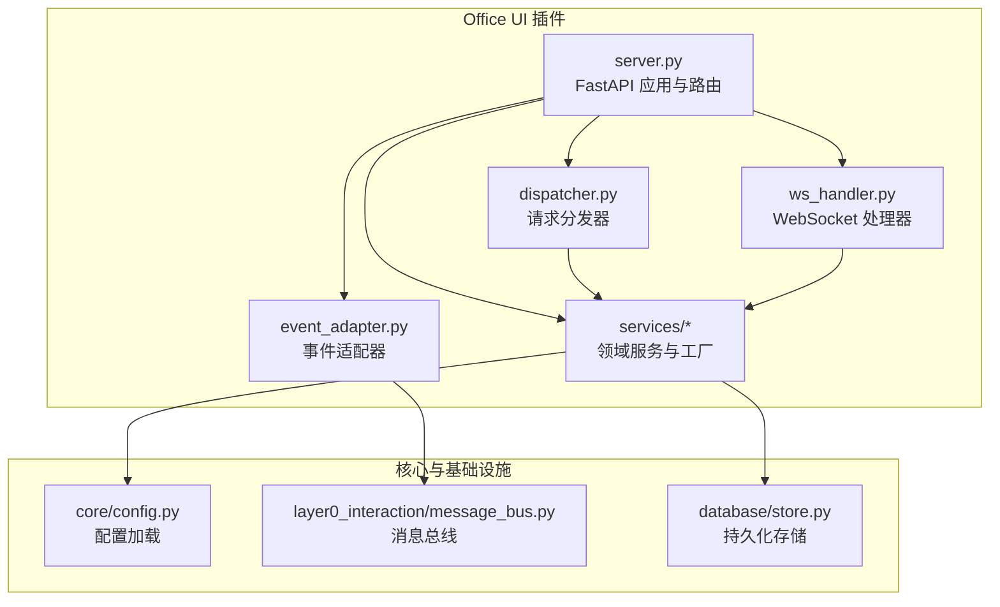
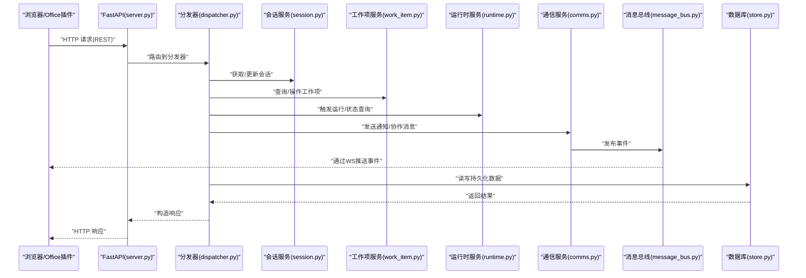
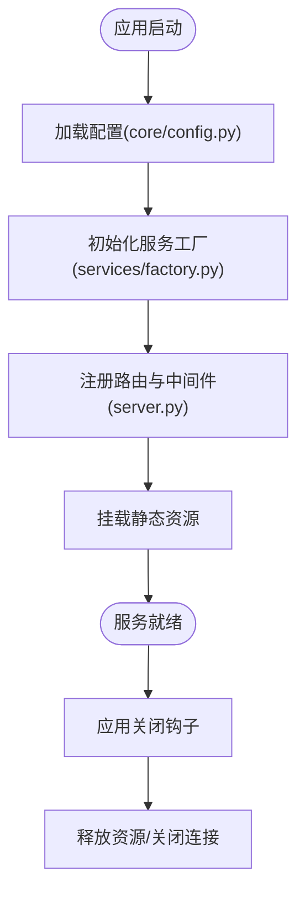
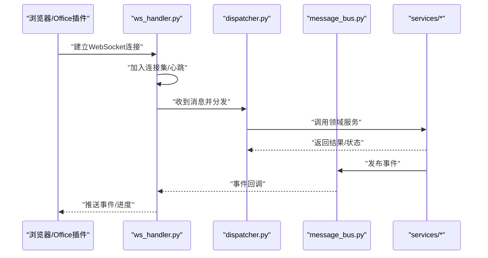
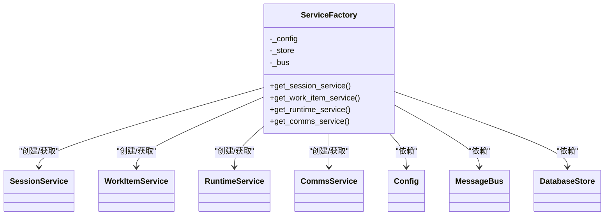
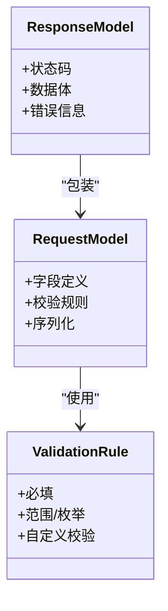
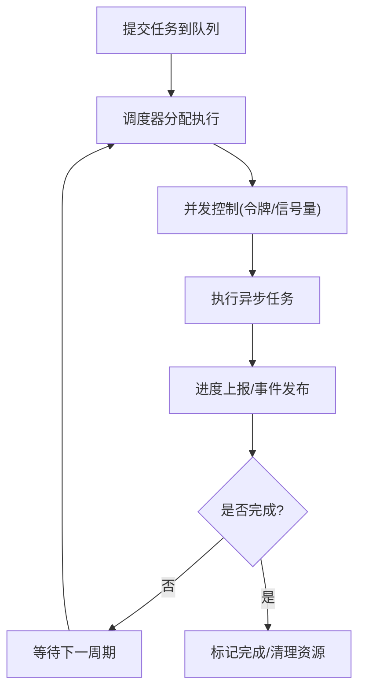
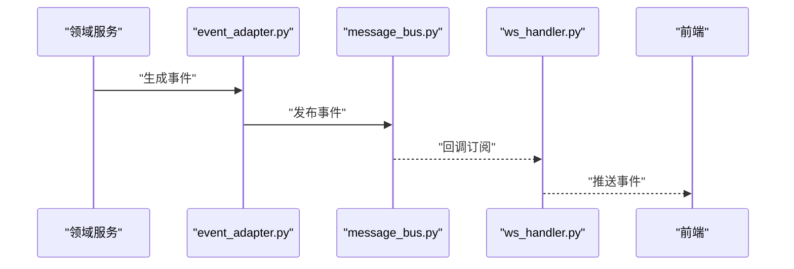
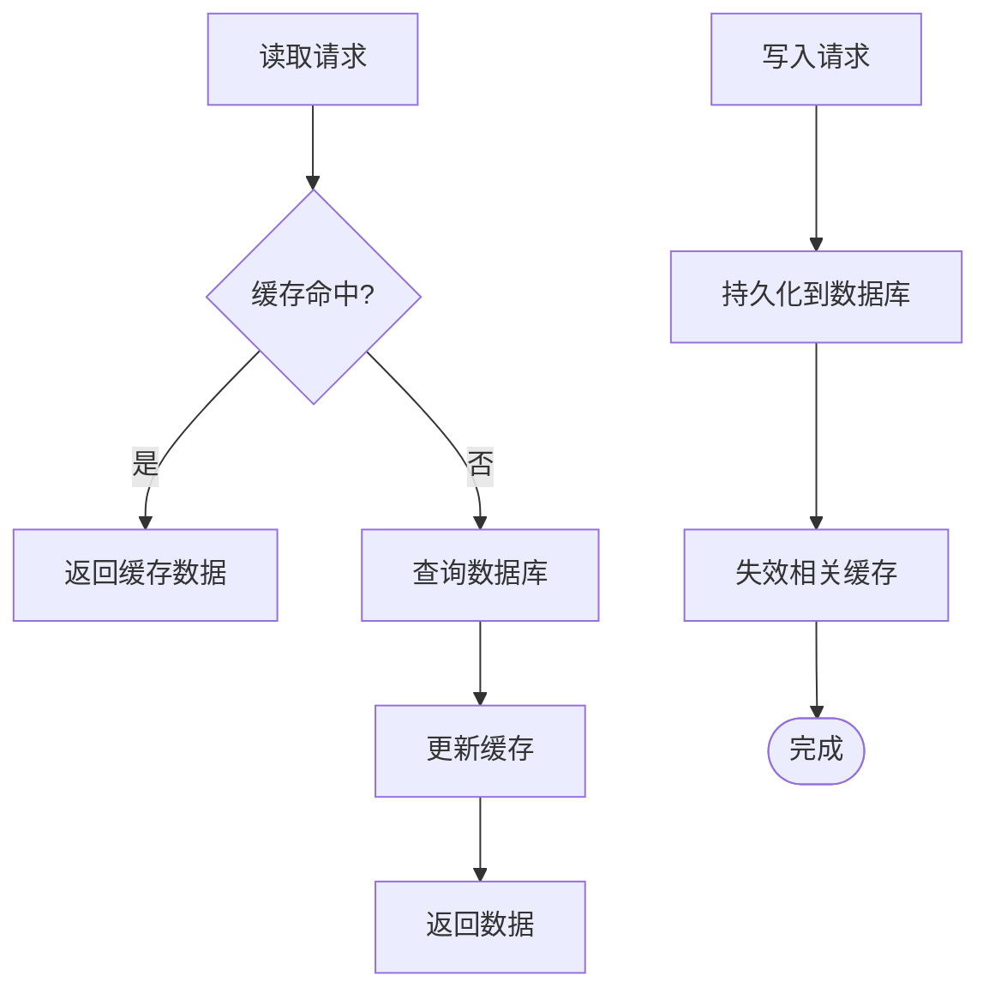
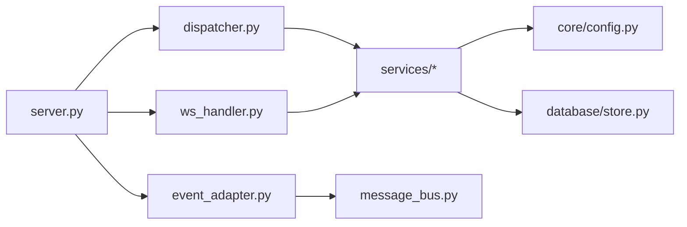

# 后端服务

<cite>
**本文引用的文件**   
- [server.py](file://opc/plugins/office_ui/server.py)
- [ws_handler.py](file://opc/plugins/office_ui/ws_handler.py)
- [dispatcher.py](file://opc/plugins/office_ui/dispatcher.py)
- [event_adapter.py](file://opc/plugins/office_ui/event_adapter.py)
- [services/factory.py](file://opc/plugins/office_ui/services/factory.py)
- [services/models.py](file://opc/plugins/office_ui/services/models.py)
- [services/runtime.py](file://opc/plugins/office_ui/services/runtime.py)
- [services/session.py](file://opc/plugins/office_ui/services/session.py)
- [services/work_item.py](file://opc/plugins/office_ui/services/work_item.py)
- [services/comms.py](file://opc/plugins/office_ui/services/comms.py)
- [core/config.py](file://opc/core/config.py)
- [layer0_interaction/message_bus.py](file://opc/layer0_interaction/message_bus.py)
- [database/store.py](file://opc/database/store.py)
</cite>

## 目录
1. [简介](#简介)
2. [项目结构](#项目结构)
3. [核心组件](#核心组件)
4. [架构总览](#架构总览)
5. [详细组件分析](#详细组件分析)
6. [依赖关系分析](#依赖关系分析)
7. [性能考虑](#性能考虑)
8. [故障排查指南](#故障排查指南)
9. [结论](#结论)
10. [附录](#附录)

## 简介
本文件面向 Office UI 插件的后端服务，聚焦基于 FastAPI 的 Web 服务器与 WebSocket 处理、服务工厂模式、数据模型与校验、任务调度与并发控制、服务间通信与事件总线集成、缓存与数据库封装、API 版本与向后兼容、以及性能监控与日志记录等主题。文档以代码级事实为依据，提供架构图、时序图与流程图，帮助读者快速理解并扩展该后端服务。

## 项目结构
Office UI 后端位于 opc/plugins/office_ui 目录下，采用“前端资源 + 后端服务”的插件式组织方式：
- 静态资源与前端构建产物：frontend_dist、frontend_src
- 后端入口与路由：server.py
- WebSocket 处理器：ws_handler.py
- 请求分发器：dispatcher.py
- 事件适配层：event_adapter.py
- 领域服务与工厂：services/*（含 factory.py、models.py、runtime.py、session.py、work_item.py、comms.py）
- 配置与基础设施：core/config.py、layer0_interaction/message_bus.py、database/store.py

图表来源
- [server.py](file://opc/plugins/office_ui/server.py)
- [ws_handler.py](file://opc/plugins/office_ui/ws_handler.py)
- [dispatcher.py](file://opc/plugins/office_ui/dispatcher.py)
- [event_adapter.py](file://opc/plugins/office_ui/event_adapter.py)
- [services/factory.py](file://opc/plugins/office_ui/services/factory.py)
- [core/config.py](file://opc/core/config.py)
- [layer0_interaction/message_bus.py](file://opc/layer0_interaction/message_bus.py)
- [database/store.py](file://opc/database/store.py)

章节来源
- [server.py](file://opc/plugins/office_ui/server.py)
- [ws_handler.py](file://opc/plugins/office_ui/ws_handler.py)
- [dispatcher.py](file://opc/plugins/office_ui/dispatcher.py)
- [event_adapter.py](file://opc/plugins/office_ui/event_adapter.py)
- [services/factory.py](file://opc/plugins/office_ui/services/factory.py)
- [services/models.py](file://opc/plugins/office_ui/services/models.py)
- [services/runtime.py](file://opc/plugins/office_ui/services/runtime.py)
- [services/session.py](file://opc/plugins/office_ui/services/session.py)
- [services/work_item.py](file://opc/plugins/office_ui/services/work_item.py)
- [services/comms.py](file://opc/plugins/office_ui/services/comms.py)
- [core/config.py](file://opc/core/config.py)
- [layer0_interaction/message_bus.py](file://opc/layer0_interaction/message_bus.py)
- [database/store.py](file://opc/database/store.py)

## 核心组件
- FastAPI 应用与路由：负责 HTTP 接口注册、中间件挂载、静态资源托管、生命周期钩子。
- WebSocket 处理器：维护连接、转发消息到业务服务、推送进度与事件。
- 请求分发器：统一解析请求参数、鉴权上下文、调用具体服务方法。
- 事件适配器：将内部事件转换为外部可消费的消息格式，投递至消息总线。
- 服务工厂：集中创建与注入服务实例，管理依赖与生命周期。
- 领域服务：会话、工作项、运行时、通信等能力实现。
- 配置与存储：统一读取配置；对数据库访问进行封装。

章节来源
- [server.py](file://opc/plugins/office_ui/server.py)
- [ws_handler.py](file://opc/plugins/office_ui/ws_handler.py)
- [dispatcher.py](file://opc/plugins/office_ui/dispatcher.py)
- [event_adapter.py](file://opc/plugins/office_ui/event_adapter.py)
- [services/factory.py](file://opc/plugins/office_ui/services/factory.py)
- [services/models.py](file://opc/plugins/office_ui/services/models.py)
- [services/runtime.py](file://opc/plugins/office_ui/services/runtime.py)
- [services/session.py](file://opc/plugins/office_ui/services/session.py)
- [services/work_item.py](file://opc/plugins/office_ui/services/work_item.py)
- [services/comms.py](file://opc/plugins/office_ui/services/comms.py)
- [core/config.py](file://opc/core/config.py)
- [database/store.py](file://opc/database/store.py)

## 架构总览
下图展示了从客户端到后端服务的整体交互路径，包括 HTTP 与 WebSocket 两条通道，以及事件总线与持久化层的集成。

图表来源
- [server.py](file://opc/plugins/office_ui/server.py)
- [dispatcher.py](file://opc/plugins/office_ui/dispatcher.py)
- [services/session.py](file://opc/plugins/office_ui/services/session.py)
- [services/work_item.py](file://opc/plugins/office_ui/services/work_item.py)
- [services/runtime.py](file://opc/plugins/office_ui/services/runtime.py)
- [services/comms.py](file://opc/plugins/office_ui/services/comms.py)
- [layer0_interaction/message_bus.py](file://opc/layer0_interaction/message_bus.py)
- [database/store.py](file://opc/database/store.py)

## 详细组件分析

### FastAPI 应用与路由设计
- 应用初始化：在应用启动阶段加载配置、注册中间件、挂载静态资源、初始化服务工厂与事件适配器。
- 路由分层：按功能域划分路由组，统一前缀与版本路径，便于演进与兼容。
- 中间件：包含请求日志、跨域、认证上下文注入、错误处理等。
- 生命周期：在应用启动/关闭时执行资源初始化与清理（如连接池、队列、订阅）。

图表来源
- [server.py](file://opc/plugins/office_ui/server.py)
- [core/config.py](file://opc/core/config.py)
- [services/factory.py](file://opc/plugins/office_ui/services/factory.py)

章节来源
- [server.py](file://opc/plugins/office_ui/server.py)
- [core/config.py](file://opc/core/config.py)

### WebSocket 处理器与实时通信
- 连接管理：维护在线连接集合、心跳检测、断线重连提示。
- 消息路由：根据消息类型路由到对应业务处理器（会话、工作项、运行时等）。
- 事件推送：订阅事件总线，将变更实时推送到前端。

图表来源
- [ws_handler.py](file://opc/plugins/office_ui/ws_handler.py)
- [dispatcher.py](file://opc/plugins/office_ui/dispatcher.py)
- [layer0_interaction/message_bus.py](file://opc/layer0_interaction/message_bus.py)

章节来源
- [ws_handler.py](file://opc/plugins/office_ui/ws_handler.py)
- [dispatcher.py](file://opc/plugins/office_ui/dispatcher.py)
- [layer0_interaction/message_bus.py](file://opc/layer0_interaction/message_bus.py)

### 服务工厂模式与依赖注入
- 工厂职责：集中创建服务实例，组装依赖（配置、存储、消息总线），暴露统一的获取接口。
- 生命周期：支持单例与按需创建策略，确保资源复用与正确释放。
- 依赖注入：通过工厂或上下文对象向服务注入依赖，避免全局耦合。

图表来源
- [services/factory.py](file://opc/plugins/office_ui/services/factory.py)
- [services/session.py](file://opc/plugins/office_ui/services/session.py)
- [services/work_item.py](file://opc/plugins/office_ui/services/work_item.py)
- [services/runtime.py](file://opc/plugins/office_ui/services/runtime.py)
- [services/comms.py](file://opc/plugins/office_ui/services/comms.py)
- [core/config.py](file://opc/core/config.py)
- [layer0_interaction/message_bus.py](file://opc/layer0_interaction/message_bus.py)
- [database/store.py](file://opc/database/store.py)

章节来源
- [services/factory.py](file://opc/plugins/office_ui/services/factory.py)
- [services/session.py](file://opc/plugins/office_ui/services/session.py)
- [services/work_item.py](file://opc/plugins/office_ui/services/work_item.py)
- [services/runtime.py](file://opc/plugins/office_ui/services/runtime.py)
- [services/comms.py](file://opc/plugins/office_ui/services/comms.py)
- [core/config.py](file://opc/core/config.py)
- [layer0_interaction/message_bus.py](file://opc/layer0_interaction/message_bus.py)
- [database/store.py](file://opc/database/store.py)

### 数据模型定义与验证规则
- 模型定义：使用 Pydantic 风格的数据模型描述请求/响应结构，明确字段类型、默认值与约束。
- 校验规则：内置必填、长度、枚举、正则等校验；自定义校验逻辑用于业务约束。
- 序列化：统一输出结构，包含状态码、数据体与错误信息，便于前端一致处理。

图表来源
- [services/models.py](file://opc/plugins/office_ui/services/models.py)

章节来源
- [services/models.py](file://opc/plugins/office_ui/services/models.py)

### 任务调度器与并发控制
- 异步任务：基于异步框架的任务提交与执行，避免阻塞主线程。
- 队列管理：任务入队、出队、重试与死信处理，保障可靠性。
- 并发控制：令牌桶/信号量限制并发度，保护下游系统与数据库。
- 进度上报：任务执行过程中周期性上报进度，供 WebSocket 推送。

图表来源
- [dispatcher.py](file://opc/plugins/office_ui/dispatcher.py)
- [services/runtime.py](file://opc/plugins/office_ui/services/runtime.py)
- [layer0_interaction/message_bus.py](file://opc/layer0_interaction/message_bus.py)

章节来源
- [dispatcher.py](file://opc/plugins/office_ui/dispatcher.py)
- [services/runtime.py](file://opc/plugins/office_ui/services/runtime.py)
- [layer0_interaction/message_bus.py](file://opc/layer0_interaction/message_bus.py)

### 服务间通信与事件总线集成
- 事件适配器：将内部领域事件标准化为消息总线可消费的格式。
- 消息总线：解耦生产者与消费者，支持多订阅者、顺序性与幂等性。
- 推送链路：事件经总线到达 WebSocket 处理器，再推送给前端。

图表来源
- [event_adapter.py](file://opc/plugins/office_ui/event_adapter.py)
- [layer0_interaction/message_bus.py](file://opc/layer0_interaction/message_bus.py)
- [ws_handler.py](file://opc/plugins/office_ui/ws_handler.py)

章节来源
- [event_adapter.py](file://opc/plugins/office_ui/event_adapter.py)
- [layer0_interaction/message_bus.py](file://opc/layer0_interaction/message_bus.py)
- [ws_handler.py](file://opc/plugins/office_ui/ws_handler.py)

### 缓存策略与数据库操作封装
- 缓存策略：热点数据缓存（会话快照、配置、元数据），设置过期与失效策略。
- 数据库封装：统一连接管理、事务边界、分页与过滤、错误转换。
- 一致性：读多写少场景优先走缓存，写后主动失效或延迟刷新。

图表来源
- [database/store.py](file://opc/database/store.py)
- [services/session.py](file://opc/plugins/office_ui/services/session.py)
- [services/work_item.py](file://opc/plugins/office_ui/services/work_item.py)

章节来源
- [database/store.py](file://opc/database/store.py)
- [services/session.py](file://opc/plugins/office_ui/services/session.py)
- [services/work_item.py](file://opc/plugins/office_ui/services/work_item.py)

### API 版本控制与向后兼容
- 版本路径：通过 URL 前缀区分版本（如 /api/v1、/api/v2），逐步迁移。
- 兼容性：旧版接口保留最小可用集，新增字段默认空值，避免破坏现有调用方。
- 弃用策略：在响应头或文档中标注弃用字段与时间线，提供迁移指南。

章节来源
- [server.py](file://opc/plugins/office_ui/server.py)
- [services/models.py](file://opc/plugins/office_ui/services/models.py)

### 性能监控与日志记录
- 指标采集：请求耗时、错误率、队列深度、并发度、缓存命中率。
- 日志规范：结构化日志，包含请求ID、用户上下文、关键步骤与异常堆栈。
- 告警与追踪：关键阈值告警，分布式追踪 ID 贯穿全链路。

章节来源
- [server.py](file://opc/plugins/office_ui/server.py)
- [dispatcher.py](file://opc/plugins/office_ui/dispatcher.py)
- [ws_handler.py](file://opc/plugins/office_ui/ws_handler.py)

## 依赖关系分析
- 模块内聚：服务按领域拆分，职责清晰；工厂聚合依赖，降低耦合。
- 外部依赖：配置中心、消息总线、数据库存储。
- 潜在环依赖：通过工厂与接口抽象避免循环引用。

图表来源
- [server.py](file://opc/plugins/office_ui/server.py)
- [dispatcher.py](file://opc/plugins/office_ui/dispatcher.py)
- [ws_handler.py](file://opc/plugins/office_ui/ws_handler.py)
- [event_adapter.py](file://opc/plugins/office_ui/event_adapter.py)
- [services/factory.py](file://opc/plugins/office_ui/services/factory.py)
- [core/config.py](file://opc/core/config.py)
- [layer0_interaction/message_bus.py](file://opc/layer0_interaction/message_bus.py)
- [database/store.py](file://opc/database/store.py)

章节来源
- [server.py](file://opc/plugins/office_ui/server.py)
- [dispatcher.py](file://opc/plugins/office_ui/dispatcher.py)
- [ws_handler.py](file://opc/plugins/office_ui/ws_handler.py)
- [event_adapter.py](file://opc/plugins/office_ui/event_adapter.py)
- [services/factory.py](file://opc/plugins/office_ui/services/factory.py)
- [core/config.py](file://opc/core/config.py)
- [layer0_interaction/message_bus.py](file://opc/layer0_interaction/message_bus.py)
- [database/store.py](file://opc/database/store.py)

## 性能考虑
- 连接复用：数据库连接池与消息总线连接复用，减少握手开销。
- 批处理：批量写入与合并推送，降低网络与锁竞争。
- 限流与退避：对上游与下游实施限流与指数退避，防止雪崩。
- 缓存分层：本地内存缓存与分布式缓存结合，提升读取性能。
- 异步优先：I/O 密集型操作全部异步化，提高吞吐。

[本节为通用指导，不直接分析具体文件]

## 故障排查指南
- 常见问题
  - WebSocket 频繁断开：检查心跳配置与网络稳定性，确认服务端连接集合清理逻辑。
  - 任务堆积：观察队列深度与并发上限，调整令牌数量与消费者数量。
  - 缓存不一致：核对失效策略与写路径，必要时强制刷新。
  - 数据库慢查询：启用慢查询日志，优化索引与分页策略。
- 定位手段
  - 结构化日志：通过请求ID关联全链路日志。
  - 指标看板：关注错误率、P99 延迟、队列积压与缓存命中率。
  - 事件追踪：在事件适配器中附加上下文，便于回溯。

章节来源
- [ws_handler.py](file://opc/plugins/office_ui/ws_handler.py)
- [dispatcher.py](file://opc/plugins/office_ui/dispatcher.py)
- [event_adapter.py](file://opc/plugins/office_ui/event_adapter.py)
- [database/store.py](file://opc/database/store.py)

## 结论
本后端服务以 FastAPI 为核心，结合 WebSocket 提供实时交互；通过服务工厂与依赖注入实现清晰的模块化与生命周期管理；借助事件总线与消息队列达成松耦合与高吞吐；配合缓存与数据库封装提升性能与稳定性；并通过版本化与兼容性策略保障平滑演进。建议在生产环境完善监控告警与压测体系，持续优化关键路径的性能与可靠性。

[本节为总结性内容，不直接分析具体文件]

## 附录
- 术语
  - 服务工厂：集中创建与注入服务实例的组件。
  - 事件适配器：将内部事件标准化为外部消息格式的组件。
  - 消息总线：用于服务间异步通信的中间件。
- 参考路径
  - 路由与中间件：[server.py](file://opc/plugins/office_ui/server.py)
  - WebSocket 处理：[ws_handler.py](file://opc/plugins/office_ui/ws_handler.py)
  - 分发与调度：[dispatcher.py](file://opc/plugins/office_ui/dispatcher.py)
  - 事件适配：[event_adapter.py](file://opc/plugins/office_ui/event_adapter.py)
  - 服务与模型：[services/factory.py](file://opc/plugins/office_ui/services/factory.py)、[services/models.py](file://opc/plugins/office_ui/services/models.py)
  - 运行时与会话：[services/runtime.py](file://opc/plugins/office_ui/services/runtime.py)、[services/session.py](file://opc/plugins/office_ui/services/session.py)
  - 工作项与通信：[services/work_item.py](file://opc/plugins/office_ui/services/work_item.py)、[services/comms.py](file://opc/plugins/office_ui/services/comms.py)
  - 配置与存储：[core/config.py](file://opc/core/config.py)、[database/store.py](file://opc/database/store.py)
  - 消息总线：[layer0_interaction/message_bus.py](file://opc/layer0_interaction/message_bus.py)