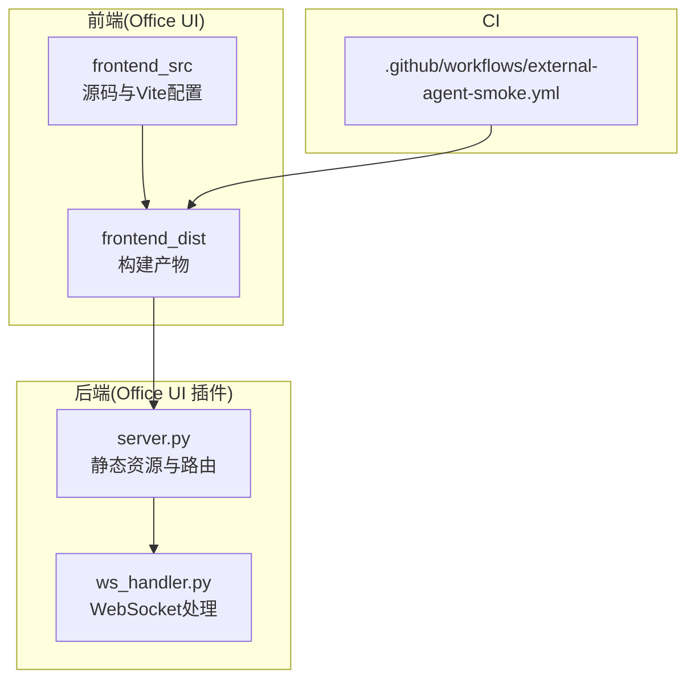
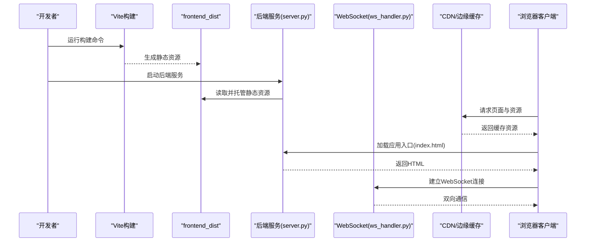
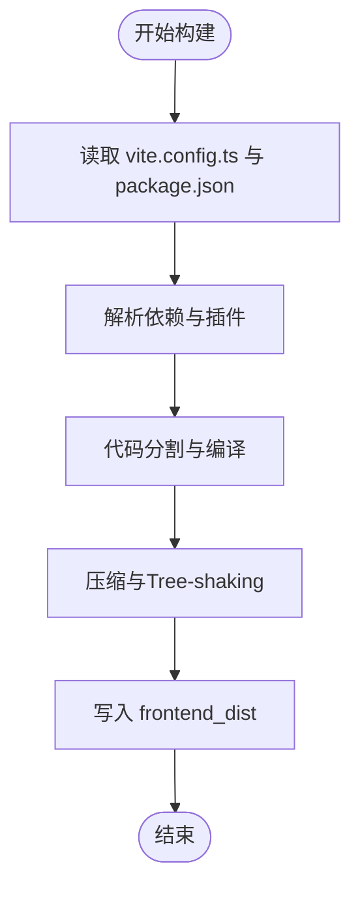
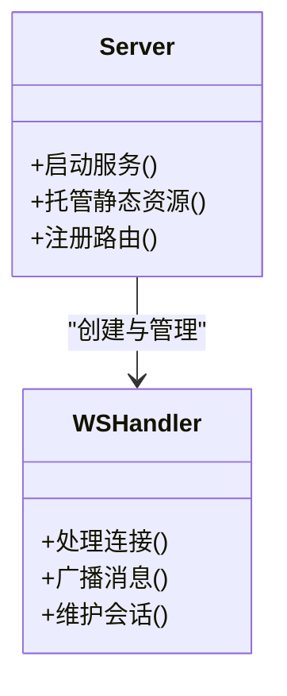
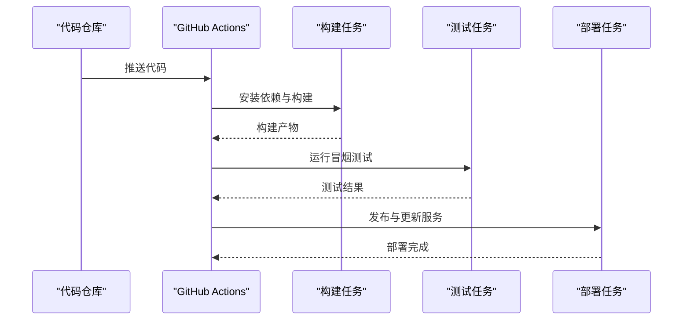
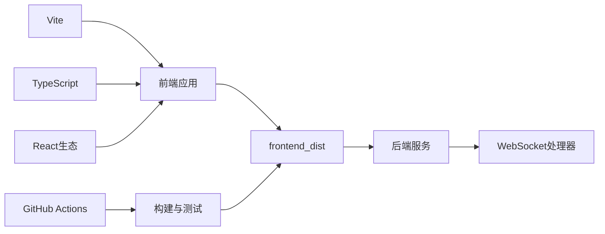

# 构建与部署

<cite>
**本文引用的文件**   
- [vite.config.ts](file://opc/plugins/office_ui/frontend_src/vite.config.ts)
- [package.json](file://opc/plugins/office_ui/frontend_src/package.json)
- [index.html](file://opc/plugins/office_ui/frontend_src/index.html)
- [server.py](file://opc/plugins/office_ui/server.py)
- [ws_handler.py](file://opc/plugins/office_ui/ws_handler.py)
- [external-agent-smoke.yml](file://.github/workflows/external-agent-smoke.yml)
</cite>

## 目录
1. [简介](#简介)
2. [项目结构](#项目结构)
3. [核心组件](#核心组件)
4. [架构总览](#架构总览)
5. [详细组件分析](#详细组件分析)
6. [依赖关系分析](#依赖关系分析)
7. [性能考虑](#性能考虑)
8. [故障排查指南](#故障排查指南)
9. [结论](#结论)
10. [附录](#附录)

## 简介
本文件面向Office UI插件的构建与部署，聚焦以下目标：
- 基于Vite的前端构建配置说明（打包优化、代码分割、资源压缩）
- Node.js环境要求与依赖管理
- 静态资源生成流程与CDN集成方案
- Docker容器化部署与编排
- 反向代理与SSL证书设置
- 生产环境优化策略（缓存与性能调优）
- 环境变量与敏感信息管理
- 自动化部署流水线
- 监控告警与日志收集
- 备份恢复与灾难恢复

## 项目结构
前端位于 Office UI 插件子模块中，使用 Vite 进行构建；后端服务由 Python 提供，负责静态资源托管与WebSocket通信。CI 流水线通过 GitHub Actions 执行冒烟测试。

图表来源
- [vite.config.ts](file://opc/plugins/office_ui/frontend_src/vite.config.ts)
- [server.py](file://opc/plugins/office_ui/server.py)
- [ws_handler.py](file://opc/plugins/office_ui/ws_handler.py)
- [external-agent-smoke.yml](file://.github/workflows/external-agent-smoke.yml)

章节来源
- [vite.config.ts](file://opc/plugins/office_ui/frontend_src/vite.config.ts)
- [package.json](file://opc/plugins/office_ui/frontend_src/package.json)
- [index.html](file://opc/plugins/office_ui/frontend_src/index.html)
- [server.py](file://opc/plugins/office_ui/server.py)
- [ws_handler.py](file://opc/plugins/office_ui/ws_handler.py)
- [external-agent-smoke.yml](file://.github/workflows/external-agent-smoke.yml)

## 核心组件
- 前端构建系统：Vite + TypeScript/React生态，输出到 frontend_dist，供后端静态托管。
- 后端服务：Python 服务负责提供静态资源、WebSocket 通道以及业务接口。
- CI 流水线：GitHub Actions 触发构建与冒烟测试，确保产物可用。

章节来源
- [vite.config.ts](file://opc/plugins/office_ui/frontend_src/vite.config.ts)
- [package.json](file://opc/plugins/office_ui/frontend_src/package.json)
- [server.py](file://opc/plugins/office_ui/server.py)
- [ws_handler.py](file://opc/plugins/office_ui/ws_handler.py)

## 架构总览
下图展示了从开发到生产的端到端流程：开发者在本地使用 Vite 构建，产物被后端服务托管；生产环境中可通过反向代理与CDN加速，并通过CI流水线自动构建与验证。

图表来源
- [vite.config.ts](file://opc/plugins/office_ui/frontend_src/vite.config.ts)
- [server.py](file://opc/plugins/office_ui/server.py)
- [ws_handler.py](file://opc/plugins/office_ui/ws_handler.py)

## 详细组件分析

### 前端构建与打包优化（Vite）
- 构建入口与脚本：通过 package.json 定义构建脚本，统一调用 Vite 构建流程。
- 构建配置：vite.config.ts 控制输出目录、资源路径、插件与优化选项。
- HTML模板：index.html 作为应用入口，引用构建后的JS/CSS资源。
- 代码分割与懒加载：按路由或功能模块拆分，减少首屏体积。
- 资源压缩与Tree-shaking：启用默认优化，按需引入第三方库。
- 静态资源与CDN：将非关键资源（如图片、字体）上传至CDN，并在构建时替换引用路径。

图表来源
- [vite.config.ts](file://opc/plugins/office_ui/frontend_src/vite.config.ts)
- [package.json](file://opc/plugins/office_ui/frontend_src/package.json)
- [index.html](file://opc/plugins/office_ui/frontend_src/index.html)

章节来源
- [vite.config.ts](file://opc/plugins/office_ui/frontend_src/vite.config.ts)
- [package.json](file://opc/plugins/office_ui/frontend_src/package.json)
- [index.html](file://opc/plugins/office_ui/frontend_src/index.html)

### Node.js环境与依赖管理
- 版本要求：建议使用LTS版本，确保与Vite及插件兼容。
- 包管理器：npm/yarn/pnpm均可，推荐锁定版本（package-lock.json或yarn.lock）。
- 安装依赖：在项目根目录执行安装命令，确保所有依赖一致。
- 构建产物：构建后生成 frontend_dist，包含HTML、JS、CSS与静态资源。

章节来源
- [package.json](file://opc/plugins/office_ui/frontend_src/package.json)

### 静态资源生成与CDN集成
- 生成流程：Vite构建产出静态资源，后端服务将其作为静态目录托管。
- CDN集成建议：
  - 将图片、字体等静态资源上传至对象存储或CDN。
  - 在构建阶段注入CDN基础路径，使资源URL指向CDN域名。
  - 为CDN开启缓存与版本化文件名，提升命中率与可更新性。
- 资源路径策略：
  - 使用绝对路径或相对路径，确保跨域与子路径部署正确。
  - 对HTML中的资源引用进行替换，避免硬编码本地路径。

章节来源
- [vite.config.ts](file://opc/plugins/office_ui/frontend_src/vite.config.ts)
- [server.py](file://opc/plugins/office_ui/server.py)

### 后端服务与WebSocket
- 静态资源托管：后端服务读取 frontend_dist 并提供HTTP访问。
- WebSocket支持：ws_handler.py 实现消息转发与状态同步，用于实时交互。
- 路由与中间件：根据需求添加鉴权、限流与日志记录。

图表来源
- [server.py](file://opc/plugins/office_ui/server.py)
- [ws_handler.py](file://opc/plugins/office_ui/ws_handler.py)

章节来源
- [server.py](file://opc/plugins/office_ui/server.py)
- [ws_handler.py](file://opc/plugins/office_ui/ws_handler.py)

### Docker容器化与编排
- 镜像构建：
  - 多阶段构建：第一阶段使用Node镜像构建前端，第二阶段使用轻量Python镜像运行后端。
  - 仅复制必要文件，减小镜像体积。
- 容器运行：
  - 暴露端口：HTTP与WebSocket端口。
  - 挂载配置与日志目录，便于外部化管理。
- 编排文件：
  - 使用Compose定义服务、网络与卷。
  - 配置健康检查与重启策略。

章节来源
- [server.py](file://opc/plugins/office_ui/server.py)
- [ws_handler.py](file://opc/plugins/office_ui/ws_handler.py)

### 反向代理与SSL证书
- 反向代理：
  - 使用Nginx/Traefik/Cloudflare等代理HTTP与WebSocket流量。
  - 配置路径重写与头信息透传。
- SSL证书：
  - 使用Let's Encrypt或云厂商证书管理服务。
  - 自动续期与热重载配置。
- 安全加固：
  - 启用HSTS、CSP与安全头。
  - 限制跨域与源白名单。

章节来源
- [server.py](file://opc/plugins/office_ui/server.py)
- [ws_handler.py](file://opc/plugins/office_ui/ws_handler.py)

### 生产环境优化策略
- 缓存策略：
  - 静态资源使用强缓存与版本化文件名。
  - HTML采用短缓存或无缓存，确保及时更新。
- 性能调优：
  - 启用Gzip/Brotli压缩。
  - 预加载关键资源与字体。
  - 合并与延迟加载非关键脚本。
- 监控与指标：
  - 接入APM与错误追踪。
  - 采集前端性能指标（FCP、LCP、CLS）。

章节来源
- [vite.config.ts](file://opc/plugins/office_ui/frontend_src/vite.config.ts)
- [server.py](file://opc/plugins/office_ui/server.py)

### 环境变量与敏感信息管理
- 环境变量：
  - 区分开发与生产环境，避免硬编码。
  - 使用.env文件或密钥管理服务注入。
- 敏感信息：
  - 不提交密钥到仓库，使用CI Secrets或KMS。
  - 运行时动态加载，最小权限原则。

章节来源
- [vite.config.ts](file://opc/plugins/office_ui/frontend_src/vite.config.ts)
- [server.py](file://opc/plugins/office_ui/server.py)

### 自动化部署流水线
- CI触发：
  - 推送或PR事件触发构建与测试。
- 构建步骤：
  - 安装依赖、构建前端、运行单元测试。
- 发布步骤：
  - 上传构建产物到制品库或CDN。
  - 触发后端服务滚动更新。

图表来源
- [external-agent-smoke.yml](file://.github/workflows/external-agent-smoke.yml)

章节来源
- [external-agent-smoke.yml](file://.github/workflows/external-agent-smoke.yml)

### 监控告警与日志收集
- 日志收集：
  - 集中式日志（ELK/Loki），结构化输出。
  - 前端错误上报与用户行为埋点。
- 监控告警：
  - 服务可用性、错误率与响应时间阈值。
  - 告警渠道（邮件、Slack、企业微信）。
- 可观测性：
  - 分布式追踪与指标面板。
  - 容量规划与弹性伸缩。

章节来源
- [server.py](file://opc/plugins/office_ui/server.py)
- [ws_handler.py](file://opc/plugins/office_ui/ws_handler.py)

### 备份恢复与灾难恢复
- 数据备份：
  - 定期备份数据库与配置文件。
  - 异地容灾与版本保留策略。
- 恢复演练：
  - 制定RTO/RPO目标。
  - 自动化恢复脚本与回滚机制。
- 高可用：
  - 多副本部署与健康检查。
  - 负载均衡与故障转移。

章节来源
- [server.py](file://opc/plugins/office_ui/server.py)

## 依赖关系分析
- 前端依赖：
  - Vite为核心构建工具，配合TypeScript与React生态。
  - 第三方库按需引入，减少包体。
- 后端依赖：
  - Python运行时与WebSocket库。
  - 静态资源托管与路由框架。
- CI依赖：
  - Node.js与Python环境。
  - 测试套件与制品上传工具。

图表来源
- [vite.config.ts](file://opc/plugins/office_ui/frontend_src/vite.config.ts)
- [package.json](file://opc/plugins/office_ui/frontend_src/package.json)
- [server.py](file://opc/plugins/office_ui/server.py)
- [ws_handler.py](file://opc/plugins/office_ui/ws_handler.py)
- [external-agent-smoke.yml](file://.github/workflows/external-agent-smoke.yml)

章节来源
- [vite.config.ts](file://opc/plugins/office_ui/frontend_src/vite.config.ts)
- [package.json](file://opc/plugins/office_ui/frontend_src/package.json)
- [server.py](file://opc/plugins/office_ui/server.py)
- [ws_handler.py](file://opc/plugins/office_ui/ws_handler.py)
- [external-agent-smoke.yml](file://.github/workflows/external-agent-smoke.yml)

## 性能考虑
- 构建优化：
  - 启用代码分割与懒加载，减少首屏体积。
  - 使用Tree-shaking移除未用代码。
- 传输优化：
  - 启用HTTP/2与压缩。
  - 使用CDN与边缘缓存。
- 运行时优化：
  - 预取与预加载关键资源。
  - 合理设置缓存策略与版本号。

[本节为通用指导，无需特定文件来源]

## 故障排查指南
- 构建失败：
  - 检查Node版本与依赖一致性。
  - 查看Vite构建日志定位错误。
- 资源404：
  - 确认静态资源路径与CDN域名配置。
  - 检查反向代理重写规则。
- WebSocket连接失败：
  - 检查代理是否支持升级协议。
  - 验证防火墙与负载均衡器配置。
- 性能问题：
  - 使用浏览器开发者工具分析加载瀑布图。
  - 检查缓存命中与压缩效果。

章节来源
- [vite.config.ts](file://opc/plugins/office_ui/frontend_src/vite.config.ts)
- [server.py](file://opc/plugins/office_ui/server.py)
- [ws_handler.py](file://opc/plugins/office_ui/ws_handler.py)

## 结论
通过Vite高效构建、后端静态托管与WebSocket通信、CI自动化流水线以及完善的监控与备份策略，Office UI插件可实现稳定、高性能的生产部署。建议在生产环境持续优化缓存与资源策略，完善可观测性与灾难恢复能力。

[本节为总结，无需特定文件来源]

## 附录
- 术语表：
  - Vite：现代前端构建工具，提供快速开发与构建体验。
  - CDN：内容分发网络，加速静态资源访问。
  - WebSocket：全双工通信协议，适用于实时交互场景。
- 参考链接：
  - Vite官方文档
  - Nginx/Traefik配置示例
  - Let's Encrypt证书申请与续期

[本节为补充信息，无需特定文件来源]