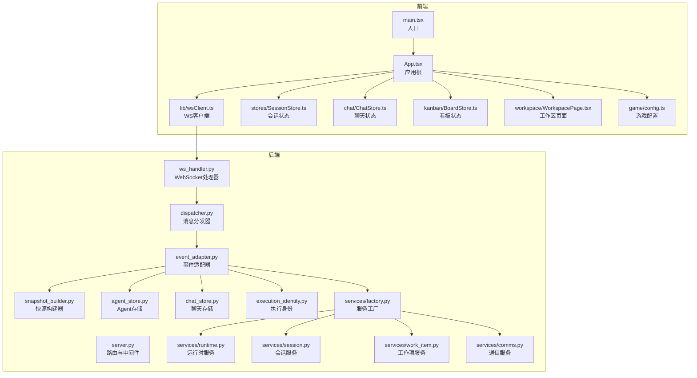
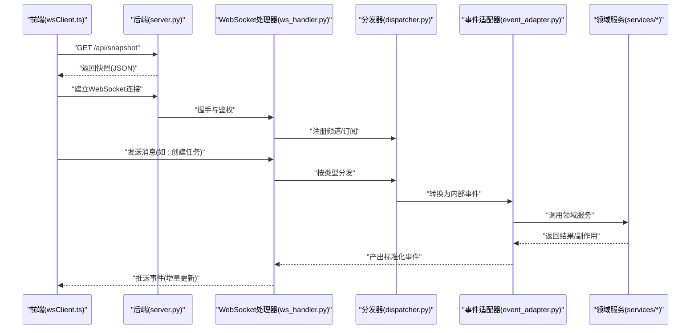
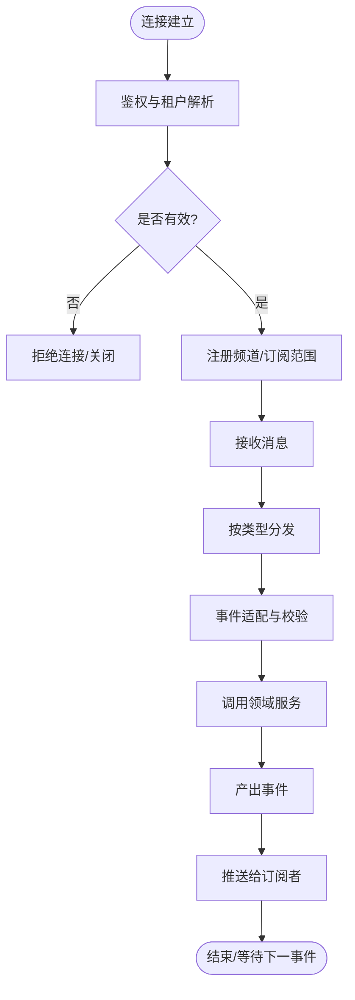
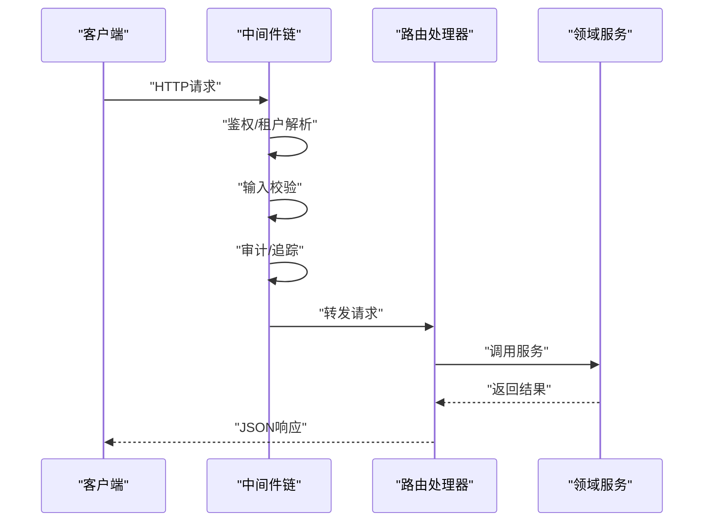
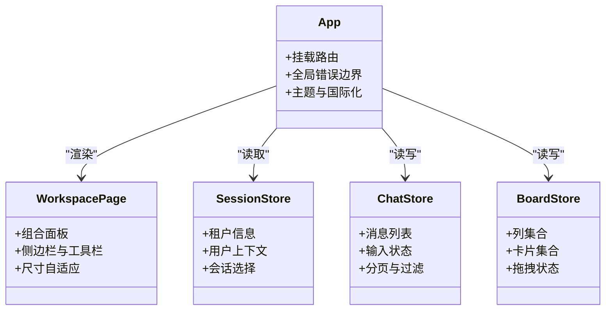
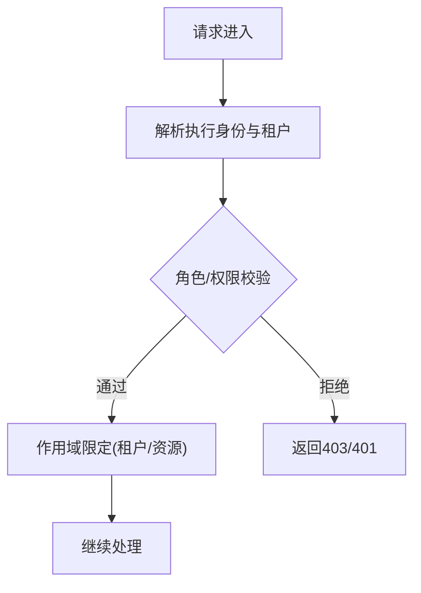
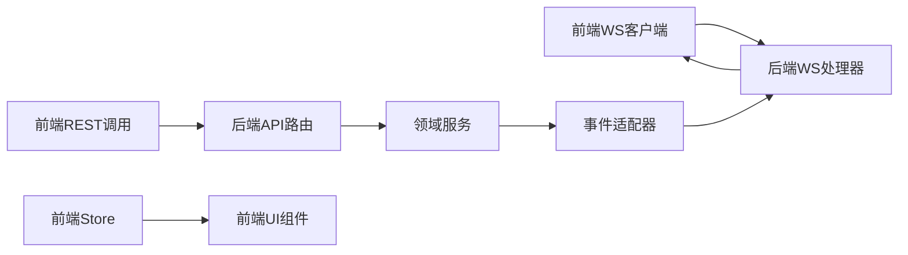
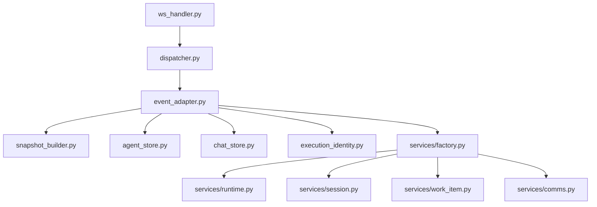

# 架构设计

<cite>
**本文引用的文件**   
- [server.py](file://opc/plugins/office_ui/server.py)
- [ws_handler.py](file://opc/plugins/office_ui/ws_handler.py)
- [dispatcher.py](file://opc/plugins/office_ui/dispatcher.py)
- [event_adapter.py](file://opc/plugins/office_ui/event_adapter.py)
- [snapshot_builder.py](file://opc/plugins/office_ui/snapshot_builder.py)
- [agent_store.py](file://opc/plugins/office_ui/agent_store.py)
- [chat_store.py](file://opc/plugins/office_ui/chat_store.py)
- [execution_identity.py](file://opc/plugins/office_ui/execution_identity.py)
- [services/factory.py](file://opc/plugins/office_ui/services/factory.py)
- [services/runtime.py](file://opc/plugins/office_ui/services/runtime.py)
- [services/session.py](file://opc/plugins/office_ui/services/session.py)
- [services/work_item.py](file://opc/plugins/office_ui/services/work_item.py)
- [services/comms.py](file://opc/plugins/office_ui/services/comms.py)
- [frontend_src/main.tsx](file://opc/plugins/office_ui/frontend_src/main.tsx)
- [frontend_src/App.tsx](file://opc/plugins/office_ui/frontend_src/App.tsx)
- [frontend_src/lib/wsClient.ts](file://opc/plugins/office_ui/frontend_src/lib/wsClient.ts)
- [frontend_src/stores/SessionStore.ts](file://opc/plugins/office_ui/frontend_src/stores/SessionStore.ts)
- [frontend_src/chat/ChatStore.ts](file://opc/plugins/office_ui/frontend_src/chat/ChatStore.ts)
- [frontend_src/kanban/BoardStore.ts](file://opc/plugins/office_ui/frontend_src/kanban/BoardStore.ts)
- [frontend_src/workspace/WorkspacePage.tsx](file://opc/plugins/office_ui/frontend_src/workspace/WorkspacePage.tsx)
- [frontend_src/game/config.ts](file://opc/plugins/office_ui/frontend_src/game/config.ts)
</cite>

## 目录
1. [简介](#简介)
2. [项目结构](#项目结构)
3. [核心组件](#核心组件)
4. [架构总览](#架构总览)
5. [详细组件分析](#详细组件分析)
6. [依赖关系分析](#依赖关系分析)
7. [性能考量](#性能考量)
8. [故障排查指南](#故障排查指南)
9. [结论](#结论)
10. [附录](#附录)

## 简介
本文件面向Office UI插件的架构设计，聚焦前后端分离模式、WebSocket实时通信、REST API与中间件处理流程、前端组件架构与状态管理、多租户与权限控制等关键主题。文档通过代码级图表与路径引用，帮助读者快速理解系统边界、数据流与组件交互关系，并给出技术选型与架构决策说明。

## 项目结构
Office UI插件采用“后端服务 + 前端静态资源”的前后端分离组织方式：
- 后端（Python）：提供HTTP接口、WebSocket连接、事件适配与快照构建、会话与工作项管理等能力。
- 前端（TypeScript/React）：提供聊天、看板、组织视图、工作区页面以及游戏化场景渲染，使用集中式Store进行状态管理，并通过WebSocket与后端保持实时同步。

图示来源
- [server.py](file://opc/plugins/office_ui/server.py)
- [ws_handler.py](file://opc/plugins/office_ui/ws_handler.py)
- [dispatcher.py](file://opc/plugins/office_ui/dispatcher.py)
- [event_adapter.py](file://opc/plugins/office_ui/event_adapter.py)
- [snapshot_builder.py](file://opc/plugins/office_ui/snapshot_builder.py)
- [agent_store.py](file://opc/plugins/office_ui/agent_store.py)
- [chat_store.py](file://opc/plugins/office_ui/chat_store.py)
- [execution_identity.py](file://opc/plugins/office_ui/execution_identity.py)
- [services/factory.py](file://opc/plugins/office_ui/services/factory.py)
- [services/runtime.py](file://opc/plugins/office_ui/services/runtime.py)
- [services/session.py](file://opc/plugins/office_ui/services/session.py)
- [services/work_item.py](file://opc/plugins/office_ui/services/work_item.py)
- [services/comms.py](file://opc/plugins/office_ui/services/comms.py)
- [frontend_src/main.tsx](file://opc/plugins/office_ui/frontend_src/main.tsx)
- [frontend_src/App.tsx](file://opc/plugins/office_ui/frontend_src/App.tsx)
- [frontend_src/lib/wsClient.ts](file://opc/plugins/office_ui/frontend_src/lib/wsClient.ts)
- [frontend_src/stores/SessionStore.ts](file://opc/plugins/office_ui/frontend_src/stores/SessionStore.ts)
- [frontend_src/chat/ChatStore.ts](file://opc/plugins/office_ui/frontend_src/chat/ChatStore.ts)
- [frontend_src/kanban/BoardStore.ts](file://opc/plugins/office_ui/frontend_src/kanban/BoardStore.ts)
- [frontend_src/workspace/WorkspacePage.tsx](file://opc/plugins/office_ui/frontend_src/workspace/WorkspacePage.tsx)
- [frontend_src/game/config.ts](file://opc/plugins/office_ui/frontend_src/game/config.ts)

章节来源
- [server.py](file://opc/plugins/office_ui/server.py)
- [ws_handler.py](file://opc/plugins/office_ui/ws_handler.py)
- [dispatcher.py](file://opc/plugins/office_ui/dispatcher.py)
- [event_adapter.py](file://opc/plugins/office_ui/event_adapter.py)
- [snapshot_builder.py](file://opc/plugins/office_ui/snapshot_builder.py)
- [agent_store.py](file://opc/plugins/office_ui/agent_store.py)
- [chat_store.py](file://opc/plugins/office_ui/chat_store.py)
- [execution_identity.py](file://opc/plugins/office_ui/execution_identity.py)
- [services/factory.py](file://opc/plugins/office_ui/services/factory.py)
- [services/runtime.py](file://opc/plugins/office_ui/services/runtime.py)
- [services/session.py](file://opc/plugins/office_ui/services/session.py)
- [services/work_item.py](file://opc/plugins/office_ui/services/work_item.py)
- [services/comms.py](file://opc/plugins/office_ui/services/comms.py)
- [frontend_src/main.tsx](file://opc/plugins/office_ui/frontend_src/main.tsx)
- [frontend_src/App.tsx](file://opc/plugins/office_ui/frontend_src/App.tsx)
- [frontend_src/lib/wsClient.ts](file://opc/plugins/office_ui/frontend_src/lib/wsClient.ts)
- [frontend_src/stores/SessionStore.ts](file://opc/plugins/office_ui/frontend_src/stores/SessionStore.ts)
- [frontend_src/chat/ChatStore.ts](file://opc/plugins/office_ui/frontend_src/chat/ChatStore.ts)
- [frontend_src/kanban/BoardStore.ts](file://opc/plugins/office_ui/frontend_src/kanban/BoardStore.ts)
- [frontend_src/workspace/WorkspacePage.tsx](file://opc/plugins/office_ui/frontend_src/workspace/WorkspacePage.tsx)
- [frontend_src/game/config.ts](file://opc/plugins/office_ui/frontend_src/game/config.ts)

## 核心组件
- 后端服务层
  - server.py：定义HTTP路由、中间件挂载、静态资源托管与生命周期钩子。
  - ws_handler.py：实现WebSocket握手、鉴权上下文注入、消息路由与广播。
  - dispatcher.py：将WS消息按类型分发到具体处理器，维护订阅关系。
  - event_adapter.py：统一事件模型，桥接内部事件与外部协议。
  - snapshot_builder.py：生成一致性快照，用于前端初始化或增量同步。
  - agent_store.py / chat_store.py：持久化Agent与聊天消息，支持分页与过滤。
  - execution_identity.py：封装执行身份与租户上下文，贯穿请求链路。
  - services/*：以领域服务形式暴露运行时、会话、工作项、通信等能力；factory.py负责按需装配。

- 前端应用层
  - main.tsx / App.tsx：应用入口与根组件，挂载路由、全局状态与错误边界。
  - lib/wsClient.ts：封装WebSocket连接、重连策略、心跳与消息编解码。
  - stores/*：集中式状态管理（会话、聊天、看板），响应式更新UI。
  - workspace/WorkspacePage.tsx：组合各功能面板的工作区页面。
  - game/config.ts：游戏化场景的配置与参数。

章节来源
- [server.py](file://opc/plugins/office_ui/server.py)
- [ws_handler.py](file://opc/plugins/office_ui/ws_handler.py)
- [dispatcher.py](file://opc/plugins/office_ui/dispatcher.py)
- [event_adapter.py](file://opc/plugins/office_ui/event_adapter.py)
- [snapshot_builder.py](file://opc/plugins/office_ui/snapshot_builder.py)
- [agent_store.py](file://opc/plugins/office_ui/agent_store.py)
- [chat_store.py](file://opc/plugins/office_ui/chat_store.py)
- [execution_identity.py](file://opc/plugins/office_ui/execution_identity.py)
- [services/factory.py](file://opc/plugins/office_ui/services/factory.py)
- [services/runtime.py](file://opc/plugins/office_ui/services/runtime.py)
- [services/session.py](file://opc/plugins/office_ui/services/session.py)
- [services/work_item.py](file://opc/plugins/office_ui/services/work_item.py)
- [services/comms.py](file://opc/plugins/office_ui/services/comms.py)
- [frontend_src/main.tsx](file://opc/plugins/office_ui/frontend_src/main.tsx)
- [frontend_src/App.tsx](file://opc/plugins/office_ui/frontend_src/App.tsx)
- [frontend_src/lib/wsClient.ts](file://opc/plugins/office_ui/frontend_src/lib/wsClient.ts)
- [frontend_src/stores/SessionStore.ts](file://opc/plugins/office_ui/frontend_src/stores/SessionStore.ts)
- [frontend_src/chat/ChatStore.ts](file://opc/plugins/office_ui/frontend_src/chat/ChatStore.ts)
- [frontend_src/kanban/BoardStore.ts](file://opc/plugins/office_ui/frontend_src/kanban/BoardStore.ts)
- [frontend_src/workspace/WorkspacePage.tsx](file://opc/plugins/office_ui/frontend_src/workspace/WorkspacePage.tsx)
- [frontend_src/game/config.ts](file://opc/plugins/office_ui/frontend_src/game/config.ts)

## 架构总览
系统采用前后端分离与事件驱动相结合的设计：
- 前端通过REST获取初始数据与快照，随后建立WebSocket长连接，接收实时事件并增量更新本地状态。
- 后端通过中间件完成鉴权、租户隔离与审计日志；WebSocket处理器根据消息类型路由至领域服务，最终由事件适配器统一输出。

图示来源
- [server.py](file://opc/plugins/office_ui/server.py)
- [ws_handler.py](file://opc/plugins/office_ui/ws_handler.py)
- [dispatcher.py](file://opc/plugins/office_ui/dispatcher.py)
- [event_adapter.py](file://opc/plugins/office_ui/event_adapter.py)
- [services/factory.py](file://opc/plugins/office_ui/services/factory.py)
- [services/runtime.py](file://opc/plugins/office_ui/services/runtime.py)
- [services/session.py](file://opc/plugins/office_ui/services/session.py)
- [services/work_item.py](file://opc/plugins/office_ui/services/work_item.py)
- [services/comms.py](file://opc/plugins/office_ui/services/comms.py)
- [frontend_src/lib/wsClient.ts](file://opc/plugins/office_ui/frontend_src/lib/wsClient.ts)

## 详细组件分析

### WebSocket实时通信架构
- 连接管理
  - 前端wsClient负责连接建立、断线重连、心跳检测与消息队列。
  - 后端ws_handler在握手阶段注入执行身份与租户上下文，校验权限后允许进入。
- 消息路由
  - dispatcher维护消息类型到处理器的映射，支持按会话/工作项维度订阅。
  - event_adapter对入站消息做规范化，并对出站事件做序列化与过滤。
- 状态同步
  - 首次加载通过snapshot_builder生成一致性快照，前端用其初始化Store。
  - 后续变更通过事件流增量更新，避免全量拉取。

图示来源
- [ws_handler.py](file://opc/plugins/office_ui/ws_handler.py)
- [dispatcher.py](file://opc/plugins/office_ui/dispatcher.py)
- [event_adapter.py](file://opc/plugins/office_ui/event_adapter.py)
- [snapshot_builder.py](file://opc/plugins/office_ui/snapshot_builder.py)

章节来源
- [ws_handler.py](file://opc/plugins/office_ui/ws_handler.py)
- [dispatcher.py](file://opc/plugins/office_ui/dispatcher.py)
- [event_adapter.py](file://opc/plugins/office_ui/event_adapter.py)
- [snapshot_builder.py](file://opc/plugins/office_ui/snapshot_builder.py)
- [frontend_src/lib/wsClient.ts](file://opc/plugins/office_ui/frontend_src/lib/wsClient.ts)

### REST API设计与中间件处理流程
- 设计原则
  - 资源导向：以会话、工作项、Agent、组织等为资源命名空间。
  - 幂等性：查询接口保证幂等；写操作需携带唯一ID或幂等键。
  - 版本化：API路径包含版本号，便于演进与兼容。
- 中间件链
  - 认证与授权：基于执行身份与租户上下文进行访问控制。
  - 输入校验：对请求体与路径参数进行强类型校验。
  - 审计与追踪：记录请求元数据与耗时，便于排障。
  - 限流与熔断：保护后端服务免受突发流量冲击。

图示来源
- [server.py](file://opc/plugins/office_ui/server.py)
- [execution_identity.py](file://opc/plugins/office_ui/execution_identity.py)
- [services/factory.py](file://opc/plugins/office_ui/services/factory.py)

章节来源
- [server.py](file://opc/plugins/office_ui/server.py)
- [execution_identity.py](file://opc/plugins/office_ui/execution_identity.py)
- [services/factory.py](file://opc/plugins/office_ui/services/factory.py)

### 前端组件架构与状态管理
- 组件树
  - App作为根容器，组合工作区页面、聊天面板、看板视图与组织管理页。
  - WorkspacePage聚合多个功能面板，提供统一的布局与导航。
- 状态管理
  - SessionStore：维护当前租户、用户、会话上下文。
  - ChatStore：缓存消息列表、滚动位置与输入状态。
  - BoardStore：维护看板列、卡片与拖拽状态。
- 路由设计
  - 基于路径区分工作区、聊天、看板与组织配置等页面。
  - 路由守卫结合执行身份与租户上下文进行访问控制。

图示来源
- [frontend_src/App.tsx](file://opc/plugins/office_ui/frontend_src/App.tsx)
- [frontend_src/workspace/WorkspacePage.tsx](file://opc/plugins/office_ui/frontend_src/workspace/WorkspacePage.tsx)
- [frontend_src/stores/SessionStore.ts](file://opc/plugins/office_ui/frontend_src/stores/SessionStore.ts)
- [frontend_src/chat/ChatStore.ts](file://opc/plugins/office_ui/frontend_src/chat/ChatStore.ts)
- [frontend_src/kanban/BoardStore.ts](file://opc/plugins/office_ui/frontend_src/kanban/BoardStore.ts)

章节来源
- [frontend_src/App.tsx](file://opc/plugins/office_ui/frontend_src/App.tsx)
- [frontend_src/workspace/WorkspacePage.tsx](file://opc/plugins/office_ui/frontend_src/workspace/WorkspacePage.tsx)
- [frontend_src/stores/SessionStore.ts](file://opc/plugins/office_ui/frontend_src/stores/SessionStore.ts)
- [frontend_src/chat/ChatStore.ts](file://opc/plugins/office_ui/frontend_src/chat/ChatStore.ts)
- [frontend_src/kanban/BoardStore.ts](file://opc/plugins/office_ui/frontend_src/kanban/BoardStore.ts)

### 多租户支持与权限控制
- 多租户
  - 执行身份中包含租户标识，所有请求在服务层按租户隔离数据与配置。
  - 快照与服务调用均携带租户上下文，确保跨模块一致性。
- 权限控制
  - 基于角色的访问控制（RBAC）与资源级权限校验。
  - 敏感操作需要二次确认或审批流（例如删除、发布）。

图示来源
- [execution_identity.py](file://opc/plugins/office_ui/execution_identity.py)
- [services/factory.py](file://opc/plugins/office_ui/services/factory.py)

章节来源
- [execution_identity.py](file://opc/plugins/office_ui/execution_identity.py)
- [services/factory.py](file://opc/plugins/office_ui/services/factory.py)

### 数据流图与组件交互关系
- 数据流
  - 前端从REST获取快照，初始化Store；随后通过WebSocket接收增量事件，触发局部更新。
  - 后端将领域事件经事件适配器标准化，再推送到相关订阅者。
- 组件交互
  - 工作区页面组合聊天、看板与组织面板；各面板通过对应Store读写状态。
  - 游戏化场景通过配置驱动，与主界面解耦。

图示来源
- [frontend_src/lib/wsClient.ts](file://opc/plugins/office_ui/frontend_src/lib/wsClient.ts)
- [frontend_src/stores/SessionStore.ts](file://opc/plugins/office_ui/frontend_src/stores/SessionStore.ts)
- [frontend_src/chat/ChatStore.ts](file://opc/plugins/office_ui/frontend_src/chat/ChatStore.ts)
- [frontend_src/kanban/BoardStore.ts](file://opc/plugins/office_ui/frontend_src/kanban/BoardStore.ts)
- [server.py](file://opc/plugins/office_ui/server.py)
- [ws_handler.py](file://opc/plugins/office_ui/ws_handler.py)
- [event_adapter.py](file://opc/plugins/office_ui/event_adapter.py)
- [services/factory.py](file://opc/plugins/office_ui/services/factory.py)

## 依赖关系分析
- 后端模块耦合
  - ws_handler依赖dispatcher与event_adapter，降低直接业务逻辑耦合。
  - services通过factory按需装配，减少循环依赖与启动开销。
- 前后端契约
  - REST与WebSocket共享事件模型，确保前后端数据结构一致。
  - 快照格式稳定，便于前端增量合并。

图示来源
- [ws_handler.py](file://opc/plugins/office_ui/ws_handler.py)
- [dispatcher.py](file://opc/plugins/office_ui/dispatcher.py)
- [event_adapter.py](file://opc/plugins/office_ui/event_adapter.py)
- [snapshot_builder.py](file://opc/plugins/office_ui/snapshot_builder.py)
- [agent_store.py](file://opc/plugins/office_ui/agent_store.py)
- [chat_store.py](file://opc/plugins/office_ui/chat_store.py)
- [execution_identity.py](file://opc/plugins/office_ui/execution_identity.py)
- [services/factory.py](file://opc/plugins/office_ui/services/factory.py)
- [services/runtime.py](file://opc/plugins/office_ui/services/runtime.py)
- [services/session.py](file://opc/plugins/office_ui/services/session.py)
- [services/work_item.py](file://opc/plugins/office_ui/services/work_item.py)
- [services/comms.py](file://opc/plugins/office_ui/services/comms.py)

章节来源
- [ws_handler.py](file://opc/plugins/office_ui/ws_handler.py)
- [dispatcher.py](file://opc/plugins/office_ui/dispatcher.py)
- [event_adapter.py](file://opc/plugins/office_ui/event_adapter.py)
- [snapshot_builder.py](file://opc/plugins/office_ui/snapshot_builder.py)
- [agent_store.py](file://opc/plugins/office_ui/agent_store.py)
- [chat_store.py](file://opc/plugins/office_ui/chat_store.py)
- [execution_identity.py](file://opc/plugins/office_ui/execution_identity.py)
- [services/factory.py](file://opc/plugins/office_ui/services/factory.py)
- [services/runtime.py](file://opc/plugins/office_ui/services/runtime.py)
- [services/session.py](file://opc/plugins/office_ui/services/session.py)
- [services/work_item.py](file://opc/plugins/office_ui/services/work_item.py)
- [services/comms.py](file://opc/plugins/office_ui/services/comms.py)

## 性能考量
- 连接与消息
  - 前端wsClient实现指数退避重连与心跳保活，降低网络抖动影响。
  - 后端按会话/工作项粒度订阅，避免广播风暴。
- 数据同步
  - 首次快照一次性加载，后续增量事件最小化传输体积。
  - Store采用不可变更新策略，提升渲染性能与可预测性。
- 可扩展性
  - 领域服务通过工厂装配，便于水平扩展与替换实现。
  - 事件适配器统一输出，利于监控与回放。

[本节为通用指导，不直接分析具体文件]

## 故障排查指南
- WebSocket连接失败
  - 检查鉴权与租户上下文是否正确注入。
  - 查看ws_handler握手阶段的错误码与日志。
- 消息未到达前端
  - 确认dispatcher是否正确注册频道与订阅范围。
  - 验证event_adapter的事件过滤规则。
- 快照不一致
  - 对比snapshot_builder生成的快照结构与前端期望字段。
  - 检查store合并逻辑是否存在冲突。

章节来源
- [ws_handler.py](file://opc/plugins/office_ui/ws_handler.py)
- [dispatcher.py](file://opc/plugins/office_ui/dispatcher.py)
- [event_adapter.py](file://opc/plugins/office_ui/event_adapter.py)
- [snapshot_builder.py](file://opc/plugins/office_ui/snapshot_builder.py)
- [frontend_src/lib/wsClient.ts](file://opc/plugins/office_ui/frontend_src/lib/wsClient.ts)

## 结论
本架构通过前后端分离、事件驱动与集中式状态管理，实现了高内聚、低耦合的Office UI插件系统。WebSocket保障实时体验，REST提供可靠的数据初始化与批量操作；多租户与权限控制贯穿请求链路，确保数据安全与合规。未来可在事件溯源、灰度发布与前端微前端方面持续演进。

[本节为总结性内容，不直接分析具体文件]

## 附录
- 技术选型理由
  - FastAPI：高性能异步框架，天然适合WebSocket与并发I/O。
  - React + TypeScript：类型安全与生态完善，便于大型前端工程治理。
  - 集中式Store：简化状态流转，提高可测试性与可观测性。
- 架构决策说明
  - 事件适配器统一模型：降低前后端契约漂移风险。
  - 快照+增量同步：兼顾首屏性能与实时性。
  - 服务工厂装配：增强模块化与可插拔性。

[本节为补充说明，不直接分析具体文件]