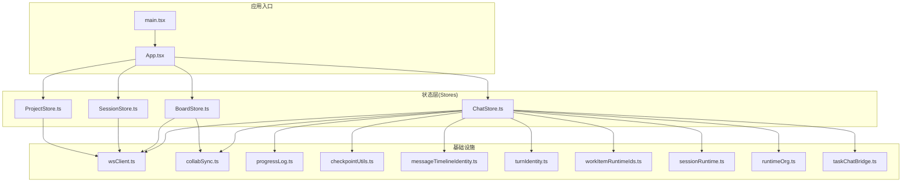
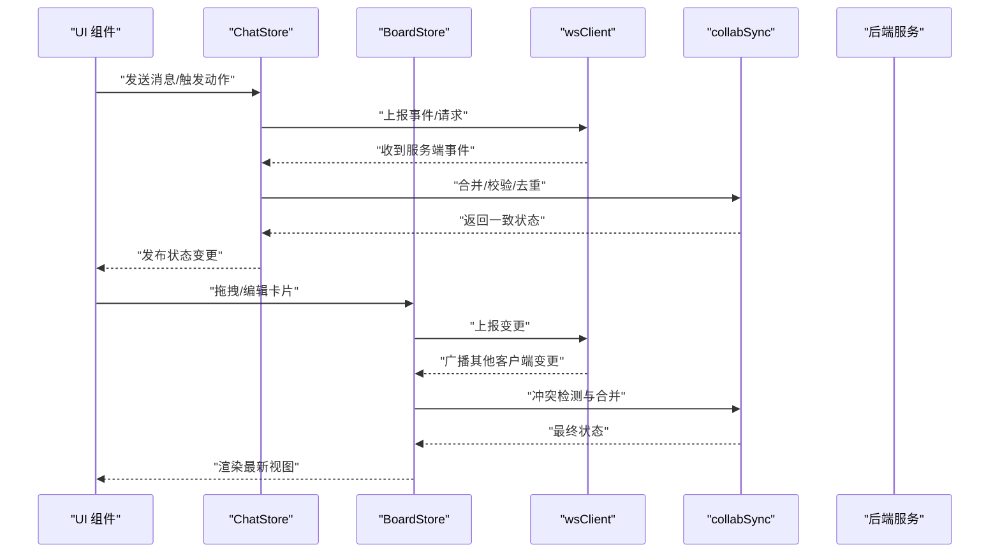
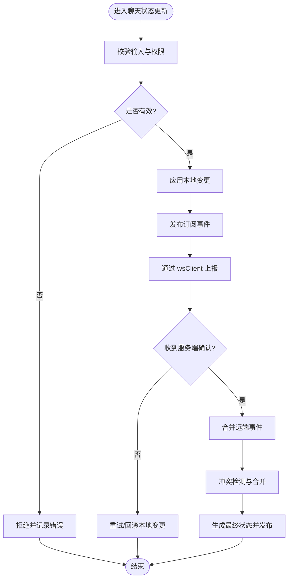
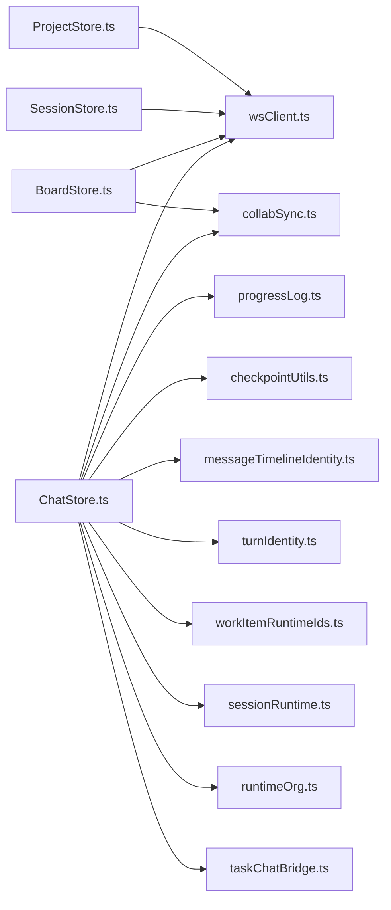

# 状态管理

<cite>
**本文引用的文件**   
- [ChatStore.ts](file://opc/plugins/office_ui/frontend_src/chat/ChatStore.ts)
- [ChatStore.test.ts](file://opc/plugins/office_ui/frontend_src/chat/ChatStore.test.ts)
- [ProjectStore.ts](file://opc/plugins/office_ui/frontend_src/stores/ProjectStore.ts)
- [SessionStore.ts](file://opc/plugins/office_ui/frontend_src/stores/SessionStore.ts)
- [SessionStore.test.ts](file://opc/plugins/office_ui/frontend_src/stores/SessionStore.test.ts)
- [BoardStore.ts](file://opc/plugins/office_ui/frontend_src/kanban/BoardStore.ts)
- [BoardStore.test.ts](file://opc/plugins/office_ui/frontend_src/kanban/BoardStore.test.ts)
- [collabSync.ts](file://opc/plugins/office_ui/frontend_src/lib/collabSync.ts)
- [wsClient.ts](file://opc/plugins/office_ui/frontend_src/lib/wsClient.ts)
- [wsClient.test.ts](file://opc/plugins/office_ui/frontend_src/lib/wsClient.test.ts)
- [progressLog.ts](file://opc/plugins/office_ui/frontend_src/lib/progressLog.ts)
- [checkpointUtils.ts](file://opc/plugins/office_ui/frontend_src/chat/checkpointUtils.ts)
- [messageTimelineIdentity.ts](file://opc/plugins/office_ui/frontend_src/lib/messageTimelineIdentity.ts)
- [turnIdentity.ts](file://opc/plugins/office_ui/frontend_src/lib/turnIdentity.ts)
- [workItemRuntimeIds.ts](file://opc/plugins/office_ui/frontend_src/lib/workItemRuntimeIds.ts)
- [sessionRuntime.ts](file://opc/plugins/office_ui/frontend_src/lib/sessionRuntime.ts)
- [runtimeOrg.ts](file://opc/plugins/office_ui/frontend_src/lib/runtimeOrg.ts)
- [taskChatBridge.ts](file://opc/plugins/office_ui/frontend_src/lib/taskChatBridge.ts)
- [App.tsx](file://opc/plugins/office_ui/frontend_src/App.tsx)
- [main.tsx](file://opc/plugins/office_ui/frontend_src/main.tsx)
</cite>

## 目录
1. [简介](#简介)
2. [项目结构](#项目结构)
3. [核心组件](#核心组件)
4. [架构总览](#架构总览)
5. [详细组件分析](#详细组件分析)
6. [依赖关系分析](#依赖关系分析)
7. [性能考虑](#性能考虑)
8. [故障排查指南](#故障排查指南)
9. [结论](#结论)
10. [附录](#附录)

## 简介
本文件面向 Office UI 插件的状态管理系统，聚焦基于 TypeScript 的前端状态管理模式。文档围绕以下目标展开：
- Store 架构设计与职责划分（会话、项目、聊天、看板）
- 状态更新机制与订阅模式
- 状态持久化、序列化/反序列化与版本迁移
- 状态同步与冲突解决算法
- 调试工具与开发期辅助能力
- 内存管理与垃圾回收策略

## 项目结构
Office UI 插件前端采用“按领域分层的 Store 模式”，将应用状态拆分为多个独立 Store，并通过事件总线与 WebSocket 客户端进行跨模块通信与持久化同步。

图表来源
- [main.tsx](file://opc/plugins/office_ui/frontend_src/main.tsx)
- [App.tsx](file://opc/plugins/office_ui/frontend_src/App.tsx)
- [SessionStore.ts](file://opc/plugins/office_ui/frontend_src/stores/SessionStore.ts)
- [ProjectStore.ts](file://opc/plugins/office_ui/frontend_src/stores/ProjectStore.ts)
- [ChatStore.ts](file://opc/plugins/office_ui/frontend_src/chat/ChatStore.ts)
- [BoardStore.ts](file://opc/plugins/office_ui/frontend_src/kanban/BoardStore.ts)
- [wsClient.ts](file://opc/plugins/office_ui/frontend_src/lib/wsClient.ts)
- [collabSync.ts](file://opc/plugins/office_ui/frontend_src/lib/collabSync.ts)
- [progressLog.ts](file://opc/plugins/office_ui/frontend_src/lib/progressLog.ts)
- [checkpointUtils.ts](file://opc/plugins/office_ui/frontend_src/chat/checkpointUtils.ts)
- [messageTimelineIdentity.ts](file://opc/plugins/office_ui/frontend_src/lib/messageTimelineIdentity.ts)
- [turnIdentity.ts](file://opc/plugins/office_ui/frontend_src/lib/turnIdentity.ts)
- [workItemRuntimeIds.ts](file://opc/plugins/office_ui/frontend_src/lib/workItemRuntimeIds.ts)
- [sessionRuntime.ts](file://opc/plugins/office_ui/frontend_src/lib/sessionRuntime.ts)
- [runtimeOrg.ts](file://opc/plugins/office_ui/frontend_src/lib/runtimeOrg.ts)
- [taskChatBridge.ts](file://opc/plugins/office_ui/frontend_src/lib/taskChatBridge.ts)

章节来源
- [main.tsx](file://opc/plugins/office_ui/frontend_src/main.tsx)
- [App.tsx](file://opc/plugins/office_ui/frontend_src/App.tsx)

## 核心组件
本节概述四大 Store 的职责边界与交互方式：
- 会话状态管理（SessionStore）：维护当前用户会话上下文、连接生命周期与会话级配置。
- 项目状态管理（ProjectStore）：维护项目元数据、成员与权限等全局项目信息。
- 聊天状态管理（ChatStore）：维护消息时间线、进度日志、检查点、任务输入与协作同步。
- 看板状态管理（BoardStore）：维护看板列、卡片、执行面板与实时协作状态。

章节来源
- [SessionStore.ts](file://opc/plugins/office_ui/frontend_src/stores/SessionStore.ts)
- [ProjectStore.ts](file://opc/plugins/office_ui/frontend_src/stores/ProjectStore.ts)
- [ChatStore.ts](file://opc/plugins/office_ui/frontend_src/chat/ChatStore.ts)
- [BoardStore.ts](file://opc/plugins/office_ui/frontend_src/kanban/BoardStore.ts)

## 架构总览
整体采用“多 Store + 事件驱动 + WS 同步”的架构：
- 各 Store 暴露受控的变更方法，内部通过不可变更新或增量补丁更新状态。
- 订阅者通过响应式订阅接口接收最小必要更新。
- 后端通过 WebSocket 推送增量事件，由 wsClient 分发到对应 Store。
- 协作同步模块负责合并远端变更与本地未提交操作，处理冲突与去重。

图表来源
- [ChatStore.ts](file://opc/plugins/office_ui/frontend_src/chat/ChatStore.ts)
- [BoardStore.ts](file://opc/plugins/office_ui/frontend_src/kanban/BoardStore.ts)
- [wsClient.ts](file://opc/plugins/office_ui/frontend_src/lib/wsClient.ts)
- [collabSync.ts](file://opc/plugins/office_ui/frontend_src/lib/collabSync.ts)

## 详细组件分析

### 会话状态管理（SessionStore）
- 职责
  - 管理会话生命周期（创建、切换、销毁）。
  - 维护会话级配置与鉴权上下文。
  - 提供订阅接口供 UI 与上层 Store 使用。
- 关键流程
  - 初始化时加载本地缓存并建立 WS 连接。
  - 监听连接事件，自动恢复会话上下文。
  - 对外暴露 set/get 方法，保证状态一致性。
- 持久化
  - 将轻量会话元数据写入本地存储，避免重复握手。
- 错误处理
  - 断线重连、超时重试与降级策略。

章节来源
- [SessionStore.ts](file://opc/plugins/office_ui/frontend_src/stores/SessionStore.ts)
- [SessionStore.test.ts](file://opc/plugins/office_ui/frontend_src/stores/SessionStore.test.ts)

### 项目状态管理（ProjectStore）
- 职责
  - 维护项目元数据、成员列表、权限与可见性规则。
  - 提供项目切换与缓存策略。
- 关键流程
  - 首次加载拉取项目快照，后续增量更新。
  - 变更时触发订阅通知，UI 按需刷新。
- 持久化
  - 项目基础信息缓存至本地，减少网络开销。

章节来源
- [ProjectStore.ts](file://opc/plugins/office_ui/frontend_src/stores/ProjectStore.ts)

### 聊天状态管理（ChatStore）
- 职责
  - 维护消息时间线、进度日志、检查点、任务输入与协作同步。
  - 与 wsClient 协同实现双向同步。
- 数据结构与复杂度
  - 消息时间线以有序集合组织，插入/查找为 O(log n)。
  - 进度日志采用追加写模型，支持分页与折叠。
- 状态更新机制
  - 局部更新：仅对受影响节点进行补丁合并。
  - 批量更新：在事务中累积变更，最后一次性发布。
- 订阅模式
  - 细粒度订阅：按会话/任务维度订阅，避免全量重渲染。
- 持久化与序列化
  - 将消息与进度日志序列化为紧凑格式，支持断点续传。
  - 检查点用于快速恢复最近一致状态。
- 同步与冲突解决
  - 基于事件溯源与向量时钟思想，确保顺序性与幂等性。
  - 冲突场景下优先服务端权威状态，本地未提交操作排队重试。
- 调试与辅助
  - 导出时间线与进度日志快照。
  - 提供回放与对比工具，便于定位问题。

图表来源
- [ChatStore.ts](file://opc/plugins/office_ui/frontend_src/chat/ChatStore.ts)
- [wsClient.ts](file://opc/plugins/office_ui/frontend_src/lib/wsClient.ts)
- [collabSync.ts](file://opc/plugins/office_ui/frontend_src/lib/collabSync.ts)
- [progressLog.ts](file://opc/plugins/office_ui/frontend_src/lib/progressLog.ts)
- [checkpointUtils.ts](file://opc/plugins/office_ui/frontend_src/chat/checkpointUtils.ts)
- [messageTimelineIdentity.ts](file://opc/plugins/office_ui/frontend_src/lib/messageTimelineIdentity.ts)
- [turnIdentity.ts](file://opc/plugins/office_ui/frontend_src/lib/turnIdentity.ts)
- [workItemRuntimeIds.ts](file://opc/plugins/office_ui/frontend_src/lib/workItemRuntimeIds.ts)
- [sessionRuntime.ts](file://opc/plugins/office_ui/frontend_src/lib/sessionRuntime.ts)
- [runtimeOrg.ts](file://opc/plugins/office_ui/frontend_src/lib/runtimeOrg.ts)
- [taskChatBridge.ts](file://opc/plugins/office_ui/frontend_src/lib/taskChatBridge.ts)

章节来源
- [ChatStore.ts](file://opc/plugins/office_ui/frontend_src/chat/ChatStore.ts)
- [ChatStore.test.ts](file://opc/plugins/office_ui/frontend_src/chat/ChatStore.test.ts)
- [progressLog.ts](file://opc/plugins/office_ui/frontend_src/lib/progressLog.ts)
- [checkpointUtils.ts](file://opc/plugins/office_ui/frontend_src/chat/checkpointUtils.ts)
- [messageTimelineIdentity.ts](file://opc/plugins/office_ui/frontend_src/lib/messageTimelineIdentity.ts)
- [turnIdentity.ts](file://opc/plugins/office_ui/frontend_src/lib/turnIdentity.ts)
- [workItemRuntimeIds.ts](file://opc/plugins/office_ui/frontend_src/lib/workItemRuntimeIds.ts)
- [sessionRuntime.ts](file://opc/plugins/office_ui/frontend_src/lib/sessionRuntime.ts)
- [runtimeOrg.ts](file://opc/plugins/office_ui/frontend_src/lib/runtimeOrg.ts)
- [taskChatBridge.ts](file://opc/plugins/office_ui/frontend_src/lib/taskChatBridge.ts)

### 看板状态管理（BoardStore）
- 职责
  - 维护看板列与卡片集合、执行面板状态与协作同步。
- 关键流程
  - 拖拽/编辑触发本地变更，随后上报服务端。
  - 接收其他客户端变更，进行冲突合并与去重。
- 数据结构与复杂度
  - 列与卡片采用索引映射，查找与更新接近 O(1)。
- 持久化与序列化
  - 增量快照与差异传输，降低带宽占用。
- 同步与冲突解决
  - 基于操作转换（OT）或 CRDT 思路，保证最终一致性。
- 调试与辅助
  - 提供快照导出与回放功能，便于复现问题。

章节来源
- [BoardStore.ts](file://opc/plugins/office_ui/frontend_src/kanban/BoardStore.ts)
- [BoardStore.test.ts](file://opc/plugins/office_ui/frontend_src/kanban/BoardStore.test.ts)
- [collabSync.ts](file://opc/plugins/office_ui/frontend_src/lib/collabSync.ts)
- [wsClient.ts](file://opc/plugins/office_ui/frontend_src/lib/wsClient.ts)

## 依赖关系分析
- 低耦合高内聚
  - 各 Store 仅依赖必要的共享库（如身份标识、运行时工具），避免循环依赖。
- 外部集成点
  - wsClient 作为唯一网络通道，统一封装连接、心跳与重连逻辑。
  - collabSync 集中处理冲突与合并，屏蔽具体业务细节。
- 潜在风险
  - 若 wsClient 与 Store 之间事件契约不一致，可能导致状态漂移；需通过测试覆盖保障契约稳定。

图表来源
- [ChatStore.ts](file://opc/plugins/office_ui/frontend_src/chat/ChatStore.ts)
- [BoardStore.ts](file://opc/plugins/office_ui/frontend_src/kanban/BoardStore.ts)
- [SessionStore.ts](file://opc/plugins/office_ui/frontend_src/stores/SessionStore.ts)
- [ProjectStore.ts](file://opc/plugins/office_ui/frontend_src/stores/ProjectStore.ts)
- [wsClient.ts](file://opc/plugins/office_ui/frontend_src/lib/wsClient.ts)
- [collabSync.ts](file://opc/plugins/office_ui/frontend_src/lib/collabSync.ts)
- [progressLog.ts](file://opc/plugins/office_ui/frontend_src/lib/progressLog.ts)
- [checkpointUtils.ts](file://opc/plugins/office_ui/frontend_src/chat/checkpointUtils.ts)
- [messageTimelineIdentity.ts](file://opc/plugins/office_ui/frontend_src/lib/messageTimelineIdentity.ts)
- [turnIdentity.ts](file://opc/plugins/office_ui/frontend_src/lib/turnIdentity.ts)
- [workItemRuntimeIds.ts](file://opc/plugins/office_ui/frontend_src/lib/workItemRuntimeIds.ts)
- [sessionRuntime.ts](file://opc/plugins/office_ui/frontend_src/lib/sessionRuntime.ts)
- [runtimeOrg.ts](file://opc/plugins/office_ui/frontend_src/lib/runtimeOrg.ts)
- [taskChatBridge.ts](file://opc/plugins/office_ui/frontend_src/lib/taskChatBridge.ts)

章节来源
- [wsClient.ts](file://opc/plugins/office_ui/frontend_src/lib/wsClient.ts)
- [wsClient.test.ts](file://opc/plugins/office_ui/frontend_src/lib/wsClient.test.ts)

## 性能考虑
- 增量更新与批处理
  - 将多次小变更合并为一次发布，减少订阅者重渲染次数。
- 细粒度订阅
  - 按会话/任务/列维度订阅，避免全量状态变化导致的昂贵计算。
- 数据结构优化
  - 使用索引映射与有序集合，提升查找与插入效率。
- 网络优化
  - 差异传输与压缩，降低带宽占用；断线重连与退避策略提升稳定性。
- 内存管理
  - 及时释放不再使用的订阅句柄；对大对象采用弱引用或惰性加载。
  - 定期清理历史消息与进度日志，保留必要窗口。

[本节为通用指导，不直接分析具体文件]

## 故障排查指南
- 常见问题
  - 状态不同步：检查 wsClient 连接状态与事件分发路径。
  - 冲突频繁：审查 collabSync 合并策略与冲突优先级。
  - 性能抖动：定位是否存在全量订阅或过大对象更新。
- 调试工具
  - 导出快照：从 ChatStore 与 BoardStore 导出当前状态快照。
  - 回放与对比：利用进度日志与检查点进行回放，对比前后差异。
  - 日志与指标：结合 wsClient 的事件日志与错误码定位问题。

章节来源
- [ChatStore.ts](file://opc/plugins/office_ui/frontend_src/chat/ChatStore.ts)
- [BoardStore.ts](file://opc/plugins/office_ui/frontend_src/kanban/BoardStore.ts)
- [wsClient.ts](file://opc/plugins/office_ui/frontend_src/lib/wsClient.ts)
- [collabSync.ts](file://opc/plugins/office_ui/frontend_src/lib/collabSync.ts)
- [progressLog.ts](file://opc/plugins/office_ui/frontend_src/lib/progressLog.ts)
- [checkpointUtils.ts](file://opc/plugins/office_ui/frontend_src/chat/checkpointUtils.ts)

## 结论
本状态管理体系通过清晰的 Store 分层、事件驱动的更新机制与稳健的协作同步，实现了高可用、可扩展的前端状态管理。配合完善的调试工具与性能优化策略，能够有效支撑复杂协作场景下的用户体验与系统稳定性。

[本节为总结性内容，不直接分析具体文件]

## 附录
- 术语表
  - Store：封装特定领域状态的模块，提供受控的变更方法与订阅接口。
  - 订阅模式：观察者模式的变体，允许组件按需订阅状态片段。
  - 冲突解决：当多端并发修改同一资源时，依据策略达成一致。
  - 序列化/反序列化：将状态转换为可持久化格式，以及从持久化格式恢复状态。
- 最佳实践
  - 保持状态不可变更新，避免副作用。
  - 明确事件契约，编写单元测试覆盖关键路径。
  - 控制状态体积，采用分页与懒加载策略。

[本节为概念性内容，不直接分析具体文件]