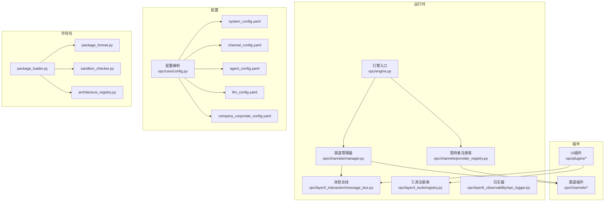
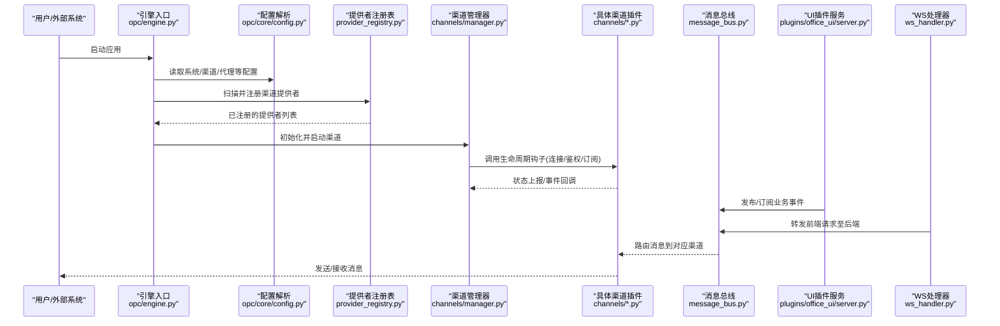
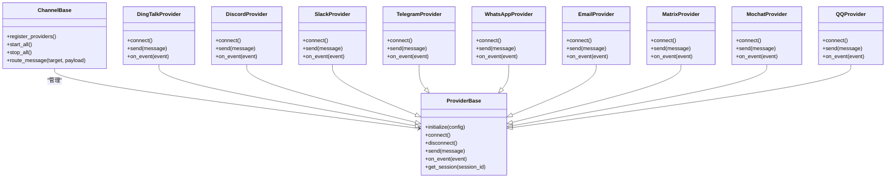
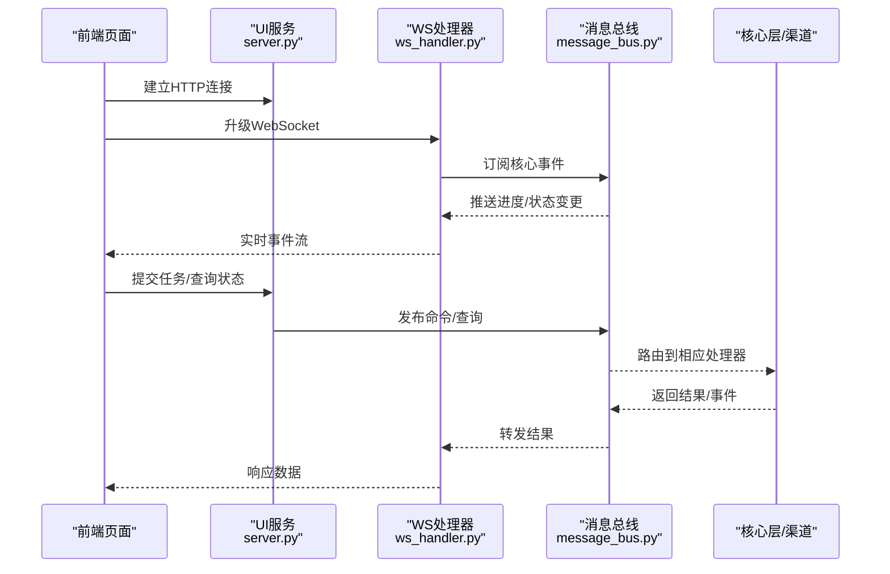
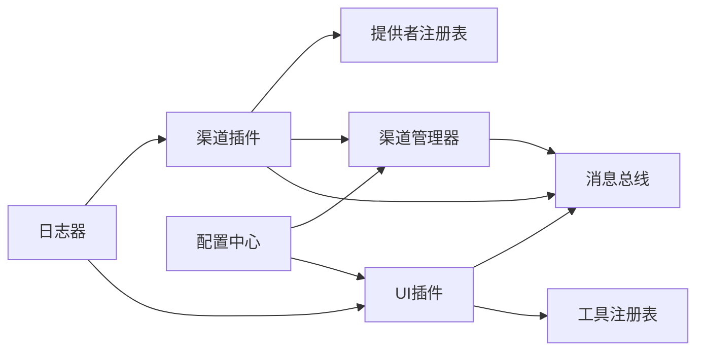

# 插件开发指南

<cite>
**本文引用的文件**   
- [pyproject.toml](file://pyproject.toml)
- [opc/engine.py](file://opc/engine.py)
- [opc/channels/manager.py](file://opc/channels/manager.py)
- [opc/channels/provider_registry.py](file://opc/channels/provider_registry.py)
- [opc/channels/base.py](file://opc/channels/base.py)
- [opc/channels/dingtalk.py](file://opc/channels/dingtalk.py)
- [opc/channels/discord.py](file://opc/channels/discord.py)
- [opc/channels/email.py](file://opc/channels/email.py)
- [opc/channels/feishu.py](file://opc/channels/feishu.py)
- [opc/channels/matrix.py](file://opc/channels/matrix.py)
- [opc/channels/mochat.py](file://opc/channels/mochat.py)
- [opc/channels/provider_base.py](file://opc/channels/provider_base.py)
- [opc/channels/qq.py](file://opc/channels/qq.py)
- [opc/channels/slack.py](file://opc/channels/slack.py)
- [opc/channels/telegram.py](file://opc/channels/telegram.py)
- [opc/channels/whatsapp.py](file://opc/channels/whatsapp.py)
- [opc/channels/session.py](file://opc/channels/session.py)
- [opc/core/config.py](file://opc/core/config.py)
- [config/system_config.yaml](file://config/system_config.yaml)
- [config/channel_config.yaml](file://config/channel_config.yaml)
- [config/agent_config.yaml](file://config/agent_config.yaml)
- [config/company_corporate_config.yaml](file://config/company_corporate_config.yaml)
- [config/llm_config.yaml](file://config/llm_config.yaml)
- [opc/plugins/cli_board/__init__.py](file://opc/plugins/cli_board/__init__.py)
- [opc/plugins/cli_board/entry.py](file://opc/plugins/cli_board/entry.py)
- [opc/plugins/office_ui/__init__.py](file://opc/plugins/office_ui/__init__.py)
- [opc/plugins/office_ui/server.py](file://opc/plugins/office_ui/server.py)
- [opc/plugins/office_ui/ws_handler.py](file://opc/plugins/office_ui/ws_handler.py)
- [opc/plugins/office_ui/services/factory.py](file://opc/plugins/office_ui/services/factory.py)
- [opc/plugins/office_ui/dispatcher.py](file://opc/plugins/office_ui/dispatcher.py)
- [opc/market/package_loader.py](file://opc/market/package_loader.py)
- [opc/market/package_format.py](file://opc/market/package_format.py)
- [opc/market/sandbox_checker.py](file://opc/market/sandbox_checker.py)
- [opc/market/architecture_registry.py](file://opc/market/architecture_registry.py)
- [opc/market/builtin_presets/vc_investment_firm.yaml](file://opc/market/builtin_presets/vc_investment_firm.yaml)
- [opc/layer0_interaction/message_bus.py](file://opc/layer0_interaction/message_bus.py)
- [opc/layer4_tools/registry.py](file://opc/layer4_tools/registry.py)
- [opc/layer6_observability/opc_logger.py](file://opc/layer6_observability/opc_logger.py)
- [tests/test_channels.py](file://tests/test_channels.py)
- [tests/test_channel_runtime_integration.py](file://tests/test_channel_runtime_integration.py)
- [tests/test_office_shutdown_lifecycle.py](file://tests/test_office_shutdown_lifecycle.py)
- [tests/test_ws_handler_progress_parsing.py](file://tests/test_ws_handler_progress_parsing.py)
</cite>

## 目录
1. [简介](#简介)
2. [项目结构](#项目结构)
3. [核心组件](#核心组件)
4. [架构总览](#架构总览)
5. [详细组件分析](#详细组件分析)
6. [依赖分析](#依赖分析)
7. [性能考虑](#性能考虑)
8. [故障排查指南](#故障排查指南)
9. [结论](#结论)
10. [附录](#附录)

## 简介
本指南面向OpenOPC插件开发者，围绕“渠道插件”和“UI插件”两类典型扩展点，系统说明：
- 插件项目的目录结构与组织规范
- 插件入口点的定义与初始化流程
- 插件配置文件的格式与参数约定
- 插件间通信API的使用示例与最佳实践
- 测试框架与单元测试编写方法
- 打包、签名与分发流程（基于市场包机制）
- 安全审查清单与代码规范要求
- 常见插件类型的模板与示例路径
- 调试技巧与日志记录方法

## 项目结构
仓库采用分层与特性混合的组织方式。与插件相关的关键位置如下：
- 渠道插件位于 opc/channels/*，通过注册表与管理器统一加载与运行
- UI插件位于 opc/plugins/*，以独立子包形式提供前端与后端服务
- 市场包机制位于 opc/market/*，负责包的加载、校验与安装
- 配置集中于 config/*，由 core/config.py 统一解析
- 消息总线位于 opc/layer0_interaction/message_bus.py，作为跨层通信基础
- 工具注册表位于 opc/layer4_tools/registry.py，用于能力注册与发现
- 可观测性日志位于 opc/layer6_observability/opc_logger.py

图表来源
- [opc/engine.py](file://opc/engine.py)
- [opc/channels/provider_registry.py](file://opc/channels/provider_registry.py)
- [opc/channels/manager.py](file://opc/channels/manager.py)
- [opc/layer0_interaction/message_bus.py](file://opc/layer0_interaction/message_bus.py)
- [opc/layer4_tools/registry.py](file://opc/layer4_tools/registry.py)
- [opc/core/config.py](file://opc/core/config.py)
- [config/system_config.yaml](file://config/system_config.yaml)
- [config/channel_config.yaml](file://config/channel_config.yaml)
- [config/agent_config.yaml](file://config/agent_config.yaml)
- [config/llm_config.yaml](file://config/llm_config.yaml)
- [config/company_corporate_config.yaml](file://config/company_corporate_config.yaml)
- [opc/market/package_loader.py](file://opc/market/package_loader.py)
- [opc/market/package_format.py](file://opc/market/package_format.py)
- [opc/market/sandbox_checker.py](file://opc/market/sandbox_checker.py)
- [opc/market/architecture_registry.py](file://opc/market/architecture_registry.py)

章节来源
- [opc/engine.py](file://opc/engine.py)
- [opc/channels/provider_registry.py](file://opc/channels/provider_registry.py)
- [opc/channels/manager.py](file://opc/channels/manager.py)
- [opc/layer0_interaction/message_bus.py](file://opc/layer0_interaction/message_bus.py)
- [opc/layer4_tools/registry.py](file://opc/layer4_tools/registry.py)
- [opc/core/config.py](file://opc/core/config.py)
- [config/system_config.yaml](file://config/system_config.yaml)
- [config/channel_config.yaml](file://config/channel_config.yaml)
- [config/agent_config.yaml](file://config/agent_config.yaml)
- [config/llm_config.yaml](file://config/llm_config.yaml)
- [config/company_corporate_config.yaml](file://config/company_corporate_config.yaml)
- [opc/market/package_loader.py](file://opc/market/package_loader.py)
- [opc/market/package_format.py](file://opc/market/package_format.py)
- [opc/market/sandbox_checker.py](file://opc/market/sandbox_checker.py)
- [opc/market/architecture_registry.py](file://opc/market/architecture_registry.py)

## 核心组件
- 渠道插件基类与提供者接口：定义统一的接入契约，包括生命周期、事件处理、会话管理、认证与消息收发等。
- 渠道注册表与管理器：负责插件的发现、注册、启动、停止与路由。
- UI插件：提供Web界面与服务端桥接，通过WebSocket与前端交互，并通过消息总线与核心层通信。
- 配置中心：集中读取YAML配置并注入到各模块。
- 市场包机制：支持将插件打包为可分发的包，并进行格式校验与安全沙箱检查。
- 工具注册表：为插件提供能力注册与发现机制。
- 日志与可观测性：统一的日志输出与追踪。

章节来源
- [opc/channels/base.py](file://opc/channels/base.py)
- [opc/channels/provider_base.py](file://opc/channels/provider_base.py)
- [opc/channels/provider_registry.py](file://opc/channels/provider_registry.py)
- [opc/channels/manager.py](file://opc/channels/manager.py)
- [opc/plugins/office_ui/server.py](file://opc/plugins/office_ui/server.py)
- [opc/plugins/office_ui/ws_handler.py](file://opc/plugins/office_ui/ws_handler.py)
- [opc/core/config.py](file://opc/core/config.py)
- [opc/market/package_loader.py](file://opc/market/package_loader.py)
- [opc/layer4_tools/registry.py](file://opc/layer4_tools/registry.py)
- [opc/layer6_observability/opc_logger.py](file://opc/layer6_observability/opc_logger.py)

## 架构总览
下图展示插件在系统中的整体交互关系：引擎启动时加载配置与插件，渠道插件通过注册表加入运行时，UI插件通过服务与WebSocket暴露能力，所有组件通过消息总线进行解耦通信。

图表来源
- [opc/engine.py](file://opc/engine.py)
- [opc/core/config.py](file://opc/core/config.py)
- [opc/channels/provider_registry.py](file://opc/channels/provider_registry.py)
- [opc/channels/manager.py](file://opc/channels/manager.py)
- [opc/channels/dingtalk.py](file://opc/channels/dingtalk.py)
- [opc/channels/discord.py](file://opc/channels/discord.py)
- [opc/channels/email.py](file://opc/channels/email.py)
- [opc/channels/feishu.py](file://opc/channels/feishu.py)
- [opc/channels/matrix.py](file://opc/channels/matrix.py)
- [opc/channels/mochat.py](file://opc/channels/mochat.py)
- [opc/channels/qq.py](file://opc/channels/qq.py)
- [opc/channels/slack.py](file://opc/channels/slack.py)
- [opc/channels/telegram.py](file://opc/channels/telegram.py)
- [opc/channels/whatsapp.py](file://opc/channels/whatsapp.py)
- [opc/layer0_interaction/message_bus.py](file://opc/layer0_interaction/message_bus.py)
- [opc/plugins/office_ui/server.py](file://opc/plugins/office_ui/server.py)
- [opc/plugins/office_ui/ws_handler.py](file://opc/plugins/office_ui/ws_handler.py)

## 详细组件分析

### 渠道插件体系
- 设计要点
  - 抽象基类与提供者接口：统一生命周期、事件模型、会话上下文与错误语义。
  - 注册表与管理器：按配置动态启用/禁用渠道，维护实例池与心跳检测。
  - 会话与路由：基于会话ID与通道类型进行消息路由与去重。
- 关键文件
  - 基类与提供者接口：[opc/channels/base.py](file://opc/channels/base.py)、[opc/channels/provider_base.py](file://opc/channels/provider_base.py)
  - 注册表与管理器：[opc/channels/provider_registry.py](file://opc/channels/provider_registry.py)、[opc/channels/manager.py](file://opc/channels/manager.py)
  - 会话管理：[opc/channels/session.py](file://opc/channels/session.py)
  - 具体实现示例：钉钉、飞书、Slack、Telegram、WhatsApp、Discord、Email、Matrix、Mochat、QQ等

图表来源
- [opc/channels/base.py](file://opc/channels/base.py)
- [opc/channels/provider_base.py](file://opc/channels/provider_base.py)
- [opc/channels/dingtalk.py](file://opc/channels/dingtalk.py)
- [opc/channels/discord.py](file://opc/channels/discord.py)
- [opc/channels/slack.py](file://opc/channels/slack.py)
- [opc/channels/telegram.py](file://opc/channels/telegram.py)
- [opc/channels/whatsapp.py](file://opc/channels/whatsapp.py)
- [opc/channels/email.py](file://opc/channels/email.py)
- [opc/channels/matrix.py](file://opc/channels/matrix.py)
- [opc/channels/mochat.py](file://opc/channels/mochat.py)
- [opc/channels/qq.py](file://opc/channels/qq.py)

章节来源
- [opc/channels/base.py](file://opc/channels/base.py)
- [opc/channels/provider_base.py](file://opc/channels/provider_base.py)
- [opc/channels/provider_registry.py](file://opc/channels/provider_registry.py)
- [opc/channels/manager.py](file://opc/channels/manager.py)
- [opc/channels/session.py](file://opc/channels/session.py)
- [opc/channels/dingtalk.py](file://opc/channels/dingtalk.py)
- [opc/channels/discord.py](file://opc/channels/discord.py)
- [opc/channels/email.py](file://opc/channels/email.py)
- [opc/channels/feishu.py](file://opc/channels/feishu.py)
- [opc/channels/matrix.py](file://opc/channels/matrix.py)
- [opc/channels/mochat.py](file://opc/channels/mochat.py)
- [opc/channels/qq.py](file://opc/channels/qq.py)
- [opc/channels/slack.py](file://opc/channels/slack.py)
- [opc/channels/telegram.py](file://opc/channels/telegram.py)
- [opc/channels/whatsapp.py](file://opc/channels/whatsapp.py)

### UI插件（Office UI）
- 设计要点
  - 服务端与前端分离：Python后端提供REST/WebSocket接口，前端静态资源打包后托管。
  - 事件驱动：通过消息总线与核心层解耦，避免紧耦合。
  - 服务工厂：按需创建服务实例，便于测试与替换。
- 关键文件
  - 插件入口与初始化：[opc/plugins/office_ui/__init__.py](file://opc/plugins/office_ui/__init__.py)
  - Web服务与WS处理器：[opc/plugins/office_ui/server.py](file://opc/plugins/office_ui/server.py)、[opc/plugins/office_ui/ws_handler.py](file://opc/plugins/office_ui/ws_handler.py)
  - 服务工厂与调度器：[opc/plugins/office_ui/services/factory.py](file://opc/plugins/office_ui/services/factory.py)、[opc/plugins/office_ui/dispatcher.py](file://opc/plugins/office_ui/dispatcher.py)

图表来源
- [opc/plugins/office_ui/server.py](file://opc/plugins/office_ui/server.py)
- [opc/plugins/office_ui/ws_handler.py](file://opc/plugins/office_ui/ws_handler.py)
- [opc/layer0_interaction/message_bus.py](file://opc/layer0_interaction/message_bus.py)

章节来源
- [opc/plugins/office_ui/__init__.py](file://opc/plugins/office_ui/__init__.py)
- [opc/plugins/office_ui/server.py](file://opc/plugins/office_ui/server.py)
- [opc/plugins/office_ui/ws_handler.py](file://opc/plugins/office_ui/ws_handler.py)
- [opc/plugins/office_ui/services/factory.py](file://opc/plugins/office_ui/services/factory.py)
- [opc/plugins/office_ui/dispatcher.py](file://opc/plugins/office_ui/dispatcher.py)

### CLI看板插件
- 设计要点
  - 命令行交互式界面，提供看板视图与操作面板。
  - 通过服务门面与事件桥接核心层。
- 关键文件
  - 插件入口与初始化：[opc/plugins/cli_board/__init__.py](file://opc/plugins/cli_board/__init__.py)、[opc/plugins/cli_board/entry.py](file://opc/plugins/cli_board/entry.py)
  - 服务门面与事件桥：[opc/plugins/cli_board/services/engine_facade.py](file://opc/plugins/cli_board/services/engine_facade.py)、[opc/plugins/cli_board/services/event_bridge.py](file://opc/plugins/cli_board/services/event_bridge.py)

章节来源
- [opc/plugins/cli_board/__init__.py](file://opc/plugins/cli_board/__init__.py)
- [opc/plugins/cli_board/entry.py](file://opc/plugins/cli_board/entry.py)
- [opc/plugins/cli_board/services/engine_facade.py](file://opc/plugins/cli_board/services/engine_facade.py)
- [opc/plugins/cli_board/services/event_bridge.py](file://opc/plugins/cli_board/services/event_bridge.py)

### 配置与参数
- 配置文件
  - 系统配置：[config/system_config.yaml](file://config/system_config.yaml)
  - 渠道配置：[config/channel_config.yaml](file://config/channel_config.yaml)
  - 代理配置：[config/agent_config.yaml](file://config/agent_config.yaml)
  - 企业配置：[config/company_corporate_config.yaml](file://config/company_corporate_config.yaml)
  - LLM配置：[config/llm_config.yaml](file://config/llm_config.yaml)
- 配置解析
  - 统一读取与合并：[opc/core/config.py](file://opc/core/config.py)
- 建议
  - 使用YAML键名保持小写与短横线风格
  - 敏感信息通过环境变量注入，不在配置中明文存储
  - 为每个渠道提供最小必要字段，其余使用默认值

章节来源
- [config/system_config.yaml](file://config/system_config.yaml)
- [config/channel_config.yaml](file://config/channel_config.yaml)
- [config/agent_config.yaml](file://config/agent_config.yaml)
- [config/company_corporate_config.yaml](file://config/company_corporate_config.yaml)
- [config/llm_config.yaml](file://config/llm_config.yaml)
- [opc/core/config.py](file://opc/core/config.py)

### 插件间通信API
- 消息总线
  - 发布/订阅模式，支持主题与过滤
  - 适用于跨层异步通信与事件广播
- 工具注册表
  - 插件可注册工具函数供其他模块调用
- 最佳实践
  - 明确事件命名空间与版本
  - 对关键事件增加幂等与重试策略
  - 避免在事件处理中进行阻塞I/O

章节来源
- [opc/layer0_interaction/message_bus.py](file://opc/layer0_interaction/message_bus.py)
- [opc/layer4_tools/registry.py](file://opc/layer4_tools/registry.py)

### 测试框架与单元测试
- 渠道测试
  - 通用行为与集成测试：[tests/test_channels.py](file://tests/test_channels.py)、[tests/test_channel_runtime_integration.py](file://tests/test_channel_runtime_integration.py)
- UI插件测试
  - 生命周期与关闭流程：[tests/test_office_shutdown_lifecycle.py](file://tests/test_office_shutdown_lifecycle.py)
  - WebSocket事件解析：[tests/test_ws_handler_progress_parsing.py](file://tests/test_ws_handler_progress_parsing.py)
- 建议
  - 使用夹具隔离外部依赖（网络、数据库）
  - 针对边界条件与异常路径补充用例
  - 对UI插件的WS处理器进行端到端断言

章节来源
- [tests/test_channels.py](file://tests/test_channels.py)
- [tests/test_channel_runtime_integration.py](file://tests/test_channel_runtime_integration.py)
- [tests/test_office_shutdown_lifecycle.py](file://tests/test_office_shutdown_lifecycle.py)
- [tests/test_ws_handler_progress_parsing.py](file://tests/test_ws_handler_progress_parsing.py)

### 打包、签名与分发
- 包格式与加载
  - 包格式定义：[opc/market/package_format.py](file://opc/market/package_format.py)
  - 包加载器：[opc/market/package_loader.py](file://opc/market/package_loader.py)
- 安全与沙箱
  - 沙箱检查：[opc/market/sandbox_checker.py](file://opc/market/sandbox_checker.py)
- 架构注册
  - 架构注册表：[opc/market/architecture_registry.py](file://opc/market/architecture_registry.py)
- 内置预设
  - 示例预设：[opc/market/builtin_presets/vc_investment_firm.yaml](file://opc/market/builtin_presets/vc_investment_firm.yaml)
- 建议
  - 遵循包格式规范，包含元数据与依赖声明
  - 在CI中执行沙箱检查与签名验证
  - 使用架构注册表进行能力声明与版本兼容

章节来源
- [opc/market/package_format.py](file://opc/market/package_format.py)
- [opc/market/package_loader.py](file://opc/market/package_loader.py)
- [opc/market/sandbox_checker.py](file://opc/market/sandbox_checker.py)
- [opc/market/architecture_registry.py](file://opc/market/architecture_registry.py)
- [opc/market/builtin_presets/vc_investment_firm.yaml](file://opc/market/builtin_presets/vc_investment_firm.yaml)

### 安全审查清单与代码规范
- 安全审查清单
  - 输入校验与白名单过滤
  - 敏感配置加密或环境变量注入
  - 权限控制与最小权限原则
  - 第三方依赖漏洞扫描
  - 沙箱与隔离策略
- 代码规范
  - 统一命名与文档字符串
  - 明确的错误类型与错误码
  - 日志级别与结构化输出
  - 单元测试覆盖率要求

章节来源
- [opc/market/sandbox_checker.py](file://opc/market/sandbox_checker.py)
- [opc/core/config.py](file://opc/core/config.py)
- [opc/layer6_observability/opc_logger.py](file://opc/layer6_observability/opc_logger.py)

### 调试技巧与日志记录
- 日志器
  - 统一日志输出与追踪：[opc/layer6_observability/opc_logger.py](file://opc/layer6_observability/opc_logger.py)
- 调试建议
  - 开启详细日志级别，关注关键事件与错误堆栈
  - 使用唯一请求ID贯穿链路
  - 对长时间运行的任务添加进度事件

章节来源
- [opc/layer6_observability/opc_logger.py](file://opc/layer6_observability/opc_logger.py)

## 依赖分析
- 组件耦合
  - 渠道插件与注册表/管理器松耦合，通过接口与事件通信
  - UI插件通过消息总线与核心层解耦
- 外部依赖
  - 配置中心、日志器、工具注册表为共享基础设施
- 潜在循环依赖
  - 避免UI插件直接依赖渠道实现，应通过总线或工具注册表间接访问

图表来源
- [opc/channels/provider_registry.py](file://opc/channels/provider_registry.py)
- [opc/channels/manager.py](file://opc/channels/manager.py)
- [opc/layer0_interaction/message_bus.py](file://opc/layer0_interaction/message_bus.py)
- [opc/layer4_tools/registry.py](file://opc/layer4_tools/registry.py)
- [opc/core/config.py](file://opc/core/config.py)
- [opc/layer6_observability/opc_logger.py](file://opc/layer6_observability/opc_logger.py)

章节来源
- [opc/channels/provider_registry.py](file://opc/channels/provider_registry.py)
- [opc/channels/manager.py](file://opc/channels/manager.py)
- [opc/layer0_interaction/message_bus.py](file://opc/layer0_interaction/message_bus.py)
- [opc/layer4_tools/registry.py](file://opc/layer4_tools/registry.py)
- [opc/core/config.py](file://opc/core/config.py)
- [opc/layer6_observability/opc_logger.py](file://opc/layer6_observability/opc_logger.py)

## 性能考虑
- 连接复用与心跳保活：减少频繁握手与重连开销
- 事件批处理与节流：降低高频事件的CPU与IO压力
- 异步化与背压：避免阻塞主循环，合理设置队列容量
- 缓存热点数据：如会话元信息与路由表
- 资源清理：确保断开连接与释放句柄

## 故障排查指南
- 常见问题
  - 渠道无法连接：检查配置项与网络可达性
  - 消息未路由：确认事件主题与订阅者匹配
  - UI无响应：查看WS连接状态与服务器日志
- 定位步骤
  - 提升日志级别，捕获完整堆栈
  - 使用唯一请求ID追踪链路
  - 隔离外部依赖，复现最小用例
- 参考测试
  - 渠道行为与集成：[tests/test_channels.py](file://tests/test_channels.py)、[tests/test_channel_runtime_integration.py](file://tests/test_channel_runtime_integration.py)
  - UI生命周期与WS解析：[tests/test_office_shutdown_lifecycle.py](file://tests/test_office_shutdown_lifecycle.py)、[tests/test_ws_handler_progress_parsing.py](file://tests/test_ws_handler_progress_parsing.py)

章节来源
- [tests/test_channels.py](file://tests/test_channels.py)
- [tests/test_channel_runtime_integration.py](file://tests/test_channel_runtime_integration.py)
- [tests/test_office_shutdown_lifecycle.py](file://tests/test_office_shutdown_lifecycle.py)
- [tests/test_ws_handler_progress_parsing.py](file://tests/test_ws_handler_progress_parsing.py)

## 结论
通过统一的渠道插件接口、注册表与管理器、UI插件的服务化架构、消息总线与工具注册表、以及市场包机制，OpenOPC提供了可扩展、可测试、可分发的插件生态。遵循本文档的结构规范、配置约定、通信模式与安全清单，可高效构建高质量的插件。

## 附录
- 插件入口点与初始化流程
  - 渠道插件：在提供者中实现生命周期钩子，并在注册表中登记；由管理器统一启动。
  - UI插件：在服务工厂中创建实例，注册路由与WS处理器，启动服务。
- 常见插件类型模板
  - 渠道插件模板：参考现有实现，如钉钉、飞书、Slack、Telegram、WhatsApp、Discord、Email、Matrix、Mochat、QQ等
  - UI插件模板：参考Office UI插件的目录结构与入口
- 示例代码路径
  - 渠道实现示例：[opc/channels/dingtalk.py](file://opc/channels/dingtalk.py)、[opc/channels/feishu.py](file://opc/channels/feishu.py)、[opc/channels/slack.py](file://opc/channels/slack.py)、[opc/channels/telegram.py](file://opc/channels/telegram.py)、[opc/channels/whatsapp.py](file://opc/channels/whatsapp.py)、[opc/channels/discord.py](file://opc/channels/discord.py)、[opc/channels/email.py](file://opc/channels/email.py)、[opc/channels/matrix.py](file://opc/channels/matrix.py)、[opc/channels/mochat.py](file://opc/channels/mochat.py)、[opc/channels/qq.py](file://opc/channels/qq.py)
  - UI插件示例：[opc/plugins/office_ui/server.py](file://opc/plugins/office_ui/server.py)、[opc/plugins/office_ui/ws_handler.py](file://opc/plugins/office_ui/ws_handler.py)
  - CLI看板示例：[opc/plugins/cli_board/entry.py](file://opc/plugins/cli_board/entry.py)

章节来源
- [opc/channels/dingtalk.py](file://opc/channels/dingtalk.py)
- [opc/channels/feishu.py](file://opc/channels/feishu.py)
- [opc/channels/slack.py](file://opc/channels/slack.py)
- [opc/channels/telegram.py](file://opc/channels/telegram.py)
- [opc/channels/whatsapp.py](file://opc/channels/whatsapp.py)
- [opc/channels/discord.py](file://opc/channels/discord.py)
- [opc/channels/email.py](file://opc/channels/email.py)
- [opc/channels/matrix.py](file://opc/channels/matrix.py)
- [opc/channels/mochat.py](file://opc/channels/mochat.py)
- [opc/channels/qq.py](file://opc/channels/qq.py)
- [opc/plugins/office_ui/server.py](file://opc/plugins/office_ui/server.py)
- [opc/plugins/office_ui/ws_handler.py](file://opc/plugins/office_ui/ws_handler.py)
- [opc/plugins/cli_board/entry.py](file://opc/plugins/cli_board/entry.py)