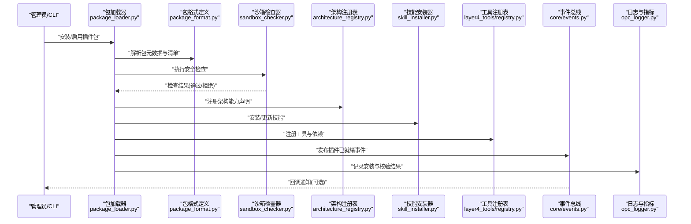
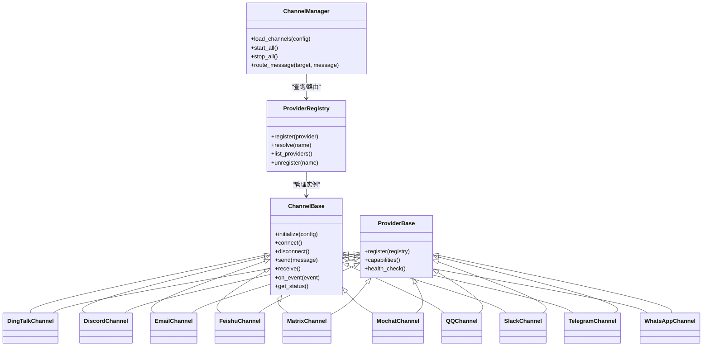
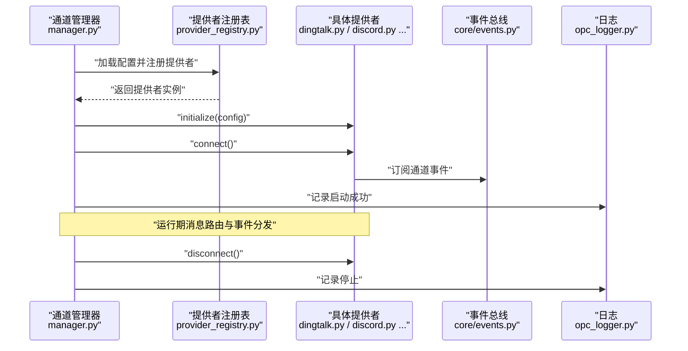
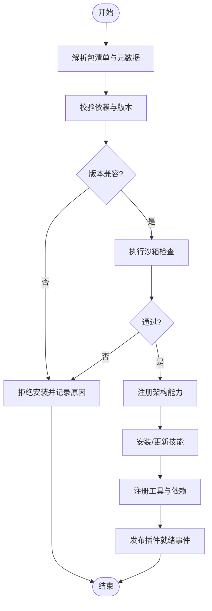
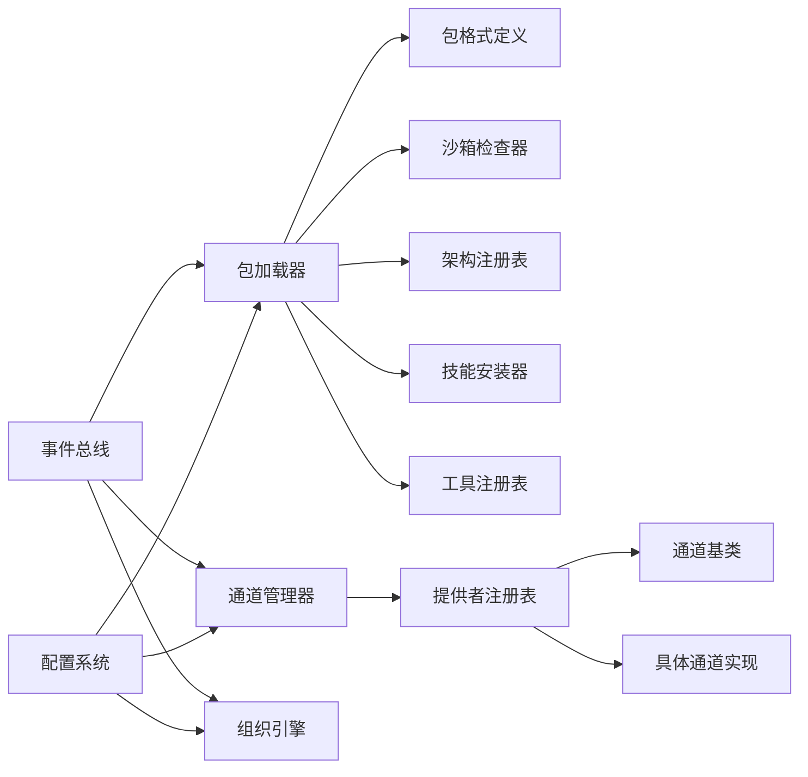

# 插件架构设计

<cite>
**本文引用的文件**   
- [opc/engine.py](file://opc/engine.py)
- [opc/channels/manager.py](file://opc/channels/manager.py)
- [opc/channels/provider_registry.py](file://opc/channels/provider_registry.py)
- [opc/channels/base.py](file://opc/channels/base.py)
- [opc/channels/dingtalk.py](file://opc/channels/dingtalk.py)
- [opc/channels/discord.py](file://opc/channels/discord.py)
- [opc/channels/email.py](file://opc/channels/email.py)
- [opc/channels/feishu.py](file://opc/channels/feishu.py)
- [opc/channels/matrix.py](file://opc/channels/matrix.py)
- [opc/channels/mochat.py](file://opc/channels/mochat.py)
- [opc/channels/provider_base.py](file://opc/channels/provider_base.py)
- [opc/channels/qq.py](file://opc/channels/qq.py)
- [opc/channels/slack.py](file://opc/channels/slack.py)
- [opc/channels/telegram.py](file://opc/channels/telegram.py)
- [opc/channels/whatsapp.py](file://opc/channels/whatsapp.py)
- [opc/core/config.py](file://opc/core/config.py)
- [opc/core/events.py](file://opc/core/events.py)
- [opc/core/models.py](file://opc/core/models.py)
- [opc/core/worker_envelope.py](file://opc/core/worker_envelope.py)
- [opc/layer1_perception/context_loader.py](file://opc/layer1_perception/context_loader.py)
- [opc/layer1_perception/task_router.py](file://opc/layer1_perception/task_router.py)
- [opc/layer2_organization/org_engine.py](file://opc/layer2_organization/org_engine.py)
- [opc/layer3_agent/skill_installer.py](file://opc/layer3_agent/skill_installer.py)
- [opc/layer4_tools/registry.py](file://opc/layer4_tools/registry.py)
- [opc/layer5_memory/skill_library.py](file://opc/layer5_memory/skill_library.py)
- [opc/layer6_observability/opc_logger.py](file://opc/layer6_observability/opc_logger.py)
- [opc/market/package_loader.py](file://opc/market/package_loader.py)
- [opc/market/package_format.py](file://opc/market/package_format.py)
- [opc/market/sandbox_checker.py](file://opc/market/sandbox_checker.py)
- [opc/market/architecture_registry.py](file://opc/market/architecture_registry.py)
- [opc/presentation/kanban.py](file://opc/presentation/kanban.py)
- [config/system_config.yaml](file://config/system_config.yaml)
- [config/agent_config.yaml](file://config/agent_config.yaml)
- [config/channel_config.yaml](file://config/channel_config.yaml)
</cite>

## 目录
1. [简介](#简介)
2. [项目结构](#项目结构)
3. [核心组件](#核心组件)
4. [架构总览](#架构总览)
5. [详细组件分析](#详细组件分析)
6. [依赖分析](#依赖分析)
7. [性能考虑](#性能考虑)
8. [故障排查指南](#故障排查指南)
9. [结论](#结论)
10. [附录](#附录)

## 简介
本文件面向OpenOPC的“插件架构”设计，聚焦于以下目标：
- 解释插件系统的整体架构模式：插件发现、生命周期管理、依赖注入
- 明确插件接口规范：初始化流程、事件处理机制、状态管理
- 描述插件间通信协议与数据共享方式
- 说明安全策略、权限控制与沙箱隔离机制
- 提供插件注册与卸载的完整流程
- 覆盖版本管理与兼容性检查
- 说明配置管理与环境变量处理
- 给出性能监控与资源限制机制

为便于不同技术背景的读者理解，文档采用由浅入深的分层叙述，并辅以架构图、时序图与流程图。

## 项目结构
OpenOPC采用分层与模块化组织，插件相关能力分布在多个层次：
- 通道层（channels）：以“提供者注册表+基类抽象”的模式实现外部渠道插件化接入
- 市场与包（market）：提供插件包的加载、格式定义、沙箱检查与架构注册
- 技能与工具（layer3_agent/layer4_tools/layer5_memory）：技能安装器、工具注册表、技能库等
- 核心基础设施（core）：配置、事件总线、模型、工作信封等
- 组织与感知（layer1/layer2）：上下文加载、任务路由、组织引擎等
- 可观测性（layer6）：日志与指标采集
- 呈现层（presentation）：看板等UI插件入口

```mermaid
graph TB
subgraph "核心"
CFG["配置系统<br/>core/config.py"]
EVT["事件总线<br/>core/events.py"]
MOD["模型与契约<br/>core/models.py"]
WENV["工作信封<br/>core/worker_envelope.py"]
end
subgraph "通道插件层"
CHMGR["通道管理器<br/>channels/manager.py"]
REG["提供者注册表<br/>channels/provider_registry.py"]
BASE["通道基类<br/>channels/base.py"]
PB["提供者基类<br/>channels/provider_base.py"]
DING["钉钉<br/>channels/dingtalk.py"]
DIS["Discord<br/>channels/discord.py"]
EMAIL["邮件<br/>channels/email.py"]
FEI["飞书<br/>channels/feishu.py"]
MAT["Matrix<br/>channels/matrix.py"]
MOC["Mochat<br/>channels/mochat.py"]
QQ["QQ<br/>channels/qq.py"]
SLK["Slack<br/>channels/slack.py"]
TGL["Telegram<br/>channels/telegram.py"]
WA["WhatsApp<br/>channels/whatsapp.py"]
end
subgraph "市场与包"
PKGLOAD["包加载器<br/>market/package_loader.py"]
PKGFMT["包格式定义<br/>market/package_format.py"]
SANDBOX["沙箱检查器<br/>market/sandbox_checker.py"]
ARCHREG["架构注册表<br/>market/architecture_registry.py"]
end
subgraph "技能与工具"
SKILLINST["技能安装器<br/>layer3_agent/skill_installer.py"]
TOOLREG["工具注册表<br/>layer4_tools/registry.py"]
SKILLLIB["技能库<br/>layer5_memory/skill_library.py"]
end
subgraph "感知与组织"
CTXLD["上下文加载器<br/>layer1_perception/context_loader.py"]
TASKRT["任务路由器<br/>layer1_perception/task_router.py"]
ORGENG["组织引擎<br/>layer2_organization/org_engine.py"]
end
subgraph "可观测性"
LOG["日志与指标<br/>layer6_observability/opc_logger.py"]
end
subgraph "呈现"
KANBAN["看板插件入口<br/>presentation/kanban.py"]
end
CFG --> CHMGR
EVT --> CHMGR
MOD --> CHMGR
WENV --> CHMGR
CHMGR --> REG
REG --> BASE
REG --> PB
DING --> REG
DIS --> REG
EMAIL --> REG
FEI --> REG
MAT --> REG
MOC --> REG
QQ --> REG
SLK --> REG
TGL --> REG
WA --> REG
PKGLOAD --> SANDBOX
PKGLOAD --> ARCHREG
PKGLOAD --> SKILLINST
PKGLOAD --> TOOLREG
PKGLOAD --> SKILLLIB
CTXLD --> TASKRT
TASKRT --> ORGENG
ORGENG --> CHMGR
ORGENG --> TOOLREG
LOG --> CHMGR
LOG --> ORGENG
LOG --> PKGLOAD
KANBAN --> ORGENG
KANBAN --> CHMGR
```

图表来源
- [opc/channels/manager.py](file://opc/channels/manager.py)
- [opc/channels/provider_registry.py](file://opc/channels/provider_registry.py)
- [opc/channels/base.py](file://opc/channels/base.py)
- [opc/channels/provider_base.py](file://opc/channels/provider_base.py)
- [opc/channels/dingtalk.py](file://opc/channels/dingtalk.py)
- [opc/channels/discord.py](file://opc/channels/discord.py)
- [opc/channels/email.py](file://opc/channels/email.py)
- [opc/channels/feishu.py](file://opc/channels/feishu.py)
- [opc/channels/matrix.py](file://opc/channels/matrix.py)
- [opc/channels/mochat.py](file://opc/channels/mochat.py)
- [opc/channels/qq.py](file://opc/channels/qq.py)
- [opc/channels/slack.py](file://opc/channels/slack.py)
- [opc/channels/telegram.py](file://opc/channels/telegram.py)
- [opc/channels/whatsapp.py](file://opc/channels/whatsapp.py)
- [opc/market/package_loader.py](file://opc/market/package_loader.py)
- [opc/market/package_format.py](file://opc/market/package_format.py)
- [opc/market/sandbox_checker.py](file://opc/market/sandbox_checker.py)
- [opc/market/architecture_registry.py](file://opc/market/architecture_registry.py)
- [opc/layer3_agent/skill_installer.py](file://opc/layer3_agent/skill_installer.py)
- [opc/layer4_tools/registry.py](file://opc/layer4_tools/registry.py)
- [opc/layer5_memory/skill_library.py](file://opc/layer5_memory/skill_library.py)
- [opc/layer1_perception/context_loader.py](file://opc/layer1_perception/context_loader.py)
- [opc/layer1_perception/task_router.py](file://opc/layer1_perception/task_router.py)
- [opc/layer2_organization/org_engine.py](file://opc/layer2_organization/org_engine.py)
- [opc/layer6_observability/opc_logger.py](file://opc/layer6_observability/opc_logger.py)
- [opc/presentation/kanban.py](file://opc/presentation/kanban.py)

章节来源
- [opc/channels/manager.py](file://opc/channels/manager.py)
- [opc/channels/provider_registry.py](file://opc/channels/provider_registry.py)
- [opc/channels/base.py](file://opc/channels/base.py)
- [opc/channels/provider_base.py](file://opc/channels/provider_base.py)
- [opc/market/package_loader.py](file://opc/market/package_loader.py)
- [opc/market/package_format.py](file://opc/market/package_format.py)
- [opc/market/sandbox_checker.py](file://opc/market/sandbox_checker.py)
- [opc/market/architecture_registry.py](file://opc/market/architecture_registry.py)
- [opc/layer3_agent/skill_installer.py](file://opc/layer3_agent/skill_installer.py)
- [opc/layer4_tools/registry.py](file://opc/layer4_tools/registry.py)
- [opc/layer5_memory/skill_library.py](file://opc/layer5_memory/skill_library.py)
- [opc/layer1_perception/context_loader.py](file://opc/layer1_perception/context_loader.py)
- [opc/layer1_perception/task_router.py](file://opc/layer1_perception/task_router.py)
- [opc/layer2_organization/org_engine.py](file://opc/layer2_organization/org_engine.py)
- [opc/layer6_observability/opc_logger.py](file://opc/layer6_observability/opc_logger.py)
- [opc/presentation/kanban.py](file://opc/presentation/kanban.py)

## 核心组件
- 通道提供者注册表与基类：统一抽象通道能力，集中管理提供者实例的生命周期与路由
- 包加载器与格式定义：解析插件包元数据、校验依赖与版本、执行沙箱检查
- 技能安装器与工具注册表：将技能与工具纳入运行时可用能力集合
- 事件总线与模型：跨模块事件分发与数据结构契约
- 配置系统与环境变量：集中读取与合并配置项，支持多环境切换
- 可观测性：统一的日志与指标输出，支撑性能监控与排障

章节来源
- [opc/channels/provider_registry.py](file://opc/channels/provider_registry.py)
- [opc/channels/base.py](file://opc/channels/base.py)
- [opc/market/package_loader.py](file://opc/market/package_loader.py)
- [opc/market/package_format.py](file://opc/market/package_format.py)
- [opc/layer3_agent/skill_installer.py](file://opc/layer3_agent/skill_installer.py)
- [opc/layer4_tools/registry.py](file://opc/layer4_tools/registry.py)
- [opc/core/events.py](file://opc/core/events.py)
- [opc/core/models.py](file://opc/core/models.py)
- [opc/core/config.py](file://opc/core/config.py)
- [opc/layer6_observability/opc_logger.py](file://opc/layer6_observability/opc_logger.py)

## 架构总览
OpenOPC插件体系围绕“注册表驱动 + 包加载 + 事件总线 + 配置中心”展开：
- 插件发现：通过包加载器扫描与解析插件包，结合架构注册表完成能力声明
- 生命周期：加载→校验→注册→初始化→运行→卸载，各阶段均有钩子与日志记录
- 依赖注入：通过注册表与工厂模式在运行时按需注入通道、工具与技能
- 事件驱动：基于事件总线进行跨组件通信，降低耦合度
- 安全与隔离：沙箱检查器对插件行为进行约束，配合权限与审计日志
- 配置与环境：集中式配置与环境变量注入，支持按插件维度扩展

图表来源
- [opc/market/package_loader.py](file://opc/market/package_loader.py)
- [opc/market/package_format.py](file://opc/market/package_format.py)
- [opc/market/sandbox_checker.py](file://opc/market/sandbox_checker.py)
- [opc/market/architecture_registry.py](file://opc/market/architecture_registry.py)
- [opc/layer3_agent/skill_installer.py](file://opc/layer3_agent/skill_installer.py)
- [opc/layer4_tools/registry.py](file://opc/layer4_tools/registry.py)
- [opc/core/events.py](file://opc/core/events.py)
- [opc/layer6_observability/opc_logger.py](file://opc/layer6_observability/opc_logger.py)

## 详细组件分析

### 通道插件子系统（Provider Registry & Base）
通道插件通过“提供者基类 + 注册表 + 具体实现”的方式实现可扩展的消息通道接入。

图表来源
- [opc/channels/base.py](file://opc/channels/base.py)
- [opc/channels/provider_base.py](file://opc/channels/provider_base.py)
- [opc/channels/provider_registry.py](file://opc/channels/provider_registry.py)
- [opc/channels/manager.py](file://opc/channels/manager.py)
- [opc/channels/dingtalk.py](file://opc/channels/dingtalk.py)
- [opc/channels/discord.py](file://opc/channels/discord.py)
- [opc/channels/email.py](file://opc/channels/email.py)
- [opc/channels/feishu.py](file://opc/channels/feishu.py)
- [opc/channels/matrix.py](file://opc/channels/matrix.py)
- [opc/channels/mochat.py](file://opc/channels/mochat.py)
- [opc/channels/qq.py](file://opc/channels/qq.py)
- [opc/channels/slack.py](file://opc/channels/slack.py)
- [opc/channels/telegram.py](file://opc/channels/telegram.py)
- [opc/channels/whatsapp.py](file://opc/channels/whatsapp.py)

章节来源
- [opc/channels/base.py](file://opc/channels/base.py)
- [opc/channels/provider_base.py](file://opc/channels/provider_base.py)
- [opc/channels/provider_registry.py](file://opc/channels/provider_registry.py)
- [opc/channels/manager.py](file://opc/channels/manager.py)
- [opc/channels/dingtalk.py](file://opc/channels/dingtalk.py)
- [opc/channels/discord.py](file://opc/channels/discord.py)
- [opc/channels/email.py](file://opc/channels/email.py)
- [opc/channels/feishu.py](file://opc/channels/feishu.py)
- [opc/channels/matrix.py](file://opc/channels/matrix.py)
- [opc/channels/mochat.py](file://opc/channels/mochat.py)
- [opc/channels/qq.py](file://opc/channels/qq.py)
- [opc/channels/slack.py](file://opc/channels/slack.py)
- [opc/channels/telegram.py](file://opc/channels/telegram.py)
- [opc/channels/whatsapp.py](file://opc/channels/whatsapp.py)

#### 通道插件生命周期与时序

图表来源
- [opc/channels/manager.py](file://opc/channels/manager.py)
- [opc/channels/provider_registry.py](file://opc/channels/provider_registry.py)
- [opc/channels/dingtalk.py](file://opc/channels/dingtalk.py)
- [opc/channels/discord.py](file://opc/channels/discord.py)
- [opc/core/events.py](file://opc/core/events.py)
- [opc/layer6_observability/opc_logger.py](file://opc/layer6_observability/opc_logger.py)

### 包加载与插件注册流程
包加载器负责解析插件包清单、执行安全检查、注册架构能力、安装技能与工具，并发布就绪事件。

图表来源
- [opc/market/package_loader.py](file://opc/market/package_loader.py)
- [opc/market/package_format.py](file://opc/market/package_format.py)
- [opc/market/sandbox_checker.py](file://opc/market/sandbox_checker.py)
- [opc/market/architecture_registry.py](file://opc/market/architecture_registry.py)
- [opc/layer3_agent/skill_installer.py](file://opc/layer3_agent/skill_installer.py)
- [opc/layer4_tools/registry.py](file://opc/layer4_tools/registry.py)

章节来源
- [opc/market/package_loader.py](file://opc/market/package_loader.py)
- [opc/market/package_format.py](file://opc/market/package_format.py)
- [opc/market/sandbox_checker.py](file://opc/market/sandbox_checker.py)
- [opc/market/architecture_registry.py](file://opc/market/architecture_registry.py)
- [opc/layer3_agent/skill_installer.py](file://opc/layer3_agent/skill_installer.py)
- [opc/layer4_tools/registry.py](file://opc/layer4_tools/registry.py)

### 插件接口规范（初始化、事件、状态）
- 初始化流程：插件在加载后需完成配置注入、连接建立、资源准备与订阅事件
- 事件处理机制：通过事件总线订阅/发布事件，确保异步解耦；通道插件应实现事件映射与转换
- 状态管理：插件需提供健康检查与状态查询接口，支持运行时监控与自愈

章节来源
- [opc/channels/base.py](file://opc/channels/base.py)
- [opc/channels/provider_base.py](file://opc/channels/provider_base.py)
- [opc/core/events.py](file://opc/core/events.py)
- [opc/core/models.py](file://opc/core/models.py)

### 插件间通信协议与数据共享
- 通信协议：基于事件总线的事件驱动通信，支持结构化事件对象与路由键
- 数据共享：通过共享模型与存储（如会话与工作项视图）进行数据交换；避免直接内存共享，强调不可变数据与快照
- 路由与编排：任务路由器根据上下文与策略将请求分发到合适的插件或工具

章节来源
- [opc/core/events.py](file://opc/core/events.py)
- [opc/core/models.py](file://opc/core/models.py)
- [opc/layer1_perception/task_router.py](file://opc/layer1_perception/task_router.py)
- [opc/layer1_perception/context_loader.py](file://opc/layer1_perception/context_loader.py)

### 安全策略、权限控制与沙箱隔离
- 沙箱检查：在加载阶段对插件代码与依赖进行静态与动态检查，阻断高风险行为
- 权限控制：通过架构注册表声明能力边界，运行时依据策略授予最小权限
- 审计与隔离：所有关键操作记录日志与指标，必要时在受限环境中执行

章节来源
- [opc/market/sandbox_checker.py](file://opc/market/sandbox_checker.py)
- [opc/market/architecture_registry.py](file://opc/market/architecture_registry.py)
- [opc/layer6_observability/opc_logger.py](file://opc/layer6_observability/opc_logger.py)

### 插件注册与卸载流程
- 注册：包加载器解析清单→校验→沙箱→注册能力→安装技能→注册工具→发布就绪
- 卸载：反向流程，取消订阅、释放资源、移除注册项、清理缓存与持久化状态

章节来源
- [opc/market/package_loader.py](file://opc/market/package_loader.py)
- [opc/layer3_agent/skill_installer.py](file://opc/layer3_agent/skill_installer.py)
- [opc/layer4_tools/registry.py](file://opc/layer4_tools/registry.py)
- [opc/channels/provider_registry.py](file://opc/channels/provider_registry.py)

### 版本管理与兼容性检查
- 版本声明：包清单中声明插件版本与依赖版本范围
- 兼容性检查：加载时对比当前运行时版本与插件需求，不满足则拒绝安装
- 升级策略：支持增量更新与回滚，保证服务连续性

章节来源
- [opc/market/package_format.py](file://opc/market/package_format.py)
- [opc/market/package_loader.py](file://opc/market/package_loader.py)

### 配置管理与环境变量处理
- 配置来源：YAML配置文件与环境变量合并，支持默认值与覆盖
- 插件配置：按插件维度提供独立配置段，便于隔离与热更新
- 敏感信息：通过环境变量注入密钥，避免明文存储

章节来源
- [opc/core/config.py](file://opc/core/config.py)
- [config/system_config.yaml](file://config/system_config.yaml)
- [config/agent_config.yaml](file://config/agent_config.yaml)
- [config/channel_config.yaml](file://config/channel_config.yaml)

### 性能监控与资源限制
- 指标采集：在关键路径埋点，统计延迟、吞吐、错误率与资源使用
- 限流与熔断：对通道与工具调用实施速率限制与熔断保护
- 资源配额：为插件分配CPU/内存/IO配额，防止单插件影响整体稳定性

章节来源
- [opc/layer6_observability/opc_logger.py](file://opc/layer6_observability/opc_logger.py)
- [opc/channels/manager.py](file://opc/channels/manager.py)
- [opc/layer4_tools/registry.py](file://opc/layer4_tools/registry.py)

## 依赖分析
插件子系统之间的依赖关系如下：
- 包加载器依赖包格式定义、沙箱检查器、架构注册表、技能安装器与工具注册表
- 通道管理器依赖提供者注册表与具体通道实现
- 事件总线贯穿各层，作为松耦合通信骨干
- 配置系统为所有组件提供运行时参数

图表来源
- [opc/market/package_loader.py](file://opc/market/package_loader.py)
- [opc/market/package_format.py](file://opc/market/package_format.py)
- [opc/market/sandbox_checker.py](file://opc/market/sandbox_checker.py)
- [opc/market/architecture_registry.py](file://opc/market/architecture_registry.py)
- [opc/layer3_agent/skill_installer.py](file://opc/layer3_agent/skill_installer.py)
- [opc/layer4_tools/registry.py](file://opc/layer4_tools/registry.py)
- [opc/channels/manager.py](file://opc/channels/manager.py)
- [opc/channels/provider_registry.py](file://opc/channels/provider_registry.py)
- [opc/channels/base.py](file://opc/channels/base.py)
- [opc/core/events.py](file://opc/core/events.py)
- [opc/layer2_organization/org_engine.py](file://opc/layer2_organization/org_engine.py)
- [opc/core/config.py](file://opc/core/config.py)

章节来源
- [opc/market/package_loader.py](file://opc/market/package_loader.py)
- [opc/channels/manager.py](file://opc/channels/manager.py)
- [opc/channels/provider_registry.py](file://opc/channels/provider_registry.py)
- [opc/core/events.py](file://opc/core/events.py)
- [opc/core/config.py](file://opc/core/config.py)

## 性能考虑
- 事件批处理：在高吞吐场景下合并事件以减少总线压力
- 连接复用：通道连接池与长连接复用，降低握手开销
- 异步执行：非阻塞I/O与协程调度，提升并发能力
- 资源隔离：为插件设置线程/进程隔离与资源上限，避免雪崩效应
- 监控告警：基于指标阈值触发告警，快速定位瓶颈

[本节为通用指导，无需特定文件引用]

## 故障排查指南
- 插件未生效：检查包清单与版本兼容性、沙箱检查结果、注册表是否包含该插件
- 通道无法连接：核对配置项、网络连通性与认证凭据；查看健康检查与日志
- 事件丢失或重复：确认事件路由键与订阅者唯一性；检查重试与幂等策略
- 性能退化：观察指标曲线，识别热点路径；评估限流与熔断策略是否合理
- 权限异常：审查架构能力声明与运行时策略；确认最小权限原则是否落实

章节来源
- [opc/market/package_loader.py](file://opc/market/package_loader.py)
- [opc/market/sandbox_checker.py](file://opc/market/sandbox_checker.py)
- [opc/channels/manager.py](file://opc/channels/manager.py)
- [opc/core/events.py](file://opc/core/events.py)
- [opc/layer6_observability/opc_logger.py](file://opc/layer6_observability/opc_logger.py)

## 结论
OpenOPC的插件架构以“注册表驱动 + 包加载 + 事件总线 + 配置中心”为核心，实现了高内聚、低耦合的可扩展体系。通过严格的版本与沙箱检查、完善的生命周期管理与可观测性，系统在安全性、稳定性与可维护性方面具备良好基础。建议在生产环境中持续完善权限策略、资源配额与监控告警，以确保插件生态的健康演进。

[本节为总结性内容，无需特定文件引用]

## 附录
- 示例插件清单字段与语义请参考包格式定义
- 通道插件实现参考现有通道实现，遵循基类契约
- 配置项与环境变量命名规范请参考配置系统与样例文件

章节来源
- [opc/market/package_format.py](file://opc/market/package_format.py)
- [opc/channels/base.py](file://opc/channels/base.py)
- [config/system_config.yaml](file://config/system_config.yaml)
- [config/agent_config.yaml](file://config/agent_config.yaml)
- [config/channel_config.yaml](file://config/channel_config.yaml)