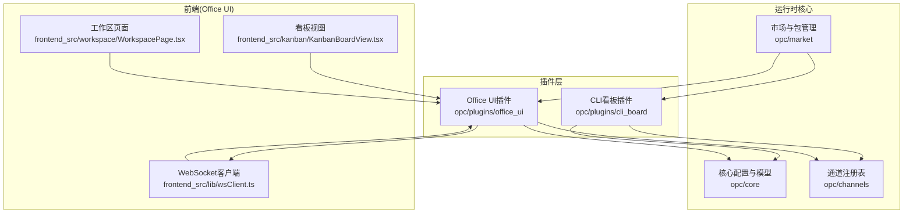
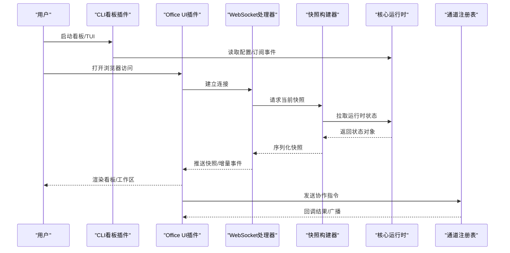
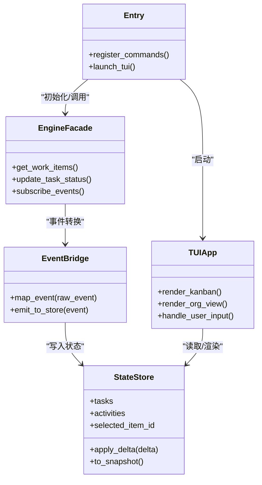
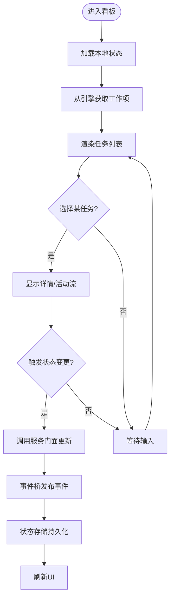
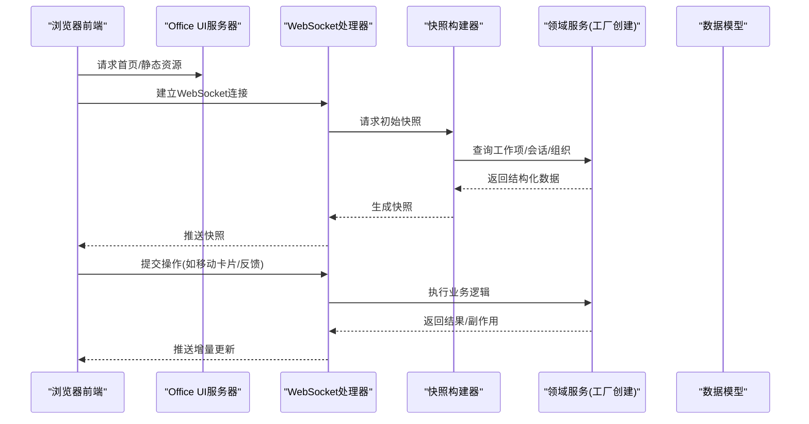
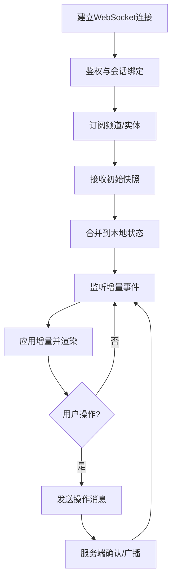
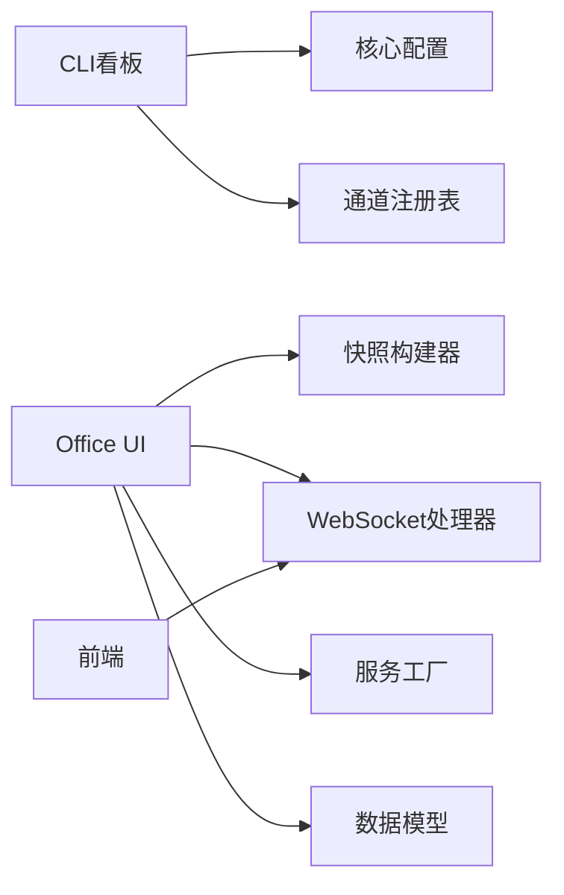

# 插件系统

<cite>
**本文引用的文件**   
- [opc/plugins/cli_board/entry.py](file://opc/plugins/cli_board/entry.py)
- [opc/plugins/cli_board/services/engine_facade.py](file://opc/plugins/cli_board/services/engine_facade.py)
- [opc/plugins/cli_board/services/event_bridge.py](file://opc/plugins/cli_board/services/event_bridge.py)
- [opc/plugins/cli_board/state/store.py](file://opc/plugins/cli_board/state/store.py)
- [opc/plugins/cli_board/tui/app.py](file://opc/plugins/cli_board/tui/app.py)
- [opc/plugins/cli_board/widgets/kanban_board.py](file://opc/plugins/cli_board/widgets/kanban_board.py)
- [opc/plugins/cli_board/widgets/org_viewer.py](file://opc/plugins/cli_board/widgets/org_viewer.py)
- [opc/plugins/office_ui/server.py](file://opc/plugins/office_ui/server.py)
- [opc/plugins/office_ui/ws_handler.py](file://opc/plugins/office_ui/ws_handler.py)
- [opc/plugins/office_ui/dispatcher.py](file://opc/plugins/office_ui/dispatcher.py)
- [opc/plugins/office_ui/snapshot_builder.py](file://opc/plugins/office_ui/snapshot_builder.py)
- [opc/plugins/office_ui/services/factory.py](file://opc/plugins/office_ui/services/factory.py)
- [opc/plugins/office_ui/services/models.py](file://opc/plugins/office_ui/services/models.py)
- [opc/plugins/office_ui/frontend_src/lib/wsClient.ts](file://opc/plugins/office_ui/frontend_src/lib/wsClient.ts)
- [opc/plugins/office_ui/frontend_src/lib/collabSync.ts](file://opc/plugins/office_ui/frontend_src/lib/collabSync.ts)
- [opc/plugins/office_ui/frontend_src/kanban/KanbanBoardView.tsx](file://opc/plugins/office_ui/frontend_src/kanban/KanbanBoardView.tsx)
- [opc/plugins/office_ui/frontend_src/workspace/WorkspacePage.tsx](file://opc/plugins/office_ui/frontend_src/workspace/WorkspacePage.tsx)
- [opc/market/package_loader.py](file://opc/market/package_loader.py)
- [opc/market/package_format.py](file://opc/market/package_format.py)
- [opc/market/sandbox_checker.py](file://opc/market/sandbox_checker.py)
- [opc/core/config.py](file://opc/core/config.py)
- [opc/channels/provider_registry.py](file://opc/channels/provider_registry.py)
</cite>

## 目录
1. [简介](#简介)
2. [项目结构](#项目结构)
3. [核心组件](#核心组件)
4. [架构总览](#架构总览)
5. [详细组件分析](#详细组件分析)
6. [依赖分析](#依赖分析)
7. [性能考虑](#性能考虑)
8. [故障排查指南](#故障排查指南)
9. [结论](#结论)
10. [附录](#附录)

## 简介
本文件面向OpenOPC插件系统的开发者与使用者，系统性阐述插件架构设计与加载机制，并聚焦两类内置插件：CLI看板插件与Office UI插件。文档覆盖任务管理、进度监控、组织视图、Web界面实现、实时通信、状态同步、用户交互、插件开发接口规范、生命周期管理、依赖注入、打包分发安装、插件间通信与数据共享、安全策略与权限控制，以及调试与测试最佳实践。

## 项目结构
OpenOPC将插件以“包”的形式组织在 opc/plugins 下，每个插件包含后端服务（Python）与可选前端资源（TypeScript/React）。CLI看板插件提供终端交互式看板与组织视图；Office UI插件提供基于浏览器的协作式工作区与看板。市场子系统负责插件包的装载、校验与运行期隔离检查。

图表来源
- [opc/market/package_loader.py](file://opc/market/package_loader.py)
- [opc/plugins/cli_board/entry.py](file://opc/plugins/cli_board/entry.py)
- [opc/plugins/office_ui/server.py](file://opc/plugins/office_ui/server.py)
- [opc/plugins/office_ui/frontend_src/lib/wsClient.ts](file://opc/plugins/office_ui/frontend_src/lib/wsClient.ts)
- [opc/plugins/office_ui/frontend_src/kanban/KanbanBoardView.tsx](file://opc/plugins/office_ui/frontend_src/kanban/KanbanBoardView.tsx)
- [opc/plugins/office_ui/frontend_src/workspace/WorkspacePage.tsx](file://opc/plugins/office_ui/frontend_src/workspace/WorkspacePage.tsx)

章节来源
- [opc/plugins/cli_board/entry.py](file://opc/plugins/cli_board/entry.py)
- [opc/plugins/office_ui/server.py](file://opc/plugins/office_ui/server.py)
- [opc/market/package_loader.py](file://opc/market/package_loader.py)

## 核心组件
- 插件入口与装配
  - CLI看板插件通过入口模块注册命令并提供TUI应用启动能力。
  - Office UI插件通过HTTP/WebSocket服务暴露API，驱动前端渲染与协作。
- 状态与事件
  - CLI看板使用本地状态存储与服务桥接，将引擎事件映射为看板更新。
  - Office UI通过快照构建器聚合运行时状态，经WebSocket推送至前端。
- 服务工厂与模型
  - Office UI服务工厂统一创建领域服务实例，服务返回的数据遵循统一模型定义。
- 通道集成
  - 插件通过通道注册表与外部消息渠道对接，实现跨端消息路由。

章节来源
- [opc/plugins/cli_board/entry.py](file://opc/plugins/cli_board/entry.py)
- [opc/plugins/office_ui/server.py](file://opc/plugins/office_ui/server.py)
- [opc/plugins/office_ui/services/factory.py](file://opc/plugins/office_ui/services/factory.py)
- [opc/plugins/office_ui/services/models.py](file://opc/plugins/office_ui/services/models.py)
- [opc/channels/provider_registry.py](file://opc/channels/provider_registry.py)

## 架构总览
下图展示插件系统与核心运行时、前端及通道的交互关系。

图表来源
- [opc/plugins/office_ui/ws_handler.py](file://opc/plugins/office_ui/ws_handler.py)
- [opc/plugins/office_ui/snapshot_builder.py](file://opc/plugins/office_ui/snapshot_builder.py)
- [opc/plugins/office_ui/server.py](file://opc/plugins/office_ui/server.py)
- [opc/plugins/cli_board/services/event_bridge.py](file://opc/plugins/cli_board/services/event_bridge.py)
- [opc/channels/provider_registry.py](file://opc/channels/provider_registry.py)

## 详细组件分析

### CLI看板插件
职责与能力
- 提供终端看板界面，支持任务列表、活动流、会话侧栏、指标条、组织视图等。
- 通过服务门面与事件桥接入核心运行时，维护本地状态并与UI同步。
- 关键子模块
  - 入口与TUI应用：负责命令行参数解析与应用初始化。
  - 服务门面：封装对核心引擎的调用，屏蔽底层差异。
  - 事件桥：将核心事件转换为看板可消费的事件类型。
  - 状态存储：持久化看板布局、筛选条件与选中项。
  - 组件：看板、组织视图、活动面板、会话面板等。

图表来源
- [opc/plugins/cli_board/entry.py](file://opc/plugins/cli_board/entry.py)
- [opc/plugins/cli_board/services/engine_facade.py](file://opc/plugins/cli_board/services/engine_facade.py)
- [opc/plugins/cli_board/services/event_bridge.py](file://opc/plugins/cli_board/services/event_bridge.py)
- [opc/plugins/cli_board/state/store.py](file://opc/plugins/cli_board/state/store.py)
- [opc/plugins/cli_board/tui/app.py](file://opc/plugins/cli_board/tui/app.py)
- [opc/plugins/cli_board/widgets/kanban_board.py](file://opc/plugins/cli_board/widgets/kanban_board.py)
- [opc/plugins/cli_board/widgets/org_viewer.py](file://opc/plugins/cli_board/widgets/org_viewer.py)

章节来源
- [opc/plugins/cli_board/entry.py](file://opc/plugins/cli_board/entry.py)
- [opc/plugins/cli_board/services/engine_facade.py](file://opc/plugins/cli_board/services/engine_facade.py)
- [opc/plugins/cli_board/services/event_bridge.py](file://opc/plugins/cli_board/services/event_bridge.py)
- [opc/plugins/cli_board/state/store.py](file://opc/plugins/cli_board/state/store.py)
- [opc/plugins/cli_board/tui/app.py](file://opc/plugins/cli_board/tui/app.py)
- [opc/plugins/cli_board/widgets/kanban_board.py](file://opc/plugins/cli_board/widgets/kanban_board.py)
- [opc/plugins/cli_board/widgets/org_viewer.py](file://opc/plugins/cli_board/widgets/org_viewer.py)

#### 任务管理与进度监控流程

图表来源
- [opc/plugins/cli_board/services/engine_facade.py](file://opc/plugins/cli_board/services/engine_facade.py)
- [opc/plugins/cli_board/services/event_bridge.py](file://opc/plugins/cli_board/services/event_bridge.py)
- [opc/plugins/cli_board/state/store.py](file://opc/plugins/cli_board/state/store.py)
- [opc/plugins/cli_board/widgets/task_list.py](file://opc/plugins/cli_board/widgets/task_list.py)

### Office UI插件
职责与能力
- 提供基于浏览器的协作式工作区与看板，支持实时通信、状态同步与多端协作。
- 通过HTTP服务提供静态资源与API，WebSocket处理器负责双向通信。
- 快照构建器聚合运行时状态，确保前后端一致性。
- 服务工厂与模型定义保障接口稳定与可扩展。

图表来源
- [opc/plugins/office_ui/server.py](file://opc/plugins/office_ui/server.py)
- [opc/plugins/office_ui/ws_handler.py](file://opc/plugins/office_ui/ws_handler.py)
- [opc/plugins/office_ui/snapshot_builder.py](file://opc/plugins/office_ui/snapshot_builder.py)
- [opc/plugins/office_ui/services/factory.py](file://opc/plugins/office_ui/services/factory.py)
- [opc/plugins/office_ui/services/models.py](file://opc/plugins/office_ui/services/models.py)
- [opc/plugins/office_ui/frontend_src/lib/wsClient.ts](file://opc/plugins/office_ui/frontend_src/lib/wsClient.ts)
- [opc/plugins/office_ui/frontend_src/kanban/KanbanBoardView.tsx](file://opc/plugins/office_ui/frontend_src/kanban/KanbanBoardView.tsx)
- [opc/plugins/office_ui/frontend_src/workspace/WorkspacePage.tsx](file://opc/plugins/office_ui/frontend_src/workspace/WorkspacePage.tsx)

章节来源
- [opc/plugins/office_ui/server.py](file://opc/plugins/office_ui/server.py)
- [opc/plugins/office_ui/ws_handler.py](file://opc/plugins/office_ui/ws_handler.py)
- [opc/plugins/office_ui/snapshot_builder.py](file://opc/plugins/office_ui/snapshot_builder.py)
- [opc/plugins/office_ui/services/factory.py](file://opc/plugins/office_ui/services/factory.py)
- [opc/plugins/office_ui/services/models.py](file://opc/plugins/office_ui/services/models.py)
- [opc/plugins/office_ui/frontend_src/lib/wsClient.ts](file://opc/plugins/office_ui/frontend_src/lib/wsClient.ts)
- [opc/plugins/office_ui/frontend_src/kanban/KanbanBoardView.tsx](file://opc/plugins/office_ui/frontend_src/kanban/KanbanBoardView.tsx)
- [opc/plugins/office_ui/frontend_src/workspace/WorkspacePage.tsx](file://opc/plugins/office_ui/frontend_src/workspace/WorkspacePage.tsx)

#### 实时通信与状态同步
- 前端通过WebSocket客户端建立长连接，处理重连、心跳与错误恢复。
- 服务端按订阅粒度推送快照或增量事件，前端合并到本地状态树。
- 协作同步模块保证多端一致性与冲突消解。

图表来源
- [opc/plugins/office_ui/frontend_src/lib/wsClient.ts](file://opc/plugins/office_ui/frontend_src/lib/wsClient.ts)
- [opc/plugins/office_ui/ws_handler.py](file://opc/plugins/office_ui/ws_handler.py)
- [opc/plugins/office_ui/frontend_src/lib/collabSync.ts](file://opc/plugins/office_ui/frontend_src/lib/collabSync.ts)

### 插件开发与接口规范
- 插件入口
  - 提供命令注册与启动钩子，允许插件向CLI与工作区注入功能。
- 服务与模型
  - 使用服务工厂创建领域服务，所有对外数据遵循统一模型定义，便于扩展与版本演进。
- 生命周期
  - 启动阶段完成配置加载、资源预热与连接建立；运行期响应事件；关闭阶段清理资源与持久化状态。
- 依赖注入
  - 通过工厂或服务容器注入配置、存储与外部依赖，避免全局耦合。
- 参考路径
  - 入口与装配：[opc/plugins/cli_board/entry.py](file://opc/plugins/cli_board/entry.py)、[opc/plugins/office_ui/server.py](file://opc/plugins/office_ui/server.py)
  - 服务工厂与模型：[opc/plugins/office_ui/services/factory.py](file://opc/plugins/office_ui/services/factory.py)、[opc/plugins/office_ui/services/models.py](file://opc/plugins/office_ui/services/models.py)

章节来源
- [opc/plugins/cli_board/entry.py](file://opc/plugins/cli_board/entry.py)
- [opc/plugins/office_ui/server.py](file://opc/plugins/office_ui/server.py)
- [opc/plugins/office_ui/services/factory.py](file://opc/plugins/office_ui/services/factory.py)
- [opc/plugins/office_ui/services/models.py](file://opc/plugins/office_ui/services/models.py)

### 打包、分发与安装
- 包格式
  - 使用标准包描述定义元数据、依赖与资源清单，确保可发现与可验证。
- 装载流程
  - 扫描包目录、解析清单、校验签名与沙箱规则，按需加载插件模块。
- 沙箱检查
  - 对导入与文件系统访问进行白名单校验，限制危险操作。
- 参考路径
  - 包格式定义：[opc/market/package_format.py](file://opc/market/package_format.py)
  - 包装载器：[opc/market/package_loader.py](file://opc/market/package_loader.py)
  - 沙箱检查器：[opc/market/sandbox_checker.py](file://opc/market/sandbox_checker.py)

章节来源
- [opc/market/package_format.py](file://opc/market/package_format.py)
- [opc/market/package_loader.py](file://opc/market/package_loader.py)
- [opc/market/sandbox_checker.py](file://opc/market/sandbox_checker.py)

### 插件间通信与数据共享
- 事件总线
  - 通过事件桥将核心事件标准化后分发给各插件，实现松耦合通信。
- 通道集成
  - 借助通道注册表，插件可将消息路由到不同渠道（IM、邮件等），并接收回调。
- 参考路径
  - 事件桥：[opc/plugins/cli_board/services/event_bridge.py](file://opc/plugins/cli_board/services/event_bridge.py)
  - 通道注册表：[opc/channels/provider_registry.py](file://opc/channels/provider_registry.py)

章节来源
- [opc/plugins/cli_board/services/event_bridge.py](file://opc/plugins/cli_board/services/event_bridge.py)
- [opc/channels/provider_registry.py](file://opc/channels/provider_registry.py)

### 安全策略与权限控制
- 沙箱与白名单
  - 在包装载阶段执行沙箱检查，限制敏感API与文件系统访问。
- 配置边界
  - 插件仅能访问其声明的配置域，避免越权读取其他插件或系统配置。
- 参考路径
  - 沙箱检查器：[opc/market/sandbox_checker.py](file://opc/market/sandbox_checker.py)
  - 核心配置：[opc/core/config.py](file://opc/core/config.py)

章节来源
- [opc/market/sandbox_checker.py](file://opc/market/sandbox_checker.py)
- [opc/core/config.py](file://opc/core/config.py)

### 调试与测试最佳实践
- 日志与断点
  - 在服务层与事件桥处增加结构化日志，结合IDE断点进行单步调试。
- 端到端测试
  - 针对WebSocket链路编写集成测试，模拟客户端连接、推送与操作回环。
- 快照一致性
  - 对比快照构建器输出与实际运行时状态，确保前后端数据契约稳定。
- 参考路径
  - WebSocket处理器：[opc/plugins/office_ui/ws_handler.py](file://opc/plugins/office_ui/ws_handler.py)
  - 快照构建器：[opc/plugins/office_ui/snapshot_builder.py](file://opc/plugins/office_ui/snapshot_builder.py)
  - 前端测试用例：[opc/plugins/office_ui/frontend_src/lib/wsClient.ts](file://opc/plugins/office_ui/frontend_src/lib/wsClient.ts)

章节来源
- [opc/plugins/office_ui/ws_handler.py](file://opc/plugins/office_ui/ws_handler.py)
- [opc/plugins/office_ui/snapshot_builder.py](file://opc/plugins/office_ui/snapshot_builder.py)
- [opc/plugins/office_ui/frontend_src/lib/wsClient.ts](file://opc/plugins/office_ui/frontend_src/lib/wsClient.ts)

## 依赖分析
- 内部依赖
  - CLI看板依赖核心配置与通道注册表；Office UI依赖快照构建器、服务工厂与WebSocket处理器。
- 外部依赖
  - 前端依赖浏览器WebSocket API与React生态；后端依赖异步I/O与序列化库。
- 潜在循环
  - 通过事件桥与服务工厂解耦，避免直接双向引用。

图表来源
- [opc/plugins/cli_board/entry.py](file://opc/plugins/cli_board/entry.py)
- [opc/plugins/office_ui/server.py](file://opc/plugins/office_ui/server.py)
- [opc/plugins/office_ui/ws_handler.py](file://opc/plugins/office_ui/ws_handler.py)
- [opc/plugins/office_ui/snapshot_builder.py](file://opc/plugins/office_ui/snapshot_builder.py)
- [opc/plugins/office_ui/services/factory.py](file://opc/plugins/office_ui/services/factory.py)
- [opc/plugins/office_ui/services/models.py](file://opc/plugins/office_ui/services/models.py)
- [opc/channels/provider_registry.py](file://opc/channels/provider_registry.py)

章节来源
- [opc/plugins/cli_board/entry.py](file://opc/plugins/cli_board/entry.py)
- [opc/plugins/office_ui/server.py](file://opc/plugins/office_ui/server.py)
- [opc/channels/provider_registry.py](file://opc/channels/provider_registry.py)

## 性能考虑
- 增量推送
  - 优先推送增量事件而非全量快照，降低带宽与CPU开销。
- 批处理与节流
  - 对高频事件进行批处理与节流，避免UI抖动。
- 缓存与去重
  - 对只读数据采用内存缓存，对重复事件进行去重。
- 前端虚拟化
  - 对长列表与大图资源采用虚拟滚动与懒加载。

## 故障排查指南
- 连接问题
  - 检查WebSocket握手与鉴权流程，确认端口与防火墙策略。
- 状态不一致
  - 对比快照构建器输出与前端状态树，定位缺失或重复事件。
- 权限异常
  - 核查沙箱白名单与配置域边界，确认插件未越权访问。
- 参考路径
  - WebSocket处理器：[opc/plugins/office_ui/ws_handler.py](file://opc/plugins/office_ui/ws_handler.py)
  - 快照构建器：[opc/plugins/office_ui/snapshot_builder.py](file://opc/plugins/office_ui/snapshot_builder.py)
  - 沙箱检查器：[opc/market/sandbox_checker.py](file://opc/market/sandbox_checker.py)

章节来源
- [opc/plugins/office_ui/ws_handler.py](file://opc/plugins/office_ui/ws_handler.py)
- [opc/plugins/office_ui/snapshot_builder.py](file://opc/plugins/office_ui/snapshot_builder.py)
- [opc/market/sandbox_checker.py](file://opc/market/sandbox_checker.py)

## 结论
OpenOPC插件系统通过清晰的包结构与分层设计，实现了CLI与Web双端插件的统一装载与运行。CLI看板插件提供高效的终端体验，Office UI插件提供强大的协作式Web界面。借助事件桥、快照构建器与服务工厂，系统在可扩展性、一致性与安全性方面具备良好基础。建议在新插件开发中严格遵循接口规范与生命周期约定，充分利用沙箱与配置边界，提升整体稳定性与可维护性。

## 附录
- 快速上手
  - 安装与启用插件：参考包装载与沙箱检查流程。
  - 本地调试：在后端服务与前端控制台分别开启详细日志。
- 参考路径
  - 包装载器：[opc/market/package_loader.py](file://opc/market/package_loader.py)
  - 包格式定义：[opc/market/package_format.py](file://opc/market/package_format.py)
  - 沙箱检查器：[opc/market/sandbox_checker.py](file://opc/market/sandbox_checker.py)