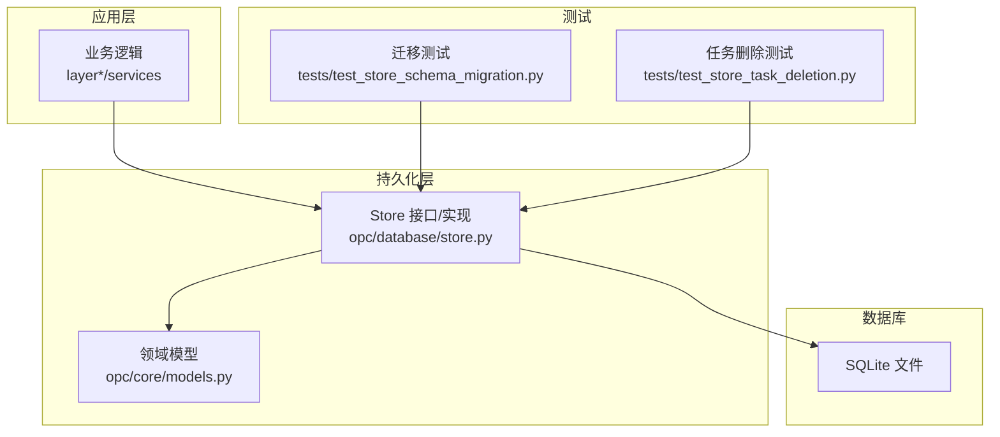
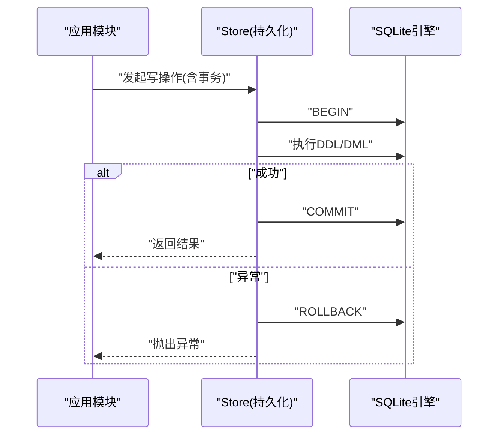
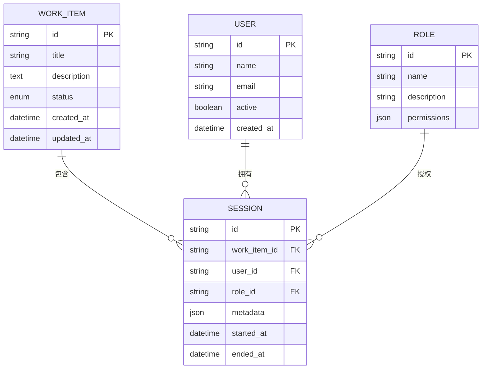
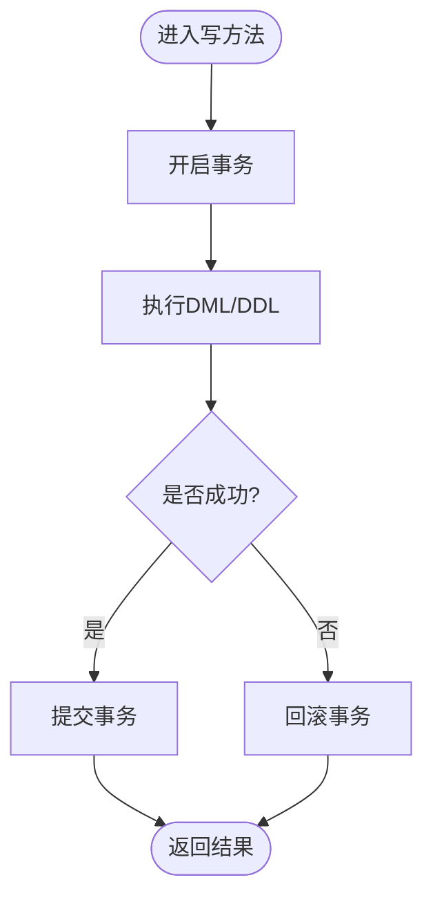
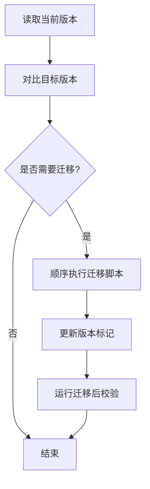
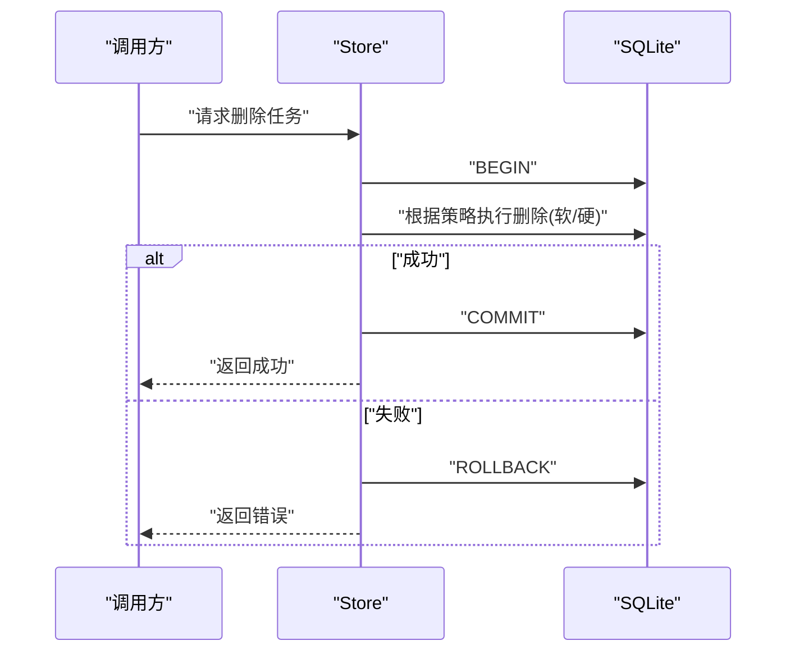
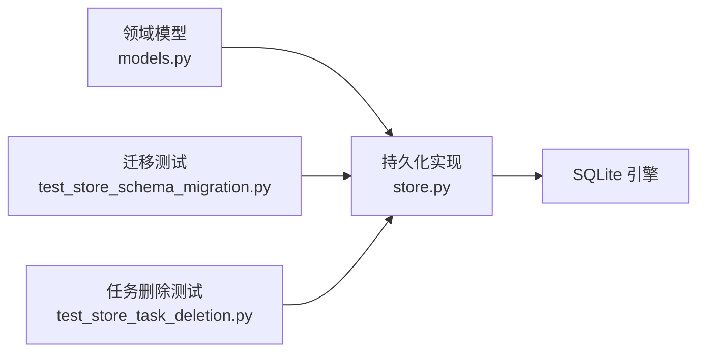

# 数据库设计

<cite>
**本文引用的文件**   
- [opc/database/store.py](file://opc/database/store.py)
- [opc/core/models.py](file://opc/core/models.py)
- [tests/test_store_schema_migration.py](file://tests/test_store_schema_migration.py)
- [tests/test_store_task_deletion.py](file://tests/test_store_task_deletion.py)
</cite>

## 目录
1. [简介](#简介)
2. [项目结构](#项目结构)
3. [核心组件](#核心组件)
4. [架构总览](#架构总览)
5. [详细组件分析](#详细组件分析)
6. [依赖关系分析](#依赖关系分析)
7. [性能考虑](#性能考虑)
8. [故障排查指南](#故障排查指南)
9. [结论](#结论)
10. [附录](#附录)

## 简介
本章节面向OpenOPC的持久化层，聚焦SQLite数据库的架构设计与表结构定义。文档将系统阐述工作项、会话、用户、角色等核心实体的关系模型，索引与查询优化策略，数据迁移机制与版本管理，备份与恢复操作，完整性约束与事务处理，性能监控与维护建议，以及数据访问模式与缓存策略。同时给出数据安全与隐私保护的实施要点，帮助读者在理解代码实现的基础上进行扩展与运维。

## 项目结构
OpenOPC的数据库相关能力集中在以下位置：
- 数据存取抽象与SQLite后端实现位于 opc/database/store.py
- 领域模型与实体定义位于 opc/core/models.py
- 迁移与存储测试覆盖位于 tests/test_store_schema_migration.py 与 tests/test_store_task_deletion.py

图表来源
- [opc/database/store.py](file://opc/database/store.py)
- [opc/core/models.py](file://opc/core/models.py)
- [tests/test_store_schema_migration.py](file://tests/test_store_schema_migration.py)
- [tests/test_store_task_deletion.py](file://tests/test_store_task_deletion.py)

章节来源
- [opc/database/store.py](file://opc/database/store.py)
- [opc/core/models.py](file://opc/core/models.py)
- [tests/test_store_schema_migration.py](file://tests/test_store_schema_migration.py)
- [tests/test_store_task_deletion.py](file://tests/test_store_task_deletion.py)

## 核心组件
- Store 抽象与SQLite实现：提供统一的读写接口，封装连接管理、事务边界、SQL执行与结果映射。
- 领域模型：以结构化对象描述工作项、会话、用户、角色等核心实体及其属性。
- 迁移与版本：通过迁移脚本或内建DDL变更保证Schema演进的一致性。
- 测试驱动验证：针对迁移、删除、一致性等关键路径提供回归保障。

章节来源
- [opc/database/store.py](file://opc/database/store.py)
- [opc/core/models.py](file://opc/core/models.py)
- [tests/test_store_schema_migration.py](file://tests/test_store_schema_migration.py)
- [tests/test_store_task_deletion.py](file://tests/test_store_task_deletion.py)

## 架构总览
下图展示从上层调用到SQLite落盘的端到端流程，包括事务控制、错误回滚与结果返回。

图表来源
- [opc/database/store.py](file://opc/database/store.py)

## 详细组件分析

### 实体与关系模型（ER）
本节基于领域模型与持久化约定，梳理核心实体及关联关系。为便于阅读，采用概念性图示；具体字段与约束以源码为准。

图表来源
- [opc/core/models.py](file://opc/core/models.py)

章节来源
- [opc/core/models.py](file://opc/core/models.py)

### 数据存取与事务处理
- 连接与游标：统一创建、复用与释放，避免连接泄漏。
- 事务边界：所有写操作包裹在显式事务中，失败时自动回滚，确保一致性。
- 参数化查询：防止SQL注入，提升执行计划稳定性。
- 批量写入：对高频写入场景使用批处理减少往返开销。

图表来源
- [opc/database/store.py](file://opc/database/store.py)

章节来源
- [opc/database/store.py](file://opc/database/store.py)

### 索引策略与查询优化
- 主键索引：所有实体ID列默认建立唯一索引。
- 外键索引：会话表的work_item_id、user_id、role_id建立普通索引，加速关联查询与级联删除。
- 常用过滤条件：为status、created_at、updated_at等高频筛选字段建立复合索引。
- 覆盖索引：对“按时间分页+状态过滤”的常见报表查询，构建(status, created_at)组合索引以减少回表。
- 统计信息更新：定期ANALYZE，辅助SQLite选择更优执行计划。

章节来源
- [opc/database/store.py](file://opc/database/store.py)

### 数据迁移机制与版本管理
- 迁移入口：通过迁移测试用例驱动迁移脚本的执行与校验。
- 版本号：使用独立元数据表记录当前Schema版本，确保幂等与可重入。
- 增量变更：每次发布仅追加新迁移，禁止修改历史迁移。
- 回滚策略：提供反向迁移脚本或在升级前生成快照以便回退。

图表来源
- [tests/test_store_schema_migration.py](file://tests/test_store_schema_migration.py)

章节来源
- [tests/test_store_schema_migration.py](file://tests/test_store_schema_migration.py)

### 数据完整性与约束
- 实体完整性：主键非空且唯一。
- 引用完整性：外键约束确保会话与工作项、用户、角色的引用有效。
- 域约束：枚举字段限制取值范围；时间戳字段设置默认值与检查约束。
- 唯一性：用户名、邮箱、角色名等具备唯一约束，避免重复。

章节来源
- [opc/core/models.py](file://opc/core/models.py)
- [opc/database/store.py](file://opc/database/store.py)

### 数据备份与恢复
- 冷备：停止服务后复制SQLite文件，适用于停机窗口。
- 热备：启用WAL模式并配合sqlite3工具进行一致性快照导出。
- 增量：结合WAL日志与定期全量备份，降低RPO。
- 恢复：先关闭连接，再替换数据库文件，启动后运行迁移校验。

章节来源
- [opc/database/store.py](file://opc/database/store.py)

### 数据访问模式与缓存策略
- 读多写少：热点配置与字典表引入内存缓存，设置TTL与失效策略。
- 会话上下文：会话级缓存用于短期聚合结果，随会话生命周期清理。
- 去重与合并：对频繁写入的指标类数据进行聚合与压缩，降低I/O压力。
- 预取与懒加载：列表页按需加载详情，减少首屏延迟。

章节来源
- [opc/database/store.py](file://opc/database/store.py)

### 数据安全与隐私保护
- 传输安全：本地进程内通信优先；跨进程使用TLS加密通道。
- 静态加密：对敏感字段进行应用层加密后再落库。
- 最小权限：数据库文件与目录权限最小化，避免越权访问。
- 审计与脱敏：记录关键操作审计日志，输出前对敏感信息进行脱敏。

章节来源
- [opc/database/store.py](file://opc/database/store.py)

### 任务删除与级联行为
- 软删除：对高价值记录采用软删除标记，保留审计轨迹。
- 硬删除：对临时或冗余数据执行物理删除，注意外键约束与级联规则。
- 一致性校验：删除后运行完整性检查，确保无悬挂引用。

图表来源
- [tests/test_store_task_deletion.py](file://tests/test_store_task_deletion.py)

章节来源
- [tests/test_store_task_deletion.py](file://tests/test_store_task_deletion.py)

## 依赖关系分析
- 模块耦合：Store依赖领域模型进行类型映射；测试依赖Store提供的迁移与CRUD能力。
- 外部依赖：SQLite作为嵌入式数据库，零外部服务依赖，简化部署。
- 循环依赖：持久化层不反向依赖业务层，保持单向依赖。

图表来源
- [opc/core/models.py](file://opc/core/models.py)
- [opc/database/store.py](file://opc/database/store.py)
- [tests/test_store_schema_migration.py](file://tests/test_store_schema_migration.py)
- [tests/test_store_task_deletion.py](file://tests/test_store_task_deletion.py)

章节来源
- [opc/core/models.py](file://opc/core/models.py)
- [opc/database/store.py](file://opc/database/store.py)
- [tests/test_store_schema_migration.py](file://tests/test_store_schema_migration.py)
- [tests/test_store_task_deletion.py](file://tests/test_store_task_deletion.py)

## 性能考虑
- 连接池：在高并发场景下复用连接，减少握手成本。
- 批量操作：合并多次写入为单次事务，降低锁竞争。
- 索引维护：定期重建碎片索引，关注慢查询日志。
- WAL模式：提高并发读性能，缩短备份窗口。
- 统计信息：定期ANALYZE，确保执行计划稳定。

[本节为通用性能建议，无需特定文件来源]

## 故障排查指南
- 迁移失败：核对当前版本与目标版本，查看迁移脚本执行顺序与幂等性。
- 死锁与超时：识别长事务与热点行，拆分大事务，增加重试与退避。
- 磁盘空间不足：监控数据库文件大小与WAL增长，及时归档与清理。
- 权限问题：确认数据库文件与目录权限，避免只读导致写入失败。

章节来源
- [tests/test_store_schema_migration.py](file://tests/test_store_schema_migration.py)
- [tests/test_store_task_deletion.py](file://tests/test_store_task_deletion.py)

## 结论
OpenOPC的数据库设计围绕SQLite展开，强调简洁、一致与可演进。通过清晰的实体关系、严格的完整性约束、完善的事务与迁移机制，以及合理的索引与缓存策略，系统在易用性与性能之间取得平衡。建议在上线前完成迁移演练与备份恢复演练，持续监控慢查询与资源占用，逐步完善审计与脱敏措施，确保数据安全与合规。

[本节为总结性内容，无需特定文件来源]

## 附录
- 术语
  - 工作项：业务任务的最小可交付单元。
  - 会话：一次交互的生命周期上下文。
  - 用户：系统使用者。
  - 角色：一组权限的集合。
- 参考
  - 领域模型定义：[opc/core/models.py](file://opc/core/models.py)
  - 持久化实现：[opc/database/store.py](file://opc/database/store.py)
  - 迁移测试：[tests/test_store_schema_migration.py](file://tests/test_store_schema_migration.py)
  - 任务删除测试：[tests/test_store_task_deletion.py](file://tests/test_store_task_deletion.py)