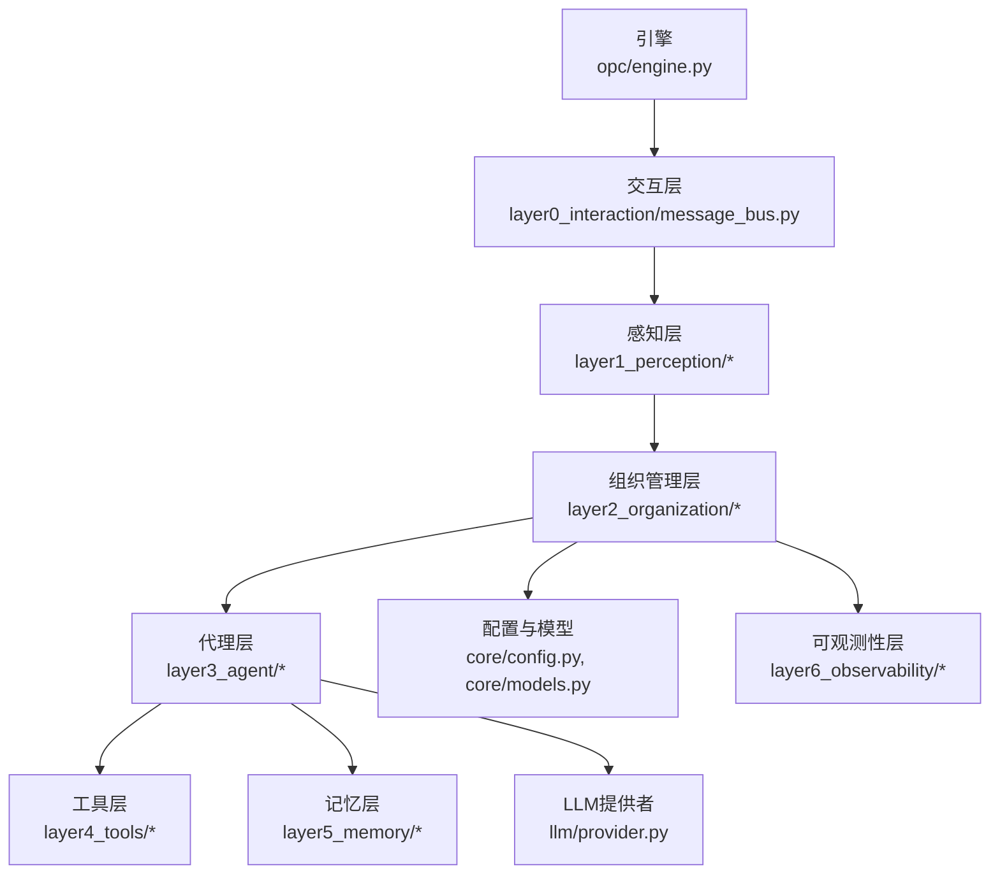
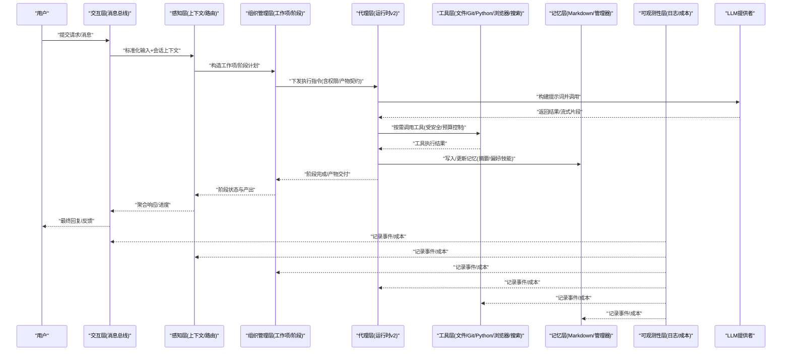
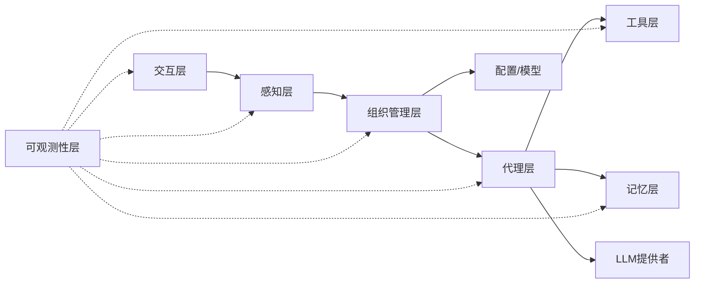

# 分层架构详解

<cite>
**本文引用的文件**   
- [engine.py](file://opc/engine.py)
- [layer0_interaction/message_bus.py](file://opc/layer0_interaction/message_bus.py)
- [layer1_perception/context_assembler.py](file://opc/layer1_perception/context_assembler.py)
- [layer1_perception/context_loader.py](file://opc/layer1_perception/context_loader.py)
- [layer1_perception/task_router.py](file://opc/layer1_perception/task_router.py)
- [layer2_organization/org_engine.py](file://opc/layer2_organization/org_engine.py)
- [layer2_organization/work_item_runtime.py](file://opc/layer2_organization/work_item_runtime.py)
- [layer2_organization/gate_harness.py](file://opc/layer2_organization/gate_harness.py)
- [layer2_organization/output_contract.py](file://opc/layer2_organization/output_contract.py)
- [layer3_agent/native_agent.py](file://opc/layer3_agent/native_agent.py)
- [layer3_agent/runtime_v2/runtime.py](file://opc/layer3_agent/runtime_v2/runtime.py)
- [layer3_agent/prompt_harness/builder.py](file://opc/layer3_agent/prompt_harness/builder.py)
- [layer4_tools/agent_runtime.py](file://opc/layer4_tools/agent_runtime.py)
- [layer4_tools/file_ops.py](file://opc/layer4_tools/file_ops.py)
- [layer4_tools/git_ops.py](file://opc/layer4_tools/git_ops.py)
- [layer4_tools/python_exec.py](file://opc/layer4_tools/python_exec.py)
- [layer4_tools/browser.py](file://opc/layer4_tools/browser.py)
- [layer4_tools/web_search.py](file://opc/layer4_tools/web_search.py)
- [layer5_memory/markdown_memory.py](file://opc/layer5_memory/markdown_memory.py)
- [layer5_memory/memory_manager.py](file://opc/layer5_memory/memory_manager.py)
- [layer6_observability/opc_logger.py](file://opc/layer6_observability/opc_logger.py)
- [layer6_observability/cost_tracker.py](file://opc/layer6_observability/cost_tracker.py)
- [core/config.py](file://opc/core/config.py)
- [core/models.py](file://opc/core/models.py)
- [llm/provider.py](file://opc/llm/provider.py)
</cite>

## 目录
1. [简介](#简介)
2. [项目结构](#项目结构)
3. [核心组件](#核心组件)
4. [架构总览](#架构总览)
5. [详细组件分析](#详细组件分析)
6. [依赖分析](#依赖分析)
7. [性能考虑](#性能考虑)
8. [故障排查指南](#故障排查指南)
9. [结论](#结论)
10. [附录](#附录)

## 简介
本文件面向OpenOPC的分层架构，围绕七层设计进行系统化说明：交互层（layer0）、感知层（layer1）、组织管理层（layer2）、代理层（layer3）、工具层（layer4）、记忆层（layer5）与可观测性层（layer6）。文档聚焦每层的职责边界、接口契约、输入输出规范、数据转换过程、消息传递机制、错误处理策略与性能优化要点，并通过架构图与时序图展示数据在各层间的流转。

## 项目结构
OpenOPC采用按层次划分的模块化组织方式，核心入口位于顶层引擎模块，各层以独立包呈现，便于扩展与维护。

图表来源
- [engine.py:1-200](file://opc/engine.py#L1-L200)
- [message_bus.py:1-200](file://opc/layer0_interaction/message_bus.py#L1-L200)
- [context_assembler.py:1-200](file://opc/layer1_perception/context_assembler.py#L1-L200)
- [org_engine.py:1-200](file://opc/layer2_organization/org_engine.py#L1-L200)
- [native_agent.py:1-200](file://opc/layer3_agent/native_agent.py#L1-L200)
- [runtime.py:1-200](file://opc/layer3_agent/runtime_v2/runtime.py#L1-L200)
- [markdown_memory.py:1-200](file://opc/layer5_memory/markdown_memory.py#L1-L200)
- [opc_logger.py:1-200](file://opc/layer6_observability/opc_logger.py#L1-L200)

章节来源
- [engine.py:1-200](file://opc/engine.py#L1-L200)

## 核心组件
- 交互层（layer0）：负责外部通道接入、会话生命周期与消息总线编排，统一对外协议与路由。
- 感知层（layer1）：负责上下文组装、加载与任务路由，将原始输入转化为结构化上下文。
- 组织管理层（layer2）：负责工作项生命周期、阶段状态机、审批与协作策略、产出契约校验等。
- 代理层（layer3）：封装原生代理与运行时v2，管理提示词构建、子代理、权限与执行环境。
- 工具层（layer4）：提供文件系统、Git、Python执行、浏览器、搜索等能力，受安全与预算约束。
- 记忆层（layer5）：持久化与压缩历史、偏好与技能库，支撑上下文窗口与长期记忆。
- 可观测性层（layer6）：日志、成本追踪与指标上报，贯穿全链路。

章节来源
- [message_bus.py:1-200](file://opc/layer0_interaction/message_bus.py#L1-L200)
- [context_assembler.py:1-200](file://opc/layer1_perception/context_assembler.py#L1-L200)
- [org_engine.py:1-200](file://opc/layer2_organization/org_engine.py#L1-L200)
- [native_agent.py:1-200](file://opc/layer3_agent/native_agent.py#L1-L200)
- [runtime.py:1-200](file://opc/layer3_agent/runtime_v2/runtime.py#L1-L200)
- [markdown_memory.py:1-200](file://opc/layer5_memory/markdown_memory.py#L1-L200)
- [opc_logger.py:1-200](file://opc/layer6_observability/opc_logger.py#L1-L200)

## 架构总览
下图展示了从用户输入到工具执行与记忆更新的端到端流程，以及可观测性层的贯穿式采集。

图表来源
- [message_bus.py:1-200](file://opc/layer0_interaction/message_bus.py#L1-L200)
- [context_assembler.py:1-200](file://opc/layer1_perception/context_assembler.py#L1-L200)
- [org_engine.py:1-200](file://opc/layer2_organization/org_engine.py#L1-L200)
- [native_agent.py:1-200](file://opc/layer3_agent/native_agent.py#L1-L200)
- [runtime.py:1-200](file://opc/layer3_agent/runtime_v2/runtime.py#L1-L200)
- [markdown_memory.py:1-200](file://opc/layer5_memory/markdown_memory.py#L1-L200)
- [opc_logger.py:1-200](file://opc/layer6_observability/opc_logger.py#L1-L200)
- [provider.py:1-200](file://opc/llm/provider.py#L1-L200)

## 详细组件分析

### 交互层（layer0）：消息总线与会话编排
- 职责边界
  - 接收外部通道消息，统一会话标识与路由。
  - 维护会话生命周期，协调感知层与工作项的创建与推进。
- 输入输出契约
  - 输入：标准化后的消息对象（包含会话ID、用户ID、内容、附件元信息等）。
  - 输出：对上层的事件/命令（如“创建/推进工作项”），以及对下层的上下文载荷。
- 关键实现要点
  - 消息去重与幂等键生成。
  - 基于会话的串行队列，避免并发冲突。
  - 与可观测性层集成，记录进入/退出点与耗时。
- 错误处理
  - 捕获通道异常，转换为标准错误事件，触发重试或降级策略。
- 性能优化
  - 批量合并短消息，减少上下文组装开销。
  - 使用轻量级序列化格式传输大附件引用。

章节来源
- [message_bus.py:1-200](file://opc/layer0_interaction/message_bus.py#L1-L200)

### 感知层（layer1）：上下文组装、加载与任务路由
- 职责边界
  - 将原始输入与系统/用户/项目上下文融合为结构化上下文视图。
  - 根据意图与规则将任务路由至合适的阶段或角色。
- 输入输出契约
  - 输入：来自交互层的标准化消息与会话快照。
  - 输出：上下文视图对象、任务路由决策（目标阶段/角色/参数）。
- 关键实现要点
  - 上下文加载器按优先级拉取多源信息（配置、历史、元数据）。
  - 上下文组装器进行裁剪与摘要，控制上下文窗口大小。
  - 任务路由器依据策略选择执行路径（单步/多步/协作）。
- 错误处理
  - 缺失上下文时回退到默认模板；路由失败时退回人工确认。
- 性能优化
  - 增量更新上下文视图，避免全量重建。
  - 缓存热点上下文片段，降低重复计算。

章节来源
- [context_loader.py:1-200](file://opc/layer1_perception/context_loader.py#L1-L200)
- [context_assembler.py:1-200](file://opc/layer1_perception/context_assembler.py#L1-L200)
- [task_router.py:1-200](file://opc/layer1_perception/task_router.py#L1-L200)

### 组织管理层（layer2）：工作项、阶段与协作治理
- 职责边界
  - 定义工作项生命周期、阶段状态机与转换钩子。
  - 管理协作策略、审批流、产出契约与所有权。
- 输入输出契约
  - 输入：来自感知层的任务路由结果与上下文视图。
  - 输出：阶段计划、工作项实例、审批/协作事件、产出物校验报告。
- 关键实现要点
  - 工作项运行时维护状态与依赖关系，确保转换一致性。
  - 门控夹具在阶段切换前执行前置检查（资源、权限、契约）。
  - 产出契约定义产物结构与质量门槛，驱动下游消费。
- 错误处理
  - 阶段转换失败时保留不变式，支持回滚与补偿动作。
  - 审批拒绝时触发协商或升级流程。
- 性能优化
  - 并行评估无依赖阶段；批处理小变更以减少锁竞争。

章节来源
- [org_engine.py:1-200](file://opc/layer2_organization/org_engine.py#L1-L200)
- [work_item_runtime.py:1-200](file://opc/layer2_organization/work_item_runtime.py#L1-L200)
- [gate_harness.py:1-200](file://opc/layer2_organization/gate_harness.py#L1-L200)
- [output_contract.py:1-200](file://opc/layer2_organization/output_contract.py#L1-L200)

### 代理层（layer3）：原生代理与运行时v2
- 职责边界
  - 封装原生代理能力，提供统一的执行接口。
  - 管理提示词构建、子代理调度、权限控制与流式执行。
- 输入输出契约
  - 输入：来自组织管理层的阶段指令与上下文视图。
  - 输出：阶段产物、中间进度、工具调用请求、副作用事件。
- 关键实现要点
  - 运行时v2提供沙箱执行环境、工具钩子与子代理编排。
  - 提示词构建器组合系统提示、上下文片段与工具描述。
  - 权限模型限制敏感操作，结合预算与配额控制。
- 错误处理
  - 工具调用失败时自动重试/降级；超限熔断。
  - 流式中断后恢复执行位点，保证幂等。
- 性能优化
  - 流式输出减少首字节延迟。
  - 工具调用批量化与结果缓存。

章节来源
- [native_agent.py:1-200](file://opc/layer3_agent/native_agent.py#L1-L200)
- [runtime.py:1-200](file://opc/layer3_agent/runtime_v2/runtime.py#L1-L200)
- [builder.py:1-200](file://opc/layer3_agent/prompt_harness/builder.py#L1-L200)

### 工具层（layer4）：受控执行与环境能力
- 职责边界
  - 提供文件、Git、Python执行、浏览器、搜索等工具。
  - 在安全策略与预算约束下执行，返回标准化结果。
- 输入输出契约
  - 输入：工具名、参数、执行上下文（工作区、权限、配额）。
  - 输出：结构化结果（成功/失败、产物路径、日志、度量）。
- 关键实现要点
  - 文件与Git操作遵循只读优先与最小权限原则。
  - Python执行在隔离环境中运行，限制网络与系统调用。
  - 浏览器与搜索工具具备超时与速率限制。
- 错误处理
  - 统一错误码与诊断信息，支持重试与回滚。
  - 越权访问直接拒绝并记录审计事件。
- 性能优化
  - 连接池与复用（Git/浏览器）。
  - 结果缓存与增量更新。

章节来源
- [agent_runtime.py:1-200](file://opc/layer4_tools/agent_runtime.py#L1-L200)
- [file_ops.py:1-200](file://opc/layer4_tools/file_ops.py#L1-L200)
- [git_ops.py:1-200](file://opc/layer4_tools/git_ops.py#L1-L200)
- [python_exec.py:1-200](file://opc/layer4_tools/python_exec.py#L1-L200)
- [browser.py:1-200](file://opc/layer4_tools/browser.py#L1-L200)
- [web_search.py:1-200](file://opc/layer4_tools/web_search.py#L1-L200)

### 记忆层（layer5）：持久化与上下文压缩
- 职责边界
  - 维护Markdown记忆、偏好、技能库与历史压缩策略。
  - 为上层提供稳定、可检索的记忆接口。
- 输入输出契约
  - 输入：需要持久化的片段、偏好更新、技能导入。
  - 输出：检索结果、摘要、版本快照。
- 关键实现要点
  - 记忆管理器协调读写与压缩，保障一致性。
  - Markdown记忆支持结构化索引与快速定位。
- 错误处理
  - 写失败时落盘重试与损坏修复。
  - 读取不一致时触发重建。
- 性能优化
  - 分片存储与懒加载。
  - 增量压缩与冷热分层。

章节来源
- [memory_manager.py:1-200](file://opc/layer5_memory/memory_manager.py#L1-L200)
- [markdown_memory.py:1-200](file://opc/layer5_memory/markdown_memory.py#L1-L200)

### 可观测性层（layer6）：日志、成本与指标
- 职责边界
  - 提供统一日志、成本追踪与指标上报能力。
  - 贯穿所有层，记录关键事件与资源消耗。
- 输入输出契约
  - 输入：事件、度量、上下文标签。
  - 输出：结构化日志、成本报表、告警信号。
- 关键实现要点
  - 低开销采样与异步落盘。
  - 成本追踪与预算阈值联动。
- 错误处理
  - 记录失败但不阻塞主流程。
- 性能优化
  - 批量写入与缓冲。
  - 指标降采样与聚合。

章节来源
- [opc_logger.py:1-200](file://opc/layer6_observability/opc_logger.py#L1-L200)
- [cost_tracker.py:1-200](file://opc/layer6_observability/cost_tracker.py#L1-L200)

## 依赖分析
各层之间通过明确定义的接口与事件进行解耦，整体依赖方向自顶向下，可观测性层横向贯穿。

图表来源
- [engine.py:1-200](file://opc/engine.py#L1-L200)
- [message_bus.py:1-200](file://opc/layer0_interaction/message_bus.py#L1-L200)
- [context_assembler.py:1-200](file://opc/layer1_perception/context_assembler.py#L1-L200)
- [org_engine.py:1-200](file://opc/layer2_organization/org_engine.py#L1-L200)
- [native_agent.py:1-200](file://opc/layer3_agent/native_agent.py#L1-L200)
- [runtime.py:1-200](file://opc/layer3_agent/runtime_v2/runtime.py#L1-L200)
- [markdown_memory.py:1-200](file://opc/layer5_memory/markdown_memory.py#L1-L200)
- [opc_logger.py:1-200](file://opc/layer6_observability/opc_logger.py#L1-L200)
- [config.py:1-200](file://opc/core/config.py#L1-L200)
- [models.py:1-200](file://opc/core/models.py#L1-L200)
- [provider.py:1-200](file://opc/llm/provider.py#L1-L200)

章节来源
- [engine.py:1-200](file://opc/engine.py#L1-L200)
- [config.py:1-200](file://opc/core/config.py#L1-L200)
- [models.py:1-200](file://opc/core/models.py#L1-L200)

## 性能考虑
- 上下文窗口控制：感知层裁剪与摘要，避免超出LLM上下文上限。
- 流式执行：代理层流式返回，缩短首字节延迟，提升用户体验。
- 工具复用：连接池、缓存与增量更新，降低I/O与网络开销。
- 并发与隔离：组织管理层并行无依赖阶段，代理层沙箱隔离，避免相互干扰。
- 可观测性采样：高吞吐场景下采用采样与聚合，降低监控开销。

## 故障排查指南
- 常见问题定位
  - 上下文缺失或过期：检查感知层加载顺序与缓存失效策略。
  - 阶段转换失败：查看组织管理层门控夹具的前置条件与不变式断言。
  - 工具执行失败：核对权限、配额与超时设置，关注工具层错误码。
  - 记忆写入失败：验证记忆层一致性、损坏修复与重试逻辑。
  - 成本超支：审查可观测性层成本追踪与预算阈值联动。
- 建议的诊断步骤
  - 启用详细日志与成本追踪，定位瓶颈与异常点。
  - 复现最小用例，逐步关闭功能以隔离问题。
  - 检查工作项状态机与阶段产物契约是否满足。

章节来源
- [gate_harness.py:1-200](file://opc/layer2_organization/gate_harness.py#L1-L200)
- [output_contract.py:1-200](file://opc/layer2_organization/output_contract.py#L1-L200)
- [agent_runtime.py:1-200](file://opc/layer4_tools/agent_runtime.py#L1-L200)
- [memory_manager.py:1-200](file://opc/layer5_memory/memory_manager.py#L1-L200)
- [opc_logger.py:1-200](file://opc/layer6_observability/opc_logger.py#L1-L200)
- [cost_tracker.py:1-200](file://opc/layer6_observability/cost_tracker.py#L1-L200)

## 结论
OpenOPC的七层架构通过清晰的职责划分与严格的接口契约，实现了高内聚、低耦合的可扩展系统。交互层统一接入，感知层负责上下文与路由，组织管理层保障流程与契约，代理层提供灵活执行，工具层提供受控能力，记忆层支撑长期知识，可观测性层贯穿全链路。该设计兼顾了可靠性、性能与可维护性，适合复杂企业级场景。

## 附录
- 术语表
  - 工作项：由组织管理层管理的任务单元，具有明确的生命周期与阶段。
  - 阶段：工作项内的执行阶段，包含前置条件、后置动作与产物契约。
  - 产物：阶段执行产生的结构化输出，需符合契约定义。
  - 上下文视图：由感知层生成的结构化上下文，供代理层与工具层消费。
- 参考实现路径
  - 交互层消息总线：[message_bus.py](file://opc/layer0_interaction/message_bus.py)
  - 感知层上下文与路由：[context_assembler.py](file://opc/layer1_perception/context_assembler.py), [context_loader.py](file://opc/layer1_perception/context_loader.py), [task_router.py](file://opc/layer1_perception/task_router.py)
  - 组织管理层工作项与阶段：[org_engine.py](file://opc/layer2_organization/org_engine.py), [work_item_runtime.py](file://opc/layer2_organization/work_item_runtime.py), [gate_harness.py](file://opc/layer2_organization/gate_harness.py), [output_contract.py](file://opc/layer2_organization/output_contract.py)
  - 代理层运行时与提示词：[native_agent.py](file://opc/layer3_agent/native_agent.py), [runtime.py](file://opc/layer3_agent/runtime_v2/runtime.py), [builder.py](file://opc/layer3_agent/prompt_harness/builder.py)
  - 工具层能力：[agent_runtime.py](file://opc/layer4_tools/agent_runtime.py), [file_ops.py](file://opc/layer4_tools/file_ops.py), [git_ops.py](file://opc/layer4_tools/git_ops.py), [python_exec.py](file://opc/layer4_tools/python_exec.py), [browser.py](file://opc/layer4_tools/browser.py), [web_search.py](file://opc/layer4_tools/web_search.py)
  - 记忆层：[memory_manager.py](file://opc/layer5_memory/memory_manager.py), [markdown_memory.py](file://opc/layer5_memory/markdown_memory.py)
  - 可观测性层：[opc_logger.py](file://opc/layer6_observability/opc_logger.py), [cost_tracker.py](file://opc/layer6_observability/cost_tracker.py)
  - 配置与模型：[config.py](file://opc/core/config.py), [models.py](file://opc/core/models.py)
  - LLM提供者：[provider.py](file://opc/llm/provider.py)