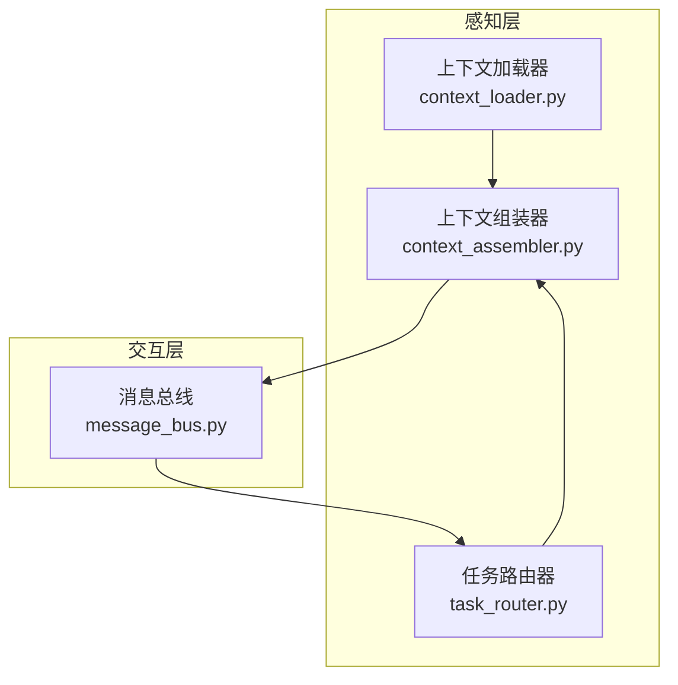
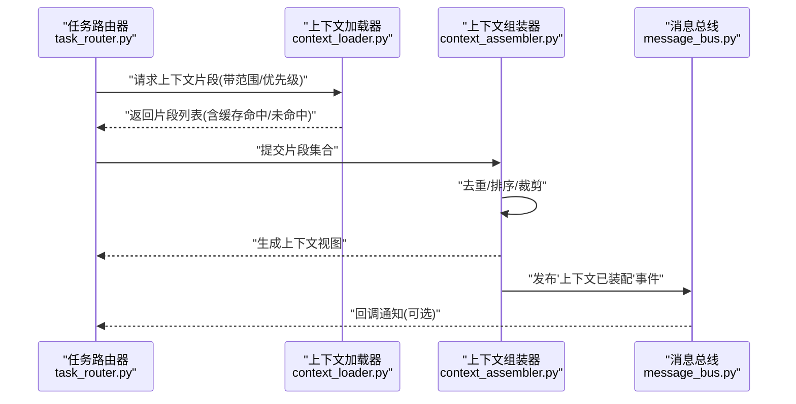
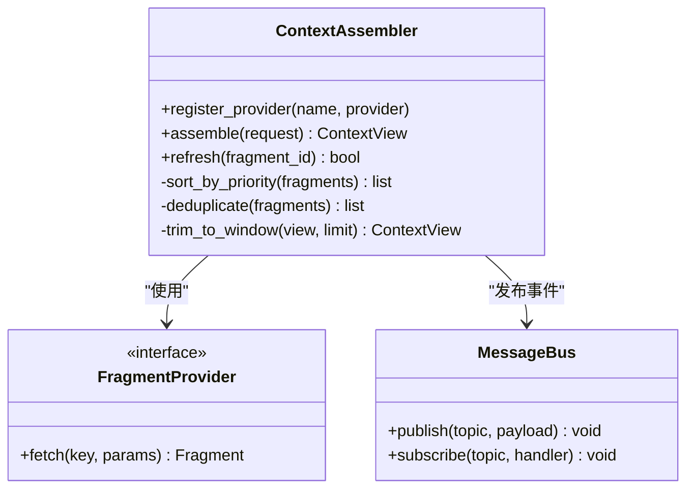
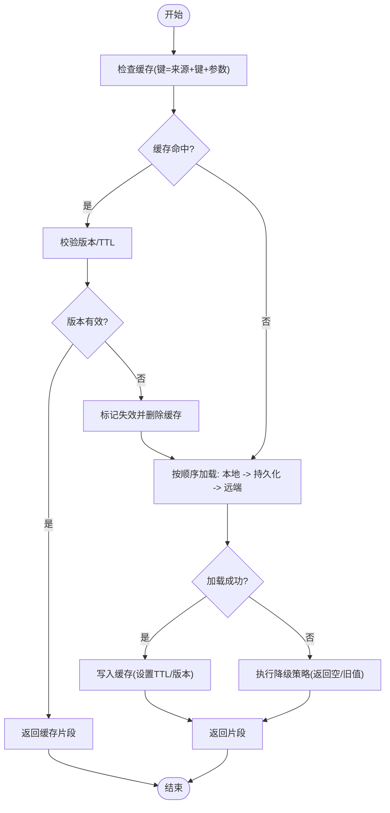
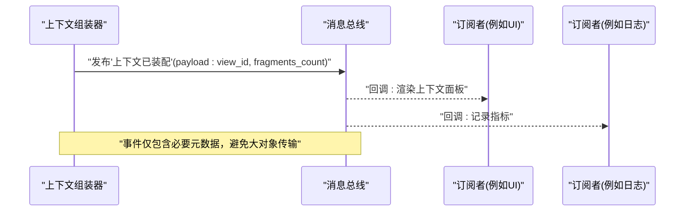
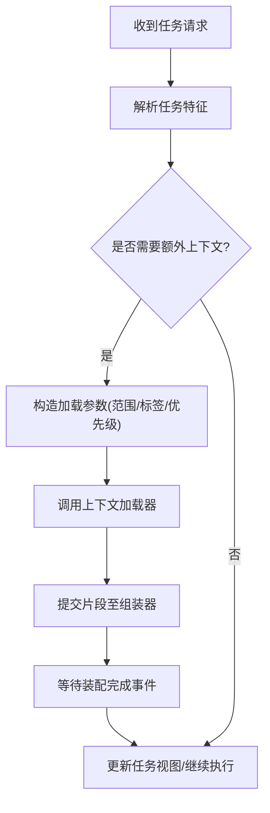
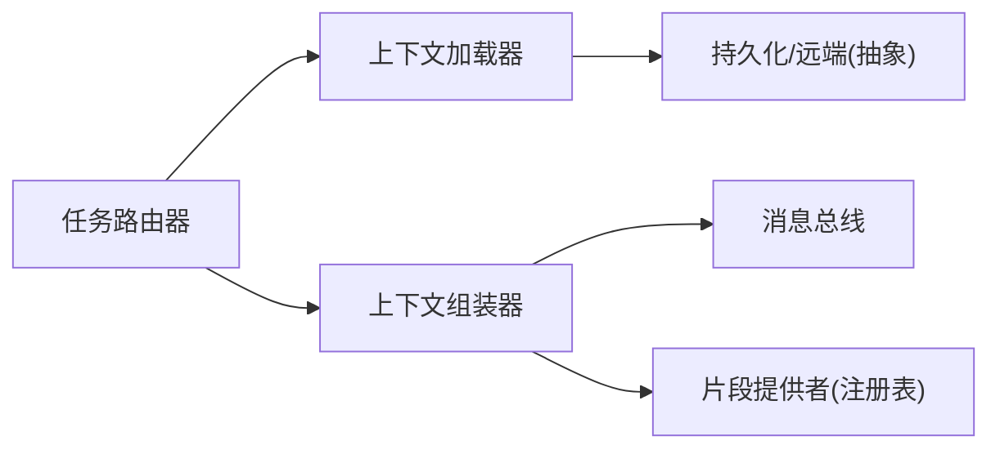

# 上下文管理

<cite>
**本文引用的文件**   
- [context_assembler.py](file://opc/layer1_perception/context_assembler.py)
- [context_loader.py](file://opc/layer1_perception/context_loader.py)
- [message_bus.py](file://opc/layer0_interaction/message_bus.py)
- [task_router.py](file://opc/layer1_perception/task_router.py)
- [test_context_assembler_view.py](file://tests/test_context_assembler_view.py)
</cite>

## 目录
1. [简介](#简介)
2. [项目结构](#项目结构)
3. [核心组件](#核心组件)
4. [架构总览](#架构总览)
5. [详细组件分析](#详细组件分析)
6. [依赖分析](#依赖分析)
7. [性能考虑](#性能考虑)
8. [故障排查指南](#故障排查指南)
9. [结论](#结论)
10. [附录：使用示例与最佳实践](#附录使用示例与最佳实践)

## 简介
本技术文档聚焦于OpenOPC的上下文管理系统，围绕以下目标展开：
- 深入解释上下文组装器(ContextAssembler)的工作原理，包括多源信息收集与整合、优先级排序与动态加载机制。
- 详细说明上下文加载器(ContextLoader)的数据获取策略、缓存机制与失效处理。
- 描述消息总线(MessageBus)在上下文传递中的作用，涵盖事件驱动架构、消息路由与订阅模式。
- 提供正确使用上下文API的实践建议，包含错误处理与性能优化要点。

## 项目结构
与上下文管理相关的核心代码位于感知层与交互层：
- 感知层(layer1_perception)
  - context_assembler.py：负责将来自不同来源的上下文片段进行聚合、去重、排序与裁剪，形成最终可消费的上下文视图。
  - context_loader.py：负责从配置、运行时状态、外部存储或工具中按需加载上下文数据，并提供缓存与失效能力。
  - task_router.py：基于任务类型与上下文特征进行路由决策，影响上下文装配的范围与粒度。
- 交互层(layer0_interaction)
  - message_bus.py：实现轻量级事件总线，用于跨模块传递上下文变更与装配结果，支持发布/订阅与按主题路由。

图表来源
- [context_assembler.py](file://opc/layer1_perception/context_assembler.py)
- [context_loader.py](file://opc/layer1_perception/context_loader.py)
- [task_router.py](file://opc/layer1_perception/task_router.py)
- [message_bus.py](file://opc/layer0_interaction/message_bus.py)

章节来源
- [context_assembler.py](file://opc/layer1_perception/context_assembler.py)
- [context_loader.py](file://opc/layer1_perception/context_loader.py)
- [task_router.py](file://opc/layer1_perception/task_router.py)
- [message_bus.py](file://opc/layer0_interaction/message_bus.py)

## 核心组件
- 上下文组装器(ContextAssembler)
  - 职责：接收多个上下文片段（如会话历史、工作项元数据、组织配置、用户输入等），依据优先级策略合并、去重、裁剪，输出稳定的上下文视图供上层消费。
  - 关键特性：多源聚合、优先级排序、动态加载、增量更新、可插拔片段提供者。
- 上下文加载器(ContextLoader)
  - 职责：根据请求上下文与策略，从多种后端（内存、磁盘、远程服务）拉取所需数据；维护缓存并处理失效与回退。
  - 关键特性：按需加载、键控缓存、TTL/版本化失效、降级与重试。
- 消息总线(MessageBus)
  - 职责：以事件形式传播上下文相关信号（如“上下文已刷新”、“片段已变更”），解耦生产者与消费者，支持按主题路由与订阅过滤。
  - 关键特性：发布/订阅、主题路由、异步派发、幂等处理。

章节来源
- [context_assembler.py](file://opc/layer1_perception/context_assembler.py)
- [context_loader.py](file://opc/layer1_perception/context_loader.py)
- [message_bus.py](file://opc/layer0_interaction/message_bus.py)

## 架构总览
下图展示了上下文装配的整体流程：任务路由器决定需要哪些上下文范围，上下文加载器按需拉取数据并缓存，上下文组装器对多源片段进行聚合与排序，并通过消息总线广播装配结果与变更事件。

图表来源
- [task_router.py](file://opc/layer1_perception/task_router.py)
- [context_loader.py](file://opc/layer1_perception/context_loader.py)
- [context_assembler.py](file://opc/layer1_perception/context_assembler.py)
- [message_bus.py](file://opc/layer0_interaction/message_bus.py)

## 详细组件分析

### 上下文组装器(ContextAssembler)
- 工作原理
  - 多源收集：从任务路由器与上下文加载器处获得片段集合，每个片段携带来源标识、时间戳、权重与可见性约束。
  - 优先级排序：依据来源可信度、时效性与业务权重计算综合优先级，确保高价值信息优先保留。
  - 动态加载：支持懒加载与增量更新，当某片段失效或过期时触发重新装配。
  - 裁剪与压缩：在保持语义完整性的前提下，按上下文窗口限制进行裁剪，避免超限。
- 设计要点
  - 可插拔片段提供者：通过注册表扩展新的上下文来源。
  - 幂等装配：相同输入产生一致输出，便于缓存与测试。
  - 事件驱动：装配完成后发布事件，供UI或监控消费。

图表来源
- [context_assembler.py](file://opc/layer1_perception/context_assembler.py)
- [message_bus.py](file://opc/layer0_interaction/message_bus.py)

章节来源
- [context_assembler.py](file://opc/layer1_perception/context_assembler.py)

### 上下文加载器(ContextLoader)
- 数据获取策略
  - 分层读取：先查本地缓存，再读持久化存储，最后调用远端服务或工具接口。
  - 条件加载：根据请求中的范围、标签与优先级筛选最小必要数据集。
- 缓存机制
  - 键控缓存：以“来源+键+参数哈希”作为缓存键，避免重复IO。
  - TTL与版本化：结合时间戳与版本号双重校验，保证一致性。
- 失效处理
  - 主动失效：上游变更事件触发对应键失效。
  - 被动失效：读取失败或版本不匹配时自动回退与重试。
  - 降级策略：当远端不可用时，返回最近可用快照或空片段，由组装器做兜底。

图表来源
- [context_loader.py](file://opc/layer1_perception/context_loader.py)

章节来源
- [context_loader.py](file://opc/layer1_perception/context_loader.py)

### 消息总线(MessageBus)
- 作用与职责
  - 事件驱动：将上下文装配完成、片段失效、加载失败等事件统一发布，降低耦合。
  - 消息路由：基于主题与过滤器将事件定向到订阅者，支持细粒度订阅。
  - 订阅模式：允许UI、日志、监控等模块订阅上下文相关事件，实现实时反馈。
- 关键行为
  - 幂等分发：同一事件多次投递不会导致副作用。
  - 异步派发：非阻塞发送，提升整体吞吐。
  - 错误隔离：单个订阅者异常不影响其他订阅者与发布者。

图表来源
- [message_bus.py](file://opc/layer0_interaction/message_bus.py)
- [context_assembler.py](file://opc/layer1_perception/context_assembler.py)

章节来源
- [message_bus.py](file://opc/layer0_interaction/message_bus.py)

### 任务路由器(TaskRouter)与上下文的协作
- 路由决策：根据任务类型、阶段与用户意图，确定需要的上下文范围与优先级。
- 与组装器联动：将筛选后的片段集合交给组装器，同时监听装配完成事件以更新任务视图。
- 与加载器联动：为加载器提供精确的键与参数，减少不必要的数据拉取。

图表来源
- [task_router.py](file://opc/layer1_perception/task_router.py)
- [context_loader.py](file://opc/layer1_perception/context_loader.py)
- [context_assembler.py](file://opc/layer1_perception/context_assembler.py)

章节来源
- [task_router.py](file://opc/layer1_perception/task_router.py)

## 依赖分析
- 组件内聚与耦合
  - ContextLoader与ContextAssembler低耦合：前者只负责数据获取与缓存，后者专注聚合与排序。
  - MessageBus作为横切基础设施，被组装器与路由器共同依赖，避免直接引用。
- 外部依赖点
  - 持久化存储与远端服务：由加载器抽象封装，便于替换与模拟。
  - 插件式片段提供者：通过注册表扩展，增强系统可插拔性。
- 潜在循环依赖
  - 通过事件总线解耦，避免组装器与路由器之间的直接双向依赖。

图表来源
- [task_router.py](file://opc/layer1_perception/task_router.py)
- [context_loader.py](file://opc/layer1_perception/context_loader.py)
- [context_assembler.py](file://opc/layer1_perception/context_assembler.py)
- [message_bus.py](file://opc/layer0_interaction/message_bus.py)

章节来源
- [task_router.py](file://opc/layer1_perception/task_router.py)
- [context_loader.py](file://opc/layer1_perception/context_loader.py)
- [context_assembler.py](file://opc/layer1_perception/context_assembler.py)
- [message_bus.py](file://opc/layer0_interaction/message_bus.py)

## 性能考虑
- 缓存命中率优化
  - 合理设计缓存键，避免过细或过粗导致的命中率下降。
  - 使用TTL与版本化双保险，减少无效读取。
- 增量装配
  - 仅对失效片段触发重新装配，避免全量重建。
- 裁剪与压缩
  - 在组装阶段尽早裁剪无关片段，控制上下文大小，降低后续处理成本。
- 异步与批处理
  - 消息派发采用异步方式，批量事件合并以减少回调开销。
- 资源隔离
  - 为不同任务域分配独立的消息通道与缓存分区，避免相互干扰。

[本节为通用指导，无需特定文件来源]

## 故障排查指南
- 常见问题定位
  - 上下文缺失：检查加载器的缓存键与失效策略是否正确；确认远端服务可用性。
  - 上下文过期：查看版本/TTL是否合理；确认上游是否及时发布失效事件。
  - 装配缓慢：评估片段数量与裁剪阈值；检查是否存在重复或冗余片段。
  - 事件丢失：验证消息总线订阅关系与主题过滤；确认订阅者异常是否被隔离。
- 诊断手段
  - 启用加载器与组装器的关键路径日志，记录命中/未命中、失效与重试次数。
  - 使用测试用例覆盖典型场景，如缓存穿透、并发更新、远端超时等。

章节来源
- [test_context_assembler_view.py](file://tests/test_context_assembler_view.py)

## 结论
OpenOPC的上下文管理系统通过清晰的职责划分与事件驱动架构，实现了高效、可扩展的上下文装配与传递。上下文加载器负责数据获取与缓存，上下文组装器负责聚合与排序，消息总线则提供松耦合的事件通信。遵循本文的性能与排障建议，可在复杂场景中稳定地提供高质量上下文。

[本节为总结性内容，无需特定文件来源]

## 附录：使用示例与最佳实践
- 正确用法要点
  - 明确上下文范围：在任务路由器中尽量缩小加载范围，减少不必要的I/O。
  - 合理使用缓存键：将来源、键与关键参数组合成稳定且区分度高的键。
  - 订阅必要事件：仅在需要时订阅上下文装配完成或片段失效事件，避免过度回调。
  - 幂等处理：确保订阅者对重复事件具备幂等性，防止副作用。
- 错误处理建议
  - 加载失败：采用降级策略返回空片段或最近可用快照，并在日志中记录原因。
  - 装配异常：捕获并隔离异常，避免污染其他片段；必要时触发局部重装配。
  - 事件异常：订阅者内部try/catch包裹，确保单点失败不影响整体链路。
- 性能优化清单
  - 开启增量装配与裁剪，控制上下文体积。
  - 调整TTL与版本策略，平衡一致性与性能。
  - 批量订阅与合并回调，减少频繁UI更新。
  - 为热点片段建立预取与预热机制。

[本节为通用指导，无需特定文件来源]