# 工作项生命周期

<cite>
**本文引用的文件**   
- [work_item_runtime.py](file://opc/layer2_organization/work_item_runtime.py)
- [work_item_identity.py](file://opc/layer2_organization/work_item_identity.py)
- [work_item_transition.py](file://opc/layer2_organization/work_item_transition.py)
- [work_item_runtime_invariants.py](file://opc/layer2_organization/work_item_runtime_invariants.py)
- [org_work_item_planner.py](file://opc/layer2_organization/org_work_item_planner.py)
- [phase.py](file://opc/layer2_organization/phase.py)
- [phase_hooks.py](file://opc/layer2_organization/phase_hooks.py)
- [task_graph.py](file://opc/layer2_organization/task_graph.py)
- [company_runtime.py](file://opc/layer2_organization/company_runtime.py)
- [seat_executor.py](file://opc/layer2_organization/seat_executor.py)
- [active_task_runs.py](file://opc/core/active_task_runs.py)
- [store.py](file://opc/database/store.py)
- [test_work_item_runtime_invariants.py](file://tests/test_work_item_runtime_invariants.py)
- [test_work_item_transition.py](file://tests/test_work_item_transition.py)
- [test_work_item_identity_guard.py](file://tests/test_work_item_identity_guard.py)
</cite>

## 目录
1. [简介](#简介)
2. [项目结构](#项目结构)
3. [核心组件](#核心组件)
4. [架构总览](#架构总览)
5. [详细组件分析](#详细组件分析)
6. [依赖关系分析](#依赖关系分析)
7. [性能与并发](#性能与并发)
8. [故障恢复与超时处理](#故障恢复与超时处理)
9. [监控指标与可观测性](#监控指标与可观测性)
10. [结论](#结论)
11. [附录：状态转换图与工作流示例](#附录状态转换图与工作流示例)

## 简介
本文件围绕 OpenOPC 的“工作项”（Work Item）生命周期管理，系统性阐述从创建到完成的全流程状态转换、运行时状态机、并发控制与事务边界、标识符生成策略、错误恢复与超时处理，以及监控指标采集。文档面向希望深入理解组织层工作项执行机制的工程师与产品人员，既提供高层架构图，也给出代码级映射与测试用例定位，便于快速定位实现细节。

## 项目结构
OpenOPC 将工作项相关能力集中在 layer2_organization 中，配合 core 层的任务运行注册与 database 层的持久化存储，形成“计划—编排—执行—持久化—可观测”的闭环。

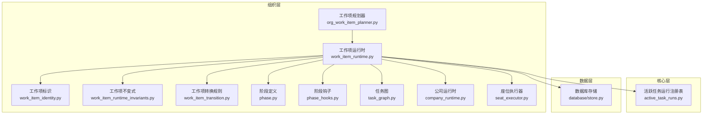

图表来源
- [work_item_runtime.py](file://opc/layer2_organization/work_item_runtime.py)
- [work_item_identity.py](file://opc/layer2_organization/work_item_identity.py)
- [work_item_transition.py](file://opc/layer2_organization/work_item_transition.py)
- [work_item_runtime_invariants.py](file://opc/layer2_organization/work_item_runtime_invariants.py)
- [org_work_item_planner.py](file://opc/layer2_organization/org_work_item_planner.py)
- [phase.py](file://opc/layer2_organization/phase.py)
- [phase_hooks.py](file://opc/layer2_organization/phase_hooks.py)
- [task_graph.py](file://opc/layer2_organization/task_graph.py)
- [company_runtime.py](file://opc/layer2_organization/company_runtime.py)
- [seat_executor.py](file://opc/layer2_organization/seat_executor.py)
- [active_task_runs.py](file://opc/core/active_task_runs.py)
- [store.py](file://opc/database/store.py)

章节来源
- [work_item_runtime.py](file://opc/layer2_organization/work_item_runtime.py)
- [org_work_item_planner.py](file://opc/layer2_organization/org_work_item_planner.py)
- [store.py](file://opc/database/store.py)

## 核心组件
- 工作项运行时 WorkItemRuntime：负责工作项的状态机驱动、转换校验、事务边界、并发隔离、钩子回调与进度上报。
- 工作项标识 WorkItemIdentity：负责工作项唯一标识的生成与校验，确保跨进程/会话的唯一性与稳定性。
- 工作项转换规则 WorkItemTransition：声明式定义允许的状态转移、前置条件与副作用。
- 工作项不变式 WorkItemRuntimeInvariants：在关键路径上断言一致性，防止非法状态或数据损坏。
- 阶段 Phase 与阶段钩子 PhaseHooks：将业务逻辑切分为阶段，并通过钩子在进入/退出阶段时执行扩展点。
- 任务图 TaskGraph：描述工作项内部任务的有向无环图，用于调度与依赖解析。
- 公司运行时 CompanyRuntime 与座位执行器 SeatExecutor：承载工作项的执行上下文与资源分配。
- 活跃任务运行 ActiveTaskRuns：维护当前活跃的工作项运行实例，避免重复执行与竞态。
- 数据库存储 Store：持久化工作项状态、进度、事件与快照，支持事务与回滚。

章节来源
- [work_item_runtime.py](file://opc/layer2_organization/work_item_runtime.py)
- [work_item_identity.py](file://opc/layer2_organization/work_item_identity.py)
- [work_item_transition.py](file://opc/layer2_organization/work_item_transition.py)
- [work_item_runtime_invariants.py](file://opc/layer2_organization/work_item_runtime_invariants.py)
- [phase.py](file://opc/layer2_organization/phase.py)
- [phase_hooks.py](file://opc/layer2_organization/phase_hooks.py)
- [task_graph.py](file://opc/layer2_organization/task_graph.py)
- [company_runtime.py](file://opc/layer2_organization/company_runtime.py)
- [seat_executor.py](file://opc/layer2_organization/seat_executor.py)
- [active_task_runs.py](file://opc/core/active_task_runs.py)
- [store.py](file://opc/database/store.py)

## 架构总览
工作项的生命周期由“规划—编排—执行—持久化—可观测”五步构成。规划器根据目标产出与约束生成初始工作项；运行时加载转换规则与阶段钩子，按图驱动执行；执行过程中通过活跃任务注册表进行并发控制；所有状态变更经不变式校验后落库；同时上报进度与指标供上层观察。

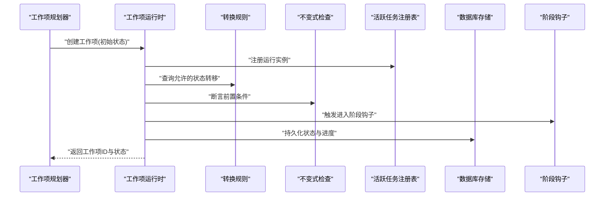

图表来源
- [org_work_item_planner.py](file://opc/layer2_organization/org_work_item_planner.py)
- [work_item_runtime.py](file://opc/layer2_organization/work_item_runtime.py)
- [work_item_transition.py](file://opc/layer2_organization/work_item_transition.py)
- [work_item_runtime_invariants.py](file://opc/layer2_organization/work_item_runtime_invariants.py)
- [active_task_runs.py](file://opc/core/active_task_runs.py)
- [store.py](file://opc/database/store.py)
- [phase_hooks.py](file://opc/layer2_organization/phase_hooks.py)

## 详细组件分析

### 工作项运行时 WorkItemRuntime
职责与要点
- 状态机驱动：基于转换规则与不变式，推进工作项从创建到完成。
- 事务边界：以事务包裹一次状态转换，保证原子性与一致性。
- 并发控制：借助活跃任务注册表，避免同一工作项被并行执行。
- 钩子扩展：在进入/退出阶段时调用钩子，解耦业务逻辑。
- 进度上报：周期性记录进度与中间产物，支持中断与恢复。

关键流程
- 启动：加载工作项元数据、构建阶段序列、初始化钩子与上下文。
- 转换：校验转换合法性→执行阶段钩子→更新状态→持久化。
- 结束：清理资源、释放锁、上报最终指标。

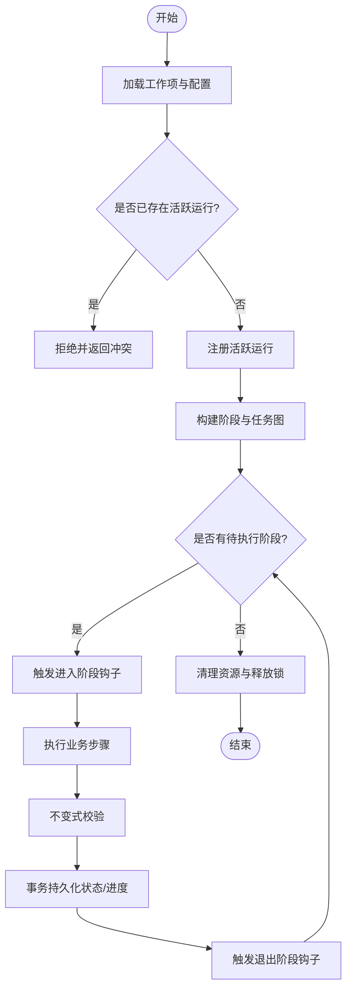

图表来源
- [work_item_runtime.py](file://opc/layer2_organization/work_item_runtime.py)
- [active_task_runs.py](file://opc/core/active_task_runs.py)
- [work_item_runtime_invariants.py](file://opc/layer2_organization/work_item_runtime_invariants.py)
- [phase_hooks.py](file://opc/layer2_organization/phase_hooks.py)
- [store.py](file://opc/database/store.py)

章节来源
- [work_item_runtime.py](file://opc/layer2_organization/work_item_runtime.py)
- [active_task_runs.py](file://opc/core/active_task_runs.py)
- [work_item_runtime_invariants.py](file://opc/layer2_organization/work_item_runtime_invariants.py)
- [phase_hooks.py](file://opc/layer2_organization/phase_hooks.py)
- [store.py](file://opc/database/store.py)

### 工作项标识 WorkItemIdentity
职责与要点
- 生成策略：采用稳定且全局唯一的标识生成算法，结合时间戳、随机数与命名空间，确保跨进程/会话不冲突。
- 唯一性保证：通过不可变结构与强类型校验，避免重复与篡改。
- 兼容性：向后兼容旧格式，支持迁移与降级。

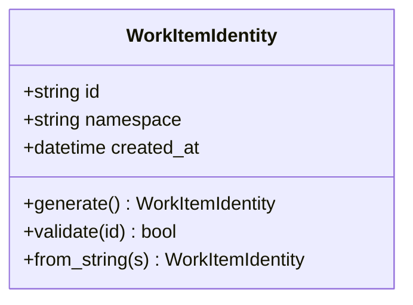

图表来源
- [work_item_identity.py](file://opc/layer2_organization/work_item_identity.py)

章节来源
- [work_item_identity.py](file://opc/layer2_organization/work_item_identity.py)
- [test_work_item_identity_guard.py](file://tests/test_work_item_identity_guard.py)

### 工作项转换规则 WorkItemTransition
职责与要点
- 声明式定义：以数据结构形式声明允许的起始状态、目标状态、前置条件与副作用。
- 动态校验：运行时根据当前状态与上下文计算是否允许转换。
- 可扩展：新增状态与转换无需修改核心逻辑，仅扩展规则集。

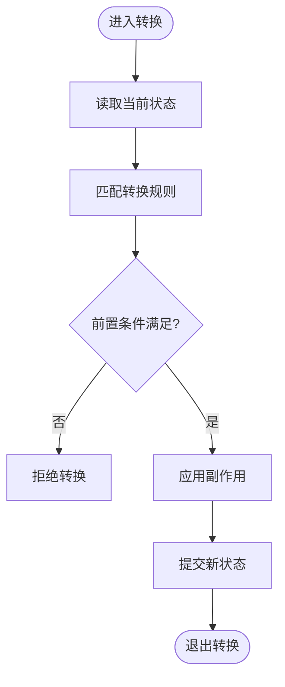

图表来源
- [work_item_transition.py](file://opc/layer2_organization/work_item_transition.py)

章节来源
- [work_item_transition.py](file://opc/layer2_organization/work_item_transition.py)
- [test_work_item_transition.py](file://tests/test_work_item_transition.py)

### 工作项不变式 WorkItemRuntimeInvariants
职责与要点
- 一致性断言：在关键路径上检查状态、依赖、资源占用等不变式。
- 失败即中止：一旦断言失败，立即终止转换并回滚，防止脏写。
- 可观测：记录断言失败的上下文，便于诊断。

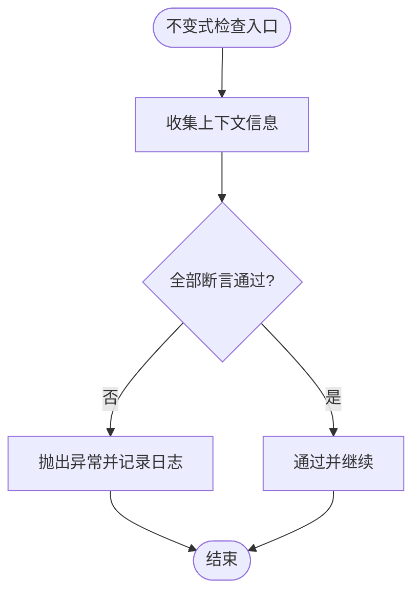

图表来源
- [work_item_runtime_invariants.py](file://opc/layer2_organization/work_item_runtime_invariants.py)

章节来源
- [work_item_runtime_invariants.py](file://opc/layer2_organization/work_item_runtime_invariants.py)
- [test_work_item_runtime_invariants.py](file://tests/test_work_item_runtime_invariants.py)

### 阶段 Phase 与阶段钩子 PhaseHooks
职责与要点
- 阶段划分：将复杂工作项拆分为多个阶段，每个阶段聚焦单一职责。
- 钩子扩展：在进入/退出阶段时触发钩子，支持审计、通知、资源准备与清理。
- 顺序与依赖：阶段顺序由任务图与转换规则共同决定。

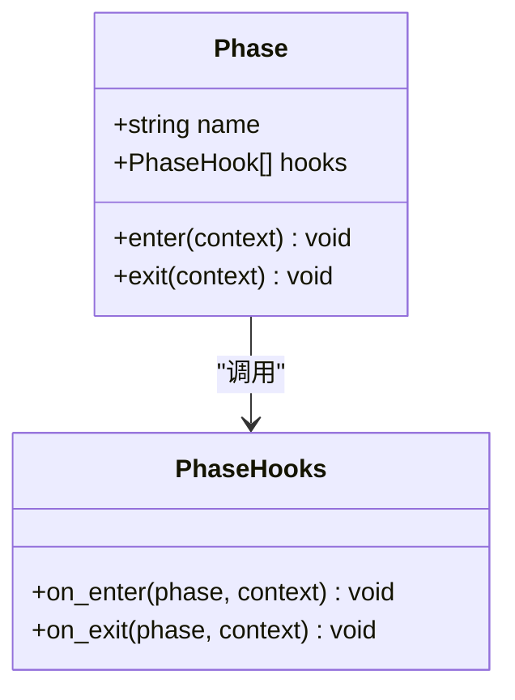

图表来源
- [phase.py](file://opc/layer2_organization/phase.py)
- [phase_hooks.py](file://opc/layer2_organization/phase_hooks.py)

章节来源
- [phase.py](file://opc/layer2_organization/phase.py)
- [phase_hooks.py](file://opc/layer2_organization/phase_hooks.py)

### 任务图 TaskGraph
职责与要点
- 拓扑建模：以有向无环图表示工作项内任务依赖。
- 调度策略：按拓扑序并行执行无依赖任务，最大化吞吐。
- 容错：失败节点可重试或短路，保持整体一致性。

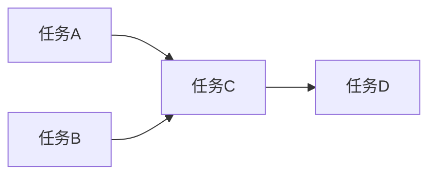

图表来源
- [task_graph.py](file://opc/layer2_organization/task_graph.py)

章节来源
- [task_graph.py](file://opc/layer2_organization/task_graph.py)

### 公司运行时 CompanyRuntime 与座位执行器 SeatExecutor
职责与要点
- 公司运行时：提供工作项执行的上下文、权限、配置与外部服务接入。
- 座位执行器：为工作项分配执行“座位”，隔离资源与状态，避免相互干扰。

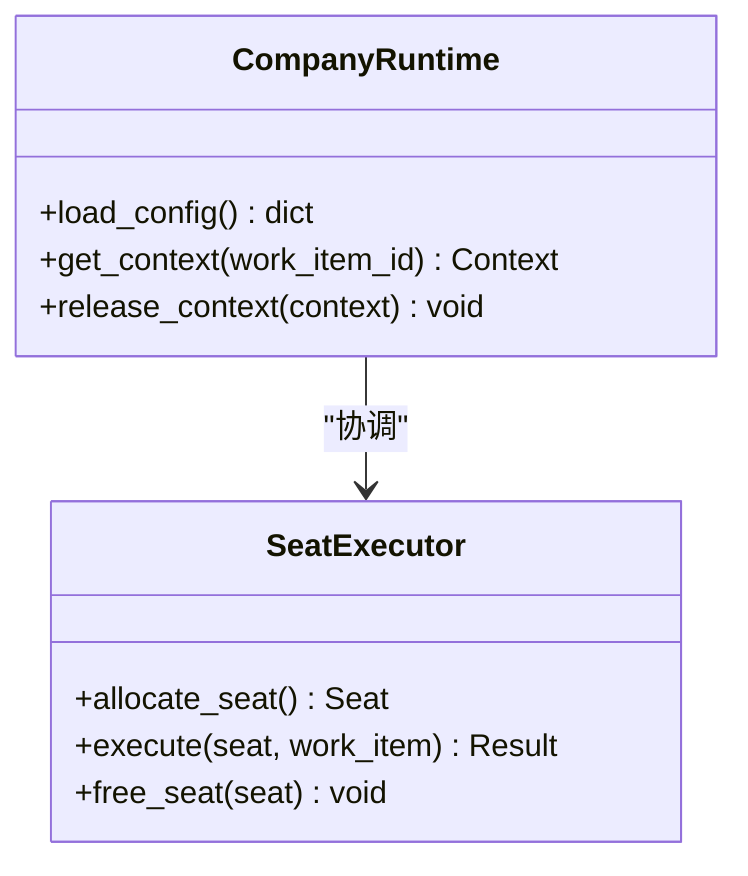

图表来源
- [company_runtime.py](file://opc/layer2_organization/company_runtime.py)
- [seat_executor.py](file://opc/layer2_organization/seat_executor.py)

章节来源
- [company_runtime.py](file://opc/layer2_organization/company_runtime.py)
- [seat_executor.py](file://opc/layer2_organization/seat_executor.py)

## 依赖关系分析
- 低耦合高内聚：运行时依赖转换规则与不变式，但不直接了解具体业务逻辑；业务逻辑通过阶段钩子注入。
- 明确的数据流向：规划器→运行时→转换/不变式→钩子→存储；反向反馈通过事件与指标上报。
- 潜在循环依赖规避：通过接口与抽象（如钩子、阶段）降低模块间耦合。

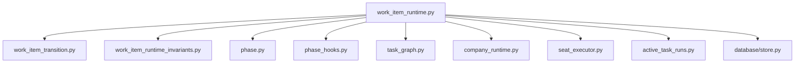

图表来源
- [work_item_runtime.py](file://opc/layer2_organization/work_item_runtime.py)
- [work_item_transition.py](file://opc/layer2_organization/work_item_transition.py)
- [work_item_runtime_invariants.py](file://opc/layer2_organization/work_item_runtime_invariants.py)
- [phase.py](file://opc/layer2_organization/phase.py)
- [phase_hooks.py](file://opc/layer2_organization/phase_hooks.py)
- [task_graph.py](file://opc/layer2_organization/task_graph.py)
- [company_runtime.py](file://opc/layer2_organization/company_runtime.py)
- [seat_executor.py](file://opc/layer2_organization/seat_executor.py)
- [active_task_runs.py](file://opc/core/active_task_runs.py)
- [store.py](file://opc/database/store.py)

章节来源
- [work_item_runtime.py](file://opc/layer2_organization/work_item_runtime.py)

## 性能与并发
- 并发控制：通过活跃任务注册表对同一工作项加锁，避免重复执行；不同工作项可并行推进。
- 事务粒度：以单次状态转换为最小事务单元，减少锁持有时间，提高吞吐。
- 阶段并行：任务图内无依赖任务可并行执行，提升整体效率。
- 资源隔离：座位执行器为工作项分配独立执行环境，避免资源争用。

[本节为通用指导，不涉及具体文件分析]

## 故障恢复与超时处理
- 失败重试：对幂等操作设置重试次数与退避策略，避免瞬时故障导致失败。
- 超时保护：为阶段与任务设置超时阈值，超过阈值则中断并回滚，防止长时间阻塞。
- 自修复：通过不变式检查发现不一致状态，自动尝试修复或转入安全状态。
- 恢复入口：支持从最近检查点恢复，减少重复工作量。

章节来源
- [work_item_runtime.py](file://opc/layer2_organization/work_item_runtime.py)
- [work_item_runtime_invariants.py](file://opc/layer2_organization/work_item_runtime_invariants.py)
- [store.py](file://opc/database/store.py)

## 监控指标与可观测性
- 指标采集：记录状态转换次数、阶段耗时、失败率、重试次数、超时次数等。
- 进度上报：阶段性上报进度与中间产物，便于前端展示与用户干预。
- 日志与追踪：为关键路径添加结构化日志与追踪ID，便于问题定位。

章节来源
- [work_item_runtime.py](file://opc/layer2_organization/work_item_runtime.py)
- [phase_hooks.py](file://opc/layer2_organization/phase_hooks.py)
- [store.py](file://opc/database/store.py)

## 结论
OpenOPC 的工作项生命周期管理以“转换规则+不变式+阶段钩子”为核心，结合事务与并发控制，实现了高可靠、可扩展、可观测的执行框架。通过明确的标识生成策略与严格的不变式断言，系统在复杂业务场景下仍能保持一致性与正确性。

[本节为总结，不涉及具体文件分析]

## 附录：状态转换图与工作流示例

### 状态转换图（概念示意）
以下图示为概念性状态流转，实际状态集合与转换需参考转换规则与不变式的具体实现。

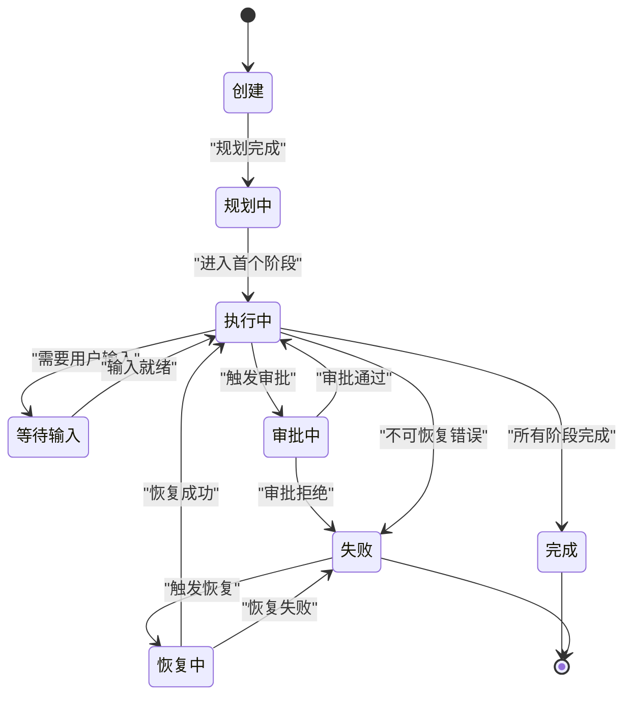

[此图为概念性说明，未直接映射到具体源码文件，故不提供图表来源]

### 工作流示例：多阶段协作任务
- 创建：规划器生成工作项，分配唯一标识。
- 规划：构建任务图与阶段序列。
- 执行：按阶段顺序执行，期间可能触发审批或用户输入。
- 完成：所有阶段完成后，持久化结果并上报指标。

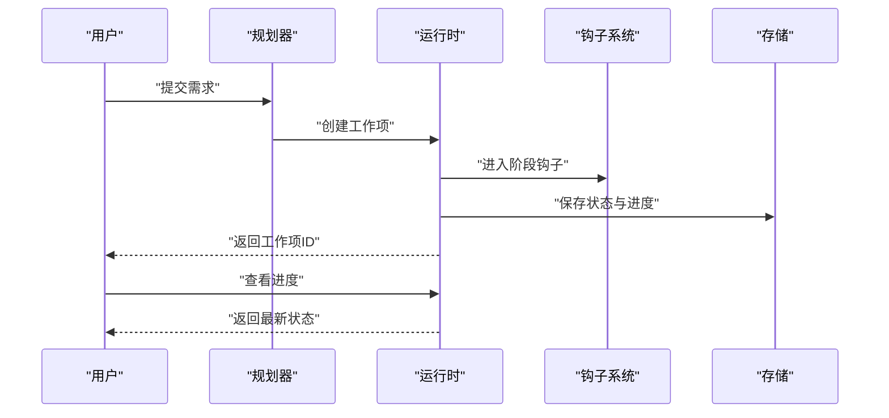

[此图为概念性说明，未直接映射到具体源码文件，故不提供图表来源]