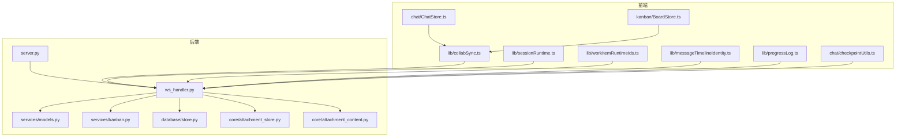
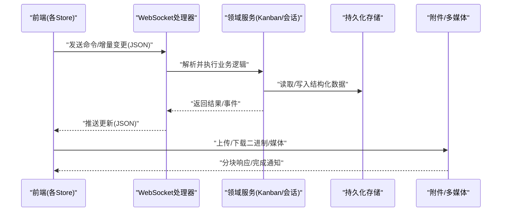
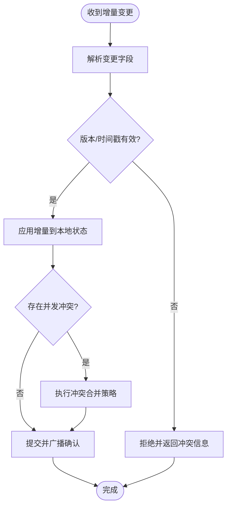
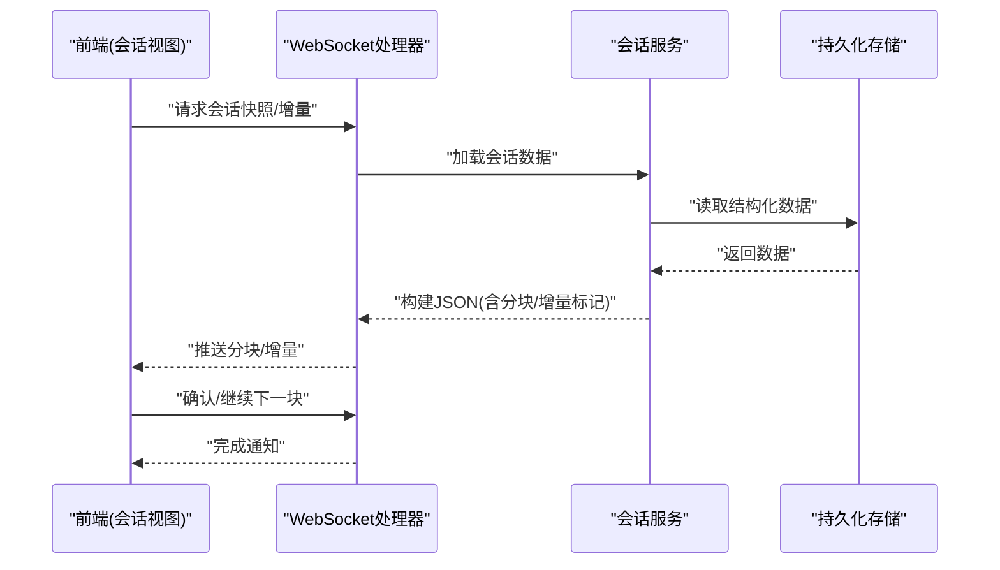
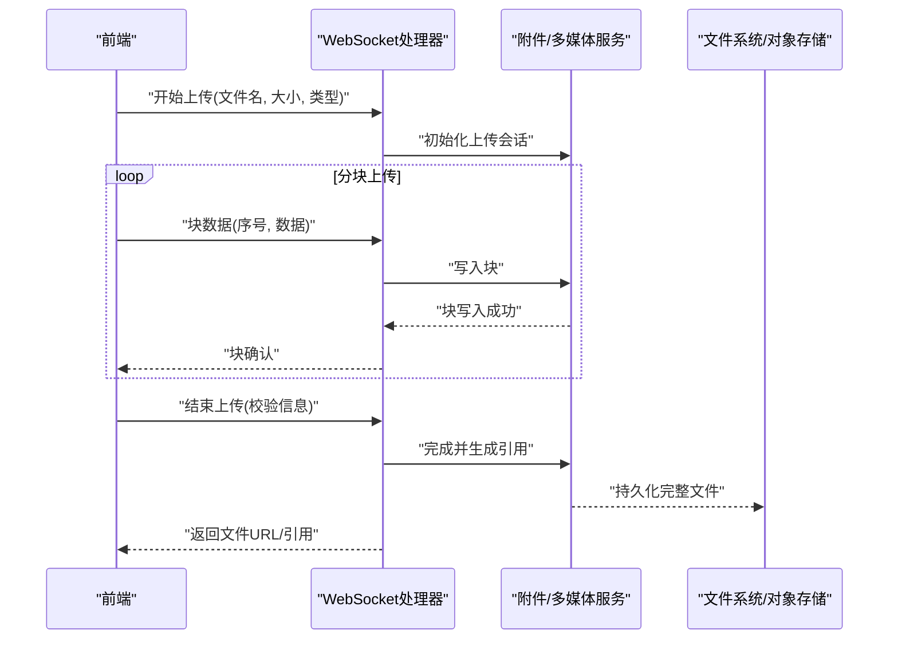
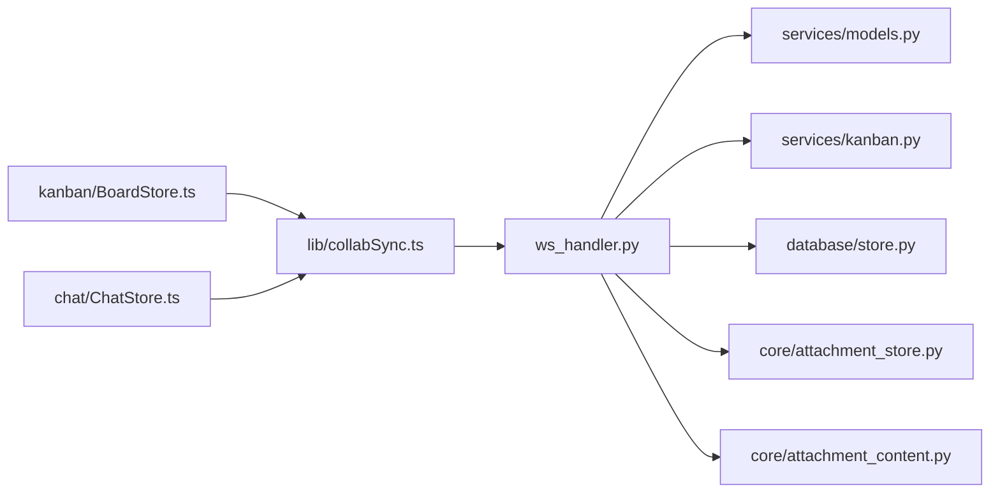

# 数据序列化与传输

<cite>
**本文引用的文件**   
- [pyproject.toml](file://pyproject.toml)
- [README.md](file://README.md)
- [server.py](file://opc/plugins/office_ui/server.py)
- [ws_handler.py](file://opc/plugins/office_ui/ws_handler.py)
- [models.py](file://opc/plugins/office_ui/services/models.py)
- [kanban.py](file://opc/plugins/office_ui/services/kanban.py)
- [collabSync.ts](file://opc/plugins/office_ui/frontend_src/lib/collabSync.ts)
- [BoardStore.ts](file://opc/plugins/office_ui/frontend_src/kanban/BoardStore.ts)
- [ChatStore.ts](file://opc/plugins/office_ui/frontend_src/chat/ChatStore.ts)
- [sessionRuntime.ts](file://opc/plugins/office_ui/frontend_src/lib/sessionRuntime.ts)
- [workItemRuntimeIds.ts](file://opc/plugins/office_ui/frontend_src/lib/workItemRuntimeIds.ts)
- [messageTimelineIdentity.ts](file://opc/plugins/office_ui/frontend_src/lib/messageTimelineIdentity.ts)
- [progressLog.ts](file://opc/plugins/office_ui/frontend_src/lib/progressLog.ts)
- [checkpointUtils.ts](file://opc/plugins/office_ui/frontend_src/chat/checkpointUtils.ts)
- [attachment_store.py](file://opc/core/attachment_store.py)
- [attachment_content.py](file://opc/core/attachment_content.py)
- [store.py](file://opc/database/store.py)
- [test_session_serial_queue.py](file://tests/test_session_serial_queue.py)
- [test_ws_handler_progress_parsing.py](file://tests/test_ws_handler_progress_parsing.py)
- [test_snapshot_builder_company_kanban.py](file://opc/plugins/office_ui/tests/test_snapshot_builder_company_kanban.py)
</cite>

## 目录
1. [简介](#简介)
2. [项目结构](#项目结构)
3. [核心组件](#核心组件)
4. [架构总览](#架构总览)
5. [详细组件分析](#详细组件分析)
6. [依赖关系分析](#依赖关系分析)
7. [性能考量](#性能考量)
8. [故障排查指南](#故障排查指南)
9. [结论](#结论)
10. [附录](#附录)

## 简介
本技术文档聚焦于OpenOPC的数据序列化与传输机制，覆盖以下关键主题：
- JSON Schema定义、类型映射与验证规则
- 会话数据的序列化和反序列化流程，包括大对象分块传输与增量更新
- Kanban界面实时同步协议（WebSocket消息格式与冲突解决）
- 数据压缩算法的选择依据与性能对比
- 数据迁移工具的使用方法与向后兼容性保证
- 二进制与多媒体内容的传输策略

## 项目结构
与序列化与传输相关的代码主要分布在以下模块：
- 后端服务与WebSocket处理：server.py、ws_handler.py
- 领域模型与服务层：services/models.py、services/kanban.py
- 前端状态与同步：frontend_src/lib/collabSync.ts、frontend_src/kanban/BoardStore.ts、frontend_src/chat/ChatStore.ts
- 附件与多媒体：core/attachment_store.py、core/attachment_content.py
- 持久化存储：database/store.py
- 测试用例：tests/test_session_serial_queue.py、tests/test_ws_handler_progress_parsing.py、opc/plugins/office_ui/tests/test_snapshot_builder_company_kanban.py

图表来源
- [server.py](file://opc/plugins/office_ui/server.py)
- [ws_handler.py](file://opc/plugins/office_ui/ws_handler.py)
- [models.py](file://opc/plugins/office_ui/services/models.py)
- [kanban.py](file://opc/plugins/office_ui/services/kanban.py)
- [store.py](file://opc/database/store.py)
- [attachment_store.py](file://opc/core/attachment_store.py)
- [attachment_content.py](file://opc/core/attachment_content.py)
- [collabSync.ts](file://opc/plugins/office_ui/frontend_src/lib/collabSync.ts)
- [BoardStore.ts](file://opc/plugins/office_ui/frontend_src/kanban/BoardStore.ts)
- [ChatStore.ts](file://opc/plugins/office_ui/frontend_src/chat/ChatStore.ts)
- [sessionRuntime.ts](file://opc/plugins/office_ui/frontend_src/lib/sessionRuntime.ts)
- [workItemRuntimeIds.ts](file://opc/plugins/office_ui/frontend_src/lib/workItemRuntimeIds.ts)
- [messageTimelineIdentity.ts](file://opc/plugins/office_ui/frontend_src/lib/messageTimelineIdentity.ts)
- [progressLog.ts](file://opc/plugins/office_ui/frontend_src/lib/progressLog.ts)
- [checkpointUtils.ts](file://opc/plugins/office_ui/frontend_src/chat/checkpointUtils.ts)

章节来源
- [pyproject.toml](file://pyproject.toml)
- [README.md](file://README.md)

## 核心组件
- WebSocket处理器：负责接收和分发前端消息、调用领域服务、将结果序列化为JSON并推送给客户端。
- 领域模型与服务：定义数据结构、校验规则、业务逻辑与持久化接口。
- 前端同步库：封装WebSocket通信、消息编解码、增量更新与冲突合并。
- 附件与多媒体：提供二进制流的分块上传、下载与内容类型路由。
- 持久化存储：提供结构化数据的读写与版本管理。

章节来源
- [ws_handler.py](file://opc/plugins/office_ui/ws_handler.py)
- [models.py](file://opc/plugins/office_ui/services/models.py)
- [kanban.py](file://opc/plugins/office_ui/services/kanban.py)
- [attachment_store.py](file://opc/core/attachment_store.py)
- [attachment_content.py](file://opc/core/attachment_content.py)
- [store.py](file://opc/database/store.py)
- [collabSync.ts](file://opc/plugins/office_ui/frontend_src/lib/collabSync.ts)
- [BoardStore.ts](file://opc/plugins/office_ui/frontend_src/kanban/BoardStore.ts)
- [ChatStore.ts](file://opc/plugins/office_ui/frontend_src/chat/ChatStore.ts)

## 架构总览
系统采用前后端分离的WebSocket实时通信架构。前端通过统一通道发送命令与增量变更，后端按领域模型进行校验与持久化，并通过事件或响应回推更新。

图表来源
- [ws_handler.py](file://opc/plugins/office_ui/ws_handler.py)
- [kanban.py](file://opc/plugins/office_ui/services/kanban.py)
- [store.py](file://opc/database/store.py)
- [attachment_store.py](file://opc/core/attachment_store.py)

## 详细组件分析

### WebSocket消息协议与类型映射
- 消息类型：包含命令型消息（创建、更新、删除）、增量变更（patch/delta）、进度事件、错误事件等。
- 字段规范：所有消息遵循统一的头部字段（如消息类型、时间戳、会话标识），主体字段由具体命令决定。
- 类型映射：后端使用领域模型对请求体进行校验，确保字段类型、必填项与取值范围符合约定；前端在发送前进行本地校验以减少无效请求。
- 验证规则：服务端对关键字段进行强校验，失败时返回标准化错误码与提示；前端根据错误码进行用户提示与重试控制。

章节来源
- [ws_handler.py](file://opc/plugins/office_ui/ws_handler.py)
- [models.py](file://opc/plugins/office_ui/services/models.py)
- [test_ws_handler_progress_parsing.py](file://tests/test_ws_handler_progress_parsing.py)

### Kanban实时同步协议与冲突解决
- 同步模式：基于增量变更的事件驱动同步。前端维护本地视图状态，收到增量后应用差异而非全量替换。
- 冲突检测：为每个可编辑实体引入版本或时间戳标记；当检测到并发修改时，触发冲突合并策略。
- 合并策略：优先采用“最后写入胜出”或“字段级合并”，并在必要时提示用户选择保留策略。
- 一致性保障：通过有序事件与幂等键避免重复应用；对关键操作加入事务性语义以保证最终一致。

图表来源
- [collabSync.ts](file://opc/plugins/office_ui/frontend_src/lib/collabSync.ts)
- [BoardStore.ts](file://opc/plugins/office_ui/frontend_src/kanban/BoardStore.ts)
- [ws_handler.py](file://opc/plugins/office_ui/ws_handler.py)

章节来源
- [collabSync.ts](file://opc/plugins/office_ui/frontend_src/lib/collabSync.ts)
- [BoardStore.ts](file://opc/plugins/office_ui/frontend_src/kanban/BoardStore.ts)
- [test_snapshot_builder_company_kanban.py](file://opc/plugins/office_ui/tests/test_snapshot_builder_company_kanban.py)

### 会话数据序列化与反序列化
- 序列化路径：领域模型转换为JSON，包含会话元数据、消息列表、进度日志与检查点信息。
- 反序列化路径：前端接收JSON后，按类型映射重建本地状态树，并应用增量更新。
- 大对象分块：对于大型上下文或长历史，采用分块传输与断点续传，结合检查点记录恢复位置。
- 增量更新：仅传输变化部分，减少带宽占用；前端以幂等方式合并变更，保持视图一致。

图表来源
- [ws_handler.py](file://opc/plugins/office_ui/ws_handler.py)
- [store.py](file://opc/database/store.py)
- [checkpointUtils.ts](file://opc/plugins/office_ui/frontend_src/chat/checkpointUtils.ts)
- [progressLog.ts](file://opc/plugins/office_ui/frontend_src/lib/progressLog.ts)

章节来源
- [test_session_serial_queue.py](file://tests/test_session_serial_queue.py)
- [checkpointUtils.ts](file://opc/plugins/office_ui/frontend_src/chat/checkpointUtils.ts)
- [progressLog.ts](file://opc/plugins/office_ui/frontend_src/lib/progressLog.ts)

### 二进制与多媒体内容传输
- 上传流程：前端将二进制切分为固定大小的块，逐块发送并携带块序号与总量；后端聚合后落盘并返回完成信号。
- 下载流程：服务端按块返回二进制数据，客户端累积并生成完整文件；支持断点续传与校验。
- 内容类型路由：根据扩展名或MIME类型选择处理策略（图片、视频、音频、文档）。
- 安全与完整性：对上传内容进行类型白名单校验与大小限制；可选哈希校验确保完整性。

图表来源
- [attachment_store.py](file://opc/core/attachment_store.py)
- [attachment_content.py](file://opc/core/attachment_content.py)
- [ws_handler.py](file://opc/plugins/office_ui/ws_handler.py)

章节来源
- [attachment_store.py](file://opc/core/attachment_store.py)
- [attachment_content.py](file://opc/core/attachment_content.py)

### 数据迁移与向后兼容
- 迁移目标：在不同版本间平滑升级数据结构，确保旧数据可被新服务正确读取与转换。
- 迁移策略：采用渐进式迁移，新增字段默认值与可选性设计，避免破坏性变更；对必要字段提供转换脚本。
- 兼容性保证：服务端在反序列化时对缺失字段提供默认值；前端在渲染时对未知字段进行容错处理。
- 验证与回滚：迁移前后进行数据一致性校验；出现异常时支持回滚至上一稳定版本。

章节来源
- [store.py](file://opc/database/store.py)
- [models.py](file://opc/plugins/office_ui/services/models.py)

### 数据压缩算法选择与性能对比
- 选择依据：文本类数据（JSON/日志）适合通用压缩（如gzip/zstd），二进制媒体通常已内嵌压缩（如JPEG/PNG/MP4），无需二次压缩。
- 性能对比：zstd在压缩率与速度之间取得较好平衡，适用于实时场景；gzip兼容性更好但速度较慢；对超大对象建议分块压缩以降低内存峰值。
- 传输优化：在网络受限环境下启用压缩开关；对频繁小消息采用轻量级编码（如MessagePack）替代JSON以提升吞吐。

章节来源
- [ws_handler.py](file://opc/plugins/office_ui/ws_handler.py)
- [progressLog.ts](file://opc/plugins/office_ui/frontend_src/lib/progressLog.ts)

## 依赖关系分析
- 模块耦合：WebSocket处理器依赖领域服务与存储接口；前端同步库依赖WebSocket与本地状态管理。
- 外部依赖：数据库与对象存储作为持久化后端；网络层负责可靠传输与重连。
- 循环依赖：通过接口抽象与事件总线解耦，避免直接循环导入。

图表来源
- [ws_handler.py](file://opc/plugins/office_ui/ws_handler.py)
- [models.py](file://opc/plugins/office_ui/services/models.py)
- [kanban.py](file://opc/plugins/office_ui/services/kanban.py)
- [store.py](file://opc/database/store.py)
- [attachment_store.py](file://opc/core/attachment_store.py)
- [attachment_content.py](file://opc/core/attachment_content.py)
- [collabSync.ts](file://opc/plugins/office_ui/frontend_src/lib/collabSync.ts)
- [BoardStore.ts](file://opc/plugins/office_ui/frontend_src/kanban/BoardStore.ts)
- [ChatStore.ts](file://opc/plugins/office_ui/frontend_src/chat/ChatStore.ts)

章节来源
- [ws_handler.py](file://opc/plugins/office_ui/ws_handler.py)
- [collabSync.ts](file://opc/plugins/office_ui/frontend_src/lib/collabSync.ts)

## 性能考量
- 增量优先：尽量使用增量更新与差异传输，降低带宽与CPU开销。
- 分块与批处理：对大对象采用分块与批量提交，减少单次消息体积与锁竞争。
- 压缩开关：根据网络条件动态启用压缩；对高频小消息考虑更轻量的编码格式。
- 幂等与去重：为消息添加唯一键，避免重复处理导致的额外计算。
- 缓存与预取：对热点数据建立缓存层，缩短首屏与交互延迟。

[本节为通用指导，不直接分析具体文件]

## 故障排查指南
- 常见错误码：网络中断、校验失败、版本冲突、分块丢失、权限不足等。
- 定位步骤：
  - 检查WebSocket连接状态与心跳；确认消息是否到达后端。
  - 查看服务端日志中的校验与持久化错误；核对字段类型与必填项。
  - 对分块传输，核查块序号连续性与服务端聚合状态。
  - 对冲突场景，比对版本号与时间戳，确认合并策略是否符合预期。
- 恢复措施：
  - 自动重试与退避；对分块传输支持断点续传。
  - 对冲突提供用户选择界面，允许手动合并。
  - 对损坏数据执行迁移修复或回滚。

章节来源
- [test_ws_handler_progress_parsing.py](file://tests/test_ws_handler_progress_parsing.py)
- [checkpointUtils.ts](file://opc/plugins/office_ui/frontend_src/chat/checkpointUtils.ts)

## 结论
OpenOPC的数据序列化与传输机制围绕WebSocket实时通信展开，通过严格的类型映射与校验、增量同步与分块传输、以及完善的冲突解决与迁移策略，实现了高效、可靠且可扩展的数据交换能力。在实际部署中，应结合网络环境与数据特征选择合适的压缩与编码方案，并持续监控性能指标与错误分布，以保障用户体验与系统稳定性。

[本节为总结性内容，不直接分析具体文件]

## 附录
- 术语表：
  - 增量更新：仅传输变化的数据片段，用于提升同步效率。
  - 分块传输：将大对象拆分为多个小块依次传输，便于恢复与并行。
  - 冲突解决：在并发修改场景下，通过策略合并或提示用户选择以达成一致。
- 参考实现路径：
  - WebSocket处理器：[ws_handler.py](file://opc/plugins/office_ui/ws_handler.py)
  - 领域模型与服务：[models.py](file://opc/plugins/office_ui/services/models.py)、[kanban.py](file://opc/plugins/office_ui/services/kanban.py)
  - 前端同步库：[collabSync.ts](file://opc/plugins/office_ui/frontend_src/lib/collabSync.ts)
  - 附件与多媒体：[attachment_store.py](file://opc/core/attachment_store.py)、[attachment_content.py](file://opc/core/attachment_content.py)
  - 持久化存储：[store.py](file://opc/database/store.py)

[本节为补充信息，不直接分析具体文件]