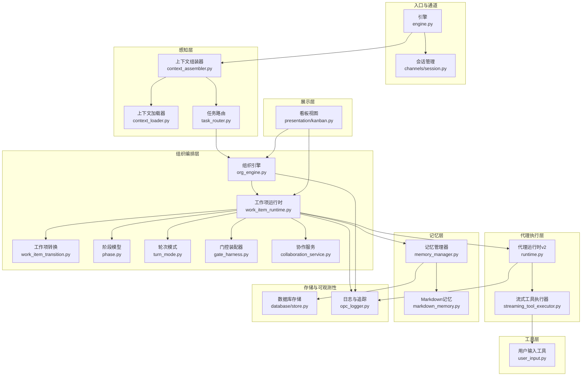
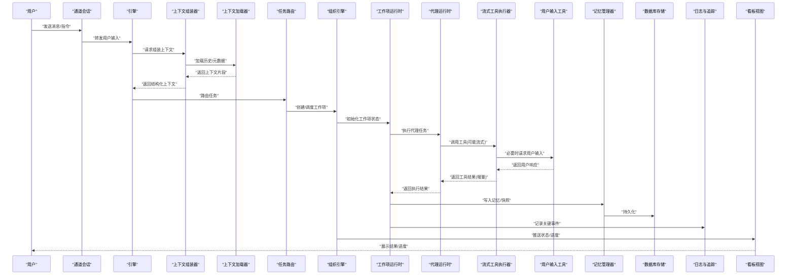
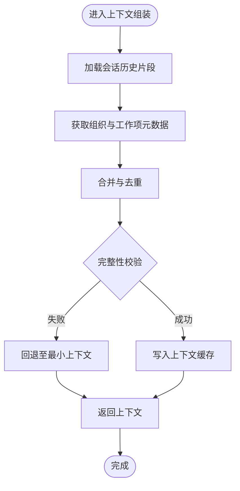
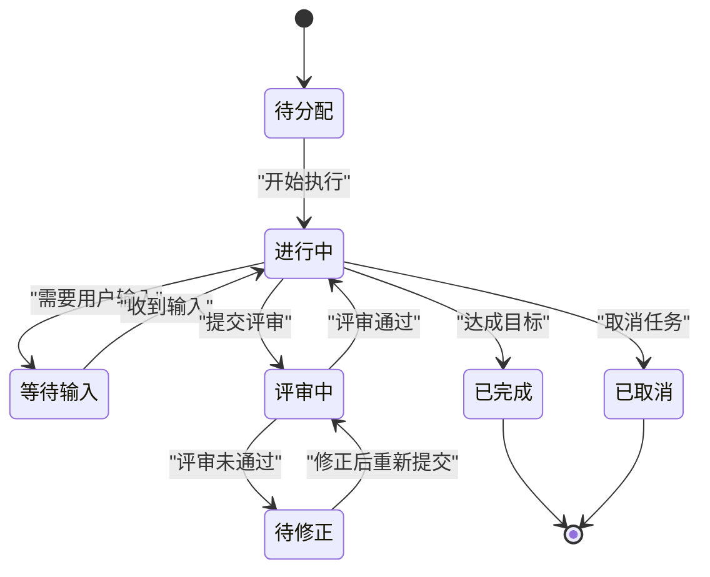
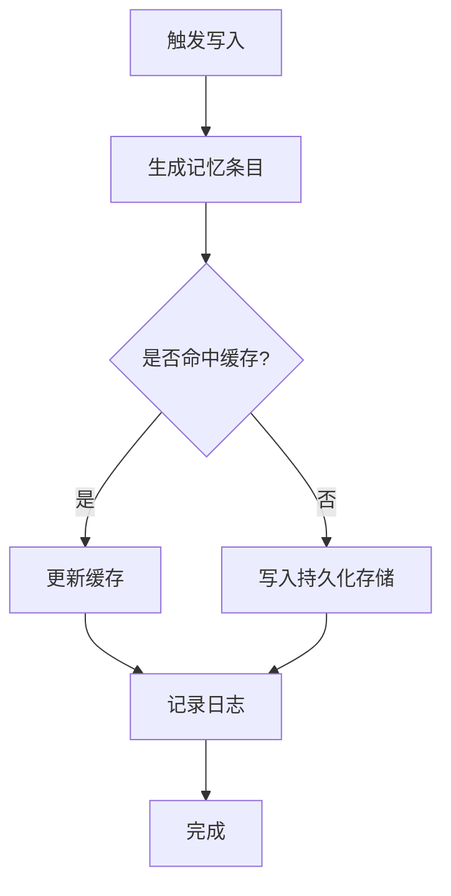
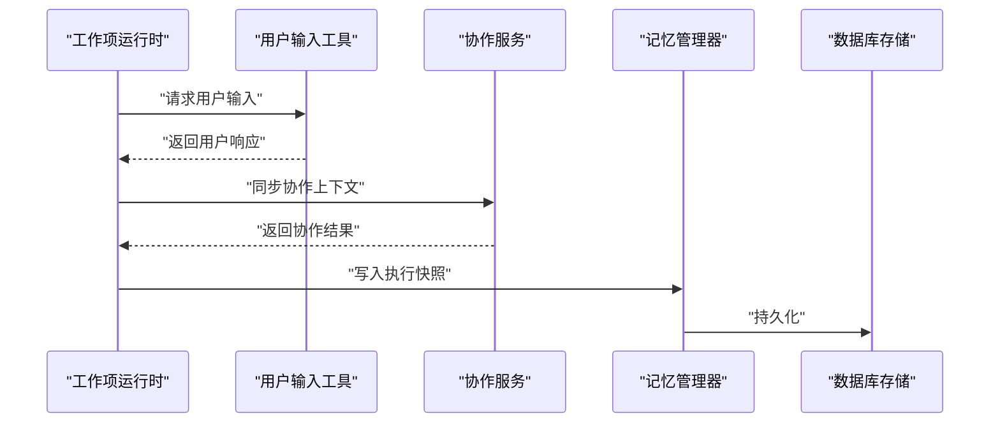
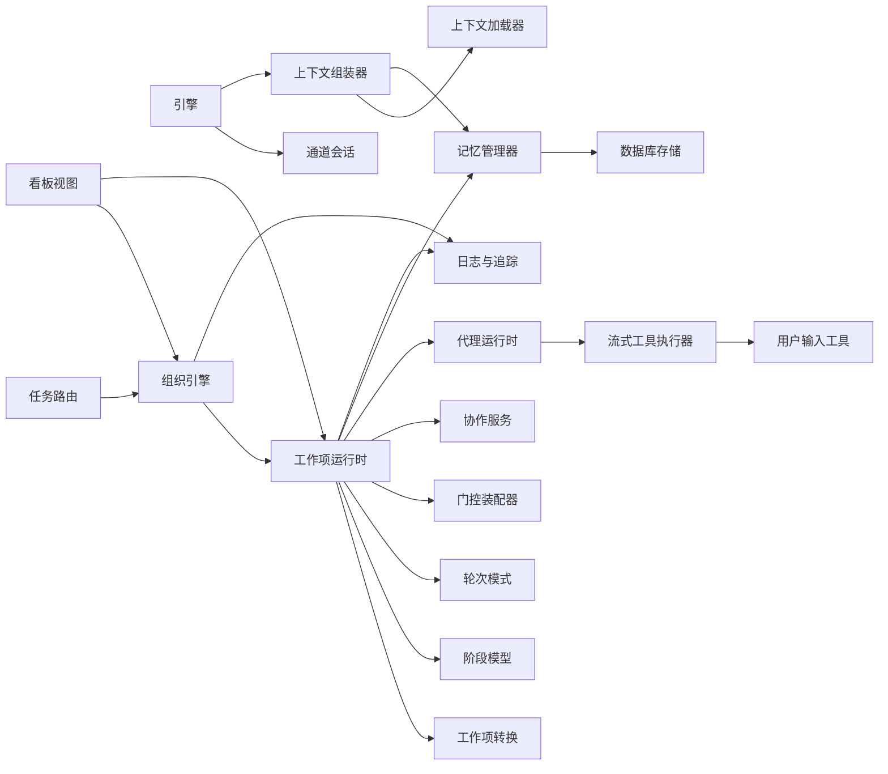

# 数据流设计

<cite>
**本文引用的文件**   
- [engine.py](file://opc/engine.py)
- [layer1_perception/context_assembler.py](file://opc/layer1_perception/context_assembler.py)
- [layer1_perception/context_loader.py](file://opc/layer1_perception/context_loader.py)
- [layer1_perception/task_router.py](file://opc/layer1_perception/task_router.py)
- [layer2_organization/org_engine.py](file://opc/layer2_organization/org_engine.py)
- [layer2_organization/work_item_runtime.py](file://opc/layer2_organization/work_item_runtime.py)
- [layer2_organization/work_item_transition.py](file://opc/layer2_organization/work_item_transition.py)
- [layer2_organization/work_item_context_view.py](file://opc/layer2_organization/work_item_context_view.py)
- [layer2_organization/phase.py](file://opc/layer2_organization/phase.py)
- [layer2_organization/turn_mode.py](file://opc/layer2_organization/turn_mode.py)
- [layer2_organization/gate_harness.py](file://opc/layer2_organization/gate_harness.py)
- [layer2_organization/collaboration_service.py](file://opc/layer2_organization/collaboration_service.py)
- [layer3_agent/runtime_v2/runtime.py](file://opc/layer3_agent/runtime_v2/runtime.py)
- [layer3_agent/runtime_v2/streaming_tool_executor.py](file://opc/layer3_agent/runtime_v2/streaming_tool_executor.py)
- [layer4_tools/user_input.py](file://opc/layer4_tools/user_input.py)
- [layer5_memory/memory_manager.py](file://opc/layer5_memory/memory_manager.py)
- [layer5_memory/markdown_memory.py](file://opc/layer5_memory/markdown_memory.py)
- [layer6_observability/opc_logger.py](file://opc/layer6_observability/opc_logger.py)
- [core/models.py](file://opc/core/models.py)
- [core/events.py](file://opc/core/events.py)
- [database/store.py](file://opc/database/store.py)
- [channels/session.py](file://opc/channels/session.py)
- [presentation/kanban.py](file://opc/presentation/kanban.py)
</cite>

## 目录
1. [引言](#引言)
2. [项目结构](#项目结构)
3. [核心组件](#核心组件)
4. [架构总览](#架构总览)
5. [详细组件分析](#详细组件分析)
6. [依赖关系分析](#依赖关系分析)
7. [性能考虑](#性能考虑)
8. [故障排查指南](#故障排查指南)
9. [结论](#结论)
10. [附录](#附录)

## 引言
本文件聚焦于OpenOPC的数据流设计，围绕“从用户输入到最终输出”的完整生命周期展开，重点说明：
- 上下文组装器（Context Assembler）工作机制
- 工作项状态转换与阶段推进
- 记忆系统的读写策略与持久化方案
- 数据序列化格式、缓存策略与一致性保证
- 并发访问控制与性能优化策略
- 关键业务场景下的数据流转图与状态转换图

## 项目结构
OpenOPC采用分层架构，数据流贯穿感知层、组织编排层、代理执行层、工具层、记忆层与可观测性层。入口由引擎驱动，结合通道会话进行用户交互，并通过事件总线在各层之间传递消息。

图表来源
- [engine.py:1-200](file://opc/engine.py#L1-L200)
- [channels/session.py:1-200](file://opc/channels/session.py#L1-L200)
- [layer1_perception/context_assembler.py:1-200](file://opc/layer1_perception/context_assembler.py#L1-L200)
- [layer1_perception/context_loader.py:1-200](file://opc/layer1_perception/context_loader.py#L1-L200)
- [layer1_perception/task_router.py:1-200](file://opc/layer1_perception/task_router.py#L1-L200)
- [layer2_organization/org_engine.py:1-200](file://opc/layer2_organization/org_engine.py#L1-L200)
- [layer2_organization/work_item_runtime.py:1-200](file://opc/layer2_organization/work_item_runtime.py#L1-L200)
- [layer2_organization/work_item_transition.py:1-200](file://opc/layer2_organization/work_item_transition.py#L1-L200)
- [layer2_organization/phase.py:1-200](file://opc/layer2_organization/phase.py#L1-L200)
- [layer2_organization/turn_mode.py:1-200](file://opc/layer2_organization/turn_mode.py#L1-L200)
- [layer2_organization/gate_harness.py:1-200](file://opc/layer2_organization/gate_harness.py#L1-L200)
- [layer2_organization/collaboration_service.py:1-200](file://opc/layer2_organization/collaboration_service.py#L1-L200)
- [layer3_agent/runtime_v2/runtime.py:1-200](file://opc/layer3_agent/runtime_v2/runtime.py#L1-L200)
- [layer3_agent/runtime_v2/streaming_tool_executor.py:1-200](file://opc/layer3_agent/runtime_v2/streaming_tool_executor.py#L1-L200)
- [layer4_tools/user_input.py:1-200](file://opc/layer4_tools/user_input.py#L1-L200)
- [layer5_memory/memory_manager.py:1-200](file://opc/layer5_memory/memory_manager.py#L1-L200)
- [layer5_memory/markdown_memory.py:1-200](file://opc/layer5_memory/markdown_memory.py#L1-L200)
- [database/store.py:1-200](file://opc/database/store.py#L1-L200)
- [layer6_observability/opc_logger.py:1-200](file://opc/layer6_observability/opc_logger.py#L1-L200)
- [presentation/kanban.py:1-200](file://opc/presentation/kanban.py#L1-L200)

章节来源
- [engine.py:1-200](file://opc/engine.py#L1-L200)
- [channels/session.py:1-200](file://opc/channels/session.py#L1-L200)
- [layer1_perception/context_assembler.py:1-200](file://opc/layer1_perception/context_assembler.py#L1-L200)
- [layer1_perception/context_loader.py:1-200](file://opc/layer1_perception/context_loader.py#L1-L200)
- [layer1_perception/task_router.py:1-200](file://opc/layer1_perception/task_router.py#L1-L200)
- [layer2_organization/org_engine.py:1-200](file://opc/layer2_organization/org_engine.py#L1-L200)
- [layer2_organization/work_item_runtime.py:1-200](file://opc/layer2_organization/work_item_runtime.py#L1-L200)
- [layer2_organization/work_item_transition.py:1-200](file://opc/layer2_organization/work_item_transition.py#L1-L200)
- [layer2_organization/phase.py:1-200](file://opc/layer2_organization/phase.py#L1-L200)
- [layer2_organization/turn_mode.py:1-200](file://opc/layer2_organization/turn_mode.py#L1-L200)
- [layer2_organization/gate_harness.py:1-200](file://opc/layer2_organization/gate_harness.py#L1-L200)
- [layer2_organization/collaboration_service.py:1-200](file://opc/layer2_organization/collaboration_service.py#L1-L200)
- [layer3_agent/runtime_v2/runtime.py:1-200](file://opc/layer3_agent/runtime_v2/runtime.py#L1-L200)
- [layer3_agent/runtime_v2/streaming_tool_executor.py:1-200](file://opc/layer3_agent/runtime_v2/streaming_tool_executor.py#L1-L200)
- [layer4_tools/user_input.py:1-200](file://opc/layer4_tools/user_input.py#L1-L200)
- [layer5_memory/memory_manager.py:1-200](file://opc/layer5_memory/memory_manager.py#L1-L200)
- [layer5_memory/markdown_memory.py:1-200](file://opc/layer5_memory/markdown_memory.py#L1-L200)
- [database/store.py:1-200](file://opc/database/store.py#L1-L200)
- [layer6_observability/opc_logger.py:1-200](file://opc/layer6_observability/opc_logger.py#L1-L200)
- [presentation/kanban.py:1-200](file://opc/presentation/kanban.py#L1-L200)

## 核心组件
- 引擎与通道会话：负责启动系统、接收用户输入、维护会话上下文并触发后续处理流程。
- 感知层：上下文组装器将多源信息聚合为结构化上下文；上下文加载器按需拉取历史与元数据；任务路由器根据意图与约束选择执行路径。
- 组织编排层：组织引擎协调工作项生命周期；工作项运行时维护状态机、阶段推进与轮次模式；转换逻辑确保状态迁移的原子性与一致性；门控装配器在关键节点进行校验与拦截；协作服务支持跨角色/跨会话协同。
- 代理执行层：代理运行时调度工具执行，支持流式输出与增量更新；流式工具执行器提供细粒度进度与中间结果。
- 工具层：用户输入工具用于交互式收集必要信息或确认操作。
- 记忆层：记忆管理器统一读写接口；Markdown记忆提供文本型持久化；底层通过数据库存储实现持久化。
- 可观测性：统一的日志与追踪记录关键事件，便于排障与审计。
- 展示层：看板视图呈现工作项状态、进度与协作信息。

章节来源
- [engine.py:1-200](file://opc/engine.py#L1-L200)
- [channels/session.py:1-200](file://opc/channels/session.py#L1-L200)
- [layer1_perception/context_assembler.py:1-200](file://opc/layer1_perception/context_assembler.py#L1-L200)
- [layer1_perception/context_loader.py:1-200](file://opc/layer1_perception/context_loader.py#L1-L200)
- [layer1_perception/task_router.py:1-200](file://opc/layer1_perception/task_router.py#L1-L200)
- [layer2_organization/org_engine.py:1-200](file://opc/layer2_organization/org_engine.py#L1-L200)
- [layer2_organization/work_item_runtime.py:1-200](file://opc/layer2_organization/work_item_runtime.py#L1-L200)
- [layer2_organization/work_item_transition.py:1-200](file://opc/layer2_organization/work_item_transition.py#L1-L200)
- [layer2_organization/phase.py:1-200](file://opc/layer2_organization/phase.py#L1-L200)
- [layer2_organization/turn_mode.py:1-200](file://opc/layer2_organization/turn_mode.py#L1-L200)
- [layer2_organization/gate_harness.py:1-200](file://opc/layer2_organization/gate_harness.py#L1-L200)
- [layer2_organization/collaboration_service.py:1-200](file://opc/layer2_organization/collaboration_service.py#L1-L200)
- [layer3_agent/runtime_v2/runtime.py:1-200](file://opc/layer3_agent/runtime_v2/runtime.py#L1-L200)
- [layer3_agent/runtime_v2/streaming_tool_executor.py:1-200](file://opc/layer3_agent/runtime_v2/streaming_tool_executor.py#L1-L200)
- [layer4_tools/user_input.py:1-200](file://opc/layer4_tools/user_input.py#L1-L200)
- [layer5_memory/memory_manager.py:1-200](file://opc/layer5_memory/memory_manager.py#L1-L200)
- [layer5_memory/markdown_memory.py:1-200](file://opc/layer5_memory/markdown_memory.py#L1-L200)
- [database/store.py:1-200](file://opc/database/store.py#L1-L200)
- [layer6_observability/opc_logger.py:1-200](file://opc/layer6_observability/opc_logger.py#L1-L200)
- [presentation/kanban.py:1-200](file://opc/presentation/kanban.py#L1-L200)

## 架构总览
下图展示了从用户输入到输出的端到端数据流，包括上下文组装、工作项编排、代理执行、记忆读写与展示反馈。

图表来源
- [engine.py:1-200](file://opc/engine.py#L1-L200)
- [channels/session.py:1-200](file://opc/channels/session.py#L1-L200)
- [layer1_perception/context_assembler.py:1-200](file://opc/layer1_perception/context_assembler.py#L1-L200)
- [layer1_perception/context_loader.py:1-200](file://opc/layer1_perception/context_loader.py#L1-L200)
- [layer1_perception/task_router.py:1-200](file://opc/layer1_perception/task_router.py#L1-L200)
- [layer2_organization/org_engine.py:1-200](file://opc/layer2_organization/org_engine.py#L1-L200)
- [layer2_organization/work_item_runtime.py:1-200](file://opc/layer2_organization/work_item_runtime.py#L1-L200)
- [layer3_agent/runtime_v2/runtime.py:1-200](file://opc/layer3_agent/runtime_v2/runtime.py#L1-L200)
- [layer3_agent/runtime_v2/streaming_tool_executor.py:1-200](file://opc/layer3_agent/runtime_v2/streaming_tool_executor.py#L1-L200)
- [layer4_tools/user_input.py:1-200](file://opc/layer4_tools/user_input.py#L1-L200)
- [layer5_memory/memory_manager.py:1-200](file://opc/layer5_memory/memory_manager.py#L1-L200)
- [database/store.py:1-200](file://opc/database/store.py#L1-L200)
- [layer6_observability/opc_logger.py:1-200](file://opc/layer6_observability/opc_logger.py#L1-L200)
- [presentation/kanban.py:1-200](file://opc/presentation/kanban.py#L1-L200)

## 详细组件分析

### 上下文组装器（Context Assembler）工作机制
- 职责：聚合来自通道消息、会话历史、组织配置、工作项元数据等碎片信息，形成稳定的上下文视图供后续阶段使用。
- 数据来源：上下文加载器负责按范围与策略拉取历史片段与外部元数据；记忆管理器提供已持久化的上下文快照。
- 输出：标准化的上下文对象，包含会话标识、时间窗口、相关实体、权限与可见性标记等。
- 缓存策略：对频繁读取的历史片段进行内存缓存，避免重复IO；当工作项状态变更或会话切换时失效相应缓存。
- 错误处理：若部分数据不可用，降级为最小可用上下文并记录告警，确保流程不中断。

图表来源
- [layer1_perception/context_assembler.py:1-200](file://opc/layer1_perception/context_assembler.py#L1-L200)
- [layer1_perception/context_loader.py:1-200](file://opc/layer1_perception/context_loader.py#L1-L200)
- [layer5_memory/memory_manager.py:1-200](file://opc/layer5_memory/memory_manager.py#L1-L200)

章节来源
- [layer1_perception/context_assembler.py:1-200](file://opc/layer1_perception/context_assembler.py#L1-L200)
- [layer1_perception/context_loader.py:1-200](file://opc/layer1_perception/context_loader.py#L1-L200)
- [layer5_memory/memory_manager.py:1-200](file://opc/layer5_memory/memory_manager.py#L1-L200)

### 工作项状态转换与阶段推进
- 状态机：工作项具有明确的状态集合与合法转换规则，由转换模块定义与校验。
- 阶段模型：每个阶段对应一组目标与产出物，阶段推进需满足前置条件与门控检查。
- 轮次模式：在多轮交互中，工作项在不同轮次间保持上下文一致，支持暂停与恢复。
- 门控装配器：在关键转换点执行策略检查（如审批、安全、预算），阻止非法迁移。
- 一致性：状态转换以事务方式提交，确保并发下不会出现脏读或丢失更新。

图表来源
- [layer2_organization/work_item_transition.py:1-200](file://opc/layer2_organization/work_item_transition.py#L1-L200)
- [layer2_organization/phase.py:1-200](file://opc/layer2_organization/phase.py#L1-L200)
- [layer2_organization/turn_mode.py:1-200](file://opc/layer2_organization/turn_mode.py#L1-L200)
- [layer2_organization/gate_harness.py:1-200](file://opc/layer2_organization/gate_harness.py#L1-L200)

章节来源
- [layer2_organization/work_item_transition.py:1-200](file://opc/layer2_organization/work_item_transition.py#L1-L200)
- [layer2_organization/phase.py:1-200](file://opc/layer2_organization/phase.py#L1-L200)
- [layer2_organization/turn_mode.py:1-200](file://opc/layer2_organization/turn_mode.py#L1-L200)
- [layer2_organization/gate_harness.py:1-200](file://opc/layer2_organization/gate_harness.py#L1-L200)

### 记忆系统的读写策略与持久化方案
- 读写策略：
  - 写：在工作项推进、工具执行完成后，将关键结果与上下文快照写入记忆；支持增量追加与压缩。
  - 读：上下文组装器优先命中内存缓存，未命中则从持久化存储加载并按需重建视图。
- 持久化：
  - Markdown记忆提供可读性强的文本格式，便于审计与迁移。
  - 数据库存储作为底层持久化介质，提供事务与索引能力。
- 一致性：
  - 写入采用幂等操作与版本号控制，避免重复写入导致不一致。
  - 读取采用一致性快照，确保上下文视图稳定。

图表来源
- [layer5_memory/memory_manager.py:1-200](file://opc/layer5_memory/memory_manager.py#L1-L200)
- [layer5_memory/markdown_memory.py:1-200](file://opc/layer5_memory/markdown_memory.py#L1-L200)
- [database/store.py:1-200](file://opc/database/store.py#L1-L200)

章节来源
- [layer5_memory/memory_manager.py:1-200](file://opc/layer5_memory/memory_manager.py#L1-L200)
- [layer5_memory/markdown_memory.py:1-200](file://opc/layer5_memory/markdown_memory.py#L1-L200)
- [database/store.py:1-200](file://opc/database/store.py#L1-L200)

### 数据序列化格式与缓存策略
- 序列化格式：
  - 上下文与工作项状态采用结构化对象表示，内部序列化为JSON或等效格式，便于跨进程/跨语言传输。
  - Markdown记忆以人类可读的文本形式保存，同时保留机器可读的结构字段。
- 缓存策略：
  - 内存缓存覆盖高频读取的上下文片段与工作项摘要。
  - 缓存失效策略基于工作项状态变更、会话切换与过期时间。
- 版本兼容：
  - 序列化对象包含版本字段，升级时可通过迁移脚本兼容旧格式。

章节来源
- [core/models.py:1-200](file://opc/core/models.py#L1-L200)
- [layer5_memory/markdown_memory.py:1-200](file://opc/layer5_memory/markdown_memory.py#L1-L200)
- [layer5_memory/memory_manager.py:1-200](file://opc/layer5_memory/memory_manager.py#L1-L200)

### 并发访问控制与一致性保证
- 并发控制：
  - 工作项状态转换采用乐观锁或事务提交，防止并发冲突。
  - 记忆写入采用幂等键与版本号，避免重复写入。
- 一致性：
  - 关键路径（状态转换、记忆持久化）使用事务边界，确保要么全部成功，要么全部回滚。
  - 事件总线记录状态变更事件，便于事后审计与回放。

章节来源
- [layer2_organization/work_item_transition.py:1-200](file://opc/layer2_organization/work_item_transition.py#L1-L200)
- [layer5_memory/memory_manager.py:1-200](file://opc/layer5_memory/memory_manager.py#L1-L200)
- [core/events.py:1-200](file://opc/core/events.py#L1-L200)

### 复杂业务场景中的数据流转
- 场景一：交互式任务（需要用户输入）
  - 工作项在执行过程中遇到需要用户确认的步骤，切换到“等待输入”状态，通过用户输入工具收集信息，再回到“进行中”。
- 场景二：评审与修正
  - 工作项达到评审阶段，评审通过后继续推进，未通过则进入修正阶段，修正后重新提交评审。
- 场景三：协作与并行
  - 多个工作项并行推进，协作服务同步共享上下文与资源，看板视图实时反映进展。

图表来源
- [layer2_organization/work_item_runtime.py:1-200](file://opc/layer2_organization/work_item_runtime.py#L1-L200)
- [layer4_tools/user_input.py:1-200](file://opc/layer4_tools/user_input.py#L1-L200)
- [layer2_organization/collaboration_service.py:1-200](file://opc/layer2_organization/collaboration_service.py#L1-L200)
- [layer5_memory/memory_manager.py:1-200](file://opc/layer5_memory/memory_manager.py#L1-L200)
- [database/store.py:1-200](file://opc/database/store.py#L1-L200)

章节来源
- [layer2_organization/work_item_runtime.py:1-200](file://opc/layer2_organization/work_item_runtime.py#L1-L200)
- [layer4_tools/user_input.py:1-200](file://opc/layer4_tools/user_input.py#L1-L200)
- [layer2_organization/collaboration_service.py:1-200](file://opc/layer2_organization/collaboration_service.py#L1-L200)
- [layer5_memory/memory_manager.py:1-200](file://opc/layer5_memory/memory_manager.py#L1-L200)
- [database/store.py:1-200](file://opc/database/store.py#L1-L200)

## 依赖关系分析
- 组件耦合：
  - 引擎依赖通道与会话管理，感知层依赖上下文加载器与记忆管理器，组织编排层依赖工作项运行时与转换模块。
  - 代理执行层依赖流式工具执行器与用户输入工具，记忆层依赖数据库存储。
- 外部依赖：
  - 日志与追踪模块为各层提供统一的可观测性接口。
  - 看板视图依赖组织引擎与工作项运行时提供的状态与进度数据。

图表来源
- [engine.py:1-200](file://opc/engine.py#L1-L200)
- [channels/session.py:1-200](file://opc/channels/session.py#L1-L200)
- [layer1_perception/context_assembler.py:1-200](file://opc/layer1_perception/context_assembler.py#L1-L200)
- [layer1_perception/context_loader.py:1-200](file://opc/layer1_perception/context_loader.py#L1-L200)
- [layer1_perception/task_router.py:1-200](file://opc/layer1_perception/task_router.py#L1-L200)
- [layer2_organization/org_engine.py:1-200](file://opc/layer2_organization/org_engine.py#L1-L200)
- [layer2_organization/work_item_runtime.py:1-200](file://opc/layer2_organization/work_item_runtime.py#L1-L200)
- [layer2_organization/work_item_transition.py:1-200](file://opc/layer2_organization/work_item_transition.py#L1-L200)
- [layer2_organization/phase.py:1-200](file://opc/layer2_organization/phase.py#L1-L200)
- [layer2_organization/turn_mode.py:1-200](file://opc/layer2_organization/turn_mode.py#L1-L200)
- [layer2_organization/gate_harness.py:1-200](file://opc/layer2_organization/gate_harness.py#L1-L200)
- [layer2_organization/collaboration_service.py:1-200](file://opc/layer2_organization/collaboration_service.py#L1-L200)
- [layer3_agent/runtime_v2/runtime.py:1-200](file://opc/layer3_agent/runtime_v2/runtime.py#L1-L200)
- [layer3_agent/runtime_v2/streaming_tool_executor.py:1-200](file://opc/layer3_agent/runtime_v2/streaming_tool_executor.py#L1-L200)
- [layer4_tools/user_input.py:1-200](file://opc/layer4_tools/user_input.py#L1-L200)
- [layer5_memory/memory_manager.py:1-200](file://opc/layer5_memory/memory_manager.py#L1-L200)
- [database/store.py:1-200](file://opc/database/store.py#L1-L200)
- [layer6_observability/opc_logger.py:1-200](file://opc/layer6_observability/opc_logger.py#L1-L200)
- [presentation/kanban.py:1-200](file://opc/presentation/kanban.py#L1-L200)

章节来源
- [engine.py:1-200](file://opc/engine.py#L1-L200)
- [channels/session.py:1-200](file://opc/channels/session.py#L1-L200)
- [layer1_perception/context_assembler.py:1-200](file://opc/layer1_perception/context_assembler.py#L1-L200)
- [layer1_perception/context_loader.py:1-200](file://opc/layer1_perception/context_loader.py#L1-L200)
- [layer1_perception/task_router.py:1-200](file://opc/layer1_perception/task_router.py#L1-L200)
- [layer2_organization/org_engine.py:1-200](file://opc/layer2_organization/org_engine.py#L1-L200)
- [layer2_organization/work_item_runtime.py:1-200](file://opc/layer2_organization/work_item_runtime.py#L1-L200)
- [layer2_organization/work_item_transition.py:1-200](file://opc/layer2_organization/work_item_transition.py#L1-L200)
- [layer2_organization/phase.py:1-200](file://opc/layer2_organization/phase.py#L1-L200)
- [layer2_organization/turn_mode.py:1-200](file://opc/layer2_organization/turn_mode.py#L1-L200)
- [layer2_organization/gate_harness.py:1-200](file://opc/layer2_organization/gate_harness.py#L1-L200)
- [layer2_organization/collaboration_service.py:1-200](file://opc/layer2_organization/collaboration_service.py#L1-L200)
- [layer3_agent/runtime_v2/runtime.py:1-200](file://opc/layer3_agent/runtime_v2/runtime.py#L1-L200)
- [layer3_agent/runtime_v2/streaming_tool_executor.py:1-200](file://opc/layer3_agent/runtime_v2/streaming_tool_executor.py#L1-L200)
- [layer4_tools/user_input.py:1-200](file://opc/layer4_tools/user_input.py#L1-L200)
- [layer5_memory/memory_manager.py:1-200](file://opc/layer5_memory/memory_manager.py#L1-L200)
- [database/store.py:1-200](file://opc/database/store.py#L1-L200)
- [layer6_observability/opc_logger.py:1-200](file://opc/layer6_observability/opc_logger.py#L1-L200)
- [presentation/kanban.py:1-200](file://opc/presentation/kanban.py#L1-L200)

## 性能考虑
- 上下文组装缓存：减少重复IO，提升响应速度；合理设置失效策略以避免内存膨胀。
- 流式执行：代理运行时与流式工具执行器支持增量输出，降低首字节延迟，提高用户体验。
- 记忆压缩：对历史片段进行压缩与归档，平衡查询性能与存储空间。
- 并发优化：工作项转换与记忆写入采用事务与幂等机制，避免锁竞争与重复计算。
- 可观测性：通过日志与追踪定位瓶颈，指导容量规划与参数调优。

[本节为通用性能建议，无需特定文件引用]

## 故障排查指南
- 常见问题：
  - 上下文缺失：检查上下文加载器的数据源与缓存失效策略。
  - 状态转换失败：查看转换规则与门控装配器的校验日志。
  - 记忆写入异常：核对持久化存储连接与幂等键冲突。
  - 流式输出中断：检查工具执行器与代理运行时的通信链路。
- 诊断手段：
  - 启用详细日志与追踪，关注关键事件与错误堆栈。
  - 使用看板视图观察工作项状态与进度，定位卡点。
  - 回放事件总线记录，复现问题路径。

章节来源
- [layer6_observability/opc_logger.py:1-200](file://opc/layer6_observability/opc_logger.py#L1-L200)
- [layer2_organization/work_item_transition.py:1-200](file://opc/layer2_organization/work_item_transition.py#L1-L200)
- [layer2_organization/gate_harness.py:1-200](file://opc/layer2_organization/gate_harness.py#L1-L200)
- [layer5_memory/memory_manager.py:1-200](file://opc/layer5_memory/memory_manager.py#L1-L200)
- [layer3_agent/runtime_v2/streaming_tool_executor.py:1-200](file://opc/layer3_agent/runtime_v2/streaming_tool_executor.py#L1-L200)
- [presentation/kanban.py:1-200](file://opc/presentation/kanban.py#L1-L200)

## 结论
OpenOPC的数据流设计以分层架构为基础，通过上下文组装器、工作项状态机、记忆系统与流式执行器协同工作，实现了从用户输入到最终输出的高效、可靠与可观测的数据处理流程。通过合理的缓存策略、事务一致性保障与并发控制，系统在复杂业务场景下仍能保持稳定与高性能。

[本节为总结性内容，无需特定文件引用]

## 附录
- 术语表：
  - 上下文：会话与工作项相关的结构化信息集合。
  - 工作项：可独立编排与执行的单元任务。
  - 阶段：工作项生命周期中的目标区间。
  - 轮次：多轮交互中的单次对话周期。
  - 门控：在关键转换点进行策略检查的机制。
  - 记忆：持久化的上下文与执行快照。

[本节为概念性内容，无需特定文件引用]