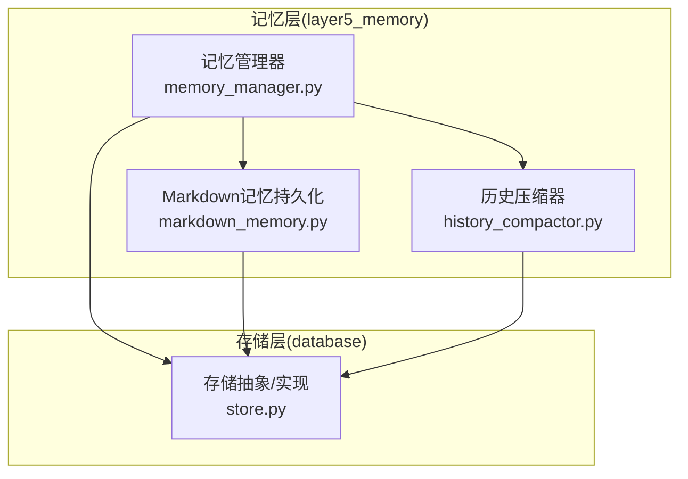
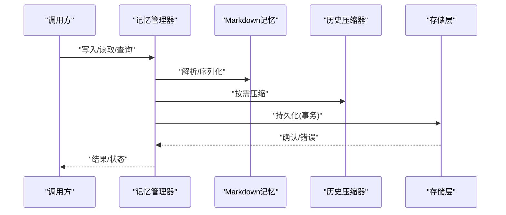
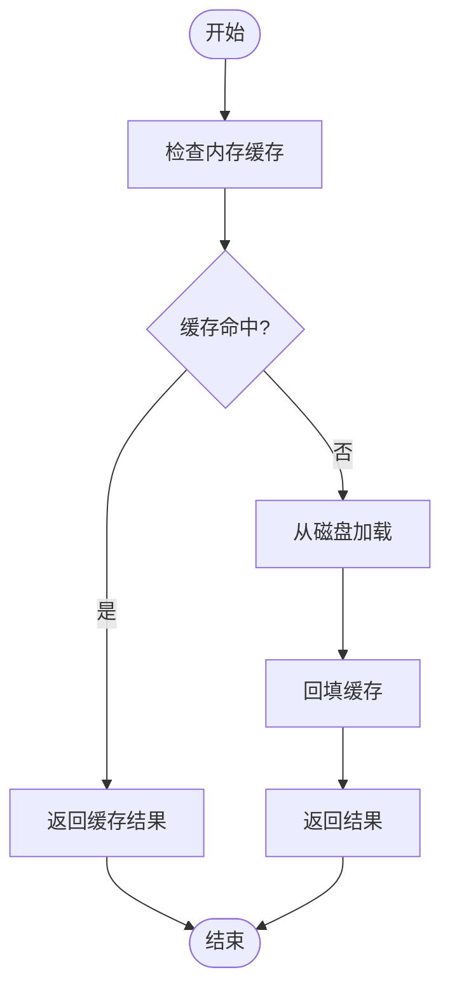
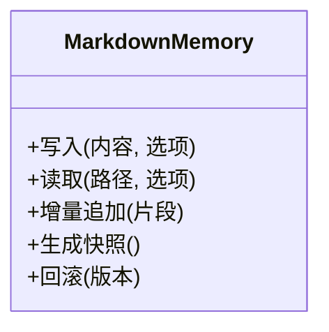
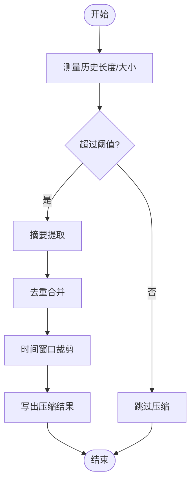
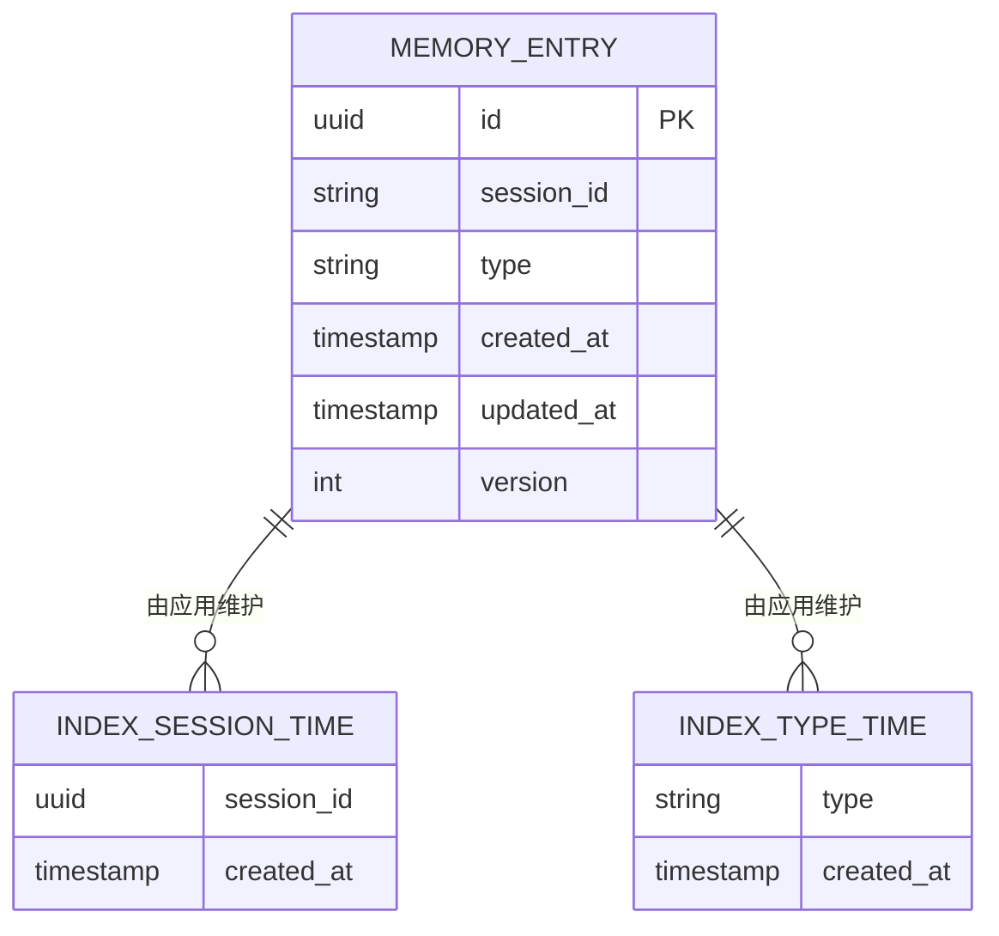
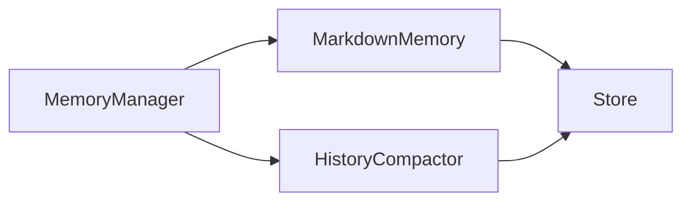

# 记忆存储系统

<cite>
**本文引用的文件**   
- [memory_manager.py](file://opc/layer5_memory/memory_manager.py)
- [markdown_memory.py](file://opc/layer5_memory/markdown_memory.py)
- [history_compactor.py](file://opc/layer5_memory/history_compactor.py)
- [store.py](file://opc/database/store.py)
- [test_runtime_v2_durable_memory.py](file://tests/test_runtime_v2_durable_memory.py)
</cite>

## 目录
1. [简介](#简介)
2. [项目结构](#项目结构)
3. [核心组件](#核心组件)
4. [架构总览](#架构总览)
5. [详细组件分析](#详细组件分析)
6. [依赖关系分析](#依赖关系分析)
7. [性能考量](#性能考量)
8. [故障排查指南](#故障排查指南)
9. [结论](#结论)
10. [附录](#附录)

## 简介
本技术文档聚焦于 OpenOPC 的记忆存储子系统，围绕 Markdown 记忆系统的文件结构设计、版本控制与增量更新机制展开，深入解析记忆管理器（MemoryManager）的读写策略、压缩算法与清理机制，并说明数据库存储层的设计要点（表结构定义、索引优化与查询调优）。文档同时提供数据持久化流程图、备份恢复策略、内存缓存与磁盘同步机制、数据一致性保证与故障恢复方案，以及使用记忆 API 进行高效数据操作的最佳实践。

## 项目结构
记忆存储相关代码主要位于 layer5_memory 与 database 两个层次：
- layer5_memory：实现记忆管理、Markdown 记忆持久化、历史压缩等能力
- database：封装底层存储接口（如 store.py），为上层提供统一的持久化访问

图表来源
- [memory_manager.py](file://opc/layer5_memory/memory_manager.py)
- [markdown_memory.py](file://opc/layer5_memory/markdown_memory.py)
- [history_compactor.py](file://opc/layer5_memory/history_compactor.py)
- [store.py](file://opc/database/store.py)

章节来源
- [memory_manager.py](file://opc/layer5_memory/memory_manager.py)
- [markdown_memory.py](file://opc/layer5_memory/markdown_memory.py)
- [history_compactor.py](file://opc/layer5_memory/history_compactor.py)
- [store.py](file://opc/database/store.py)

## 核心组件
- 记忆管理器（MemoryManager）
  - 职责：协调 Markdown 记忆文件的读写、版本控制、增量更新；触发压缩与清理；维护内存缓存与磁盘的一致性。
  - 关键能力：原子写入、并发安全、变更合并、回滚与恢复。
- Markdown 记忆持久化（MarkdownMemory）
  - 职责：将结构化记忆映射为 Markdown 文件组织形式；支持分块、元数据头、版本标记。
  - 关键能力：路径规划、增量追加、冲突检测、快照生成。
- 历史压缩器（HistoryCompactor）
  - 职责：对长历史进行压缩，保留关键信息，降低上下文窗口压力。
  - 关键能力：摘要提取、去重、时间窗口裁剪、阈值控制。
- 存储层（Store）
  - 职责：统一持久化接口，屏蔽具体后端差异（文件系统或数据库）。
  - 关键能力：事务性写入、索引构建、查询优化、迁移与校验。

章节来源
- [memory_manager.py](file://opc/layer5_memory/memory_manager.py)
- [markdown_memory.py](file://opc/layer5_memory/markdown_memory.py)
- [history_compactor.py](file://opc/layer5_memory/history_compactor.py)
- [store.py](file://opc/database/store.py)

## 架构总览
记忆系统采用“管理器 + 持久化 + 压缩 + 存储”的分层设计，确保高内聚低耦合与可扩展性。

图表来源
- [memory_manager.py](file://opc/layer5_memory/memory_manager.py)
- [markdown_memory.py](file://opc/layer5_memory/markdown_memory.py)
- [history_compactor.py](file://opc/layer5_memory/history_compactor.py)
- [store.py](file://opc/database/store.py)

## 详细组件分析

### 记忆管理器（MemoryManager）
- 读写策略
  - 写路径：先入内存缓存，再按策略落盘；支持增量追加与全量覆盖两种模式；失败时自动回滚。
  - 读路径：优先从内存缓存命中，未命中则从磁盘加载并回填缓存；支持分页与范围查询。
- 版本控制与增量更新
  - 通过版本号与时间戳双重标识；增量更新基于差异合并，避免重复写入。
  - 冲突检测：当检测到外部修改时，触发合并或拒绝写入策略。
- 压缩与清理
  - 压缩触发条件：历史长度超过阈值、上下文窗口接近上限、定时任务。
  - 清理策略：删除过期片段、归档旧版本、回收无用索引。
- 一致性保障
  - 原子写入：先写临时文件，再原子替换目标文件。
  - 事务语义：多步写入在失败时全部回滚。
  - 幂等性：相同输入多次写入不会产生副作用。

图表来源
- [memory_manager.py](file://opc/layer5_memory/memory_manager.py)

章节来源
- [memory_manager.py](file://opc/layer5_memory/memory_manager.py)

### Markdown 记忆持久化（MarkdownMemory）
- 文件结构设计
  - 根目录：按会话/实体维度划分。
  - 子目录：按类型（对话、配置、技能等）组织。
  - 文件命名：包含时间戳与版本号，便于回溯。
  - 头部元数据：记录版本、创建时间、更新时间、标签等。
- 增量更新机制
  - 追加模式：以追加方式写入新片段，保持历史连续性。
  - 合并模式：对重叠片段进行去重与合并，减少冗余。
- 快照与回滚
  - 定期生成快照文件，用于快速恢复。
  - 回滚到指定版本时，基于快照重建当前状态。

图表来源
- [markdown_memory.py](file://opc/layer5_memory/markdown_memory.py)

章节来源
- [markdown_memory.py](file://opc/layer5_memory/markdown_memory.py)

### 历史压缩器（HistoryCompactor）
- 压缩算法
  - 摘要提取：对长段落生成精简摘要，保留关键事实与结论。
  - 去重：识别并合并重复片段，降低体积。
  - 时间窗口裁剪：仅保留最近 N 条或最近 T 时间内的内容。
- 压缩策略
  - 阈值驱动：当历史长度或大小超过阈值时触发。
  - 渐进式：分批压缩，避免一次性大锁。
- 输出格式
  - 压缩后仍为 Markdown，但结构更紧凑，附带压缩元数据。

图表来源
- [history_compactor.py](file://opc/layer5_memory/history_compactor.py)

章节来源
- [history_compactor.py](file://opc/layer5_memory/history_compactor.py)

### 数据库存储层（Store）
- 设计目标
  - 统一接口：屏蔽文件系统与数据库差异。
  - 高性能：批量写入、索引优化、查询下推。
  - 可迁移：支持 schema 演进与数据校验。
- 表结构与索引（概念性说明）
  - 建议表：记忆条目（主键、会话ID、类型、时间戳、版本）、索引（会话ID+时间戳、类型+时间戳）。
  - 索引优化：复合索引覆盖常见查询；分区表按时间或会话划分。
- 查询性能调优
  - 分页与游标：避免全表扫描。
  - 预取与批处理：减少往返次数。
  - 物化视图/聚合表：加速热点查询。

图表来源
- [store.py](file://opc/database/store.py)

章节来源
- [store.py](file://opc/database/store.py)

## 依赖关系分析
- 组件耦合
  - MemoryManager 依赖 MarkdownMemory 与 HistoryCompactor，二者均依赖 Store。
  - Store 作为最底层抽象，被上层共同复用，提升内聚性。
- 外部依赖
  - 文件系统/数据库驱动：通过 Store 抽象隔离。
  - 日志与监控：贯穿各层，便于追踪与诊断。

图表来源
- [memory_manager.py](file://opc/layer5_memory/memory_manager.py)
- [markdown_memory.py](file://opc/layer5_memory/markdown_memory.py)
- [history_compactor.py](file://opc/layer5_memory/history_compactor.py)
- [store.py](file://opc/database/store.py)

章节来源
- [memory_manager.py](file://opc/layer5_memory/memory_manager.py)
- [markdown_memory.py](file://opc/layer5_memory/markdown_memory.py)
- [history_compactor.py](file://opc/layer5_memory/history_compactor.py)
- [store.py](file://opc/database/store.py)

## 性能考量
- 写入路径
  - 批量写入：合并小写入为大事务，减少 I/O 次数。
  - 异步落盘：非关键路径写入可异步执行，提高吞吐。
- 读取路径
  - 多级缓存：进程内缓存 + 本地磁盘缓存，命中率优先。
  - 分页与投影：只拉取必要字段，减少网络与序列化开销。
- 压缩与清理
  - 延迟压缩：仅在必要时触发，避免频繁计算。
  - 增量清理：按批次清理，避免长时间锁占用。
- 索引与查询
  - 复合索引：针对高频查询组合建立索引。
  - 查询下推：尽量在存储层完成过滤与排序。

[本节为通用性能指导，不直接分析具体文件]

## 故障排查指南
- 常见问题
  - 写入失败：检查原子替换是否成功、权限与磁盘空间。
  - 读取不一致：确认缓存失效策略与事务边界。
  - 压缩异常：查看压缩阈值与输入合法性。
- 定位方法
  - 启用详细日志：记录关键步骤与耗时。
  - 校验快照：对比快照与当前状态，定位差异。
  - 回放测试：使用测试用例复现问题。

章节来源
- [test_runtime_v2_durable_memory.py](file://tests/test_runtime_v2_durable_memory.py)

## 结论
OpenOPC 的记忆存储系统通过清晰的分层设计与严格的原子性与事务性约束，实现了高可靠、高性能的记忆持久化能力。Markdown 记忆的文件结构便于人类可读与机器解析，配合版本控制与增量更新，有效支撑了复杂场景下的上下文管理。历史压缩与清理机制进一步降低了资源消耗。建议在部署中结合监控与告警，持续优化索引与查询策略，确保系统在大规模数据下的稳定表现。

## 附录
- 使用记忆 API 的高效操作建议
  - 批量写入：合并多条写入为一次事务。
  - 分页查询：使用游标避免深分页。
  - 缓存预热：启动时预加载热点记忆。
  - 压缩时机：在低峰期执行压缩与清理。
  - 备份策略：定期快照 + 增量日志，支持时间点恢复。

[本节为通用实践建议，不直接分析具体文件]