# 架构设计

<cite>
**本文引用的文件**   
- [pyproject.toml](file://pyproject.toml)
- [README.md](file://README.md)
- [engine.py](file://opc/engine.py)
- [layer0_interaction/message_bus.py](file://opc/layer0_interaction/message_bus.py)
- [layer1_perception/context_assembler.py](file://opc/layer1_perception/context_assembler.py)
- [layer1_perception/context_loader.py](file://opc/layer1_perception/context_loader.py)
- [layer1_perception/task_router.py](file://opc/layer1_perception/task_router.py)
- [layer2_organization/org_engine.py](file://opc/layer2_organization/org_engine.py)
- [layer2_organization/company_runtime.py](file://opc/layer2_organization/company_runtime.py)
- [layer2_organization/work_item_runtime.py](file://opc/layer2_organization/work_item_runtime.py)
- [layer2_organization/gate_harness.py](file://opc/layer2_organization/gate_harness.py)
- [layer3_agent/native_agent.py](file://opc/layer3_agent/native_agent.py)
- [layer3_agent/runtime_v2/runtime.py](file://opc/layer3_agent/runtime_v2/runtime.py)
- [layer3_agent/adapters/registry.py](file://opc/layer3_agent/adapters/registry.py)
- [layer4_tools/agent_runtime.py](file://opc/layer4_tools/agent_runtime.py)
- [layer4_tools/file_ops.py](file://opc/layer4_tools/file_ops.py)
- [layer4_tools/git_ops.py](file://opc/layer4_tools/git_ops.py)
- [layer4_tools/python_exec.py](file://opc/layer4_tools/python_exec.py)
- [layer4_tools/shell.py](file://opc/layer4_tools/shell.py)
- [layer5_memory/markdown_memory.py](file://opc/layer5_memory/markdown_memory.py)
- [layer5_memory/memory_manager.py](file://opc/layer5_memory/memory_manager.py)
- [layer6_observability/opc_logger.py](file://opc/layer6_observability/opc_logger.py)
- [layer6_observability/cost_tracker.py](file://opc/layer6_observability/cost_tracker.py)
- [channels/base.py](file://opc/channels/base.py)
- [channels/manager.py](file://opc/channels/manager.py)
- [core/config.py](file://opc/core/config.py)
- [core/events.py](file://opc/core/events.py)
- [database/store.py](file://opc/database/store.py)
</cite>

## 目录
1. [引言](#引言)
2. [项目结构](#项目结构)
3. [核心组件](#核心组件)
4. [架构总览](#架构总览)
5. [详细组件分析](#详细组件分析)
6. [依赖关系分析](#依赖关系分析)
7. [性能考量](#性能考量)
8. [故障排查指南](#故障排查指南)
9. [结论](#结论)
10. [附录](#附录)

## 引言
本架构文档面向OpenOPC系统，围绕七层分层架构（交互层、感知层、组织管理层、代理层、工具层、记忆层、可观测性层）进行系统化说明。文档覆盖职责划分、关键设计模式（插件化、事件驱动、适配器）、组件依赖与数据流、系统边界、技术决策权衡与约束条件，并给出系统上下文图与组件分解图。同时涵盖安全性、监控与灾难恢复等横切关注点，以及技术栈选择、第三方依赖与版本兼容性要求。

## 项目结构
OpenOPC采用按“能力域+分层”的目录组织方式：
- 顶层入口与配置：engine.py负责启动编排；config下为多源配置；pyproject.toml声明依赖与元信息。
- 分层模块：layer0~layer6分别对应交互、感知、组织管理、代理、工具、记忆、可观测性。
- 渠道通道：channels提供多渠道接入与统一会话抽象。
- 核心基础：core提供配置、事件、模型等公共能力；database提供持久化存储。
- 插件与UI：plugins包含CLI看板与Office UI前端集成；skills_assets与skills为核心技能资产。
- 测试与脚本：tests覆盖单元、集成与端到端场景；scripts提供运维辅助脚本。

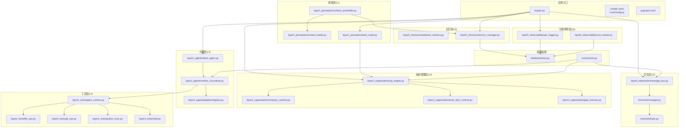

图表来源
- [engine.py](file://opc/engine.py)
- [layer0_interaction/message_bus.py](file://opc/layer0_interaction/message_bus.py)
- [channels/manager.py](file://opc/channels/manager.py)
- [channels/base.py](file://opc/channels/base.py)
- [layer1_perception/task_router.py](file://opc/layer1_perception/task_router.py)
- [layer1_perception/context_assembler.py](file://opc/layer1_perception/context_assembler.py)
- [layer1_perception/context_loader.py](file://opc/layer1_perception/context_loader.py)
- [layer2_organization/org_engine.py](file://opc/layer2_organization/org_engine.py)
- [layer2_organization/company_runtime.py](file://opc/layer2_organization/company_runtime.py)
- [layer2_organization/work_item_runtime.py](file://opc/layer2_organization/work_item_runtime.py)
- [layer2_organization/gate_harness.py](file://opc/layer2_organization/gate_harness.py)
- [layer3_agent/native_agent.py](file://opc/layer3_agent/native_agent.py)
- [layer3_agent/runtime_v2/runtime.py](file://opc/layer3_agent/runtime_v2/runtime.py)
- [layer3_agent/adapters/registry.py](file://opc/layer3_agent/adapters/registry.py)
- [layer4_tools/agent_runtime.py](file://opc/layer4_tools/agent_runtime.py)
- [layer4_tools/file_ops.py](file://opc/layer4_tools/file_ops.py)
- [layer4_tools/git_ops.py](file://opc/layer4_tools/git_ops.py)
- [layer4_tools/python_exec.py](file://opc/layer4_tools/python_exec.py)
- [layer4_tools/shell.py](file://opc/layer4_tools/shell.py)
- [layer5_memory/markdown_memory.py](file://opc/layer5_memory/markdown_memory.py)
- [layer5_memory/memory_manager.py](file://opc/layer5_memory/memory_manager.py)
- [layer6_observability/opc_logger.py](file://opc/layer6_observability/opc_logger.py)
- [layer6_observability/cost_tracker.py](file://opc/layer6_observability/cost_tracker.py)
- [database/store.py](file://opc/database/store.py)
- [core/events.py](file://opc/core/events.py)

章节来源
- [pyproject.toml](file://pyproject.toml)
- [README.md](file://README.md)
- [engine.py](file://opc/engine.py)

## 核心组件
- 交互层（L0）：消息总线与渠道管理器，屏蔽不同IM/协作平台差异，统一会话与会话路由。
- 感知层（L1）：上下文组装器与加载器负责构建任务上下文，任务路由器将请求分发到组织管理层。
- 组织管理层（L2）：公司运行时与工作项运行时协同工作，实现目标拆解、阶段推进、审批与升级策略、权限与安全门控。
- 代理层（L3）：原生代理与运行时v2协调外部LLM/代码执行环境，通过适配器注册表动态加载具体代理实现。
- 工具层（L4）：文件、Git、Python执行、Shell等安全沙箱化的工具集，由代理运行时调用。
- 记忆层（L5）：Markdown记忆与记忆管理器提供会话历史、偏好与技能的持久化与压缩。
- 可观测性层（L6）：日志与成本追踪贯穿各层，支撑审计与成本控制。

章节来源
- [layer0_interaction/message_bus.py](file://opc/layer0_interaction/message_bus.py)
- [channels/manager.py](file://opc/channels/manager.py)
- [layer1_perception/context_assembler.py](file://opc/layer1_perception/context_assembler.py)
- [layer1_perception/context_loader.py](file://opc/layer1_perception/context_loader.py)
- [layer1_perception/task_router.py](file://opc/layer1_perception/task_router.py)
- [layer2_organization/org_engine.py](file://opc/layer2_organization/org_engine.py)
- [layer2_organization/company_runtime.py](file://opc/layer2_organization/company_runtime.py)
- [layer2_organization/work_item_runtime.py](file://opc/layer2_organization/work_item_runtime.py)
- [layer2_organization/gate_harness.py](file://opc/layer2_organization/gate_harness.py)
- [layer3_agent/native_agent.py](file://opc/layer3_agent/native_agent.py)
- [layer3_agent/runtime_v2/runtime.py](file://opc/layer3_agent/runtime_v2/runtime.py)
- [layer3_agent/adapters/registry.py](file://opc/layer3_agent/adapters/registry.py)
- [layer4_tools/agent_runtime.py](file://opc/layer4_tools/agent_runtime.py)
- [layer4_tools/file_ops.py](file://opc/layer4_tools/file_ops.py)
- [layer4_tools/git_ops.py](file://opc/layer4_tools/git_ops.py)
- [layer4_tools/python_exec.py](file://opc/layer4_tools/python_exec.py)
- [layer4_tools/shell.py](file://opc/layer4_tools/shell.py)
- [layer5_memory/markdown_memory.py](file://opc/layer5_memory/markdown_memory.py)
- [layer5_memory/memory_manager.py](file://opc/layer5_memory/memory_manager.py)
- [layer6_observability/opc_logger.py](file://opc/layer6_observability/opc_logger.py)
- [layer6_observability/cost_tracker.py](file://opc/layer6_observability/cost_tracker.py)

## 架构总览
OpenOPC采用分层解耦与事件驱动的混合架构：
- 分层解耦：每层仅依赖其下一层或横向服务（如事件、配置、存储），避免跨层耦合。
- 事件驱动：核心事件总线在各层之间传递状态变更与进度，降低同步耦合。
- 插件化：渠道、代理适配器、工具均通过注册表机制动态发现与加载。
- 适配器模式：对外部LLM/代码执行环境与不同IM平台的差异通过适配器封装。

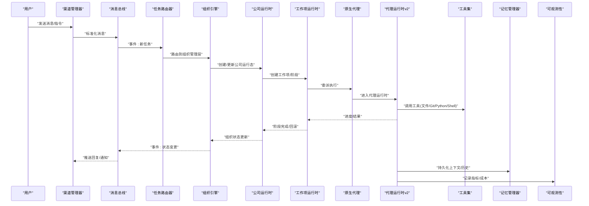

图表来源
- [channels/manager.py](file://opc/channels/manager.py)
- [layer0_interaction/message_bus.py](file://opc/layer0_interaction/message_bus.py)
- [layer1_perception/task_router.py](file://opc/layer1_perception/task_router.py)
- [layer2_organization/org_engine.py](file://opc/layer2_organization/org_engine.py)
- [layer2_organization/company_runtime.py](file://opc/layer2_organization/company_runtime.py)
- [layer2_organization/work_item_runtime.py](file://opc/layer2_organization/work_item_runtime.py)
- [layer3_agent/native_agent.py](file://opc/layer3_agent/native_agent.py)
- [layer3_agent/runtime_v2/runtime.py](file://opc/layer3_agent/runtime_v2/runtime.py)
- [layer4_tools/agent_runtime.py](file://opc/layer4_tools/agent_runtime.py)
- [layer5_memory/memory_manager.py](file://opc/layer5_memory/memory_manager.py)
- [layer6_observability/opc_logger.py](file://opc/layer6_observability/opc_logger.py)

## 详细组件分析

### 交互层（L0）：消息总线与渠道
- 职责：统一接入多渠道（聊天/协作平台），标准化消息格式，维护会话生命周期，向感知层派发任务。
- 关键设计：
  - 渠道基类定义统一接口，具体渠道实现差异化协议。
  - 渠道管理器集中注册与调度，支持热插拔。
  - 消息总线基于事件驱动，解耦上游输入与下游处理。
- 数据流：外部消息→渠道适配→消息总线→感知层路由。

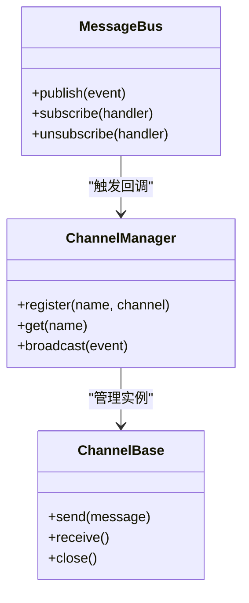

图表来源
- [channels/base.py](file://opc/channels/base.py)
- [channels/manager.py](file://opc/channels/manager.py)
- [layer0_interaction/message_bus.py](file://opc/layer0_interaction/message_bus.py)

章节来源
- [channels/base.py](file://opc/channels/base.py)
- [channels/manager.py](file://opc/channels/manager.py)
- [layer0_interaction/message_bus.py](file://opc/layer0_interaction/message_bus.py)

### 感知层（L1）：上下文组装与任务路由
- 职责：从记忆层与外部输入构建任务上下文，依据策略将任务路由至组织管理层。
- 关键设计：
  - 上下文加载器读取会话历史、偏好与相关工件。
  - 上下文组装器融合多源信息形成结构化上下文视图。
  - 任务路由器根据意图、优先级与资源可用性决定目标工作项或角色。
- 数据流：消息总线→上下文加载→上下文组装→任务路由→组织管理层。

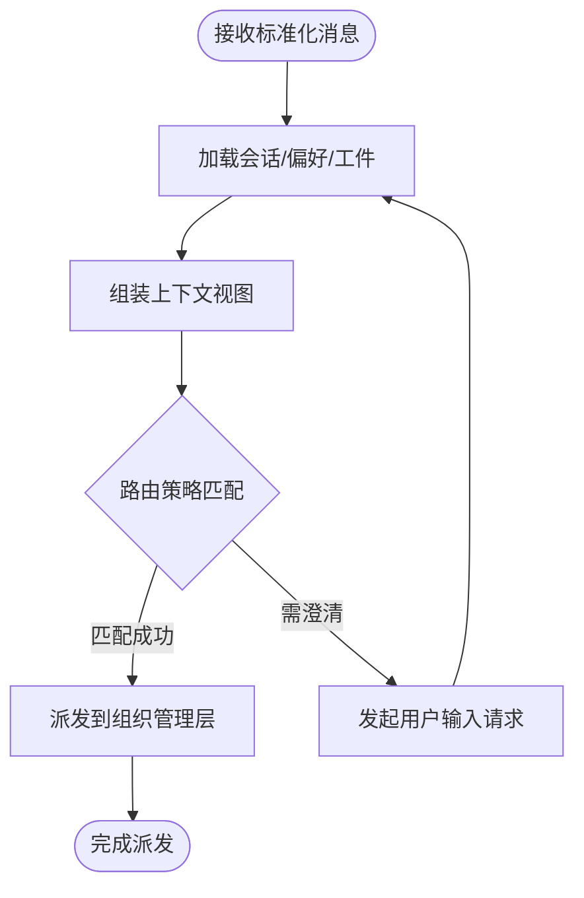

图表来源
- [layer1_perception/context_loader.py](file://opc/layer1_perception/context_loader.py)
- [layer1_perception/context_assembler.py](file://opc/layer1_perception/context_assembler.py)
- [layer1_perception/task_router.py](file://opc/layer1_perception/task_router.py)

章节来源
- [layer1_perception/context_loader.py](file://opc/layer1_perception/context_loader.py)
- [layer1_perception/context_assembler.py](file://opc/layer1_perception/context_assembler.py)
- [layer1_perception/task_router.py](file://opc/layer1_perception/task_router.py)

### 组织管理层（L2）：公司运行时与工作项运行时
- 职责：维护组织级目标与结构，管理工作项生命周期（创建、规划、执行、评审、交付），实施审批与升级策略，保障阶段不变式。
- 关键设计：
  - 公司运行时维护全局状态与策略（如协作策略、数据获取策略）。
  - 工作项运行时聚焦单任务的状态机与钩子，确保阶段转换一致性。
  - 门禁护栏在关键路径上执行安全检查与合规校验。
- 数据流：感知层→组织引擎→公司/工作项运行时→事件广播→记忆层持久化。

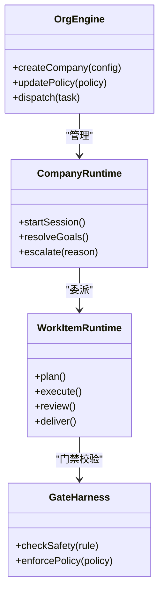

图表来源
- [layer2_organization/org_engine.py](file://opc/layer2_organization/org_engine.py)
- [layer2_organization/company_runtime.py](file://opc/layer2_organization/company_runtime.py)
- [layer2_organization/work_item_runtime.py](file://opc/layer2_organization/work_item_runtime.py)
- [layer2_organization/gate_harness.py](file://opc/layer2_organization/gate_harness.py)

章节来源
- [layer2_organization/org_engine.py](file://opc/layer2_organization/org_engine.py)
- [layer2_organization/company_runtime.py](file://opc/layer2_organization/company_runtime.py)
- [layer2_organization/work_item_runtime.py](file://opc/layer2_organization/work_item_runtime.py)
- [layer2_organization/gate_harness.py](file://opc/layer2_organization/gate_harness.py)

### 代理层（L3）：原生代理与运行时v2
- 职责：协调外部LLM与代码执行环境，管理提示工程、工具编排、子代理与流式执行。
- 关键设计：
  - 原生代理作为高层入口，封装会话与身份。
  - 运行时v2提供权限控制、工具计划器、流式工具执行、工作树隔离。
  - 适配器注册表支持动态加载多种外部代理实现（如Claude Code、Codex、Cursor等）。
- 数据流：组织管理层→原生代理→运行时v2→工具层→记忆层/可观测性层。

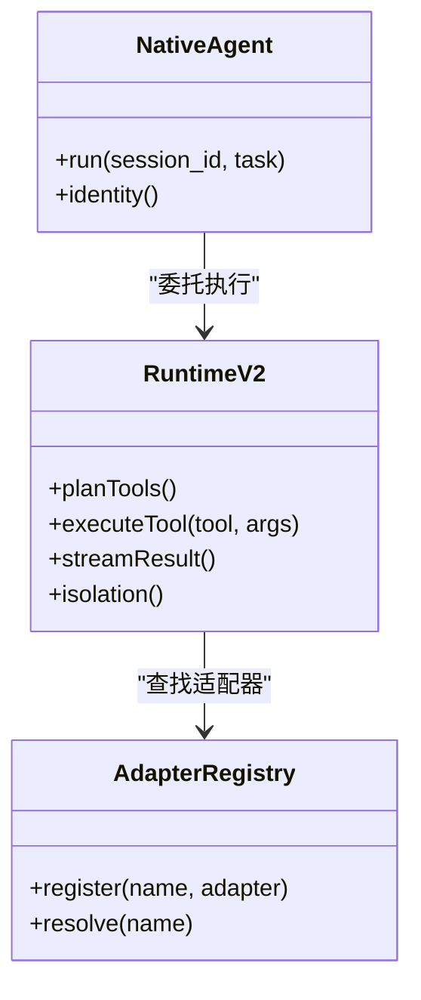

图表来源
- [layer3_agent/native_agent.py](file://opc/layer3_agent/native_agent.py)
- [layer3_agent/runtime_v2/runtime.py](file://opc/layer3_agent/runtime_v2/runtime.py)
- [layer3_agent/adapters/registry.py](file://opc/layer3_agent/adapters/registry.py)

章节来源
- [layer3_agent/native_agent.py](file://opc/layer3_agent/native_agent.py)
- [layer3_agent/runtime_v2/runtime.py](file://opc/layer3_agent/runtime_v2/runtime.py)
- [layer3_agent/adapters/registry.py](file://opc/layer3_agent/adapters/registry.py)

### 工具层（L4）：安全沙箱化工具集
- 职责：提供文件系统、Git、Python执行、Shell等受控操作能力，供代理运行时调用。
- 关键设计：
  - 工具通过统一运行时接口暴露，限制访问范围与资源配额。
  - 对危险操作进行白名单与审计，结合门禁护栏进行前置检查。
- 数据流：代理运行时→工具运行时→具体工具实现→文件系统/进程/网络。

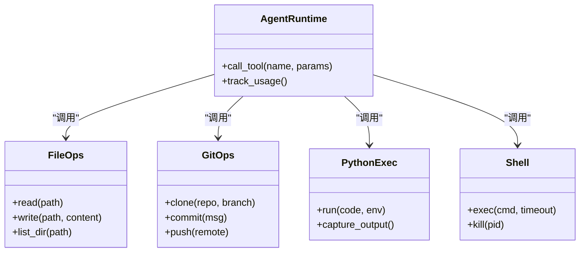

图表来源
- [layer4_tools/agent_runtime.py](file://opc/layer4_tools/agent_runtime.py)
- [layer4_tools/file_ops.py](file://opc/layer4_tools/file_ops.py)
- [layer4_tools/git_ops.py](file://opc/layer4_tools/git_ops.py)
- [layer4_tools/python_exec.py](file://opc/layer4_tools/python_exec.py)
- [layer4_tools/shell.py](file://opc/layer4_tools/shell.py)

章节来源
- [layer4_tools/agent_runtime.py](file://opc/layer4_tools/agent_runtime.py)
- [layer4_tools/file_ops.py](file://opc/layer4_tools/file_ops.py)
- [layer4_tools/git_ops.py](file://opc/layer4_tools/git_ops.py)
- [layer4_tools/python_exec.py](file://opc/layer4_tools/python_exec.py)
- [layer4_tools/shell.py](file://opc/layer4_tools/shell.py)

### 记忆层（L5）：Markdown记忆与记忆管理
- 职责：持久化会话历史、上下文片段、偏好与技能库，提供压缩与检索能力。
- 关键设计：
  - Markdown记忆以可读文本形式保存，便于人类审阅与迁移。
  - 记忆管理器负责索引、合并、清理与版本化。
- 数据流：代理运行时/组织管理层→记忆管理器→Markdown存储→数据库（可选）。

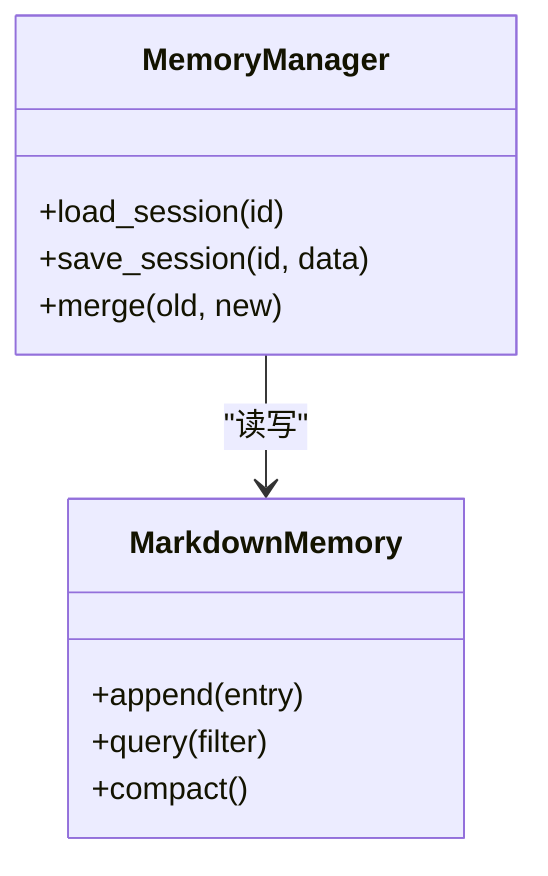

图表来源
- [layer5_memory/markdown_memory.py](file://opc/layer5_memory/markdown_memory.py)
- [layer5_memory/memory_manager.py](file://opc/layer5_memory/memory_manager.py)

章节来源
- [layer5_memory/markdown_memory.py](file://opc/layer5_memory/markdown_memory.py)
- [layer5_memory/memory_manager.py](file://opc/layer5_memory/memory_manager.py)

### 可观测性层（L6）：日志与成本追踪
- 职责：采集系统运行日志、指标与成本数据，支撑审计、排障与预算控制。
- 关键设计：
  - 统一日志门面，输出结构化日志。
  - 成本追踪聚合LLM调用与工具使用开销。
- 数据流：各层→日志门面→存储/导出；代理运行时→成本追踪→存储。

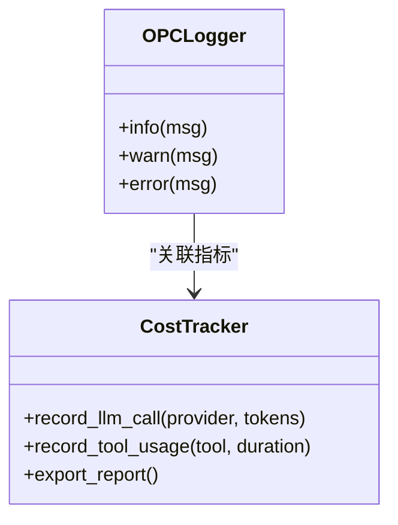

图表来源
- [layer6_observability/opc_logger.py](file://opc/layer6_observability/opc_logger.py)
- [layer6_observability/cost_tracker.py](file://opc/layer6_observability/cost_tracker.py)

章节来源
- [layer6_observability/opc_logger.py](file://opc/layer6_observability/opc_logger.py)
- [layer6_observability/cost_tracker.py](file://opc/layer6_observability/cost_tracker.py)

### 概念总览
下图展示OpenOPC的系统上下文，包括外部渠道、内部分层、存储与可观测性。

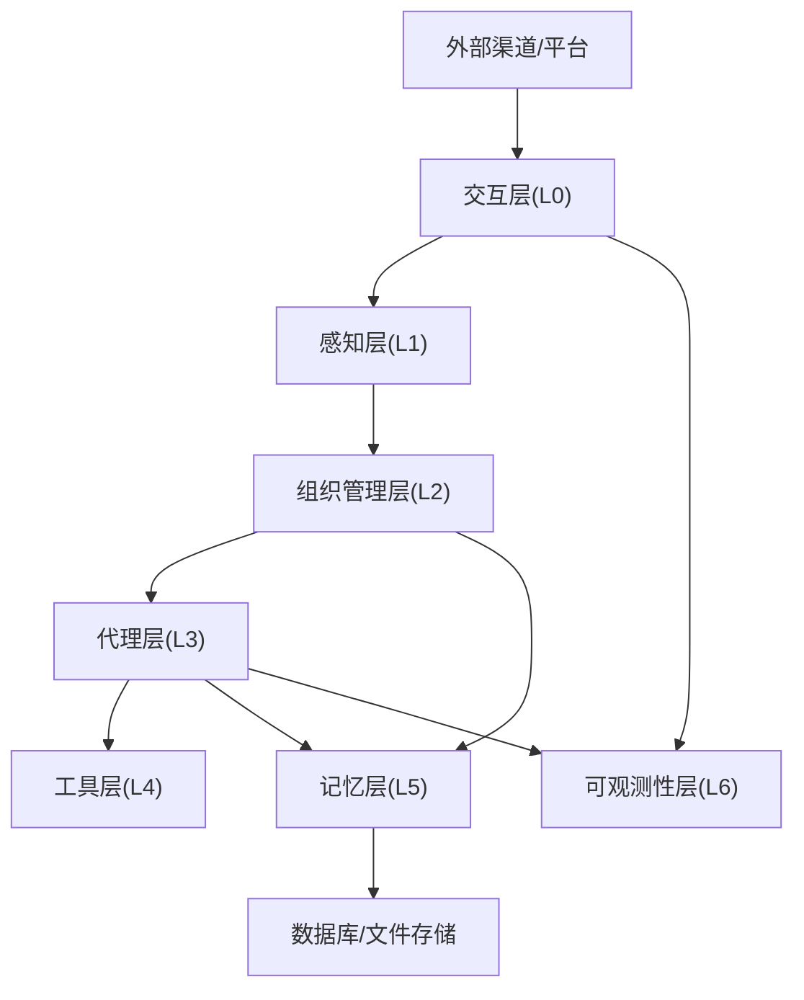

[此图为概念性上下文图，不直接映射具体源码文件]

## 依赖关系分析
- 内聚与耦合：
  - 层间单向依赖，L0→L1→L2→L3→L4，L3/L2可访问L5/L6。
  - 事件总线与配置中心作为横向依赖，降低耦合度。
- 外部依赖：
  - 渠道SDK、LLM提供商SDK、Git/Shell/Python执行环境。
  - 存储后端（文件/数据库）与日志/指标导出。
- 潜在循环依赖：
  - 通过事件与接口抽象避免L2↔L3直接循环。
  - 工具层不反向依赖上层，保持纯功能特性。

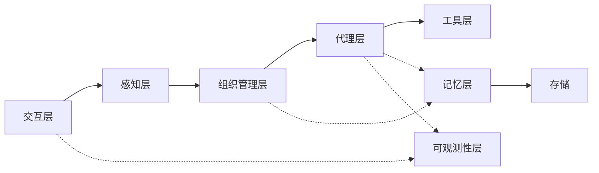

图表来源
- [layer0_interaction/message_bus.py](file://opc/layer0_interaction/message_bus.py)
- [layer1_perception/task_router.py](file://opc/layer1_perception/task_router.py)
- [layer2_organization/org_engine.py](file://opc/layer2_organization/org_engine.py)
- [layer3_agent/runtime_v2/runtime.py](file://opc/layer3_agent/runtime_v2/runtime.py)
- [layer4_tools/agent_runtime.py](file://opc/layer4_tools/agent_runtime.py)
- [layer5_memory/memory_manager.py](file://opc/layer5_memory/memory_manager.py)
- [layer6_observability/opc_logger.py](file://opc/layer6_observability/opc_logger.py)

章节来源
- [core/events.py](file://opc/core/events.py)
- [core/config.py](file://opc/core/config.py)
- [database/store.py](file://opc/database/store.py)

## 性能考量
- 异步与流式：代理运行时v2支持流式工具执行与结果推送，减少长尾延迟。
- 上下文压缩：记忆层提供历史压缩与摘要，降低上下文窗口压力。
- 缓存与复用：渠道与适配器注册表缓存实例，减少初始化开销。
- 资源隔离：工具执行沙箱限制CPU/内存/IO，防止资源争用。
- 批处理与节流：批量写入记忆与日志，避免频繁I/O。

[本节为通用指导，不直接分析具体文件]

## 故障排查指南
- 渠道连接问题：
  - 检查渠道管理器注册与认证配置，确认消息总线订阅正常。
- 任务未路由：
  - 验证感知层上下文是否完整，任务路由策略是否匹配。
- 组织状态不一致：
  - 检查工作项运行时阶段转换钩子与门禁护栏日志，定位失败原因。
- 代理执行异常：
  - 查看代理运行时v2的工具计划与执行日志，确认适配器可用性与权限。
- 工具执行失败：
  - 检查沙箱隔离策略、命令白名单与超时设置。
- 记忆丢失或损坏：
  - 核对Markdown记忆条目完整性与记忆管理器合并逻辑。
- 可观测性缺失：
  - 确认日志门面与成本追踪已启用，存储后端可达。

章节来源
- [layer0_interaction/message_bus.py](file://opc/layer0_interaction/message_bus.py)
- [layer1_perception/task_router.py](file://opc/layer1_perception/task_router.py)
- [layer2_organization/work_item_runtime.py](file://opc/layer2_organization/work_item_runtime.py)
- [layer2_organization/gate_harness.py](file://opc/layer2_organization/gate_harness.py)
- [layer3_agent/runtime_v2/runtime.py](file://opc/layer3_agent/runtime_v2/runtime.py)
- [layer4_tools/agent_runtime.py](file://opc/layer4_tools/agent_runtime.py)
- [layer5_memory/markdown_memory.py](file://opc/layer5_memory/markdown_memory.py)
- [layer6_observability/opc_logger.py](file://opc/layer6_observability/opc_logger.py)

## 结论
OpenOPC通过清晰的分层与事件驱动架构，实现了高内聚低耦合的可扩展系统。插件化与适配器模式使渠道与代理能力易于扩展，组织管理层与工作项运行时保障了复杂任务的可靠执行。记忆层与可观测性层提供了持久化与审计能力。整体设计在安全性、监控与可恢复性方面具备良好基础，适合在企业环境中部署与演进。

[本节为总结性内容，不直接分析具体文件]

## 附录

### 系统边界与约束
- 系统边界：
  - 外部：多渠道平台、LLM提供商、Git仓库、操作系统Shell/Python解释器、存储后端。
  - 内部：分层模块、事件总线、配置中心、记忆与可观测性。
- 约束条件：
  - 工具执行需在沙箱中运行，遵循白名单与配额。
  - 敏感操作需经门禁护栏与审批流程。
  - 上下文大小受限于LLM提供商窗口，需压缩与裁剪。

[本节为概念性内容，不直接分析具体文件]

### 技术决策与权衡
- 插件化 vs 硬编码：提升扩展性但增加注册与版本管理复杂度。
- 事件驱动 vs 同步调用：降低耦合与提高吞吐，但需处理顺序与幂等。
- Markdown记忆 vs 结构化存储：可读性强、迁移方便，但查询效率较低。
- 流式执行 vs 批处理：改善用户体验，但需处理中间状态与错误恢复。

[本节为概念性内容，不直接分析具体文件]

### 横切关注点
- 安全性：
  - 门禁护栏与审批流程；工具白名单与资源配额；会话隔离与最小权限。
- 监控：
  - 统一日志门面与成本追踪；关键路径埋点与告警。
- 灾难恢复：
  - 记忆层快照与增量备份；工作项状态持久化与重试；渠道重连与退避。

[本节为概念性内容，不直接分析具体文件]

### 技术栈与依赖
- 语言与框架：Python生态，基于模块化包管理与依赖声明。
- 渠道SDK：多平台通信库（如钉钉、飞书、Slack、Telegram等）。
- LLM SDK：多家大模型提供商客户端。
- 存储：文件（Markdown）与数据库（可选）。
- 执行环境：Git、Shell、Python解释器。

章节来源
- [pyproject.toml](file://pyproject.toml)
- [README.md](file://README.md)