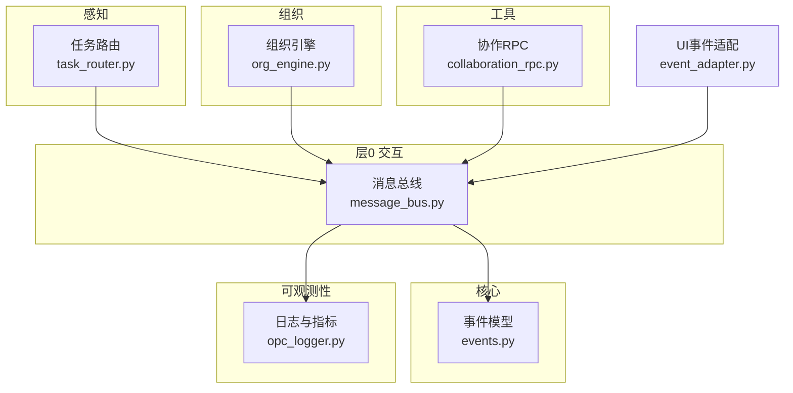
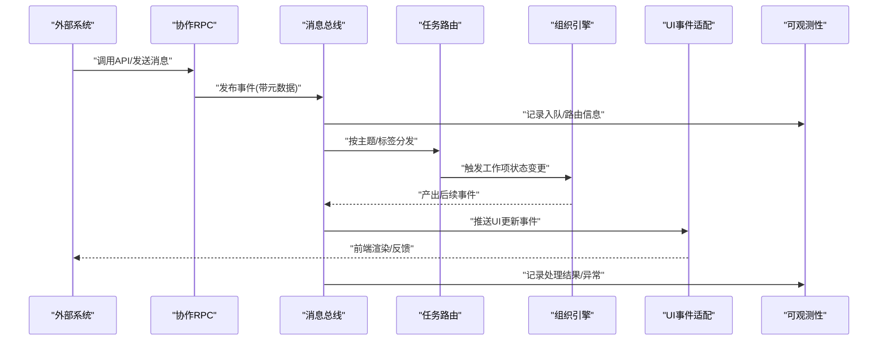
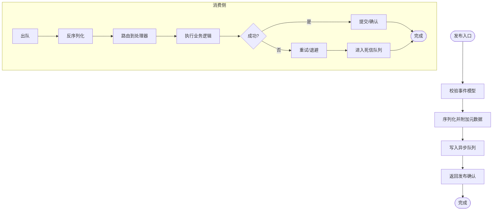
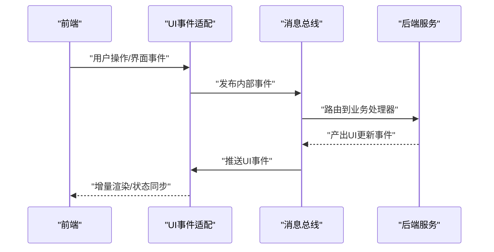
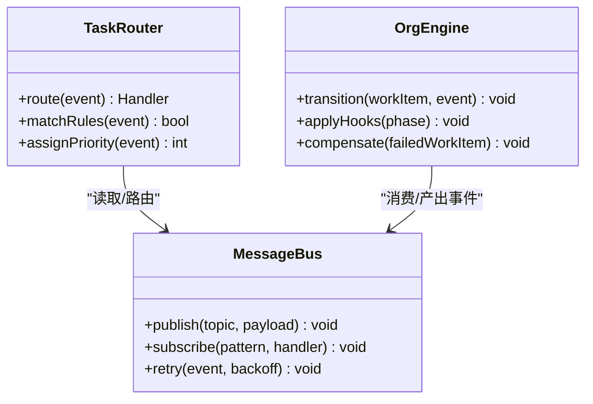
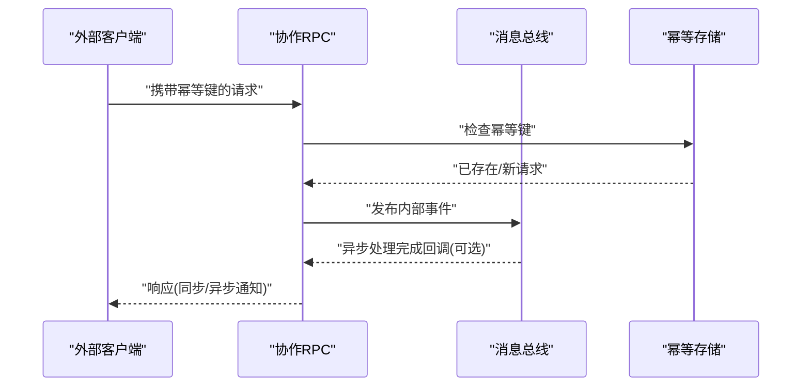
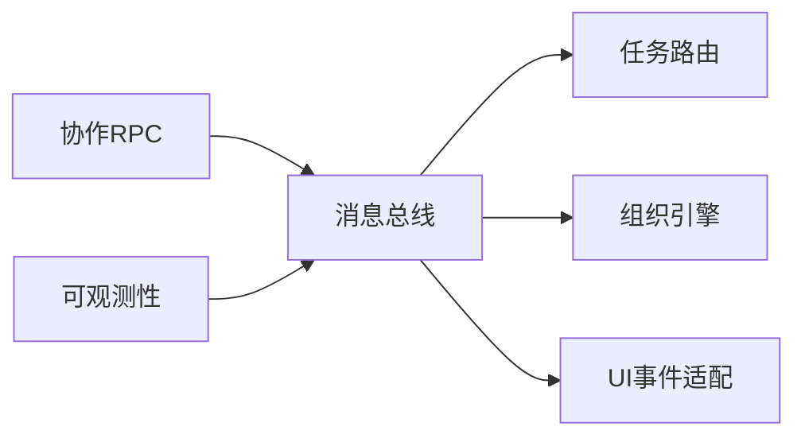

# 事件驱动模式

<cite>
**本文引用的文件**   
- [layer0_interaction/message_bus.py](file://opc/layer0_interaction/message_bus.py)
- [core/events.py](file://opc/core/events.py)
- [plugins/office_ui/event_adapter.py](file://opc/plugins/office_ui/event_adapter.py)
- [layer1_perception/task_router.py](file://opc/layer1_perception/task_router.py)
- [layer2_organization/org_engine.py](file://opc/layer2_organization/org_engine.py)
- [layer4_tools/collaboration_rpc.py](file://opc/layer4_tools/collaboration_rpc.py)
- [layer6_observability/opc_logger.py](file://opc/layer6_observability/opc_logger.py)
</cite>

## 目录
1. [简介](#简介)
2. [项目结构](#项目结构)
3. [核心组件](#核心组件)
4. [架构总览](#架构总览)
5. [详细组件分析](#详细组件分析)
6. [依赖关系分析](#依赖关系分析)
7. [性能考虑](#性能考虑)
8. [故障排查指南](#故障排查指南)
9. [结论](#结论)
10. [附录](#附录)

## 简介
本技术文档聚焦于 OpenOPC 的事件驱动模式，围绕事件总线（MessageBus）的设计与实现展开，系统阐述事件的发布订阅机制、异步消息传递与路由策略。文档同时覆盖事件类型定义、序列化格式、跨进程通信协议、自定义事件注册与处理、复杂事件流编排、持久化与重试、以及故障恢复策略，并提供性能调优与调试技巧，帮助读者在工程实践中高效构建可靠的事件驱动系统。

## 项目结构
OpenOPC 将事件相关能力分层组织：
- 层0交互层：提供统一的消息总线抽象与实现，承载发布/订阅、路由与队列等基础能力。
- 核心层：定义事件模型、通用工具与运行时契约。
- 感知层：基于事件进行任务分发与上下文组装。
- 组织层：通过事件协调组织内工作项流转与状态变更。
- 工具层：对外暴露协作 RPC 接口，桥接外部系统与内部事件总线。
- 可观测性层：记录事件生命周期日志与指标，支撑排障与监控。

图表来源
- [layer0_interaction/message_bus.py](file://opc/layer0_interaction/message_bus.py)
- [core/events.py](file://opc/core/events.py)
- [layer1_perception/task_router.py](file://opc/layer1_perception/task_router.py)
- [layer2_organization/org_engine.py](file://opc/layer2_organization/org_engine.py)
- [layer4_tools/collaboration_rpc.py](file://opc/layer4_tools/collaboration_rpc.py)
- [plugins/office_ui/event_adapter.py](file://opc/plugins/office_ui/event_adapter.py)
- [layer6_observability/opc_logger.py](file://opc/layer6_observability/opc_logger.py)

章节来源
- [layer0_interaction/message_bus.py](file://opc/layer0_interaction/message_bus.py)
- [core/events.py](file://opc/core/events.py)
- [layer1_perception/task_router.py](file://opc/layer1_perception/task_router.py)
- [layer2_organization/org_engine.py](file://opc/layer2_organization/org_engine.py)
- [layer4_tools/collaboration_rpc.py](file://opc/layer4_tools/collaboration_rpc.py)
- [plugins/office_ui/event_adapter.py](file://opc/plugins/office_ui/event_adapter.py)
- [layer6_observability/opc_logger.py](file://opc/layer6_observability/opc_logger.py)

## 核心组件
- 消息总线（MessageBus）
  - 职责：提供统一的发布/订阅接口、事件路由、队列与并发控制、错误上报与可观测性埋点。
  - 关键能力：按主题或标签路由、异步投递、顺序保证（可选）、重试与死信、背压与限流。
- 事件模型（Event Model）
  - 职责：定义事件类型、字段规范、版本兼容与序列化/反序列化契约。
  - 关键能力：强类型约束、元数据扩展、校验与默认值、向后兼容策略。
- UI 事件适配（Event Adapter）
  - 职责：将前端 UI 事件转换为内部事件模型，或将内部事件推送至 UI。
  - 关键能力：双向映射、增量更新、去抖与合并。
- 任务路由（Task Router）
  - 职责：根据事件语义与上下文选择执行者或下一跳处理器。
  - 关键能力：规则匹配、优先级、动态扩缩容感知。
- 组织引擎（Org Engine）
  - 职责：以事件为纽带驱动工作项状态机与阶段转换。
  - 关键能力：幂等处理、事务边界、补偿与回滚。
- 协作 RPC（Collaboration RPC）
  - 职责：对外暴露 RPC 接口，桥接外部系统到内部事件总线。
  - 关键能力：鉴权、限流、序列化协议、超时与重试。
- 可观测性（Logging & Metrics）
  - 职责：记录事件全链路追踪、耗时、失败率与告警。
  - 关键能力：结构化日志、采样、分布式追踪 ID 透传。

章节来源
- [layer0_interaction/message_bus.py](file://opc/layer0_interaction/message_bus.py)
- [core/events.py](file://opc/core/events.py)
- [plugins/office_ui/event_adapter.py](file://opc/plugins/office_ui/event_adapter.py)
- [layer1_perception/task_router.py](file://opc/layer1_perception/task_router.py)
- [layer2_organization/org_engine.py](file://opc/layer2_organization/org_engine.py)
- [layer4_tools/collaboration_rpc.py](file://opc/layer4_tools/collaboration_rpc.py)
- [layer6_observability/opc_logger.py](file://opc/layer6_observability/opc_logger.py)

## 架构总览
下图展示了事件从产生到消费的全链路：外部系统通过协作 RPC 进入消息总线，经任务路由选择处理器，组织引擎驱动工作项流转，UI 适配层同步展示，所有环节由可观测性层记录。

图表来源
- [layer4_tools/collaboration_rpc.py](file://opc/layer4_tools/collaboration_rpc.py)
- [layer0_interaction/message_bus.py](file://opc/layer0_interaction/message_bus.py)
- [layer1_perception/task_router.py](file://opc/layer1_perception/task_router.py)
- [layer2_organization/org_engine.py](file://opc/layer2_organization/org_engine.py)
- [plugins/office_ui/event_adapter.py](file://opc/plugins/office_ui/event_adapter.py)
- [layer6_observability/opc_logger.py](file://opc/layer6_observability/opc_logger.py)

## 详细组件分析

### 消息总线（MessageBus）设计与实现
- 设计要点
  - 发布/订阅：支持按主题订阅、通配符匹配、标签过滤；生产者仅关注发布，消费者仅关注订阅，松耦合。
  - 异步投递：内部采用异步队列与调度器，避免阻塞主流程；支持批量投递与批处理。
  - 路由策略：基于主题/标签的静态路由与基于内容的动态路由结合；支持优先级与权重。
  - 可靠性：至少一次投递、幂等消费、重试与退避、死信队列与人工干预入口。
  - 可观测性：事件ID透传、端到端耗时、失败计数、慢消费者检测。
- 关键流程
  - 发布：校验事件模型 -> 序列化 -> 写入队列 -> 记录日志 -> 返回确认。
  - 消费：拉取事件 -> 反序列化 -> 路由到处理器 -> 执行业务逻辑 -> 提交结果/异常 -> 记录日志。
  - 重试与恢复：指数退避、最大重试次数、死信归档、补偿动作。

图表来源
- [layer0_interaction/message_bus.py](file://opc/layer0_interaction/message_bus.py)
- [core/events.py](file://opc/core/events.py)
- [layer6_observability/opc_logger.py](file://opc/layer6_observability/opc_logger.py)

章节来源
- [layer0_interaction/message_bus.py](file://opc/layer0_interaction/message_bus.py)
- [core/events.py](file://opc/core/events.py)
- [layer6_observability/opc_logger.py](file://opc/layer6_observability/opc_logger.py)

### 事件模型与序列化
- 事件类型定义
  - 使用统一基类/命名空间区分领域事件与系统事件。
  - 每个事件包含：唯一标识、时间戳、来源、目标、版本、负载、扩展元数据。
- 序列化格式
  - 二进制/JSON 双通道：开发调试用 JSON，生产环境可用更高效的二进制编码。
  - 版本兼容：新增字段保持向后兼容，废弃字段标记弃用期。
- 校验与约束
  - 必填字段、枚举值、长度限制、正则表达式、业务规则校验。
- 示例路径（不展示代码内容）
  - 定义事件类型与字段约束：[core/events.py](file://opc/core/events.py)
  - 序列化/反序列化工具与版本策略：[core/events.py](file://opc/core/events.py)

章节来源
- [core/events.py](file://opc/core/events.py)

### UI 事件适配层
- 职责
  - 将前端 UI 事件转换为内部事件模型，或将内部事件推送到前端。
  - 负责去抖、合并、增量更新，降低网络与渲染压力。
- 典型流程
  - 前端操作 -> 适配层封装为内部事件 -> 发布到消息总线 -> 后端处理 -> 生成 UI 事件 -> 推送前端。

图表来源
- [plugins/office_ui/event_adapter.py](file://opc/plugins/office_ui/event_adapter.py)
- [layer0_interaction/message_bus.py](file://opc/layer0_interaction/message_bus.py)

章节来源
- [plugins/office_ui/event_adapter.py](file://opc/plugins/office_ui/event_adapter.py)
- [layer0_interaction/message_bus.py](file://opc/layer0_interaction/message_bus.py)

### 任务路由与组织引擎协同
- 任务路由
  - 根据事件主题、标签、上下文选择处理器或下一跳。
  - 支持规则引擎与权重分配，便于灰度与A/B测试。
- 组织引擎
  - 以事件驱动工作项状态机，确保幂等与一致性。
  - 阶段钩子与补偿机制保障长事务的可靠性。

图表来源
- [layer1_perception/task_router.py](file://opc/layer1_perception/task_router.py)
- [layer2_organization/org_engine.py](file://opc/layer2_organization/org_engine.py)
- [layer0_interaction/message_bus.py](file://opc/layer0_interaction/message_bus.py)

章节来源
- [layer1_perception/task_router.py](file://opc/layer1_perception/task_router.py)
- [layer2_organization/org_engine.py](file://opc/layer2_organization/org_engine.py)
- [layer0_interaction/message_bus.py](file://opc/layer0_interaction/message_bus.py)

### 协作 RPC 与跨进程通信
- 职责
  - 对外暴露 RPC 接口，接收外部系统请求，将其转换为内部事件并发布到消息总线。
  - 负责鉴权、限流、超时、重试与错误码映射。
- 跨进程协议
  - 传输协议：HTTP/gRPC（依据部署配置）。
  - 序列化：JSON/Protobuf（依据性能与兼容性需求）。
  - 安全：TLS、签名、令牌校验。
  - 幂等：客户端幂等键与服务端去重表。

图表来源
- [layer4_tools/collaboration_rpc.py](file://opc/layer4_tools/collaboration_rpc.py)
- [layer0_interaction/message_bus.py](file://opc/layer0_interaction/message_bus.py)

章节来源
- [layer4_tools/collaboration_rpc.py](file://opc/layer4_tools/collaboration_rpc.py)
- [layer0_interaction/message_bus.py](file://opc/layer0_interaction/message_bus.py)

### 自定义事件与处理器注册
- 定义自定义事件
  - 在事件模型中声明新事件类型与字段，遵循版本兼容策略。
  - 参考路径：[core/events.py](file://opc/core/events.py)
- 注册事件处理器
  - 在消息总线中按主题/标签注册处理器函数或类方法。
  - 参考路径：[layer0_interaction/message_bus.py](file://opc/layer0_interaction/message_bus.py)
- 处理复杂事件流
  - 组合多个事件形成聚合视图，使用窗口与聚合算子。
  - 参考路径：[layer0_interaction/message_bus.py](file://opc/layer0_interaction/message_bus.py)

章节来源
- [core/events.py](file://opc/core/events.py)
- [layer0_interaction/message_bus.py](file://opc/layer0_interaction/message_bus.py)

### 事件持久化、重试与故障恢复
- 持久化
  - 事件落盘：入队前持久化，确保崩溃恢复后不丢失。
  - 消费位点：记录已处理事件偏移量，支持断点续跑。
  - 参考路径：[layer0_interaction/message_bus.py](file://opc/layer0_interaction/message_bus.py)
- 重试机制
  - 指数退避、抖动、最大重试次数、死信队列。
  - 参考路径：[layer0_interaction/message_bus.py](file://opc/layer0_interaction/message_bus.py)
- 故障恢复
  - 自动重启消费者、重新路由、补偿动作、人工介入面板。
  - 参考路径：[layer0_interaction/message_bus.py](file://opc/layer0_interaction/message_bus.py)

章节来源
- [layer0_interaction/message_bus.py](file://opc/layer0_interaction/message_bus.py)

## 依赖关系分析
- 组件耦合
  - 消息总线为核心枢纽，其他组件通过事件与其解耦。
  - UI 适配层与协作 RPC 作为边界适配器，屏蔽外部差异。
- 直接依赖
  - 任务路由依赖消息总线进行分发。
  - 组织引擎消费消息总线事件并产出后续事件。
  - 可观测性层监听消息总线日志与指标。
- 潜在循环依赖
  - 通过事件而非直接调用避免循环依赖。
- 外部依赖
  - 传输协议与序列化库、持久化存储、监控与告警平台。

图表来源
- [layer0_interaction/message_bus.py](file://opc/layer0_interaction/message_bus.py)
- [layer1_perception/task_router.py](file://opc/layer1_perception/task_router.py)
- [layer2_organization/org_engine.py](file://opc/layer2_organization/org_engine.py)
- [plugins/office_ui/event_adapter.py](file://opc/plugins/office_ui/event_adapter.py)
- [layer4_tools/collaboration_rpc.py](file://opc/layer4_tools/collaboration_rpc.py)
- [layer6_observability/opc_logger.py](file://opc/layer6_observability/opc_logger.py)

章节来源
- [layer0_interaction/message_bus.py](file://opc/layer0_interaction/message_bus.py)
- [layer1_perception/task_router.py](file://opc/layer1_perception/task_router.py)
- [layer2_organization/org_engine.py](file://opc/layer2_organization/org_engine.py)
- [plugins/office_ui/event_adapter.py](file://opc/plugins/office_ui/event_adapter.py)
- [layer4_tools/collaboration_rpc.py](file://opc/layer4_tools/collaboration_rpc.py)
- [layer6_observability/opc_logger.py](file://opc/layer6_observability/opc_logger.py)

## 性能考虑
- 吞吐与延迟
  - 批量投递与批处理减少系统调用开销。
  - 异步非阻塞 I/O，避免热点路径阻塞。
- 背压与限流
  - 消费者速率控制，防止雪崩。
  - 生产者限速与降级策略。
- 序列化与压缩
  - 生产环境优先使用高效二进制编码。
  - 大负载分片与压缩传输。
- 路由优化
  - 预计算路由表，减少匹配开销。
  - 热点主题分区与多副本并行消费。
- 资源隔离
  - 处理器线程池/进程池隔离，避免相互影响。
- 监控与采样
  - 关键路径全量记录，次要路径采样记录。
  - 慢查询与慢消费者告警。

[本节为通用指导，无需特定文件引用]

## 故障排查指南
- 常见问题定位
  - 事件未到达：检查发布确认、队列积压、路由规则。
  - 处理失败：查看重试次数、死信队列、处理器异常堆栈。
  - 重复消费：核对幂等键与去重表。
  - 性能退化：观察序列化大小、路由匹配成本、消费者速率。
- 诊断手段
  - 启用结构化日志与分布式追踪 ID。
  - 导出事件快照与回放，复现问题。
  - 使用只读副本进行离线分析。
- 参考路径
  - 日志与指标输出：[layer6_observability/opc_logger.py](file://opc/layer6_observability/opc_logger.py)
  - 重试与死信逻辑：[layer0_interaction/message_bus.py](file://opc/layer0_interaction/message_bus.py)

章节来源
- [layer6_observability/opc_logger.py](file://opc/layer6_observability/opc_logger.py)
- [layer0_interaction/message_bus.py](file://opc/layer0_interaction/message_bus.py)

## 结论
OpenOPC 的事件驱动模式以消息总线为核心，通过清晰的分层与解耦设计，实现了高内聚、低耦合的可扩展架构。事件模型与序列化保证了跨进程通信的一致性与兼容性；任务路由与组织引擎协同驱动业务流程；UI 适配层提升了用户体验；可观测性贯穿全链路，保障系统的可维护性与稳定性。在生产环境中，应结合性能调优与故障恢复策略，持续优化系统表现。

[本节为总结性内容，无需特定文件引用]

## 附录
- 术语
  - 事件：描述系统中发生的重要事实的数据对象。
  - 发布/订阅：生产者发布事件，消费者订阅感兴趣的主题。
  - 幂等：同一事件多次处理不会产生副作用。
  - 死信队列：无法处理的事件归档位置，供人工干预。
- 最佳实践
  - 事件命名与版本管理：明确领域边界，保持向后兼容。
  - 处理器幂等设计：基于事件ID去重，避免重复处理。
  - 可观测性先行：在事件生命周期各阶段埋点。
  - 渐进式演进：先小流量验证，再逐步放量。

[本节为概念性内容，无需特定文件引用]