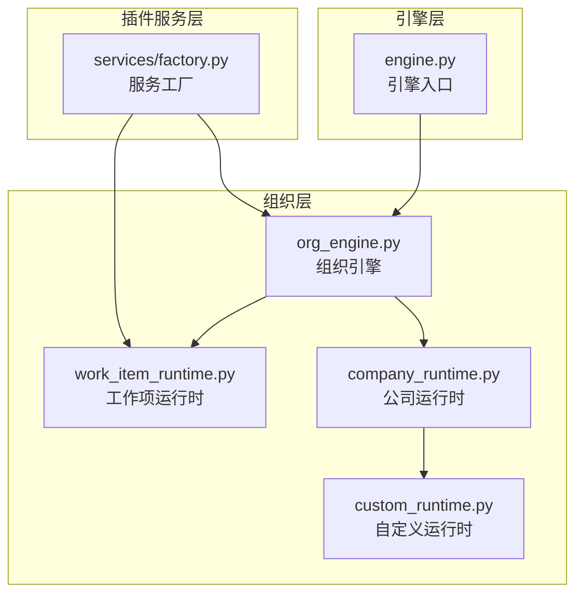
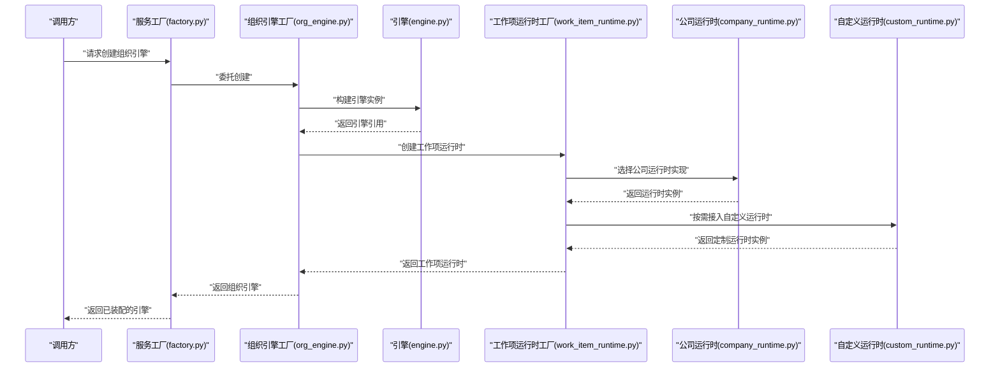
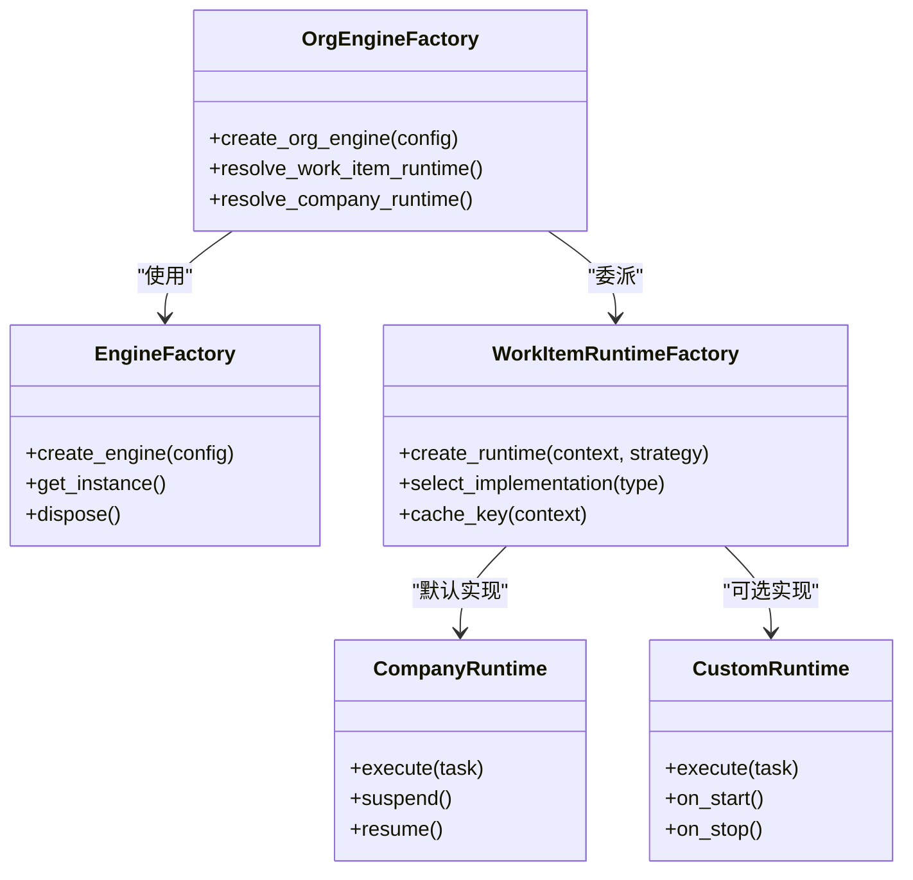
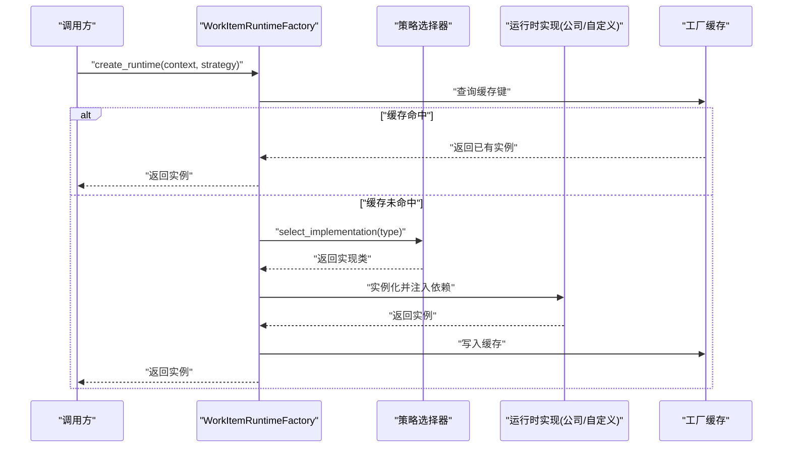
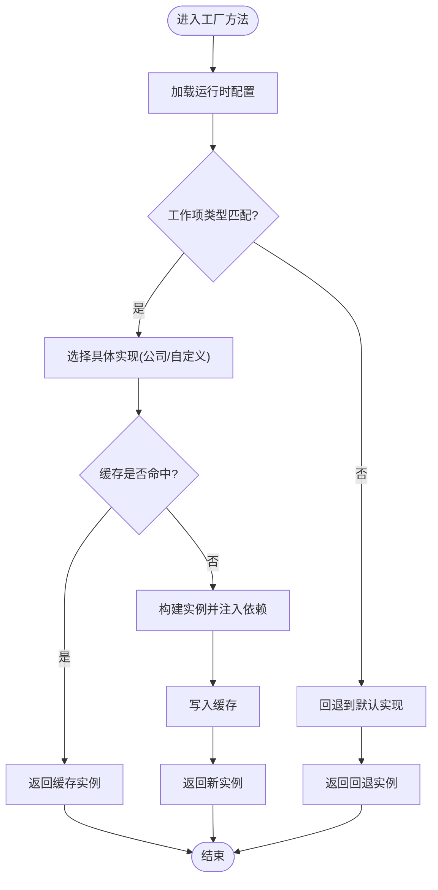
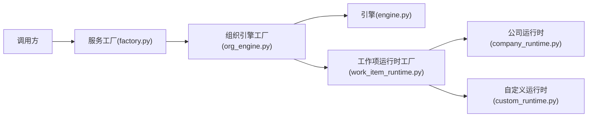

# 工厂模式

<cite>
**本文引用的文件**   
- [engine.py](file://opc/engine.py)
- [org_engine.py](file://opc/layer2_organization/org_engine.py)
- [work_item_runtime.py](file://opc/layer2_organization/work_item_runtime.py)
- [company_runtime.py](file://opc/layer2_organization/company_runtime.py)
- [custom_runtime.py](file://opc/layer2_organization/custom_runtime.py)
- [factory.py](file://opc/plugins/office_ui/services/factory.py)
</cite>

## 目录
1. [简介](#简介)
2. [项目结构](#项目结构)
3. [核心组件](#核心组件)
4. [架构总览](#架构总览)
5. [详细组件分析](#详细组件分析)
6. [依赖关系分析](#依赖关系分析)
7. [性能考虑](#性能考虑)
8. [故障排查指南](#故障排查指南)
9. [结论](#结论)
10. [附录](#附录)

## 简介
本技术文档聚焦于OpenOPC中的工厂模式实践，围绕EngineFactory、OrgEngineFactory与WorkItemRuntimeFactory等核心工厂类展开。文档解释如何通过统一的工厂方法简化复杂对象的初始化过程，支持运行时配置与条件创建；并阐述工厂缓存机制、依赖解析与生命周期管理策略。同时提供扩展新工厂类型与自定义对象创建逻辑的实践建议，以及面向生产环境的最佳实践与性能优化要点。

## 项目结构
OpenOPC采用分层组织方式，工厂相关能力主要分布在以下位置：
- 引擎层：负责整体运行期引擎的创建与装配
- 组织层：负责组织级引擎与工作项运行时的创建与编排
- 插件服务层：Office UI插件中通过服务工厂对外暴露统一创建入口

图表来源
- [engine.py](file://opc/engine.py)
- [org_engine.py](file://opc/layer2_organization/org_engine.py)
- [work_item_runtime.py](file://opc/layer2_organization/work_item_runtime.py)
- [company_runtime.py](file://opc/layer2_organization/company_runtime.py)
- [custom_runtime.py](file://opc/layer2_organization/custom_runtime.py)
- [factory.py](file://opc/plugins/office_ui/services/factory.py)

章节来源
- [engine.py](file://opc/engine.py)
- [org_engine.py](file://opc/layer2_organization/org_engine.py)
- [work_item_runtime.py](file://opc/layer2_organization/work_item_runtime.py)
- [company_runtime.py](file://opc/layer2_organization/company_runtime.py)
- [custom_runtime.py](file://opc/layer2_organization/custom_runtime.py)
- [factory.py](file://opc/plugins/office_ui/services/factory.py)

## 核心组件
本节概述三大核心工厂的职责与协作关系：
- EngineFactory：封装引擎实例的创建与装配，屏蔽底层依赖细节，提供一致的创建接口
- OrgEngineFactory：基于组织配置创建组织级引擎，协调工作项运行时与公司运行时
- WorkItemRuntimeFactory：按工作项上下文与策略创建具体运行时实例，支持条件化与可插拔实现

这些工厂共同构成“创建即装配”的统一入口，使上层调用无需关心具体构造参数与依赖注入顺序。

章节来源
- [org_engine.py](file://opc/layer2_organization/org_engine.py)
- [work_item_runtime.py](file://opc/layer2_organization/work_item_runtime.py)
- [company_runtime.py](file://opc/layer2_organization/company_runtime.py)
- [custom_runtime.py](file://opc/layer2_organization/custom_runtime.py)
- [factory.py](file://opc/plugins/office_ui/services/factory.py)

## 架构总览
下图展示从外部调用到内部工厂创建的端到端流程，包括配置加载、依赖解析、条件分支与缓存命中路径。

图表来源
- [factory.py](file://opc/plugins/office_ui/services/factory.py)
- [org_engine.py](file://opc/layer2_organization/org_engine.py)
- [engine.py](file://opc/engine.py)
- [work_item_runtime.py](file://opc/layer2_organization/work_item_runtime.py)
- [company_runtime.py](file://opc/layer2_organization/company_runtime.py)
- [custom_runtime.py](file://opc/layer2_organization/custom_runtime.py)

## 详细组件分析

### 工厂基类与通用职责
- 统一创建接口：所有工厂暴露一致的创建方法，隐藏构造细节
- 配置驱动：根据运行时配置决定创建策略（如启用特性、切换实现）
- 依赖注入：在工厂内部完成依赖组装，避免调用方感知复杂依赖树
- 缓存与复用：对昂贵对象进行缓存，减少重复创建开销
- 生命周期管理：提供启动、停止、清理等钩子，确保资源正确释放

章节来源
- [org_engine.py](file://opc/layer2_organization/org_engine.py)
- [work_item_runtime.py](file://opc/layer2_organization/work_item_runtime.py)
- [company_runtime.py](file://opc/layer2_organization/company_runtime.py)
- [custom_runtime.py](file://opc/layer2_organization/custom_runtime.py)
- [factory.py](file://opc/plugins/office_ui/services/factory.py)

### EngineFactory（引擎工厂）
- 职责：负责引擎实例的创建与基础依赖装配
- 关键点：
  - 读取系统配置，确定引擎行为开关
  - 将日志、存储、网络等基础设施注入引擎
  - 提供单例或作用域内的复用策略
- 适用场景：应用启动阶段一次性创建全局引擎

章节来源
- [engine.py](file://opc/engine.py)
- [org_engine.py](file://opc/layer2_organization/org_engine.py)

### OrgEngineFactory（组织引擎工厂）
- 职责：基于组织配置创建组织级引擎，协调工作项运行时与公司运行时
- 关键点：
  - 解析组织配置，选择合适的工作项规划器与执行器
  - 维护组织内会话、角色与权限上下文
  - 与插件服务工厂对接，为UI层提供统一入口
- 适用场景：多租户或多组织隔离的运行环境

章节来源
- [org_engine.py](file://opc/layer2_organization/org_engine.py)
- [factory.py](file://opc/plugins/office_ui/services/factory.py)

### WorkItemRuntimeFactory（工作项运行时工厂）
- 职责：按工作项上下文与策略创建具体运行时实例
- 关键点：
  - 依据工作项类型、优先级与约束条件选择运行时实现
  - 支持公司运行时与自定义运行时动态切换
  - 对运行时实例进行轻量缓存，避免频繁重建
- 适用场景：任务调度、异步执行、长时运行任务

章节来源
- [work_item_runtime.py](file://opc/layer2_organization/work_item_runtime.py)
- [company_runtime.py](file://opc/layer2_organization/company_runtime.py)
- [custom_runtime.py](file://opc/layer2_organization/custom_runtime.py)

### 工厂类关系图

图表来源
- [org_engine.py](file://opc/layer2_organization/org_engine.py)
- [work_item_runtime.py](file://opc/layer2_organization/work_item_runtime.py)
- [company_runtime.py](file://opc/layer2_organization/company_runtime.py)
- [custom_runtime.py](file://opc/layer2_organization/custom_runtime.py)

### 工厂方法序列图（以创建工作项运行为例）

图表来源
- [work_item_runtime.py](file://opc/layer2_organization/work_item_runtime.py)
- [company_runtime.py](file://opc/layer2_organization/company_runtime.py)
- [custom_runtime.py](file://opc/layer2_organization/custom_runtime.py)

### 条件创建流程图（基于配置与上下文）

图表来源
- [work_item_runtime.py](file://opc/layer2_organization/work_item_runtime.py)
- [company_runtime.py](file://opc/layer2_organization/company_runtime.py)
- [custom_runtime.py](file://opc/layer2_organization/custom_runtime.py)

## 依赖关系分析
- 松耦合：工厂作为中间层，屏蔽具体实现的依赖细节，降低调用方耦合度
- 可插拔：通过策略选择器与注册表机制，支持运行时切换不同实现
- 单一职责：每个工厂专注一类对象的创建与装配，职责清晰
- 可扩展：新增工厂类型只需遵循统一接口，并在适当位置注册

图表来源
- [factory.py](file://opc/plugins/office_ui/services/factory.py)
- [org_engine.py](file://opc/layer2_organization/org_engine.py)
- [engine.py](file://opc/engine.py)
- [work_item_runtime.py](file://opc/layer2_organization/work_item_runtime.py)
- [company_runtime.py](file://opc/layer2_organization/company_runtime.py)
- [custom_runtime.py](file://opc/layer2_organization/custom_runtime.py)

章节来源
- [factory.py](file://opc/plugins/office_ui/services/factory.py)
- [org_engine.py](file://opc/layer2_organization/org_engine.py)
- [engine.py](file://opc/engine.py)
- [work_item_runtime.py](file://opc/layer2_organization/work_item_runtime.py)
- [company_runtime.py](file://opc/layer2_organization/company_runtime.py)
- [custom_runtime.py](file://opc/layer2_organization/custom_runtime.py)

## 性能考虑
- 缓存策略：对昂贵对象（如运行时实例）进行缓存，避免重复创建；合理设计缓存键，确保作用域隔离
- 延迟初始化：仅在首次使用时创建依赖，缩短启动时间
- 批量装配：在工厂内部合并多次依赖注入，减少往返开销
- 并发安全：在高并发场景下，使用线程安全的缓存结构与锁机制
- 资源回收：提供明确的销毁与清理接口，防止内存泄漏

[本节为通用指导，不直接分析具体文件]

## 故障排查指南
- 常见问题
  - 配置缺失或不合法导致工厂无法选择实现
  - 缓存键冲突造成实例错配
  - 依赖注入失败引发运行时异常
- 定位步骤
  - 检查工厂方法的输入参数与配置项
  - 查看缓存命中情况与键生成逻辑
  - 确认依赖是否已正确注册并可被解析
- 恢复措施
  - 重置缓存或清理过期条目
  - 修正配置后重试创建
  - 增加更详细的日志输出以便追踪

章节来源
- [org_engine.py](file://opc/layer2_organization/org_engine.py)
- [work_item_runtime.py](file://opc/layer2_organization/work_item_runtime.py)
- [factory.py](file://opc/plugins/office_ui/services/factory.py)

## 结论
OpenOPC通过EngineFactory、OrgEngineFactory与WorkItemRuntimeFactory等工厂类，构建了统一、可配置且可扩展的对象创建体系。借助工厂缓存、依赖注入与条件选择机制，系统在保持松耦合的同时提升了运行效率与可维护性。遵循本文的最佳实践与优化建议，可在保证稳定性的前提下持续演进工厂能力。

[本节为总结性内容，不直接分析具体文件]

## 附录
- 扩展新工厂类型的步骤
  - 定义统一的创建接口与生命周期钩子
  - 在相应层级注册新工厂（如服务工厂或组织引擎工厂）
  - 实现条件选择逻辑与缓存键生成规则
  - 编写单元测试覆盖正常路径与异常路径
- 自定义对象创建逻辑的建议
  - 将复杂构造拆分为多个小工厂，组合使用
  - 使用策略模式替换硬编码的条件分支
  - 引入配置驱动与特性开关，便于灰度发布

[本节为概念性指导，不直接分析具体文件]