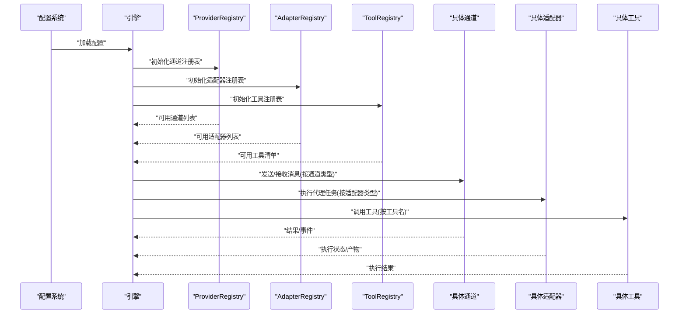
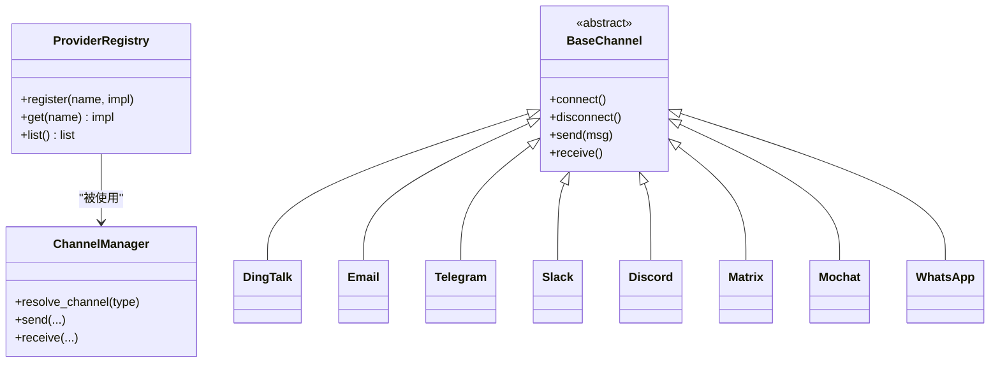
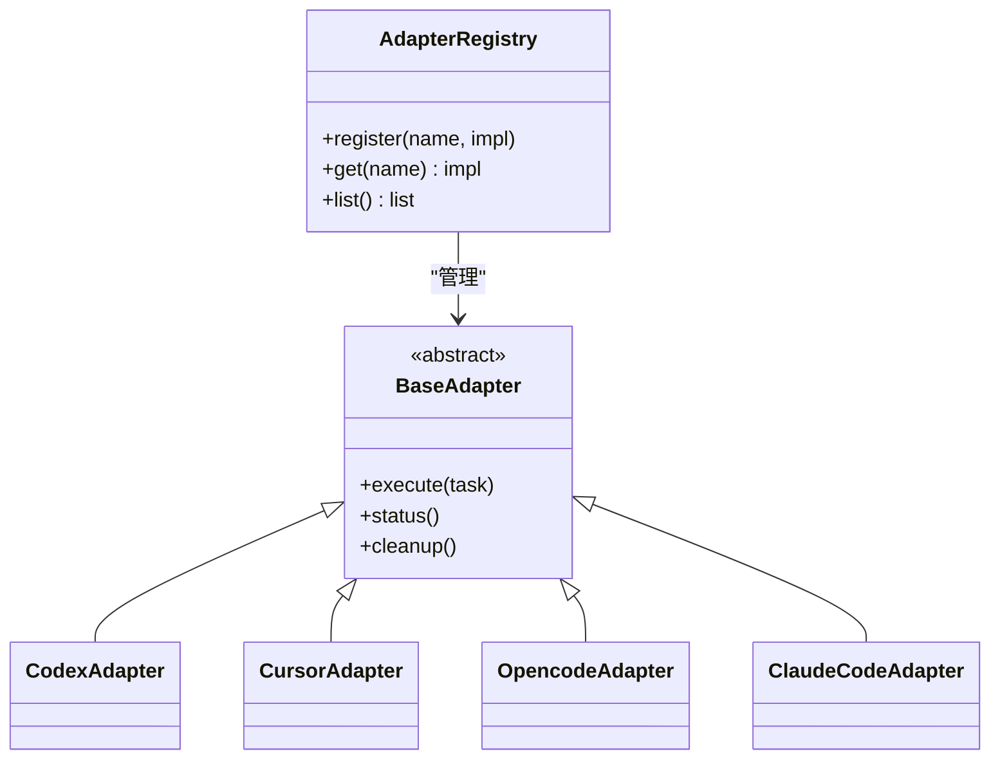
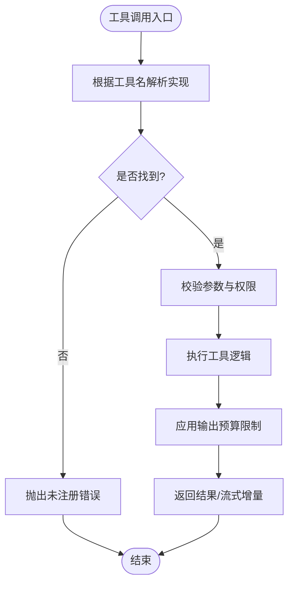
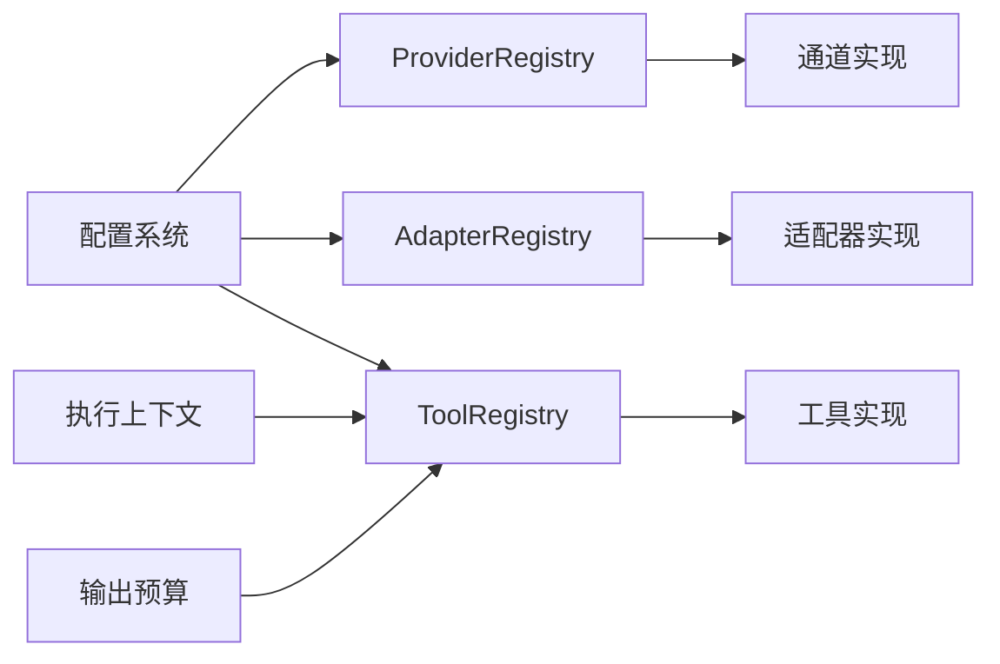

# 插件化架构模式

<cite>
**本文引用的文件**   
- [opc/channels/provider_registry.py](file://opc/channels/provider_registry.py)
- [opc/channels/manager.py](file://opc/channels/manager.py)
- [opc/channels/base.py](file://opc/channels/base.py)
- [opc/channels/provider_base.py](file://opc/channels/provider_base.py)
- [opc/channels/dingtalk.py](file://opc/channels/dingtalk.py)
- [opc/channels/email.py](file://opc/channels/email.py)
- [opc/channels/telegram.py](file://opc/channels/telegram.py)
- [opc/channels/slack.py](file://opc/channels/slack.py)
- [opc/channels/discord.py](file://opc/channels/discord.py)
- [opc/channels/matrix.py](file://opc/channels/matrix.py)
- [opc/channels/mochat.py](file://opc/channels/mochat.py)
- [opc/channels/whatsapp.py](file://opc/channels/whatsapp.py)
- [opc/channels/__init__.py](file://opc/channels/__init__.py)
- [opc/core/config.py](file://opc/core/config.py)
- [opc/layer3_agent/adapters/registry.py](file://opc/layer3_agent/adapters/registry.py)
- [opc/layer3_agent/adapters/base.py](file://opc/layer3_agent/adapters/base.py)
- [opc/layer3_agent/adapters/codex_adapter.py](file://opc/layer3_agent/adapters/codex_adapter.py)
- [opc/layer3_agent/adapters/cursor_adapter.py](file://opc/layer3_agent/adapters/cursor_adapter.py)
- [opc/layer3_agent/adapters/opencode_adapter.py](file://opc/layer3_agent/adapters/opencode_adapter.py)
- [opc/layer3_agent/adapters/claude_code.py](file://opc/layer3_agent/adapters/claude_code.py)
- [opc/layer4_tools/registry.py](file://opc/layer4_tools/registry.py)
- [opc/layer4_tools/file_ops.py](file://opc/layer4_tools/file_ops.py)
- [opc/layer4_tools/git_ops.py](file://opc/layer4_tools/git_ops.py)
- [opc/layer4_tools/shell.py](file://opc/layer4_tools/shell.py)
- [opc/layer4_tools/python_exec.py](file://opc/layer4_tools/python_exec.py)
- [opc/layer4_tools/web_search.py](file://opc/layer4_tools/web_search.py)
- [opc/layer4_tools/browser.py](file://opc/layer4_tools/browser.py)
- [opc/layer4_tools/todo.py](file://opc/layer4_tools/todo.py)
- [opc/layer4_tools/user_input.py](file://opc/layer4_tools/user_input.py)
- [opc/layer4_tools/collaboration.py](file://opc/layer4_tools/collaboration.py)
- [opc/layer4_tools/collaboration_dispatch.py](file://opc/layer4_tools/collaboration_dispatch.py)
- [opc/layer4_tools/collaboration_rpc.py](file://opc/layer4_tools/collaboration_rpc.py)
- [opc/layer4_tools/execution_context.py](file://opc/layer4_tools/execution_context.py)
- [opc/layer4_tools/output_budget.py](file://opc/layer4_tools/output_budget.py)
- [opc/layer4_tools/agent_runtime.py](file://opc/layer4_tools/agent_runtime.py)
- [opc/engine.py](file://opc/engine.py)
</cite>

## 目录
1. [简介](#简介)
2. [项目结构](#项目结构)
3. [核心组件](#核心组件)
4. [架构总览](#架构总览)
5. [详细组件分析](#详细组件分析)
6. [依赖关系分析](#依赖关系分析)
7. [性能考虑](#性能考虑)
8. [故障排查指南](#故障排查指南)
9. [结论](#结论)
10. [附录](#附录)

## 简介
本技术文档围绕 OpenOPC 的插件化架构模式，系统性阐述插件系统的核心设计理念与实现机制。重点覆盖：
- 插件注册机制、生命周期管理、依赖注入与动态加载
- ProviderRegistry、AdapterRegistry、ToolRegistry 的实现原理
- 通过统一接口抽象实现不同组件的可插拔性
- 自定义通道插件、代理适配器与工具插件的开发示例（以路径引用形式）
- 插件间通信机制、错误处理与版本兼容性策略
- 插件开发最佳实践与性能优化建议

## 项目结构
OpenOPC 采用分层与按功能域组织相结合的结构，插件化能力主要分布在以下模块：
- 通道层（channels）：提供多平台消息通道的接入与路由
- 代理适配层（layer3_agent/adapters）：封装外部代理执行环境
- 工具层（layer4_tools）：为智能体提供可插拔的工具能力
- 引擎入口（engine.py）：编排各子系统并驱动运行期

```mermaid
graph TB
subgraph "通道层"
PR["ProviderRegistry"]
MGR["ChannelManager"]
BASE["BaseChannel/ProviderBase"]
DING["DingTalk"]
EMAIL["Email"]
TG["Telegram"]
SLACK["Slack"]
DISCORD["Discord"]
MATRIX["Matrix"]
MOCHAT["Mochat"]
WA["WhatsApp"]
end
subgraph "代理适配层"
AREG["AdapterRegistry"]
ABASE["BaseAdapter"]
COD["CodexAdapter"]
CUR["CursorAdapter"]
OPN["OpencodeAdapter"]
CLD["ClaudeCodeAdapter"]
end
subgraph "工具层"
TREG["ToolRegistry"]
FOPS["FileOps"]
GIT["GitOps"]
SHELL["Shell"]
PYEX["PythonExec"]
WEB["WebSearch"]
BRW["Browser"]
TODO["Todo"]
UINP["UserInput"]
COL["Collaboration"]
EXECTX["ExecutionContext"]
OUTBUD["OutputBudget"]
ARUN["AgentRuntime"]
end
subgraph "配置与引擎"
CFG["Config"]
ENG["Engine"]
end
PR --> MGR
BASE --> DING
BASE --> EMAIL
BASE --> TG
BASE --> SLACK
BASE --> DISCORD
BASE --> MATRIX
BASE --> MOCHAT
BASE --> WA
AREG --> ABASE
ABASE --> COD
ABASE --> CUR
ABASE --> OPN
ABASE --> CLD
TREG --> FOPS
TREG --> GIT
TREG --> SHELL
TREG --> PYEX
TREG --> WEB
TREG --> BRW
TREG --> TODO
TREG --> UINP
TREG --> COL
TREG --> EXECTX
TREG --> OUTBUD
TREG --> ARUN
CFG --> ENG
PR --> ENG
AREG --> ENG
TREG --> ENG
```

图表来源
- [opc/channels/provider_registry.py](file://opc/channels/provider_registry.py)
- [opc/channels/manager.py](file://opc/channels/manager.py)
- [opc/channels/base.py](file://opc/channels/base.py)
- [opc/channels/provider_base.py](file://opc/channels/provider_base.py)
- [opc/channels/dingtalk.py](file://opc/channels/dingtalk.py)
- [opc/channels/email.py](file://opc/channels/email.py)
- [opc/channels/telegram.py](file://opc/channels/telegram.py)
- [opc/channels/slack.py](file://opc/channels/slack.py)
- [opc/channels/discord.py](file://opc/channels/discord.py)
- [opc/channels/matrix.py](file://opc/channels/matrix.py)
- [opc/channels/mochat.py](file://opc/channels/mochat.py)
- [opc/channels/whatsapp.py](file://opc/channels/whatsapp.py)
- [opc/layer3_agent/adapters/registry.py](file://opc/layer3_agent/adapters/registry.py)
- [opc/layer3_agent/adapters/base.py](file://opc/layer3_agent/adapters/base.py)
- [opc/layer3_agent/adapters/codex_adapter.py](file://opc/layer3_agent/adapters/codex_adapter.py)
- [opc/layer3_agent/adapters/cursor_adapter.py](file://opc/layer3_agent/adapters/cursor_adapter.py)
- [opc/layer3_agent/adapters/opencode_adapter.py](file://opc/layer3_agent/adapters/opencode_adapter.py)
- [opc/layer3_agent/adapters/claude_code.py](file://opc/layer3_agent/adapters/claude_code.py)
- [opc/layer4_tools/registry.py](file://opc/layer4_tools/registry.py)
- [opc/layer4_tools/file_ops.py](file://opc/layer4_tools/file_ops.py)
- [opc/layer4_tools/git_ops.py](file://opc/layer4_tools/git_ops.py)
- [opc/layer4_tools/shell.py](file://opc/layer4_tools/shell.py)
- [opc/layer4_tools/python_exec.py](file://opc/layer4_tools/python_exec.py)
- [opc/layer4_tools/web_search.py](file://opc/layer4_tools/web_search.py)
- [opc/layer4_tools/browser.py](file://opc/layer4_tools/browser.py)
- [opc/layer4_tools/todo.py](file://opc/layer4_tools/todo.py)
- [opc/layer4_tools/user_input.py](file://opc/layer4_tools/user_input.py)
- [opc/layer4_tools/collaboration.py](file://opc/layer4_tools/collaboration.py)
- [opc/layer4_tools/collaboration_dispatch.py](file://opc/layer4_tools/collaboration_dispatch.py)
- [opc/layer4_tools/collaboration_rpc.py](file://opc/layer4_tools/collaboration_rpc.py)
- [opc/layer4_tools/execution_context.py](file://opc/layer4_tools/execution_context.py)
- [opc/layer4_tools/output_budget.py](file://opc/layer4_tools/output_budget.py)
- [opc/layer4_tools/agent_runtime.py](file://opc/layer4_tools/agent_runtime.py)
- [opc/core/config.py](file://opc/core/config.py)
- [opc/engine.py](file://opc/engine.py)

章节来源
- [opc/channels/provider_registry.py](file://opc/channels/provider_registry.py)
- [opc/channels/manager.py](file://opc/channels/manager.py)
- [opc/channels/base.py](file://opc/channels/base.py)
- [opc/channels/provider_base.py](file://opc/channels/provider_base.py)
- [opc/layer3_agent/adapters/registry.py](file://opc/layer3_agent/adapters/registry.py)
- [opc/layer3_agent/adapters/base.py](file://opc/layer3_agent/adapters/base.py)
- [opc/layer4_tools/registry.py](file://opc/layer4_tools/registry.py)
- [opc/core/config.py](file://opc/core/config.py)
- [opc/engine.py](file://opc/engine.py)

## 核心组件
本节聚焦三大注册中心及其职责边界：
- ProviderRegistry：通道提供者注册表，负责通道能力的发现、注册与获取
- AdapterRegistry：代理适配器注册表，负责外部代理执行环境的统一接入
- ToolRegistry：工具注册表，负责工具能力的声明、解析与调用调度

这些注册中心共同构成“统一接口 + 集中注册 + 按需加载”的插件化骨架。

章节来源
- [opc/channels/provider_registry.py](file://opc/channels/provider_registry.py)
- [opc/layer3_agent/adapters/registry.py](file://opc/layer3_agent/adapters/registry.py)
- [opc/layer4_tools/registry.py](file://opc/layer4_tools/registry.py)

## 架构总览
下图展示了从配置到运行时调用的端到端流程：配置驱动注册中心初始化，注册中心在启动阶段完成插件发现与实例化；运行时通过统一接口进行调用，内部由注册中心完成分发与参数绑定。

图表来源
- [opc/core/config.py](file://opc/core/config.py)
- [opc/engine.py](file://opc/engine.py)
- [opc/channels/provider_registry.py](file://opc/channels/provider_registry.py)
- [opc/layer3_agent/adapters/registry.py](file://opc/layer3_agent/adapters/registry.py)
- [opc/layer4_tools/registry.py](file://opc/layer4_tools/registry.py)

## 详细组件分析

### 通道插件体系（ProviderRegistry）
- 设计要点
  - 统一抽象：定义 BaseChannel/ProviderBase 作为通道契约，屏蔽底层差异
  - 注册机制：ProviderRegistry 维护类型到实现的映射，支持按名称或类型检索
  - 生命周期：启动时扫描并注册，运行期按需实例化，支持优雅关闭
  - 依赖注入：构造参数来自配置系统，避免硬编码
  - 动态加载：通过包内 __init__ 触发子模块导入，完成自动注册
- 关键流程
  - 配置读取 -> 注册表初始化 -> 通道实例化 -> 运行时调用
- 扩展方式
  - 新增通道：继承基础类，实现必要方法，并在模块中完成注册

图表来源
- [opc/channels/provider_registry.py](file://opc/channels/provider_registry.py)
- [opc/channels/manager.py](file://opc/channels/manager.py)
- [opc/channels/base.py](file://opc/channels/base.py)
- [opc/channels/provider_base.py](file://opc/channels/provider_base.py)
- [opc/channels/dingtalk.py](file://opc/channels/dingtalk.py)
- [opc/channels/email.py](file://opc/channels/email.py)
- [opc/channels/telegram.py](file://opc/channels/telegram.py)
- [opc/channels/slack.py](file://opc/channels/slack.py)
- [opc/channels/discord.py](file://opc/channels/discord.py)
- [opc/channels/matrix.py](file://opc/channels/matrix.py)
- [opc/channels/mochat.py](file://opc/channels/mochat.py)
- [opc/channels/whatsapp.py](file://opc/channels/whatsapp.py)

章节来源
- [opc/channels/provider_registry.py](file://opc/channels/provider_registry.py)
- [opc/channels/manager.py](file://opc/channels/manager.py)
- [opc/channels/base.py](file://opc/channels/base.py)
- [opc/channels/provider_base.py](file://opc/channels/provider_base.py)
- [opc/channels/__init__.py](file://opc/channels/__init__.py)

#### 自定义通道插件开发步骤（路径参考）
- 新建通道实现类，继承基础通道抽象，实现连接、收发等核心方法
- 在模块中完成注册（通常通过注册表的 register 方法）
- 在配置文件中声明通道类型与参数
- 参考现有通道实现以对齐行为与异常约定

章节来源
- [opc/channels/dingtalk.py](file://opc/channels/dingtalk.py)
- [opc/channels/email.py](file://opc/channels/email.py)
- [opc/channels/telegram.py](file://opc/channels/telegram.py)
- [opc/channels/slack.py](file://opc/channels/slack.py)
- [opc/channels/discord.py](file://opc/channels/discord.py)
- [opc/channels/matrix.py](file://opc/channels/matrix.py)
- [opc/channels/mochat.py](file://opc/channels/mochat.py)
- [opc/channels/whatsapp.py](file://opc/channels/whatsapp.py)

### 代理适配器体系（AdapterRegistry）
- 设计要点
  - 统一抽象：BaseAdapter 定义对外一致的执行接口
  - 注册机制：AdapterRegistry 维护适配器名称到实现的映射
  - 生命周期：按需实例化，支持资源清理
  - 依赖注入：从配置加载适配器参数与环境变量
- 典型场景
  - 对接不同代码执行环境（如 Codex、Cursor、Opencode、Claude Code）
- 扩展方式
  - 新增适配器：实现 BaseAdapter，完成注册，并在配置中启用

图表来源
- [opc/layer3_agent/adapters/registry.py](file://opc/layer3_agent/adapters/registry.py)
- [opc/layer3_agent/adapters/base.py](file://opc/layer3_agent/adapters/base.py)
- [opc/layer3_agent/adapters/codex_adapter.py](file://opc/layer3_agent/adapters/codex_adapter.py)
- [opc/layer3_agent/adapters/cursor_adapter.py](file://opc/layer3_agent/adapters/cursor_adapter.py)
- [opc/layer3_agent/adapters/opencode_adapter.py](file://opc/layer3_agent/adapters/opencode_adapter.py)
- [opc/layer3_agent/adapters/claude_code.py](file://opc/layer3_agent/adapters/claude_code.py)

章节来源
- [opc/layer3_agent/adapters/registry.py](file://opc/layer3_agent/adapters/registry.py)
- [opc/layer3_agent/adapters/base.py](file://opc/layer3_agent/adapters/base.py)
- [opc/layer3_agent/adapters/codex_adapter.py](file://opc/layer3_agent/adapters/codex_adapter.py)
- [opc/layer3_agent/adapters/cursor_adapter.py](file://opc/layer3_agent/adapters/cursor_adapter.py)
- [opc/layer3_agent/adapters/opencode_adapter.py](file://opc/layer3_agent/adapters/opencode_adapter.py)
- [opc/layer3_agent/adapters/claude_code.py](file://opc/layer3_agent/adapters/claude_code.py)

#### 自定义代理适配器开发步骤（路径参考）
- 实现 BaseAdapter 的 execute/status/cleanup 等方法
- 在模块中完成注册
- 在配置中声明适配器类型与参数
- 参考现有适配器实现以对齐错误模型与日志规范

章节来源
- [opc/layer3_agent/adapters/codex_adapter.py](file://opc/layer3_agent/adapters/codex_adapter.py)
- [opc/layer3_agent/adapters/cursor_adapter.py](file://opc/layer3_agent/adapters/cursor_adapter.py)
- [opc/layer3_agent/adapters/opencode_adapter.py](file://opc/layer3_agent/adapters/opencode_adapter.py)
- [opc/layer3_agent/adapters/claude_code.py](file://opc/layer3_agent/adapters/claude_code.py)

### 工具插件体系（ToolRegistry）
- 设计要点
  - 统一抽象：工具以函数/对象形式暴露，具备统一的元数据（名称、描述、参数签名）
  - 注册机制：ToolRegistry 维护工具名到可调对象的映射，支持批量注册
  - 生命周期：按需加载，支持热更新（通过重新注册）
  - 依赖注入：工具可从上下文获取共享服务（如执行上下文、预算控制）
- 典型工具
  - 文件系统操作、Git 操作、Shell 执行、Python 执行、网页搜索、浏览器自动化、待办、用户输入、协作、输出预算、智能体运行时等
- 扩展方式
  - 新增工具：实现工具函数/类，注册到 ToolRegistry，并在元数据中声明参数与返回

图表来源
- [opc/layer4_tools/registry.py](file://opc/layer4_tools/registry.py)
- [opc/layer4_tools/execution_context.py](file://opc/layer4_tools/execution_context.py)
- [opc/layer4_tools/output_budget.py](file://opc/layer4_tools/output_budget.py)

章节来源
- [opc/layer4_tools/registry.py](file://opc/layer4_tools/registry.py)
- [opc/layer4_tools/file_ops.py](file://opc/layer4_tools/file_ops.py)
- [opc/layer4_tools/git_ops.py](file://opc/layer4_tools/git_ops.py)
- [opc/layer4_tools/shell.py](file://opc/layer4_tools/shell.py)
- [opc/layer4_tools/python_exec.py](file://opc/layer4_tools/python_exec.py)
- [opc/layer4_tools/web_search.py](file://opc/layer4_tools/web_search.py)
- [opc/layer4_tools/browser.py](file://opc/layer4_tools/browser.py)
- [opc/layer4_tools/todo.py](file://opc/layer4_tools/todo.py)
- [opc/layer4_tools/user_input.py](file://opc/layer4_tools/user_input.py)
- [opc/layer4_tools/collaboration.py](file://opc/layer4_tools/collaboration.py)
- [opc/layer4_tools/collaboration_dispatch.py](file://opc/layer4_tools/collaboration_dispatch.py)
- [opc/layer4_tools/collaboration_rpc.py](file://opc/layer4_tools/collaboration_rpc.py)
- [opc/layer4_tools/execution_context.py](file://opc/layer4_tools/execution_context.py)
- [opc/layer4_tools/output_budget.py](file://opc/layer4_tools/output_budget.py)
- [opc/layer4_tools/agent_runtime.py](file://opc/layer4_tools/agent_runtime.py)

#### 自定义工具插件开发步骤（路径参考）
- 定义工具函数/类，包含清晰的参数与返回值
- 将工具注册到 ToolRegistry，并提供元数据（名称、描述、参数）
- 在需要时从执行上下文获取共享服务
- 参考现有工具实现以对齐错误处理与日志记录

章节来源
- [opc/layer4_tools/file_ops.py](file://opc/layer4_tools/file_ops.py)
- [opc/layer4_tools/git_ops.py](file://opc/layer4_tools/git_ops.py)
- [opc/layer4_tools/shell.py](file://opc/layer4_tools/shell.py)
- [opc/layer4_tools/python_exec.py](file://opc/layer4_tools/python_exec.py)
- [opc/layer4_tools/web_search.py](file://opc/layer4_tools/web_search.py)
- [opc/layer4_tools/browser.py](file://opc/layer4_tools/browser.py)
- [opc/layer4_tools/todo.py](file://opc/layer4_tools/todo.py)
- [opc/layer4_tools/user_input.py](file://opc/layer4_tools/user_input.py)
- [opc/layer4_tools/collaboration.py](file://opc/layer4_tools/collaboration.py)
- [opc/layer4_tools/collaboration_dispatch.py](file://opc/layer4_tools/collaboration_dispatch.py)
- [opc/layer4_tools/collaboration_rpc.py](file://opc/layer4_tools/collaboration_rpc.py)
- [opc/layer4_tools/execution_context.py](file://opc/layer4_tools/execution_context.py)
- [opc/layer4_tools/output_budget.py](file://opc/layer4_tools/output_budget.py)
- [opc/layer4_tools/agent_runtime.py](file://opc/layer4_tools/agent_runtime.py)

## 依赖关系分析
- 耦合与内聚
  - 注册中心与具体实现低耦合：通过统一接口与名称键值访问
  - 高内聚：每个插件仅关注自身领域逻辑，不关心全局编排
- 直接/间接依赖
  - 通道插件依赖配置系统与网络库
  - 适配器依赖外部执行环境
  - 工具依赖执行上下文与预算控制
- 循环依赖
  - 注册中心单向依赖实现，避免环状依赖
- 外部集成点
  - 配置系统、日志系统、网络协议栈、外部代理执行环境

图表来源
- [opc/channels/provider_registry.py](file://opc/channels/provider_registry.py)
- [opc/layer3_agent/adapters/registry.py](file://opc/layer3_agent/adapters/registry.py)
- [opc/layer4_tools/registry.py](file://opc/layer4_tools/registry.py)
- [opc/core/config.py](file://opc/core/config.py)
- [opc/layer4_tools/execution_context.py](file://opc/layer4_tools/execution_context.py)
- [opc/layer4_tools/output_budget.py](file://opc/layer4_tools/output_budget.py)

章节来源
- [opc/channels/provider_registry.py](file://opc/channels/provider_registry.py)
- [opc/layer3_agent/adapters/registry.py](file://opc/layer3_agent/adapters/registry.py)
- [opc/layer4_tools/registry.py](file://opc/layer4_tools/registry.py)
- [opc/core/config.py](file://opc/core/config.py)
- [opc/layer4_tools/execution_context.py](file://opc/layer4_tools/execution_context.py)
- [opc/layer4_tools/output_budget.py](file://opc/layer4_tools/output_budget.py)

## 性能考虑
- 延迟加载与缓存
  - 对重型插件（如浏览器、外部代理）采用按需实例化与单例缓存
- 并发与隔离
  - 工具执行应支持并发隔离，避免共享状态污染
- I/O 优化
  - 通道与网络请求使用连接池与超时控制
- 预算与限流
  - 结合输出预算与速率限制，防止资源耗尽
- 监控与度量
  - 为关键路径添加耗时与错误率指标，便于定位瓶颈

[本节为通用指导，无需特定文件来源]

## 故障排查指南
- 常见问题
  - 插件未注册：检查模块是否被正确导入并完成注册
  - 配置缺失：确认配置文件中的插件类型与参数完整
  - 依赖不可用：验证外部依赖（网络、环境变量、二进制）是否就绪
  - 版本不兼容：确保插件接口与注册中心版本匹配
- 诊断手段
  - 列出已注册插件：通过注册中心的 list 方法查看
  - 获取插件详情：通过 get 方法获取实例并检查状态
  - 日志与追踪：在插件关键路径增加结构化日志
- 恢复策略
  - 优雅重启：停止旧实例，重新加载新插件
  - 回滚：保留上一稳定版本的插件实现

章节来源
- [opc/channels/provider_registry.py](file://opc/channels/provider_registry.py)
- [opc/layer3_agent/adapters/registry.py](file://opc/layer3_agent/adapters/registry.py)
- [opc/layer4_tools/registry.py](file://opc/layer4_tools/registry.py)

## 结论
OpenOPC 的插件化架构通过统一的接口抽象与集中式注册中心，实现了通道、适配器与工具的松耦合与可扩展。借助配置驱动与依赖注入，系统在保持灵活性的同时具备良好的可维护性与可观测性。遵循本文的最佳实践与性能建议，可高效地开发高质量插件并保障系统稳定性。

[本节为总结性内容，无需特定文件来源]

## 附录
- 插件开发最佳实践
  - 明确契约：严格遵循基础抽象的接口约定
  - 健壮的错误处理：区分可恢复与不可恢复错误，提供清晰错误码与消息
  - 可测试性：为插件编写单元测试与集成测试
  - 文档化：提供使用说明、配置项与示例
- 版本兼容性策略
  - 语义化版本：插件与宿主分别声明版本范围
  - 向后兼容：尽量保持接口稳定，新增字段默认值友好
  - 渐进迁移：提供过渡期兼容层与弃用提示

[本节为通用指导，无需特定文件来源]