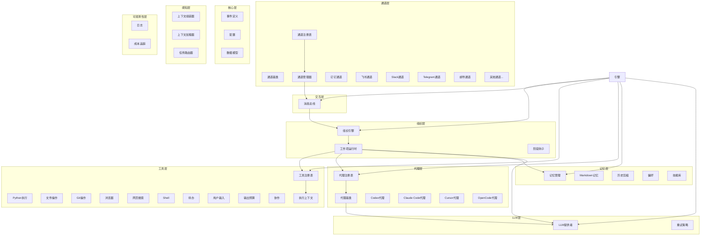
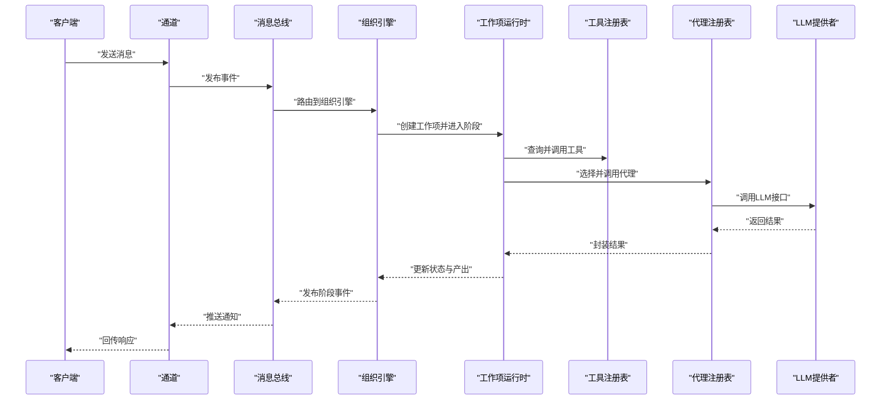
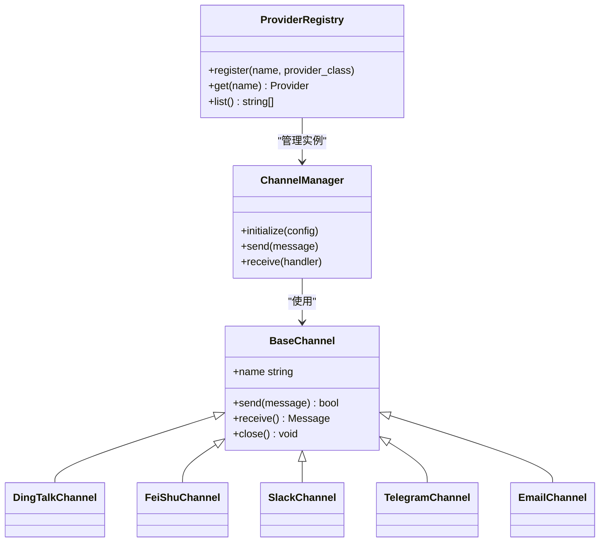
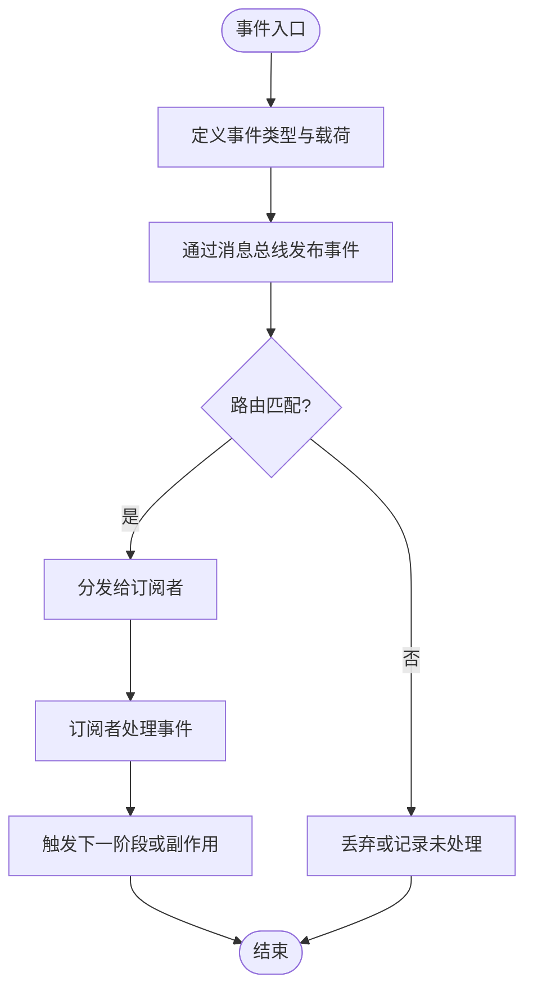
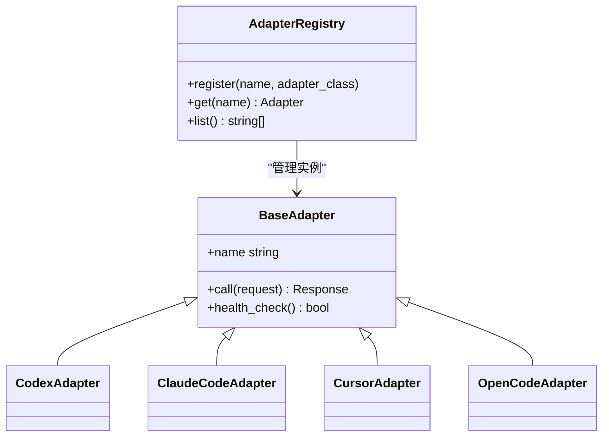
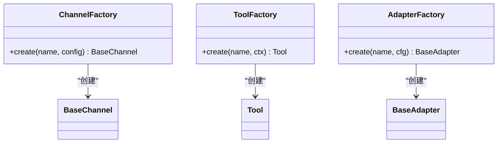
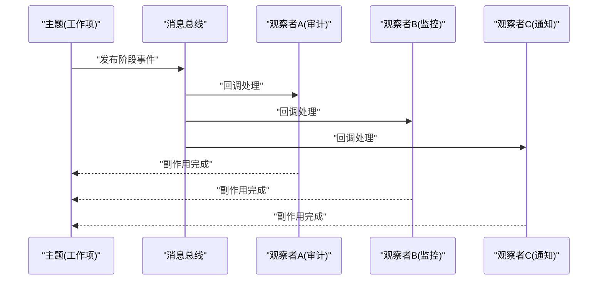
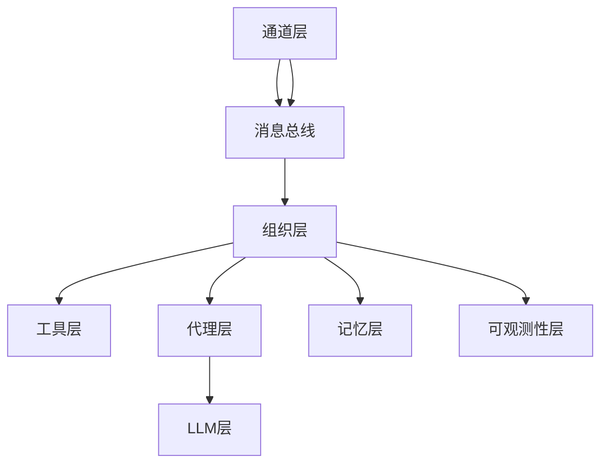

# 核心设计模式

<cite>
**本文引用的文件**   
- [opc/channels/provider_registry.py](file://opc/channels/provider_registry.py)
- [opc/channels/manager.py](file://opc/channels/manager.py)
- [opc/channels/base.py](file://opc/channels/base.py)
- [opc/channels/dingtalk.py](file://opc/channels/dingtalk.py)
- [opc/channels/discord.py](file://opc/channels/discord.py)
- [opc/channels/email.py](file://opc/channels/email.py)
- [opc/channels/feishu.py](file://opc/channels/feishu.py)
- [opc/channels/matrix.py](file://opc/channels/matrix.py)
- [opc/channels/mochat.py](file://opc/channels/mochat.py)
- [opc/channels/provider_base.py](file://opc/channels/provider_base.py)
- [opc/channels/qq.py](file://opc/channels/qq.py)
- [opc/channels/slack.py](file://opc/channels/slack.py)
- [opc/channels/telegram.py](file://opc/channels/telegram.py)
- [opc/channels/whatsapp.py](file://opc/channels/whatsapp.py)
- [opc/core/events.py](file://opc/core/events.py)
- [opc/layer0_interaction/message_bus.py](file://opc/layer0_interaction/message_bus.py)
- [opc/layer3_agent/adapters/registry.py](file://opc/layer3_agent/adapters/registry.py)
- [opc/layer3_agent/adapters/base.py](file://opc/layer3_agent/adapters/base.py)
- [opc/layer3_agent/adapters/codex_adapter.py](file://opc/layer3_agent/adapters/codex_adapter.py)
- [opc/layer3_agent/adapters/claude_code.py](file://opc/layer3_agent/adapters/claude_code.py)
- [opc/layer3_agent/adapters/cursor_adapter.py](file://opc/layer3_agent/adapters/cursor_adapter.py)
- [opc/layer3_agent/adapters/opencode_adapter.py](file://opc/layer3_agent/adapters/opencode_adapter.py)
- [opc/layer4_tools/registry.py](file://opc/layer4_tools/registry.py)
- [opc/layer4_tools/python_exec.py](file://opc/layer4_tools/python_exec.py)
- [opc/layer4_tools/file_ops.py](file://opc/layer4_tools/file_ops.py)
- [opc/layer4_tools/git_ops.py](file://opc/layer4_tools/git_ops.py)
- [opc/layer4_tools/browser.py](file://opc/layer4_tools/browser.py)
- [opc/layer4_tools/web_search.py](file://opc/layer4_tools/web_search.py)
- [opc/layer4_tools/shell.py](file://opc/layer4_tools/shell.py)
- [opc/layer4_tools/todo.py](file://opc/layer4_tools/todo.py)
- [opc/layer4_tools/user_input.py](file://opc/layer4_tools/user_input.py)
- [opc/layer4_tools/output_budget.py](file://opc/layer4_tools/output_budget.py)
- [opc/layer4_tools/collaboration.py](file://opc/layer4_tools/collaboration.py)
- [opc/layer4_tools/collaboration_dispatch.py](file://opc/layer4_tools/collaboration_dispatch.py)
- [opc/layer4_tools/collaboration_rpc.py](file://opc/layer4_tools/collaboration_rpc.py)
- [opc/layer4_tools/execution_context.py](file://opc/layer4_tools/execution_context.py)
- [opc/layer2_organization/org_engine.py](file://opc/layer2_organization/org_engine.py)
- [opc/layer2_organization/work_item_runtime.py](file://opc/layer2_organization/work_item_runtime.py)
- [opc/layer2_organization/phase_hooks.py](file://opc/layer2_organization/phase_hooks.py)
- [opc/layer2_organization/gate_harness.py](file://opc/layer2_organization/gate_harness.py)
- [opc/layer2_organization/heartbeat.py](file://opc/layer2_organization/heartbeat.py)
- [opc/layer2_organization/recruiter.py](file://opc/layer2_organization/recruiter.py)
- [opc/layer2_organization/reorg_manager.py](file://opc/layer2_organization/reorg_manager.py)
- [opc/layer2_organization/seat_executor.py](file://opc/layer2_organization/seat_executor.py)
- [opc/layer2_organization/secretary.py](file://opc/layer2_organization/secretary.py)
- [opc/layer2_organization/task_graph.py](file://opc/layer2_organization/task_graph.py)
- [opc/layer2_organization/work_item_transition.py](file://opc/layer2_organization/work_item_transition.py)
- [opc/layer2_organization/session_scoping.py](file://opc/layer2_organization/session_scoping.py)
- [opc/layer2_organization/company_runtime.py](file://opc/layer2_organization/company_runtime.py)
- [opc/layer2_organization/custom_runtime.py](file://opc/layer2_organization/custom_runtime.py)
- [opc/layer2_organization/work_item_identity.py](file://opc/layer2_organization/work_item_identity.py)
- [opc/layer2_organization/work_item_links.py](file://opc/layer2_organization/work_item_links.py)
- [opc/layer2_organization/work_item_runtime_invariants.py](file://opc/layer2_organization/work_item_runtime_invariants.py)
- [opc/layer2_organization/work_item_context_view.py](file://opc/layer2_organization/work_item_context_view.py)
- [opc/layer2_organization/prompt_contract.py](file://opc/layer2_organization/prompt_contract.py)
- [opc/layer2_organization/output_contract.py](file://opc/layer2_organization/output_contract.py)
- [opc/layer2_organization/data_acquisition_policy.py](file://opc/layer2_organization/data_acquisition_policy.py)
- [opc/layer2_organization/collaboration_policy.py](file://opc/layer2_organization/collaboration_policy.py)
- [opc/layer2_organization/approval.py](file://opc/layer2_organization/approval.py)
- [opc/layer2_organization/escalation.py](file://opc/layer2_organization/escalation.py)
- [opc/layer2_organization/talent_market.py](file://opc/layer2_organization/talent_market.py)
- [opc/layer2_organization/goal_manager.py](file://opc/layer2_organization/goal_manager.py)
- [opc/layer2_organization/metadata_ownership.py](file://opc/layer2_organization/metadata_ownership.py)
- [opc/layer2_organization/comms.py](file://opc/layer2_organization/comms.py)
- [opc/layer2_organization/communication.py](file://opc/layer2_organization/communication.py)
- [opc/layer2_organization/turn_mode.py](file://opc/layer2_organization/turn_mode.py)
- [opc/layer2_organization/phase.py](file://opc/layer2_organization/phase.py)
- [opc/layer2_organization/reactivation_sweeper.py](file://opc/layer2_organization/reactivation_sweeper.py)
- [opc/layer2_organization/org_work_item_planner.py](file://opc/layer2_organization/org_work_item_planner.py)
- [opc/layer2_organization/work_item_runtime_invariants.py](file://opc/layer2_organization/work_item_runtime_invariants.py)
- [opc/layer1_perception/context_assembler.py](file://opc/layer1_perception/context_assembler.py)
- [opc/layer1_perception/context_loader.py](file://opc/layer1_perception/context_loader.py)
- [opc/layer1_perception/task_router.py](file://opc/layer1_perception/task_router.py)
- [opc/layer3_agent/runtime_v2/tool_hooks.py](file://opc/layer3_agent/runtime_v2/tool_hooks.py)
- [opc/layer3_agent/runtime_v2/streaming_tool_executor.py](file://opc/layer3_agent/runtime_v2/streaming_tool_executor.py)
- [opc/layer3_agent/runtime_v2/subagents.py](file://opc/layer3_agent/runtime_v2/subagents.py)
- [opc/layer3_agent/runtime_v2/tool_planner.py](file://opc/layer3_agent/runtime_v2/tool_planner.py)
- [opc/layer3_agent/runtime_v2/permissions.py](file://opc/layer3_agent/runtime_v2/permissions.py)
- [opc/layer3_agent/runtime_v2/worktree.py](file://opc/layer3_agent/runtime_v2/worktree.py)
- [opc/layer3_agent/native_agent.py](file://opc/layer3_agent/native_agent.py)
- [opc/layer3_agent/external_broker.py](file://opc/layer3_agent/external_broker.py)
- [opc/layer3_agent/skill_installer.py](file://opc/layer3_agent/skill_installer.py)
- [opc/layer3_agent/preflight.py](file://opc/layer3_agent/preflight.py)
- [opc/layer3_agent/company_runtime_contract.py](file://opc/layer3_agent/company_runtime_contract.py)
- [opc/layer3_agent/external_session_identity.py](file://opc/layer3_agent/external_session_identity.py)
- [opc/layer5_memory/markdown_memory.py](file://opc/layer5_memory/markdown_memory.py)
- [opc/layer5_memory/memory_manager.py](file://opc/layer5_memory/memory_manager.py)
- [opc/layer5_memory/history_compactor.py](file://opc/layer5_memory/history_compactor.py)
- [opc/layer5_memory/preference.py](file://opc/layer5_memory/preference.py)
- [opc/layer5_memory/secretary_policy.py](file://opc/layer5_memory/secretary_policy.py)
- [opc/layer5_memory/skill_importer.py](file://opc/layer5_memory/skill_importer.py)
- [opc/layer5_memory/skill_library.py](file://opc/layer5_memory/skill_library.py)
- [opc/layer5_memory/approval_allowlist.py](file://opc/layer5_memory/approval_allowlist.py)
- [opc/layer5_memory/capability_manager.py](file://opc/layer5_memory/capability_manager.py)
- [opc/layer5_memory/employee_evolution.py](file://opc/layer5_memory/employee_evolution.py)
- [opc/layer6_observability/opc_logger.py](file://opc/layer6_observability/opc_logger.py)
- [opc/layer6_observability/cost_tracker.py](file://opc/layer6_observability/cost_tracker.py)
- [opc/llm/provider.py](file://opc/llm/provider.py)
- [opc/llm/retry.py](file://opc/llm/retry.py)
- [opc/engine.py](file://opc/engine.py)
- [opc/cli/app.py](file://opc/cli/app.py)
</cite>

## 目录
1. [引言](#引言)
2. [项目结构](#项目结构)
3. [核心组件](#核心组件)
4. [架构总览](#架构总览)
5. [详细组件分析](#详细组件分析)
6. [依赖分析](#依赖分析)
7. [性能考量](#性能考量)
8. [故障排查指南](#故障排查指南)
9. [结论](#结论)
10. [附录](#附录)

## 引言
本技术文档聚焦于 OpenOPC 的核心设计模式，围绕插件化架构、事件驱动、适配器、工厂与观察者五种关键模式展开。文档从通道注册、代理适配、工具管理、事件分发等模块入手，解释每种模式的实现方式、适用场景与优势，并通过类图、时序图和流程图展示其在代码中的落地形态。同时给出模式选择的技术决策与权衡考虑，帮助读者在扩展系统能力时做出合理的设计取舍。

## 项目结构
OpenOPC 采用分层与模块化组织：
- 通道层（channels）：多平台消息通道接入，提供统一的通道抽象与注册机制
- 核心层（core）：事件总线、配置、模型等基础能力
- 交互层（layer0_interaction）：消息总线与跨层通信
- 感知层（layer1_perception）：上下文组装、加载与任务路由
- 组织层（layer2_organization）：工作项生命周期、阶段流转、审批与协作策略
- 代理层（layer3_agent）：外部代理适配、运行时与工具编排
- 工具层（layer4_tools）：可插拔工具集与执行上下文
- 记忆层（layer5_memory）：持久化、压缩、偏好与技能库
- 可观测性层（layer6_observability）：日志与成本追踪
- LLM 层（llm）：提供者抽象与重试策略
- 引擎与 CLI（engine, cli）：应用入口与编排

图表来源
- [opc/channels/provider_registry.py:1-200](file://opc/channels/provider_registry.py#L1-L200)
- [opc/channels/manager.py:1-200](file://opc/channels/manager.py#L1-L200)
- [opc/channels/base.py:1-200](file://opc/channels/base.py#L1-L200)
- [opc/core/events.py:1-200](file://opc/core/events.py#L1-L200)
- [opc/layer0_interaction/message_bus.py:1-200](file://opc/layer0_interaction/message_bus.py#L1-L200)
- [opc/layer3_agent/adapters/registry.py:1-200](file://opc/layer3_agent/adapters/registry.py#L1-L200)
- [opc/layer3_agent/adapters/base.py:1-200](file://opc/layer3_agent/adapters/base.py#L1-L200)
- [opc/layer4_tools/registry.py:1-200](file://opc/layer4_tools/registry.py#L1-L200)
- [opc/layer4_tools/python_exec.py:1-200](file://opc/layer4_tools/python_exec.py#L1-L200)
- [opc/layer4_tools/file_ops.py:1-200](file://opc/layer4_tools/file_ops.py#L1-L200)
- [opc/layer4_tools/git_ops.py:1-200](file://opc/layer4_tools/git_ops.py#L1-L200)
- [opc/layer4_tools/browser.py:1-200](file://opc/layer4_tools/browser.py#L1-L200)
- [opc/layer4_tools/web_search.py:1-200](file://opc/layer4_tools/web_search.py#L1-L200)
- [opc/layer4_tools/shell.py:1-200](file://opc/layer4_tools/shell.py#L1-L200)
- [opc/layer4_tools/todo.py:1-200](file://opc/layer4_tools/todo.py#L1-L200)
- [opc/layer4_tools/user_input.py:1-200](file://opc/layer4_tools/user_input.py#L1-L200)
- [opc/layer4_tools/output_budget.py:1-200](file://opc/layer4_tools/output_budget.py#L1-L200)
- [opc/layer4_tools/collaboration.py:1-200](file://opc/layer4_tools/collaboration.py#L1-L200)
- [opc/layer4_tools/execution_context.py:1-200](file://opc/layer4_tools/execution_context.py#L1-L200)
- [opc/layer2_organization/org_engine.py:1-200](file://opc/layer2_organization/org_engine.py#L1-L200)
- [opc/layer2_organization/work_item_runtime.py:1-200](file://opc/layer2_organization/work_item_runtime.py#L1-L200)
- [opc/layer2_organization/phase_hooks.py:1-200](file://opc/layer2_organization/phase_hooks.py#L1-L200)
- [opc/layer2_organization/gate_harness.py:1-200](file://opc/layer2_organization/gate_harness.py#L1-L200)
- [opc/layer2_organization/heartbeat.py:1-200](file://opc/layer2_organization/heartbeat.py#L1-L200)
- [opc/layer2_organization/recruiter.py:1-200](file://opc/layer2_organization/recruiter.py#L1-L200)
- [opc/layer2_organization/reorg_manager.py:1-200](file://opc/layer2_organization/reorg_manager.py#L1-L200)
- [opc/layer2_organization/seat_executor.py:1-200](file://opc/layer2_organization/seat_executor.py#L1-L200)
- [opc/layer2_organization/secretary.py:1-200](file://opc/layer2_organization/secretary.py#L1-L200)
- [opc/layer2_organization/task_graph.py:1-200](file://opc/layer2_organization/task_graph.py#L1-L200)
- [opc/layer2_organization/work_item_transition.py:1-200](file://opc/layer2_organization/work_item_transition.py#L1-L200)
- [opc/layer2_organization/session_scoping.py:1-200](file://opc/layer2_organization/session_scoping.py#L1-L200)
- [opc/layer2_organization/company_runtime.py:1-200](file://opc/layer2_organization/company_runtime.py#L1-L200)
- [opc/layer2_organization/custom_runtime.py:1-200](file://opc/layer2_organization/custom_runtime.py#L1-L200)
- [opc/layer2_organization/work_item_identity.py:1-200](file://opc/layer2_organization/work_item_identity.py#L1-L200)
- [opc/layer2_organization/work_item_links.py:1-200](file://opc/layer2_organization/work_item_links.py#L1-L200)
- [opc/layer2_organization/work_item_runtime_invariants.py:1-200](file://opc/layer2_organization/work_item_runtime_invariants.py#L1-L200)
- [opc/layer2_organization/work_item_context_view.py:1-200](file://opc/layer2_organization/work_item_context_view.py#L1-L200)
- [opc/layer2_organization/prompt_contract.py:1-200](file://opc/layer2_organization/prompt_contract.py#L1-L200)
- [opc/layer2_organization/output_contract.py:1-200](file://opc/layer2_organization/output_contract.py#L1-L200)
- [opc/layer2_organization/data_acquisition_policy.py:1-200](file://opc/layer2_organization/data_acquisition_policy.py#L1-L200)
- [opc/layer2_organization/collaboration_policy.py:1-200](file://opc/layer2_organization/collaboration_policy.py#L1-L200)
- [opc/layer2_organization/approval.py:1-200](file://opc/layer2_organization/approval.py#L1-L200)
- [opc/layer2_organization/escalation.py:1-200](file://opc/layer2_organization/escalation.py#L1-L200)
- [opc/layer2_organization/talent_market.py:1-200](file://opc/layer2_organization/talent_market.py#L1-L200)
- [opc/layer2_organization/goal_manager.py:1-200](file://opc/layer2_organization/goal_manager.py#L1-L200)
- [opc/layer2_organization/metadata_ownership.py:1-200](file://opc/layer2_organization/metadata_ownership.py#L1-L200)
- [opc/layer2_organization/comms.py:1-200](file://opc/layer2_organization/comms.py#L1-L200)
- [opc/layer2_organization/communication.py:1-200](file://opc/layer2_organization/communication.py#L1-L200)
- [opc/layer2_organization/turn_mode.py:1-200](file://opc/layer2_organization/turn_mode.py#L1-L200)
- [opc/layer2_organization/phase.py:1-200](file://opc/layer2_organization/phase.py#L1-L200)
- [opc/layer2_organization/reactivation_sweeper.py:1-200](file://opc/layer2_organization/reactivation_sweeper.py#L1-L200)
- [opc/layer2_organization/org_work_item_planner.py:1-200](file://opc/layer2_organization/org_work_item_planner.py#L1-L200)
- [opc/layer1_perception/context_assembler.py:1-200](file://opc/layer1_perception/context_assembler.py#L1-L200)
- [opc/layer1_perception/context_loader.py:1-200](file://opc/layer1_perception/context_loader.py#L1-L200)
- [opc/layer1_perception/task_router.py:1-200](file://opc/layer1_perception/task_router.py#L1-L200)
- [opc/layer3_agent/runtime_v2/tool_hooks.py:1-200](file://opc/layer3_agent/runtime_v2/tool_hooks.py#L1-L200)
- [opc/layer3_agent/runtime_v2/streaming_tool_executor.py:1-200](file://opc/layer3_agent/runtime_v2/streaming_tool_executor.py#L1-L200)
- [opc/layer3_agent/runtime_v2/subagents.py:1-200](file://opc/layer3_agent/runtime_v2/subagents.py#L1-L200)
- [opc/layer3_agent/runtime_v2/tool_planner.py:1-200](file://opc/layer3_agent/runtime_v2/tool_planner.py#L1-L200)
- [opc/layer3_agent/runtime_v2/permissions.py:1-200](file://opc/layer3_agent/runtime_v2/permissions.py#L1-L200)
- [opc/layer3_agent/runtime_v2/worktree.py:1-200](file://opc/layer3_agent/runtime_v2/worktree.py#L1-L200)
- [opc/layer3_agent/native_agent.py:1-200](file://opc/layer3_agent/native_agent.py#L1-L200)
- [opc/layer3_agent/external_broker.py:1-200](file://opc/layer3_agent/external_broker.py#L1-L200)
- [opc/layer3_agent/skill_installer.py:1-200](file://opc/layer3_agent/skill_installer.py#L1-L200)
- [opc/layer3_agent/preflight.py:1-200](file://opc/layer3_agent/preflight.py#L1-L200)
- [opc/layer3_agent/company_runtime_contract.py:1-200](file://opc/layer3_agent/company_runtime_contract.py#L1-L200)
- [opc/layer3_agent/external_session_identity.py:1-200](file://opc/layer3_agent/external_session_identity.py#L1-L200)
- [opc/layer5_memory/markdown_memory.py:1-200](file://opc/layer5_memory/markdown_memory.py#L1-L200)
- [opc/layer5_memory/memory_manager.py:1-200](file://opc/layer5_memory/memory_manager.py#L1-L200)
- [opc/layer5_memory/history_compactor.py:1-200](file://opc/layer5_memory/history_compactor.py#L1-L200)
- [opc/layer5_memory/preference.py:1-200](file://opc/layer5_memory/preference.py#L1-L200)
- [opc/layer5_memory/secretary_policy.py:1-200](file://opc/layer5_memory/secretary_policy.py#L1-L200)
- [opc/layer5_memory/skill_importer.py:1-200](file://opc/layer5_memory/skill_importer.py#L1-L200)
- [opc/layer5_memory/skill_library.py:1-200](file://opc/layer5_memory/skill_library.py#L1-L200)
- [opc/layer5_memory/approval_allowlist.py:1-200](file://opc/layer5_memory/approval_allowlist.py#L1-L200)
- [opc/layer5_memory/capability_manager.py:1-200](file://opc/layer5_memory/capability_manager.py#L1-L200)
- [opc/layer5_memory/employee_evolution.py:1-200](file://opc/layer5_memory/employee_evolution.py#L1-L200)
- [opc/layer6_observability/opc_logger.py:1-200](file://opc/layer6_observability/opc_logger.py#L1-L200)
- [opc/layer6_observability/cost_tracker.py:1-200](file://opc/layer6_observability/cost_tracker.py#L1-L200)
- [opc/llm/provider.py:1-200](file://opc/llm/provider.py#L1-L200)
- [opc/llm/retry.py:1-200](file://opc/llm/retry.py#L1-L200)
- [opc/engine.py:1-200](file://opc/engine.py#L1-L200)
- [opc/cli/app.py:1-200](file://opc/cli/app.py#L1-L200)

章节来源
- [opc/engine.py:1-200](file://opc/engine.py#L1-L200)
- [opc/cli/app.py:1-200](file://opc/cli/app.py#L1-L200)

## 核心组件
本节概述各层的关键组件及其职责，为后续模式分析奠定基础：
- 通道层：统一消息通道抽象，支持多平台接入；通过注册表与管理器完成动态发现与调度
- 核心层：事件定义与通用配置，支撑跨层解耦
- 交互层：消息总线作为事件中枢，承载订阅/发布与路由
- 感知层：上下文组装与任务路由，决定如何准备与分发请求
- 组织层：工作项生命周期管理与阶段流转，协调工具与代理
- 代理层：对外部代理的适配与注册，屏蔽差异
- 工具层：工具注册与执行上下文，提供可扩展能力
- 记忆层：持久化、压缩与偏好管理
- 可观测性层：日志与成本追踪
- LLM层：提供者抽象与重试策略

章节来源
- [opc/channels/base.py:1-200](file://opc/channels/base.py#L1-L200)
- [opc/channels/provider_registry.py:1-200](file://opc/channels/provider_registry.py#L1-L200)
- [opc/channels/manager.py:1-200](file://opc/channels/manager.py#L1-L200)
- [opc/core/events.py:1-200](file://opc/core/events.py#L1-L200)
- [opc/layer0_interaction/message_bus.py:1-200](file://opc/layer0_interaction/message_bus.py#L1-L200)
- [opc/layer1_perception/context_assembler.py:1-200](file://opc/layer1_perception/context_assembler.py#L1-L200)
- [opc/layer1_perception/context_loader.py:1-200](file://opc/layer1_perception/context_loader.py#L1-L200)
- [opc/layer1_perception/task_router.py:1-200](file://opc/layer1_perception/task_router.py#L1-L200)
- [opc/layer2_organization/org_engine.py:1-200](file://opc/layer2_organization/org_engine.py#L1-L200)
- [opc/layer2_organization/work_item_runtime.py:1-200](file://opc/layer2_organization/work_item_runtime.py#L1-L200)
- [opc/layer3_agent/adapters/registry.py:1-200](file://opc/layer3_agent/adapters/registry.py#L1-L200)
- [opc/layer3_agent/adapters/base.py:1-200](file://opc/layer3_agent/adapters/base.py#L1-L200)
- [opc/layer4_tools/registry.py:1-200](file://opc/layer4_tools/registry.py#L1-L200)
- [opc/layer4_tools/execution_context.py:1-200](file://opc/layer4_tools/execution_context.py#L1-L200)
- [opc/layer5_memory/memory_manager.py:1-200](file://opc/layer5_memory/memory_manager.py#L1-L200)
- [opc/layer6_observability/opc_logger.py:1-200](file://opc/layer6_observability/opc_logger.py#L1-L200)
- [opc/llm/provider.py:1-200](file://opc/llm/provider.py#L1-L200)

## 架构总览
下图展示了 OpenOPC 的整体架构与各层之间的交互关系，突出事件驱动与插件化特性：

图表来源
- [opc/channels/manager.py:1-200](file://opc/channels/manager.py#L1-L200)
- [opc/layer0_interaction/message_bus.py:1-200](file://opc/layer0_interaction/message_bus.py#L1-L200)
- [opc/layer2_organization/org_engine.py:1-200](file://opc/layer2_organization/org_engine.py#L1-L200)
- [opc/layer2_organization/work_item_runtime.py:1-200](file://opc/layer2_organization/work_item_runtime.py#L1-L200)
- [opc/layer4_tools/registry.py:1-200](file://opc/layer4_tools/registry.py#L1-L200)
- [opc/layer3_agent/adapters/registry.py:1-200](file://opc/layer3_agent/adapters/registry.py#L1-L200)
- [opc/llm/provider.py:1-200](file://opc/llm/provider.py#L1-L200)

## 详细组件分析

### 插件化架构模式（Plugin Architecture）
- 实现方式
  - 通道插件：通过“提供者注册表”集中管理不同平台的通道实现，支持动态发现与按需加载
  - 工具插件：工具以独立模块形式注册到“工具注册表”，由运行时按名称或能力检索并调用
  - 代理插件：外部代理通过“代理注册表”暴露统一接口，屏蔽底层差异
- 适用场景
  - 多平台消息接入（钉钉、飞书、Slack、Telegram、邮件等）
  - 工具能力扩展（Python执行、文件操作、Git、浏览器、搜索、Shell、待办、用户输入、输出预算、协作等）
  - 外部代理集成（Codex、Claude Code、Cursor、OpenCode等）
- 优势
  - 高内聚低耦合：新增通道/工具/代理无需修改核心逻辑
  - 可测试性与可替换性：通过注册表进行模拟与替换
  - 可扩展性：遵循约定优于配置，降低集成成本

图表来源
- [opc/channels/provider_registry.py:1-200](file://opc/channels/provider_registry.py#L1-L200)
- [opc/channels/manager.py:1-200](file://opc/channels/manager.py#L1-L200)
- [opc/channels/base.py:1-200](file://opc/channels/base.py#L1-L200)
- [opc/channels/dingtalk.py:1-200](file://opc/channels/dingtalk.py#L1-L200)
- [opc/channels/feishu.py:1-200](file://opc/channels/feishu.py#L1-L200)
- [opc/channels/slack.py:1-200](file://opc/channels/slack.py#L1-L200)
- [opc/channels/telegram.py:1-200](file://opc/channels/telegram.py#L1-L200)
- [opc/channels/email.py:1-200](file://opc/channels/email.py#L1-L200)

章节来源
- [opc/channels/provider_registry.py:1-200](file://opc/channels/provider_registry.py#L1-L200)
- [opc/channels/manager.py:1-200](file://opc/channels/manager.py#L1-L200)
- [opc/channels/base.py:1-200](file://opc/channels/base.py#L1-L200)
- [opc/channels/dingtalk.py:1-200](file://opc/channels/dingtalk.py#L1-L200)
- [opc/channels/feishu.py:1-200](file://opc/channels/feishu.py#L1-L200)
- [opc/channels/slack.py:1-200](file://opc/channels/slack.py#L1-L200)
- [opc/channels/telegram.py:1-200](file://opc/channels/telegram.py#L1-L200)
- [opc/channels/email.py:1-200](file://opc/channels/email.py#L1-L200)

### 事件驱动模式（Event-Driven Pattern）
- 实现方式
  - 核心事件定义：在核心层定义统一的事件类型与载荷结构
  - 消息总线：作为事件中枢，提供订阅、发布与路由能力
  - 阶段钩子：在工作项阶段转换前后触发钩子，实现横切关注点（如审计、监控）
- 适用场景
  - 跨层异步通信（通道到组织、组织到工具/代理）
  - 状态变更通知（阶段推进、审批结果、协作事件）
  - 可观测性与副作用处理（日志、指标、告警）
- 优势
  - 松耦合：生产者与消费者无需直接引用
  - 可扩展：新增监听者不影响现有流程
  - 可组合：复杂流程可由多个事件串联而成

图表来源
- [opc/core/events.py:1-200](file://opc/core/events.py#L1-L200)
- [opc/layer0_interaction/message_bus.py:1-200](file://opc/layer0_interaction/message_bus.py#L1-L200)
- [opc/layer2_organization/phase_hooks.py:1-200](file://opc/layer2_organization/phase_hooks.py#L1-L200)

章节来源
- [opc/core/events.py:1-200](file://opc/core/events.py#L1-L200)
- [opc/layer0_interaction/message_bus.py:1-200](file://opc/layer0_interaction/message_bus.py#L1-L200)
- [opc/layer2_organization/phase_hooks.py:1-200](file://opc/layer2_organization/phase_hooks.py#L1-L200)

### 适配器模式（Adapter Pattern）
- 实现方式
  - 代理适配器：为不同外部代理（Codex、Claude Code、Cursor、OpenCode）提供统一接口，屏蔽协议与调用差异
  - 通道适配器：将不同平台的消息格式转换为内部统一模型
- 适用场景
  - 第三方服务集成（外部代理、消息平台）
  - 协议或数据格式不一致时的桥接
- 优势
  - 统一抽象：上层无需关心具体实现细节
  - 可替换：轻松切换不同实现
  - 可测试：通过适配器注入模拟对象

图表来源
- [opc/layer3_agent/adapters/registry.py:1-200](file://opc/layer3_agent/adapters/registry.py#L1-L200)
- [opc/layer3_agent/adapters/base.py:1-200](file://opc/layer3_agent/adapters/base.py#L1-L200)
- [opc/layer3_agent/adapters/codex_adapter.py:1-200](file://opc/layer3_agent/adapters/codex_adapter.py#L1-L200)
- [opc/layer3_agent/adapters/claude_code.py:1-200](file://opc/layer3_agent/adapters/claude_code.py#L1-L200)
- [opc/layer3_agent/adapters/cursor_adapter.py:1-200](file://opc/layer3_agent/adapters/cursor_adapter.py#L1-L200)
- [opc/layer3_agent/adapters/opencode_adapter.py:1-200](file://opc/layer3_agent/adapters/opencode_adapter.py#L1-L200)

章节来源
- [opc/layer3_agent/adapters/registry.py:1-200](file://opc/layer3_agent/adapters/registry.py#L1-L200)
- [opc/layer3_agent/adapters/base.py:1-200](file://opc/layer3_agent/adapters/base.py#L1-L200)
- [opc/layer3_agent/adapters/codex_adapter.py:1-200](file://opc/layer3_agent/adapters/codex_adapter.py#L1-L200)
- [opc/layer3_agent/adapters/claude_code.py:1-200](file://opc/layer3_agent/adapters/claude_code.py#L1-L200)
- [opc/layer3_agent/adapters/cursor_adapter.py:1-200](file://opc/layer3_agent/adapters/cursor_adapter.py#L1-L200)
- [opc/layer3_agent/adapters/opencode_adapter.py:1-200](file://opc/layer3_agent/adapters/opencode_adapter.py#L1-L200)

### 工厂模式（Factory Pattern）
- 实现方式
  - 通道工厂：根据配置或名称创建对应通道实例，交由管理器统一管理
  - 工具工厂：根据工具名或能力描述创建工具实例，注入执行上下文
  - 代理工厂：根据代理名创建适配器实例，供运行时调用
- 适用场景
  - 需要基于配置或运行时信息动态创建对象
  - 隐藏复杂构造逻辑，提升可读性与可维护性
- 优势
  - 集中式创建：避免分散的new逻辑
  - 易扩展：新增类型只需注册工厂映射
  - 易测试：可通过工厂注入模拟对象

图表来源
- [opc/channels/manager.py:1-200](file://opc/channels/manager.py#L1-L200)
- [opc/layer4_tools/registry.py:1-200](file://opc/layer4_tools/registry.py#L1-L200)
- [opc/layer3_agent/adapters/registry.py:1-200](file://opc/layer3_agent/adapters/registry.py#L1-L200)
- [opc/layer4_tools/execution_context.py:1-200](file://opc/layer4_tools/execution_context.py#L1-L200)

章节来源
- [opc/channels/manager.py:1-200](file://opc/channels/manager.py#L1-L200)
- [opc/layer4_tools/registry.py:1-200](file://opc/layer4_tools/registry.py#L1-L200)
- [opc/layer3_agent/adapters/registry.py:1-200](file://opc/layer3_agent/adapters/registry.py#L1-L200)
- [opc/layer4_tools/execution_context.py:1-200](file://opc/layer4_tools/execution_context.py#L1-L200)

### 观察者模式（Observer Pattern）
- 实现方式
  - 事件订阅：通过消息总线注册监听者，接收特定事件
  - 阶段钩子：在工作项阶段转换前后执行钩子函数，实现横切逻辑
  - 心跳与监控：周期性任务订阅状态变化，触发健康检查或告警
- 适用场景
  - 状态变更通知（阶段推进、审批结果、协作事件）
  - 横切关注点（审计、监控、日志、指标）
  - 异步副作用（通知、缓存更新、索引重建）
- 优势
  - 解耦：被观察对象无需了解观察者
  - 灵活：可动态增删监听者
  - 可组合：多个观察者协同处理同一事件

图表来源
- [opc/layer0_interaction/message_bus.py:1-200](file://opc/layer0_interaction/message_bus.py#L1-L200)
- [opc/layer2_organization/phase_hooks.py:1-200](file://opc/layer2_organization/phase_hooks.py#L1-L200)
- [opc/layer2_organization/heartbeat.py:1-200](file://opc/layer2_organization/heartbeat.py#L1-L200)

章节来源
- [opc/layer0_interaction/message_bus.py:1-200](file://opc/layer0_interaction/message_bus.py#L1-L200)
- [opc/layer2_organization/phase_hooks.py:1-200](file://opc/layer2_organization/phase_hooks.py#L1-L200)
- [opc/layer2_organization/heartbeat.py:1-200](file://opc/layer2_organization/heartbeat.py#L1-L200)

## 依赖分析
- 组件耦合与内聚
  - 通道层通过注册表与管理器形成高内聚的插件集合，对外仅暴露统一接口
  - 工具层通过注册表与执行上下文解耦工具实现与调用方
  - 代理层通过适配器与注册表屏蔽外部差异，保持上层稳定
- 直接与间接依赖
  - 组织层依赖工具与代理，但通过注册表与事件总线间接访问，降低耦合
  - 记忆层与可观测性层作为横切关注点，通过事件与钩子参与流程
- 潜在循环依赖
  - 通过事件总线与注册表打破直接引用，避免循环
- 外部依赖与集成点
  - LLM提供者、外部代理、消息平台均为外部集成点，通过适配器与工厂隔离

图表来源
- [opc/channels/manager.py:1-200](file://opc/channels/manager.py#L1-L200)
- [opc/layer0_interaction/message_bus.py:1-200](file://opc/layer0_interaction/message_bus.py#L1-L200)
- [opc/layer2_organization/org_engine.py:1-200](file://opc/layer2_organization/org_engine.py#L1-L200)
- [opc/layer4_tools/registry.py:1-200](file://opc/layer4_tools/registry.py#L1-L200)
- [opc/layer3_agent/adapters/registry.py:1-200](file://opc/layer3_agent/adapters/registry.py#L1-L200)
- [opc/layer5_memory/memory_manager.py:1-200](file://opc/layer5_memory/memory_manager.py#L1-L200)
- [opc/layer6_observability/opc_logger.py:1-200](file://opc/layer6_observability/opc_logger.py#L1-L200)
- [opc/llm/provider.py:1-200](file://opc/llm/provider.py#L1-L200)

章节来源
- [opc/channels/manager.py:1-200](file://opc/channels/manager.py#L1-L200)
- [opc/layer0_interaction/message_bus.py:1-200](file://opc/layer0_interaction/message_bus.py#L1-L200)
- [opc/layer2_organization/org_engine.py:1-200](file://opc/layer2_organization/org_engine.py#L1-L200)
- [opc/layer4_tools/registry.py:1-200](file://opc/layer4_tools/registry.py#L1-L200)
- [opc/layer3_agent/adapters/registry.py:1-200](file://opc/layer3_agent/adapters/registry.py#L1-L200)
- [opc/layer5_memory/memory_manager.py:1-200](file://opc/layer5_memory/memory_manager.py#L1-L200)
- [opc/layer6_observability/opc_logger.py:1-200](file://opc/layer6_observability/opc_logger.py#L1-L200)
- [opc/llm/provider.py:1-200](file://opc/llm/provider.py#L1-L200)

## 性能考量
- 事件分发
  - 批量订阅与过滤可减少不必要的回调开销
  - 异步处理与背压控制有助于在高负载下保持稳定
- 插件加载
  - 延迟加载与按需初始化可降低启动时间
  - 注册表查找应使用高效数据结构（哈希表）
- 工具执行
  - 执行上下文共享与资源复用减少重复开销
  - 并发限制与超时控制防止资源耗尽
- 代理调用
  - 重试与退避策略提高鲁棒性
  - 连接池与缓存减少网络往返

[本节为一般性指导，不直接分析具体文件]

## 故障排查指南
- 事件未触发
  - 检查事件类型与订阅是否匹配
  - 确认消息总线是否正确路由
- 插件未加载
  - 验证注册表映射与命名一致性
  - 检查工厂创建逻辑与配置参数
- 适配器异常
  - 核对适配器健康检查与错误码映射
  - 查看日志与重试策略是否生效
- 工具执行失败
  - 检查执行上下文权限与资源可用性
  - 确认工具注册与依赖注入正确

章节来源
- [opc/core/events.py:1-200](file://opc/core/events.py#L1-L200)
- [opc/layer0_interaction/message_bus.py:1-200](file://opc/layer0_interaction/message_bus.py#L1-L200)
- [opc/channels/provider_registry.py:1-200](file://opc/channels/provider_registry.py#L1-L200)
- [opc/layer3_agent/adapters/base.py:1-200](file://opc/layer3_agent/adapters/base.py#L1-L200)
- [opc/layer4_tools/execution_context.py:1-200](file://opc/layer4_tools/execution_context.py#L1-L200)

## 结论
OpenOPC 通过插件化架构、事件驱动、适配器、工厂与观察者等核心设计模式，实现了高内聚、低耦合、可扩展的系统。通道、工具与代理的插件化使系统具备强大的生态整合能力；事件驱动与观察者模式保障了跨层通信与横切关注点的灵活性；适配器与工厂模式则屏蔽了外部差异与构造复杂性。这些模式的选择在可维护性、可扩展性与性能之间取得了良好平衡，为后续演进奠定了坚实基础。

## 附录
- 最佳实践
  - 为新插件提供清晰的接口契约与示例
  - 为事件定义明确的版本兼容策略
  - 为适配器与工厂编写单元测试与集成测试
  - 为工具执行设置合理的超时与资源限制
- 扩展建议
  - 引入更细粒度的能力描述，提升工具与代理的可发现性
  - 增强事件元数据，便于追踪与诊断
  - 优化注册表与工厂的缓存策略，提升启动与查找性能

[本节为概念性内容，不直接分析具体文件]