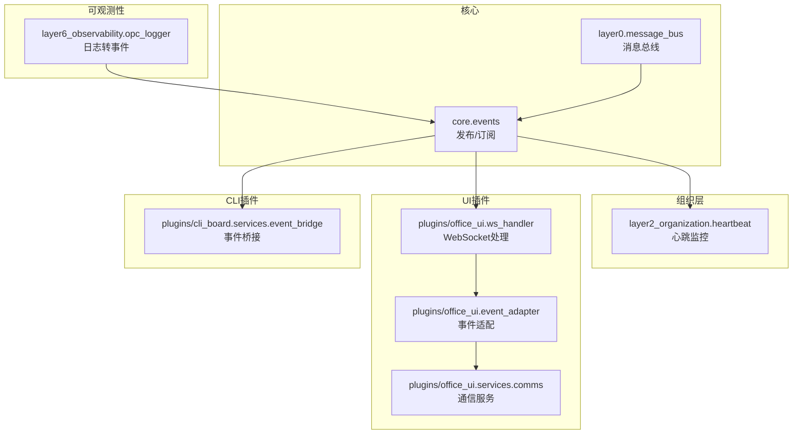
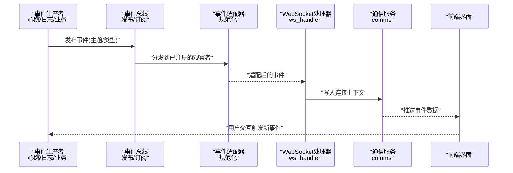
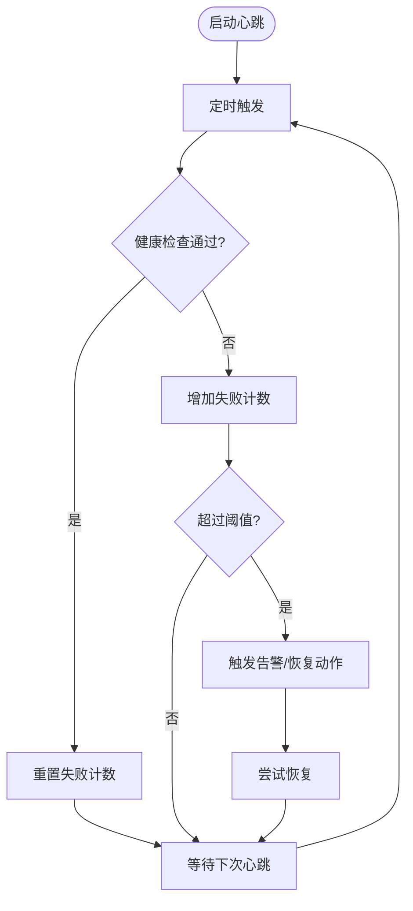
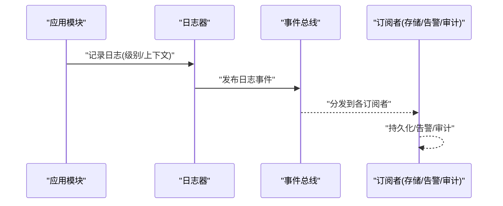
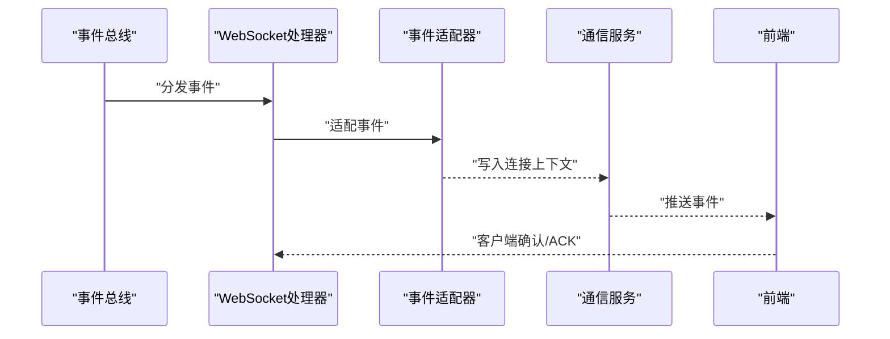
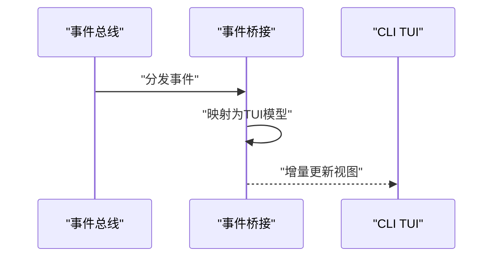
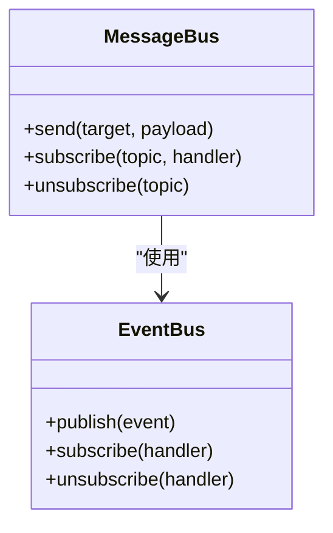
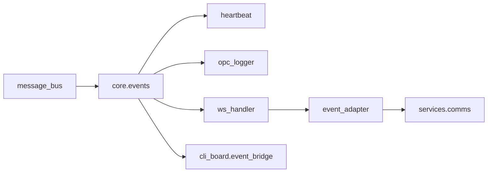

# 观察者模式

<cite>
**本文引用的文件**   
- [opc/core/events.py](file://opc/core/events.py)
- [opc/layer2_organization/heartbeat.py](file://opc/layer2_organization/heartbeat.py)
- [opc/layer6_observability/opc_logger.py](file://opc/layer6_observability/opc_logger.py)
- [opc/plugins/office_ui/ws_handler.py](file://opc/plugins/office_ui/ws_handler.py)
- [opc/plugins/office_ui/event_adapter.py](file://opc/plugins/office_ui/event_adapter.py)
- [opc/plugins/office_ui/services/comms.py](file://opc/plugins/office_ui/services/comms.py)
- [opc/plugins/cli_board/services/event_bridge.py](file://opc/plugins/cli_board/services/event_bridge.py)
- [opc/layer0_interaction/message_bus.py](file://opc/layer0_interaction/message_bus.py)
</cite>

## 目录
1. [简介](#简介)
2. [项目结构](#项目结构)
3. [核心组件](#核心组件)
4. [架构总览](#架构总览)
5. [详细组件分析](#详细组件分析)
6. [依赖关系分析](#依赖关系分析)
7. [性能考虑](#性能考虑)
8. [故障排查指南](#故障排查指南)
9. [结论](#结论)
10. [附录](#附录)

## 简介
本技术文档聚焦于OpenOPC中的观察者模式实现与应用，围绕状态监控、日志记录与UI更新三大场景展开。重点覆盖：
- 心跳监控：通过周期性事件驱动健康检查与告警
- 日志监听：将系统运行日志以事件形式广播，供多订阅者消费
- UI同步：基于WebSocket将后端事件推送至前端界面
- 观察者注册机制、通知分发策略与性能优化
- 自定义观察者创建与复杂观察者链组合
- 与事件驱动模式的结合使用
- 循环依赖与内存泄漏的规避策略
- 调试技巧与监控方案

## 项目结构
OpenOPC在多个层级中采用观察者模式进行解耦与扩展：
- 核心事件总线位于 core.events，提供统一的发布/订阅能力
- 组织层 heartbeat 模块利用事件进行心跳与健康检测
- 可观测性层 opc_logger 将日志转换为事件流
- 插件层 office_ui 通过 ws_handler 和 event_adapter 将事件推送到前端
- CLI Board 通过 event_bridge 桥接事件到TUI界面
- 消息总线 layer0.message_bus 作为跨层通信的基础设施

图表来源
- [opc/core/events.py](file://opc/core/events.py)
- [opc/layer2_organization/heartbeat.py](file://opc/layer2_organization/heartbeat.py)
- [opc/layer6_observability/opc_logger.py](file://opc/layer6_observability/opc_logger.py)
- [opc/plugins/office_ui/ws_handler.py](file://opc/plugins/office_ui/ws_handler.py)
- [opc/plugins/office_ui/event_adapter.py](file://opc/plugins/office_ui/event_adapter.py)
- [opc/plugins/office_ui/services/comms.py](file://opc/plugins/office_ui/services/comms.py)
- [opc/plugins/cli_board/services/event_bridge.py](file://opc/plugins/cli_board/services/event_bridge.py)
- [opc/layer0_interaction/message_bus.py](file://opc/layer0_interaction/message_bus.py)

章节来源
- [opc/core/events.py](file://opc/core/events.py)
- [opc/layer2_organization/heartbeat.py](file://opc/layer2_organization/heartbeat.py)
- [opc/layer6_observability/opc_logger.py](file://opc/layer6_observability/opc_logger.py)
- [opc/plugins/office_ui/ws_handler.py](file://opc/plugins/office_ui/ws_handler.py)
- [opc/plugins/office_ui/event_adapter.py](file://opc/plugins/office_ui/event_adapter.py)
- [opc/plugins/office_ui/services/comms.py](file://opc/plugins/office_ui/services/comms.py)
- [opc/plugins/cli_board/services/event_bridge.py](file://opc/plugins/cli_board/services/event_bridge.py)
- [opc/layer0_interaction/message_bus.py](file://opc/layer0_interaction/message_bus.py)

## 核心组件
- 事件总线（发布/订阅）：提供统一的注册、注销与分发接口，支持按主题或类型过滤
- 心跳监控：周期性触发健康检查事件，订阅者可据此执行恢复或告警逻辑
- 日志监听：将结构化日志转为事件，便于统一采集、聚合与展示
- UI同步：通过WebSocket将事件实时推送给前端，保持界面与后端状态一致
- 事件适配器：对不同类型的事件进行规范化与转换，屏蔽底层差异
- 事件桥接：将核心事件桥接到CLI TUI界面，形成一致的交互体验

章节来源
- [opc/core/events.py](file://opc/core/events.py)
- [opc/layer2_organization/heartbeat.py](file://opc/layer2_organization/heartbeat.py)
- [opc/layer6_observability/opc_logger.py](file://opc/layer6_observability/opc_logger.py)
- [opc/plugins/office_ui/ws_handler.py](file://opc/plugins/office_ui/ws_handler.py)
- [opc/plugins/office_ui/event_adapter.py](file://opc/plugins/office_ui/event_adapter.py)
- [opc/plugins/office_ui/services/comms.py](file://opc/plugins/office_ui/services/comms.py)
- [opc/plugins/cli_board/services/event_bridge.py](file://opc/plugins/cli_board/services/event_bridge.py)

## 架构总览
下图展示了从事件产生到UI更新的端到端流程，体现观察者模式与事件驱动的结合。

图表来源
- [opc/core/events.py](file://opc/core/events.py)
- [opc/plugins/office_ui/event_adapter.py](file://opc/plugins/office_ui/event_adapter.py)
- [opc/plugins/office_ui/ws_handler.py](file://opc/plugins/office_ui/ws_handler.py)
- [opc/plugins/office_ui/services/comms.py](file://opc/plugins/office_ui/services/comms.py)

## 详细组件分析

### 事件总线（发布/订阅）
- 职责
  - 维护观察者集合，支持按主题或类型注册/注销
  - 分发事件到匹配的观察者，支持顺序或并行策略
  - 提供错误隔离，单个观察者异常不影响其他观察者
- 关键设计
  - 观察者接口抽象：定义统一的回调签名
  - 过滤器：基于主题、优先级、条件表达式筛选
  - 幂等与去重：避免重复处理相同事件
- 复杂度
  - 注册/注销：O(1)~O(n)取决于索引结构
  - 分发：O(k)其中k为匹配观察者数量
- 优化建议
  - 批量分发：合并高频事件
  - 异步派发：降低主线程阻塞
  - 背压控制：当消费者慢时进行限流

章节来源
- [opc/core/events.py](file://opc/core/events.py)

### 心跳监控（状态监控）
- 职责
  - 周期性触发心跳事件，用于健康检查与超时告警
  - 订阅者可执行自动恢复、降级或上报指标
- 关键设计
  - 定时器驱动：固定间隔或自适应间隔
  - 阈值与退避：连续失败次数达到阈值触发告警
  - 状态机：Idle/Running/Failed/Recovering
- 流程图

图表来源
- [opc/layer2_organization/heartbeat.py](file://opc/layer2_organization/heartbeat.py)

章节来源
- [opc/layer2_organization/heartbeat.py](file://opc/layer2_organization/heartbeat.py)

### 日志监听（日志记录）
- 职责
  - 捕获结构化日志并转换为事件
  - 支持分级过滤、采样与聚合
- 关键设计
  - 日志源接入：标准输出、文件、第三方库
  - 事件映射：将日志字段映射为标准事件模型
  - 持久化与回溯：可选落盘与查询接口
- 序列图

图表来源
- [opc/layer6_observability/opc_logger.py](file://opc/layer6_observability/opc_logger.py)
- [opc/core/events.py](file://opc/core/events.py)

章节来源
- [opc/layer6_observability/opc_logger.py](file://opc/layer6_observability/opc_logger.py)
- [opc/core/events.py](file://opc/core/events.py)

### UI同步（前端事件同步）
- 职责
  - 接收后端事件并通过WebSocket推送至前端
  - 保证事件顺序性与一致性
- 关键设计
  - 连接管理：建立/断开/重连
  - 事件适配：标准化事件格式
  - 背压与节流：防止前端过载
- 序列图

图表来源
- [opc/plugins/office_ui/ws_handler.py](file://opc/plugins/office_ui/ws_handler.py)
- [opc/plugins/office_ui/event_adapter.py](file://opc/plugins/office_ui/event_adapter.py)
- [opc/plugins/office_ui/services/comms.py](file://opc/plugins/office_ui/services/comms.py)
- [opc/core/events.py](file://opc/core/events.py)

章节来源
- [opc/plugins/office_ui/ws_handler.py](file://opc/plugins/office_ui/ws_handler.py)
- [opc/plugins/office_ui/event_adapter.py](file://opc/plugins/office_ui/event_adapter.py)
- [opc/plugins/office_ui/services/comms.py](file://opc/plugins/office_ui/services/comms.py)
- [opc/core/events.py](file://opc/core/events.py)

### CLI事件桥接（TUI界面）
- 职责
  - 将核心事件桥接到CLI TUI界面，提供一致的交互体验
- 关键设计
  - 事件映射：将通用事件转换为TUI可渲染的数据结构
  - 增量更新：仅刷新变化部分
- 序列图

图表来源
- [opc/plugins/cli_board/services/event_bridge.py](file://opc/plugins/cli_board/services/event_bridge.py)
- [opc/core/events.py](file://opc/core/events.py)

章节来源
- [opc/plugins/cli_board/services/event_bridge.py](file://opc/plugins/cli_board/services/event_bridge.py)
- [opc/core/events.py](file://opc/core/events.py)

### 消息总线（跨层通信）
- 职责
  - 提供跨层消息传递能力，支撑事件总线与子系统通信
- 关键设计
  - 路由表：按目标层/服务路由消息
  - 可靠性：重试与失败回退
- 关系图

图表来源
- [opc/layer0_interaction/message_bus.py](file://opc/layer0_interaction/message_bus.py)
- [opc/core/events.py](file://opc/core/events.py)

章节来源
- [opc/layer0_interaction/message_bus.py](file://opc/layer0_interaction/message_bus.py)
- [opc/core/events.py](file://opc/core/events.py)

## 依赖关系分析
- 松耦合
  - 事件总线与订阅者之间无直接依赖，通过主题/类型解耦
- 内聚性
  - 每个订阅者专注单一职责（如心跳、日志、UI）
- 外部依赖
  - WebSocket、日志框架、定时器
- 潜在循环依赖
  - 避免订阅者在回调中反向发布同一主题导致环
  - 使用单向依赖与分层架构规避

图表来源
- [opc/core/events.py](file://opc/core/events.py)
- [opc/layer2_organization/heartbeat.py](file://opc/layer2_organization/heartbeat.py)
- [opc/layer6_observability/opc_logger.py](file://opc/layer6_observability/opc_logger.py)
- [opc/plugins/office_ui/ws_handler.py](file://opc/plugins/office_ui/ws_handler.py)
- [opc/plugins/office_ui/event_adapter.py](file://opc/plugins/office_ui/event_adapter.py)
- [opc/plugins/office_ui/services/comms.py](file://opc/plugins/office_ui/services/comms.py)
- [opc/plugins/cli_board/services/event_bridge.py](file://opc/plugins/cli_board/services/event_bridge.py)
- [opc/layer0_interaction/message_bus.py](file://opc/layer0_interaction/message_bus.py)

章节来源
- [opc/core/events.py](file://opc/core/events.py)
- [opc/layer2_organization/heartbeat.py](file://opc/layer2_organization/heartbeat.py)
- [opc/layer6_observability/opc_logger.py](file://opc/layer6_observability/opc_logger.py)
- [opc/plugins/office_ui/ws_handler.py](file://opc/plugins/office_ui/ws_handler.py)
- [opc/plugins/office_ui/event_adapter.py](file://opc/plugins/office_ui/event_adapter.py)
- [opc/plugins/office_ui/services/comms.py](file://opc/plugins/office_ui/services/comms.py)
- [opc/plugins/cli_board/services/event_bridge.py](file://opc/plugins/cli_board/services/event_bridge.py)
- [opc/layer0_interaction/message_bus.py](file://opc/layer0_interaction/message_bus.py)

## 性能考虑
- 批量与合并
  - 高频事件合并窗口，减少分发次数
- 异步与并发
  - 非关键路径异步派发，避免阻塞主循环
- 背压与限流
  - 根据消费者处理能力动态调整速率
- 索引与过滤
  - 使用高效索引结构加速匹配
- 资源回收
  - 及时注销不再使用的观察者，避免内存增长

[本节为通用指导，不直接分析具体文件]

## 故障排查指南
- 常见问题
  - 观察者未收到事件：检查注册是否成功、主题/类型是否匹配
  - 事件丢失：确认异步派发队列是否溢出、是否存在背压
  - 循环依赖：观察回调链路是否形成环，必要时引入中间层
  - 内存泄漏：确保在生命周期结束时注销观察者
- 调试技巧
  - 启用事件追踪：记录发布/订阅/分发全链路
  - 断点与日志：在关键分发点添加诊断日志
  - 回放与重现：保存事件快照以便复现问题
- 监控方案
  - 指标收集：事件吞吐、延迟、错误率
  - 告警规则：长时间无心跳、高错误率、积压阈值

章节来源
- [opc/core/events.py](file://opc/core/events.py)
- [opc/layer2_organization/heartbeat.py](file://opc/layer2_organization/heartbeat.py)
- [opc/layer6_observability/opc_logger.py](file://opc/layer6_observability/opc_logger.py)
- [opc/plugins/office_ui/ws_handler.py](file://opc/plugins/office_ui/ws_handler.py)
- [opc/plugins/office_ui/event_adapter.py](file://opc/plugins/office_ui/event_adapter.py)
- [opc/plugins/office_ui/services/comms.py](file://opc/plugins/office_ui/services/comms.py)
- [opc/plugins/cli_board/services/event_bridge.py](file://opc/plugins/cli_board/services/event_bridge.py)
- [opc/layer0_interaction/message_bus.py](file://opc/layer0_interaction/message_bus.py)

## 结论
OpenOPC通过事件总线与观察者模式实现了松耦合的状态监控、日志记录与UI同步。心跳、日志与UI各自作为独立观察者，既保证了职责清晰，又提升了系统的可扩展性与可维护性。配合消息总线与事件适配器，系统在跨层通信与事件规范化方面具备良好实践。通过合理的性能优化与监控手段，可有效应对高负载与复杂场景下的稳定性挑战。

[本节为总结性内容，不直接分析具体文件]

## 附录

### 自定义观察者创建步骤
- 定义观察者类，实现统一回调接口
- 在事件总线注册观察者，指定主题/类型与优先级
- 在生命周期结束时注销观察者，避免内存泄漏
- 如需复杂链式处理，组合多个观察者并使用适配器进行数据流转

章节来源
- [opc/core/events.py](file://opc/core/events.py)
- [opc/plugins/office_ui/event_adapter.py](file://opc/plugins/office_ui/event_adapter.py)

### 复杂观察者链示例（概念）
- 输入事件进入适配器，依次经过校验、转换、增强、持久化、告警等多个环节
- 每步均为独立观察者，可通过配置启用/禁用
- 错误在每步捕获并上报，不影响后续步骤

[本节为概念说明，不直接分析具体文件]