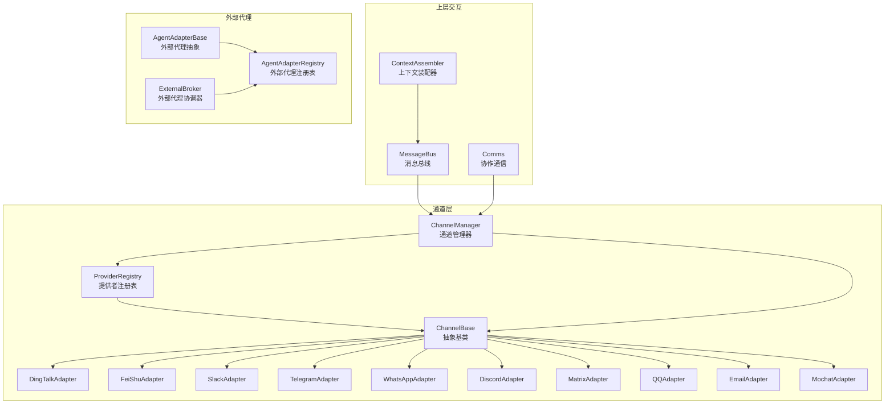
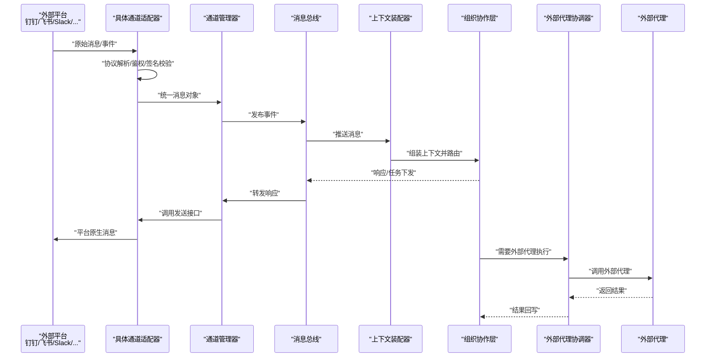
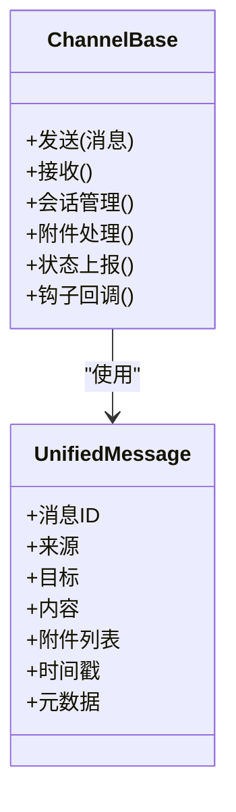
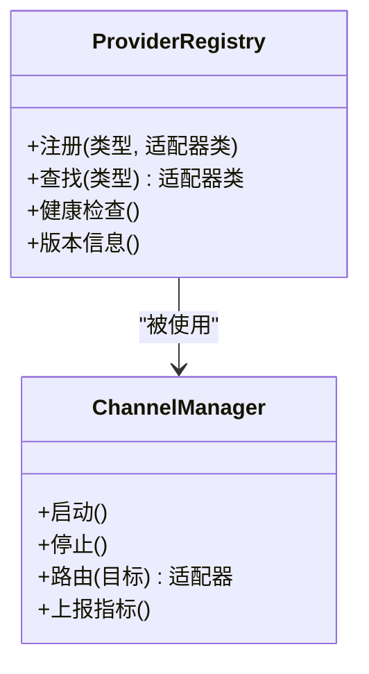
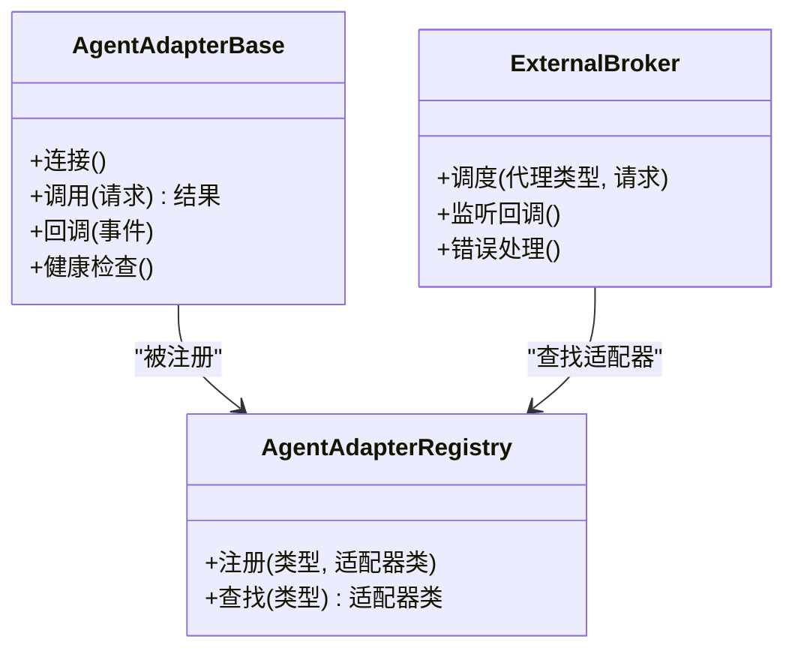
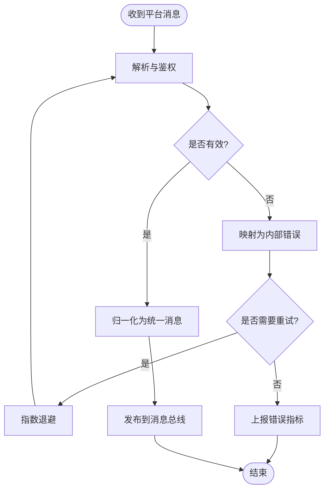
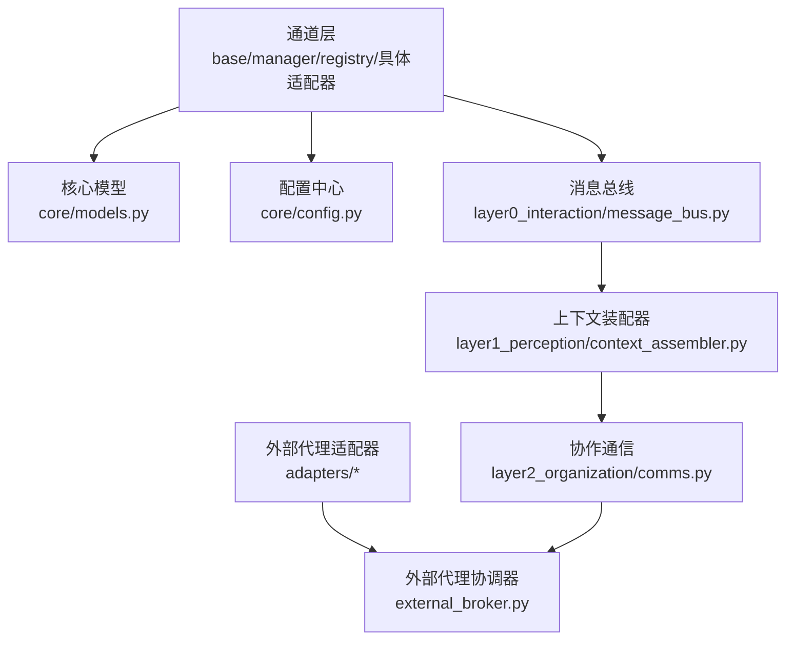

# 适配器模式

<cite>
**本文引用的文件**   
- [opc/channels/base.py](file://opc/channels/base.py)
- [opc/channels/manager.py](file://opc/channels/manager.py)
- [opc/channels/provider_base.py](file://opc/channels/provider_base.py)
- [opc/channels/provider_registry.py](file://opc/channels/provider_registry.py)
- [opc/channels/dingtalk.py](file://opc/channels/dingtalk.py)
- [opc/channels/discord.py](file://opc/channels/discord.py)
- [opc/channels/email.py](file://opc/channels/email.py)
- [opc/channels/feishu.py](file://opc/channels/feishu.py)
- [opc/channels/matrix.py](file://opc/channels/matrix.py)
- [opc/channels/mochat.py](file://opc/channels/mochat.py)
- [opc/channels/qq.py](file://opc/channels/qq.py)
- [opc/channels/slack.py](file://opc/channels/slack.py)
- [opc/channels/telegram.py](file://opc/channels/telegram.py)
- [opc/channels/whatsapp.py](file://opc/channels/whatsapp.py)
- [config/channel_config.yaml](file://config/channel_config.yaml)
- [opc/core/models.py](file://opc/core/models.py)
- [opc/core/config.py](file://opc/core/config.py)
- [opc/layer0_interaction/message_bus.py](file://opc/layer0_interaction/message_bus.py)
- [opc/layer1_perception/context_assembler.py](file://opc/layer1_perception/context_assembler.py)
- [opc/layer2_organization/comms.py](file://opc/layer2_organization/comms.py)
- [opc/layer3_agent/adapters/base.py](file://opc/layer3_agent/adapters/base.py)
- [opc/layer3_agent/adapters/registry.py](file://opc/layer3_agent/adapters/registry.py)
- [opc/layer3_agent/external_broker.py](file://opc/layer3_agent/external_broker.py)
- [tests/test_channel_contracts.py](file://tests/test_channel_contracts.py)
- [tests/test_channels.py](file://tests/test_channels.py)
</cite>

## 目录
1. [引言](#引言)
2. [项目结构](#项目结构)
3. [核心组件](#核心组件)
4. [架构总览](#架构总览)
5. [详细组件分析](#详细组件分析)
6. [依赖分析](#依赖分析)
7. [性能考虑](#性能考虑)
8. [故障排查指南](#故障排查指南)
9. [结论](#结论)
10. [附录](#附录)

## 引言
本技术文档围绕 OpenOPC 的“适配器模式”展开，聚焦于多通道集成与外部代理适配。文档将深入解析 ChannelBase 抽象类的设计与具体通道适配器的实现，说明如何通过统一的消息格式抽象屏蔽不同通信平台（如钉钉、飞书、Slack、Telegram、WhatsApp、Discord、Matrix、Email 等）的差异；同时覆盖外部代理适配器的设计与接入方式。此外，文档还将阐述适配器配置管理、错误映射与协议转换机制，并提供适配器开发的标准化流程与测试策略，帮助读者快速扩展新的通信渠道与外部代理。

## 项目结构
OpenOPC 在通道层采用“抽象基类 + 具体适配器 + 注册表 + 管理器”的分层设计：
- 抽象基类定义统一的通道接口与消息模型
- 具体通道适配器实现各平台的差异细节
- 提供者注册表负责动态发现与实例化
- 通道管理器提供生命周期与路由能力
- 上层通过统一消息总线与上下文装配器消费通道事件
- 外部代理适配器遵循类似的抽象与注册机制

图表来源
- [opc/channels/base.py](file://opc/channels/base.py)
- [opc/channels/provider_registry.py](file://opc/channels/provider_registry.py)
- [opc/channels/manager.py](file://opc/channels/manager.py)
- [opc/channels/dingtalk.py](file://opc/channels/dingtalk.py)
- [opc/channels/feishu.py](file://opc/channels/feishu.py)
- [opc/channels/slack.py](file://opc/channels/slack.py)
- [opc/channels/telegram.py](file://opc/channels/telegram.py)
- [opc/channels/whatsapp.py](file://opc/channels/whatsapp.py)
- [opc/channels/discord.py](file://opc/channels/discord.py)
- [opc/channels/matrix.py](file://opc/channels/matrix.py)
- [opc/channels/qq.py](file://opc/channels/qq.py)
- [opc/channels/email.py](file://opc/channels/email.py)
- [opc/channels/mochat.py](file://opc/channels/mochat.py)
- [opc/layer0_interaction/message_bus.py](file://opc/layer0_interaction/message_bus.py)
- [opc/layer1_perception/context_assembler.py](file://opc/layer1_perception/context_assembler.py)
- [opc/layer2_organization/comms.py](file://opc/layer2_organization/comms.py)
- [opc/layer3_agent/adapters/base.py](file://opc/layer3_agent/adapters/base.py)
- [opc/layer3_agent/adapters/registry.py](file://opc/layer3_agent/adapters/registry.py)
- [opc/layer3_agent/external_broker.py](file://opc/layer3_agent/external_broker.py)

章节来源
- [opc/channels/base.py](file://opc/channels/base.py)
- [opc/channels/provider_registry.py](file://opc/channels/provider_registry.py)
- [opc/channels/manager.py](file://opc/channels/manager.py)
- [opc/layer0_interaction/message_bus.py](file://opc/layer0_interaction/message_bus.py)
- [opc/layer1_perception/context_assembler.py](file://opc/layer1_perception/context_assembler.py)
- [opc/layer2_organization/comms.py](file://opc/layer2_organization/comms.py)
- [opc/layer3_agent/adapters/base.py](file://opc/layer3_agent/adapters/base.py)
- [opc/layer3_agent/adapters/registry.py](file://opc/layer3_agent/adapters/registry.py)
- [opc/layer3_agent/external_broker.py](file://opc/layer3_agent/external_broker.py)

## 核心组件
本节从抽象到实现，梳理通道适配器的关键构件及其职责。

- ChannelBase 抽象基类
  - 定义统一通道接口：发送、接收、会话管理、附件处理、状态上报等
  - 提供通用校验、重试、超时、幂等性保障等横切逻辑
  - 暴露标准事件与回调钩子，便于上层订阅与编排

- ProviderRegistry 提供者注册表
  - 维护通道类型到适配器实现的映射
  - 支持按配置动态加载与实例化
  - 提供健康检查与版本兼容信息

- ChannelManager 通道管理器
  - 管理通道生命周期：启动、停止、重启
  - 负责路由与分发：根据目标标识选择具体通道
  - 聚合错误与指标，统一上报

- 具体通道适配器
  - 钉钉、飞书、Slack、Telegram、WhatsApp、Discord、Matrix、QQ、Email、Mochat 等
  - 各自封装平台 SDK/HTTP/WebSocket 差异，转换为统一消息模型

- 外部代理适配器
  - AgentAdapterBase 抽象外部代理适配器
  - AgentAdapterRegistry 注册外部代理
  - ExternalBroker 协调外部代理的调用与结果回传

章节来源
- [opc/channels/base.py](file://opc/channels/base.py)
- [opc/channels/provider_registry.py](file://opc/channels/provider_registry.py)
- [opc/channels/manager.py](file://opc/channels/manager.py)
- [opc/channels/dingtalk.py](file://opc/channels/dingtalk.py)
- [opc/channels/feishu.py](file://opc/channels/feishu.py)
- [opc/channels/slack.py](file://opc/channels/slack.py)
- [opc/channels/telegram.py](file://opc/channels/telegram.py)
- [opc/channels/whatsapp.py](file://opc/channels/whatsapp.py)
- [opc/channels/discord.py](file://opc/channels/discord.py)
- [opc/channels/matrix.py](file://opc/channels/matrix.py)
- [opc/channels/qq.py](file://opc/channels/qq.py)
- [opc/channels/email.py](file://opc/channels/email.py)
- [opc/channels/mochat.py](file://opc/channels/mochat.py)
- [opc/layer3_agent/adapters/base.py](file://opc/layer3_agent/adapters/base.py)
- [opc/layer3_agent/adapters/registry.py](file://opc/layer3_agent/adapters/registry.py)
- [opc/layer3_agent/external_broker.py](file://opc/layer3_agent/external_broker.py)

## 架构总览
下图展示从外部平台到内部处理的端到端数据流，以及外部代理适配器的协同路径。

图表来源
- [opc/channels/manager.py](file://opc/channels/manager.py)
- [opc/layer0_interaction/message_bus.py](file://opc/layer0_interaction/message_bus.py)
- [opc/layer1_perception/context_assembler.py](file://opc/layer1_perception/context_assembler.py)
- [opc/layer2_organization/comms.py](file://opc/layer2_organization/comms.py)
- [opc/layer3_agent/external_broker.py](file://opc/layer3_agent/external_broker.py)

## 详细组件分析

### 抽象基类与统一消息模型
- ChannelBase 抽象基类
  - 职责：定义通道契约、通用能力（重试、超时、鉴权）、事件钩子、附件处理、会话绑定
  - 关键点：所有具体适配器必须实现的最小方法集；保证上层对通道的使用一致
- 统一消息模型
  - 通过 core.models 中的消息实体进行跨平台归一化
  - 字段涵盖：消息 ID、来源、目标、内容、附件、时间戳、元数据等
  - 优势：屏蔽平台差异，简化上层处理逻辑

图表来源
- [opc/channels/base.py](file://opc/channels/base.py)
- [opc/core/models.py](file://opc/core/models.py)

章节来源
- [opc/channels/base.py](file://opc/channels/base.py)
- [opc/core/models.py](file://opc/core/models.py)

### 提供者注册表与通道管理器
- ProviderRegistry
  - 维护通道类型到适配器类的映射
  - 支持按名称或标签查找、健康检查、版本信息
- ChannelManager
  - 生命周期管理：初始化、启动、停止、热重载
  - 路由与分发：根据目标标识选择具体适配器
  - 错误聚合与指标上报

图表来源
- [opc/channels/provider_registry.py](file://opc/channels/provider_registry.py)
- [opc/channels/manager.py](file://opc/channels/manager.py)

章节来源
- [opc/channels/provider_registry.py](file://opc/channels/provider_registry.py)
- [opc/channels/manager.py](file://opc/channels/manager.py)

### 具体通道适配器示例
以下为典型通道适配器的职责与差异点（不展示代码内容，仅给出路径参考）：
- 钉钉适配器：处理企业级鉴权、群聊与单聊路由、富文本与卡片消息
- 飞书适配器：处理开放平台 API、事件订阅、多媒体附件
- Slack 适配器：处理 Bolt/SDK、频道与用户映射、线程消息
- Telegram 适配器：处理 Bot API、Inline 键盘、媒体下载
- WhatsApp 适配器：处理云 API 或第三方网关、模板消息、回执
- Discord 适配器：处理 REST/Gateway、角色权限、嵌入消息
- Matrix 适配器：处理 Homeserver 同步、房间与会话
- QQ 适配器：处理官方/第三方接口、群与私聊
- Email 适配器：处理 IMAP/SMTP、主题与正文、附件
- Mochat 适配器：处理私有化部署协议、自定义事件

章节来源
- [opc/channels/dingtalk.py](file://opc/channels/dingtalk.py)
- [opc/channels/feishu.py](file://opc/channels/feishu.py)
- [opc/channels/slack.py](file://opc/channels/slack.py)
- [opc/channels/telegram.py](file://opc/channels/telegram.py)
- [opc/channels/whatsapp.py](file://opc/channels/whatsapp.py)
- [opc/channels/discord.py](file://opc/channels/discord.py)
- [opc/channels/matrix.py](file://opc/channels/matrix.py)
- [opc/channels/qq.py](file://opc/channels/qq.py)
- [opc/channels/email.py](file://opc/channels/email.py)
- [opc/channels/mochat.py](file://opc/channels/mochat.py)

### 外部代理适配器
外部代理适配器用于对接非内置的智能体或工具系统，遵循与通道适配器相似的抽象与注册机制：
- AgentAdapterBase：定义外部代理的统一接口（连接、调用、结果回调、健康检查）
- AgentAdapterRegistry：注册与发现外部代理适配器
- ExternalBroker：协调外部代理的执行、重试、超时与结果回写

图表来源
- [opc/layer3_agent/adapters/base.py](file://opc/layer3_agent/adapters/base.py)
- [opc/layer3_agent/adapters/registry.py](file://opc/layer3_agent/adapters/registry.py)
- [opc/layer3_agent/external_broker.py](file://opc/layer3_agent/external_broker.py)

章节来源
- [opc/layer3_agent/adapters/base.py](file://opc/layer3_agent/adapters/base.py)
- [opc/layer3_agent/adapters/registry.py](file://opc/layer3_agent/adapters/registry.py)
- [opc/layer3_agent/external_broker.py](file://opc/layer3_agent/external_broker.py)

### 协议转换与错误映射
- 协议转换
  - 入口：具体通道适配器接收平台原生消息
  - 处理：鉴权校验、签名验证、去重、格式归一化
  - 输出：构造统一消息对象，附加元数据（来源、时间戳、会话标识）
- 错误映射
  - 平台错误码 -> 内部错误类型
  - 重试策略：指数退避、最大重试次数、熔断开关
  - 可观测性：错误分类、指标上报、日志追踪

图表来源
- [opc/channels/base.py](file://opc/channels/base.py)
- [opc/layer0_interaction/message_bus.py](file://opc/layer0_interaction/message_bus.py)

章节来源
- [opc/channels/base.py](file://opc/channels/base.py)
- [opc/layer0_interaction/message_bus.py](file://opc/layer0_interaction/message_bus.py)

### 适配器配置管理
- 配置文件：channel_config.yaml
  - 包含通道类型、启用标志、认证参数、限流与重试策略、路由规则等
- 配置加载：core.config
  - 读取 YAML 配置，注入到通道管理器与注册表
  - 支持运行时热更新与灰度切换
- 最佳实践
  - 区分环境配置（开发/测试/生产）
  - 敏感信息通过环境变量或密钥管理服务注入
  - 配置变更需配合健康检查与回滚策略

章节来源
- [config/channel_config.yaml](file://config/channel_config.yaml)
- [opc/core/config.py](file://opc/core/config.py)

## 依赖分析
通道层与上层模块之间的依赖关系如下：

图表来源
- [opc/channels/base.py](file://opc/channels/base.py)
- [opc/channels/manager.py](file://opc/channels/manager.py)
- [opc/channels/provider_registry.py](file://opc/channels/provider_registry.py)
- [opc/core/models.py](file://opc/core/models.py)
- [opc/core/config.py](file://opc/core/config.py)
- [opc/layer0_interaction/message_bus.py](file://opc/layer0_interaction/message_bus.py)
- [opc/layer1_perception/context_assembler.py](file://opc/layer1_perception/context_assembler.py)
- [opc/layer2_organization/comms.py](file://opc/layer2_organization/comms.py)
- [opc/layer3_agent/adapters/base.py](file://opc/layer3_agent/adapters/base.py)
- [opc/layer3_agent/external_broker.py](file://opc/layer3_agent/external_broker.py)

章节来源
- [opc/channels/base.py](file://opc/channels/base.py)
- [opc/channels/manager.py](file://opc/channels/manager.py)
- [opc/channels/provider_registry.py](file://opc/channels/provider_registry.py)
- [opc/core/models.py](file://opc/core/models.py)
- [opc/core/config.py](file://opc/core/config.py)
- [opc/layer0_interaction/message_bus.py](file://opc/layer0_interaction/message_bus.py)
- [opc/layer1_perception/context_assembler.py](file://opc/layer1_perception/context_assembler.py)
- [opc/layer2_organization/comms.py](file://opc/layer2_organization/comms.py)
- [opc/layer3_agent/adapters/base.py](file://opc/layer3_agent/adapters/base.py)
- [opc/layer3_agent/external_broker.py](file://opc/layer3_agent/external_broker.py)

## 性能考虑
- 并发与队列
  - 通道适配器应使用异步 I/O 与消息队列，避免阻塞主循环
  - 合理设置消费者数量与批处理大小
- 缓存与去重
  - 基于消息 ID 的去重缓存，防止重复处理
  - 热点会话的上下文缓存，减少重复加载
- 重试与背压
  - 指数退避与抖动，避免雪崩
  - 背压控制：当下游处理能力不足时，限制上游拉取速率
- 资源隔离
  - 每个通道适配器独立连接池与线程池
  - 限流与熔断保护外部平台 API

[本节为通用指导，无需特定文件引用]

## 故障排查指南
- 常见问题定位
  - 通道无法启动：检查配置项与健康检查接口
  - 消息丢失：确认去重与持久化策略
  - 延迟过高：观察队列堆积与消费者吞吐
  - 外部代理失败：查看协调器日志与重试计数
- 诊断手段
  - 启用调试日志与链路追踪
  - 使用单元测试与集成测试复现问题
  - 监控指标：成功率、延迟分布、错误分类
- 恢复策略
  - 自动重试与降级
  - 配置热更新与灰度发布
  - 快速回滚与快照恢复

章节来源
- [tests/test_channel_contracts.py](file://tests/test_channel_contracts.py)
- [tests/test_channels.py](file://tests/test_channels.py)

## 结论
通过 ChannelBase 抽象与统一消息模型，OpenOPC 实现了跨平台通道的解耦与可扩展；ProviderRegistry 与 ChannelManager 提供了稳定的生命周期管理与路由能力；外部代理适配器则进一步扩展了系统的智能体生态。结合完善的配置管理、错误映射与协议转换机制，开发者可以以标准化的流程快速接入新渠道与外部代理，并通过系统化测试保障质量与稳定性。

[本节为总结性内容，无需特定文件引用]

## 附录

### 适配器开发标准化流程
- 需求分析与边界定义
  - 明确平台特性、能力边界与约束条件
- 抽象与契约
  - 继承 ChannelBase 或 AgentAdapterBase，实现最小必要接口
  - 定义统一消息模型字段与元数据规范
- 实现与适配
  - 完成协议解析、鉴权、去重、归一化
  - 实现错误映射与重试策略
- 配置与注册
  - 在 channel_config.yaml 中声明通道类型与参数
  - 在 ProviderRegistry 或 AgentAdapterRegistry 中注册适配器
- 测试与验证
  - 编写单元测试与集成测试，覆盖正常与异常路径
  - 进行性能基准与压力测试
- 上线与运维
  - 灰度发布、健康检查、监控告警
  - 配置热更新与回滚预案

[本节为流程指导，无需特定文件引用]

### 测试策略
- 单元测试
  - 针对适配器核心方法进行断言
  - Mock 外部平台 SDK 与网络依赖
- 集成测试
  - 端到端消息收发验证
  - 配置加载与注册表行为验证
- 契约测试
  - 确保适配器满足 ChannelBase 契约
- 回归与冒烟
  - 自动化流水线中的稳定用例集合

章节来源
- [tests/test_channel_contracts.py](file://tests/test_channel_contracts.py)
- [tests/test_channels.py](file://tests/test_channels.py)