# API契约与协议

<cite>
**本文引用的文件**   
- [opc/layer0_interaction/message_bus.py](file://opc/layer0_interaction/message_bus.py)
- [opc/layer4_tools/collaboration_rpc.py](file://opc/layer4_tools/collaboration_rpc.py)
- [opc/plugins/office_ui/ws_handler.py](file://opc/plugins/office_ui/ws_handler.py)
- [opc/plugins/office_ui/services/comms.py](file://opc/plugins/office_ui/services/comms.py)
- [opc/channels/base.py](file://opc/channels/base.py)
- [opc/channels/manager.py](file://opc/channels/manager.py)
- [opc/core/models.py](file://opc/core/models.py)
- [opc/core/events.py](file://opc/core/events.py)
- [opc/core/config.py](file://opc/core/config.py)
- [opc/database/store.py](file://opc/database/store.py)
- [opc/llm/retry.py](file://opc/llm/retry.py)
- [opc/layer2_organization/gate_harness.py](file://opc/layer2_organization/gate_harness.py)
- [opc/layer2_organization/org_engine.py](file://opc/layer2_organization/org_engine.py)
- [opc/layer3_agent/external_broker.py](file://opc/layer3_agent/external_broker.py)
- [opc/layer4_tools/execution_context.py](file://opc/layer4_tools/execution_context.py)
- [opc/layer6_observability/opc_logger.py](file://opc/layer6_observability/opc_logger.py)
</cite>

## 目录
1. [简介](#简介)
2. [项目结构](#项目结构)
3. [核心组件](#核心组件)
4. [架构总览](#架构总览)
5. [详细组件分析](#详细组件分析)
6. [依赖分析](#依赖分析)
7. [性能考虑](#性能考虑)
8. [故障排查指南](#故障排查指南)
9. [结论](#结论)
10. [附录](#附录)

## 简介
本规范面向OpenOPC的API契约与协议，定义系统内部接口契约、消息总线协议与数据模型规范，覆盖REST API端点、WebSocket事件格式与RPC调用约定。文档同时给出请求响应Schema定义、错误码规范、版本兼容策略，并提供API客户端集成指南（SDK使用示例、重试机制与超时配置）、API网关配置建议、限流策略与安全认证机制说明。

## 项目结构
OpenOPC采用分层架构：
- 层0交互：消息总线与跨进程通信
- 层1感知：上下文组装与任务路由
- 层2组织：协作、审批、阶段与编排引擎
- 层3代理：外部代理适配与运行时
- 层4工具：执行上下文、工具注册与协作RPC
- 层5记忆：持久化与历史压缩
- 层6可观测性：日志与成本追踪
- 插件：Office UI（含WebSocket处理与服务）

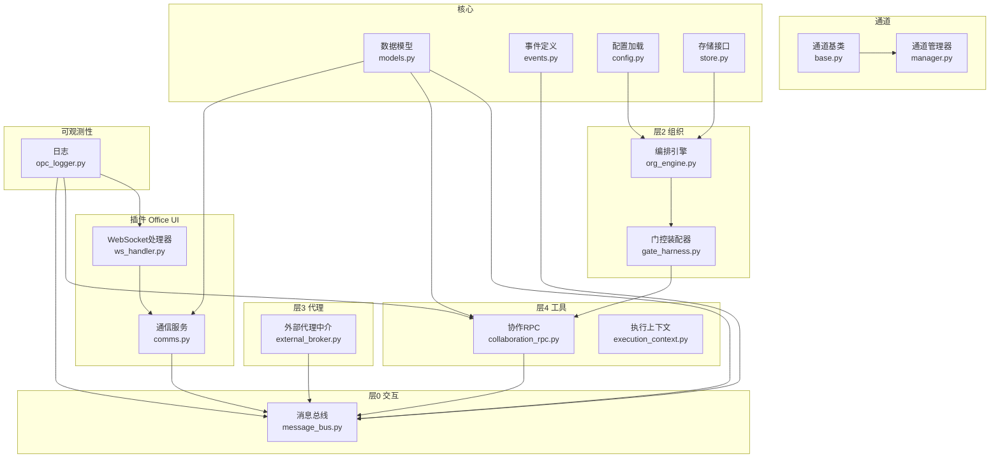

图表来源
- [opc/layer0_interaction/message_bus.py](file://opc/layer0_interaction/message_bus.py)
- [opc/layer2_organization/org_engine.py](file://opc/layer2_organization/org_engine.py)
- [opc/layer2_organization/gate_harness.py](file://opc/layer2_organization/gate_harness.py)
- [opc/layer3_agent/external_broker.py](file://opc/layer3_agent/external_broker.py)
- [opc/layer4_tools/collaboration_rpc.py](file://opc/layer4_tools/collaboration_rpc.py)
- [opc/layer4_tools/execution_context.py](file://opc/layer4_tools/execution_context.py)
- [opc/plugins/office_ui/ws_handler.py](file://opc/plugins/office_ui/ws_handler.py)
- [opc/plugins/office_ui/services/comms.py](file://opc/plugins/office_ui/services/comms.py)
- [opc/channels/base.py](file://opc/channels/base.py)
- [opc/channels/manager.py](file://opc/channels/manager.py)
- [opc/core/models.py](file://opc/core/models.py)
- [opc/core/events.py](file://opc/core/events.py)
- [opc/core/config.py](file://opc/core/config.py)
- [opc/database/store.py](file://opc/database/store.py)
- [opc/layer6_observability/opc_logger.py](file://opc/layer6_observability/opc_logger.py)

章节来源
- [opc/layer0_interaction/message_bus.py](file://opc/layer0_interaction/message_bus.py)
- [opc/plugins/office_ui/ws_handler.py](file://opc/plugins/office_ui/ws_handler.py)
- [opc/plugins/office_ui/services/comms.py](file://opc/plugins/office_ui/services/comms.py)
- [opc/layer4_tools/collaboration_rpc.py](file://opc/layer4_tools/collaboration_rpc.py)
- [opc/channels/base.py](file://opc/channels/base.py)
- [opc/channels/manager.py](file://opc/channels/manager.py)
- [opc/core/models.py](file://opc/core/models.py)
- [opc/core/events.py](file://opc/core/events.py)
- [opc/core/config.py](file://opc/core/config.py)
- [opc/database/store.py](file://opc/database/store.py)
- [opc/layer6_observability/opc_logger.py](file://opc/layer6_observability/opc_logger.py)

## 核心组件
- 消息总线（层0）：提供发布/订阅与点对点RPC能力，承载跨模块与跨进程通信。
- 协作RPC（层4）：面向工具与组织的远程过程调用封装，基于消息总线实现。
- WebSocket处理器（插件）：对外暴露实时事件通道，将业务事件转换为前端可读的事件流。
- 通道抽象（channels）：统一多平台接入（如钉钉、飞书等），通过管理器进行生命周期管理。
- 核心模型与事件（core）：定义通用数据结构与领域事件，作为所有接口的契约基础。
- 配置与存储（core/database）：集中式配置加载与持久化接口，支撑运行时行为与状态恢复。
- 可观测性（层6）：结构化日志输出，便于问题定位与审计。

章节来源
- [opc/layer0_interaction/message_bus.py](file://opc/layer0_interaction/message_bus.py)
- [opc/layer4_tools/collaboration_rpc.py](file://opc/layer4_tools/collaboration_rpc.py)
- [opc/plugins/office_ui/ws_handler.py](file://opc/plugins/office_ui/ws_handler.py)
- [opc/plugins/office_ui/services/comms.py](file://opc/plugins/office_ui/services/comms.py)
- [opc/channels/base.py](file://opc/channels/base.py)
- [opc/channels/manager.py](file://opc/channels/manager.py)
- [opc/core/models.py](file://opc/core/models.py)
- [opc/core/events.py](file://opc/core/events.py)
- [opc/core/config.py](file://opc/core/config.py)
- [opc/database/store.py](file://opc/database/store.py)
- [opc/layer6_observability/opc_logger.py](file://opc/layer6_observability/opc_logger.py)

## 架构总览
OpenOPC以“消息总线”为核心，结合“协作RPC”和“WebSocket处理器”，形成统一的内部与外部通信体系。上层编排引擎与工具层通过RPC调用协作；外部客户端通过WebSocket订阅实时事件；通道层负责多平台接入；核心模型与事件贯穿全链路，确保契约一致性。

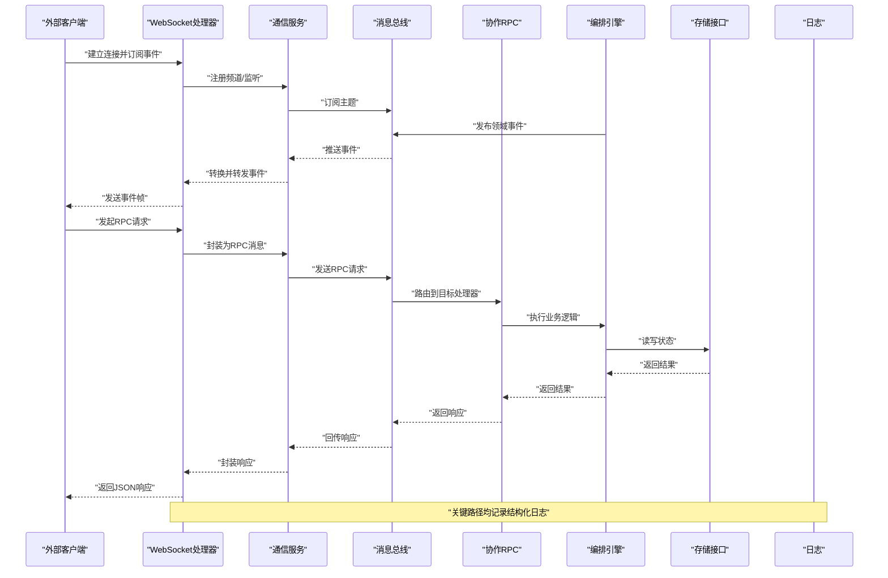

图表来源
- [opc/plugins/office_ui/ws_handler.py](file://opc/plugins/office_ui/ws_handler.py)
- [opc/plugins/office_ui/services/comms.py](file://opc/plugins/office_ui/services/comms.py)
- [opc/layer0_interaction/message_bus.py](file://opc/layer0_interaction/message_bus.py)
- [opc/layer4_tools/collaboration_rpc.py](file://opc/layer4_tools/collaboration_rpc.py)
- [opc/layer2_organization/org_engine.py](file://opc/layer2_organization/org_engine.py)
- [opc/database/store.py](file://opc/database/store.py)
- [opc/layer6_observability/opc_logger.py](file://opc/layer6_observability/opc_logger.py)

## 详细组件分析

### 消息总线协议（层0）
- 角色与职责
  - 发布者：产生事件或RPC请求
  - 订阅者：消费事件或响应RPC
  - 路由器：按主题/方法名分发消息
- 消息类型
  - 事件消息：单向广播，包含事件类型、载荷与元数据
  - RPC消息：双向请求-响应，包含方法名、参数、请求ID与超时
- 可靠性与顺序
  - 支持至少一次投递与幂等处理
  - 同主题内有序保证可选
- 错误与重试
  - 失败时进入重试队列，指数退避
  - 死信队列用于不可恢复消息

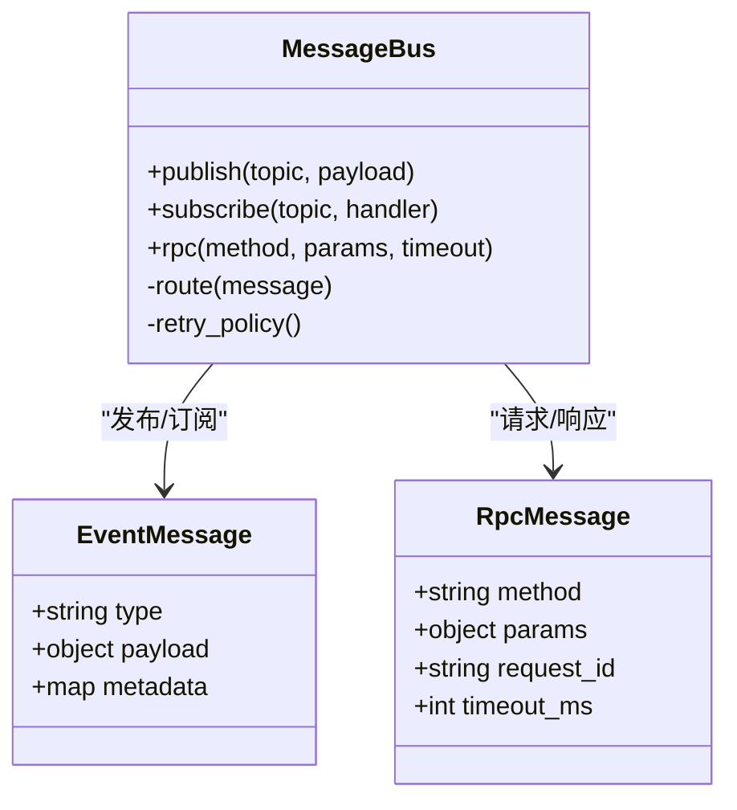

图表来源
- [opc/layer0_interaction/message_bus.py](file://opc/layer0_interaction/message_bus.py)

章节来源
- [opc/layer0_interaction/message_bus.py](file://opc/layer0_interaction/message_bus.py)

### 协作RPC（层4）
- 设计要点
  - 基于消息总线的RPC封装，提供方法注册、参数校验与结果序列化
  - 支持流式响应与增量更新
- 调用约定
  - 方法命名空间：按功能域划分（如 org、work_item、session）
  - 参数与返回值遵循核心模型
- 错误处理
  - 统一错误对象，包含错误码、消息与堆栈摘要
  - 客户端侧重试与熔断

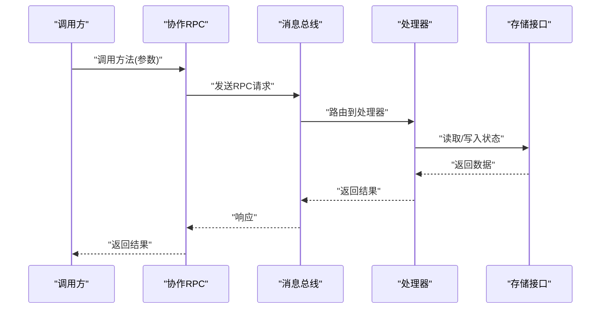

图表来源
- [opc/layer4_tools/collaboration_rpc.py](file://opc/layer4_tools/collaboration_rpc.py)
- [opc/layer0_interaction/message_bus.py](file://opc/layer0_interaction/message_bus.py)
- [opc/database/store.py](file://opc/database/store.py)

章节来源
- [opc/layer4_tools/collaboration_rpc.py](file://opc/layer4_tools/collaboration_rpc.py)

### WebSocket事件格式（插件）
- 连接与会话
  - 建立连接后需鉴权并选择频道
  - 支持心跳保活与断线重连
- 事件帧结构
  - 类型：事件/响应/控制
  - 载荷：遵循核心模型
  - 元数据：时间戳、序列号、来源
- 错误与降级
  - 网络异常自动重连
  - 服务端过载时降级为拉取模式

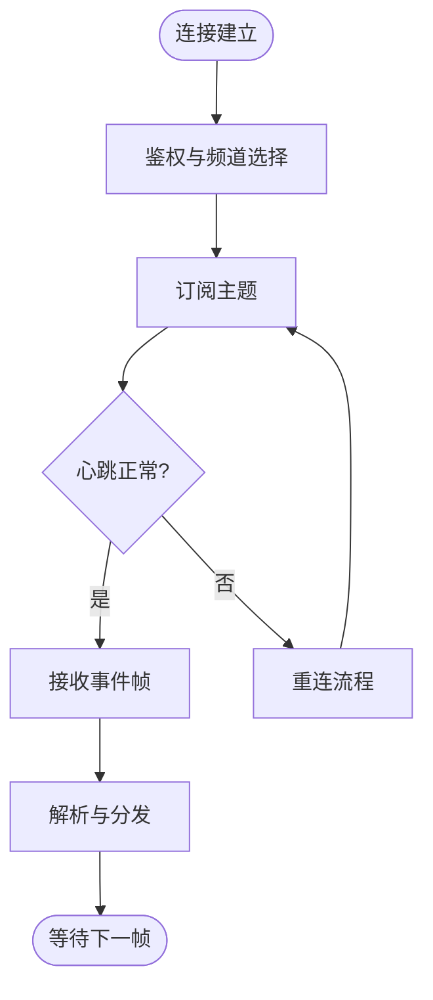

图表来源
- [opc/plugins/office_ui/ws_handler.py](file://opc/plugins/office_ui/ws_handler.py)
- [opc/plugins/office_ui/services/comms.py](file://opc/plugins/office_ui/services/comms.py)

章节来源
- [opc/plugins/office_ui/ws_handler.py](file://opc/plugins/office_ui/ws_handler.py)
- [opc/plugins/office_ui/services/comms.py](file://opc/plugins/office_ui/services/comms.py)

### REST API端点（规划）
- 端点范围
  - 会话管理、工作项查询、组织信息、工具调用
- 请求/响应Schema
  - 统一包装：{code, message, data, trace_id}
  - 分页：{page, size, total}
- 版本策略
  - URL前缀或Header指定版本
  - 向后兼容变更策略与弃用通知

[本节为概念性说明，不直接分析具体文件]

### 通道抽象与集成（channels）
- 通道基类定义统一接口：发送、接收、会话管理
- 管理器负责通道实例化、生命周期与路由
- 各平台适配器实现具体协议细节

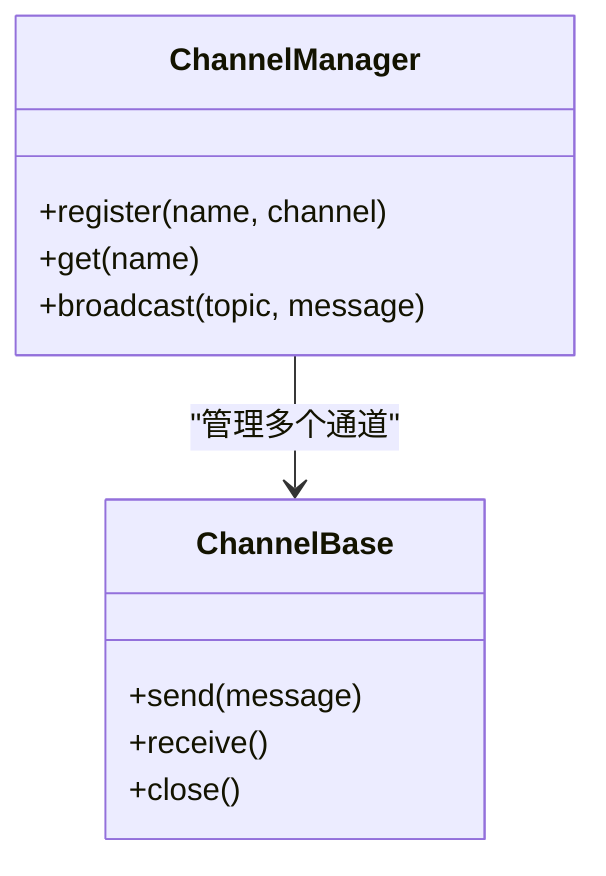

图表来源
- [opc/channels/base.py](file://opc/channels/base.py)
- [opc/channels/manager.py](file://opc/channels/manager.py)

章节来源
- [opc/channels/base.py](file://opc/channels/base.py)
- [opc/channels/manager.py](file://opc/channels/manager.py)

### 核心数据模型与事件（core）
- 数据模型
  - 会话、工作项、用户、组织等实体
  - 字段约束与枚举值在模型中声明
- 事件定义
  - 领域事件类型与载荷结构
  - 事件版本与兼容性

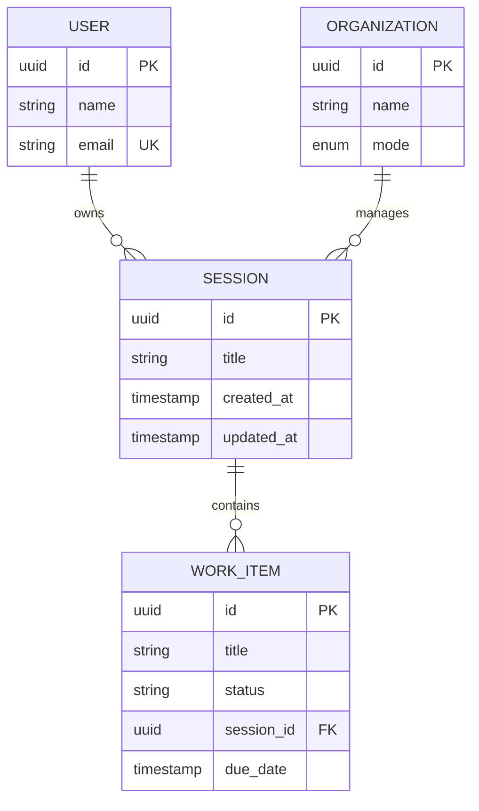

图表来源
- [opc/core/models.py](file://opc/core/models.py)
- [opc/core/events.py](file://opc/core/events.py)

章节来源
- [opc/core/models.py](file://opc/core/models.py)
- [opc/core/events.py](file://opc/core/events.py)

### 配置与存储（core/database）
- 配置加载
  - 集中式YAML/环境变量合并
  - 运行时校验与默认值
- 存储接口
  - 统一CRUD与事务边界
  - 迁移与版本管理

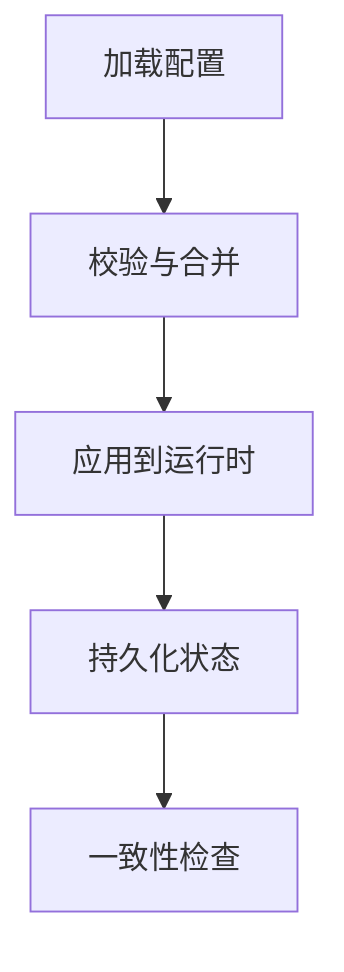

图表来源
- [opc/core/config.py](file://opc/core/config.py)
- [opc/database/store.py](file://opc/database/store.py)

章节来源
- [opc/core/config.py](file://opc/core/config.py)
- [opc/database/store.py](file://opc/database/store.py)

### 重试与容错（LLM与工具）
- 重试策略
  - 指数退避与抖动
  - 最大重试次数与超时控制
- 适用场景
  - LLM调用、外部HTTP、数据库写放大

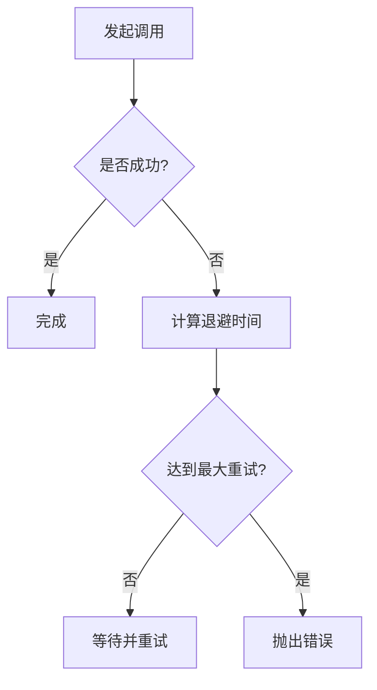

图表来源
- [opc/llm/retry.py](file://opc/llm/retry.py)

章节来源
- [opc/llm/retry.py](file://opc/llm/retry.py)

### 编排与门控（层2）
- 编排引擎负责阶段流转与工作项调度
- 门控装配器协调权限、策略与外部依赖

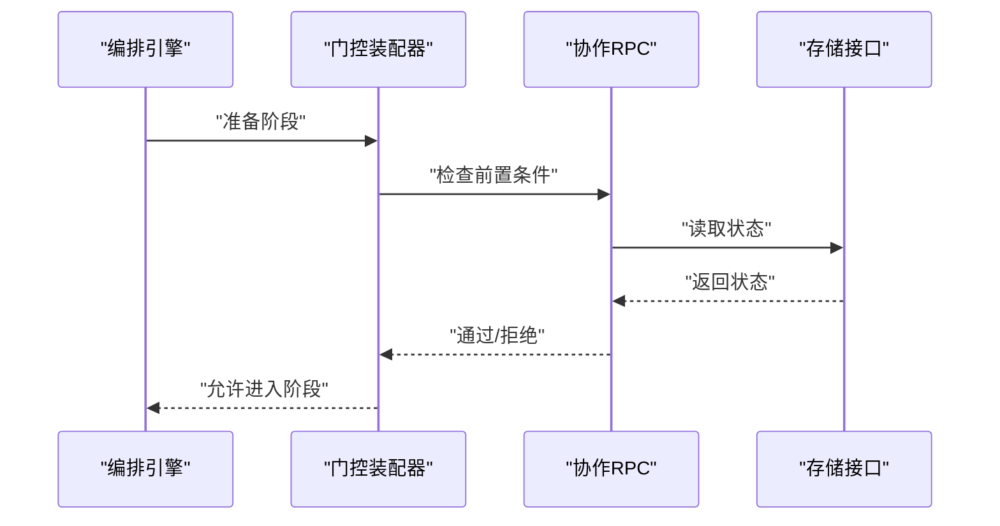

图表来源
- [opc/layer2_organization/org_engine.py](file://opc/layer2_organization/org_engine.py)
- [opc/layer2_organization/gate_harness.py](file://opc/layer2_organization/gate_harness.py)
- [opc/layer4_tools/collaboration_rpc.py](file://opc/layer4_tools/collaboration_rpc.py)
- [opc/database/store.py](file://opc/database/store.py)

章节来源
- [opc/layer2_organization/org_engine.py](file://opc/layer2_organization/org_engine.py)
- [opc/layer2_organization/gate_harness.py](file://opc/layer2_organization/gate_harness.py)

### 外部代理中介（层3）
- 负责与外部代理的握手、身份映射与消息桥接
- 支持异步回调与状态同步

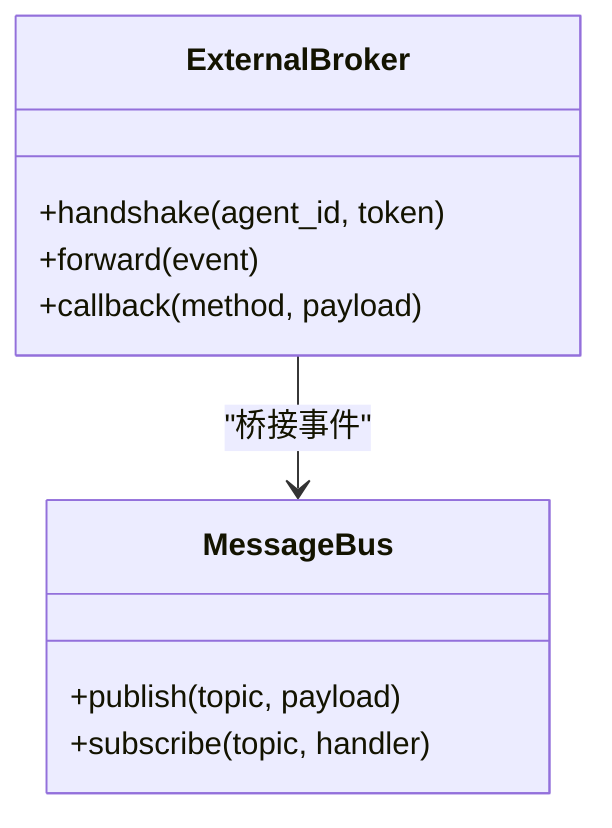

图表来源
- [opc/layer3_agent/external_broker.py](file://opc/layer3_agent/external_broker.py)
- [opc/layer0_interaction/message_bus.py](file://opc/layer0_interaction/message_bus.py)

章节来源
- [opc/layer3_agent/external_broker.py](file://opc/layer3_agent/external_broker.py)

### 执行上下文（层4）
- 维护调用链、租户、权限与资源配额
- 注入到工具与RPC处理器中

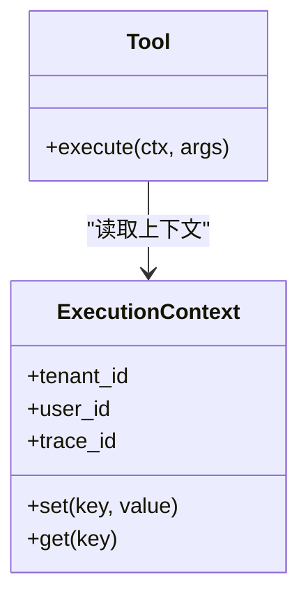

图表来源
- [opc/layer4_tools/execution_context.py](file://opc/layer4_tools/execution_context.py)

章节来源
- [opc/layer4_tools/execution_context.py](file://opc/layer4_tools/execution_context.py)

## 依赖分析
- 耦合关系
  - WebSocket处理器依赖通信服务与消息总线
  - 协作RPC依赖消息总线与存储接口
  - 编排引擎依赖门控装配器与协作RPC
- 外部依赖
  - 通道适配器依赖第三方平台SDK
  - LLM重试依赖网络库与计时器

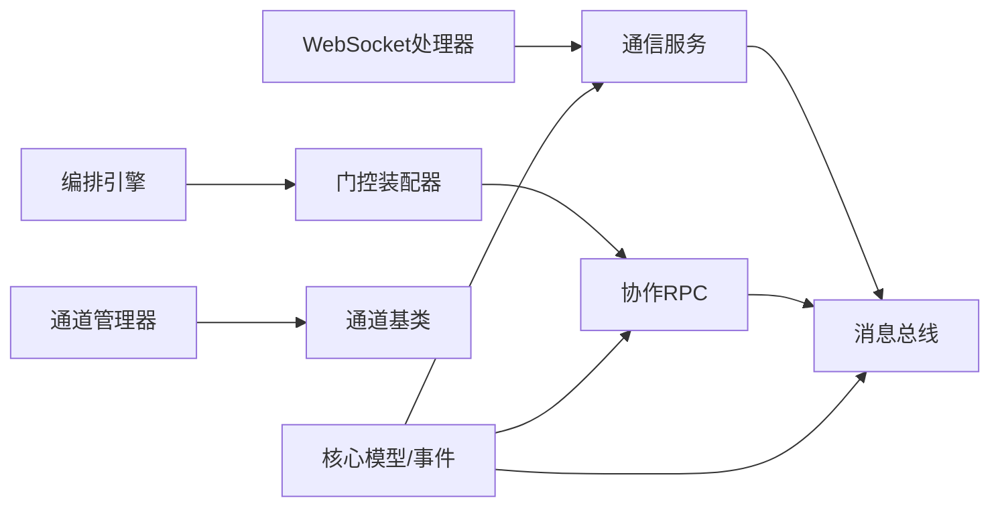

图表来源
- [opc/plugins/office_ui/ws_handler.py](file://opc/plugins/office_ui/ws_handler.py)
- [opc/plugins/office_ui/services/comms.py](file://opc/plugins/office_ui/services/comms.py)
- [opc/layer0_interaction/message_bus.py](file://opc/layer0_interaction/message_bus.py)
- [opc/layer4_tools/collaboration_rpc.py](file://opc/layer4_tools/collaboration_rpc.py)
- [opc/layer2_organization/gate_harness.py](file://opc/layer2_organization/gate_harness.py)
- [opc/layer2_organization/org_engine.py](file://opc/layer2_organization/org_engine.py)
- [opc/channels/base.py](file://opc/channels/base.py)
- [opc/channels/manager.py](file://opc/channels/manager.py)
- [opc/core/models.py](file://opc/core/models.py)
- [opc/core/events.py](file://opc/core/events.py)

章节来源
- [opc/plugins/office_ui/ws_handler.py](file://opc/plugins/office_ui/ws_handler.py)
- [opc/plugins/office_ui/services/comms.py](file://opc/plugins/office_ui/services/comms.py)
- [opc/layer0_interaction/message_bus.py](file://opc/layer0_interaction/message_bus.py)
- [opc/layer4_tools/collaboration_rpc.py](file://opc/layer4_tools/collaboration_rpc.py)
- [opc/layer2_organization/gate_harness.py](file://opc/layer2_organization/gate_harness.py)
- [opc/layer2_organization/org_engine.py](file://opc/layer2_organization/org_engine.py)
- [opc/channels/base.py](file://opc/channels/base.py)
- [opc/channels/manager.py](file://opc/channels/manager.py)
- [opc/core/models.py](file://opc/core/models.py)
- [opc/core/events.py](file://opc/core/events.py)

## 性能考虑
- 批处理与聚合：批量发布事件与合并RPC响应
- 缓存与去重：热点数据缓存与事件去重
- 背压与限流：消费者侧限流与生产者侧削峰
- 连接池与复用：数据库与外部HTTP连接复用
- 监控与指标：延迟、吞吐、错误率与资源占用

[本节为通用指导，不直接分析具体文件]

## 故障排查指南
- 常见问题
  - 连接中断：检查心跳与重连策略
  - 消息丢失：确认至少一次投递与幂等处理
  - RPC超时：调整超时与重试上限
  - 鉴权失败：核对令牌与频道权限
- 诊断手段
  - 查看结构化日志与Trace ID
  - 启用调试模式与慢查询日志
  - 使用测试脚本模拟负载

章节来源
- [opc/layer6_observability/opc_logger.py](file://opc/layer6_observability/opc_logger.py)

## 结论
本规范明确了OpenOPC的内部接口契约、消息总线协议与数据模型，定义了WebSocket事件格式与RPC调用约定，提供了错误码、版本兼容与客户端集成指南。通过分层架构与统一契约，系统具备良好的可扩展性与可维护性。

## 附录

### 错误码规范（建议）
- 全局错误码
  - 1000-1999：系统级错误（如鉴权失败、权限不足）
  - 2000-2999：业务级错误（如工作项状态非法）
  - 3000-3999：外部依赖错误（如LLM调用失败）
- 错误对象
  - code：数字错误码
  - message：人类可读描述
  - details：附加信息（可选）
  - trace_id：请求追踪ID

[本节为概念性说明，不直接分析具体文件]

### 版本兼容策略（建议）
- 版本号位置：URL前缀或请求头
- 兼容原则：新增字段向后兼容，删除字段需废弃周期
- 弃用通知：通过响应头与日志提示

[本节为概念性说明，不直接分析具体文件]

### API客户端集成指南（建议）
- SDK使用示例
  - 初始化客户端（鉴权、超时、重试）
  - 调用RPC方法与订阅事件
- 重试机制
  - 指数退避与抖动
  - 最大重试次数与熔断
- 超时配置
  - 连接超时、读超时、写超时
  - 长轮询与心跳间隔

[本节为概念性说明，不直接分析具体文件]

### API网关配置（建议）
- 路由规则：按域名或路径前缀区分版本
- 限流策略：按IP、用户或租户维度
- 安全认证：JWT/OAuth2与访问令牌轮换
- 审计与合规：请求日志与敏感字段脱敏

[本节为概念性说明，不直接分析具体文件]