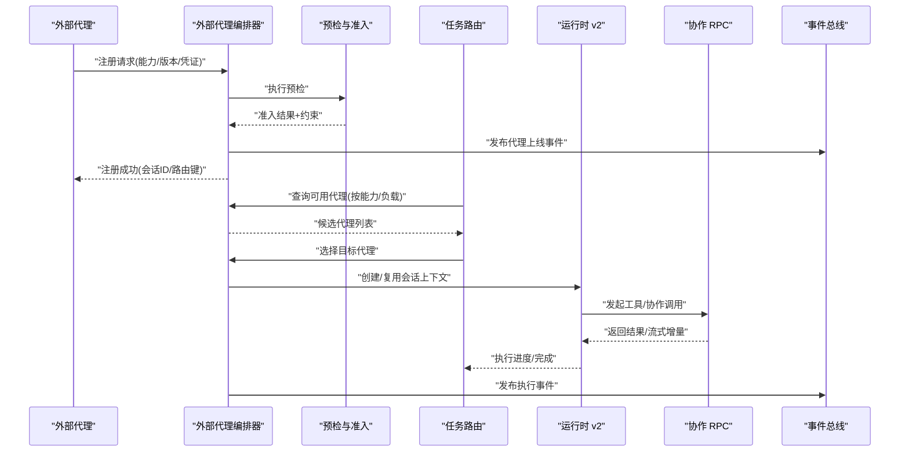
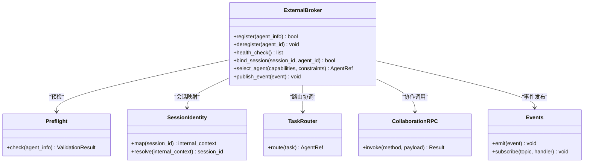
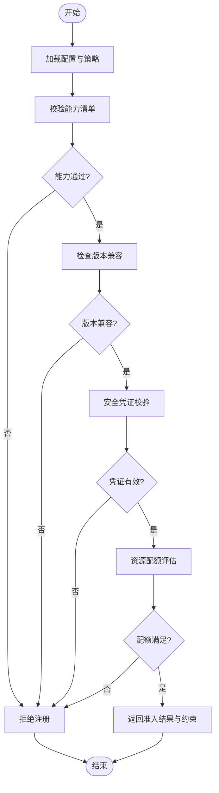
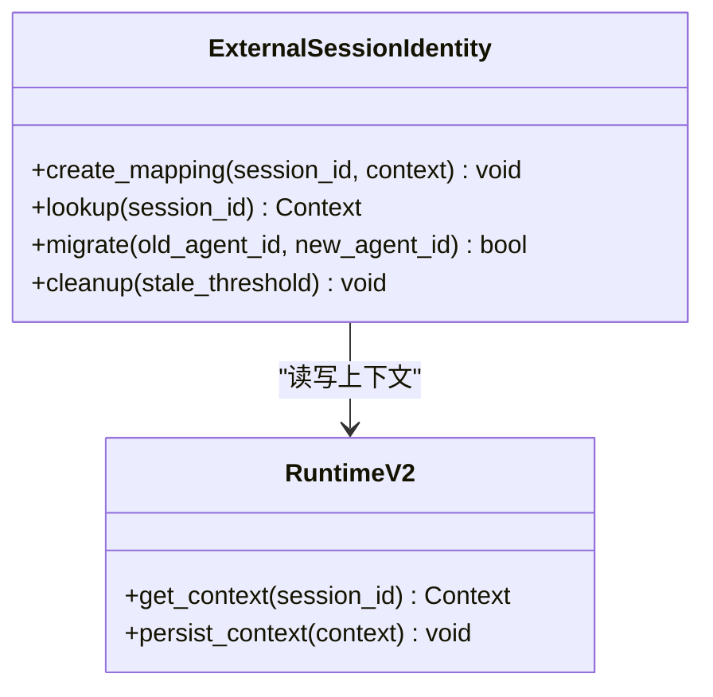
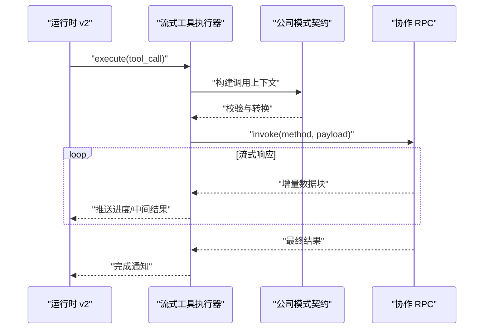
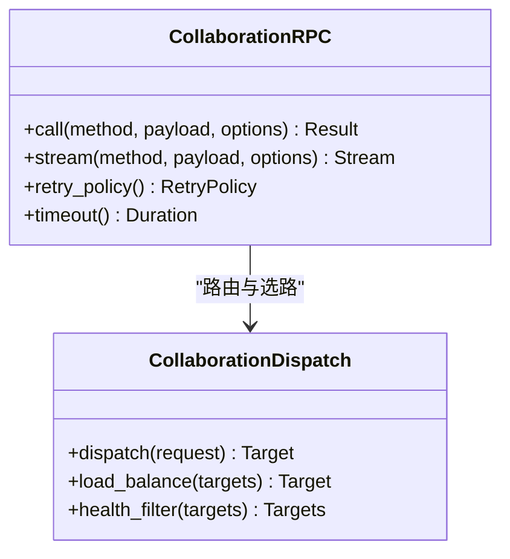
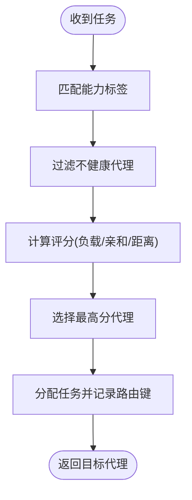
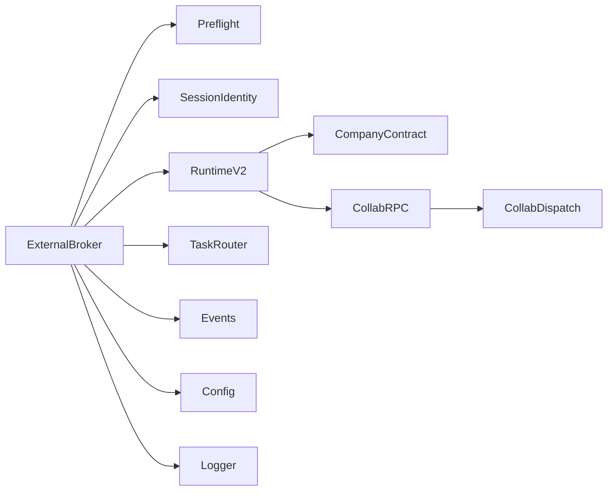

# 外部代理集成

<cite>
**本文引用的文件**   
- [opc/layer3_agent/external_broker.py](file://opc/layer3_agent/external_broker.py)
- [opc/layer3_agent/preflight.py](file://opc/layer3_agent/preflight.py)
- [opc/layer3_agent/external_session_identity.py](file://opc/layer3_agent/external_session_identity.py)
- [opc/layer3_agent/runtime_v2/runtime.py](file://opc/layer3_agent/runtime_v2/runtime.py)
- [opc/layer3_agent/runtime_v2/streaming_tool_executor.py](file://opc/layer3_agent/runtime_v2/streaming_tool_executor.py)
- [opc/layer3_agent/company_runtime_contract.py](file://opc/layer3_agent/company_runtime_contract.py)
- [opc/layer4_tools/collaboration_rpc.py](file://opc/layer4_tools/collaboration_rpc.py)
- [opc/layer4_tools/collaboration_dispatch.py](file://opc/layer4_tools/collaboration_dispatch.py)
- [opc/core/events.py](file://opc/core/events.py)
- [opc/core/models.py](file://opc/core/models.py)
- [opc/core/config.py](file://opc/core/config.py)
- [opc/layer1_perception/task_router.py](file://opc/layer1_perception/task_router.py)
- [opc/layer6_observability/opc_logger.py](file://opc/layer6_observability/opc_logger.py)
- [config/system_config.yaml](file://config/system_config.yaml)
- [config/agent_config.yaml](file://config/agent_config.yaml)
- [tests/test_external_agent_preflight.py](file://tests/test_external_agent_preflight.py)
- [tests/test_external_agent_monitoring.py](file://tests/test_external_agent_monitoring.py)
</cite>

## 目录
1. [简介](#简介)
2. [项目结构](#项目结构)
3. [核心组件](#核心组件)
4. [架构总览](#架构总览)
5. [详细组件分析](#详细组件分析)
6. [依赖关系分析](#依赖关系分析)
7. [性能考虑](#性能考虑)
8. [故障排查指南](#故障排查指南)
9. [结论](#结论)
10. [附录：外部代理开发指南](#附录外部代理开发指南)

## 简介
本文件面向需要在 OpenOPC 中集成“外部代理”的开发者与运维人员，系统性阐述以下主题：
- 外部代理注册机制、会话身份管理与预检流程
- 代理发现协议、健康检查机制与负载均衡策略
- 代理间通信协议定义、消息路由规则与状态同步机制
- 外部代理开发指南（SDK 使用、安全认证、错误处理最佳实践）
- 代理生命周期管理、资源隔离与性能监控

文档以代码级实现为依据，结合配置与测试用例，提供可操作的架构说明与排障建议。

## 项目结构
OpenOPC 将外部代理能力集中在 layer3_agent 层，并通过协作 RPC 与任务路由等模块协同工作。关键路径包括：
- 外部代理编排与注册：external_broker.py
- 预检与准入控制：preflight.py
- 会话身份映射：external_session_identity.py
- 运行时与工具执行：runtime_v2/runtime.py、streaming_tool_executor.py
- 公司模式契约与协作 RPC：company_runtime_contract.py、collaboration_rpc.py、collaboration_dispatch.py
- 事件与模型：events.py、models.py
- 配置与日志：core/config.py、layer6_observability/opc_logger.py、system_config.yaml、agent_config.yaml
- 任务路由：layer1_perception/task_router.py

```mermaid
graph TB
subgraph "外部代理"
EA["外部代理进程"]
end
subgraph "OpenOPC 服务"
EB["外部代理编排器<br/>external_broker.py"]
PF["预检与准入<br/>preflight.py"]
SID["会话身份映射<br/>external_session_identity.py"]
RT["运行时 v2<br/>runtime.py"]
STE["流式工具执行器<br/>streaming_tool_executor.py"]
CRC["公司模式契约<br/>company_runtime_contract.py"]
CRPC["协作 RPC<br/>collaboration_rpc.py"]
CDIS["协作分发<br/>collaboration_dispatch.py"]
TRT["任务路由<br/>task_router.py"]
EV["事件总线<br/>events.py"]
MDL["数据模型<br/>models.py"]
CFG["系统配置<br/>core/config.py + system_config.yaml"]
LOG["日志与观测<br/>opc_logger.py"]
end
EA < --> EB
EB --> PF
EB --> SID
EB --> RT
RT --> STE
RT --> CRC
RT --> CRPC
CRPC --> CDIS
EB --> TRT
EB --> EV
EB --> MDL
EB --> CFG
EB --> LOG
```

图表来源
- [opc/layer3_agent/external_broker.py](file://opc/layer3_agent/external_broker.py)
- [opc/layer3_agent/preflight.py](file://opc/layer3_agent/preflight.py)
- [opc/layer3_agent/external_session_identity.py](file://opc/layer3_agent/external_session_identity.py)
- [opc/layer3_agent/runtime_v2/runtime.py](file://opc/layer3_agent/runtime_v2/runtime.py)
- [opc/layer3_agent/runtime_v2/streaming_tool_executor.py](file://opc/layer3_agent/runtime_v2/streaming_tool_executor.py)
- [opc/layer3_agent/company_runtime_contract.py](file://opc/layer3_agent/company_runtime_contract.py)
- [opc/layer4_tools/collaboration_rpc.py](file://opc/layer4_tools/collaboration_rpc.py)
- [opc/layer4_tools/collaboration_dispatch.py](file://opc/layer4_tools/collaboration_dispatch.py)
- [opc/layer1_perception/task_router.py](file://opc/layer1_perception/task_router.py)
- [opc/core/events.py](file://opc/core/events.py)
- [opc/core/models.py](file://opc/core/models.py)
- [opc/core/config.py](file://opc/core/config.py)
- [config/system_config.yaml](file://config/system_config.yaml)
- [opc/layer6_observability/opc_logger.py](file://opc/layer6_observability/opc_logger.py)

章节来源
- [opc/layer3_agent/external_broker.py](file://opc/layer3_agent/external_broker.py)
- [opc/layer3_agent/preflight.py](file://opc/layer3_agent/preflight.py)
- [opc/layer3_agent/external_session_identity.py](file://opc/layer3_agent/external_session_identity.py)
- [opc/layer3_agent/runtime_v2/runtime.py](file://opc/layer3_agent/runtime_v2/runtime.py)
- [opc/layer3_agent/runtime_v2/streaming_tool_executor.py](file://opc/layer3_agent/runtime_v2/streaming_tool_executor.py)
- [opc/layer3_agent/company_runtime_contract.py](file://opc/layer3_agent/company_runtime_contract.py)
- [opc/layer4_tools/collaboration_rpc.py](file://opc/layer4_tools/collaboration_rpc.py)
- [opc/layer4_tools/collaboration_dispatch.py](file://opc/layer4_tools/collaboration_dispatch.py)
- [opc/layer1_perception/task_router.py](file://opc/layer1_perception/task_router.py)
- [opc/core/events.py](file://opc/core/events.py)
- [opc/core/models.py](file://opc/core/models.py)
- [opc/core/config.py](file://opc/core/config.py)
- [config/system_config.yaml](file://config/system_config.yaml)
- [opc/layer6_observability/opc_logger.py](file://opc/layer6_observability/opc_logger.py)

## 核心组件
- 外部代理编排器（External Broker）
  - 负责外部代理的发现、注册、心跳与健康检查、会话绑定与路由选择。
  - 与预检模块交互，确保新接入代理满足准入条件。
  - 通过事件总线发布/订阅代理状态变更，驱动上层调度。
- 预检与准入（Preflight）
  - 在注册前对代理进行能力、版本、权限与安全凭证校验。
  - 返回准入结果与约束信息，供编排器决策。
- 会话身份映射（Session Identity）
  - 维护外部会话 ID 与内部运行上下文之间的映射关系。
  - 支持跨代理迁移时的身份一致性保障。
- 运行时 v2 与流式工具执行器
  - 为外部代理提供统一的工具调用与流式输出通道。
  - 与协作 RPC 对接，完成跨代理或跨服务的工具执行。
- 公司模式契约与协作 RPC
  - 定义跨代理协作的接口契约与消息格式。
  - 提供 RPC 客户端/服务端封装，用于代理间通信。
- 任务路由
  - 根据能力标签、负载与亲和性将任务分派到合适的外部代理。
- 配置与观测
  - 通过系统配置加载代理集群参数、超时、重试、限流等策略。
  - 通过日志与指标上报实现可观测性。

章节来源
- [opc/layer3_agent/external_broker.py](file://opc/layer3_agent/external_broker.py)
- [opc/layer3_agent/preflight.py](file://opc/layer3_agent/preflight.py)
- [opc/layer3_agent/external_session_identity.py](file://opc/layer3_agent/external_session_identity.py)
- [opc/layer3_agent/runtime_v2/runtime.py](file://opc/layer3_agent/runtime_v2/runtime.py)
- [opc/layer3_agent/runtime_v2/streaming_tool_executor.py](file://opc/layer3_agent/runtime_v2/streaming_tool_executor.py)
- [opc/layer3_agent/company_runtime_contract.py](file://opc/layer3_agent/company_runtime_contract.py)
- [opc/layer4_tools/collaboration_rpc.py](file://opc/layer4_tools/collaboration_rpc.py)
- [opc/layer4_tools/collaboration_dispatch.py](file://opc/layer4_tools/collaboration_dispatch.py)
- [opc/layer1_perception/task_router.py](file://opc/layer1_perception/task_router.py)
- [opc/core/config.py](file://opc/core/config.py)
- [config/system_config.yaml](file://config/system_config.yaml)
- [opc/layer6_observability/opc_logger.py](file://opc/layer6_observability/opc_logger.py)

## 架构总览
下图展示了外部代理从注册到参与任务执行的端到端流程，涵盖预检、身份映射、路由与协作 RPC。



图表来源
- [opc/layer3_agent/external_broker.py](file://opc/layer3_agent/external_broker.py)
- [opc/layer3_agent/preflight.py](file://opc/layer3_agent/preflight.py)
- [opc/layer1_perception/task_router.py](file://opc/layer1_perception/task_router.py)
- [opc/layer3_agent/runtime_v2/runtime.py](file://opc/layer3_agent/runtime_v2/runtime.py)
- [opc/layer4_tools/collaboration_rpc.py](file://opc/layer4_tools/collaboration_rpc.py)
- [opc/core/events.py](file://opc/core/events.py)

## 详细组件分析

### 外部代理编排器（External Broker）
职责
- 代理注册与注销：接收并验证注册请求，维护代理元数据与连接句柄。
- 健康检查：周期性探测代理存活与能力可用性，更新在线状态。
- 会话绑定：将外部会话 ID 与内部运行上下文关联，支持迁移与恢复。
- 路由协调：配合任务路由选择最优代理，处理失败重试与降级。
- 事件广播：对外发布代理状态、执行进度与异常事件。

关键交互
- 与预检模块协作，确保新代理满足准入要求。
- 与运行时 v2 协作，建立会话与工具执行通道。
- 与协作 RPC 协作，完成跨代理的工具调用与结果回传。
- 与事件总线协作，驱动 UI 与上层编排逻辑。



图表来源
- [opc/layer3_agent/external_broker.py](file://opc/layer3_agent/external_broker.py)
- [opc/layer3_agent/preflight.py](file://opc/layer3_agent/preflight.py)
- [opc/layer3_agent/external_session_identity.py](file://opc/layer3_agent/external_session_identity.py)
- [opc/layer1_perception/task_router.py](file://opc/layer1_perception/task_router.py)
- [opc/layer4_tools/collaboration_rpc.py](file://opc/layer4_tools/collaboration_rpc.py)
- [opc/core/events.py](file://opc/core/events.py)

章节来源
- [opc/layer3_agent/external_broker.py](file://opc/layer3_agent/external_broker.py)
- [opc/layer3_agent/preflight.py](file://opc/layer3_agent/preflight.py)
- [opc/layer3_agent/external_session_identity.py](file://opc/layer3_agent/external_session_identity.py)
- [opc/layer1_perception/task_router.py](file://opc/layer1_perception/task_router.py)
- [opc/layer4_tools/collaboration_rpc.py](file://opc/layer4_tools/collaboration_rpc.py)
- [opc/core/events.py](file://opc/core/events.py)

### 预检与准入（Preflight）
功能要点
- 能力清单校验：确认代理声明的能力集是否被系统接受。
- 版本兼容性：检查代理版本与运行时兼容矩阵。
- 安全凭证：验证令牌、证书或共享密钥的有效性。
- 资源配额：评估 CPU/内存/并发限制是否符合策略。
- 返回约束：如最大并发、超时上限、工具白名单等。



图表来源
- [opc/layer3_agent/preflight.py](file://opc/layer3_agent/preflight.py)
- [config/system_config.yaml](file://config/system_config.yaml)
- [config/agent_config.yaml](file://config/agent_config.yaml)

章节来源
- [opc/layer3_agent/preflight.py](file://opc/layer3_agent/preflight.py)
- [config/system_config.yaml](file://config/system_config.yaml)
- [config/agent_config.yaml](file://config/agent_config.yaml)
- [tests/test_external_agent_preflight.py](file://tests/test_external_agent_preflight.py)

### 会话身份管理（Session Identity）
设计要点
- 外部会话 ID 与内部运行上下文的双向映射。
- 支持跨代理迁移时保持会话连续性。
- 与运行时 v2 的持久化存储联动，保证重启恢复。



图表来源
- [opc/layer3_agent/external_session_identity.py](file://opc/layer3_agent/external_session_identity.py)
- [opc/layer3_agent/runtime_v2/runtime.py](file://opc/layer3_agent/runtime_v2/runtime.py)

章节来源
- [opc/layer3_agent/external_session_identity.py](file://opc/layer3_agent/external_session_identity.py)
- [opc/layer3_agent/runtime_v2/runtime.py](file://opc/layer3_agent/runtime_v2/runtime.py)

### 运行时 v2 与流式工具执行器
职责
- 统一工具调用入口，屏蔽底层传输细节。
- 支持流式输出，便于实时反馈执行进度。
- 与公司模式契约对齐，确保跨代理协作语义一致。



图表来源
- [opc/layer3_agent/runtime_v2/runtime.py](file://opc/layer3_agent/runtime_v2/runtime.py)
- [opc/layer3_agent/runtime_v2/streaming_tool_executor.py](file://opc/layer3_agent/runtime_v2/streaming_tool_executor.py)
- [opc/layer3_agent/company_runtime_contract.py](file://opc/layer3_agent/company_runtime_contract.py)
- [opc/layer4_tools/collaboration_rpc.py](file://opc/layer4_tools/collaboration_rpc.py)

章节来源
- [opc/layer3_agent/runtime_v2/runtime.py](file://opc/layer3_agent/runtime_v2/runtime.py)
- [opc/layer3_agent/runtime_v2/streaming_tool_executor.py](file://opc/layer3_agent/runtime_v2/streaming_tool_executor.py)
- [opc/layer3_agent/company_runtime_contract.py](file://opc/layer3_agent/company_runtime_contract.py)
- [opc/layer4_tools/collaboration_rpc.py](file://opc/layer4_tools/collaboration_rpc.py)

### 协作 RPC 与分发（Collaboration RPC & Dispatch）
职责
- 定义跨代理/跨服务调用的消息格式与序列化方式。
- 提供重试、超时、熔断与幂等控制。
- 分发器根据方法名与路由表将请求转发至目标代理。



图表来源
- [opc/layer4_tools/collaboration_rpc.py](file://opc/layer4_tools/collaboration_rpc.py)
- [opc/layer4_tools/collaboration_dispatch.py](file://opc/layer4_tools/collaboration_dispatch.py)

章节来源
- [opc/layer4_tools/collaboration_rpc.py](file://opc/layer4_tools/collaboration_rpc.py)
- [opc/layer4_tools/collaboration_dispatch.py](file://opc/layer4_tools/collaboration_dispatch.py)

### 任务路由（Task Router）
职责
- 基于能力标签、亲和性与负载指标选择目标代理。
- 支持权重轮询、最少连接与就近原则等策略。
- 与编排器协作获取代理健康状态与容量信息。



图表来源
- [opc/layer1_perception/task_router.py](file://opc/layer1_perception/task_router.py)
- [opc/layer3_agent/external_broker.py](file://opc/layer3_agent/external_broker.py)

章节来源
- [opc/layer1_perception/task_router.py](file://opc/layer1_perception/task_router.py)
- [opc/layer3_agent/external_broker.py](file://opc/layer3_agent/external_broker.py)

## 依赖关系分析
- 外部代理编排器依赖预检、会话身份、运行时、协作 RPC、事件总线与配置。
- 运行时 v2 依赖公司模式契约与协作 RPC，以实现跨代理工具调用。
- 任务路由依赖编排器的代理健康与能力信息。
- 配置与日志贯穿各组件，提供策略与可观测性支撑。



图表来源
- [opc/layer3_agent/external_broker.py](file://opc/layer3_agent/external_broker.py)
- [opc/layer3_agent/preflight.py](file://opc/layer3_agent/preflight.py)
- [opc/layer3_agent/external_session_identity.py](file://opc/layer3_agent/external_session_identity.py)
- [opc/layer3_agent/runtime_v2/runtime.py](file://opc/layer3_agent/runtime_v2/runtime.py)
- [opc/layer3_agent/company_runtime_contract.py](file://opc/layer3_agent/company_runtime_contract.py)
- [opc/layer4_tools/collaboration_rpc.py](file://opc/layer4_tools/collaboration_rpc.py)
- [opc/layer4_tools/collaboration_dispatch.py](file://opc/layer4_tools/collaboration_dispatch.py)
- [opc/layer1_perception/task_router.py](file://opc/layer1_perception/task_router.py)
- [opc/core/events.py](file://opc/core/events.py)
- [opc/core/config.py](file://opc/core/config.py)
- [opc/layer6_observability/opc_logger.py](file://opc/layer6_observability/opc_logger.py)

章节来源
- [opc/layer3_agent/external_broker.py](file://opc/layer3_agent/external_broker.py)
- [opc/layer3_agent/preflight.py](file://opc/layer3_agent/preflight.py)
- [opc/layer3_agent/external_session_identity.py](file://opc/layer3_agent/external_session_identity.py)
- [opc/layer3_agent/runtime_v2/runtime.py](file://opc/layer3_agent/runtime_v2/runtime.py)
- [opc/layer3_agent/company_runtime_contract.py](file://opc/layer3_agent/company_runtime_contract.py)
- [opc/layer4_tools/collaboration_rpc.py](file://opc/layer4_tools/collaboration_rpc.py)
- [opc/layer4_tools/collaboration_dispatch.py](file://opc/layer4_tools/collaboration_dispatch.py)
- [opc/layer1_perception/task_router.py](file://opc/layer1_perception/task_router.py)
- [opc/core/events.py](file://opc/core/events.py)
- [opc/core/config.py](file://opc/core/config.py)
- [opc/layer6_observability/opc_logger.py](file://opc/layer6_observability/opc_logger.py)

## 性能考虑
- 连接池与复用：对外部代理的连接应复用，减少握手开销。
- 流式输出：优先使用流式工具执行器，降低大响应延迟。
- 批量与合并：聚合小任务以减少网络往返。
- 超时与重试：合理设置超时与退避策略，避免雪崩。
- 限流与背压：在协作 RPC 层实施限流，保护下游。
- 缓存热点：对只读能力与配置进行本地缓存。
- 指标采集：收集 QPS、延迟、错误率与资源占用，指导扩缩容。

[本节为通用性能建议，无需具体文件引用]

## 故障排查指南
常见问题与定位步骤
- 注册失败
  - 检查预检日志与配置项，确认能力、版本与凭证正确。
  - 查看事件总线中的注册失败事件。
- 健康检查异常
  - 核对心跳间隔与超时阈值，确认代理进程存活。
  - 观察健康检查指标与告警。
- 路由不可用
  - 检查能力标签匹配与亲和性配置。
  - 确认代理健康状态与负载评分。
- 协作 RPC 超时
  - 调整超时与重试策略，检查下游代理处理能力。
  - 查看流式执行器的进度事件。
- 会话丢失
  - 检查会话身份映射与持久化状态。
  - 确认迁移流程是否正确触发。

章节来源
- [tests/test_external_agent_preflight.py](file://tests/test_external_agent_preflight.py)
- [tests/test_external_agent_monitoring.py](file://tests/test_external_agent_monitoring.py)
- [opc/core/events.py](file://opc/core/events.py)
- [opc/layer6_observability/opc_logger.py](file://opc/layer6_observability/opc_logger.py)

## 结论
外部代理集成围绕编排器、预检、会话身份、运行时与协作 RPC 形成闭环。通过明确的路由策略、健康检查与事件驱动，系统可实现高可用与可扩展的外部代理生态。遵循本文的开发指南与最佳实践，可显著提升集成质量与稳定性。

[本节为总结性内容，无需具体文件引用]

## 附录：外部代理开发指南

### SDK 使用
- 初始化与注册
  - 构造代理实例，声明能力清单与版本信息。
  - 调用注册接口完成接入，保存返回的会话 ID 与路由键。
- 会话绑定
  - 在首次任务前建立会话映射，确保后续调用携带正确上下文。
- 工具调用
  - 使用流式工具执行器发起调用，监听增量事件。
- 注销与清理
  - 在退出前主动注销，释放资源并清理会话映射。

章节来源
- [opc/layer3_agent/external_broker.py](file://opc/layer3_agent/external_broker.py)
- [opc/layer3_agent/external_session_identity.py](file://opc/layer3_agent/external_session_identity.py)
- [opc/layer3_agent/runtime_v2/runtime.py](file://opc/layer3_agent/runtime_v2/runtime.py)
- [opc/layer3_agent/runtime_v2/streaming_tool_executor.py](file://opc/layer3_agent/runtime_v2/streaming_tool_executor.py)

### 安全认证
- 凭证类型
  - 支持令牌、证书或共享密钥，依据系统配置启用。
- 预检阶段校验
  - 在预检环节完成凭证有效性验证与权限范围限定。
- 传输安全
  - 建议使用加密通道，避免敏感信息泄露。

章节来源
- [opc/layer3_agent/preflight.py](file://opc/layer3_agent/preflight.py)
- [config/system_config.yaml](file://config/system_config.yaml)
- [config/agent_config.yaml](file://config/agent_config.yaml)

### 错误处理最佳实践
- 分类与重试
  - 区分可重试与不可重试错误，采用指数退避与熔断。
- 幂等性
  - 对工具调用实现幂等键，避免重复执行造成副作用。
- 超时与取消
  - 设置合理的超时时间，及时取消长时间挂起的调用。
- 日志与追踪
  - 记录关键事件与错误堆栈，便于问题定位。

章节来源
- [opc/layer4_tools/collaboration_rpc.py](file://opc/layer4_tools/collaboration_rpc.py)
- [opc/layer6_observability/opc_logger.py](file://opc/layer6_observability/opc_logger.py)

### 代理生命周期管理
- 启动
  - 完成预检、注册与会话绑定。
- 运行
  - 持续心跳与健康上报，处理任务与协作调用。
- 迁移
  - 在节点故障或扩容时，迁移会话与上下文到新代理。
- 关闭
  - 优雅退出，清理资源与状态。

章节来源
- [opc/layer3_agent/external_broker.py](file://opc/layer3_agent/external_broker.py)
- [opc/layer3_agent/external_session_identity.py](file://opc/layer3_agent/external_session_identity.py)
- [opc/layer3_agent/runtime_v2/runtime.py](file://opc/layer3_agent/runtime_v2/runtime.py)

### 资源隔离与性能监控
- 资源隔离
  - 为每个代理或会话分配独立资源配额，防止相互影响。
- 监控指标
  - 上报 QPS、延迟、错误率、CPU/内存占用与队列长度。
- 告警与自愈
  - 基于阈值触发告警，自动重启或迁移异常代理。

章节来源
- [config/system_config.yaml](file://config/system_config.yaml)
- [config/agent_config.yaml](file://config/agent_config.yaml)
- [opc/layer6_observability/opc_logger.py](file://opc/layer6_observability/opc_logger.py)
- [tests/test_external_agent_monitoring.py](file://tests/test_external_agent_monitoring.py)